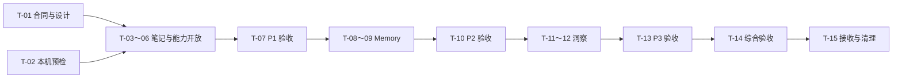

# B-140 — GPT-6 / GLM 开发任务设计

接续说明（2026-09-14）：用户已授权在指定 B-140 分支推进开发，D1 已选择主 Agent 按上下文判断、说明口径，不确定时再问。当前合同见 [Product Spec](../../../product/specs/pa-agent-essential-capabilities-product-spec.md)，执行与本机目标见 [Tracker](./tracker.md)。下文记录此前任务设计时的规划前提，未开始/待决定措辞不覆盖接续状态。

Document status: Current
Updated: 2026-09-14
Work item: B-140
Authority: 基础能力优化方案的交付分解、worker 任务草案与验收安排；不记录实施完成状态，不授予运行时或 Git/release 权限。
Proposal: [PA Agent 基础能力优化方案](./source-evidence.md)
Workflow: [GPT-6 / GLM 开发交付流程](../../workflows/gpt6-glm-delivery-workflow.md)
Task template: [GLM Worker Task](../../templates/glm-worker-task.md)

## 本轮范围与文档接续

用户于 2026-09-14 要求按项目规范、特别是 GPT + GLM 工作流细化开发任务，随后授权在 B-140 分支推进开发。沿用完整 13 项 REQ、14 项 AC 与 15 项任务编号，通用工具优先 Obsidian public API。

日期 D1 已由用户选择主 Agent 上下文判断，详见 DEC-036/Product Spec。接口在 SDD 按切片核对；只有已核对设计和预检允许的任务才能派给 worker。

本文件只保存详细派工与验收边界，Plan 保存阶段安排，实际派发修订和执行证据唯一记录于 Tracker。后续 closeout 时按信息吸收规则处理，不保留第二份任务状态。

## 工作分配

| 责任 | GPT-6 | GLM |
| --- | --- | --- |
| 产品、合同和设计 | 确定范围与不可变约束，处理用户决策，完成源代码核对后的 SDD | 仅在获派问题范围内补充证据；不能改变产品或命名技术选择 |
| 任务与状态 | 按模板生成完整任务输入；维护唯一 Tracker；把返工结论带入下一修订 | 接收当前修订，复用已有事实；不自行启动下一任务或更新权威状态 |
| 实现、测试、自查 | 独立审查设计/diff/断言，不例行重复 GLM 调查 | 一个 writer 连续完成获派实现、回归、自查和验证 |
| 构建与部署 | 指定冻结输入和实际接收/app 目标，协调共享文件 | 工具和权限预检通过后，执行获派 focused / full gate、build / deploy |
| 独立验收 | 先审真实 diff/关键断言，再核对报告和原始证据；补必要真实 App 交互 | 提交“待验收”报告，按确认的 finding 返工；不能批准自己的交付 |
| 清理 | 产物安全接收且验收后协调确定性清理 | 随创建记录资源，正常停止自己的进程/恢复临时状态；验收前保留证据 |

默认串行一个 GLM writer，不按“实现 Agent + 测试 Agent + 自查 Agent”机械拆成三份上下文。GPT 的独立阅读可与 GLM 无写入冲突的工作并行；有真实复杂状态/权限风险时，GPT 再按 review 规则安排有界只读 reviewer。所有共享源码写入仍串行。

任务卡是派发和验收边界，不要求每张卡都新建 worker 上下文。当前上下文仍有效、配置与工具未变时，由 GPT 在验收后继续派发下一张卡并复用它；每次只执行已获派的切片。只有上下文失效、范围改变或恢复风险需要时才新开 worker，并携带必要校正，避免重复阅读整个方案和重复预检。

`deliver` 用于输入清楚、沿用已验证边界的适配；`reproduce → implement` 用于本项明确触及权限、持久化或跨调用来源不变量的切片。后者只增加一个有理由的检查点：GLM 保留目标失败和测试 diff，GPT 确认后以修订任务继续实现。导入/fixture 错误不算目标红灯；已有有效证据可复用，不制造失败。仅出现新歧义时才使用 `understand`，不把所有任务先做一次重复调查。

## 统一派发字段

每张任务卡与本节共同构成任务模板内容。实际派发时 GPT 将相关内容展开成一份非空、可独立阅读的临时输入；不能只发任务编号，也不能留下影响执行的待填字段。

| 模板字段 | 本项固定安排 / 派发时必须填实的值 |
| --- | --- |
| 角色与终点 | GLM worker；仅完成当前任务/当前模式并返回待验收报告，不自动推进后继任务 |
| 当前规划基线 | `/mnt/code/personal-assistant`；源码 HEAD `fa23af5c6068e014076a8de5557e3b6aae29b4d2`。这是规划时基线，派发须核对当时实际源码、测试、配置、依赖和全部 dirty/untracked 输入 |
| 已有改动归属 | 本会话的方案、任务设计、Backlog 与 Discovery 索引由 GPT 管理；worker 不编辑。其他任务/用户改动逐路径保留，禁止 stash/reset 清理 |
| 交付工作树 | 开始实现时默认建立隔离 `codex/` 分支工作树；创建后把真实绝对路径、基线、允许变更和文档输入版本写入 Tracker/任务。当前尚未创建；未提交合同不会自动进入新 worktree，必须显式提供并核对 |
| 接收目标 | 计划接收至 `/mnt/code/personal-assistant`；先保护已有修改并核对变更归属，再接收审查通过的准确路径。源代码接收不等于 Git commit/merge/push 获授权 |
| 模型与预检 | 使用本机验证过的 `pa-glm` 独立 Codex CLI。仓库配方为 ZAI / `glm-5.3` / `max`，这不是本机已经使用该配置的证明。T-02 核对实际 provider/端点/协议、请求模型/推理、CLI/catalog、覆盖项及工具证据；服务端真实型号无证据填未知 |
| 通用必要读集 | 当前修订任务、适用 AGENTS、North Star、已接续 Spec 的对应 REQ/AC、SDD 对应小节、本任务列出的源码。已有且未变的上下文复用；新 worker 附已接受事实与校正，不要求重读整个产品/流程目录 |
| API/SDK 不可变选择 | 遵循 B-140/REQ-13 与方案的 API 映射：PA 领域复用 PA 服务，通用能力优先最低 App 支持的 Obsidian public API。派工单列明准确 API、类型来源/最低版本、可复用现有封装和必要组合缺口。不得静默改为 fs/Adapter、私有搜索/反链接口、手写通用 Markdown/YAML parser 或第二份文件/元数据索引 |
| 允许修改 | 各任务所列生产文件、对应明确测试/fixture。已有 `chat-tools.ts` 仅作 exports，不能重新变成逻辑集合。新增适配文件由 T-01 固定准确名称/职责后列入任务；不授权整个 `src/` 任意改动 |
| 生成物 | focused 任务只生成自己的日志/必要测试产物。构建任务另允许仓库标准构建产物；部署任务再明确允许实际目标 vault 的插件资产。不因允许生成物而授权改构建/发布流程 |
| 临时资源 | 每次调用使用独有 `/tmp/pa-b140-<task>-<run>/` 目录存放任务、结果、原始事件、stderr、自然退出记录及必要测试证据；实际精确路径写入任务。合成 vault 数据、进程与临时 app 设置逐项登记 |
| 依赖准备 | 核对 Node 22、npm 10/11、实际 CLI/runner 与 lockfile；已有依赖可用则复用。确需安装时由 GPT 协调到明确工作树，不改共享依赖或 lockfile来掩盖问题 |
| 派发修订 | 首次 `r1`；返工包含已接受校正、否决路径、未完成项、当前 diff 基线与旧 worker/写入进程已停止的证据。模式切换、源代码/权限范围变化都显式修订 |
| 非目标 | 不扩大 MCP/shell、附件读取、文件管理、后台维护或洞察产品；不改 Memory 来源/遗忘规则，不改 Pagelet anchor，不新增硬编码任务规划，不改用户真实笔记或凭据 |
| Git/运行纪律 | GLM 不改 authority / Tracker / 模型配置，不启动嵌套 agent，不 stage/commit/push/merge/tag/publish，不绕过 sandbox，不使用 `skip` / `forceExit` 弱化验证 |

预检和任务单齐全后才采用工作流中的 `codex exec --profile pa-glm` 调用方式。精确 CLI 参数按本机已验证帮助和配置填写；不把另一台设备的路径、权限或桌面工具直接复制过来。规划阶段不为收集模型用量或预检统计额外调用 GLM。

## 顺序、依赖与阶段退出

| 组 | 任务 | 完整结果与退出点 |
| --- | --- | --- |
| 准备 | T-01 合同/SDD；T-02 本机与任务预检 | 范围、设计和 worker 输入可执行；运行时实施授权及必需环境仍须真实具备 |
| P1 笔记基础 | T-03 正文读取；T-04 精确查询；T-05 内容搜索与结构复用；T-06 能力开放；T-07 集成与阶段验收 | 基于公开 Obsidian API 的查询/读取/结构成立；真实 Chat 可用；Pagelet anchor 与来源边界成立；四写可提议但实际受确认控制 |
| P2 Memory 管理 | T-08 只读理解/状态/使用依据；T-09 治理动作；T-10 集成与阶段验收 | 查看、明确记住、纠正、暂停/恢复、忘记/撤销按真实结果生效，跨调用和恢复不重新使用失效内容 |
| P3 洞察延续 | T-11 观察与保存资产查询；T-12 显式保存和生命周期；T-13 入口集成与阶段验收 | 有依据的洞察可明确保存、找回、归档恢复；Pagelet 普通发现与忽略不产生持久副作用 |
| P4 全项交付 | T-14 综合验收；T-15 合同同步与安全接收/清理 | 13 REQ / 14 AC 全部有证据；既有能力兼容；交付停在已验证实现，不自动 commit/closeout/release |

T-04 依赖 T-03 的来源/续读合同；T-05 复用前两项的范围与定位约定。T-06 统一串行修改 runtime 和 settings，避免多个 writer 同改公共接线。T-08、T-11 的只读合同可在前序验证等待时由 GPT 准备，但 GLM 不自行越过任务终点写后续代码。

D1 影响 T-01 的默认日期语义、T-06 对模型的日期说明、T-07 的默认日期真实任务验收；T-04 支持明确 `ctime` / `mtime` / 属性字段的接口与测试不依赖 D1。不能让未回答的 D1 悄悄变成固定优先级，也不能据此省略其它两条主线。

## 任务卡

以下状态统一为任务设计，尚未派发；不在此建立完成勾选。每个任务的实际状态、修订与证据在接续后的 Tracker 中唯一记录。

### T-01 — GPT 固定合同、设计和追溯

- **执行者 / 模式**：GPT；产品与 SDD 设计。没有需要 GLM 重复完成的全仓调查。
- **目标与对应要求**：完整接续 B-140/REQ-01、B-140/REQ-02、B-140/REQ-03、B-140/REQ-04、B-140/REQ-05、B-140/REQ-06、B-140/REQ-07、B-140/REQ-08、B-140/REQ-09、B-140/REQ-10、B-140/REQ-11、B-140/REQ-12、B-140/REQ-13，以及 B-140/AC-01 至 B-140/AC-14；不压缩成只修读取的任务。
- **必要事实**：方案已确认注册/暴露差异、Chat inspect 无通用正文、Memory 治理/Type-C/Ledger 可复用；源码未变则直接复用。现有 `task-source-read-plans`、guard、executor、context 与 provider 重验属于必须接入的路径。
- **设计交付**：明确每个工具 schema/结果类型/预算归属、旧工具兼容、分页及来源变更语义、Chat editor 与 Pagelet frozen anchor 的读取身份、工具暴露与实际执行接线、Memory 显式意图和持久化 admission、Saved Insight/Later 两条既有路径、配置降级/回滚。
- **API 选型交付**：直接接续方案的 API 映射，针对每项写明“工具 → public API/既有封装 → 版本 → PA 必要组合 → 证据”，不另建泛化 API 审计项目。核对 `obsidian@1.12.3` 与 `minAppVersion: 1.11.4`；`getFileByPath`、`cachedRead/read/process`、MetadataCache、Editor 与所用 helper 的可用性分别确认。明确没有 SDK 分段 I/O，字面匹配不能被分词 search helper 改义，frontmatter 专用 API 不能弱化原子预览检查。
- **负例与决定**：D1 不默认获批；“关闭学习”“暂停使用”“关闭 Memory”“明确查看被关闭内容”的权限不混同；模型不可自行填写确认；正文命令不是用户指令。若已有服务不能满足合同，先给出准确缺口与兼容方案，实质偏差向用户提问。
- **允许编辑 / 终点**：仅必要 Decision、Spec、Feature Home、Plan、SDD、Tracker 与索引。当前仅完成任务草案；后续设计获批后才把 SDD 标为 Approved。不得修改源码以证明设计“可行”。
- **验证**：文档命令 V-D；命名源码/方法/设置必须经实际核查；全量 REQ/AC 在 Tracker/SDD 接续，无假批准、无失联链接。

### T-02 — GPT 负责预检身份，GLM 验证获派执行能力

- **执行者 / 模式**：GPT 核对可复用的非秘密记录；需要首次/失效预检时，GLM CLI 只执行限定认证、只读工具和 scratch 成败探针。
- **目标 / 对应**：为 B-140/REQ-11、B-140/REQ-12、B-140/REQ-13、B-140/AC-13、B-140/AC-14 建立本机真实执行前提，不宣称预检等于产品验收。
- **读集**：[工作流第 0 节](../../workflows/gpt6-glm-delivery-workflow.md#0-接入与任务预检)；仅配置变化/首次接入/错误时补读 [setup](../../workflows/glm/setup.md)。不读取凭据值、完整用户配置或全量会话日志。
- **范围 / 负例**：仅 GPT 指定 scratch、非秘密身份记录和未来工作树准备；模型自述、配置文件存在、单独退出码 0 不能证明 GLM/工具可用。失败不静默改模型、端点/协议或接管实现。
- **验收 / 终点**：实际请求模型身份、工具事件、自然成功和预设失败退出、runner，以及可用 App 工具/目标核对齐全；结果写 owning Tracker。不完整则只挂起依赖它的执行，不停止独立设计。
- **版本检查**：记录实际 App 与锁定 SDK 身份；本轮本机声明核对不等于已实测最低 App。最低支持版本以对应公开声明/`@since` 为必要依据，有具体运行时差异风险才补该版本 App 验证；不自动升级 SDK、依赖或 manifest 来使新 API 可用。

### T-03 — GLM 实现有来源边界的正文读取

- **模式 / 依赖**：`reproduce → implement`；T-01 读取/来源合同与 T-02 通过。
- **目标 / 对应**：`read_note` 的正文/属性、范围和继续读取；B-140/REQ-03、B-140/REQ-04、B-140/REQ-11、B-140/REQ-13；B-140/AC-03、B-140/AC-04、B-140/AC-05、B-140/AC-14。
- **必要读集 / 允许编辑**：`src/ai-services/chat-tool-{types,constants,guards,factories,execution-helpers,registry}.ts`、`chat-tools.ts`、`task-source-read-plans.ts`、`task-source-read-guard.ts`、`task-source-note-identities.ts` 及对应 V-N/V-S 测试；只改新读取所需部分。现有读取 guard 不是可选包装。
- **设计与负例**：按许可路径读取，区分已保存文件和编辑器快照；长文后半段可取得；超限与缺失可解释；路径穿越/被排除笔记不得泄露；源版本变化不能把两版正文拼成一份；无正文时不能返回“全文成功”。
- **SDK 路径**：封装 `Vault.getFileByPath` / `getAbstractFileByPath` + `cachedRead`，确需新鲜读取时按合同用 `read`；当前选区用公开 Editor，frontmatter 分区用 `getFrontMatterInfo`。沿用当前窄 host/source wrapper，新增 API 不能越过代理过滤；优先使用官方类型或其窄 Pick，避免为新接口复制一套失真的 SDK。禁止普通笔记 fs/Adapter 回退；缺失方法/读取失败不能被 `?? ""` 包装成成功空文。
- **补充验收 AC-14**：区分输出限额与全文实际 I/O 上限，覆盖外部变更/缓存窗口与版本检查、缓存正文/未保存选区身份；metadata 位置来自旧版本时不错误切割。测试与实际 App 共同证明接口语义，不能只断言 mock 被调用一次。
- **验证映射**：AC-03 → 分段/范围 → V-N → 后半段与末尾/截断判定正确；AC-04/05 → guard/read plan 接入 → V-S → 排除、来源变化与过期 cursor 被正确处理。公共来源处理改变时扩展到实际 executor/context 消费测试。
- **停止点**：reproduce 只交目标测试/失败证据；implement 交实现、完整 diff 和 focused 自查报告，保留来源相关原始证据，等待 GPT 验收，不自行扩大 runtime 工具暴露。

### T-04 — GLM 实现精确笔记查询

- **模式 / 依赖**：`deliver`；T-03 已确认的来源/分页合同，默认日期口径可独立待定。
- **目标 / 对应**：结构化 `query_notes`；B-140/REQ-02、B-140/REQ-04、B-140/REQ-13；B-140/AC-02、B-140/AC-03、B-140/AC-04、B-140/AC-14。
- **必要读集 / 允许编辑**：同 T-03 的工具模块，仅查询类型、验证、factory/执行、read plan 注册及 V-N/V-S 对应测试；复用 `search_vault_metadata` / `list_recent_notes` 数据访问，不在 runtime 新建查询工作流。
- **设计与负例**：路径/目录、标签、指定属性及显式日期字段，确定排序/分页/计数语义；ctime/mtime/属性不混用；不存在或无法解析的日期不猜；同时间不同路径稳定排序；部分扫描不能称为全量无结果；查询期间变动须明确续页失效或按已批准的一致性合同处理。
- **SDK 路径 / AC-14**：在 `Vault.getMarkdownFiles`、`TFile.stat/path`、`MetadataCache.getFileCache`、`getAllTags` / `parseFrontMatterAliases` 上组合条件；缓存可用的属性查询不额外全库读正文，不自行遍历磁盘或维护第二套属性索引。缓存未就绪/字段未知与条件不匹配分别测试；各类计数/反链只可暴露许可范围。
- **验证映射**：AC-02/03 → 精确条件/覆盖 → V-N → 合成数据逐项命中、空态、同时间、多页、部分计数成立；AC-04 → 可枚举路径范围 → V-S → 禁止源不通过数量/属性泄露。只因新增数据规模风险才补性能探针。
- **停止点**：连续完成实现与 focused 验证；保留旧工具历史结果兼容，具体对模型合并暴露交 T-06。

### T-05 — GLM 增强内容查找与官方结构复用

- **模式 / 依赖**：`deliver`；T-03/04 定位、范围与续页约定已确认。
- **目标 / 对应**：增强 `search_vault_snippets`，收窄 `inspect_obsidian_note` 的重复解析；B-140/REQ-02、B-140/REQ-03、B-140/REQ-04、B-140/REQ-13；B-140/AC-02、B-140/AC-03、B-140/AC-04、B-140/AC-14。
- **必要读集 / 允许编辑**：工具 types/constants/guards/factories/execution helpers、必要 read plan 及 V-N/V-S 搜索测试；复用字面搜索，不加新的索引/LLM/任意正则执行器。
- **设计与负例**：正文/属性/全部可分开，多次命中可定位和继续扫描；YAML 日期命中不能变成正文证据；Unicode、换行、范围边界不导致错误位置；大文件跳过和扫描预算不足可解释；不得悄悄重新开放排除路径。
- **SDK 路径 / AC-14**：正文通过 Vault 读取，使用 `getFrontMatterInfo` 或同版本 cache 定位分区；`prepareSimpleSearch` 的空格分词语义不满足字面短语时保留有理由的最小匹配。`inspect` 优先 CachedMetadata 的 headings/listItems/links/embeds/sections/blocks 和公开链接解析；反链从 `resolvedLinks` 有界聚合并过滤来源；禁止依赖私有 `getBacklinksForFile` / `internalPlugins` 搜索。
- **结构负例**：去掉缓存充分时无条件重解析 headings/tags/wiki links 的路径；只对 callout 细节、任务文本或确实缺失的结构做必要文本投影。用 fenced code 内伪标签/伪链接、缓存尚未 ready、缓存与正文不一致的 fixture 证明不生成错误结构；不增加完整 Markdown parser 或重复监听服务。
- **验证映射**：AC-02/03 → 搜索范围/多命中 → V-N → 正文与属性命中身份、位置和覆盖准确；AC-04 → source scope → V-S。重跑由 tokenizer/定位、过滤和读预算输入变化触发，不扩为无需求的搜索基准项目。
- **停止点**：实现与 focused 验证待验收；不改日期推理规则或设置。

### T-06 — GLM 移除规划性门并贯通 Operations

- **模式 / 依赖**：`reproduce → implement`；T-03～05 已验收；涉及权限、配置兼容和实际 runtime 接线。
- **目标 / 对应**：首轮基础工具开放、取消 Memory follow-up 开放限制、Operations 总开关退出能力准入、清理关键词强制读取；B-140/REQ-01、B-140/REQ-04、B-140/REQ-11、B-140/REQ-12、B-140/REQ-13；B-140/AC-01、B-140/AC-04、B-140/AC-11、B-140/AC-12、B-140/AC-14。
- **必要读集 / 允许编辑**：`pa-agent-runtime.ts`、`pa-agent-control-policy.ts`、`pa-agent-required-capability-policy.ts`、`pa-agent-host-tools.ts`、`capability-adapter.ts`、相关工具 prepare/factory/types；`AiServiceHost.ts`、`src/plugin.ts` Operations host/getter/接线、`src/settings.ts` 对应设置与迁移，准确受影响文案及 V-R/V-S 回归。T-01 冻结需要改的 section，不能顺手重构整个 Plugin/Settings。
- **设计与负例**：已注册、传给 provider 的 definitions、执行 allowlist、staging/confirmation 四处一致；旧设置 false 不隐藏基础读或四写提议；确认前不能写；取消/目标变化/Undo 正常；移除总开关不移除 audit、proactive-save 等独立偏好。只用当前笔记的任务事实边界和允许个性化保持分离。
- **SDK 兼容 / AC-14**：沿用现有 Operations controller 的 `Vault.create` / 原子 `Vault.process` 与 Obsidian `parseYaml` / `stringifyYaml`；本任务检查该消费路径，但不自动重写 controller。`FileManager.processFrontMatter` / `Vault.append` 仅在 T-01 已证明不破坏整篇 expectedBefore、预览文本和 Undo 合同时替换；回调前异步检查不能替代原子回调内检查。需要改 controller/transform 时先由 GPT 列入准确文件范围与对应回归。
- **验证映射**：AC-01/12 → 暴露与参数策略 → V-R → 首轮、Memory 有/无结果、旧开关 false 均可走不同合法路线；AC-04/11 → 写/读 authority → V-S + V-R 写测试 → 不越权且旧结果可解释。新确认/设置 UI 的实际交互在 T-07 验证，不能提前称全任务 App PASS。
- **停止点**：目标红灯经 GPT 核对后实现；迁移与权限选择超出 T-01 时提交具体差异。报告已通过 source 部分及待 T-07 App 部分，不自行标记阶段完成。

### T-07 — GLM 集成笔记能力，GPT 验收 P1

- **模式 / 依赖**：GLM `deliver` 集成和指定验证；T-03～06 source 验收通过；D1 决定后完成默认日期案例。
- **目标 / 对应**：B-140/REQ-01、B-140/REQ-02、B-140/REQ-03、B-140/REQ-04、B-140/REQ-10、B-140/REQ-11、B-140/REQ-12；B-140/AC-01、B-140/AC-02、B-140/AC-03、B-140/AC-04、B-140/AC-05、B-140/AC-10、B-140/AC-11、B-140/AC-12、B-140/AC-13 的笔记部分。
- **允许编辑 / 读集**：`src/pagelet/agent/anchor-note-tool.ts`、`pagelet-agent-runtime.ts`、任务来源 executor/run 和 `src/ai-services/context/` 中实际受影响的类型/投影/压缩/恢复消费者；V-P、V-S、`pa-agent-runtime-chat-history` / `chat-service` / `pa-eval` 相关测试。共享 guard 修复须先由 GPT 确认 finding 并修订允许文件；不扩大到整套上下文重构。
- **设计与负例**：Pagelet 新读取绑定 frozen anchor 而非此刻活动笔记；其它来源依旧受允许范围控制；新工具历史结果压缩/重开/每次 provider dispatch/SDK retry 都能重新核对来源。模型可多次查询或直接读路径，不锁定固定调用序列。
- **API 验收归属**：另覆盖 B-140/REQ-13、B-140/AC-14：核对实际 Vault/Editor/MetadataCache 与 PA 薄层的输出是否一致；缓存未完成或文件 rename 不产生失效结构；没有普通笔记 fs/Adapter/私有 API 旁路；由 GPT 审查例外理由和最低版本依据，不靠 SDK mock 证明运行时支持。
- **验证 / App**：补实际消费链所缺测试，执行 V-G 与 V-A；在已验证目标中实际提问原日期问题、长文后半段问题、已知路径直接阅读；切换活动笔记观察 Pagelet anchor；实际走四写提议、确认、取消及 Undo。新入口/设置需实际操作，CLI 初始化不是证据替代。
- **停止点**：GLM 提交完整 gate/部署身份与结果；GPT 检查源代码、原始请求/结果的必要证据和真实交互。AC 的笔记部分与适用 App 项齐备才标 P1 通过，Memory/洞察未完成项保留。

### T-08 — GLM 接入 Memory 状态、理解与使用依据

- **模式 / 依赖**：`reproduce → implement`；P1 接口/来源消费链已验收。只读管理观察仍涉及权限、跨重开证据与物理重试，依SDD固定负例后连续实施。
- **目标 / 对应**：`get_memory_status`、`query_memories`、`get_memory_usage` 或 SDD 核定的等价只读入口；B-140/REQ-04、B-140/REQ-05、B-140/REQ-07；B-140/AC-05、B-140/AC-06、B-140/AC-08。
- **必要读集 / 允许编辑**：`AiServiceHost.ts`、`src/plugin.ts` 的 Control Center snapshot / host adapter、`src/pa/memory-control-center.ts` / `memory-governance-view.ts`、runtime/context 中现有 `contextUsed` 消费点，以及 SDD 列明的新领域工具适配和 V-M/V-R 测试。只读不足才做最小 service 查询补充，不写底层记录。
- **设计与负例**：使用真实 ID、authority、范围/效力/时间和来源；未知/未准备/暂停/禁用分别表达；无使用记录时说明未知，不推断模型因果；查询不能触发 Memory 重建、重新学习、恢复暂停或把被关闭内容作为个性化入模。
- **领域与 SDK 分层**：B-140/REQ-13 在此通过复用 PA Control Center / 治理服务落实；不把治理记录改成直接读写文件工具，不因 SDK 优先重写 PA 的存储或索引维护。
- **验证映射**：AC-06/08 → read model/无副作用 → V-M + host tools → 查询结果与已有状态一致且没有写调用；AC-05 → 本轮来源追踪 → 对应 V-S/context 测试。只有新增行为消费者不足时扩展测试。
- **停止点**：只读功能与 focused 证据待验收；不提前接通治理动作或改变设置。

### T-09 — GLM 接入治理并补可靠“明确记住”

- **用户已定交互（2026-09-16）**：明确指令直接保存，仅歧义或风险时确认；不增加例行二次确认。保留 Forget、笔记写入与已有风险审查规则；自动提取证据不能冒充明确用户动作。

- **模式 / 依赖**：`reproduce → implement`；T-08 与 T-01 的 admission / 确认 / 忘记设计已验收。
- **目标 / 对应**：现有纠正、暂停/恢复、范围、忘记/重试、可用撤销；补明确记住的领域入口；B-140/REQ-04、B-140/REQ-06、B-140/REQ-07；B-140/AC-05、B-140/AC-07、B-140/AC-08。
- **必要读集 / 允许编辑**：`src/pa/memory-governance-coordinator.ts` 与其实际需要的 governance view/store/persistence 调用点；`src/ai-services/memory-extraction/profile-governance-port.ts` / `type-a-extractor.ts` / `extraction-scheduler.ts` 的 admission 接缝；Plugin 既有治理 action adapter、AiServiceHost、新领域工具和 V-M 测试。不能把所有 `memory-governance-*` 视为任意重写授权，实际文件由 T-01 收窄。
- **设计与负例**：明确用户表达、证据、作用域和当前 target 版本进入现有串行治理；模型不能指定已确认；笔记伪指令不能授权；过期纠正、重复调用与异步提取竞争不能覆盖新修订或双重记住；用户纠正不会被未变旧证据覆盖。
- **持久化不变量**：成功以实际 persisted/effect 结果为准；pending/失败/取消分别可见；暂停阻止后续使用；Forget 清理关联副本且无带内容 Undo，旧可见对话与原笔记不被宣称删除；回滚不能复活遗忘或恢复已撤销授权。
- **验证映射**：AC-07 → 显式记住/纠正和幂等 → coordinator / extraction focused suites；AC-08 → pause/resume/forget/undo 与失败恢复 → V-M 按受影响模块选择 persistence/store/rollback/finalization/compatibility；AC-05 → 后续入模禁止失效背景 → 对应 context/provider 重试测试。目标红灯必须命中行为而非导入失败。
- **停止点**：GPT 核对负例和设计后进入实现；GLM 交付源码结果及恢复证据，完整动作 App 验收交 T-10；不得自动执行用户真实 Memory 管理。

### T-10 — GLM 集成治理交互，GPT 验收 P2

- **模式 / 依赖**：GLM `deliver`；T-08/09 source 验收完成。
- **目标 / 对应**：B-140/REQ-04、B-140/REQ-05、B-140/REQ-06、B-140/REQ-07、B-140/REQ-11、B-140/REQ-12；B-140/AC-05、B-140/AC-06、B-140/AC-07、B-140/AC-08、B-140/AC-11、B-140/AC-13 的治理部分。
- **允许编辑 / 读集**：Chat/runtime 的工具结果和 action/详情路由、Plugin 当前 Control Center 动作接线、必要文案、对应 `chat-view` / `chat-service` / runtime Memory / V-M 测试；依旧复用既有管理中心，不设计第二个全量管理 UI。
- **验证 / App**：V-G + V-A；合成记录逐一验证明确记住、查询、纠正、暂停/恢复、停止新学习但保留允许的既有使用、Forget 确认/取消/待完成与成功、可用 Undo、关闭 Memory 的状态说明；重开会话后查看效力和来源。不同动作不可用一个按钮成功代替全部证明。
- **停止点**：GPT 独立确认每个动作的可见结果与实际状态相符，并核对跨 dispatch 恢复约束；阶段范围内所有必需 source/App 项齐备才标 P2 通过。

### T-11 — GLM 接入已有观察与已存洞察查询

- **模式 / 依赖**：`deliver`；P2 已验收；只读来源/效果合同复用。
- **目标 / 对应**：`get_vault_insights`、`query_saved_insights`；B-140/REQ-04、B-140/REQ-08、B-140/REQ-09；B-140/AC-05、B-140/AC-09、B-140/AC-10。
- **必要读集 / 允许编辑**：`src/ai-services/memory-extraction/extraction-scheduler.ts` 的 snapshot/status；`type-c-analyzer.ts` 仅在明确只读投影缺口时修改；`src/pa/saved-insight-store.ts` 查询、Plugin/AiServiceHost、SDD 指定工具适配，V-I/V-R/V-S 对应测试。
- **设计与负例**：保留 generatedAt、数据边界和 exact/representative/aggregate-only；过期/未加载不冒充当前事实；查看不触发再生成；未解析链接不直接证明知识缺口；未保存聊天不能被称为已存资产；正文依据依旧通过笔记工具取得。
- **领域与 SDK 分层**：B-140/REQ-13 在此要求直接使用既有 Type-C / Ledger 服务；不为新工具重扫全库或复制一份主题/链接索引，底层笔记访问复用 P1 的公开 API 适配。
- **验证映射**：AC-09/10 → 只读查询/覆盖与无副作用 → V-I → snapshot/ledger 身份与状态正确且无写调用；AC-05 → 失效来源 → 相应 V-S 消费路径测试。
- **停止点**：查询适配及 focused 报告；不新开后台扫描、Pattern/Graph 产品或 Memory promotion。

### T-12 — GLM 接入洞察明确保存与生命周期

- **模式 / 依赖**：`reproduce → implement`；T-11 和 T-01 的用户意图/保存/持久化合同已验收。
- **目标 / 对应**：明确保存、Later、归档、恢复；B-140/REQ-04、B-140/REQ-09、B-140/REQ-10；B-140/AC-09、B-140/AC-10、B-140/AC-11。
- **必要读集 / 允许编辑**：`src/pa/saved-insight-store.ts`、`src/pagelet/pa-review-tool-provider.ts` 既有保存/Review 路径、Plugin/host action 接缝、新领域适配、V-I 测试；若需要涉及另一 Review store，先以实际方法和最小文件补入任务修订，不直接扩授权到整个 `src/pa/`。
- **设计与负例**：PA 洞察有有效来源，user-authored 无来源明确标注；迟到/重复结果不造成多份保存；失败/取消不能报成功；Later 复用 Review 动作不伪造 Ledger 状态；保存保持 weak-only，不自动生成 Memory、任务约束或笔记写入。
- **验证映射**：AC-09 → 保存/归档/恢复及真实 persist → store / review provider focused tests；AC-10/11 → 明确意图与效力 → 工具 action 测试，覆盖无用户选择、注入指令、失效依据和自动 promote 均被拒绝。
- **停止点**：负例核对后实现，交付持久化与领域动作结果；复杂回顾和真实用户交互交 T-13。

### T-13 — GLM 集成 Chat / Pagelet 洞察，GPT 验收 P3

- **模式 / 依赖**：GLM `deliver`；T-11/12 source 验收完成。
- **目标 / 对应**：B-140/REQ-04、B-140/REQ-08、B-140/REQ-09、B-140/REQ-10、B-140/REQ-11、B-140/REQ-12；B-140/AC-04、B-140/AC-05、B-140/AC-09、B-140/AC-10、B-140/AC-11、B-140/AC-12、B-140/AC-13 的洞察部分。
- **允许编辑 / 读集**：`src/pagelet/agent/pagelet-agent-runtime.ts`、`anchor-note-tool.ts`、`src/pagelet/pa-review-tool-provider.ts`、Chat 新 action/结果路由及 V-P/V-I 和相关 Chat 测试；仅为既有交付入口接入，不恢复旧日期面板或引入新队列 UI。
- **验证 / App**：V-G + V-A；真实模型查询已有观察并回读依据、保存后再查、归档/恢复、Later/Keep 对应结果、复杂回顾进入 Pagelet；分别执行无洞察、忽略关闭、切换活动笔记和明确保存。发现循环不得获得自主治理/笔记写权限。
- **停止点**：GPT 检查完整入口与无副作用负例；P3 通过必须有保存与重新找到的实际证据，不能只有 store 单元测试。

### T-14 — GLM 执行综合回归，GPT 全项独立验收

- **模式 / 依赖**：GLM `deliver` 验证任务；P1/P2/P3 阶段必要证据完成。发现产品缺陷返回 GPT，再按 `fix` 修订实现范围；本任务不授权任意修代码。
- **目标 / 对应**：全部 B-140/REQ-01～13、B-140/AC-01～14，具体映射见下表。GPT 先检查 coverage gaps、原始 diff 和关键断言，再核对 GLM 总报告，不能只读报告打勾。
- **允许编辑 / 生成**：必要验证 fixture/任务评估、日志与标准构建产物；不弱化旧测试。若需要新回归测试，先确认其证明的未覆盖行为。无独立风险则复用 T-07/10/13 已有场景和 gate。
- **验证**：检查旧工具历史、上下文摘要/恢复、每次物理 provider dispatch、来源变化、取消/预算终止，以及现有写作、图片、WebSearch、Skills、四写的受影响路径；运行 `npm run eval:pa:fast` 作为既有确定性补充，不能称为真实模型/App 验证。最终执行或有效复用 V-G/V-A；若最后阶段之后输入未变，不重跑相同 full gate 只为换标签。
- **API 接收检查**：逐工具核对 T-01 的公开 API/版本/组合依据与最终 diff；发现新增自建解析、缓存、扫描或低层访问时确认是否存在具体必要缺口。已有 V-N/V-S/V-P 与 App 证据覆盖即可复用，不额外建设自动“API 合规”框架；不把类型检查通过视为最低 App 的全量实测。
- **停止点**：GPT 逐项判断通过/未通过/未验证；处理所有未完成 P0/P1/P2 和必需 gate 后才记录全项 Validated。不得把 P1 日期问题成功当作 B-140 完成，也不得把本次验收当作 release/BRAT/真机声明。

### T-15 — GPT 同步合同、安全接收并协调清理

- **执行者 / 模式**：GPT 负责权威文档、接收和验收后确定性清理；GLM 仅补获派构建/验证或返工，并报告自己创建的资源。
- **目标 / 对应**：B-140/REQ-04、B-140/REQ-11、B-140/REQ-12、B-140/REQ-13、B-140/AC-11、B-140/AC-13、B-140/AC-14；保证源码、合同、证据和交付目录一致；将最终 API 选择及必要组合理由吸收进当前架构契约。
- **允许范围**：实际受影响产品/架构合同与 owning Tracker，已审查且有归属的准确交付路径、任务自己创建的临时资源。接收发生在各阶段 App gate 前时按相同规则保护已有改动；T-15 核对最终一致性。
- **验证与负例**：V-D；接收树的源码/测试/fixture/config/依赖与证据不一致时补受影响 gate，不能只比较 HEAD。构建/部署身份不符不能宣布已更新 App；未授权 Git 动作与 closeout 不执行。
- **清理终点**：必要证据已保留/可访问，worker 和写入命令已结束，临时 App 状态恢复。只删除本任务精确登记、可丢弃的资源；dirty worktree、有独有交付物或唯一证据则保留并说明；不 force remove / git clean / reset，不删除共享依赖、当前测试插件或稳定 GLM 配置。

## 验证命令与调度

下面是派工时可直接选用的已核对入口，cwd 统一为任务单中的真实工作树；部署相关命令使用已核对的实际目标。命令组用于消除重复，不授权把列表全部盲跑一遍。新工具测试放入 SDD 指定的 source suite 后，任务单追加准确路径。

| 组 | 命令 / 现有测试入口 | 最小证明范围 |
| --- | --- | --- |
| V-D | `npm run docs:check`；`git diff --check` | 文档路径、状态、追溯和格式；既有 advisory 单列 |
| V-N | `npm test -- --runInBand __tests__/chat-tools.test.ts __tests__/obsidian-operations-tools.test.ts` | 本地读取、查询、片段与结构工具行为 |
| V-S | `npm test -- --runInBand __tests__/chat-tools-task-source.test.ts __tests__/task-source-read-plans.test.ts __tests__/task-source-read-guard.test.ts __tests__/task-source-note-identities.test.ts __tests__/task-source-executor-integration.test.ts` | 读计划/来源身份/执行边界；实际改到 provider/context 的测试另按具体调用点补入 |
| V-R | `npm test -- --runInBand __tests__/pa-agent-runtime-tool-definitions.test.ts __tests__/pa-agent-host-tools.test.ts __tests__/pa-agent-control-policy.test.ts __tests__/pa-agent-required-capability-policy.test.ts __tests__/pa-agent-runtime-write-action.test.ts __tests__/operations-task-source-read.test.ts __tests__/pa-agent-loop.test.ts` | 真实工具暴露/执行、控制策略及写操作约束 |
| V-M | `npm test -- --runInBand __tests__/memory-control-center.test.ts __tests__/memory-governance-coordinator.test.ts __tests__/memory-extraction.test.ts __tests__/pa-agent-runtime-memory.test.ts`；按实际变更补 governance store/persistence/rollback/finalization/compatibility suites | 查询与治理领域语义；只跑列出的四套不自动代表所有治理恢复已验收 |
| V-I | `npm test -- --runInBand __tests__/saved-insight-store.test.ts __tests__/pa-review-tool-provider.test.ts __tests__/memory-extraction.test.ts` | 既有观察、保存/Review 生命周期 |
| V-P | `npm test -- --runInBand __tests__/pagelet-agent-anchor.test.ts __tests__/pagelet-agent-runtime.test.ts __tests__/pagelet-agent-quality-cache.test.ts` | anchor、运行交付与缓存边界 |
| V-G | 共享行为阶段冻结输入后执行 `make deploy`，复用其 lint/build/full Jest；不需要部署时使用 `npm run lint` → `npm run build` → `npm run test:all -- --runInBand`。另执行 `git diff --check` 与 AGENTS 的 DOM/source scan | 受影响阶段与最终完整检查；必须核对实际测试分组、自然退出及 build 输入；artifact 测试在当前 build 后运行 |
| V-A | 按实际目标执行 Obsidian CLI/deep link 准备 + 必需真实交互；同输入完整验证和 build 已有效时使用 `make deploy-current` | App 可见结果、来源与动作。CLI、DOM、截图和真实操作分别记录，不能互相冒充 |

源码任务按 AGENTS Local Validation Gate 补类型检查：`npx tsc -noEmit -skipLibCheck`；当前同输入 production build 已覆盖时复用。DOM/source scan 使用 AGENTS 中原命令，退出 1 且无匹配视为通过；不为 task-design 复制第二套社区规则。Memory/VSS/Chat 改动还需按实际影响覆盖 `__tests__/memory-manager.test.ts`、`__tests__/vss.test.ts` 和相关 Chat suites；由阶段 gate 统一执行，不让每个 worker 重复全跑。

每次必要验证记录“完整 REQ/AC 或风险 → 变化 → 实际命令/cwd → 通过条件 → 重跑触发”，并记录相关源码/测试/fixture/config/依赖输入、自然退出、必要 build/app 身份。不以 HEAD 相同或结果日志文件存在代替输入一致；冻结后修改使受影响证据失效。只有新变更、失败或具体未解决风险才重跑/扩大，不单独建立缓存、回执或成本度量系统。

### 实际 App 目标和验证分工

- 接收树、分支和实际 App 目标以 [Tracker](./tracker.md) 与当次派工为准，标准测试插件目标为接收树的 `test/.obsidian/plugins/personal-assistant/`。T-02/每次部署前核对实际 Obsidian 已打开的 vault、窗口和工具；不得把 worker worktree 内同名 `test/` 当作当前 App 已加载目标。
- GLM 先在 worker tree 完成获派 source 检查；GPT 审查并协调准确源码接收。阶段完整 gate/部署在任务指定的实际树运行，GLM 的 sandbox/工具是否允许操作该树须先证实；没有权限时由已具备能力的执行者补验，不能绕过权限或谎报部署成功。
- GLM 可在已验证 CLI 能力下准备合成笔记/Memory/洞察状态并执行 probe；GPT 负责独立可见交互验收，或审查实际具备该能力的执行者提交的原始证据。桌面工具不会自动出现在 GLM CLI 中。
- 每阶段合成记录、笔记路径、临时设置和需要恢复的视图先登记；不拿用户真实 Memory 做忘记/纠正测试。真实配置的 PA provider 只接收该阶段必要测试内容；不读取或记录密钥。
- 平台无关的 TypeScript/provider/storage/source 边界复用冻结 Linux/Desktop 证据；普通移动布局/可达性使用 simulator。只有实际触及平台专属能力或该功能现有明确门禁才增加真机验证。沿用 DEC-034 D16，不把 simulator 当作真机。

## 全范围追溯与验收归属

| 完整要求 | 负责交付任务 | 完整 AC 与最终验收点 |
| --- | --- | --- |
| B-140/REQ-01 | T-06、T-07 | B-140/AC-01、B-140/AC-12；T-07 / T-14 |
| B-140/REQ-02 | T-04、T-05 | B-140/AC-02、B-140/AC-03；T-07 / T-14 |
| B-140/REQ-03 | T-03、T-05 | B-140/AC-02、B-140/AC-03；T-07 / T-14 |
| B-140/REQ-04 | T-03～13 各实际来源/权限消费点 | B-140/AC-04、B-140/AC-05、B-140/AC-09、B-140/AC-11；T-07 / T-10 / T-13 / T-14 |
| B-140/REQ-05 | T-08 | B-140/AC-06、B-140/AC-13；T-10 / T-14 |
| B-140/REQ-06 | T-09 | B-140/AC-07、B-140/AC-08；T-10 / T-14 |
| B-140/REQ-07 | T-08、T-09 | B-140/AC-06、B-140/AC-08；T-10 / T-14 |
| B-140/REQ-08 | T-11、T-13 | B-140/AC-09、B-140/AC-13；T-13 / T-14 |
| B-140/REQ-09 | T-11、T-12、T-13 | B-140/AC-09、B-140/AC-10；T-13 / T-14 |
| B-140/REQ-10 | T-07、T-12、T-13 | B-140/AC-04、B-140/AC-10；T-07 / T-13 / T-14 |
| B-140/REQ-11 | T-06～14 的实际兼容接缝 | B-140/AC-01、B-140/AC-05、B-140/AC-11、B-140/AC-13；T-14 / T-15 |
| B-140/REQ-12 | T-06、T-07、T-10、T-13、T-14 | B-140/AC-02、B-140/AC-12、B-140/AC-13；T-14 / T-15 |
| B-140/REQ-13 | T-01/02 选型与版本；T-03～07 通用工具；T-08～13 PA 服务复用 | B-140/AC-14；T-07 / T-14 / T-15 |

T-14 对所有 14 项 AC 建立逐项证据索引；上表的任务归属不表示已通过，也不授权把前一阶段局部 PASS 复制成全项 PASS。GPT 集中验收卡沿用任务模板，逐项写通过/未通过/未验证、证据复用理由、未达交付终点、明确 finding 和返工范围。

## 风险、返工与回滚

| 风险 | 预防与检测 | 处理 / 回滚 |
| --- | --- | --- |
| 工具只注册未实际开放，或开放后执行仍被旧门拦截 | T-06 同时检查 definitions、allowlist、host/controller 与确认入口，T-07 实际交互 | 同任务 `fix`，保留来源/确认边界；不能靠打开旧设置假装修复 |
| 新结果丢失 provenance，重试/恢复泄露旧内容 | T-03 先固定来源合同，T-07/10/13 验证实际消费链 | 撤回受影响接线或修复后复验；保留原始证据，不放宽失效校验 |
| 治理动作重复、错误报告成功或遗忘后复活 | T-09 持久化负例、目标版本/意图校验和失败恢复 | 复用现有恢复与抑制规则；代码回滚不能恢复被忘记内容或覆盖用户新修正 |
| 洞察查看被意外升级成保存/画像/笔记写入 | T-11/12 区分读与持久动作，T-13 验证无选择/无洞察退出 | 撤回越界动作接线；保留用户已明确保存的资产，不清空存储 |
| worker 未拿到最新合同、同改公共文件或日志不完整 | 一个 writer、每次完整修订、已有 dirty 归属、自然退出与准确证据 | 确认旧进程停止后修订派发；不重放写入、不以沉默认定结束 |
| App 部署到同名错误 vault | 每次核对接收树、插件路径、build 和实际加载身份 | 在正确目标补验证；已有日志只保留它实际证明的范围 |
| D1 或其它产品取舍未定 | 明确影响任务，只在依赖的默认语义/验收入口等待 | 完成独立设计；用户选择进入新修订，不由 GLM 自行定默认 |
| SDK 复用退化为私有 API/自建底层，或新类型不兼容最低 App | T-01 API 映射 + T-03～07 语义测试 + T-14 diff/版本核对；每张任务带明确约束 | 优先用最低版本支持的公开组合；新读取/解析方案、版本提升或破坏既有合同的 API 替换先讨论，不静默回退或制造兼容声明 |

同因第二次失败且无新信息，或约 15 分钟诊断无进展时，GLM 返回准确失败与已排除假设，GPT 换方法并修订任务；健康长测试不受该时间限制。返工由 GLM 执行，GPT 补验仅针对缺失/无效证据；需扩大产品范围或更换已定技术选择时及时向用户提问。必需环境/模型不可用不自动换 GPT 实现。

## 当前交付终点

本次交付是可继续接续的完整任务设计，不是 GLM 接入 PASS 或开发已开始。实施授权、未定产品选择、真实预检、实际工作树和 App 目标分别核对；不因文档检查通过而声称这些条件已具备。后续进入实施时沿上述任务连续推进，完成当前已授权范围，再按独立授权处理 Git、closeout 或发布。
