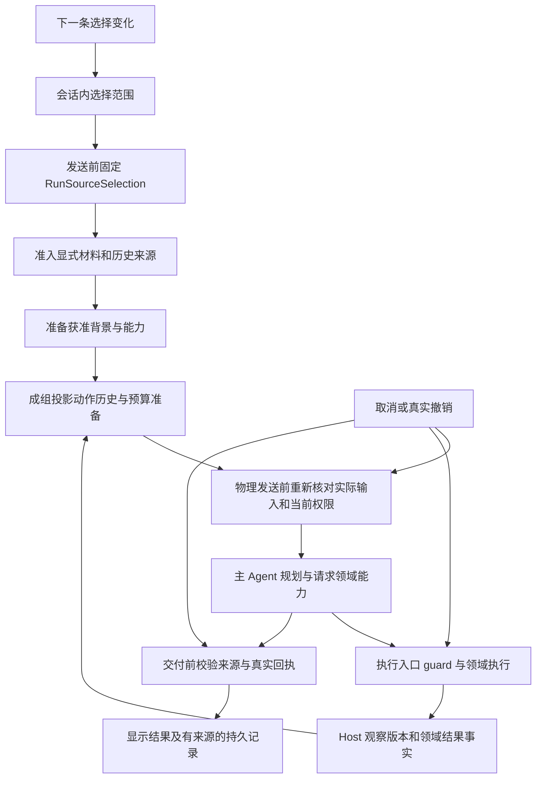

# B-149 PA Agent Runtime Evolution — Software Design Document

Document status: Approved
Updated: 2026-09-24
Work item: B-149
Authority: 基于源码核实的目标实现设计、接口职责、兼容迁移及验收矩阵；不改变已接受的产品取舍。
Product spec: [PA Agent 问答范围与 Runtime 演进](../../../product/specs/pa-agent-runtime-evolution-product-spec.md)
Plan: [Delivery Plan](./plan.md)
Tracker: [Development Tracker](./tracker.md)

## 1. 使用边界与设计原则

本文中的新增类型、字段、文件和行为均为 **Proposed**，不是当前实现。当前产品权威为 [DEC-043](../../../product/decisions/dec-043-agent-runtime-evolution-and-source-scope.md) 和 Product Spec；执行状态只看 Tracker。开发者不得用本文件中的例子替换完整 REQ/AC。

本包面向 Owner 后续委派的 **GPT-6 Sol（`gpt-6-sol`）** 实现者。其职责是按任务卡开发、测试和自查；主控负责技术设计、任务授权、独立验收与 Tracker。GPT-6 Sol 不得自行放宽产品边界、删验收项或把模拟结果标为真实应用证据。派工时核实实际模型为 `gpt-6-sol`；本设计不假定 CLI profile 或设备权限。

设计继续服务于[产品北极星](../../../product/pa-product-north-star.md)：默认回到笔记、少管理、有依据、动作可信。复用现有 runtime、来源 guard、领域 receipt、会话存储和 Debug；不新增通用策略引擎、事件溯源平台、调度平台或持久化工作流。

继承 [DEC-040](../../../product/decisions/dec-040-recoverable-agent-execution.md) 与 [DEC-042](../../../product/decisions/dec-042-agent-task-source-boundary.md)：单次物理模型/普通同步远端尝试默认 30 分钟；不恢复 60 秒 idle/180 秒总时限，不压低后台预算；Chat 与后台均有运行机会；未知副作用先核实；Writing 显式进入；保存、删除、配置、付费、Undo 和 Data Boundary 保持独立保护。范围限制问答资料，不意味着离线模型。

## 2. Current Source Baseline

设计核查基线为 `master@6fce3824`。实施前必须验证实际 checkout、未提交文件与以下接口；HEAD 相同不代表工作区输入相同。当前 B-149 产品文档和本包可能尚未进入 Git，跨 worktree/模型交接不能只传 commit。

| 接缝 | 已核实的现有实现 | 本次变化方向 |
| --- | --- | --- |
| 发送与 UI | `src/chat/chat-view.ts` 的 `sendPrompt()` 捕获 history/Pagelet，调用 `ChatService.streamLLM()`；现有图标按钮和 Memory 菜单 | 增加显式范围选择，发送前同步捕获本次选择 |
| 会话 | `ConversationPersistence.ts`、`chat-history-manager.ts`、`chat-history-store.ts`；IDB version 4、history schema 2 | 在现有记录增可选版本化 metadata；原子合并选择，不新增 store |
| Chat 接线 | `src/ai-services/chat-service.ts` 的 `StreamLLMOptions`、`contextEpoch`、`isCurrent` | 传 Host-only run 范围；不能用 `resetContext()` 实现菜单切换 |
| 来源约束 | `task-source-constraint.ts`、`task-source-run.ts`、`task-source-read-guard.ts`、`task-source-executor.ts` | 复用固定 run 约束与 live guard，覆盖 scope、背景、派生材料 |
| 来源缺口 | `TaskSourceRun.projectHistory()` 主要检查 source records；`captureGenerationInputTaskSources()` 使用生成时的 `file.stat` | 增实际输入依赖；观察时采集版本，发送时只复制 |
| 背景与领域旁路 | `pa-agent-runtime.ts` 的 `readInjectedContext()` 自动读取 Personal/Pagelet；部分能力标为 `independent`、`reads: []` | 必须在读取/准备入口阻断，不仅过滤最终字符串 |
| 图片与 Writing | `image-request.ts` 从历史/parent 注册图片；`WritingContextRun`、`GenerationInputSnapshot`、Writing recovery/save receipts | 先准入 parent/history 再构造图片 scope；恢复沿用本次范围 |
| 物理发送 | runtime 的 `prepareProviderRequest`/`onProviderRequestStart`；`ai-utils.ts`、`obsidian-fetch.ts`；Memory rewrite/rerank、Web MCP hooks | 绑定实际 payload，逐物理尝试检查；不换 SDK |
| 执行轨迹 | `PaAgentMessage` 已有 assistant tool call 与 tool result id；`ContextManager.forPrompt()` 主要输出平铺字符串 | 保留 canonical transcript，替换有损投影 |
| 模型适配 | `pa-agent-prompts.ts` 已用 `MessagesPlaceholder`；OpenAI/Qwen 由现有 `ChatOpenAI` 创建，已有 stream/invoke | 原生消息优先；兼容表达保留完整动作关系 |
| 清洁/压缩 | `context/PaAgentContextHygiene.ts` 当前可隐藏 policy/duplicate result；Compactor 按 cycle 处理 | 调用与结果成组投影；不可制造悬空 tool call |
| 摘要来源 | `PaAgentContextProjector.semanticHistorySourceMessages()` 可采用模型返回的来源索引；SummaryTypes 保存完整 Host 输入 | 权限依赖取完整 Host 输入及前序摘要祖先；模型索引不能缩小依赖 |
| 取消/调度 | `pa-agent-loop.ts` 准备 race 缺主动 abort 分支；`TurnExecutionDeadline` 已有 abort race；coordinator release 幂等 | 复用现有 primitive，不新增取消服务 |
| 恢复 | `providerNoProgressCounts` 累加；answer completion 另有 equivalent counts | 用真实进展划分恢复片段，全程资源不清零 |
| 结果 | `ToolExecutionOutcome`、`executionState/recovery`、`MemoryEvidenceState`、Writing/Operations/Insight receipts 已有 | 窄 typed facts 沿既有链路传播，领域解释回到 owner |
| 退役候选 | runtime 创建 required policy 时传 `classification: { items: [] }`；policy 文件仍有有效职责 | 删无消费者推断，迁移有效行为后再删旧代码 |
| 预算/观测 | ContextBudget 主要 chars/4、120k 字符估计；未找到窗口 resolver；Debug 有 usage 去重及 purpose | 扩展现有预算与 usage 语义，不伪造窗口/精确 token |
| Eval | `src/pa/eval/runner.ts` 主要消费 fixture actual；已有 context-continuity smoke runner | 增实际 runtime executor，复用 assertions 与观测 |

已核实可复用的 UI 接缝：`src/chat/menu-helpers.ts` 的 `createChatMenuItem()`、`updateChatMenuAvailableWidth()`；`src/custom.pcss` 的 `.pa-chat-icon-button`、`.pa-chat-menu`、`.pa-chat-composer-row`、`.pa-chat-composer-hint`；`src/locales/plugin/en.json`、`zh.json`。`.is-compact .pa-chat-memory-control` 目前隐藏 Memory 控件，不能照搬成范围入口在窄屏消失。Proposed locale 前缀为 `plugin.chat.scope`，CSS 前缀为 `pa-chat-scope-`；以现有命名结构落位，不创建设置页或新命令。

## 3. Design And Data Flow



实际顺序必须是 **先来源准入，后准备/摘要，最后发送前再次校验**。禁止先把全部材料发给摘要模型，再过滤摘要。每次发送成功进入 provider 的那份精确输入决定派生依赖；没有发送的候选材料不能被误记为已使用，实际发送但未被引用的材料不能漏记。

## 4. Interfaces And Ownership

### 4.1 会话选择与 run 快照

以下闭集类型放在 Proposed `src/ai-services/chat-source-scope.ts`；该文件只包含类型、解析、来源类别相容性纯函数，不管理 UI、IDB 或模型请求。

```ts
// Proposed
type ChatSourceScope = 'notes' | 'web' | 'combined';

interface ConversationSourceSelection {
  schemaVersion: 1;
  scope: ChatSourceScope;
  revision: number;
  basis: 'new-conversation' | 'user' | 'legacy-host-config' | 'conservative-fallback';
}

interface RunSourceSelection {
  schemaVersion: 1;
  scope: ChatSourceScope;
  selectionId: string;
  persistedSelectionRevision?: number;
  userMessageId: string;
}
```

- `ConversationPersistence` 拥有当前会话/草稿选择；`PersistedConversation` 增 Proposed `sourceSelection?`。新会话和新草稿初始化 notes，不继承其他会话。加载会话时恢复本会话字段。
- 用户在尚无持久 conversation id 的新草稿先选 web 再发送时，`startConversation()` 使用该草稿选择初始化记录，不能又以 notes 覆盖；建立 id 后将 pending 选择归属转到该会话，不复制另一个会话的状态。
- `sendPrompt()` 在第一次异步准备前捕获选择、用户消息身份、明确输入与附件；run 持有不可变快照。经 `StreamLLMOptions` → `PaAgentRunOptions` → `TaskSourceRun` 传递。模型不能构造、修改或反序列化成 Host 权限。
- 输入区显示下一次选择；当前 UiTurn/turn metadata 保留发送时范围。切换只修改会话 metadata，不调用 `ChatService.resetContext()`，也不经 `ChatHistoryManager.mutateSources()` bump 来源 epoch。
- Proposed `updateConversationSourceSelection()` 在 store 事务内读取最新记录并增加 revision。`appendTurnAndUpdateConversation()` 必须保留数据库最新 selection，参照现有 `preserveConversationAnchor()` 模式。旧 run 收尾不能用启动时 conversation 覆盖新选择。
- 同会话多个 view 的写入由事务串行；以最新成功提交的 revision 为准。Proposed 在 `ChatHistoryManager` 增小型 metadata listener：事务成功后发布 conversation id + selection/revision；每个 view 卸载时 unsubscribe，忽略较旧 revision。现有 source observer 会触发撤销，不能复用；也不建立通用事件总线。view 无本地 pending 选择时采纳最新提交；有更新的本地 pending 时保留它，直到该次提交成功或用户另选，不能被其他 view 的较早回执覆盖。
- 菜单切换立刻更新内存中的下一次选择；存储失败不得静默声称已持久化，也不把选择退回旧范围。保留 pending metadata，简短显示“范围尚未保存”，后续按现有持久化队列重试；重开只承诺恢复实际写入的值。发送快照使用当前内存选择。
- 每次本地选择生成 Host `selectionId`，归属于 conversation/draft 和本地操作序号；它用于关联异步提交，不是授权 token。发送时记录该 id；只有已经收到此选择的真实提交回执才填写 `persistedSelectionRevision`，pending/失败时省略，不能猜 `lastRevision + 1`。store append 不能凭 run 快照反写选择；之后提交成功也不改旧 run 的已捕获事实。
- shared runtime 的非 Chat caller 必须明确保留原来源策略。不能给缺参数的独立 Pagelet/Memory 默认套 notes，意外改变其全局行为；Chat 入口负责将缺失的会话选择归一化。

### 4.2 实际输入依赖：有限集合，不建逐词分析

Proposed `InputLineage` 放在同一来源模块或紧邻的纯类型文件；内容由 Host/domain owner 生成。它表达**来源依赖是否完整已知**；观察版本是否已知见第 7 节，两个问题不能合并。

```ts
// Proposed；receipt 引用复用领域现有类型，不是新的任意 JSON 权限。
interface InputLineage {
  schemaVersion: 1;
  completeness: 'complete' | 'unknown';
  dependencies: InputDependency[];
}

type InputDependency =
  | { kind: 'user-text'; messageId: string }
  | { kind: 'attachment'; ownerMessageId: string; ref: ImageRef }
  | { kind: 'vault'; path: string; via: 'note' | 'memory' | 'pagelet' }
  | { kind: 'personal'; source: GenerationInputPersonalSource }
  | { kind: 'insight'; source: GenerationInputInsightsSource }
  | { kind: 'writing-style'; revisionIds: string[] }
  | { kind: 'writing-version'; versionId: string; textHash: string }
  | { kind: 'web'; providerId: string; resultKey: string };
```

这是内容之外的来源记录，不保存额外正文、密钥或逐词标记。Personal 直接复用 `GenerationInputPersonalSource` 的 claimId/revisionId，由现有治理 owner 检查 Forget、排除和 revision；无内容的 `state=none` 不加入依赖。Insights 复用现有 `GenerationInputInsightsSource`，它当前没有可持久证明的 identified 分支，不能临时造 snapshotKey 注册表或把正文 hash 当授权身份。只有当前 run 的 `isSourceCurrent` 回调可用时，材料在该 run 内按现有 live guard 使用；跨 run/重载没有可恢复核验依据时拒绝复用该材料及其派生输出，重新在当前权限下取材。回调不序列化。

Web resultKey 复用 owner 的真实结果身份和准入上下文；随机 id 不构成证据。Writing version 必须递归展开已知祖先依赖，不能把作品 id 当作独立通行证。循环、缺失或损坏链路归 unknown，避免递归挂起。观察版本 unknown 与来源类别/授权 unknown 分开：已知合法 path 的旧正文可以保留未知版本，不能因此伪造 revision；无法核对授权的背景则不能复用。

| 材料产生处 | 必须附带的依赖 | 不可使用的替代证据 |
| --- | --- | --- |
| 当前明确输入 | Host 保留的原始输入及实际合法附件 | `role=user` 不足以证明自动追加的背景是手动材料 |
| 原始工具观察 | 真实读取/检索来源与观察 receipt；参数回显的 wrapper/metadata 同时继承调用 lineage | 工具名或 `success` 不能证明来源全集；Web 返回也可能回显私有 query |
| assistant 输出与后续工具参数 | 生成这份输出时所有实际输入依赖的 union | 只看最终引用、只看工具返回、模型称无敏感信息 |
| 历史摘要 | 完整 Host 输入 sourceMessages + previous summary 全部祖先 | 模型选出的 sourceMessages 索引/引用子集 |
| 工具摘要/改写/rerank | 被发出的材料及自动背景的 union | 摘要变短或去掉名字就清除来源 |
| Writing/图片背景/恢复材料 | 父作品、style、图片与所有实际背景依赖 | 打开作品或自动注册旧图片等同本次重新提供 |

Host 内置、可证明与私人来源无关的指令可使用 complete + 空集合；未知材料不能降为该状态。可独立证明的原始用户文本允许继续使用；系统拼接的标题、路径、Pagelet、任务参数保留自身来源。若同一字符串已不可可靠拆分，整体按其完整依赖处理。

准入算法固定为：

1. 验证 metadata 闭集、schema、引用与 lineage completeness；缺失/非法派生材料为 unknown。
2. 逐个依赖检查冻结 scope 的类别和**当前** Data Boundary/能力/领域准入；Writing 等组合依赖展开后检查。
3. 完整且全部相容才保留；单一范围下整体移除不相容 mixed，combined 可保留全部依赖仍获准的 complete mixed。所有范围都拒绝 unknown；不能把 combined 等同无限制。
4. 成组处理依赖该材料的 assistant call/result，防止参数、标题、路径或旧状态旁路。
5. 保留原展示记录；将可用材料交给摘要/模型。必要条件缺失由 Agent 澄清，不从被移除记录猜回。

例子：模型同时看过 Personal 预算和网页，最终只引用网页，输出仍是混合来源，不能用于 web。notes→combined 保留合法笔记；combined→combined 保留全部依赖仍获准的完整混合历史；combined→notes 去掉 web/mixed；notes↔web 保留独立相容指令。不要实现成“每次切换全部清空”。

工具结果只有可独立证明的原始响应片段才能单独标源。query/path/title/错误文本若回显了来自受限材料的调用参数，该 envelope 继承调用 lineage；无法可靠拆分则整份取 union。将 Web 查询结果单独缓存/摘要也不能洗掉回显的笔记预算。

### 4.3 取材、物理请求与交付的接线表

| Owner / 入口 | 必须实现的检查 | 必须保留的边界 |
| --- | --- | --- |
| `TaskSourceConstraintState` / `TaskSourceRun` | notes 禁 web；web 禁自动 note、vault search、scoped vault search 和路径目录；工具列表与执行入口均检查 | 原有约束对象身份、run identity；不能恢复模型 source declaration |
| `TaskSourceReadGuard` | 固定 scope + live exclusion、Forget、能力开关；每次真正读取前复查 | `output_target_exists` 等已授权动作目标校验独立，不能变成任意读资料通道 |
| `readInjectedContext()` | web 在 Personal/Pagelet 准备或读取之前短路 | 仅在最终 formatter 删除字符串不合格 |
| Memory/Insights/Writing/skill adapter | `query_memories`、`get_vault_insights`、`get_writing_context` 等独立能力也检查范围；vault skill 正文属于 notes | `reads: []` 不是不含来源；内置 skill 指令与 vault 内容分开 |
| `image-request.ts` / Writing candidates | 先筛合法 history/parent，再注册 `ChatImageRequestScope`；当前附件按既有 ref/asset/lease 校验 | `resolve_chat_images` 不能读到已过滤的旧图片 |
| Writing context/recovery | 当前 run 范围参与 prepare/validate/source receipt；旧 recovery 不覆盖新选择 | 父版本、style、图片、确认/保存、新鲜度校验仍在 owner |
| Answer / summary | 在现有 prepare/before-send hooks 绑定精确 payload + lineage，再做 live 检查 | 摘要自己也是外部请求；滚动 previous summary 必须计入 |
| Memory rewrite/rerank | 接入同一固定范围和 live guard | 原 run-current 检查不替代来源检查 |
| Web MCP | initialize/list/call 的每个物理请求都检查 scope + `isEnabled` | 菜单包含网络不自动打开全局 WebSearch |
| SDK retry / stream→invoke | 每个实际 fetch 再校验；过期 payload 不可照发；统计独立 attempt | 复用 `ai-utils.ts`/`obsidian-fetch.ts`，不另建 transport |
| 最终展示 / 持久化 | 在 `answerSourceValidity`、`isFinalTextCurrent`、Writing receipts、persist queue 上检查实际输入依赖 | 真撤销拦截尚未交付结果；菜单变化不撤销旧 run |

已有已展示文本不因下一条范围变化而删除。撤销后不得继续追加新交付、把过期候选写成有效作品或用缓存恢复已撤销材料。缓存 identity 必须包含来源依赖、域 receipt 和权限相关身份；同内容但不同 lineage 不允许命中旧准入结论。

当前未发现生产消费者复用 `previous_response_id` 等远端会话状态。先用实际请求捕获证明现有 stateless 输入完整；不为假想后端建 session 平台。若实施核实存在不可过滤远端状态，使用干净上下文；若现有适配器无法做到，记录阻塞，不能偷偷放宽硬范围或删除支持模型。

### 4.4 UI 行为与生命周期

- 三个菜单项固定为“我的笔记 / 网络资料 / 综合模式”，文案按 Product Spec；图标建议 book-open / globe / layers，使用已有 Obsidian `setIcon`，无自建 SVG/运行时 style。
- 按钮是 `type=button`，含当前范围的可访问名称、`aria-expanded` 和菜单关联；菜单完整名称、简短解释、选中标记。键盘 Enter/Space 打开、方向键选择、Enter 确认、Escape 关闭并归还焦点；点击外部关闭。
- 桌面 tooltip、移动长按说明与普通点按菜单均可识别当前范围；不能只靠 hover 或颜色。窄屏仍保留范围入口，菜单受 chat 容器宽度约束。
- 运行中可切换，显示一次“下条消息使用：…”；切换零模型调用、零工具调用，不重启任务。收紧/跨范围只提示一次历史使用变化，不循环弹窗。
- new chat/reset/load/draft/多 view 切换均保留正确会话归属。卸载清除监听、菜单 timer、observer；迟到 persistence 回调不得写回已关闭 view。
- 本次不新增全局 `settings.sourceScope`，不增加快答/深度档位，不把 Chat 选择应用到独立 Pagelet 或 Memory 后台维护。

## 5. 结构化轨迹与结果事实

### 5.1 Canonical transcript 到模型消息

保留 `PaAgentMessage` 为事实源。Proposed `PaAgentContextProjection.actionHistory` 表达经过准入、hygiene 和 compaction 的 action groups；在现有 ContextProjector/prompts 边界增加一个窄适配函数，禁止另建并行 transcript store。

每个 group 保留 assistant message identity、文本、call id、tool name、原参数、对应结果 id/outcome/必要 operation state。原生路径产生 assistant tool_calls 与匹配 ToolMessage；兼容路径从**同一 group**产生有边界的结构化文本，明确上述字段。工具正文仍是不可信数据，不能拼成系统指令。

在现有 prompts 层形成**唯一最终消息 builder**：保留 system 指令及已经准入的先前对话顺序，当前 user 一次，其后按发生顺序放本轮 action groups。native 与 compat 互斥；当前 `{tool_observations}` 不能再在 system 里重复注入同份结果。runtime 不再只按 `hasImages` 决定是否使用 messages placeholder，普通文本工具轨迹也走此入口。来源绑定、预算测量和 stream/invoke 都消费同一最终产物，不能分别重建出不同请求。

规则：

1. 一个当前 user 输入，不因 image message 与 native messages 重复注入。历史多模态仍走现有 image scope。
2. 多 call 与结果按 call id 配对；同名不同参数不得合并。乱序结果归位，原始参数完整保留。
3. 已保留 call 必须有真实结果或真实“未执行/被拒绝/结果未知”状态；hygiene 不能仅删 `policy_rejected/duplicate` result 留 dangling call。
4. 未完整执行的 buffered call 不伪造成功。provider 不接受该 native 结构时使用忠实兼容投影，而非丢弃动作事实。
5. 压缩优先旧的、闭合的大结果；保护任务约束、已尝试动作、来源、未闭合调用及未知副作用。不可从中截断 JSON 参数或拆 call/result。必要集合超容量返回可恢复的 `local_overflow`，不假装上下文完整。
6. 不发送 raw thinking、Host 私有 guard、授权 token、整个 Debug/metadata 对象；历史参数不能成为新授权。
7. 适配模式由验证过的 provider/adapter 能力选择，不仅凭模型名称猜测，不发额外探测请求。保留当前已支持 provider/model；stream→invoke fallback 仍经过完整准入。

第 8 节预算必须测量最终消息、schema 和媒体开销，不继续仅测旧平铺字符串。回归断言捕获实际 runnable/SDK/fetch 输入，不能只测 formatter。

### 5.2 结果事实与任务完成分层

复用 `ToolExecutionOutcome` 表示执行结果，复用 `executionState/recovery` 表示副作用和合法恢复。Proposed 在 `ChatToolResult → PaAgentToolExecutionResult → PaToolResultContent` 增可选闭集 `resultFact`，不另起一套成功字段覆盖原语义。

| Proposed fact | 生成 owner 与必要依据 | 禁止推导 |
| --- | --- | --- |
| `evidence` | Memory/读取 owner，真实且当前获准的 evidence refs | 有文档数组就表示证据完整 |
| `no_match` | 各检索 owner 证明正常完成且无匹配；Memory 可映射 `memoryEvidenceState=none`，metadata/snippet 使用自身成功结果/evidence | 仅数组为空就推定正常；全库绝不存在；总结任务已完成 |
| `unavailable` | 检索/能力 owner 的真实不可用结果 | 与 no_match 合并 |
| `transient_failure` | dispatcher/domain 的已分类临时失败和合法 recovery | 把取消、权限拒绝都当可重试 |
| `artifact_ready` | Writing owner 接纳完整产物、来源、provider completion 后的 receipt | decode 成功即产物已接纳；产物生成即保存 |
| `approval_pending` | Operations staging / save owner 的真实 proposal id | outcome=success 即已写入 |
| `applied` | Insight/Operations/Writing save 的实际执行 receipt | 从 promptText/自然语言猜“已经保存” |
| `partial` | owner 的完成项与未完成项 references | 一项成功覆盖所有目标 |
| `unknown` | `acceptance_unknown` 与 operation identity/核实路径 | 清成失败后直接重放 |

各 union 分支只携带类型化 receipt/evidence 引用和合法恢复信息；不得追加开放 `payload: any` 再由 loop 解析。一次调用产生对应事实，多次调用保留多个事实。来源撤销时 facts 与正文一起重新投影，不能正文删掉却仍宣称存在可用证据。

零命中适配由各 owner 实现：Memory 使用其 evidence state；metadata/query/snippet 使用正常结束的执行结果与自身 evidence；Web 使用 provider 的正常空结果。网络失败、权限拒绝、取消或无法解释的空响应不能映射为 no_match。通用层不得遍历任意 `matches/documents` 数组猜分类；至少覆盖 Memory 关闭、metadata/query 仍可正常查找的路径。

**Writing 是纯输出路径，不伪造 tool result。**当前 bridge 在 `agent_end` 后验证并发 artifact，chat view 随后持久化版本。T-10 将职责收窄时固定以下时序，防止“loop 等 artifact_ready，而 bridge 等 loop completed”的循环：

1. 输出 adapter 收集候选；provider 完成后由 Writing owner 校验 exclusive call、正文、context handle、来源与取消状态，返回 opaque 候选接纳 receipt（Proposed `accepted_for_delivery`）。这个预检不依赖 `agent_end=completed`，也不表示已展示/已保存。
2. Loop 仅消费 adapter 的接纳/拒绝/需继续结果来决定合法终态，不解析 body/explanation，不等待 UI artifact。现有混合 batch、provider completion、取消和任务未完成保护继续有效。
3. Bridge 在 completed 终态后再次检查 live 来源和接纳 receipt，才产生 `artifact_ready` 领域事实及可展示 artifact。此事实走已有输出事件/turn metadata 消费链，不经虚构的工具调用回灌模型；交付被撤销/验证失败时呈现真实 recovery/incomplete，不凭先前 loop completed 宣称作品已交付。
4. Chat view 的版本写入成功后才关联真实 `writingVersionId`；失败保留可用临时结果并说明历史未保存，不能生成虚假版本 id 或宣称可恢复。scope/来源在 persist queue 中仍复查。
5. Markdown 保存另由 save owner 返回真实 applied receipt。artifact_ready、版本持久化、Markdown 保存是三个事实；E-12 分别绑定它们实际发生的时间，不能以 provider EOF 代替。

主 Agent 判断结果是否满足自然语言目标；Host 只阻止缺真实回执、未接纳作品、越权等可确定矛盾，保留 `report_task_incomplete`。不得新增关键词判断“有没有”“总结”来裁决任务成功。

正常无匹配不计故障恢复，不规定固定补查次数。明确笔记任务缺依据时默认说明缺口；不自动附通用答案。用户明确要通用解释时可回答并区分来源。临时问题成功恢复后，最终不残留泛化故障警告；仍未完成的目标如实保留。

### 5.3 退役与领域归位

| 动作 | 具体范围 | 删除前必须证明 |
| --- | --- | --- |
| 删除闲置推断 | `resolveRequiredCapabilityClassification`、classifier timeout/normalization、keyword signals、required/suggested 推断和仅为它们服务的状态/类型 | 生产 caller 当前传空 classification；全树 import/type/消费者清单，无遗漏运行路径 |
| 迁移 Insight | `answer-completion-policy` 对 `promptText` 的 applied receipt JSON 解析 | owner 直接提供 typed receipt，保存事实负例仍通过 |
| 迁移 Operations | runtime 内 staged acknowledgement/control snapshot | Operations owner 提供现有 policy hooks，runtime 只组合；stage/apply/unknown 区分不丢 |
| 收窄 Writing 输出接缝 | Loop 中 Writing body/explanation/collector 细节 | 一个窄 optional output adapter，candidate 对 loop 不透明；provider completion、混合 batch、撤销、取消继续守住 |
| 迁移 Writing reuse | `canReuseWritingContext` 专属 wrapper 链路 | 复用已有 `canReuseSuccessfulResult`，由 Writing owner 校验；相同有效 A 复用、A→B→A 重准备、stale A 不复用 |
| 删除 test-only helper | runtime 的 `isReadOnlyContextToolResult/getReadOnlyToolObservationMessage` 等候选 | 再查生产可达性与有意义测试迁移；不能仅看 bundle 变小 |

禁止整文件删除 required policy：其中空输出恢复、answer-ready、有效观察、terminal 协调和 `synchronizeProjectedTranscript()` 撤销同步仍需迁移。保留 Type A extractor 仍使用的 `isExplicitCurrentNoteOnlyRequest/isExplicitNoWebRequest`；它们不参与新硬范围授权。

保留旧 `request_source_decision` UI reader，保留 executor/dispatcher 对已退役 `declare_source_scope/request_source_decision` 调用的拒绝，保留 Writing 旧记录/解码/recovery reader。旧 classifier 测试若同时覆盖 iOS transport，迁移有效 transport 断言到真实调用再删推断断言。不得删 registry、batch preflight、来源 guard、真实确认、新鲜度、Undo 或 unknown replay block。

## 6. Lifecycle And Cleanup

### 6.1 准备阶段取消

在 `prepareModelInputForProvider()` 复用 `TurnExecutionDeadline` 的 abort/deadline race；已取消时不得先启动准备。用微任务延迟启动并在前后检查 signal；finally 释放监听和 timer，保持原 deadline 错误分类。不要要求不支持 signal 的 `cachedRead()` 必须终止才返回。

取消使主 run 及时结束，现有 run finally 释放不再使用的 lease。底层 promise 的迟到 resolve/reject 有处理器但不再发送、提交、恢复来源或写缓存。沿用 summary generation、projection generation、`assertRequestCurrent`；不新增全局 epoch 服务。

该修复不允许收到 abort 就抢回仍在执行副作用的资源锁，不清除 `acceptance_unknown`，不宣称外部副作用未发生。普通 Chat 保持 read_snapshot，不为取消修复额外 live reread 全部笔记。

### 6.2 真实进展与恢复片段

Proposed 小型 run-local 结构：`HostProgressReceipt { kind: 'new_observation' | 'domain_result'; identity: string }` 与 `RecoveryEpisode { signature; progressEpoch; consecutiveFailures }`。identity 由领域真实结果生成；同内容/版本 receipt 去重，不采用随机 call id 或模型自报。

- 新证据、新的真实检索覆盖事实、真实完成的领域子目标可以推进 epoch；新 query 字符串本身不是进展。
- repeated/cached result、duplicate-skipped、心跳、状态文案、换 call id 不重置。
- 正常零命中可以新增有限检索事实，但不表示总结目标完成。
- 按 provider/model + 已分类错误 + progress epoch 记录连续同因失败；真实进展重置对应片段。保留现有恢复门槛，不趁机降低 turns/tools 上限。
- 同时核对 provider counts 与 answer-completion equivalent counts；不能只修一条路径。
- 全程 attempts、usage、reuses、耗时独立累计，永不随 epoch 清零。错误 signature 不持久保存可能含私人内容的任意错误全文。

T-03 先复用已经存在的 owner 证据，不等待 T-10 的 typed facts，也不临时造第二套任务判断器：

| 现有事实 | 进展 identity 的依据 | 不能证明时 |
| --- | --- | --- |
| read_note/editor/metadata/snippet observation | 现有 VaultObservationEvidence 的来源 + 对应正文/分区 hash；明确 hash 作用范围 | 没有证据只给 success/新 call id，不重置 |
| Writing/Insight/Operations 真实结果 | 已接纳版本、已执行 action/operation receipt 与完成部分身份 | candidate/staged 状态的重复通知不算新完成；unknown 不重放 |
| 正常零命中 | owner 可核对的检索覆盖范围及该范围的版本身份；同一覆盖去重 | 目前拿不到覆盖身份时保留 no_match 事实，但不当新 progress；换 query 文本不能补证明 |
| 已复用的成功结果 | 原 observation/receipt identity | 保持去重，不因新 dispatch/message id 重置 |

T-04 用更准确 observed revision 扩充同一 receipt；T-10 的 resultFact 只是统一传递这些事实，不能重新实现新颖性判断或再建一份计数。

### 6.3 重载、并发与资源

同进程恢复沿用当前合同；reload 后旧 run 显示 interrupted，用户继续建立新 run，用此刻选择及 live 权限重新准备。旧范围/缓存/未知动作不能自动重放。前后台 lane 公平性不改；等待不持有无用 lease。观察、listeners、abort hook、临时 runner、测试插桩和 app 临时状态由创建者记录、在验收后清理；不能清理共享依赖、未提交文件或审查证据。

## 7. 观察版本、存储与迁移

### 7.1 观察时版本

Proposed `ObservedSourceRevision` 放在已有 source receipt/type 边界：identified 分支包含 `basis`（vault_read/editor_snapshot/metadata_snapshot）、带算法和 scope 的 digest，以及**可证明对应读取时**的可选 stat；unknown 分支保留 not_captured/legacy/unstable_read 原因。复用 `VaultObservationEvidence` 现有 hash，不把 snippet/metadata partition hash 冒充整文件 hash。

`read_note` 已有读前 stat、正文/hash、读后稳定性检查，复用其证据。编辑器未保存正文用 editor_snapshot，不盖磁盘版本。读取期间发生变化且无法确认对应版本时记录 unknown，不事后取最新 stat 补造。metadata 检索只能证明 metadata；图片与网络沿用各自可证明身份。

传播顺序：factory/owner → capability adapter → canonical result/source record → history clone/serialize → summary identity → generation snapshot。`capability-adapter.ts` 会重新创建 SourceRecord，必须显式传递，不能只在 factory 添加字段。

`captureGenerationInputTaskSources()` 只复制观察 receipt，不再读取当前 stat 赋值。同 path 的 A、B 观察可并存；不能按 path 无条件去重。普通问答使用仍获准的 A，要求最新才再读 B；写入前新鲜度仍由动作 owner 检查；权限撤销立即阻止后续使用，不能拿“这是旧快照”豁免。

### 7.2 持久格式

| 数据 | 写入方案 | 旧数据读取 |
| --- | --- | --- |
| Conversation scope | 现有 conversation 增可选 `sourceSelection`，字段自带 schemaVersion 1 | 无字段按懒迁移规则；损坏字段保守默认，保留聊天展示 |
| Turn/message lineage | 现有 canonical/fallback turn metadata 增版本化 lineage 与 run selection | `readChatHistoryTurnMetadata()` 等所有 clone/reader 同步；缺失是 unknown |
| GenerationInputSnapshot | **读 v1/v2，写 Proposed v2**；v2 明确观察 revision 和 lineage；同一轮实现版本化 parser | v1 仍可查看，旧 current_process stat 不能升级成观察时版本；恢复按 legacy/unknown 准入 |
| WritingVersion | 更新严格 parser、clone、save/recovery reader 接受上述新 snapshot | 旧正文/历史仍可看；未知来源不自动用于续写 |

不新增 IDB store/index，因此保留 `CHAT_HISTORY_IDB_VERSION=4`、`CHAT_HISTORY_SCHEMA_VERSION=2`。不要仅加可选 metadata 就升全局 schema 导致整库不可读。新字段 reader 要覆盖 IndexedDB 和内存 fallback；unknown 新枚举/损坏 metadata 不能删除原文或让所有会话加载失败。

v2 snapshot 的结构在 T-04 一次明确：观察 revision 和可选 lineage 都写入 schema；T-06 填充实际 lineage。在未填完整之前视为 unknown，不用缺字段推导 complete。不在后续悄悄扩展 strict v2 或另造 Writing 来源规则。

Legacy selection 只在可信旧版本规则及留存/可证明的 Host 配置能够确定原有效范围时映射并记录 basis。仅凭今天 WebSearch 开关、旧引用/链接、自然语言或 retired sourceDecision 不足以证明历史权限。无法证明时 notes + conservative-fallback，简短说明一次。选择迁移不补造旧输出 lineage，也不调用模型批量修复。

### 7.3 回退

持久变更是加法，保留原文与旧 reader；没有数据清除、全库迁移或后台重算。实现阶段出现缺口时停止暴露新范围入口，修复同一版本后再验收；不能在已承诺硬范围后静默退回无限制取材。

内部开发可回退尚未发布的代码片并保留数据，但旧二进制不会认识新范围语义，不能把降级旧插件说成安全支持新会话范围。若需要发布后的 downgrade 路径，须验证旧 reader 并明确暂停受影响任务/说明限制；不得承诺本包没有实现的跨版本授权兼容。

## 8. Data, Privacy, Permission And Cost

### 8.1 上下文预算

扩展现有 `PaAgentContextBudget`，不新建资源平台。Proposed model budget facts 包含可信 `contextWindowTokens?`、`outputReserveTokens?`、来源（verified metadata / explicit configuration / unknown）、估计方法和实际测量 envelope。没有可信窗口时明确 unknown，继续使用保守字符上限作为 fallback，不把现有 120k 字符当成真实模型窗口。

已知窗口：可用输入 = context window − output reserve − protocol safety。统计 system、合法 history/action groups、实际绑定 schema、图片及其他协议开销；不能只数用户问题。复用/提取现有 CJK estimator 作 fallback 时保留“估计”身份；实际 usage 仅校准同 provider/model/格式的后续估计，不能充当本次精确值。

窗口与输出预留分别标明是否已知；`outputReserveTokens` 缺失不能当 0。当前 answer 创建未显式传 maxTokens，summary 已传，因此 T-11 必须闭合实际请求配置：若使用显式输出上限，同一预算事实传给现有 AIUtils 的 maxTokens，由适配器转换成 `max_tokens/max_completion_tokens`；若依赖 provider 默认，只能使用经验证的默认事实。无法证明输出预留时使用明确标注的保守估计和既有字符 fallback，不声称完成精确窗口准入，也不偷偷降低原输出能力。reserve ≥ window 时不发必然溢出的请求，返回可恢复配置/上下文缺口。测试捕获实际 request body，校验预算与 stream/invoke/summary 参数一致。

固定准备顺序：来源准入 → 确定性去重与短状态清理 → 标记不可丢的必要集合 → 测量 → 优先压缩旧闭合大结果 → 必要时可选模型摘要 → 再测量 → 发送。优先复用同来源/同版本摘要；来源或权限改变必须失效。必要集合仍不适配时返回清楚的上下文缺口，不静默删约束。

### 8.2 辅助摘要投入

摘要仅为腾出必要空间或减少后续重复输入而执行，不遍历每条结果固定调用模型，不为短结果/未改变材料重复调用。沿用 Summarizer cache、generation 和不变长保护。历史、工具摘要遵循同一来源准入。

增加 run-scoped 辅助调用/estimated-or-known tokens/elapsed 计账与明确配置的准入上限。**具体数值通过 T-01 基线和 T-11 测量选定、写入源码和 Tracker 的参数依据，不在设计中拍定次数/秒数。**这是实施任务的一部分，不是留给执行模型任意省略的 TODO；未测得依据时保留既有安全 fallback，不宣称预算优化已完成。

辅助额度耗尽只停止可选摘要，主任务继续在合法材料中推进；必要上下文放不下按 overflow 恢复。30 分钟是单次物理尝试期限，不把整个 rolling summary 循环误当一个尝试总时限；另有辅助投入边界时分别记录原因。不得以此新增主任务总费用截断或更小后台预算。

### 8.3 全程 usage

按 logical call、physical attempt、purpose 记录 answer/summary/rewrite/rerank；复用 Debug 的 `complete/source/updateKey/aggregation` 语义。usage 计账不依赖用户打开 Debug，评测使用内存 recorder 即可；不要复制第二套解析。

同 attempt 的 cumulative 更新替换，delta 按去重规则累计，不同 attempts 可加；失败/取消且无 usage 的尝试标 unknown/incomplete，不当 0。估计值与 provider 实测分栏，费用无可靠价格/usage 就 unknown。切换范围零额外调用；本包不授权真实用户笔记发送、API key 操作或任意评测费用。

**现有聚合不能原样当作全成本账本。**当前 Debug service 使用 `callId:updateKey` 聚合，而 response observation 未绑定确切 attempt。T-01 必须先暴露该缺口；T-11 复用 parser/port 并在真实 request/response hook 贯穿已有 attempt identity，聚合键分清 call + attempt + purpose + updateKey。只有能证明 response 属于该 attempt 才入其分账，不能按最后一次尝试或时间接近猜测。只取得 logical total 时保留单独总数及归属未知，不能再与可能重叠的 attempt usage 相加。基线无法可靠归属时诚实记录不完整，只比较可比部分；不能到最终才把重复覆盖的数字当总费用。

## 9. Test Matrix

完整测试实施顺序、命令与门禁见 Plan。下表提供每项合同的最小证明位置，不能把测试文件存在视为 AC 已满足。

| Requirement / AC | Unit / integration | App smoke | Failure / fallback | Evidence target |
| --- | --- | --- | --- | --- |
| B-149/REQ-01 / B-149/AC-01 | chat-view、history store/manager、conversation-persistence；新增范围交互断言 | 桌面与 Obsidian CLI mobile simulator 的入口、键盘/触控、重开 | persistence 失败、多个 view、新草稿、窄屏不消失；涉及 iOS 特有能力时补真机 | T-05/T-08、G2 |
| B-149/REQ-02 / B-149/AC-02 | task-source-run、loop、coordinator；旧 run 收尾 vs 新选择 | 运行中切换，取消，reload 后继续 | 切换不 reset epoch；真实 revoke 仍生效；新 run 不用旧权限 | T-05/T-07/T-08、G2 |
| B-149/REQ-03 / B-149/AC-03 | task-source executor、multimodal/runtime、obsidian-fetch、web provider；捕获实际 body | 三模式真实任务与权限变化 | summary、retry、背景、MCP、图片注册、独立能力无旁路 | T-06/T-07、G2/G3 |
| B-149/REQ-04 / B-149/AC-04 | history/context-summary/writing-recovery；全部转换及迁移 | 旧记录可见，跨范围追问必要时澄清 | mixed/unknown 不洗净；combined 不豁免 unknown | T-05/T-06、G2 |
| B-149/REQ-05 / B-149/AC-05 | read-plans、writing admission、operations read/save | 合法粘贴/附件；显式 Writing 和确认 | 打开笔记不算手动材料，scope 不自动启用/授权动作 | T-07/T-08、G2 |
| B-149/REQ-06 / B-149/AC-06 | completion policy、Insight/Operations/native Writing facts | exists-no-match、缺材料总结、不可用、作品与保存 | 未完成/partial/unknown 不伪造成功；恢复后警告正确 | T-10、G3 |
| B-149/REQ-07 / B-149/AC-07 | runtime-prompt、context、stream-fallback；捕获实际 SDK messages | 多步任务、图片+工具、兼容适配 | 同结果不同参数可区分；paired group、overflow、私有信息 | T-09、G3 |
| B-149/REQ-08 / B-149/AC-08 | loop、completion policy、batch-preflight、debug observation | 真实暂时失败后继续 | heartbeat/cache 不重置；total 不清零；unknown 不重放 | T-03、G1/G3 |
| B-149/REQ-09 / B-149/AC-09 | loop、primitives、coordinator、Pagelet runtime、summary | 取消反馈及后续任务可发 | never-settling prepare、迟到 resolve/reject、同 tick race | T-02、G1 |
| B-149/REQ-10 / B-149/AC-10 | task-source-run、snapshot、read-note、vault observation、Writing save | 读 A 后改 B，普通回答/最新/保存分开 | editor 未保存、unstable read、legacy unknown、revocation | T-04、G1/G2 |
| B-149/REQ-11 / B-149/AC-11 | context-admission/summary、writing-budget、usage/fetch | 长任务、前后台机会、相同材料复用 | 小/未知窗口，辅助耗尽主任务继续，usage 缺失不造 0 | T-11、G3 |
| B-149/REQ-12 / B-149/AC-12 | import/type 清单、registry、旧 records、领域行为 | 既有 Writing/Operations/Memory 路径 | 保留旧 reader、live revoke、confirm/Undo、replay block | T-10、G3 |
| B-149/REQ-13 / B-149/AC-13 | 实际 runtime + 固定外部响应层；真实模型对照层 | 实际部署的固定任务 | 静态 actual、模型评分、状态首字不冒充质量/有用结果 | T-01/T-12、G0/G4 |

### 9.1 必须显式写成回归的负例

| ID | 安排与动作 | 必须观察到的结果 |
| --- | --- | --- |
| N-01 | notes run 正在等待，切 web，旧 run 后完成持久化；另测选择保存悬挂/失败立即发送 | 当前 run 仍 notes；下条 web；成功保存后数据库 selection=web；pending run 不冒充已提交 revision；没有自动重发 |
| N-02 | 切范围但不撤销；随后另测关闭能力/Forget | 前者不取消旧 run；后者阻断下一物理尝试和未交付候选 |
| N-03 | web 任务，vault/Personal/Pagelet/旧图片各放独特 sentinel | 准备读取未发生，所有实际 answer/summary/retry/Web body 不含 sentinel |
| N-04 | 混合输入只引用网页，模型 summary 只标网页索引；Web envelope 回显私有 query | web 下一轮不能复用该输出/摘要/回显；不得再调用模型“清洗”；combined 全部依赖仍获准时完整混合历史可以复用 |
| N-05 | 相同文本、不同 lineage 或来源已撤销 | cache 不复用旧准入；移除正文同时移除过期 evidence fact |
| N-06 | 旧会话无可靠权限、旧 v1 snapshot/损坏 lineage | notes 保守选择；历史可看；来源 unknown，不伪造版本或整库报错 |
| N-07 | 合法当前附件 + 自动当前笔记/旧 Writing parent | 当前附件可用；其他材料无隐式再授权；被排除来源仍拒绝 |
| N-08 | scope guard 覆盖普通工具，但能力声明 reads=[] | Memory/Insight/Writing/skill 域入口仍拒绝越界准备 |
| N-09 | prepare 永不 resolve；取消后再迟到 resolve/reject | 主任务结束且无用 lease 释放；无二次 terminal、dispatch、commit、未处理 rejection |
| N-10 | 三次错误分别夹着真实新证据，然后再次同类错误 | 能继续；连续同因无进展另例仍收束；资源总数不清零 |
| N-11 | 同一结果改 call id、心跳、换 query 但同一覆盖零命中 | 不构成新 progress receipt；覆盖身份未知也不伪造进展；unknown 副作用仍不能重放 |
| N-12 | 读正文 A 后文件改 B；另例同 stat 不同正文 | generation receipt 指 A 或真实 unknown，不能盖 B；显式最新再读 B |
| N-13 | 同工具结果、不同先前参数；多 call 乱序与未执行调用 | 实际 native/compat messages 可区分，调用结果配对完整；同一观察不同时出现在旧平铺段和新 ToolMessage |
| N-14 | 必要约束+未闭合操作超过窗口；摘要失败/取消 | 不截断关键参数，不清来源；overflow/取消真实呈现，不偷发下一请求 |
| N-15 | exists 零命中、summary 零命中、能力不可用；Memory 关闭但 metadata/query 正常查找 | 三种任务语义不同，各检索 owner 正确分类；无固定补查或自动通用总结 |
| N-16 | staged proposal、生成作品、保存回执、结果未知；artifact 交付前撤销/版本持久化失败 | 等待确认/ready/版本记录/applied/unknown 分明；无循环等待，无虚假 version id，不从自然语言猜保存 |
| N-17 | 同 call 两个有 usage 的 attempts、重复 cumulative、stream→invoke；失败 attempt 无 usage；辅助耗尽；reserve 未知/超窗 | 不重复累计/覆盖独立 attempt，不把缺失当 0；未知归属不重叠相加；停可选摘要而非主任务；实际 output 参数与预算一致 |
| N-18 | 源在队列等待、SDK retry、stream fallback、summary 与持久化之间被撤销 | 每个物理入口/交付 guard 生效，过期参数/派生文本不泄漏 |
| N-19 | Writing context 相同 A、A→B→A、stale A | 有效 A 可复用；切回 A 和 stale A 重新准备且保留原准入 |
| N-20 | reload 后用户改 scope 再继续旧 interrupted run | 新 run 使用当前选择，不自动重放未知动作，不恢复旧授权 |

### 9.2 固定任务评测合同

Proposed `pa-agent-runtime-eval` 异步执行入口复用 `src/pa/eval` 的 assertions；新增实际 runtime runner 与必要测试，不替换现有静态评测。固定 **12 个小样例**见 Plan，先标注再运行。离线层经过真实 runtime/registry/domain/ChatOpenAI SDK，仅固定外部响应；证明硬边界和事件传播。真实模型层经过同一 runtime，用合成资料与明确授权的 provider；人工核对关键语义，不以 fake model 或模型评分替代。

记录 fixture 内容身份、实现/build 身份、provider/model/参数、scope/能力开关、run/attempt/purpose、真实产物、来源是否支持主张、未知 usage、首个有用结果和真正接纳交付时间。保留逐例重复结果与波动。原版本不支持新 scope 的 case 记为现状缺口，不伪装既有 PASS。

优先满足确定性底线：越界、虚假保存/版本、取消失败、未知副作用重放均为失败，不允许平均分抵消。同等质量优先更快更省；可重复的正确性提升可以解释成本增加，明显增加交主控形成具体权衡再给 Owner 决策。不得预先声称普遍降本或提速。

## 10. Open Design Findings

没有新的待决产品选项。三项原 P2（准备取消、跨进展累计失败、观察版本错误）已有明确修复设计，但在 Tracker 中保持待实现/待验证，不能因写了方案标为关闭。

实施前的技术确认已绑定任务：T-01 固定样例与 provider/adapter 支持清单；T-04 固定 v2 parser；T-06 证明每类背景的完整依赖；T-09 验证 native/compat 能力；T-11 从基线选取预算参数。它们不得成为无限期 TODO。若证据迫使缩减模型支持、放宽范围、增加可见限制或明显增加成本，停止该偏离部分并由主控提交具体产品取舍；其他已授权独立工作可继续。

## 11. Approval

- Product authority: Owner 已接受 DEC-043 与 B-149 Product Spec。
- Design authority: Owner 于 2026-09-24 明确要求按照 B-149 方案完成开发与测试，本 SDD 据此 Approved。
- Approved on: 2026-09-24。
- Authorized implementation scope: 按本包实施，GPT-6 Sol max 执行开发测试；移动验证优先使用 Obsidian CLI mobile simulator，只有 iOS 特有能力需 iPhone 真机。普通实现细节不重复求批，实质偏离仍需单独决定。Git、部署外部设备、真实 provider 资料/费用及发布按适用授权分别处理。
