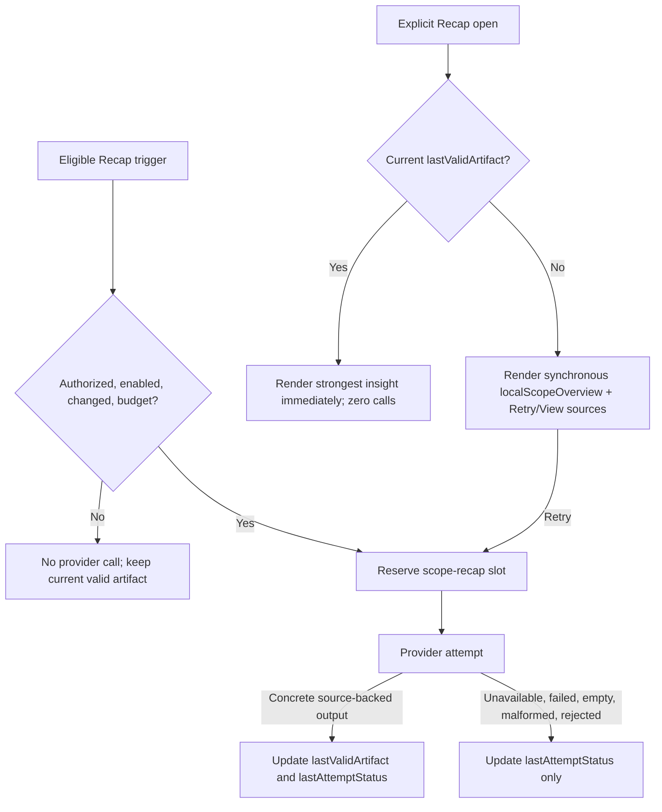
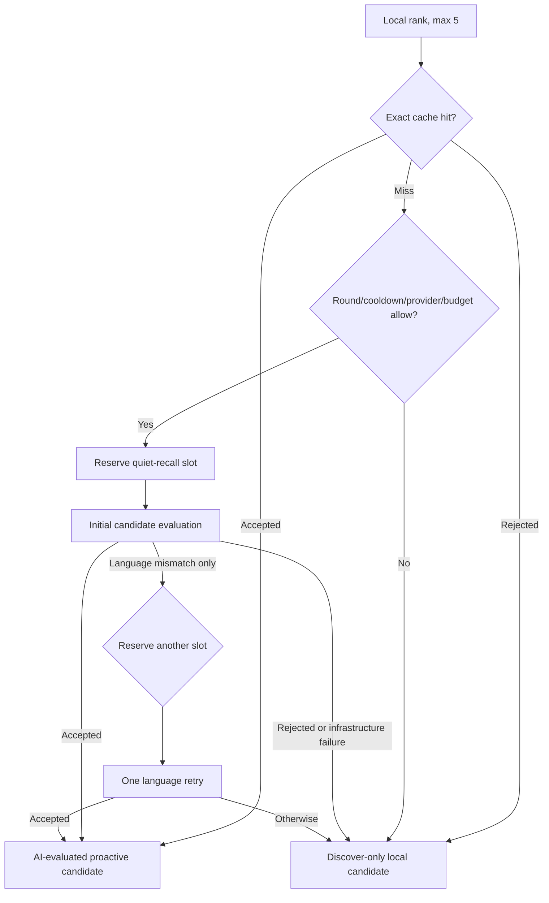

# Pagelet B-108 Dogfood Follow-up Software Design Document

Document status: Approved
Updated: 2026-07-19
Work item: B-108
Authority: 本 track 的 source-verified implementation design、兼容性、成本/隐私风险、回滚与 test matrix。
Product spec: [Scope Recap And Theme Summary Product Spec](../../../product/specs/pa-scope-recap-theme-summary-product-spec.md)
Plan: [Delivery Plan](./plan.md)
Tracker: [Development Tracker](./tracker.md)

## Current Source Baseline

以下名称已由 `rg` 对当前 worktree 核实并已完成 automated/deploy gate；最终 unlocked-app/mobile smoke 状态以 Tracker 为准，不能从实现存在推断为已发布行为。

| Surface | Current verified baseline | B-108 design delta |
| --- | --- | --- |
| `src/pa/scope-recap.ts` | `ScopeRecapRunResult` 同时承载 summary 与结构化 items；旧兼容入口可能在 provider 失败时返回 summary shell | Implemented `ScopeRecapPreparationResult`, `ScopeRecapAttemptStatus`, `ScopeRecapLocalOverview`, source snapshot/currentness and proactive-quality helpers |
| `src/pagelet/bubble/recap-card.ts` | `scopeRecapToDeliveryCandidate` 是显式 Recap Delivery 入口 | 真实、fresh、至少一来源的具体 insight 可 click-to-view；进入 proactive candidate/nudge 另需至少两来源，summary/coverage 均不可进入 |
| `src/pagelet/orchestrator.ts` | 独立 prepared-Recap timer、artifact/candidate/payload 和 Quiet Recall nudge lifecycle 已存在 | 拆分 last-valid/attempt/local overview、授权/预算 gate、stable fingerprint suppression、Retry/View sources 与 stale-result guards |
| `src/plugin.ts` | `runScopeRecap`, `runQuietRecall`, provider model、`PageletRateLimiter` storage adapter 与 cost tracker 是调用边界 | 每次 `model.invoke` 前按 feature bucket reserve；Quiet Recall 改由独立 evaluation coordinator 驱动 |
| `src/pa/quiet-recall.ts` | local candidate generation 和串行 LLM helper 存在；local template `whyNow` 仍可能从旧路径流入 | Implemented `evaluationProvenance`, `evaluationFingerprint`, `discoverCandidates`, diagnostics；只有 AI pass 进入 proactive pool |
| `src/pa/quiet-recall-evaluation.ts` | Implemented session coordinator, max-5/max-10, in-flight dedupe, bounded LRU and attempt diagnostics | 作为 DEC-020 唯一 candidate-evaluation owner；runtime 不再维护平行 batch/template fallback |
| `src/settings/pagelet/index.ts` | generic `preloadEnabled` 默认 false、generic `proactiveHints` 默认 false | Implemented `scopeRecapPreparationEnabled`, `scopeRecapBackgroundAuthorization`, `scopeRecapHighValueHints`，不得继承 generic setting 值 |
| `src/pagelet/pa-review-rate-limit.ts` | `PageletRateLimiter.reserve()` 支持 sliding-hour/local-midnight state | 复用实现但使用 `foreground-review`, `scope-recap`, `quiet-recall` 三个独立 storage namespace |
| Bubble/Tab/Pet | Bubble delivery/stack、Tab sections、Pet timers/menu 与 scoped CSS 已存在 | 新增 honest Recap state/structured section；默认单 Recall card；复核 context action、long-press、字体和 card styles |
| Tests | 现有 scope-recap、quiet-recall、orchestrator、Bubble、settings、locale、Tab、Pet suites | 新增真实 call-count、consent migration、outcome/race/cache invalidation 和 formal smoke evidence |

## Design And Data Flow

### Scope Recap Authorization, Settings And Budget

1. 新安装和旧配置迁移后，`scopeRecapBackgroundAuthorization = "pending"`、`scopeRecapPreparationEnabled = false`；generic `preloadEnabled` 与 `proactiveHints` 的旧值不迁移到 Recap。
2. 第一个 eligible background read 只产生 disclosure request，不调用 provider。披露显示当前 scope/included/skipped、provider/model、note text transfer、2/h+10/day cap、可能成本、source notes 不会被修改和 cache 可清除。
3. `Run` 写入 `authorized-v1`，开启 preparation，并将高价值 Recap hint 初值设为 enabled；`Adjust` 打开相关 Data Boundary/Recap settings 且保持 pending、零调用；`Cancel` 写入 `declined-v1` 和 disabled，reload/upgrade 后不再提示或调用，直到用户显式重新开启。用户从 Settings 重新开启后必须恢复 disclosure eligibility，包括同一 app session；再次选择 `Run` 前仍保持零 provider call。
4. Settings 提供两个互不混淆的用户控制：后台准备和高价值 Recap 提示。关闭提示不关闭 preparation/click-to-view；关闭 preparation 不改 generic preload，也不清除用户其他 hint 选择。
5. Recap 使用独立 `scope-recap` limiter：rolling hour 2，local day 10。每个后台调用和显式 Retry 都在 provider invocation 前 `reserve()`；provider throw/timeout/empty/malformed/rejected 均消耗已保留 slot。无法可靠读取或持久化 limiter state 时 fail closed，不调用 provider。
6. Eligible trigger 限于 Pagelet open、debounced current-note/source activity、idle or explicit Retry。相同 source snapshot single-flight/dedupe；后台失败按 5 分钟、30 分钟退避，且始终受 2/h+10/day 限制。显式 Retry不等待后台退避，但仍受同一 limiter。

### Honest Recap Outcome Model



- `lastValidArtifact` is in-memory derived content for this delivery slice. It is viewable only when scope, complete source snapshot, Data Boundary snapshot, TTL and freshness match.
- `lastAttemptStatus` is separately inspectable, content-free operational metadata: timestamp, outcome category, scope kind/count, source/Data Boundary fingerprints, call-made flag and estimated usage/cost. It never overwrites artifact content.
- `localScopeOverview` is synchronous, non-persisted and explanation-only: scope/time range, bounded linked source titles, changed markers, coverage/skipped facts. Its type has no theme/tension/inference/action field and cannot be passed to retrieval, `DeliveryCandidate`, hint or cost-bearing generation.
- Compatibility helpers that still return `ScopeRecapRunResult` must return a non-deliverable shell on failure; all delivery gates use the typed preparation outcome or concrete-quality predicate, never `providerInfo`/summary presence as success.
- A stale async response is discarded when route token, scope fingerprint, source snapshot or Data Boundary snapshot no longer matches.

### Scope Recap Artifact Quality And Visible Delivery

- A click-to-view valid artifact contains at least one actual structured LLM item with valid sourceRefs; a proactive hint additionally requires one concrete theme/tension/open question backed by at least two distinct source notes and a meaningful why-it-matters relation.
- The strongest proactive item is selected deterministically: tension, open question, then theme; ties use distinct source count and stable ID. Summary and next-action templates have zero proactive weight.
- Stable fingerprint hashes normalized scope, item section/title/body and sorted source identities. It excludes generation timestamp/run/cache IDs.
- A bounded persisted suppression ledger records shown/dismissed/Later for the artifact lifetime, capped at 200 fingerprints. One fingerprint triggers Pet animation at most once. `Later` suppresses Bubble resurfacing for 24 hours but never schedules a second Pet nudge; explicit Recap remains available.
- The independent `scopeRecapHighValueHints` gate may create the DEC-018 exception even while generic hints remain off, but Focus Mode, quiet hours, global cooldown, reduced motion and no modal/sound/focus-steal rules still apply.
- Bubble body is the strongest actual observation, not “Recap ready.” Clicking opens a structured `scopeRecap` Tab section with source links. If no valid artifact exists, the same entry shows Recap Needs Retry with local orientation, `Retry`, and `View sources` without implicit provider work.
- Target perception gate: within three seconds of opening an authorized prepared Recap, the visible surface contains concrete source-backed insight; an explicit Recap open without a valid artifact instead contains a truthful, linked local orientation/recovery state. A spinner/generic CTA alone fails either Recap path. This gate does not redefine the ordinary `Intentionally Quiet` Pet/Bubble state when no Recap entry or artifact exists.

### Quiet Recall Independent Evaluation, Limiter And Cache



- Local ranking selects at most five candidates in deterministic order. Evaluation concurrency is one; failure/rejection of one candidate does not erase already completed siblings.
- Per round: at most five initial calls and one language retry per candidate, hard maximum ten actual calls. A second mismatch is a deterministic rejection; other failures never retry in the same round.
- Quiet Recall uses an independent persisted `quiet-recall` limiter: rolling hour 10, local day 50. Each initial/retry call reserves before invocation. Failed/timeout/malformed/rejected/wrong-language calls count. Limiter exhaustion stops further calls in the round without deleting completed accepted siblings.
- The 60-second cooldown limits new evaluation rounds, not individual calls. An exact cached positive result may be reused during cooldown; without one, local candidates remain Discover-only.
- Exact `contextFingerprint` contains normalized current-note path and full content hash, locale, provider/model, evaluator/prompt version and Data Boundary snapshot. Candidate fingerprint adds stable candidate identity plus sorted source paths/content hashes and relation inputs.
- Cache ownership is one `QuietRecallEvaluationCoordinator` per plugin/vault session. It caches accepted and deterministic rejected judgments only, dedupes identical in-flight work, uses LRU maximum 128 entries, and clears on unload, provider/model/locale/policy reset or manual relevant-cache clear. Provider unavailable/error, timeout, cancellation, cooldown and limiter blocks are never cached.
- `evaluationProvenance = "ai"` and an exact fingerprint are mandatory for proactive eligibility. Local/template candidates use `evaluationProvenance = "local"` and may be shown only by explicit Discover as `Local related clue` / `本地关联线索`, using a distinct discovery/source-list presentation with no AI why-now and no Recall stack membership. Runtime must not reconstruct template why-now when evaluation is absent.
- Bubble defaults to one visible accepted card. A stack of two or three is allowed only when all items independently passed, are distinct/source-backed and unsuppressed. Closing/ignoring creates no Review Queue item.
- Diagnostics are content-free and separate round, candidate index/fingerprint, initial/retry, reserved/not-reserved, cache/in-flight hit, accepted/rejected/blocked/failed reason, provider call totals, limiter remaining and estimated cost. Do not record note title, path, excerpt, prompt or why-now text.

## Interfaces And Ownership

### Implemented Persisted Settings

```ts
type ScopeRecapBackgroundAuthorization =
  | "pending"
  | "authorized-v1"
  | "declined-v1";

interface PageletSettings {
  scopeRecapPreparationEnabled: boolean;
  scopeRecapBackgroundAuthorization: ScopeRecapBackgroundAuthorization;
  scopeRecapHighValueHints: boolean;
}
```

- Settings merge/render/i18n ownership: `src/settings/pagelet/index.ts` and Pagelet locale JSON.
- Authorization UI ownership: Pagelet Recap controller/modal; close-without-choice is `Adjust/later`, never authorization or durable decline.
- Operational limiter keys are not user settings. Use separate vault/config-scoped storage namespaces for `scope-recap` and `quiet-recall`; keep existing foreground/generic state untouched.

### Implemented Recap State

```ts
interface PreparedScopeRecapState {
  lastValidArtifact: ScopeRecapRunResult | null;
  lastAttemptStatus: ScopeRecapAttemptStatus | null;
  localScopeOverview: ScopeRecapLocalOverview | null;
  scopeKey: string | null;
  sourceSnapshotId: string | null;
  dataBoundarySnapshotId: string | null;
}
```

- `src/pa/scope-recap.ts` owns pure construction, strict parsing, quality/currentness, fingerprint and overview helpers.
- `src/plugin.ts` owns source collection, provider invocation, reservation, timeout and cost/attempt recording.
- `src/pagelet/orchestrator.ts` owns trigger scheduling, route freshness, last-valid state, suppression and surface routing.
- Bubble/Tab own presentation only and must not infer success from generic summaries.

### Implemented Recall Evaluation Contract

`QuietRecallEvaluationCoordinator` owns independent iteration, cache/in-flight dedupe, per-round cap and diagnostics. The injected `reserve(attempt)` owns persisted call authorization; the injected evaluator owns exactly one provider invocation and returns accepted/rejected/language-retry. `buildQuietRecallCandidates` remains local candidate generation and never authorizes proactive delivery.

## Lifecycle And Cleanup

- One coordinator/limiter set per plugin/vault session; clear instances, in-flight maps and cache on unload/reload.
- Orchestrator clears Recap/Recall timers, pending flags and route tokens on destroy; late results verify run/scope/source/Data Boundary identity before committing.
- Settings/provider/Data Boundary changes invalidate relevant prepared state and exact caches. Disabling Recap cancels scheduled background work but does not mutate source notes.
- Modal listeners are owned by the modal and removed by `onClose`; Pet/Bubble listeners and timers follow existing component teardown.
- Cache-clear action clears derived Recap state, attempt display, suppression ledger entries for that cache and Recall exact cache where explicitly selected; it does not reset consent or call-limit counters unless a separate diagnostics action explicitly says so.

## Data, Privacy, Permission And Cost

- No provider-backed background Recap read before affirmative `Run`; `Adjust`, `Cancel`, closing disclosure, unconfigured provider and migrated legacy state make zero calls.
- Scope/Data Boundary is resolved before disclosure, fingerprinting and prompt construction. Excluded sources never enter provider prompts or local title lists beyond safe skipped counts.
- Persist only settings, content-free limiter counters, attempt diagnostics and hashed suppression identifiers. Recap artifacts and Recall evaluation judgments remain session-local for B-108. Do not persist prompts, note text, excerpts, why-now or raw provider output.
- Recap 2/h+10/day and Recall 10/h+50/day are hard fixed engineering guardrails, not advanced user-tunable caps. Diagnostics may show usage/remaining/time-to-resume in product language.
- Cost tracker records feature, initial/retry distinction, input/output estimate and outcome even when output is empty; ordinary UI avoids token/provider/schema jargon.
- No flow writes Markdown, Memory, tasks, backlinks, source notes or Review Queue without a separate existing user-confirmed action path.

## Compatibility, Migration And Rollback

- Missing/malformed new settings normalize to pending + preparation disabled + high-value hint preference true-but-inactive. Existing generic preload/hint fields remain byte-for-byte semantically independent.
- `declined-v1` persists across reload/upgrade. Explicitly re-enabling preparation moves declined to pending and requires `Run`; it never grants authorization from a toggle alone.
- A provider/model or materially broader Data Boundary change invalidates prepared/currentness state and exact Recall cache; the next Recap background read requires renewed disclosure when the prior authorization no longer covers the transfer.
- Desktop and mobile share state contracts. Authorization, Bubble, Tab and long-press layouts must fit Obsidian text scaling and touch targets; no desktop-only hover is required for meaning.
- If typed outcome integration must be rolled back, disable background preparation and proactive Recap/Recall delivery while retaining explicit local overview/Discover and source opening. Never roll back to generic-summary Recap or template Recall nudges.
- No release migration or durable note-format migration is introduced. All persisted additions are optional/versioned and safely ignored by older builds.

## Test Matrix

| Requirement / AC | Unit / integration | App smoke | Failure / fallback | Evidence target |
| --- | --- | --- | --- | --- |
| B-108/REQ-01, B-108/REQ-02, B-108/REQ-06 / B-108/AC-01, B-108/AC-05, B-108/AC-06 | settings merge/render + authorization controller/provider spy | fresh/legacy vault: Run, Adjust, Cancel, toggle, reload | close modal, malformed state, declined migration issue zero calls | Tracker T-01 |
| B-108/REQ-03, B-108/REQ-05, B-108/REQ-07 / B-108/AC-04 | fake-clock scheduler, feature limiter N/N+1/reset/reload, diagnostics schema | open/save/idle and inspect usage/status/cache clear | storage unavailable, duplicate source snapshot, cap reached fail closed | Tracker T-02 |
| B-108/REQ-04, B-108/REQ-12 / B-108/AC-02, B-108/AC-09 | strict builder, strongest-item mapper, orchestrator no-duplicate-call, Tab DOM | prepared insight opens within three seconds with source links | no artifact never renders generic ready copy | Tracker T-03 |
| B-108/REQ-08, B-108/REQ-09, B-108/REQ-10, B-108/REQ-11 / B-108/AC-07, B-108/AC-08 | quality gate, stable fingerprint, shown/dismiss/Later persistence, focus/quiet/cooldown | one high-value nudge; toggle independence; reload and reduced motion | one-source/summary/stale/repeated/suppressed result stays silent | Tracker T-04 |
| B-108/REQ-13, B-108/REQ-14 / B-108/AC-03, B-108/AC-10, B-108/AC-11 | typed outcomes + last-valid/attempt race/currentness tests | valid artifact followed by provider/offline failure | null/throw/timeout/empty/malformed/rejected/stale cannot overwrite valid | Tracker T-05 |
| B-108/REQ-15, B-108/REQ-16, B-108/REQ-17 / B-108/AC-12, B-108/AC-13, B-108/AC-14 | state/content/Tab tests; Retry provider spy; source callbacks | no artifact: immediate local orientation, Retry, View sources | retry fail preserves visible content; no provider jargon or fake insight | Tracker T-06 |
| B-108/REQ-18 / B-108/AC-15 | five-candidate order, sibling isolation, one language retry, max-10 counter | fixture with pass/reject/error/mismatch siblings | sixth candidate/third attempt never invoked | Tracker T-07 |
| B-108/REQ-19 / B-108/AC-16 | rolling hour/local day N/N+1, reload, reserve failure, failed/retry counts, bucket independence | inspect usage then reach limiter without extra network call | storage uncertainty blocks before invocation; completed siblings retained | Tracker T-08 |
| B-108/REQ-20 / B-108/AC-17 | exact cache/in-flight hit and one-component invalidation matrix | reopen same context then edit note/change locale/provider | availability/cooldown/budget/timeout/provider errors not cached | Tracker T-09 |
| B-108/REQ-21 / B-108/AC-18 | production runtime mock: provider/cooldown/budget/cache miss/failure produce zero proactive candidate | offline/cooldown/cap state shows local match only in Discover | template why-now cannot cross provenance gate | Tracker T-10 |
| B-108/REQ-22 / B-108/AC-19 | Bubble coordinator/view single-card vs qualified stack, provenance, diagnostics and no-queue tests | one accepted candidate by default; optional 2-to-3-card stack; localized actions | mixed local/rejected/duplicate items never enter stack | Tracker T-11 |

## Open Design Findings

- No unresolved product decision remains. Exact caps, authorization semantics, cache identity/ownership and fallback behavior are fixed above.
- Any implementation finding that would persist provider content, weaken pre-call reservation, expand background scope, alter default hint families or create automatic writes is a product-scope change and must stop for a new Decision/Product Spec update.
- P0/P1/P2 review findings block validation; optional presentation polish outside the v2.9 evidence list returns to Backlog rather than expanding B-108.

## Approval

- Design authority: DEC-017 through DEC-020 and the current owning Product Spec; related Quiet Recall/Bubble specs provide supporting narrative only.
- Approved on: 2026-07-18.
- Authorized implementation scope: exactly the B-108 requirements and acceptance criteria mapped above, plus the minimum v2.9 UI/i18n fixes needed to pass formal smoke; no commit, closeout, push or release.
