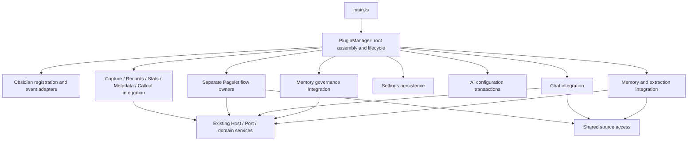

# Plugin Shell Refactor Software Design

Document status: Approved
Updated: 2026-09-20
Work item: B-143
Authority: 本 track 的源码核实设计、所有权、兼容性和测试矩阵；不是已交付架构。
Product spec: [Product Spec](../../../product/specs/pa-plugin-shell-refactor-product-spec.md)
Plan: [Delivery Plan](./plan.md)
Tracker: [Development Tracker](./tracker.md)

## Current Source Baseline

基线 `a49b7a0175d3e5b8e9514ffa7364dda2aa01bceb`；[src/main.ts](../../../../src/main.ts)
导出 [PluginManager](../../../../src/plugin.ts)。plugin.ts 为 14,484 行；前轮 AST
统计为 435 个方法/getter、130 个属性声明、117 条 import。源码相对该轮未变化，
这些数字仅解释审查规模，不是拆分指标或性能证据。

| 已核实来源 / 位置（基线行号） | 设计意义 |
| --- | --- |
| plugin.ts 1583 onload、2002 onLayoutReady、2027 onIdle、10024 onunload/unloadAsync | 保留调用阶段与明确协调；所谓 onIdle 当前是 0ms timeout，不改成新的 idle 调度 |
| plugin.ts 2107 Vault bridge、2228 syncPageletRuntime、2736 destroyPageletRuntime | 同步失效、启动重放、自写入和 feature 关闭是不同责任 |
| plugin.ts 2844 createPageletHost、3261 后 review/governance、3577 Recap、4647 Recall、8493 Discover | Host 同时混有实际业务流程和 B-136 后保留的兼容服务；迁移前必须核对生产可达性，不能把保留接缝误当当前用户入口 |
| plugin.ts 5574..7490 治理、7505 MemoryHost、7526 AiServiceHost、7771 Operations、8000..8413 Chat/Capture | 复用现有 coordinator/service；状态/队列/取消资源随 owner 迁移 |
| plugin.ts 10154 上下文投影、11058 bootstrap、11936 settings、12202 persistence、12389 write queue、14089 AI 事务 | 治理、settings、AI 事务是多个有序通道，不能简单合并 |
| plugin.ts 12451 Callout、12571 metadata、12618 views、12764 source boundary、13069 stores、13213 diagnostics | 不遗漏小功能、共享来源与工具消费者 |
| plugin-record-note、公共 plugin-harness 与 get-vss-files 测试 | 主入口测试有 96 处 Object.create(PluginManager.prototype)，全测试树共 98 处；不能生产代码补 lazy fallback 仅迎合旧 harness |

已有接口：[MemoryHost](../../../../src/memory/MemoryHost.ts)、
[ChatHost](../../../../src/chat/ChatHost.ts)、[AiServiceHost](../../../../src/ai-services/AiServiceHost.ts)、
[StatsHost](../../../../src/stats/StatsHost.ts)、[EditorPluginHost](../../../../src/stats/EditorPluginHost.ts)、
[PageletHost](../../../../src/pagelet/PageletHost.ts)、[QuickCaptureHost](../../../../src/quick-capture.ts)。
前几类 settings 保持实时对象引用，Pagelet 通过 getter 合并最新 Data Boundary；
两类语义都不能改成构造时快照。MemoryHost 的准入设置持久化不能替换为普通
saveSettings 而丢失卸载期间的排空许可。

除 main 外，12 个生产消费者仍直接导入 PluginManager：ai-services/service、ai、
callout、components/Statistics、local-graph、plugin-manifest、preview、progress-bar、
settings、stats-view、theme-manifest、view。Settings 依赖最多，先维持 facade 后按
实际读取能力缩窄；已有业务 Host 不重复定义平行接口。

官方 [生命周期指导](https://docs.obsidian.md/plugins/guides/lifecycle-management) 与
[加载指导](https://docs.obsidian.md/plugins/guides/load-time) 要求正确注册/释放资源，
不要求所有业务代码物理位于 plugin.ts。Plugin API 必须在正确 Plugin 实例调用，
可以由适配器在原时点委派；Component 的同步卸载不能代替异步数据排空。
当前打包为单入口 CJS、无 splitting；文件拆分不意味着懒加载或启动变快。

## Design And Data Flow

箭头表示有限能力依赖，不授予读取所有插件状态。根负责组装同一服务实例并传入
已有 Host 或精确函数/值。新的业务模块不得接收 PluginManager、任意属性 bag、
字符串 service locator，或一个复制全部私有方法的万能 Host。
平台注册适配器仅持有必要注册函数；Callout 的公开 getApi 所需 Plugin 身份由根
提供窄的获取闭包，不把 Plugin 注入业务层。

## Interfaces And Ownership

以下路径/名称均为 **Proposed**，不声称已存在；实施可按仓库命名习惯局部调整，
但不可更换责任边界。优先扩展已有合适模块；只为确有状态/资源的 owner 建类。

| Owner / Proposed location | 随迁状态与操作 | 输入与输出 / 临时兼容 |
| --- | --- | --- |
| plugin.ts root；plugin/obsidian-registration.ts、vault-event-bridge.ts | 根 unloading、启动阶段 handle、Plugin 身份；注册定义与事件桥各归适配器 | 显式 register* 函数、业务动作和失效函数；关键时点仍由 root 调用 |
| capture/plugin-integration.ts、stats/plugin-integration.ts；plugin/record-actions.ts | Capture 后处理/记录路径/Stats 与 editor 接线；status/observer 各随所属功能 | 复用 QuickCaptureHost/StatsHost/EditorPluginHost；createNewNote、join、statsManager 兼容存活消费者 |
| plugin/metadata-updater.ts、callout-integration.ts | 开关、唯一订阅、debouncer/cleanup timers；Callout 等待取消与 API 结果 | app 中必要能力、实时设置、日志、root unloading getter；按 LC-02/03 在卸载开始取消自有等待，其余关闭顺序保持 |
| pagelet/plugin-quiet-recall.ts | Quiet Recall 专属 limiter/coordinator、admission tail/cooldown、来源/currentness、运行与 save/feedback 适配 | 当前命令仍转向 Deep Discover，旧 evaluator 不重新接入；共享 first-use admission/cost/source/store 仍为同一实例；组合 Recall/Recap 状态的聚合器与 storage helper 留 common owner |
| pagelet/plugin-scope-recap.ts | 当前仍存在的 Recap limiter、本地 overview、source/currentness、provider preparation 与成本适配 | B-136 已删除 scheduler/last-valid cache/nudge/UI，当前无生产 producer；只迁移保留接缝；组合 rate status 只读本域 limiter snapshot |
| pagelet/plugin-deep-discover.ts | 当前生产可达的独有 limiter/store、controller/scheduler 引用、初始化身份、policy epoch 与 reset/run/usage 适配 | scheduler/controller 继续各自拥有 in-flight/cache；共享 admission/cost/coordinator 不复制；feature/root 关闭在首个异步 drain 前同步 stop 新准入 |
| pagelet/plugin-review-actions.ts、plugin-integration.ts 及窄 Operations/maintenance adapter | 保留的 foreground review adapter、生产可达的 Operations 会话/自写标记、maintenance/insight/write 动作与 feature scope | 始终注册的 detail view 使用 root-lifetime action adapter；feature scope 只释放其 UI/session/in-flight；共享 OperationsService/repositories/governance 与 orchestrator UI 状态不复制或提前迁移 |
| chat/plugin-integration.ts | history/images/writing 的 shell 组装、恢复与资源引用 | ChatHost、既有服务及分离的 stop/drain/dispose 方法；保留根关闭跨模块交错 |
| plugin/settings-persistence.ts | 实时 settings、持久化 write tail、load/migration/save/drain | app loadData/saveData 的窄委派；迁移业务回调保持既有顺序，不移动到 constructor |
| ai-services/plugin-configuration.ts | AI 配置 transaction tail、快照、凭据补偿和 readiness 接线 | settings owner、既有 service 和 credential 能力；patch 类型迁出后暂 re-export |
| memory/plugin-governance-storage.ts、plugin-governance-actions.ts | repositories/cache/bootstrap/subscriptions；mutation queue、retry、projection/finalization/rollback | 复用现有 repositories/coordinators；这两个职责不能合成新的万能总管 |
| memory/plugin-integration.ts | Memory/VSS 接线、A/C scheduler、提取/legacy profile 上下文适配 | MemoryHost/AiServiceHost；Memory 行为仍归 MemoryManager，index 操作仍经 VSS 队列 |
| plugin/source-access.ts | 原共享路径/标签/生成笔记规则、正文/source identity 检查 | 实时读取依赖；Pagelet/Memory 独有规则仍各自附加，不把窄准入拓宽 |
| root 上保留的 diagnostics facade | 会话 API、同一 diagnostics controller、加载时 build identity Promise | 工具可达性/数据形状/采样时点保持，必要内部实现可迁出；不为文件行数删 facade |

### Migration seam

每片先写明字段、方法、资源、测试的 owner，再整体迁移。P1/P2 依赖尚未迁出的
settings/governance 时，从根传现有窄操作和同一引用；P3 迁移后更新装配来源，
不引入双写、复制队列或同步层。公共 getter/转发只做 delegation；内部模块不能
经它任意绕回 root。Root retained state 仅限根协调和兼容投影，不留第二套业务状态。

共享 settings 在现有 load/migration 生命周期稳定后按原时点注入；`loadSettings`
及 migration conflict reload 仍可替换当前 settings 实例，稳定后的 owner 通过 getter
读取同一当前实例，不能在 constructor 捕获默认对象。检查 update 原地变更与整体
赋值的所有路径，不能只靠 readonly 类型保证引用活性。测试迁至
新 owner 的真实构造；壳层集成测试保留真实工厂/Host/回调接线，避免全部 mock
掉委派而无法发现运行中未初始化 owner。

Settings persistence 只拥有一条写队列和 required-transaction 固定点 drain，但专用
提交仍保持不同协议：普通保存、Graph/图片 defaults、permissions、Statistics、Memory
admission、background discovery 和 slice compensation 不压成一个通用 patch。legacy
compatibility barrier 仍是同一实例，并经该唯一写队列执行 process/readback；T-17/18
通过窄能力使用，不另建 data.json 队列。AI 配置 queue、Settings queue 与 SecretStorage
是三个协作边界；provider save-first、Chat secret-first、图片专用 secret-first 的顺序、
revision 和补偿各自保持。卸载限制只沿用现有入口 guard，不能顺带给所有 secret
入口增加新行为；已接纳事务继续由 required-transaction drain 完成提交或补偿。

Memory governance storage 采用 prepared handle → T-18 crash recovery → current commit →
T-19 Profile recovery 的两阶段接线。T-17 owner 独占 repository/key/source hash、
adapters/cache/subscription/bootstrap runtime；Forget/finalization/rollback 使用带 generation
的 prepared handle，不靠半发布的 root 字段，成功后才原子发布 ready/cache/store/
subscription。随后 T-19 在 current handle 上 reconcile Profile cache/resume projection，
最后再安排 retry/GC。await 后发布 cache、rollback 切换或 subscription refresh 都必须
验证 handle 仍 current；旧结构若先复现 refresh 与 rollback 交叉缺陷，按超出
LC-01..03 的新既有缺陷停下讨论，迁移后才出现则作为本次回归修复。

B-136/DEC-035 后的当前源码还要求区分“保留服务”和“当前产品触发”。
`PageletOrchestrator.runQuietRecall()`、`runScopeRecap()` 以及命令回调都转向
`runExplicitDeepDiscover()`；生产源码没有调用 Host 的旧 Recall/Recap evaluator。
T-10/T-11 迁移仍被 tests/兼容接缝使用的真实 adapter、limiter 和 domain wiring，
但不得恢复已删除的 Recall/Recap producer、cache、nudge、retry 或 Panel 流程。
阶段实机只验证现有别名与零额外调用；保留服务本身用真实 owner 确定性测试验收。
同样，当前 `reviewCurrentNote()` 已转向 Deep Discover；T-13 只能迁移仍保留的
foreground Review adapter 及其确定性竞态保护，不能把旧 Host callback 重新接回
用户入口。Pagelet Operations、maintenance 和 insight/write 动作按各自当前生产
可达性迁移，且不吞并跨 Chat 共用的 OperationsService 或治理事务。Pagelet detail
view 在启动时始终注册，因此它依赖的 action adapter 保持 root lifetime；feature
关闭只退休 feature 自有 scope、UI 与 Pagelet session，不能让 detail callback 指向
已释放对象。Recall/Recap 各 owner 只暴露本域 limiter snapshot；组合 rate status
与共享 rate-limit storage helper 保持 common owner，不随任一领域重复迁移。

### Tool consumers are compatibility consumers

[pagelet-smoke-runner](../../../../scripts/pagelet-smoke-runner.js) 的 D6 当前使用私有
repository/coordinator 字段阻止 durable 治理数据写入，还会重置 legacy store。
迁移 T-17 的同一片改为版本化、content-free 的只读安全 probe：durable、unknown、
failed/unavailable、probe missing/throw/malformed/unknown-version 一律 BLOCKED；只有测试
fixture 显式提供 `isolated_legacy_fixture` 恢复能力时允许 legacy 演练，生产实例永不
授予该能力。脚本不再清私有 store 或以字段全空推断安全；隔离 fixture 必须证明正常、
candidate throw、保存失败后状态均恢复。优先最小兼容方案，不新建通用诊断框架，
不在真实用户数据上重演写入。

[retrieval runner](../../../../scripts/retrieval-optimization-smoke-runner.js) 临时包装
retrievalDiagnostics.recordFor；必须保持同一实例、设置漂移检测与恢复清理。
start/get/stop/arm diagnostics、Pagelet smoke snapshot、Obsidian runtime identity
和 loaded build identity 的结果形状均保留。getLoadedPluginBuildIdentity 缓存
onload 首次读取，不能改成调用时重新读磁盘；否则覆盖新文件但旧实例仍运行将
被误报为新构建。任何源码迁移产生新 bundle 身份，旧 artifact/receipt 不继承 PASS。

T-20 不以生产源码零 `PluginManager` 类型引用为目标。Obsidian Plugin constructor、
仍有活跃消费者的公共委派和 default export 可以保留；逐个 consumer 检查实际需要
的能力，把业务依赖改为既有或新的窄 Host，不能用一个新的 Settings/AI 万能 Host
替换旧依赖。prototype harness 必须显式构造真实 owner，生产代码不得增加 lazy
fallback 迎合 `Object.create(PluginManager.prototype)`。

## Lifecycle And Cleanup

### Global ordering stays explicit

启动维持 loadSettings → migrateSettings/governance bootstrap → legacy profile
context → 原注册/初始化顺序；现有 bootstrap 失败分支保持。视图在 layout-ready
前注册；layout-ready/0ms 阶段不改调度，Memory 重复初始化入口的幂等性保留。
Vault bridge 的同步来源/拓扑失效、异步消费、self-write 和 startup replay 次序不变。

卸载仍由 root 的同步 onunload 发起 unloadAsync 并处理最终错误；不声称 Obsidian
会等待该 Promise。关键现状：root unloading/早期清理 → Memory stop/waitForIdle
→ settings drain → VSS dispose → Stats flush/dispose → writing → image/history
→ extraction/governance → Pagelet → Operations。准确 await、fire-and-forget、catch
及状态置空位置保持；该摘要不授权重排。单个模块需要暴露分开的停止/排空/释放
操作来配合原交错，不用一个“大 dispose”强行改变先后。

LC-02/03 的自有取消需在卸载开始时生效，避免被异步 drain 拖后；这是明确限定
的局部修复，不移动其他 producer。平台 Component 只用于同步资源作用域，
异步写入/持久化完成仍由既有 root 协调显式 await。

D-11 若由 Owner 选择纳入，extraction 必须拆成两个生命周期能力：root 在
`unloading` 和现有早期清理后、首个 Memory await 前同步调用 stop/lifetime gate，
只封闭新调度/重建、取消 A/C timers 并 abort 新 admission；Profile governance
store 等资源仍在现有 extraction 后段位置释放。早期 stop 不得调用后段资源
dispose，后段 dispose 也不得重新开放准入。若 D-11 单列后续，则保持当前单一
后段关闭时点，本次迁移不能暗中加入早停。

### LC-01: Pagelet subscriptions

源码证据：createPageletHost.registerEvent 委派 root；orchestrator.initialize
注册五个 workspace/vault EventRef，destroy 未解除；handleLeafChange 缺少销毁
准入，可在 Markdown leaf 上重新创建 UI。自动 Discover 已有 destroyed/enabled
检查，因此不将其报告为已证实重复 provider 调用。

设计首选为 feature 拥有、同时绑定 root 的 Obsidian Component scope，
PageletHost.registerEvent 注册到该 scope。启用时将当前 scope 作为 root child
加载，feature 关闭时 removeChild/unload 并废弃本次实例；根同步卸载也必须释放
当前 scope，不能等 unloadAsync 后段 Pagelet destroy 才解绑。每轮关闭移除旧
child，不向 root 累计 children 或不可移除清理闭包。scope 的同步关闭同时将其
标为无效，迟到回调重验 scope/实例有效性和 root unloading；guard 不能替代
EventRef 释放。Pagelet UI/业务 destroy 仍保留原异步关闭位置，scope 不接管
其他业务的 drain。独立修复先在原结构完成，后随 feature owner 迁移。

回归还要挂起 Memory drain 后触发根卸载：事件引用此时已释放，已排入的旧回调
不能重建 UI；解除挂起后仍按原顺序完成业务关闭。不要只测试显式 feature toggle。
Deep Discover integration 同样需要同步 stop/lifetime gate：feature 关闭及 root 卸载在
首个异步 drain 前封闭新准入、使迟到 initializer 失效，再由现有后段顺序销毁
scheduler/controller；它们各自的 pending/in-flight/cache 不上移到 integration。
最终 feature integration 的同步关闭顺序为：先使本轮 event scope identity 失效并
解绑，再调用 Deep Discover owner 的同步 stop/reset，随后才销毁 orchestrator/runtime、
retire Pagelet session 并释放各 flow 的 feature 资源。Deep Discover 自行释放其
scheduler/initializer/专属 limiter；feature integration 不直接清它的内部字段。

### LC-02: Metadata pending versus submitted

源码证据：update-metadata 每次开启新增 file-open；停用只替换 debouncer，未
取消旧 pending；processFrontMatter 内的旧 timeout 还会取消当前新 debouncer。
不据此直接声称每次事件一定重复写入。

固定至多一份本插件监听，以当前开关/卸载状态准入。停用/卸载 cancel 自有 pending
debouncer/cleanup timer，在实际处理入口重验；timeout 只关联它所属的任务/代次，
不能取消重新启用后的新任务。保留当前 100ms debounce 和 metadataExcludePath/
metadatas/mtime 转换、状态栏开关语义。已经提交给 processFrontMatter 的写入允许
完成，不中途回滚 frontmatter，不改变整库写入策略。提交后迟到的
processFrontMatter callback 不得给已停止 owner 重新挂起清理 timer。

### LC-03: Callout wait and late result

源码证据：自有 50ms poll 和 2000ms timeout 无卸载取消，await 后直接赋值。
这是有界等待，不称为永久泄漏。给每轮自有等待一个幂等 cancel/settle，卸载清理
两个 timer 并以不可用结果结束；在 getApi 前和 await 后检查卸载/实例有效性。
迟到结果丢弃，catch 也不能改写新实例状态。保留第三方公开 getApi 及正常 API/
未启用/超时默认回退，不修改依赖，不调用私有 API，不声称可取消第三方内部任务。

### Evidence boundary

三项目前是静态路径确认，尚无本任务运行复现；每项在旧结构捕捉目标行为失败，
修复后相同断言通过，再迁移。writingVersions.dispose 的异常传播疑点已撤回：
其 chain 已吸收任务失败，不新增 catch/假回归。全局卸载窗口、history/image
恢复风险尚未证实；现有 admission/disposed/store generation 必须保留。若出现
超出三项的实际故障，先定位旧问题或新回归，再按范围讨论，不能顺便全局改序。

已实施的 LC-02/03 源码 red/green 有效，但 owner 迁移前未保留 app 证明；D-14
用隔离基线 + fix-only 临时 patch 直接构建、部署和观察旧结构，不从当前迁移实现
反推。隔离 patch 不合入交付树，完成后恢复 test-vault assets。LC-01 在 T-08
source修复验收后先完成 fix-only app gate，才允许 T-09..13。

## Data, Privacy, Permission And Cost

不改持久化格式、路径、键/设备身份、schema、provider/prompt/预算、用户确认和
来源访问；root 迁出的算法原样保持。VSS 写入仍经过 operation queue/exclusive
lock，fallback memory 自动维护仍只读；Chat 背景刷新及 DEC-028 marker unknown
规则保持。LC 用 provider-free 回归；真实模型/测试笔记外发继续遵守既有授权，
没有必要仅为重构新增 API 花费。

## Compatibility, Migration And Rollback

无数据迁移。检查新装/已有设置/持久化失败/正在卸载的事务/重启恢复和 desktop/
mobile fallback。每片以同一输入的前后行为对照，恢复代码/构建即回退；不得删除
笔记、清空 DB、重置 vault 或以旧 snapshot 覆盖用户后续数据。临时测试状态使用
合成 fixture 并恢复；保护真实 provider 配置和凭据。

B-142 已删除 12 个重复/自证执行，保留 CSS、settings truth table、单来源/callback、
openPanel 零 provider、abort/dispose/source revoke 独立竞态。只改四个测试文件；
context、plugin-record-note/harness、runner/receipt/FTS、分组/依赖均未改。
不再等待 B-142、不恢复源码黑名单、不启用二 worker 或缓存实验；详细长期约束
见 [GOV-003](../../governance/gov-003-proportionate-test-design.md)。

## Test Matrix

下列是设计选集；执行前按实际变动把确切文件/命令填入 Tracker，不把所有 tests
每片跑一遍。新 owner suites 只新增真实缺口；迁移断言有去向，不加镜像型测试。

| Requirement / AC | Unit / integration | App / failure proof | Tasks |
| --- | --- | --- | --- |
| B-143/REQ-01 / B-143/AC-01 | plugin-record-note、quick-capture、callout、statistics/stats、settings、chat/writing/image 受影响 suites | 命令/菜单/视图恢复及功能表；真实取消/失败与正常结果，模型文本非逐字比较 | T-01..22 |
| B-143/REQ-02 / B-143/AC-02 | plugin-lifecycle、memory-governance-{migration,persistence,rollback,finalization,compatibility}、image/writing recovery 选集 | 旧状态、并发设置/凭据补偿、未知 marker、卸载排空/恢复；隔离 fixture | T-14..19 |
| B-143/REQ-03 / B-143/AC-03 | plugin-lifecycle、data-boundary、task-source-read-guard、pagelet-agent-quality-cache、quiet-recall-evaluation、scope-recap | 来源撤销、异步结果晚到、预算退款、self-write、后台不阻塞正常 Chat；阶段启停 | T-08..19 |
| B-143/REQ-04 / B-143/AC-04 | 新 owner 真实构造、窄 Host integration；src/scripts/tests 消费者检查 | 无新 God object、对象/队列唯一、字段初始化与实际委派一致 | T-00..21 |
| B-143/REQ-05 / B-143/AC-05 | jest-test-groups-script；pagelet-smoke-runner-script/retrieval-smoke-runner、receipt/OPFS/FTS 受影响工具/产物契约 | D6 durable/unknown 拒绝；loaded identity 与实际部署实例一致；迁移后发现与 coverage 有效 | T-00,17,20,22 |
| B-143/REQ-06 / B-143/AC-06 | 独立 phase review + 当前冻结输入 broad/coverage/diff/docs | 每阶段真实桌面 + Obsidian CLI mobile simulator，最终整体巡检；只有实际 iOS 专属变化才增加对应真机；未知平台不冒充通过 | 各 phase exit / T-22 |
| B-143/REQ-07 / B-143/AC-07 | pagelet-orchestrator + root integration：真实事件 subscribe/off，关闭后事件/迟到回调，再启用；root 卸载时挂起 Memory drain | 旧实例无订阅/无 UI 重建；同步卸载不等 drain；当前实例正常；桌面及 mobile simulator 开关/切笔记 | T-08,13 |
| B-143/REQ-07 / B-143/AC-08 | 真实命令/metadata 处理 + 受控时钟：重复开关、pending/提交中、排除/新代次 | 停用/卸载不启动新写入，已提交完整，正常更新不丢；桌面及共享移动路径 smoke | T-03,04 |
| B-143/REQ-07 / B-143/AC-09 | plugin-lifecycle/callout：poll 中卸载、getApi 前后卸载、正常/缺失/超时 | 自有 timers 清空、Promise settle、旧实例不赋值；应用正常/不可用回退 | T-05,06 |

命令与证据选择：

- Source：`npm test -- --runInBand <确切 suites>`；用真实 Jest 发现确认迁移后 suite
  被执行。Tooling：`npm run test:tooling -- --runInBand <确切 suites>`；跨组用
  `test:all` 有界选择，不能误用 source 命令后把未运行工具报为通过。
- Artifact：当前 production build 后运行 `npm run test:artifacts -- --runInBand
  <确切 suites>`；新源码/构建使 receipt/identity 证据失效，不单凭 HEAD 复用。
- 阶段 `make deploy` 已含 lint/build/full Jest；在 test vault 重载并实际操作。
  同输入已完整通过且 build 身份当前时可 `make deploy-current`；这只复用构建，
  不能证明未跑的测试。非 iOS 专属变化使用 `obsidian vault=test dev:mobile on`
  的 mobile simulator，并在 finally 恢复 off；只有真实 iOS 专属变化才调用真机 skill。
- 独立 `npx tsc -noEmit -skipLibCheck` 在没有已包含它的当前 build 时选用；
  DOM source scan 按 AGENTS 原命令，`git diff --check`；文档检查按本仓规则。
- T-22：`npm run lint`、`npm run build`、`npm run test:all -- --runInBand --coverage`、
  docs/diff 与最终桌面/mobile simulator，允许复用同输入已完成项；不降低 coverage 阈值/分母，
  不用 skip、forceExit、timeout 增大或修改正确预期造 PASS。

每阶段 smoke 最少包括该阶段改变的入口和启停/恢复：P1 Records/Capture/Stats/
管理菜单及 metadata/Callout；P2 Pagelet 全流程/Chat/写作/图片；P3 设置/AI/Memory
正常与恢复。P4 检查全部功能入口，Shared UI 路径含现有 Share Card/图谱等外围。
Android/iOS 等当前无真机证据的历史限制保留；B-143 不宣称全平台真机已验证。
后续若产生具体平台专属实现或 simulator 无法覆盖的风险，再做对应真机补证。

## Open Design Findings

| ID | 设计处置 |
| --- | --- |
| D-01 纯移动保留耦合 | 已在设计中要求字段/资源/行为一体迁移与窄输入；实现审查仍需确认 |
| D-02 prototype harness 掩盖构造问题 | owner 真构造 + root 接线验证，禁止生产 lazy 兜底；按片迁移，不整仓重写 |
| D-03 private probe 字段消失造成保护绕过 | T-17 同片保留安全门，T-20 再收敛；不可拖到最终再发现 |
| D-04 全局关闭/恢复条件风险 | 不纳入未经证明的修复；保留现有 guard/顺序，实际新回归必须修复 |
| D-05 feature scope 的根卸载接线 | 独立审查发现并在设计修正：同步 root child 清理与 feature 关闭均释放，异步业务 destroy 顺序保持；增加挂起 drain 回归 |
| D-11 extraction unload 窗口 | Owner于2026-09-21确认纳入T-19：root进入unload后、首个Memory await前同步关闭extraction admission，取消A/C timers并阻止scheduler重建及新的model/VSS cluster调用；已发网络请求不强制取消，Profile store仍在原Chat history后段释放，全局关闭偏序不变 |

以上是设计约束和待实施证据，不是已修复 finding。没有额外未定产品取舍；新的
P0/P1/P2 设计发现必须处理后才允许对应切片实施。

## Approval

- Design authority: Owner；范围继承 DEC-039，技术细节本轮提出。
- Approved on: 2026-09-20；Owner 要求按设计与开发计划完成全部开发、测试和验收。
- Authorized implementation scope: implement-approved-spec；可向 GLM 发送执行所需源码、测试和契约。不得自行扩大行为范围或执行 Git/closeout/release。
