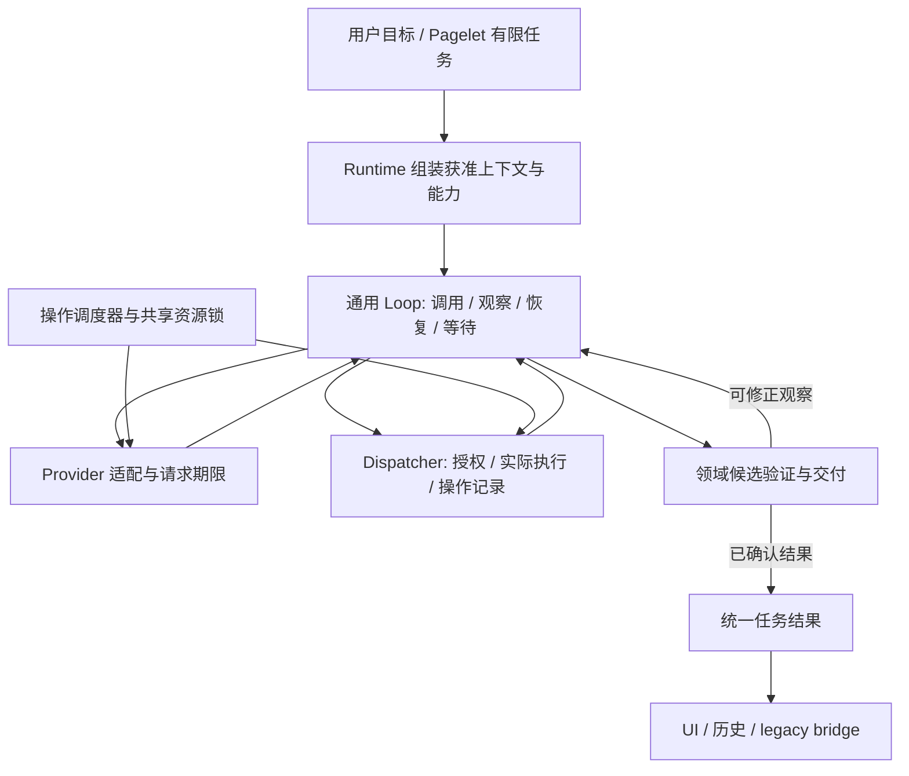
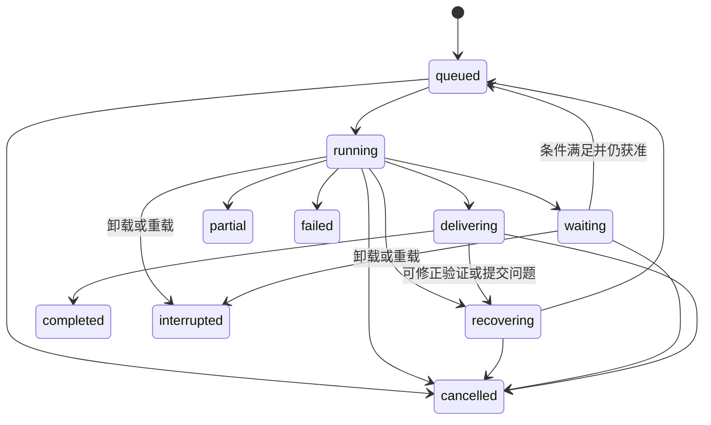

# Recoverable Agent Execution Software Design Document

Document status: Draft
Updated: 2026-09-21
Work item: B-144
Authority: DEC-040 下的 source-verified 目标工程设计；拟新增接口、参数与迁移顺序是工程方案，不表示当前实现。
Product spec: [Product Spec](../../../product/specs/pa-recoverable-agent-execution-product-spec.md)
Tracker: [Development Tracker](./tracker.md)

## Current Source Baseline

源码核对基线为 `05fb1671fa59aa4ee18b7a277c2042000059bcc2`，包含 `9a29f29` 空回答修复。下面是当前事实；后续章节是目标设计。原始事故及 app/跨设备证据边界见[诊断记录](../../validation/pa-agent-empty-answer-diagnosis-2026-09-21.md)，其旧测试通过不证明 B-144 已通过。

| 现有模块 / 符号 | 已核实事实 | 本次设计影响 |
| --- | --- | --- |
| [pa-agent-loop.ts](../../../../src/ai-services/pa-agent-loop.ts), `run`, `runTurn`, `endAgent` | 默认 20 turns、180 秒总时长、incremental idle 60 秒；native writing 尝试后，即使 host 请求 continue 也转终止 | 分离操作期限；候选验证可恢复；唯一任务终态 |
| [pa-agent-runtime.ts](../../../../src/ai-services/pa-agent-runtime.ts), `streamPaAgentCanonicalTurn` | 180 秒与 15 秒收尾预留；来源、写作、模型、host policy 在同一组装路径；`classification: { items: [] }` | 保留组装职责，移出领域状态与规划性强制收尾；不虚构仍在使用独立分类模型 |
| [pa-agent-required-capability-policy.ts](../../../../src/ai-services/pa-agent-required-capability-policy.ts) 与 [answer completion policy](../../../../src/ai-services/pa-agent-answer-completion-policy.ts) | 来源声明、writing schema、重复 read_note 各有特殊恢复；部分失败/状态结果强制 final-only | 统一观察与恢复；只保留真实能力/授权约束 |
| [pa-agent-tool-dispatcher.ts](../../../../src/ai-services/pa-agent-tool-dispatcher.ts), `seenToolCallKeys`, `classifyPreflightSkip` | 多数工具在执行前登记重复键；get_writing_context 专门按成功 receipt 判断复用；默认工具期限 30 秒 | 执行记录区分成功、失败、未知；期限来自能力种类 |
| [task-source-run.ts](../../../../src/ai-services/task-source-run.ts), `capturePersistenceSourceValidity` | 将 Memory 授权、文件身份、mtime/size、来源范围组合为有效性 | 材料版本、授权、写入目标检查分离 |
| [pa-agent-stream-bridge.ts](../../../../src/ai-services/pa-agent-stream-bridge.ts), `emitWritingResult` | 收到 agent_end 后仍判定写作交付或 recovery | 验证前移；bridge 只投影已确认的交付结果 |
| [chat-view.ts](../../../../src/chat/chat-view.ts) | native writing 可为普通 Chat 创建 writingRequest；canonical/legacy/作品回调参与正文与历史 | 普通文本不建立领域状态；所有视图采用同一交付结果 |
| [agent-run-coordinator.ts](../../../../src/ai-services/agent-run-coordinator.ts) | 容量一；Chat 整个 run 持租约，Pagelet 每 turn 持租约 | 改为实际操作名额，前后台各有推进机会 |
| [Pagelet runtime](../../../../src/pagelet/agent/pagelet-agent-runtime.ts)、[types](../../../../src/pagelet/agent/types.ts)、[lead policy](../../../../src/pagelet/agent/lead-driven-policy.ts) | 另有 180 秒、12 turns、30 calls 和收尾提示 | 与共享 loop 一起调整期限及规划性预算；保留 anchor/质量/quiet terminal |
| [chunk consumer](../../../../src/ai-services/pa-agent-chunk-consumer.ts)、[provider retry policy](../../../../src/ai-services/provider-retry-policy.ts) | 新修复已将 idle 起点移到 dispatch，并禁止本地准入错误进入 SDK retry | 复用边界与观测；新期限不能被旧 SDK/transport 上限提前截断 |

## Design And Data Flow

### 1. 职责与单一执行事实



主 Agent 负责语义目标和下一步选择；loop 管理通用状态转换；host 只裁定可核实执行与授权；writing 等领域负责产物。既有 transcript/events 是事实载体，不新建平行事件总线或通用工作流平台。

准备出的工具集合来自真实能力和当前授权。失败不自动缩为 final-only；来源控制声明保留其授权语义，错误可以修正。工具返回的文字不能自行授予权限。Context compaction 保留事实和来源链，不成为第二个任务规划器。

### 2. 恢复与执行结果

复用 `PaAgentToolExecutionResult` 并渐进扩展标准元数据；不将所有领域对象改造成一个大联合。下列名称均为 **Proposed**，实现时可使用现有等价类型。

```ts
type ExecutionState =
  | 'not_started' | 'running' | 'succeeded' | 'failed'
  | 'partially_succeeded' | 'acceptance_unknown';
type RecoveryAction =
  | 'retry' | 'correct_input' | 'choose_alternative'
  | 'refresh_required_input' | 'query_operation'
  | 'wait' | 'needs_user' | 'none';
interface RecoveryObservation {
  code: string;                 // 稳定错误类别，不包含原始异常正文
  executionState: ExecutionState;
  allowedActions: RecoveryAction[]; // 宿主允许，不指定主 Agent 的下一工具顺序
  retryAfterMs?: number;
  operationId?: string;         // 复用领域已有身份；不能由模型捏造成功 receipt
  completedParts?: string[];
  remainingParts?: string[];
}
```

错误保留责任层：输入/协议错误回模型；可恢复 provider 传输错误由 adapter 有界退避；领域已接受操作查询由领域负责。一次失败只有一个重试负责人；Agent 不与仍在 SDK 内重试的同一调用并行重新发送。无权限、认证/额度硬拒绝不得用等待或改参数绕过；保留在合法路径继续的可能。

Dispatcher 将 `seen` 改为有结果的运行内记录：规范调用键 + 所需材料版本/授权上下文 + 执行状态 + 可复用结果。成功且仍适用才复用，复用时返回明确观察；失败不是永久去重条件。最新读取不得命中旧版本结果。调用次数分别计逻辑调用、实际尝试和复用，避免将未发送当付费请求。

纯只读/生成类调用可按恢复规则重试；存在副作用的工具提供现有幂等/操作状态语义。先声明取消不证明远端已停止。未知写入/付费提交进入 query_operation 或 needs_user，不能自动重新提交；批量部分成功只处理 remainingParts。实际能力不支持核实时如实保留未知，不承诺 exactly-once。

### 3. 无进展与收束

不以失败一次、同参数、仅剩状态结果、固定 20 turns/30 calls 或模型反复解释直接决定整个任务结束。新获准材料、有效子目标完成、候选修正成功、操作状态实质变化属于可验证进展；心跳、重复文字、随机参数扰动不是。

工程初始策略 **Proposed**：对相同任务子目标、错误类别、来源版本及执行状态，连续三次等价无进展观察触发一次明确的换策略反馈；该反馈后若下一次相关行动仍等价无进展，保留已有成果并按真实状态等待用户、部分完成或失败。不是 run 总次数上限，不按工具名扩散阻断其他合法路径；新实际进展重置对应记录。合法的异步 pending/Retry-After 等待按操作生命周期处理，不消耗此计数。

SDK 对可重试网络/5xx/429 使用既有退避算法与实际 provider 信息，并把每次尝试计入同一恢复记录；耗尽 adapter 的局部重试后向 Agent 返回观察，不重新给一份无关联的无限重试预算。不得自动切换账户、provider 或模型。Provider 额度、token/context 容量和已明确的费用上限仍是实际边界；不能借新名字恢复任意的短 run 强制收尾。

任务目标在入口确定有限范围；持续新 vault 事件是新的调度输入，不无限扩展正在运行的任务。主 Agent 判断语义完成，host 校验正文/产物/操作事实；无需新增每轮独立 LLM 审查调用。用户确实能补充的信息才进入 needs_user；不可恢复执行失败不伪装成等待用户。

### 4. 材料快照、授权与目标版本

以实际入模的正文/片段及其来源记录建立只读 `ReadSnapshot`（Proposed）：包含来源稳定身份、读取内容摘要标识、已读版本信息及派生关系。正文复用现有上下文对象，运行内保存；不拷贝整个 vault，也不持有 VSS 写锁。内容摘要标识用于相等性和溯源，不写入普通日志。

普通编辑影响 freshness，不取消已读内容。新读取产生新版本；明确“最新”使用现有可靠读取接口重新取得受影响内容，读取期间变化时重取一致版本，不将旧内容加上新 mtime。同一回答使用多个版本时由来源记录区分，不能把旧片段绑定成当前版本证据。

`AuthorizationView`（Proposed）复用现有 Memory 治理、来源范围、排除、图片/风格与 owner/session 授权。每次物理 dispatch（含 SDK retry、summary）核对**本次实际发送的内容**是否仍获准。摘要继承来源关系；授权失效后不能只删除原始工具消息而发送含同样内容的摘要。

普通 Chat 不再把“磁盘 mtime 与读取时相同”当作后续发送或交付条件。写入模块使用独立 `ExpectedTargetRevision`（Proposed）在实际修改前核对；Pagelet frozen anchor/currentness 使用其领域规则。删除、排除、Forget、身份无法证明等仍按原治理处理，不从“允许普通编辑”推导为全部变化可忽略。

撤销时重投影受影响输入并丢弃未获准交付的候选，允许 Agent 从仍合法的材料继续。已提交历史的显示和后续入模沿用 DEC-034/D12 的区分，不新增无条件删除历史。运行取消/会话替换与材料授权分别检查，防止旧结果投递到新会话。

### 5. Writing 与候选交付

Runtime 从现有 capability registry 组装 writing 工具及其 handler；loop 不导入 NativeWritingCallCollector、作品版本类型或识别特定 writing 工具名。普通模型响应与 native 工具调用仍由 provider adapter 解析；领域 handler 消费完整候选或增量预览。

`get_writing_context` 按需准备风格、材料和 parent；普通 Chat 不创建 writingRequest/版本/预览会话，但继续按原权限使用普通个性化背景。保留 DEC-034 的 native 纯作品协议及 legacy reader；不是换协议、增加关键词路由或分类模型。

`present_writing` 产生候选，不自行赋予任务终态。结构/内容缺失返回明确可修正观察；权限/目标问题按对应原因恢复。候选 generation/ID 与 run 绑定，新的候选替代旧候选，旧流回调不得覆盖新预览。合法 `<tool_calls>` 文本示例原样保留；provider 声称调用而缺少原生调用是适配错误，不通过执行 XML 或全局删标签恢复。

产物状态分为 preview、validated、committed（Proposed）。领域校验、必要的本地版本保存或动作 receipt 建立完成后，返回 `DeliveryResult`；loop 发布单一终态。若保存产物失败，可保留已读预览并恢复提交，但不能宣称持久保存成功。bridge/UI/history 只投影同一结果，不在 agent_end 后再独立否决或改写正文。

`DeliveryResult`（Proposed）包含任务结果、文本/产物引用、已完成与剩余事项、剩余限制和已确认操作。中途错误不自动进入最终 warnings。正常 Chat 必须有可读正文或有效非文本交付；Pagelet 合法 quiet no-insight 由其领域判定。需要保存的任务中确认卡是 waiting_user；单纯要求准备方案的任务可在方案交付后完成。

### 6. 操作期限与取消

| 范围 | 目标规则 |
| --- | --- |
| 模型/普通同步远程工具单次实际尝试 | 默认 1,800,000 ms；从名额取得后实际发送/执行开始，到完整响应/执行结束；持续 chunk/心跳不重置 |
| 本地短操作 | 能力级期限；现有 30 秒可作为本地默认工程起点，不套在远程调用上 |
| 异步远程作业 | 使用已有 operationId 与作业协议；每次查询有独立期限，pending 不是失败，不重复创建作业 |
| 排队、Retry-After、等待用户 | 单独记录等待原因，支持取消；不侵占尚未开始的单次尝试期限 |
| Run | 去除通用 180 秒、60 秒静默及软/硬收尾预留导致的强制结束；由进展、真实资源边界与取消管理 |

定义能力级 `AttemptPolicy`（Proposed）并在调用栈传递同一绝对 deadline/取消信号。每个实际 SDK 重试有新的 attemptId 和自身期限，但服从父操作的显式能力覆盖及恢复记录；同一物理请求的 SDK、fetch、读取流、dispatcher 不各自叠加一份期限。复合工具需声明子请求与外层期限关系，实际更短的 provider 服务上限作为能力事实记录，不能宣称仍能等待 30 分钟。

准备阶段是独立本地/远程操作，不使用模型 stream idle。Context summary 等内部模型请求遵循模型尝试策略及父级取消；既有算法性检索规模上限不等于 Agent 总运行时限。Provider 的短静默不能被当作无进展；断连、明确错误或尝试到期才进入恢复。

用户取消立即停止派发并使本地等待返回；协作式 abort 传到执行端。迟到结果只能完成对应操作记录，不推进已取消/已替换 run。对于不响应 abort 的执行，不能立刻作为“已停止”再次执行；保留占用/未知状态，直到确认本地实际请求结束或转入已有异步状态查询。UI 不等待 30 分钟才响应取消。

### 7. 调度与资源

将 `AgentRunCoordinator` 的整 run 排他租约变为实际操作租约；保留单个逻辑任务的上下文顺序，只有依赖允许且现有工具支持时才并行工具批次。

初始调度 **Proposed**：两个逻辑操作名额，前台与后台各一个；类内 FIFO，取消可移除队列项。为保证长后台请求不挡住新 Chat，初版不让后台借走预留的前台名额；两类身份只影响调度，不影响期限、任务目标或恢复次数。实际 provider 硬并发上限更低时共享该硬上限、在安全操作边界公平轮转，不假装物理并行或中止已接受操作让路。

所有共享 loop 的 provider 子调用及重试需识别持有的租约；已经持有同一操作名额时传递上下文，不递归排队获取同一名额造成死锁。退避前释放已结束请求的名额，唤醒后重新排队。等待确认、异步作业下次查询期间释放名额；in-flight 请求和未结束执行不得通过提前 release 隐藏实际并发。

Provider 操作名额与笔记/VSS/Operations 资源锁分离。只在实际冲突操作期间持有资源锁，不跨模型调用、用户确认或 Retry-After 持锁。保留 VSS 独占队列、目标版本检查、Undo 与既有付费操作 admission。此调度只接管本项 Agent 调用路径，不扩大独立后台学习触发范围。

### 8. 运行状态、等待与重载

以下为内部目标状态（Proposed），UI 使用本地化产品语言：



waiting 有原因：用户、Retry-After、外部作业。进程内恢复保留 transcript、快照、观察与领域操作引用。上述所有非终态在卸载时都清理并中断；图中只展开主要边。终态单次发布，取消与交付竞态以已发生副作用和最后有效 run 身份如实裁定。

重载只利用现有 chat/history、作品与领域操作存储：新增最小可选字段（Proposed：上次 runId、unfinished 标记、已有 operation 引用），用于识别中断与呈现“继续”；不序列化完整 transcript 检查点、授权闭包、工具队列或原始 provider 请求。旧历史缺字段不批量标记失败。未保存的新内容不能凭空恢复，向用户如实说明。

“继续”是用户触发的新 run：读取仍获准的已有历史/产物，核实操作记录，再规划 remaining work。需要最新内容则重新读取；过期写入确认不沿用。已有 B-133 独立远程作业恢复遵守自己的契约，不被解释为通用 Agent 自动续跑，也不被本次关闭。

## Interfaces And Ownership

| 状态或决定 | 唯一 owner | 消费者 / 禁止事项 |
| --- | --- | --- |
| 任务目标、下一步计划 | 主 Agent + 真实用户输入 | host 不按工具名规定下一步，不从笔记指令授予权限 |
| 通用执行、等待、恢复及终态 | PaAgentLoop | runtime 配置；UI 不再次裁定成功 |
| 来源内容/版本、派生关系 | 现有 context/source 层 | 请求构造与交付；不等同动态授权 |
| 动态授权与持久副作用 | 现有 host/governance/领域操作层 | 每次实际执行/发送检查；模型不可自签 receipt |
| 实际执行及结果复用记录 | ToolExecutionDispatcher + 工具适配 | 以执行结果判断，不以见过参数判断成功 |
| Writing 版本/预览/保存 | writing 领域模块 | 通用 loop 只认识候选结果与恢复观察 |
| 物理请求、SDK retry、结束语义 | provider adapter | 识别 streamed/buffered 差异，不自行更换模型 |
| 操作名额 / 冲突资源锁 | coordinator / 现有资源 owner | 两种锁分离，释放与真实执行一致 |
| 最终可交付事实 | 领域验证返回的 DeliveryResult，由 loop 接纳 | bridge、UI、history 同源投影 |

拟新增数据类型可放入现有 pa-agent-types/chat-types 或最小相邻模块；不要求新建独立服务层。工程分解以状态所有权为单位，不以文件行数为目标。

## Lifecycle And Cleanup

- 每个 attempt 的 timer、reader、abort listener、租约在其终止路径清理；恢复创建新身份，避免旧回调进入新尝试。
- 每个 run 的等待任务、观察记录和内存材料在任务结束/取消/卸载后按现有 UI 历史保留规则释放。窗口隐藏、视图关闭、会话替换遵守当前 task owner，不能误取消无关后台任务。
- 获准的远程作业可在客户端结束后继续存在，使用已有操作记录查询；清理本地资源不代表远端回滚。
- 同步远程超时后若执行仍未确认停止，恢复分支不得造成重叠的同一副作用。

## Data, Privacy, Permission And Cost

快照及派生摘要使用现有来源注册/投影；每次实际请求核对授权；不记录凭据、原始请求/响应正文或工具参数。复用 PA Agent trace 加 attempt/operation/parent 关联、排队/执行/退避时长、期限来源、恢复原因、复用/新执行、交付结果；观测回调异常不得影响执行，debug 关闭不启用内容采集。

每次 SDK 物理尝试仍有可计量记录，重试不会伪装成零调用。新增并发可能增加同时发生的请求，不自动批准新的付费图像任务或昂贵重建。未获准内容从重试、summary 和候选交付中移除；已有历史显示按现行兼容规则处理。

## Compatibility, Migration And Rollback

- 分阶段替换同一职责，移除已被替代的 final-only、seen-key 与 writing 终止分支，不长期并行两套控制策略。
- 新终态/中断标识在现有历史中采用可选字段；legacy reader 能读旧记录，未知字段不破坏旧作品。新运行的 UI 采用统一结果，旧 completed_with_warning 保持可读，不追溯重算所有历史。
- 30 分钟同时覆盖 desktop incremental 与 Obsidian buffered 适配；先检查实际 transport/SDK 内部期限。移动后台挂起不是运行内持续执行保证，恢复前检查取消、时间和操作状态；不承诺 OS 杀进程后自动续跑。
- 最小回滚单位是完整契约切片（来源、交付或调度相关生产者与消费者一起回退），不只回退一个状态枚举。保留既有副作用/版本记录，不重放、不删除用户数据；若临时回到旧限制，明确记录产品回退，不能仍宣称满足 B-144。
- 推出前清点所有共享 loop 调用方，包括 Chat、Pagelet Deep Discover、内部 summary 和真实 provider 适配；独立 Memory/VSS 维护保持其既有合同。

## Test Matrix

| Requirement / AC | Unit / integration | App smoke | Failure / fallback | Evidence target |
| --- | --- | --- | --- | --- |
| B-144/REQ-01 / B-144/AC-01 | task-source/context/runtime：读后修改、背景刷新、latest 重读 | 修改笔记→Memory 黄→提问 | 旧版本引用不冒充最新 | Tracker T-02 |
| B-144/REQ-02 / B-144/AC-02 | SDK 真实 retry 接缝、summary 派生来源、write revision | 撤销与写入冲突 | 初次/重试零越权 dispatch | Tracker T-02 |
| B-144/REQ-03 / B-144/AC-03 | loop/policy：修正参数、替代工具、候选修复 | 选中文本分析与写作 | 权限拒绝不能靠改参绕过 | Tracker T-01/T-04 |
| B-144/REQ-04 / B-144/AC-04 | dispatcher：同参数失败重试/成功复用、partial/unknown | 已提交动作状态核实 | 计数、幂等和取消迟到结果 | Tracker T-01 |
| B-144/REQ-05 / B-144/AC-05 | 虚拟时钟 60s/180s/5min/30min、override、adapter | 实际等待与取消交互 | buffered/incremental、嵌套 deadline | Tracker T-03 |
| B-144/REQ-06 / B-144/AC-06 | 连续无进展/真正新证据/合法 pending | 恢复过程可读 | 不能通过随机参数/心跳无限续期 | Tracker T-01/T-03 |
| B-144/REQ-07 / B-144/AC-07 | native/legacy writing、普通 Chat 无领域状态 | 写作预览/续写/保存 | 不合法候选后续可修正 | Tracker T-04 |
| B-144/REQ-08 / B-144/AC-08 | loop/bridge/view/history 同一结果、取消竞态 | 重载后正文和状态 | 空白、仅 thinking、缺失 tool_calls | Tracker T-01/T-04 |
| B-144/REQ-09 / B-144/AC-09 | resolved error 与 remaining limitation 分离 | 成功/部分完成/等待 | optional failure 不误报成功或泛化警告 | Tracker T-04 |
| B-144/REQ-10 / B-144/AC-10 | 双任务 scheduler、取消队列、限流、锁顺序 | Chat + Pagelet 同时推进 | provider 单并发、公平性、VSS 排他 | Tracker T-03 |
| B-144/REQ-11 / B-144/AC-11 | unload/continue/legacy history/操作查询 | 中断→重载→用户继续 | 不自动续跑/重复付费或写入 | Tracker T-04 |
| B-144/REQ-12 / B-144/AC-12 | trace 异常隔离、debug off、平台适配 | Desktop 真实交互 | 明确来源环境、设备与部署身份 | Tracker T-05 |

30 分钟边界用虚拟时钟和真实 adapter 接缝证明，不以每个测试真的等待半小时取代有效断言。App 用可控延迟/provider 夹具覆盖 UI 和调度，再按具体未解风险补真实 provider；模拟器不能替代明确的设备/native 风险。

## Open Design Findings

无尚待用户选择的产品边界。以下是实施切片的明确技术核对项，不作为已解决事实：

| ID | Risk | 落地时的关闭条件 |
| --- | --- | --- |
| DF-01 | SDK/transport 可能有内层短期限或无法可靠 abort | T-03 列出实际适配器及 override，证明 default/取消/未知状态；缺证据不得宣称平台完成 |
| DF-02 | 旧领域工具元数据未明确副作用和结果未知 | T-01 逐项标明执行语义；未证明可重试的副作用默认核实，不自动执行 |
| DF-03 | 新交付顺序涉及 UI/history/legacy 多个消费者 | T-04 原子切片、旧记录样例与实际 reload 验收 |
| DF-04 | 新并发暴露既有共享可变状态 | T-03 按 run 归属检查 provider/runtime/source 状态，互不污染且无递归租约死锁 |

## Approval

- Design authority: [DEC-040](../../../product/decisions/dec-040-recoverable-agent-execution.md) 与 Approved Product Spec。
- Product choices confirmed on: 2026-09-21。
- Engineering design: 本文件完整记录待实施方案；Draft 标识新接口/策略尚未经过实现验收，不构成运行时 PASS。
- Authorized implementation scope: 当前仅设计文档。进入实现前在 Tracker 记录实际实施授权与 SDD 接受，按切片关闭对应技术核对项；不继承先前空回答修复的 Git/部署授权。
