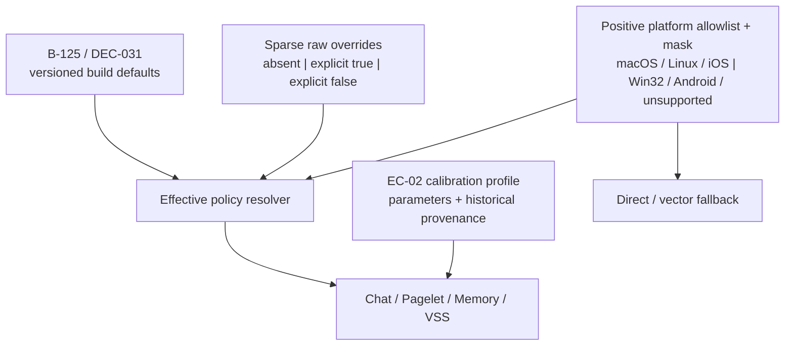

# B-125 Retrieval Shipping-Default Continuation Software Design Document

Document status: Approved
Updated: 2026-09-04
Work item: B-125
Authority: 本次 B-125 continuation 的 source-verified implementation design、兼容性、风险与 test matrix。
Product spec: [PA Active Vault Indexer — B-125 shipping-default amendment](../../../product/specs/pa-active-vault-indexer-product-spec.md#102-b-125-shipping-default-amendment)
Tracker: [Development Tracker](./tracker.md)

## Current Source Baseline

以 `master` 的本次 shipping-default 修改前 baseline 与当前共享工作区候选对照，已核实：

- `src/retrieval-optimization-platform-policy.ts` 是四项 effective flags 的统一
  resolver；baseline 只对 `Platform.isWin` 强制 all-false，并把缺失 raw
  value 解析为 `false`。
- `src/settings.ts` 把 `retrievalOptimizationFlags` 定义为可选、逐字段可选的
  internal object；`mergeLoadedSettings()` 只保留 boolean raw value，非 boolean
  变为 `undefined`，`DEFAULT_SETTINGS` 没有物化四项默认。
- `src/plugin.ts` 的 `getEffectiveRetrievalOptimizationFlags()` 向 Memory Host、AI Host
  和 Pagelet policy identity 供应 effective flags。
- `src/vss/vss-core.ts`、`src/ai-services/memory-search-tool.ts`、
  `src/ai-services/pa-agent-runtime.ts` 与
  `src/pagelet/agent/pagelet-agent-runtime.ts` 也通过统一 resolver 完成
  lexical/strict/PPR/recovery 判定与 policy epoch fallback。
- `src/vss/retrieval-calibration.ts` 是 EC-02 search envelopes 的 versioned
  calibration authority；其 `defaultEnabled=false`、`offline_provisional_winner`、
  `inherited_unvalidated` 是产生候选时的 evidence provenance，不是当前
  shipping-default authority。
- 当前无普通 Settings UI 暴露这四个 internal flags，也无 prerelease
  version 分支修改其 effective behavior。

B-125 shipping-default continuation 候选新增名称（在完成验证前均视为 Proposed implementation）：

- `B125_RETRIEVAL_OPTIMIZATION_ROLLOUT_PROFILE`：shipping-default ID、version、
  B-125/DEC-031 authority 和四项 build defaults。
- `B125_ANDROID_SUPPORT_WAIVER_ID`：Android 临时 all-false mask 身份。
- `B125RetrievalOptimizationRuntimePlatform`：将 Win32、Android、macOS、Linux
  和 iOS 的 Obsidian platform signals 投影为内容无关判定输入。
- `B125RetrievalOptimizationPolicySnapshot` 与
  `resolveB125RetrievalOptimizationPolicySnapshot()`：只返回 rollout identity、
  `none` / `windows` / `android` / `unsupported` platform mask 与 effective
  booleans 的 content-free snapshot。

## Design And Data Flow

Resolver 顺序固定为：

1. 若 Win32 或 Android signal 为 `true`，分别产生 `windows` / `android`
   mask；即使同时存在 allowlist signal 也必须 all-false。
2. 否则只有 macOS、Linux 或 iOS 中至少一个明确为 `true` 才产生
   `none` mask 并允许 build defaults；全部缺失/为 false 的 unknown/partial
   identity 产生 `unsupported` 并 all-false。
3. 对已支持平台的每个 flag，raw value 是 boolean 时使用该值。
4. raw field 缺失或非 boolean 时，使用 rollout profile 中该项 build
   default（本版本四项均为 `true`）。

`resolve` 为纯计算：不改写输入、不写 settings、不调用 provider、
不访问 vault/OPFS。Policy snapshot 不含 note path、content、query、provider
credential 或用户身份。

## Interfaces And Ownership

| Boundary | Owner | Contract |
| --- | --- | --- |
| Shipping defaults and platform masks | `src/retrieval-optimization-platform-policy.ts` | 唯一 versioned rollout authority；四项默认、macOS/Linux/iOS positive allowlist、Win32/Android/unsupported mask 与 content-free snapshot 在此解析 |
| Raw persistence | `src/settings.ts` | 只归一化并保留 sparse explicit booleans；不嵌入 build defaults，不作平台回填 |
| Runtime distribution | `src/plugin.ts` Host getters | 向 Chat/Pagelet/Memory/VSS 提供同一 effective flags；policy identity/epoch 基于 effective state |
| Lexical lifecycle | `src/vss/vss-core.ts` / `MemoryManager` | 继续使用既有 derived-generation prepare/admission/fallback；rollout 不绕过 Memory policy |
| Rerank/graph/recovery | Existing B-125 Host/Tool seams | 仅改变默认启用，不改变次数、候选预算、deadline、失败降级或 Data Boundary |
| Search calibration | `src/vss/retrieval-calibration.ts` | 保留 EC-02 参数与当时 evidence identity；不从 historical `defaultEnabled` 推导 rollout |
| Validation state | B-125 continuation Tracker | 唯一当前执行、finding、smoke/release evidence authority |

## Lifecycle And Cleanup

- Startup/load: `mergeLoadedSettings()` 保留 sparse raw object；runtime 按需解析
  effective state，不执行设置迁移写入。
- Settings save: 保存无关设置不得物化 build defaults。内部显式
  override 只修改目标 field。
- Runtime change: effective flag/policy epoch 变化时，现有 Host owner 负责
  cancel/supersede 和 late-result isolation；旧 run 不得提交到新 policy identity。
- Lexical preparation: 需要新 derived profile 时只从已允许的 existing chunk
  records 构建 shadow generation，完成后原子激活。失败、取消、Memory
  disable 或 unload 不激活半成品，保留 previous-valid/vector-only。
- Unsupported platform: Win32/Android 或缺少明确 macOS/Linux/iOS signal 的
  unknown/partial identity 始终 all-false effective，不触发新 lexical/graph/
  recovery 路径；raw settings 留存以支持未来明确恢复。
- Unload/teardown: 完全沿用现有 Memory/VSS/Chat/Pagelet controller、queue
  与 worker cleanup；本 amendment 不新增 timer、listener、worker 或 durable journal。

## Data, Privacy, Permission And Cost

- 本 amendment 不新增任何 provider API、凭证、数据分类、存储或 vault write。
- 默认开启后，现有 DEC-027 路径可能比原 default-off 运行更多：
  非空候选仍按现有合同调用选定 reranker，满足条件的 relaxed recovery
  可对第二轮新的非空候选再 rerank 一次。这是启用已批准行为，
  不是新的调用语义。
- Lexical-only rebuild 必须保持 provider call=0、embedding=0、Markdown
  mutation=0；仅操作 device-local derived index。
- B-125 candidate/rejected ledger、opaque bridge 和 Boundary-excluded identity/content
  不得进入 answer model、可见来源、日志、telemetry 或 snapshot。

## Compatibility, Migration And Rollback

- Persisted state: 不修改 settings schema version，不回填 `data.json`；旧安装缺失
  raw flags 自然跟随当前 build default。
- Explicit rollback: 在受支持平台，任一 raw `false` 只关闭对应能力；
  四项 all-false 回到 DEC-031 定义的 rollback baseline：不使用新
  lexical profile、valid-none whole-set hide、PPR 或 relaxed recovery，但
  non-empty-candidate reranking 仍保留 DEC-027 既有行为，不得误记为零
  reranker 调用。
- Platform: Win32 沿用 DEC-027 waiver；Android 由 DEC-031 B-125 amendment 新增临时
  mask；unknown/partial identity 使用 `unsupported` mask，不从“未命中已知禁用
  平台”推断支持。恢复任一平台需要当前 production artifact 的实体
  设备证据和 owner 新决定，不在本 track 自动扩展。
- Obsidian lifecycle: Desktop/mobile 继续使用同一 resolver；app reload、plugin
  unload、Memory disable 与 OPFS restart 必须保持现有 cancel/admission/fallback。
- Calibration compatibility: shipping-default identity 变化不触发伪造的
  calibration version 升级。只在 normalization/search/budget 参数或证据身份
  变化时才 version calibration profile/derived schema。

## Test Matrix

| Requirement / AC | Unit / integration | App smoke | Failure / fallback | Evidence target |
| --- | --- | --- | --- | --- |
| B-125/REQ-09 / B-125/AC-09 | Rollout object deep-freeze/identity；missing/empty/invalid raw => four true on supported runtime | Desktop current artifact reports/uses effective defaults without settings edits | Invalid raw field falls back per field；no Beta-version branch | Tracker T-01/T-05 |
| B-125/REQ-09 / B-125/AC-09 | Settings merge + unrelated-save + reload sparse round-trip；explicit false matrix | Internal focused probe toggles one flag false then restores without exposing UI | No materialization/backfill；partial object preserves independent rollback | Tracker T-02 |
| B-125/REQ-09 / B-125/AC-09 | macOS/Linux/iOS positive cases；Win32/Android/unknown/partial missing/partial/all-true => all false；raw immutability；`unsupported` snapshot | No Android/Win32/unknown-platform feature PASS claimed by this amendment | Win32/Android mask wins over allowlist/raw true；no allowlist signal fails closed and retains direct/vector | Tracker T-03 |
| B-125/REQ-09 / B-125/AC-09 | Affected Chat/Pagelet/Memory/VSS default/on/off/lifecycle suites plus inherited B-125 behavior regression | Desktop Chat + one Memory/Pagelet path on exact production artifact | Epoch change/cancel/supersede/unload rejects late work；graph/rerank/lexical fail open to existing fallback | Tracker T-04/T-05 |
| B-125/REQ-09 / B-125/AC-09 | Lexical shadow generation、source-triggered maintenance、provider/embedding/write zero assertions | Targeted OPFS restart + current real-iPhone core canary | Failure/cancel keeps previous valid generation or vector-only；no half-generation activation | Tracker T-05 |

Inherited B-125 behavior contract, referenced for non-regression and not reopened:
`B-125/REQ-01`, `B-125/REQ-02`, `B-125/REQ-03`, `B-125/REQ-04`,
`B-125/REQ-05`, `B-125/REQ-06`, `B-125/REQ-07`, `B-125/REQ-08`;
`B-125/AC-01`, `B-125/AC-02`, `B-125/AC-03`, `B-125/AC-04`,
`B-125/AC-05`, `B-125/AC-06`, `B-125/AC-07`, `B-125/AC-08`.
The current dated amendment is `B-125/REQ-09` with `B-125/AC-09`.

## Open Design Findings

无未关闭 P0/P1/P2 设计 finding。未完成的自动化、App/OPFS/iPhone 证据与
release gate 是 Tracker 中的执行项，不是新产品决策。

## Approval

- Design authority: [DEC-031](../../../product/decisions/dec-031-b125-retrieval-shipping-default.md) 与 [B-125 Product Spec amendment](../../../product/specs/pa-active-vault-indexer-product-spec.md#102-b-125-shipping-default-amendment)
- Approved on: 2026-09-04
- Authorized implementation scope: 四项 build-default-on（macOS/Linux/iOS）、
  Win32/Android all-false mask、sparse explicit override、独立 rollout identity、受影响
  tests/docs/smoke 与 Beta readiness 分析。不包含 commit、push、branch、tag、
  publish 或 release。
