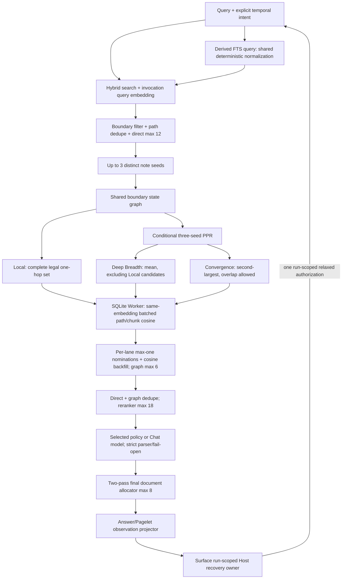

# Retrieval Pipeline Optimization — Software Design Document

Document status: Approved
Updated: 2026-08-11
Work item: B-125
Authority: B-125 的 source-verified implementation design；已确认的产品、数据与架构边界以 DEC-027 和 owning Product Spec 为准，未列入 confirmed contract 的 inherited tuning 仍需逐项审查。
Decision: [DEC-027 — 采用有界、汇合感知的检索恢复](../../../product/decisions/dec-027-bounded-retrieval-recovery.md)
Product spec: [PA Active Vault Indexer — B-125 scoped retrieval optimization](../../../product/specs/pa-active-vault-indexer-product-spec.md#101-b-125-scoped-retrieval-optimization)
Plan: [Delivery Plan](./plan.md)
Tracker: [Development Tracker](./tracker.md)

> [!note] 2026-08-08 owner-confirmed amendment
> 本文完整吸收逐项确认的 reranker、retry、Pagelet、Data Boundary、PPR、候选/
> 文档预算与 query-embedding 决策。PPR 效果复审随后确认 additive Local / Deep
> Breadth / Convergence、membership-aware 单候选提名、无 edge-count activation 和
> dependency-aware failure；随后确认保留 FTS5 + RRF、先修 CJK lexical correctness，
> 且在修复前不新增 semantic query rewrite；OD-05A 又确认 same-query/frozen-plan 与
> exact-evidence replay suppression。Phase 0A 与补充 context/scale/current-macOS
> renderer evidence 后，OD-06A 确认 shipping CJK profile family 为 `CHAR-PHRASE`。
> 已无剩余 owner 产品/架构选择；其余未闭合项进入 Engineering Closure Queue，本文
> 已于 2026-08-08 获得完整 SDD owner approval。

## 1. Outcome And Invariants

B-125 优化 Chat 与 Pagelet 共用的 Memory retrieval pipeline，但不把图结构或模型判断
当作事实。流程必须始终保持：

> semantic retrieves；structure proposes；reranker filters；final source text
> grounds the answer or insight。

### 1.1 Confirmed invariants

| Area | Binding rule |
| --- | --- |
| Reranker model | configured policy model；otherwise Chat model；one selected-model call only |
| Zero candidates | deterministic `none_relevant`；zero reranker calls |
| Invalid reranker output | fail open；only valid explicit `none_relevant` may clear all candidates |
| Candidate privacy | full candidates are Host-internal；answer model sees only final evidence/control projection |
| Direct / graph / reranker caps | 12 / 6 / 18 unique paths |
| Cross-origin order | valid reranker may freely mix；fail-open is direct hybrid order then graph cosine order；no score decay or forced graph reservation |
| Final documents | max 8；first two chunks per candidate before any third-chunk backfill |
| PPR seeds | up to 3 different Markdown note/path seeds；three independent runs |
| PPR aggregation | breadth equal-weight mean + convergence second-largest；no `max` |
| PPR solver | shared `alpha=0.75`；final L1 error bound ≤0.001；max50；no in-iteration mass pruning |
| Graph candidate lanes | additive Local / Deep Breadth / Convergence；Local excluded from breadth candidates, never from propagation |
| Lane worksets | no per-seed Top-K；no `.02` gate；bounded, but exact Top-N/union/high-degree limits require calibration |
| Graph final allocation | each eligible lane nominates max one；overlap dedupes without replacement debt；remaining capacity by cosine；graph≤6 |
| Opaque bridge | at most one excluded Markdown per restart excursion；zero content/identity exposure |
| Query embedding | invocation-scoped reuse；never shared `_lastQueryEmbedding`；never re-embed |
| Retry | Host-owned、run-scoped、max one relaxed retry；`MemorySearchTool` stateless |
| Retry query / replay | reuse first validated query、frozen lexical plan and temporal intent；novel → changed evidence；exact replay candidate-ineligible but graph-propagating |
| Pagelet | 0–2 independently verified insights；two is ceiling, not quota |
| Temporal | explicit user time constraint survives retry；unconstrained Pagelet may explore across time |
| Failure | unsafe rerank fails open；PPR-only failure may retain safe Local；shared snapshot/Boundary/embedding/Worker failure is direct-only |
| Lexical retrieval | retain SQLite FTS5 BM25 + RRF；shipping CJK profile family is `CHAR-PHRASE` with symmetric adjacency-preserving index/query normalization；B-125 adds no semantic retry rewrite or heavy sparse engine |

### 1.2 Implemented bounds and rollout boundary

The current implementation preserves these stable product/provider bounds:

```text
MAX_MEMORY_DOCUMENTS = 8
MAX_MEMORY_DIRECT_CANDIDATES = 12
MAX_MEMORY_GRAPH_CANDIDATES = 6
MAX_MEMORY_RERANK_CANDIDATES = 18
MAX_MEMORY_CANDIDATE_CHUNKS = 3
MAX_MEMORY_CANDIDATE_EXCERPT_CHARS = 1000
RERANK_TIMEOUT_MS = 30_000
MAX_TURN_WALL_CLOCK_MS = 180_000
```

The approved lexical、reranker/projector、Local/PPR/Worker and Chat/Pagelet
recovery target is implemented. All retrieval-optimization flags remain internal
and default-off until Tracker T-10 closes same-artifact darwin/win32/linux exact-
renderer、desktop OPFS、real-iOS、structured temporal、real-reranker and slow-
device/performance gates. Flag-off keeps direct retrieval and does not restore
the removed legacy one-hop expansion. The Tracker remains the only current
execution and validation-status authority.

### 1.3 Product traceability

| Product contract | SDD ownership |
| --- | --- |
| B-125/REQ-01 / B-125/AC-01 | §3.1–3.3 selected-model reranking and strict fail-open |
| B-125/REQ-02 / B-125/AC-02 | §3.2、§3.4、§3.5 candidate/observation/document bounds |
| B-125/REQ-03 / B-125/AC-03 | §4.3–4.7 additive Local/Deep Breadth/Convergence lanes and activation |
| B-125/REQ-04 / B-125/AC-04 | §4.1–4.2 one-opaque-bridge boundary state graph |
| B-125/REQ-05 / B-125/AC-05 | §6.1–6.3 Chat Host-owned single recovery and temporal intent |
| B-125/REQ-06 / B-125/AC-06 | §6.4 Pagelet 0–2 independent insights |
| B-125/REQ-07 / B-125/AC-07 | §4.4、§5 query-aligned Worker path and graceful fallback |
| B-125/REQ-08 / B-125/AC-08 | §2.2 lexical correctness、local rebuild and calibration boundary |

## 2. End-to-End Architecture



The PPR lane is optional and locally derived. It does not modify VSS storage,
the Markdown vault or source notes. Reranker excerpts are the only new provider
input in this pipeline; they must already pass Data Boundary.

### 2.1 Shared retrieval substrate and Chat integration boundary

The three graph lanes belong inside the shared retrieval substrate. Chat and
Pagelet must not fork separate Local/Deep/Convergence allocators；their product
differences begin after retrieval, in run-scoped recovery and result validation.

Chat UI、the final answer model、generic `PaAgentLoop` and `ContextManager` must
not understand PPR scores、lane membership or opaque bridges. The public model
tool remains `search_memory({ query })`；standard/relaxed mode、temporal scope and
recovery token are Host-internal execution context.

The 2026-08-08 source audit found three integration seams that must be completed
before Phase 3 can ship:

1. project the explicit `MemorySearchObservation` allowlist before generic tool
   observation serialization；context hygiene/compaction is not a security
   projector and cannot repair a serialized candidate pool;
2. distinguish retrieval `valid none`/`partial` from generic successful tool
   completion；the current Required Capability and Answer Completion policies
   otherwise treat an empty successful search as satisfied evidence;
3. provide run-scoped recovery orchestration that can consume a hidden relaxed
   mode、survive generic duplicate suppression and merge first/retry evidence
   under one global eight-document projection.

These are Chat integration requirements, not reasons to move the three-lane
allocator into Chat. Query generation and replay suppression are fixed by
OD-05A；the automatic execution seam、cross-attempt document merge and time-budget
mechanics are specified by EC-03 in §6, not additional owner product choices.

### 2.2 Phase 0 — Lexical correctness prerequisite

The current source baseline is not a valid retrieval-quality baseline:

- `vss_chunks_fts` has one `content` column and uses `unicode61`；insert writes
  only content;
- `buildFtsQuery()` converts a multi-character CJK segment into a character-
  separated phrase, while the indexed contiguous CJK text remains one token;
- a repo-version sqlite-wasm probe matches `机器学习` but not
  `"机 器 学 习"` or `"机 器"` against that content;
- current query-builder tests assert the generated string but do not execute a
  real FTS MATCH;
- title/path are not lexical columns, and `headingPath` metadata cannot receive
  an independent BM25 column weight;
- vector scan runs before FTS and the current elapsed-time check can silently
  skip starting FTS. It is not a hard end-to-end lexical deadline.

The target contract is:

1. Keep original Markdown、returned chunks and embedding input unchanged. Build
   a device-local derived lexical representation from allowed chunk records.
2. Use one pure deterministic normalization contract for both index and query.
   `unicode61` may continue to handle Latin/code tokens；OD-06A selects
   `CHAR-PHRASE` for CJK, with the same grapheme-character transform on both sides
   and adjacency-preserving phrase semantics for continuous CJK runs. A query-only
   character phrase is forbidden.
3. Make title、heading、body and a bounded path-derived signal independently
   rankable. Exact physical columns、path normalization and BM25 weights remain
   EC-02 engineering calibration items；path must not become an unbounded folder-structure
   relevance shortcut.
4. Use lexical retrieval for candidate recall. Compare strict phrase/AND with a
   broad OR candidate strategy only after token correctness is proven；the
   reranker and final source evidence continue to decide user-visible relevance.
5. Keep RRF as the B-125 fusion contract while BM25 and cosine scores remain on
   incomparable scales. Tune candidate depth、unique-path diversity、`RRF_K` or
   RRF leg weights only after the lexical leg passes its fixtures. Replacing RRF
   or adding raw/normalized BM25-cosine score fusion is outside B-125 and needs a
   new owner decision.
6. Do not use FTS5 trigram as the primary CJK fix because two-character queries
   are a core case and do not match trigram FTS. A later auxiliary substring
   surface requires its own recall/index-size/latency evidence.
7. Version the local FTS profile. Rebuild derived FTS state from existing
   allowed chunk records where safe；never re-embed、call a provider or mutate
   Markdown for this migration. Until rebuild is ready or when lexical execution
   is unavailable, return an explicit content-free fallback reason and continue
   through the existing vector/direct path.
8. B-125 does not add a dedicated semantic retry rewrite. OD-05A freezes the
   first validated query、derived lexical plan and explicit temporal intent for
   the one authorized relaxed attempt. Corrected fixtures may trigger a future
   owner decision, but cannot expand this track.

The provisional lexical deadline is a local-phase end-to-end budget. It starts
once provider rewrite、temporal planning and query embedding have settled, then
covers deterministic query construction、VSS/index queue wait and SQLite MATCH.
All local reruns in one search invocation share that single absolute deadline；
provider latency remains bounded by the outer tool/run deadline and finalization
reserve rather than consuming the local lexical budget.

#### 2.2.1 Selected `CHAR-PHRASE` normalization contract

`CHAR-PHRASE` is a versioned pure transform, not only a strategy name. The
shipping `char-phrase-v1` profile and the evidence harness must import the same
normalization implementation and freeze all of the following in the profile
key:

1. Normalize source and query text to NFC before segmentation.
2. Segment graphemes with `Intl.Segmenter("und", { granularity: "grapheme" })`.
3. Treat a grapheme as a CJK lexical unit only when it has Han、Hiragana or
   Katakana `Script_Extensions` **and** contains a Unicode Letter or Mark. This
   preserves lexical marks such as `ー`/`々` while excluding punctuation such as
   `。`、`、`、`・` and `·`.
4. Split at whitespace and common Latin/CJK separators. Consecutive CJK lexical
   units form one run；punctuation never becomes a CJK token or silently joins
   two runs.
5. Encode each CJK grapheme as one `unicode61`-atomic bareword: lowercase `c`
   followed by each Unicode scalar value in lowercase hexadecimal, joining
   multiple scalars inside one grapheme with `x` (for example `召` → `c53ec`).
   `_`-delimited marker/codepoint encodings are forbidden because `unicode61`
   may split them.
6. Index each run as its ordered character-token sequence. Query one token as a
   term and two or more tokens as one adjacency-preserving FTS phrase. Latin、
   numbers and code continue through the shared escaped `unicode61` path.

The profile includes normalization version、tokenizer configuration、field
schema and representation version. Runtime vocabulary assertions must prove
that expected complete `c...` atoms exist and isolated marker/codepoint or CJK
punctuation atoms do not. Frozen grapheme canaries run on every supported
runtime；the explicit profile version is the migration authority, while a
fingerprint change marks the derived lexical state incompatible and requires
the confirmation flow below. It is not evidence that all `Intl.Segmenter`
behavior is universally stable.

#### 2.2.2 Lexical-only migration and confirmation contract

Lexical compatibility is independent from embedding/VSS schema compatibility:

```ts
type LexicalProfileState =
  | "ready"
  | "stale"
  | "awaiting_confirmation"
  | "rebuilding"
  | "failed"
  | "unavailable";

interface LexicalProfileMarker {
  profileId: "char-phrase-v1";
  generation: number;
  sourceChunkEpoch: string;
  runtimeCanaryFingerprint: string;
}
```

- Do not implement this migration by incrementing the global VSS schema marker,
  calling the existing full reset/rebuild path or deleting `vss_chunks`、file
  state or embeddings. A lexical mismatch leaves the current vector/chunk index
  usable and suppresses only the incompatible lexical leg.
- `MemoryManager` owns the existing first-use/profile-stale/costly-rebuild
  confirmation. The prompt states that Markdown is unchanged、no AI provider or
  embedding call is made, and local time/storage may be used；cancel keeps honest
  vector-only retrieval. Progress、cancel and failure remain visible through the
  existing Memory preparation surface. Enabling a feature flag never bypasses
  this confirmation.
- A dedicated **bounded-batch** Worker operation builds a versioned shadow FTS
  generation only from current Data-Boundary-allowed existing chunk rows. Each
  mutation batch passes through the VSS exclusive write queue and then releases
  it；a monolithic rebuild request that sits ahead of foreground search in the
  current VSS/index/Worker serial queues is forbidden. A foreground-read priority
  lane may interleave stable vector/chunk reads between batches and may wait no
  longer than one calibrated batch. The known asymmetric legacy CJK FTS is never
  presented as a valid fallback.
- The logical migration coordinator owns the shadow epoch across released
  batches. Normal chunk writes may interleave only when the same primary-table
  transaction appends a migration delta/dirty epoch；the coordinator replays all
  deltas, then takes one short exclusive catch-up/switch section. Alternatively a
  conflicting write invalidates the shadow. Search always reads the stable active
  vector/chunk generation and never a half-built FTS table.
- The Worker populates and validates the complete shadow generation, including
  row/field counts and atomic-vocabulary assertions. The canonical
  `LexicalProfileMarker` lives in SQLite beside the active-generation pointer and
  both switch in the **same transaction**. IndexedDB/local-state markers may only
  mirror this state for orchestration/diagnostics and cannot decide readiness.
  Abort、crash or
  validation failure leaves no half-active generation；startup discards an
  incomplete shadow and returns to `awaiting_confirmation` or `failed` without
  touching vectors.
- After activation, incremental chunk upsert/delete and active lexical updates
  commit coherently under the same queued SQLite write transaction；mixed source/
  lexical epochs may never become `ready`.
- The rebuild freezes a Data Boundary/source-chunk epoch and revalidates it before
  switch. A changed epoch invalidates the shadow rather than indexing excluded or
  stale text. An older generation may remain active only when its profile and
  source epoch are still valid；otherwise retrieval is vector-only.

Title is the bounded note basename, heading is the stored `headingPath`, body is
the chunk content and path is a bounded path-derived surface. Exact physical
columns、weights and path shaping remain EC-02, but none may read outside the
allowed existing chunk/source contract. This is the only permitted meaning of
“versioned local FTS rebuild” in B-125.

Phase 0A evidence contract, owner-confirmed 2026-08-08:

| Strategy | Phase 0A role | Required construction |
| --- | --- | --- |
| current `unicode61` + current query builder | failing baseline | preserve exactly enough to reproduce the real CJK mismatch and English/code safety baseline |
| `BIGRAM-U1` | primary candidate | deterministic overlapping CJK bigram；single-character fallback must also be present in the index, not query-only |
| `CHAR-PHRASE` | minimum deterministic comparator | index and query both tokenize CJK consistently and use adjacency-preserving phrase semantics |
| `INTL-WORD` | quality challenger | explicit zh/ja locale routing；record resolved locale and a fixed canary token fingerprint so implementation drift requires derived-index rebuild |
| FTS5 trigram | limitation control | prove the `<3` Unicode character boundary；not eligible as the primary CJK profile |

Evidence isolation rules:

1. Freeze algorithm-independent rows、queries、relevant paths and forbidden
   paths before registering any strategy. A strategy cannot modify fixtures.
2. Use the repository's real `@sqlite.org/sqlite-wasm` in an in-memory database.
   The normal Jest mapping replaces it with a mock, so the spike uses a separate
   Node 22 runner. Production `src/**`、OPFS profile and runtime behavior remain
   unchanged.
3. The primary tokenizer comparison uses the same body text、BM25 behavior、
   Top-K and strict query semantics. Broad OR is deferred to Phase 0B so it
   cannot mask tokenizer correctness or overfit the frozen Phase 0A corpus.
4. Multi-field reachability is a separate equal-weight comparison: single
   content versus title/heading/body/bounded path fields. Phase 0A does not tune
   column weights.
5. Disable vector、RRF、reranker、semantic rewrite and Worker deadline experiments
   so Phase 0A can attribute changes to lexical normalization and field reachability.
6. Fixtures cover at least CJK two-character、four-character and natural-sentence
   body cases；mixed CJK/Latin；ordinary English、error code and dotted version/
   domain safety；title-only、heading-only and path-only relevance；and a separate
   long-note duplicate-chunk diagnostic. Each retrieval case has pre-labelled
   relevant and hard-negative paths.
7. Retrieve the same raw Top-8 chunk pool for every strategy, then project that
   pool to canonical paths for Hit@1/3/8、MRR、Recall/Precision@8、unique paths@8
   and duplicate-chunk ratio. These are path-labelled metrics within a shallow
   chunk pool, not a claim that eight unique paths were retrieved. Also report
   MATCH errors、actual query/vocabulary diagnostics and index size.
   Node warm p50/p95 only detects order-of-magnitude anomalies；it is not an iPhone
   performance claim. Slowest-device acceptance remains Phase 0B.
8. A candidate becomes OD-06A eligible only if every core CJK case reaches Top-8、
   English/code does not regress from baseline、MATCH errors are zero and equal-
   weight metadata fields make all title/heading/path-only relevant notes
   reachable. Passing creates a shortlist, not an automatic winner.

Phase 0A execution status、results and recommendation evidence live only in the
[Tracker](./tracker.md#phase-0a-decision-evidence). Phase 0A itself produced only
a shortlist；after the supplemental evidence, OD-06A separately selected
`CHAR-PHRASE`. Phase 0B owns hybrid pre-reranker Recall@12、final Recall@8/MRR、
selected-profile unique-path recall、full rebuild/incremental-update cost and
slowest-supported-device p95 latency. This ordering blocks using current FTS
misses to tune EC-02 retrieval parameters or reopen semantic rewrite without
evidence.

## 3. Phase 1 — Strict Rerank And Evidence Projection

### 3.1 Model selection

```ts
function selectRerankModel(settings: {
  policyModelName?: string;
  chatModelName?: string;
}): { kind: "policy" | "chat"; modelName: string } | undefined {
  const policy = settings.policyModelName?.trim();
  if (policy) return { kind: "policy", modelName: policy };

  const chat = settings.chatModelName?.trim();
  if (chat) return { kind: "chat", modelName: chat };

  return undefined;
}
```

- A single rerank invokes only this selected model.
- A policy timeout/failure does not trigger a Chat-model fallback call.
- If no usable selected model exists, the reranker returns a fail-open result and
  preserves the bounded input order.
- The observation/control plane may record only model class and a content-free
  reason; it must not log prompts or candidate excerpts.

### 3.2 Candidate admission

Before reranking:

1. Apply current Data Boundary.
2. Canonicalize and deduplicate by note path.
3. Keep at most 12 direct candidates.
4. Add at most 6 graph candidates that do not duplicate a direct path, ordered
   by their own cosine/path order after the direct hybrid-ordered candidates.
5. If the same path has direct and graph origins, keep the direct candidate；this
   path occupies one seat. Total unique candidates must be ≤18.

These steps bound local proposals；they do not authorize provider input. After
the ≤18 set is formed and immediately before a reranker provider call, the Host
materializes every candidate from the latest Markdown source:

1. resolve the canonical Markdown path through the shared Data Boundary seam;
2. read the latest body and evaluate path、generated-note、frontmatter and inline
   exclusions against the current consumer's combined Chat/Pagelet policy;
3. verify the indexed chunk anchor/content identity against that body and derive
   the bounded reranker excerpt from the current source；never send a stale index
   excerpt merely because its path is still allowed;
4. record a run-local source epoch/body hash and drop any missing、changed、
   malformed or no-longer-allowed candidate before provider serialization;
5. apply the existing first-use/provider/cost admission for the selected policy
   or Chat model. Admission denial is fail-open local retrieval, not permission
   to call another model.

`MetadataCache` may accelerate discovery but is not proof of current inline or
frontmatter policy. The Worker prohibition on whole-note reads applies to cosine
ranking；this live source read is a separate provider-safety/currentness gate.
If all candidates are dropped here, make no reranker call and return an
operational/currentness empty result that does not authorize miss recovery.

A valid reranker ranking may freely mix both origins. A fail-open result keeps
the bounded input order above: direct hybrid order first, then graph cosine
order. Do not align incomparable scores through the old
`topDirectScore × 0.4 × cosine` formula or another cross-origin decay. Do not
reserve a graph seat in this exceptional path.

Zero candidates produce:

```ts
{
  kind: "valid",
  verdict: "none_relevant",
  needsMoreEvidence: true,
  candidates: [],
  origin: "deterministic_empty",
  modelCalled: false,
}
```

One or more candidates that survive live materialization always enter the
selected-model reranker. Do not retain a single-candidate shortcut.

### 3.3 Strict reranker envelope

```ts
export type RerankVerdict =
  | "relevant"
  | "partially_relevant"
  | "none_relevant";

type RerankOutcome =
  | {
      kind: "valid";
      verdict: RerankVerdict;
      needsMoreEvidence: boolean;
      candidates: MemoryCandidate[];
    }
  | {
      kind: "fail_open";
      verdict: "relevant";
      needsMoreEvidence: false;
      reason:
        | "model_unavailable"
        | "timeout"
        | "provider_error"
        | "malformed"
        | "invalid_index"
        | "contradictory";
      candidates: MemoryCandidate[];
    };
```

A valid response requires:

- a recognized explicit verdict;
- `ranking` is an array of unique integer indices within the bounded input;
- `none_relevant` has an empty ranking;
- `relevant` or `partially_relevant` has a non-empty ranking;
- `needsMoreEvidence` is an explicit boolean；it must be `false` for `relevant`
  and `true` for `none_relevant`. A `partially_relevant` result may set either
  value and is the only valid producer for Chat's partial-recovery signal.

Semantics:

| Response | Result |
| --- | --- |
| valid `none_relevant + [] + needsMoreEvidence=true` | clear the complete candidate set；Host records the actual bounded reranker inputs in the episode-local exact-evidence ledger |
| valid `relevant + non-empty ranking + needsMoreEvidence=false` | apply the ordered subset；never authorize recovery |
| valid `partially_relevant + non-empty ranking + explicit needsMoreEvidence` | apply the ordered subset；Host may preserve it and use the boolean for the one-token recovery rule |
| verdict/ranking contradiction | fail open with direct-hybrid-first + graph-cosine bounded order |
| malformed JSON、missing verdict/boolean、duplicate/out-of-range index | fail open |
| timeout/provider failure/model unavailable | fail open |

Only valid explicit `none_relevant` may hide all candidates. A fail-open outcome
uses `relevant` as the safe control verdict so it cannot accidentally authorize a
miss retry and always sets `needsMoreEvidence=false`. It may expose a separate
Host-only diagnostic reason. Free-form model prose、the answer model and a raw
transcript scan cannot produce this recovery signal.

The internal `memoryStrictRelevanceFilter=false` rollback flag disables the
valid-none whole-set hide. It must not restore the old parser bug or convert
invalid output into a filter.

### 3.4 Internal result versus answer-model observation

`MemorySearchResult.candidates` remains available only inside Host orchestration
for allocation、diagnostics and construction of the episode-local rejected-
evidence ledger. It is excluded from the answer-model and Pagelet-model
observation DTO.

```ts
interface MemorySearchObservation {
  query: string;
  documents: MemorySearchDocument[]; // max 8
  sources: ChatAgentSource[];         // derived only from documents
  hasAnswerableContent: boolean;
  memoryEvidenceState: "evidence" | "partial" | "none" | "unavailable";
  rerankVerdict: RerankVerdict;
  retrievalGuidance?: string;         // bounded control instruction
}
```

The projector must construct this DTO field-by-field. It must not spread or
serialize the complete `MemorySearchResult`. The rejected-evidence ledger,
including its paths and fingerprints, is Host-only recovery state and never a
model-visible directional hint or citeable evidence.

Before final document allocation and before any Chat/Pagelet observation is
serialized, revalidate each surviving candidate's source epoch/hash and current
combined Data Boundary policy. Changed or denied candidates are dropped and
cannot create `sources`/`sourceRecords`. If the frozen source epoch changed for
the set, rematerialize the affected candidates or return the bounded operational
fallback；do not expose a mixture of stale provider input and current source
records. The specialized allowlist projector must run before the generic tool
serializer, because later context projection cannot remove an already serialized
candidate pool.

Each Host-internal observation retains only opaque source-snapshot handles needed
for later validation. Immediately before **every** subsequent Chat/Pagelet model
request that would include Memory evidence, the provider-request context
projector rereads/rechecks the affected latest bodies and combined policy, removes
stale/denied documents and reserializes the allowlisted observation. It must not
reuse transcript text as proof. Final answer/Pagelet source records are filtered
once more from the documents that survived that request/delivery gate. Thus a
note that becomes excluded after the tool result but before the next model call
cannot remain in provider context or a visible citation.

### 3.5 Two-pass final document allocation

Input candidate order is the valid reranker order or the confirmed fail-open
direct-hybrid-first + graph-cosine order.
Each candidate already carries up to three query-ranked chunks.

```text
pass 1: candidate order → take chunk 1 and chunk 2 when present
pass 2: same candidate order → use chunk 3 only while capacity remains
dedupe: path + chunkIndex
hard cap: 8 documents
```

This normally yields `2+2+2+2` rather than letting early candidates consume
`3+3+2`. Sources are generated only from these final documents. Pagelet's
verified source collection then deduplicates by canonical path.

## 4. Phase 2 — Boundary-State PPR

### 4.1 Graph classification

`isPathAllowed(path)` alone is insufficient because B-125 distinguishes a
content-eligible note from an opaque traversal-only note.

```ts
type GraphPathClass =
  | "allowed_markdown"
  | "opaque_excluded_markdown"
  | "blocked";

interface GraphBoundarySnapshot {
  epoch: string;
  topologyFingerprint: string;
  classifyPath(path: string): GraphPathClass;
  // immutable canonical resolved-link topology for this invocation
}
```

Classification rules:

- Markdown allowed by the current Data Boundary, including a generated artifact
  explicitly promoted by existing policy: may be seed、transition state and
  final candidate;
- ordinary excluded Markdown: may be `opaque_excluded_markdown` only;
- a generated Markdown note that is excluded by current policy cannot fall back
  to opaque-bridge status；attachments are always `blocked`;
- missing、non-vault or non-Markdown targets: `blocked`.

Classification is local and current. Candidate paths are rechecked before
Worker scoring and after Worker results return.

The shared Data Boundary Host seam must provide this three-state classifier；the
existing boolean `isDataBoundaryAllowedPath()` cannot infer opaque versus hard-
blocked behavior and is insufficient for B-125. Snapshot acquisition is itself a
budgeted builder, not an unbounded copy of live `resolvedLinks`: capture the Host
topology/policy epoch, stream canonical link entries and classifications in
canonical-path order into a provisional snapshot while counting nodes、edges、
bytes and time, then verify the epoch again before sealing it immutable. The
builder uses §4.2.1's same deadline/cap envelope and discards the complete
provisional snapshot on overflow、abort or epoch drift. Generated policy、path
classification and topology therefore come from one sealed epoch.

If acquisition fails or the sealed epoch/fingerprint changes before Worker
acceptance or final graph allocation, discard all graph lanes for the invocation
and keep only independently live-revalidated direct evidence. Never reconstruct
the third state from a provider-visible DTO or expose the snapshot's path
identities through telemetry.

### 4.2 One-opaque-bridge state graph

State key:

```ts
interface PPRState {
  path: string;
  opaqueUsed: boolean;
  nodeClass: "allowed" | "opaque";
}
```

Allowed transitions:

```text
(Allowed A, false) → (Allowed C, false)
(Allowed A, false) → (Excluded Markdown B, true)
(Excluded B, true) → (Allowed C, true)
(Allowed A, true)  → (Allowed C, true)
```

Forbidden transitions:

```text
opaque → opaque
allowed, opaqueUsed=true → any excluded node
any state → generated note / attachment / blocked node
```

Teleport/dangling mass returns to `(seed, opaqueUsed=false)`. Therefore each
restart excursion can use at most one bridge. For an allowed candidate path,
the per-seed score is the sum of its `opaqueUsed=false` and `true` states.

Opaque states:

- never enter candidate maps or budgets;
- never expose path/title/body/metadata outside the transient invocation graph;
- may be counted only through content-free aggregate telemetry;
- are destroyed after the search invocation.

#### 4.2.1 Deterministic graph and solver preflight

`maxIterations=50` does not bound `O(seeds × iterations × (states +
transitions))`. Snapshot copy/canonicalization/classification/fingerprinting and
the later seed-reachable solve share one cumulative preflight budget. During the
budgeted snapshot build and before materializing solver vectors, compute a
conservative complete estimate for the seed-reachable graph:

```ts
interface GraphWorkEstimate {
  snapshotNodes: number;
  snapshotEdges: number;
  snapshotBytes: number;
  canonicalNodes: number;
  canonicalEdges: number;
  liftedStates: number;
  legalTransitions: number;
  localCandidatePaths: number;
  projectedSolverOperations: number;
  projectedBytes: number;
  remainingMillis: number;
}
```

`snapshot*` counts the provisional copy/classification envelope；the canonical/
lifted counts describe the complete seed-reachable solver subgraph within it.
The estimate includes every canonical incidence needed to compute §4.3.1 degree,
including degree-only opaque–opaque incidences even though they cannot become a
lifted transition. The preflight has calibrated hard caps for every count above
plus an absolute deadline and main-thread-stall allowance. It may stop counting when a cap is
provably exceeded, but it returns no partial topology、score or insertion-order
prefix. Exact values remain EC-02 and require largest-fixture plus slowest-
supported-device evidence.

- If snapshot acquisition/copy/classification/fingerprinting exceeds any node/
  edge/byte/deadline cap, or the shared immutable snapshot cannot otherwise be
  obtained safely, all graph lanes are invalid and retrieval is direct-only.
- If only the complete Local set exceeds its own deterministic cosine work
  envelope, drop Local as a whole；PPR may continue only when its independent
  complete preflight passes.
- If reachable node/edge/lifted-state/transition、memory、projected work or
  deadline exceeds the PPR envelope, skip the complete PPR solve and both Deep
  Breadth/Convergence lanes. A separately complete and current Local result may
  survive.
- Once admitted, the solver receives an `AbortSignal` and absolute deadline and
  checks both at deterministic transition/iteration checkpoints. Timeout、abort
  or late epoch invalidates the whole PPR result；no converged-seed prefix may be
  returned.

Graph building/solving must not run as one uninterruptible main-thread loop.
Implementation may use the existing Worker or a dedicated local compute seam,
but it must obey §5.2 request/deadline/cancellation semantics and release the
queue in bounded time.

### 4.3 Personalized PageRank definition

In this document `alpha` means follow probability, not restart probability:

```text
alpha = 0.75
restart = 1 - alpha = 0.25
π = restart · seed + alpha · Pᵀπ
```

All seeds share one boundary state graph、alpha、dangling policy and solver.
Per-seed alpha is forbidden because breadth/convergence scores would no longer
be comparable. `alpha=0.75` gives an expected pre-restart walk length of three
steps, aligned with the 2–3 hop discovery goal.

The inherited target penalty `1/sqrt(canonical target degree)` and approximately
2× mutual-link weight remain the compatibility baseline. The following EC-01
mapping closes their lifted-state interpretation；changing the formula、mutual-
link strength or degree domain reopens owner review.

#### 4.3.1 Canonical degree and mutual-link compatibility

Build the canonical topology before applying lifted-state transition legality.
A lifted state never creates another canonical link incidence. Let `R(u,v)=1`
when at least one key in the frozen `resolvedLinks` snapshot canonicalizes to
the directed Markdown relation `u → v`；otherwise it is zero. Link occurrence
counts are ignored.

Only `allowed_markdown` and `opaque_excluded_markdown` paths belong to this
canonical topology. Missing paths、attachments、excluded generated notes and
all other `blocked` paths contribute neither edges nor degree. For canonical
paths `u,v`:

```text
adjacency(u,v)  = 1[R(u,v) OR R(v,u)]
reciprocal(u,v) = 1[R(u,v) AND R(v,u)]
m(u,v)          = adjacency(u,v) + reciprocal(u,v)
d(u)             = Σv m(u,v)
```

A one-way link therefore creates one bidirectional canonical incidence；mutual
links contribute multiplicity two in both directions. Repeated mentions remain
binary. A self-link follows this same multigraph rule and contributes
multiplicity/degree two. Opaque–opaque incidences still contribute to canonical
degree so an excluded hub keeps its target penalty, although they never create
an opaque→opaque lifted transition.

For a legal lifted transition `s=(u,opaqueUsed=b)` to
`t=(v,opaqueUsed=b')`, use:

```text
q(s,t) = m(u,v) / (d(u) * sqrt(d(v)))
P(s,t) = q(s,t) / Σx∈LegalOut(s) q(s,x)
```

Because `d(u)` is common within one row, an implementation may equivalently
normalize `m(u,v)/sqrt(d(v))`. It must use canonical `d(v)`, not unique-neighbor、
lifted-state or legal-out degree. The false/true states for one path share the
same degree. Apply §4.2 legality before row normalization；do not normalize over
all neighbors and then discard illegal targets.

For each seed, solve from `(seed,false)` and score an allowed candidate `v` as
`π(v,false) + π(v,true)`. If `LegalOut(s)` is empty, route the complete follow
mass to `(seed,false)`；teleport has the same destination, preserving total mass
and resetting the bridge budget. A non-positive/missing degree on an otherwise
legal edge means the shared graph snapshot is inconsistent and follows the
direct-only failure rule；it must not silently use degree one.

### 4.4 Certified error-driven convergence

Each iteration computes the complete next probability vector. Do not drop small
states during propagation and do not renormalize after deleting states.

```ts
const alpha = 0.75;
const targetL1Error = 0.001;
const maxIterations = 50;

for (let iteration = 1; iteration <= maxIterations; iteration += 1) {
  const next = completePPRStep(current);
  assertFiniteNonNegativeAndMassPreserving(next);

  const rawDelta = l1Distance(next, current);
  const errorBound = (alpha / (1 - alpha)) * rawDelta; // 3 * rawDelta

  if (errorBound <= targetL1Error) {
    return { scores: next, iteration, errorBound, converged: true };
  }
  current = next;
}
return { converged: false, reason: "iteration_cap" };
```

The `alpha/(1-alpha)` bound applies to the newly computed vector of this
contractive fixed-point iteration. `targetL1Error` names the conservative final
stationary error bound, not raw delta.

If any seed:

- reaches 50 iterations without the bound;
- produces NaN/infinity or materially negative mass;
- violates the configured probability-mass invariant;

then discard all PPR-dependent Deep Breadth and Convergence candidates for this
invocation. Do not merge some converged seeds with a failed seed. A Local lane
may survive only when its shared graph snapshot/classification and complete
Worker cosine result remain independently valid. An inconsistent graph snapshot
or classification invalidates every graph lane and returns direct-only.

### 4.5 Seeds and lane aggregation

Select up to three direct candidates with distinct canonical Markdown paths.
Multiple chunks from one note are one seed.

For actual seed count `m` and per-seed score `p_i(v)` (missing means 0):

```text
breadth(v) = (Σ p_i(v)) / m

m = 1: convergence lane disabled
m = 2: convergence(v) = min(p1(v), p2(v))
m = 3: convergence(v) = secondLargest(p1(v), p2(v), p3(v))
```

Breadth preserves mixture/coverage relevance. Convergence explicitly rewards
support from at least two seeds and tolerates one noisy seed. No cross-seed
`max` score is used.

For per-seed certified error bound `e_i`:

```text
breadthErrorBound = mean(e_i)
convergenceErrorBound = max(e_i)
```

A lane score at or below its bound is numerical uncertainty and cannot enter
the workset. This is not a semantic relevance threshold.

### 4.6 Additive lane worksets and PPR activation

Let `D` be the direct canonical-path set and `L` be every candidate-eligible
allowed Markdown path reached from any seed by exactly one legal transition:

- exclude `D` from `L`;
- an opaque node is never Local；`allowed → opaque → allowed` is Deep;
- canonicalize and dedupe the complete legal one-hop set before ranking;
- Local nodes remain in the shared PPR state graph and transition normalization.

Local is semantic-first: the Worker must score the complete admitted `L` set in
deterministic batches with the invocation query embedding, then apply the cosine
gate and workset cap. Adjacency、object、path or SQL-batch order must never select
the prefix. A deterministic preflight may reject an over-budget Local lane as a
whole；it must not return a partial ranked result. Exact path/row/time/workset
limits remain calibration items in EC-02.

PPR is run only when either condition is true:

1. the valid state graph contains at least one candidate-eligible path outside
   `D ∪ L` that is seed-reachable；or
2. at least two distinct seeds directly share one candidate-eligible Local path,
   making a one-hop Convergence result possible.

Do not use global or projected edge count to *activate* PPR. The §4.2.1 count is
only a mandatory safety preflight after semantic activation. A single-seed pure
one-hop star uses Local only；no graph candidate remains direct-only.

Do not truncate any per-seed PPR output before cross-seed aggregation. After a
successful PPR run:

1. remove seed/direct、opaque/blocked and ineligible states;
2. `Deep Breadth` computes breadth and excludes every path in `L` only from its
   candidate set, never from propagation;
3. `Convergence` computes the second-largest support, excludes direct paths and
   may overlap Local or Deep Breadth;
4. remove scores no larger than the lane's conservative solver error bound;
5. sort Deep Breadth by `breadth DESC, canonicalPath ASC` and Convergence by
   `convergence DESC, canonicalPath ASC`;
6. apply bounded post-aggregation lane worksets, then union/dedupe by canonical
   path while retaining an internal Local/Deep/Convergence membership bitset.

The old `pprScoreThreshold=0.02` is removed. Fixed alpha does not make absolute
node probability stable across seed degree、branching or multi-seed aggregation.
The exact lane Top-N and pre-cosine union are evaluation parameters, not approved
constants. Cosine and reranker remain the semantic gates.

### 4.7 CEPS boundary

The convergence lane is inspired by the CEPS order-statistic/soft-AND idea, but
B-125 does not implement the CEPS subgraph extractor:

- no `EXTRACT` phase;
- no downhill DAG;
- no path dynamic programming;
- no connector budget;
- no returned subgraph `H`.

This keeps Pagelet candidate/content-evidence centric. A future relation
explanation may use a separately approved bounded witness path, not a hidden
full subgraph extraction.

## 5. Query-Aligned Local Vector Validation

### 5.1 Invocation-scoped query embedding

The same `searchHybrid` call that embeds the query writes it to a caller-owned
output holder:

```ts
interface QueryEmbeddingOutput {
  value?: number[];
}

interface SearchHybridOptions {
  queryEmbeddingOut?: QueryEmbeddingOutput;
  // existing fts/temporal/signal/k/fusionTopK fields
}
```

The holder is allocated per invocation and never stored on VSS、plugin、
`MemorySearchTool` or another shared object. Concurrent Chat/Pagelet searches
cannot overwrite each other's embedding.

Forbidden alternatives:

- `_lastQueryEmbedding` or a public last-embedding getter;
- re-embedding the query for PPR;
- provider calls for per-path or per-chunk validation.

### 5.2 SQLite Worker path/chunk ranking

The local Worker API receives only already allowed path candidates and the
invocation embedding:

```ts
interface RankedPathChunks {
  path: string;
  maxScore: number;
  chunks: Array<{
    chunkIndex: number;
    score: number;
    document: MemorySearchDocument;
  }>;
}

interface RankedPathRequestControl {
  requestId: string;
  runEpoch: string;
  absoluteDeadlineMs: number;
  maxPathsPerBatch: number;
}
```

Worker behavior:

1. Accept already boundary-allowed Local、Deep Breadth and Convergence path
   groups and canonical-dedupe them while retaining memberships.
2. Read indexed embeddings only for the requested allowed paths, in bounded SQL
   batches rather than one unbounded `IN (...)` request.
3. Compute cosine with the passed query embedding using existing local vectors.
4. Finish every admitted batch before global Local workset selection；never
   expose a batch-order prefix after timeout/abort/budget exhaustion.
5. For each surviving path sort `score DESC, chunkIndex ASC` and return at most
   three real chunks with real scores.
6. Do not read the full note or synthesize `score=1`.

The main-thread index seam and Worker protocol both carry the request control
above plus a linked cancel message. Cancellation uses an immediate control lane/
registry and **does not enter either the main-thread data queue or Worker request
queue behind the request being cancelled**. The caller marks the request epoch
cancelled locally before posting the control message；the Worker's message/control
handler updates its cancelled-request registry independently of data scheduling.
Path groups are split into deterministic bounded SQL batches；an unbounded
`IN (...)` query is forbidden. The Worker checks the registry plus deadline state
between batches and bounded cosine blocks. Every continuation is scheduled as a
new Worker **macrotask** (for example through a private `MessageChannel` control/
continuation port), so pending cancel messages run before the next batch；a
synchronous loop or `await Promise.resolve()` microtask yield is non-compliant.
It marks the request terminal once and
discards queued continuation work. The caller rejects
results whose `requestId`、run epoch、source epoch or deadline no longer matches.
Late success after abort/timeout is ignored and cannot update a later invocation.

Because both the main-thread index and Worker serialize operations, cancellation
must also release their queue positions within the calibrated maximum batch
time. A timeout that returns to Chat while continuing an unbounded Worker scan is
non-compliant. SQLite calls that cannot be interrupted must therefore be small
enough that the next cooperative checkpoint satisfies the slowest-device gate.
The same request/epoch/transaction discipline applies to lexical shadow rebuild,
with write rollback rather than a partial active generation.

The API should return path max cosine and selected chunks in one coherent result
so the cosine gate and later document allocation cannot observe different
orders. A split API is acceptable only if tests prove the same invocation
embedding and deterministic ranking are reused.

Boundary filters run before the Worker request and after its response. Missing
embedding、unavailable Worker、malformed result or path mismatch produces
direct-only fallback. A Local-only deterministic preflight overflow drops Local
without manufacturing a prefix；independently safe PPR lanes may continue.
Returning file-head chunks is not a fallback.

### 5.3 Cosine gate and graph allocation

The inherited normal/retry cosine settings `0.3 / 0.2` are unapproved EC-02
calibration candidates. For the current target flow:

1. Apply the same invocation-mode cosine gate to every lane and discard paths
   that fail currentness、Boundary or Worker validation.
2. Dedupe by canonical path while retaining every lane membership.
3. Each non-empty lane nominates at most one candidate:
   - Local: `cosine DESC, canonicalPath ASC`;
   - Deep Breadth: `breadth DESC, cosine DESC, canonicalPath ASC`;
   - Convergence: `convergence DESC, cosine DESC, canonicalPath ASC`.
4. Union the three nominations by canonical path. A path nominated by more than
   one lane consumes one seat；the overlap does not require a weaker distinct
   replacement.
5. Fill all remaining graph capacity from every remaining eligible path by
   `cosine DESC, canonicalPath ASC` until at most six unique paths are selected.
6. Order the selected graph subset by `cosine DESC, canonicalPath ASC` for its
   own deterministic fail-open quality order. Never force six results.

Lane-specific PPR scores nominate within their own semantics and are never
compared across lanes. Cosine is the only cross-lane comparable score. A path
already present as a direct candidate remains direct and does not consume graph
capacity.

DEC-027 confirms that a duplicate path keeps its direct origin, a valid reranker
may freely mix origins, and fail-open keeps direct hybrid order before this graph
cosine order. There is no cross-origin score decay or forced graph reservation.
Because the final document allocator follows this order, graph evidence may be
absent under the eight-document cap when reranking fails；that precision-first
failure behavior does not change normal valid-rerank recall.

## 6. Phase 3 — Host-Owned Retrieval Recovery

### 6.1 Ownership

| State | Owner | Lifetime |
| --- | --- | --- |
| Chat relaxed-retry token | run-scoped `ChatMemoryRecoveryCoordinator` | one Agent Run |
| Pagelet relaxed-retry token and insight count | Pagelet Lead/Host Policy | one Pagelet Run |
| search execution | `MemorySearchTool` | stateless invocation |
| query embedding | caller-owned output holder | one search invocation |

`MemorySearchTool` must not own `lastSearchState`、session retry detection or a
last-query result cache for this feature. It accepts only a module-private,
Host-branded invocation context；the public model schema remains `{ query }`.

The one-token ceiling counts only Host-authorized relaxed recovery. Distinct
model-requested standard searches for different unresolved subquestions remain
governed by the existing run/tool budgets；PPR's internal numerical iterations
are not retrieval retries. EC-03 uses synchronous atomic
`available → reserved → consumed` arbitration rather than making Memory globally
sequential. The first completed qualifying standard call with enough remaining
budget wins. Once its relaxed attempt starts, success、none、error、timeout or
abort never restores the token. Run teardown moves any state to `closed`.

Relaxed mode is Host-internal and cannot be selected directly through model-
controlled tool input:

```ts
type MemorySearchInvocationOptions =
  | {
      mode: "standard";
      temporalIntent: QueryTemporalIntent;
    }
  | {
      mode: "relaxed";
      temporalIntent: QueryTemporalIntent;
      lexicalPlan: FrozenLexicalPlan;
      rejectedEvidence: ReadonlyMap<
        CanonicalPath,
        ReadonlySet<EvidenceFingerprint>
      >;
    };
```

### 6.2 Chat recovery

State transition:

```text
standard search
  ├─ valid relevant → continue/finalize
  ├─ fail-open relevant → continue/finalize; no miss retry
  ├─ valid partial + needsMoreEvidence=false → continue/finalize
  ├─ valid partial + needsMoreEvidence=true → preserve evidence; optional one retry
  └─ valid none / deterministic empty → Host automatically grants and executes one retry

relaxed search
  └─ any outcome → token consumed; no second relaxed retry
```

#### EC-03 resolved — hidden execution before one visible observation

Create one `ChatMemoryRecoveryCoordinator` for each canonical Agent Run and close
it in the runtime `finally`/`dispose` path. A visible `search_memory` call flows:

```text
model-visible search_memory(query)
  → executor validates model input once
  → coordinator runs standard attempt
  → classify structured RerankOutcome
  → if qualifying, atomically reserve and run one hidden relaxed attempt
  → merge attempts into one cumulative MemorySearchResult
  → allowlist MemorySearchObservation projector
  → sourceRecords from final documents only
  → dispatcher publishes one ToolResult / one transcript observation
```

“Per run” means each `streamLLM`/Agent-Run execution, not a singleton capability
registration or a reusable `PaAgentRuntime` field. The runtime creates and passes
a Host-only execution context through the dispatcher/executor seam:

```ts
interface MemoryRunExecutionContext {
  runId: string;
  runEpoch: string;
  hardAt: number;
  softAt: number;
  toolAt: number;
  signal: AbortSignal;
  recovery: ChatMemoryRecoveryCoordinator;
}
```

The loop must be configured with a non-zero `finalizationReserve` and the Memory
episode/reranker/Worker sub-deadlines must all be strictly inside `toolAt` and
`softAt`. The capability registry may retain a stateless factory, but cannot own
the coordinator. Every stream execution closes the context in `try/finally`,
including exceptions before the first tool call.

The hidden attempt calls the coordinator's internal `executeAttempt` directly；
it does not re-enter the generic dispatcher and therefore needs no generic
`allowDuplicate` escape hatch. A later model-issued identical call still follows
normal duplicate suppression. Running retry from `afterTurn()` is forbidden
because the first full observation would already be serialized into the
transcript and the retry would create a second evidence projection.

Retry qualification uses the structured outcome, never `documents.length`:

- valid relevant and fail-open relevant do not retry;
- valid partial retries only when the same strict reranker response has explicit
  `needsMoreEvidence=true`；`false` finalizes with the retained partial evidence;
- no answer-model prose、runtime instruction or transcript heuristic may create
  that signal. Missing/contradictory boolean is malformed and follows fail-open;
- structurally valid `none_relevant` and deterministic zero-candidate empty may
  claim the token automatically;
- readiness、schema、backend、generic timeout/error and abort are operational
  failures, not retrieval misses, and do not authorize relaxed mode.

A final cumulative none carries `memoryEvidenceState: "none"`. Required
Capability treats Memory as executed, while Answer Completion does not treat the
none state as evidence and transitions to `final_answer_only` rather than asking
for another Memory search.

#### EC-03 cumulative merge and document allocation

Only one cumulative result reaches the projector:

1. When relaxed returns valid relevant/partial, interleave attempt-level ranked
   candidates `standard[0], relaxed[0], standard[1], relaxed[1]...`, with standard
   winning a same-position tie.
2. When relaxed is fail-open, keep all standard ranked candidates first and use
   relaxed candidates only as tail backfill；unvalidated graph evidence must not
   preempt standard evidence.
3. Dedupe by canonical path. When the same current path/chunk changed between
   attempts, retain the newer relaxed representation after Boundary/currentness
   revalidation.
4. Run the §3.5 two-pass allocator once over this merged candidate order；dedupe
   `path + chunkIndex`、cap final documents at eight and derive sources only from
   those documents.
5. Relaxed none/error/timeout preserves all valid standard partial evidence and
   never replaces it with an empty result.

This merge is internal；candidate pools、fingerprints、lexical plans and ledgers
remain absent from the answer-model observation and `sourceRecords`.

#### EC-03 deadline and teardown contract

Let the runtime provide absolute deadlines:

```text
softAt    = hardAt - finalizationReserve
episodeAt = min(toolStart + memoryEpisodeBudget,
                softAt - projectionMargin)
relaxedAt = min(episodeAt, now + relaxedAttemptBudget)
```

The outer tool deadline covers the whole episode；standard and relaxed attempts
receive linked child deadlines. Retry must not start unless remaining time is at
least `minimumRelaxedBudget + projectionMargin`; otherwise return the standard
result with content-free reason `recovery_skipped_deadline` and leave no hidden
work running. At `softAt`, Host Policy permits final answer only. Numeric budgets
remain EC-02/device calibration, but a non-zero finalization reserve is mandatory.

The coordinator owns linked `AbortController`s、timer cleanup、token and rejected-
evidence ledger. Success、error、timeout、supersede、unload and runtime `dispose`
close all of them；a closed run epoch ignores late results. No state survives into
the next Agent Run.

The relaxed query remains the first validated `search_memory` query from this
recovery episode. It reuses that attempt's frozen lexical plan and immutable
explicit temporal intent. The Host does not run keyword extraction again、ask a
model to rewrite、or concatenate path/title/candidate text into the query. A later
unrelated search in the same conversation is standard；the existence of an earlier
search never makes it relaxed.

#### OD-05A resolved — same-query exact-evidence replay suppression

A structurally valid explicit `none_relevant`, or valid
`partially_relevant + needsMoreEvidence=true`, creates an exact-evidence ledger.
Let `A1` be the actual Boundary-safe canonical candidates admitted to the first
reranker after direct/graph allocation and caps, not raw search hits、final
documents or candidate IDs. Partial evidence selected for the cumulative result
is retained separately；its presence does not make the same candidate fresh.

Each indexed path exposes a query-independent `pathEvidenceGeneration`: an
opaque hash of canonical path、the complete ordered stable chunk anchor/content-
identity inventory、indexed source-content hash/revision and representation
version. It is computed on coherent chunk upsert/delete and invalidated by the
vault's source-revision/dirty-state seam before a changed note is reindexed. It is
available to direct/graph push-down without first ranking every chunk. For each
`a ∈ A1`, the Host stores both that generation/current source revision and the
reranker-visible fingerprint of canonical path、ordered selected chunk anchors/
content identities、visible heading/excerpt content and representation version.
Attempt-local rank/index、`candidateId`、origin/lane、PPR/cosine scores and other
transient fields are excluded.

The implementation may use opaque local hashes, but equality of the visible
fingerprint must mean the same path exposed the same reranker input independent
of candidate seat or score. An unchanged `pathEvidenceGeneration` under the same
frozen query/profile is a safe pre-ranking proof only when the index revision is
still current to the source and the run's source epoch has not changed. Unknown、
dirty or mismatched revision is potentially changed, never an early repeat. A
changed generation remains potentially changed until Worker ranking and live
source materialization compute its visible fingerprint. A deterministic zero-
candidate miss has `A1 = ∅` and an empty ledger.

During relaxed retrieval every otherwise eligible path is classified before
candidate caps:

| Class | Definition | Candidate behavior |
| --- | --- | --- |
| novel path | canonical path absent from the ledger | admitted first |
| changed evidence | path generation changed and the current reranker-visible fingerprint is new | may backfill capacity after novel paths |
| exact repeat | path generation is unchanged, or the post-Worker/live visible fingerprint already exists | ineligible for direct/graph candidate、reranker and final evidence |

Direct legs must use deterministic bounded overfetch or an equivalent push-down
so exact repeats are removed before the direct-12 cap. Filtering a shallow Top-12
after retrieval is non-compliant because repeats would still consume the seats.
Graph selection must likewise remove exact repeats before every Local/Deep/
Convergence candidate-selecting workset truncation、lane nomination and cosine
backfill. The pre-ranking push-down uses `pathEvidenceGeneration`. Potentially
changed paths are then processed in deterministic bounded Worker probe batches；
post-Worker/live visible repeats are skipped and the ordered lane iterator may
continue until the fresh workset is filled or its calibrated probe/deadline
budget is exhausted. A repeat may consume bounded probe work but never the
candidate-selecting workset、graph-six or reranker capacity. Exhaustion returns
fewer fresh results, not a repeat or an adjacency/SQL-order prefix. The final
direct cap remains 12、graph cap 6 and reranker cap 18.

Suppression is an evidence-eligibility rule, not a Data Boundary classification
or topology deletion. All currently allowed rejected paths remain in the graph
state and transition normalization, so `novel A → rejected B → novel C` remains
discoverable. Fresh novel/changed direct paths are the only normal relaxed PPR
seeds. Only when the relaxed direct stage yields zero fresh seeds may first-
attempt direct seeds be reused as topology-only fallback roots；they can propagate
mass but cannot become candidates. Old seeds never fill a partially empty seed
set merely to reach three, avoiding dilution of the equal-weight Breadth and
Convergence signals.

The ledger is scoped to one recovery episode, rechecks currentness and Data
Boundary on the relaxed attempt, and is destroyed at teardown. It is not
persisted or serialized into provider input、answer-model observation、logs、
telemetry or replay. It does not suppress a later unrelated search. A standard
valid-none plus a non-empty relaxed attempt can still make two reranker calls
across the episode；it adds no rewrite-model call.

Valid partial documents must be unioned/deduped with any retry evidence and then
reallocated under one global eight-document model projection. Keeping two full
tool observations in the prompt is not a compliant merge. A relaxed miss must
not erase valid first-round partial evidence；the EC-03 cumulative merge above
owns observation replacement and cross-attempt allocation.

Recovery also needs an episode deadline、per-attempt deadline and final-answer
reserve within the existing run wall clock. A relaxed attempt may not begin when
it would consume the time reserved for finalization；a failed/aborted attempt
does not restore the consumed token.

### 6.3 Retry tuning candidates and temporal intent

The recovery method and product bounds are confirmed. EC-02 now has one
versioned, default-off provisional runtime profile:

| Retrieval envelope | Vector raw | Lexical raw | Fusion raw | Query / BM25 / RRF |
| --- | ---: | ---: | ---: | --- |
| flag-off standard baseline | 8 | 8 | 12 | strict AND / equal fields / `k=60`, equal legs |
| flag-on standard candidate | 8 | 12 | 18 | top-level clause OR / `1.25,1.25,2,.25` / `k=30`, equal legs |
| flag-on relaxed candidate | 12 | 12 | 18 | strict AND / equal fields / `k=60`, equal legs；`inherited_unvalidated` |

The standard candidate exactly matches the frozen offline deterministic winner,
but remains provisional rather than an approved rollout default. PPR cosine
`0.3 / 0.2`、graph worksets、the 500ms lexical budget and rebuild batches also
remain `inherited_unvalidated` pending slow-device/real-iOS calibration.

The final direct candidate cap remains 12 and graph cap remains 6 after these
broader retrieval stages.

Temporal rules:

- capture the explicit temporal constraint from the original user turn at the
  Chat Host/run boundary before existing keyword/temporal processing or any
  future separately approved query transform；standard and relaxed attempts
  reuse that immutable outer scope;
- explicit dates、`last 7 days`、`last 30 days` or bounded ranges survive existing
  keyword-derived queries and relaxed search;
- a keyword-derived or separately approved transformed query may narrow the outer scope only by intersection and may not
  widen or erase it;
- retry never programmatically sets the temporal filter to `None`;
- without explicit temporal intent, Pagelet does not inject a default recency
  constraint and may inspect older notes;
- if any derived query cannot preserve explicit temporal intent, reject that relaxed
  call and keep existing evidence.

The production path materializes the explicit outer scope once as a concrete
`temporalFilter` inside A1's frozen lexical plan. A2 clones and reuses that exact
filter；direct candidates、Graph path admission/Worker input and the reranker input
are current-mtime filtered before exposure. The cumulative recovery projection
then revalidates against the same frozen filter rather than trusting A1/A2 source
chips. Content-free diagnostics expose `temporalFilterApplied=1` and
`temporalViolationCount=0` independently for A1、A2 and projection；a missing
filter/audit or any violation fails the temporal acceptance canary closed.

### 6.4 Pagelet 0–2 insight collection

Pagelet remains one canonical Agent Run and one existing model loop. It does not
start a second agent、switch models or add a quota-filling generation call. The
owner-approved terminal contract remains natural Markdown or the exact internal
`NO_INSIGHT` sentinel；B-125 does not replace it with JSON、a rigid insight schema
or a Markdown-section parser.

To preserve that terminal contract while supporting a second finding, Pagelet
adds one run-local Host control capability. It is a tool/control envelope, not
the user-visible insight format:

```ts
interface StagePageletInsightInput {
  insightMarkdown: string; // existing free-form natural Markdown contract
  sourceIds: string[];
  unresolvedLead: {
    leadKey: string;
    supportingSourceIds: string[];
    requestRelaxedRecovery: boolean;
  };
}
```

The capability is Pagelet-only、callable at most once and cannot write external
state. `insightMarkdown` passes the existing natural-Markdown quality/source gate
before it is held as a provisional first insight. The control response either
returns a bounded recovery observation or authorizes ordinary in-run
continuation under existing tools/budgets. Chat never sees this capability. The
terminal `finalText` after staging is interpreted only as a possible second
natural-Markdown insight (or `NO_INSIGHT`)；the Host never splits one final
Markdown blob heuristically into two.

Before a first insight is staged, exact `NO_INSIGHT` means the run is quiet.
After the Host has accepted and pinned a staged first, the same internal sentinel
means “no additional second insight”；the pinned first still proceeds through
latest-source and delivery gates. It is never displayed or cached as content.

#### 6.4.1 One-token production state machine

The Pagelet run creates one Host-owned recovery coordinator and destroys it with
the run. It shares the one-token ceiling、same-query/frozen lexical plan、temporal
intent、deadlines、Worker cancellation and exact-evidence rules in §6.1–6.3, but
has two explicit goals:

```text
collecting
  ├─ eligible valid none / deterministic empty, no accepted insight
  │    → reserve token → hidden relaxed attempt for first_insight
  ├─ terminal natural Markdown / NO_INSIGHT without staged first
  │    → verify one / finish quiet
  └─ stage_pagelet_insight once
       + first natural-Markdown insight passes existing gate
       + concrete source-backed unresolved lead + remaining run budget
       ├─ latest Host-bound eligible partial episode needsMoreEvidence=true
       │    → reserve token → hidden same-query relaxed attempt for second
       └─ no eligible relaxed episode
            → no token use；ordinary tools may continue within existing budget
       → bounded continuation within the existing run → verify finalText only as second

any relaxed outcome → token consumed
abort / timeout / denied continuation → keep verified first when available, else quiet
```

For zero-to-first, the Host may execute the hidden relaxed attempt before
publishing the Memory observation, as Chat does. For one-to-second, spending the
relaxed token requires `requestRelaxedRecovery=true`. The coordinator
deterministically binds it to the latest still-current eligible partial episode
that precedes the control, has valid
`partially_relevant + needsMoreEvidence=true`, and shares at least one verified
lead source ID with that episode's allowlisted content evidence. The episode ID、
query and frozen plan stay Host-only；no episode handle is added to the shared
`MemorySearchObservation` or model input. The Host validates the provisional
first insight and every lead source ID against current Boundary-safe content
evidence. Free-form transcript text、a model-supplied new relaxed query or “only
one insight exists” cannot authorize recovery. The relaxed attempt reuses the
bound episode's validated query and frozen plan；`leadKey` is used only for
distinctness/audit inside the run and is never appended to the query or logged.
Without a matching eligible episode, the model may use ordinary standard read/
search tools for the lead, but receives no relaxed mode.

Staging and recovery stay inside the existing Pagelet normal-turn target and
max-turn、tool-call、provider-admission and wall-clock envelope；this SDD does not
raise any cap. The control is callable once, and the runtime prompt asks the
model to finalize on the next evidence-complete turn rather than broaden for a
quota. If the remaining turn/provider/tool/finalization budget is insufficient,
the Host refuses continuation and finalizes the verified first insight. Pagelet
context projection replaces the bound episode with the cumulative standard+
relaxed result before the next model turn；it does not retain two full candidate/
document observations.

The Host pins the current verified provisional insight while continuation runs.
The next natural `finalText` may offer one distinct second insight or
`NO_INSIGHT`；it must not repeat or combine the first. Repetition、combined-summary
or paraphrase fixtures reject it as a second while retaining the pinned first.
Only a failed latest-source/currentness gate may remove the pinned first before
atomic delivery.

#### 6.4.2 Independent verification, identity and delivery

Each natural-Markdown insight independently passes:

1. existing non-empty/non-`NO_INSIGHT` natural-Markdown gate;
2. successful current anchor read;
3. at least one additional allowed vault source and existing Pagelet source
   requirements;
4. exact source-to-claim grounding, latest-body hash and combined Pagelet Data
   Boundary revalidation before model exposure and before delivery;
5. novelty/value gate;
6. delivery/seen eligibility.

The second insight additionally needs a distinct normalized claim fingerprint
and evidence mapping. It may share a source when that source supports a genuinely
different finding, but cannot be a reformulation、detail expansion or summary of
the first. A failed second never invalidates a verified first；two is a ceiling,
not a target.

Per-insight stable identity must include pipeline version、anchor identity、a
normalized natural-Markdown body/claim hash and ordered current source-content
identities. Source set alone is insufficient because two independent insights
may share it. The ordered collection identity is derived from the accepted per-
insight identities. Controller、quality gate、cache and delivery adapter use an
internal collection result and one atomic non-empty commit: a length-two value is
visible only after both entries pass；if the second fails, one atomic length-one
value may be stored at run completion. A zero-insight run is quiet and writes no
insight cache、seen ledger or delivery record. No provisional or unverified second
entry is cached、marked seen or delivered. Source output is deduplicated by
canonical path per insight and again for the combined visible projection.

`collectionId` groups one run and owns only atomic cache identity/provenance. At
delivery time, the adapter maps each verified insight to its own
`DeliveryCandidate` in stable collection order. Each candidate uses that
insight's `insightId` for candidate ID、receipt、seen/dismiss state and any future
handoff；it independently enters the existing readiness/ranking/stack-admission
path. A shared `collectionId` must never collapse two candidates or make dismiss/
seen state on one affect the other. Zero produces no candidate. A delivery
failure for the second does not roll back an already admitted first.

## 7. Interfaces And Ownership

| Contract | Owner | Notes |
| --- | --- | --- |
| lexical normalization/profile | shared pure normalizer + FTS query builder + SQLite/VSS local index seam | exact `char-phrase-v1` index/query contract and canary |
| lexical migration state/confirmation | `MemoryManager` + VSS exclusive queue + SQLite Worker | separate profile marker、shadow generation、atomic switch；never full VSS reset |
| FTS rank and hybrid fusion result | SQLite Worker + VSS hybrid search | BM25 rank + RRF baseline；explicit lexical unavailable/not-started reason |
| `RerankVerdict` | `chat-types.ts` or existing shared chat contract module | one canonical type |
| strict `RerankOutcome` | memory search reranker implementation | explicit partial `needsMoreEvidence`；never treats invalid output as valid none |
| live candidate materialization | shared Data Boundary/source reader at provider seam | latest body/policy/hash before provider and final projection |
| internal `MemorySearchResult` | Memory search Host seam | may contain candidates；not serialized wholesale |
| `MemorySearchObservation` projector | host tools / answer observation boundary | explicit allowlist only |
| `GraphBoundarySnapshot` / boundary state graph | shared Data Boundary adapter + graph expansion | immutable three-state classifier/topology epoch；generated/attachment hard blocked |
| `PPRResult` | PPR solver | scores、iterations、errorBound、converged/reason |
| `QueryEmbeddingOutput` | caller of `searchHybrid` | invocation-scoped mutable holder |
| Worker ranked-path request/result | SQLite/VSS local index seam | bounded batches、absolute deadline/cancel epoch、real cosine + up to three chunks/path |
| Memory run execution context / relaxed mode | per-stream Chat coordinator or per-run Pagelet Host Policy → internal search invocation | run/deadline scoped；not model input；Chat follows §6 EC-03 contract |
| `StagePageletInsightInput` / 0–2 result | Pagelet-only Host control + loop/controller/cache/gate/delivery | natural-Markdown terminal remains；Host-bound latest eligible episode、atomic non-empty collection、one DeliveryCandidate per insight ID |

## 8. Lifecycle, Failure And Rollback

### 8.1 Lifecycle

- PPR vectors、boundary state graph、query embedding holder and Worker request are
  invocation-scoped and discarded after search.
- Chat/Pagelet retry ledgers are run-scoped and destroyed on success、failure、
  abort、timeout、supersede or unload；Pagelet provisional decisions are included.
- The device-local derived lexical generation follows
  `stale → awaiting_confirmation → rebuilding → ready|failed`. It is independent from
  vector readiness, rebuilds only a shadow FTS generation from allowed existing
  chunks and atomically switches after epoch/vocabulary validation. No vault
  file、embedding、session cache or cross-run retry marker is introduced, and the
  rebuild makes no provider call.
- Pagelet cache remains in memory; its pipeline identity must version-bump when
  the 0–2 result shape ships so a singular old entry is not misread as validated
  multi-result evidence.

### 8.2 Failure matrix

| Failure | Required behavior |
| --- | --- |
| selected reranker unavailable/timeout/error/invalid | fail open direct-hybrid-first + graph-cosine bounded candidates；no score decay/reservation and no second-model call |
| FTS profile stale/rebuilding/unavailable or lexical attempt not started within its budget | emit content-free reason/timing；continue vector/direct retrieval；never claim the lexical leg ran |
| lexical rebuild cancel/crash/epoch drift/validation failure | roll back or discard shadow generation；leave vectors/chunks intact；require confirmation before a new costly rebuild |
| latest source read/policy/hash fails before provider or final projection | drop affected candidate；if none survive, return operational/currentness empty with no miss-retry authorization |
| no candidates | deterministic none；no model call；Host may use one retry |
| graph snapshot/classification invalid | direct-only |
| PPR node/edge/state/transition/memory/deadline preflight rejects | discard Deep Breadth/Convergence as a whole；retain only separately complete/current Local |
| any seed not converged by 50 / invariant failure | discard Deep Breadth/Convergence；retain Local only if its shared dependencies and complete cosine result are independently safe |
| Local deterministic work-budget preflight rejects the full lane | discard Local without an ordered prefix；independently safe PPR lanes may continue |
| query embedding holder missing or crossed | direct-only；never shared-field fallback |
| Worker unavailable/malformed/path mismatch/deadline/cancel | ignore late result and release bounded queue work；direct-only；never file-head or whole-note fallback |
| cosine rejects all graph paths | zero graph candidates；do not fill quota |
| Chat retry fails | preserve valid first partial；finalize without second retry |
| Pagelet continuation invalid/unbacked/over budget | do not retry；keep independently verified first when present, otherwise quiet |
| Pagelet second insight fails | keep verified first only |
| Pagelet second delivery admission/receipt fails | first candidate/receipt remains independent；do not mark、dismiss or roll it back through collection state |
| Pagelet first insight fails | quiet result is valid |
| explicit temporal intent cannot be preserved | reject retry；keep existing evidence |

### 8.3 Feature rollback

Each slice has an internal release flag. Its default is off until that slice's
focused、cross-cutting and required device gates pass；turning it on cannot bypass
Memory confirmation or provider admission. The shipping change that flips a
default must include tests for flag on、flag off、mid-run abort/unload and removal
of every timer、controller、Worker request、shadow generation and provisional
Pagelet entry. Flags are rollback controls, not alternative behavior contracts.

- Phase 0 FTS profile rollback discards/rebuilds device-local derived lexical
  state only. If the selected CJK/field profile is unavailable, retrieval remains
  vector/direct；it must not reuse the known asymmetric CJK query/index contract
  as a supposedly equivalent fallback.
- Phase 1 flag may disable valid-none whole-set hiding; strict parsing/fail-open
  remains mandatory.
- Phase 2 PPR flag disables Deep Breadth/Convergence but may preserve the
  modernized Local lane when the shared graph、embedding and Worker result are
  safe. It must not restore adjacency-ordered legacy one-hop truncation.
- A PPR-only solver failure follows the same Local-salvage rule；shared graph、
  Boundary、embedding or Worker failure is direct-only for that invocation.
- Phase 3 flag prevents Host Policies from issuing relaxed authorization;
  `MemorySearchTool` has no state to migrate or clear.
- Fixed alpha、lane workset and a future lane-specific absolute threshold are
  parameter-only rollbacks with no data migration, but changing DEC-027's
  breadth/convergence、bridge or retry boundary requires a new owner decision.

## 9. Verification Matrix

### 9.0A Phase 0A lexical evidence shortlist

- real repo-version sqlite-wasm MATCH fixtures cover Chinese、English、mixed
  CJK/kana、title、heading、path basename、error code and long-note chunks;
- labels are frozen before strategy registration；current baseline reproduces
  `机器学习` versus `"机 器 学 习"`, then `BIGRAM-U1`、`CHAR-PHRASE` and
  explicit-locale/fingerprinted `INTL-WORD` run under the same body、BM25、Top-K
  and strict semantics；trigram is limitation-only;
- equal-weight metadata reachability is a separate comparison；OR remains a
  Phase 0B calibration variable and no field/RRF/query parameter is selected;
- admission requires all core CJK cases in Top-8、English/code no-regression、
  zero MATCH errors and title/heading/path-only reachability;
- report FTS-only path Hit@1/3/8、MRR、Recall/Precision@8、unique paths、duplicate
  chunks、query/vocabulary diagnostics、index bytes and Node warm p50/p95;
- production `src/**`、OPFS/runtime behavior、Markdown、embedding/provider input
  are unchanged；the Phase 0A pass created only an OD-06A shortlist and no slow-
  device claim. Owner selection occurred separately after the supplemental
  context/scale/current-macOS evidence.

### 9.0B Phase 0B selected lexical profile

- selected `CHAR-PHRASE` index and query import the same `char-phrase-v1` NFC、
  `und` grapheme、Script_Extensions+Letter/Mark、separator、atomic `c<hex>` and
  adjacency-preserving phrase transform；vocabulary assertions reject split
  markers/codepoints and punctuation tokens;
- selected-profile token/grapheme canaries are recorded across supported desktop
  and mobile runtimes；a changed fingerprint requires a versioned derived rebuild;
- original Markdown、display chunks and embedding input are byte-for-byte
  unaffected by lexical normalization;
- profile mismatch never marks vectors stale or calls full reset；explicit
  confirm/cancel/progress fixtures prove a shadow rebuild from existing allowed
  chunks, queued delta coherence、atomic switch、crash/abort recovery and zero
  embedding/provider/Markdown mutation;
- rebuild batches release the serialized queue；foreground vector search interleaves
  within one calibrated batch, and the SQLite active-generation pointer plus
  canonical profile marker switch atomically while any IndexedDB marker is only
  a mirror;
- AND/OR、field weights、candidate depth and RRF choices may be represented only
  as a versioned、default-off、explicitly provisional runtime payload for parity
  and device evaluation；they are accepted as shipping/default choices only with
  recorded FTS/hybrid/final Recall@K/MRR/unique-path、index-size、rebuild/update、
  real selected-reranker and slowest-device/real-iOS latency evidence;
- lexical timeout/skip is observable through content-free state/reason/timing,
  and the fallback remains vector/direct without fabricated FTS evidence.
- selected-model app ranking uses versioned explicit-notes-only prompts and is
  recorded only after a `search_memory` attempt；a no-attempt run is blocked
  routing evidence, not an FTS/reranker miss. Bare token probes are diagnostic
  only and never enter Recall@8、MRR or rollout acceptance.

### 9.1 Phase 1

- configured policy model wins；without it Chat model is selected；failure never
  calls both;
- zero candidates makes zero model calls；one candidate still reranks;
- valid none、partial、relevant all obey verdict/ranking consistency;
- valid partial requires explicit `needsMoreEvidence` and only `true` may produce
  partial recovery；missing/contradictory values fail open without retry;
- missing verdict、bad JSON、duplicate/out-of-range indices、contradiction、
  timeout and provider error all fail open in direct-hybrid-first + graph-cosine
  bounded order with no cross-origin decay/reservation;
- a valid reranker may freely intermix direct and graph candidates;
- just-added inline/frontmatter exclusion、generated/path policy change、body/
  anchor mutation、malformed frontmatter and MetadataCache lag are caught by
  latest-body combined-policy revalidation before provider input and again
  before every later model request/final sources；provider input spies contain no
  stale/denied excerpt even when policy changes after the tool observation;
- valid none or partial `needsMoreEvidence=true` creates a Host-only exact-
  evidence ledger from actual reranker input；no rejected path/fingerprint
  reaches the model observation;
- answer observation contains no `candidates`、candidate excerpt/anchor、nested
  candidate documents、PPR score/lane or bridge identity;
- direct≤12、graph≤6、reranker≤18 unique paths;
- final documents use two-pass `2 first, third as backfill`、dedupe path+chunk,
  cap8；every source is derived from a final document, no candidate-only source
  exists, and Pagelet deduplicates source projection by canonical path.

### 9.2 PPR solver and lanes

- fixed alpha `.75` for every seed and one shared graph/solver configuration;
- binary/mutual fixtures prove repeated link counts do not change results and a
  mutual incidence receives 2× a one-way incidence under the canonical degree;
- target-hub fixtures prove `1/sqrt(d(v))` suppression；opaque-hub fixtures prove
  opaque topology still affects canonical degree without permitting opaque→opaque;
- lifted false/true states never double canonical degree；illegal outgoing edges
  are removed before row normalization;
- blocked nodes do not affect degree；dangling follow mass returns completely to
  `(seed,false)` and resets the bridge budget;
- every transition row and PPR step preserves finite, non-negative unit mass；
  `resolvedLinks` insertion order does not change scores or canonical-path ties;
- returned-vector error bound uses `3 × rawDelta` and stops only at ≤`.001`;
- deterministic preflight bounds reachable canonical nodes/edges、lifted states/
  legal transitions、projected operations/bytes and deadline before vectors are
  materialized；each over-cap fixture skips the complete PPR result with no
  insertion-order prefix, while separately safe Local may survive;
- max50、NaN、negative/mass drift discard both PPR lanes but may retain an
  independently safe Local lane；graph snapshot failure is direct-only;
- no in-iteration small-score pruning and no per-seed Top-K;
- m=1 breadth only；m=2 convergence=min；m=3 convergence=second-largest;
- swapping seed order leaves lane results unchanged;
- a node ranked ninth or lower in each single seed may still enter a top
  aggregated lane;
- `0.045/0.001/0` breadth and `0.018/0.017/0.001` convergence are not killed by
  the removed `.02` gate;
- Local、Deep Breadth and Convergence use deterministic post-aggregation
  worksets；exact caps are fixture/device calibration items, not fixed by this
  SDD before EC-02 calibration;

### 9.3 Data Boundary and Worker

- `Allowed A → Excluded Markdown B → Allowed C` can surface C when C passes all
  semantic/source gates;
- `A → excluded B → excluded D → C`、generated bridge and attachment bridge are
  unreachable;
- B never enters seed/candidate/result/source/why-shown、provider prompt、answer
  observation、ordinary logs、telemetry or replay spies;
- the same allowed path's opaque-used/non-used states sum within a seed;
- worker request and response are both boundary-filtered;
- classifier fixtures prove ordinary excluded Markdown is opaque while excluded
  generated、attachment、missing/non-Markdown is blocked；topology/policy epoch
  drift discards graph results；snapshot copy/classification/fingerprint overflow
  is caught inside the same preflight before an immutable graph is published;
- concurrent different queries retain different invocation embeddings;
- Worker requests use bounded SQL/cosine batches、absolute deadlines、cancel/
  run epochs and late-result rejection；slowest-device cancellation releases both
  serialized queues within the calibrated bound；cancel control bypasses both data
  queues and a mid-batch posted cancel is observed before a separately scheduled
  macrotask continuation；microtask-only yields fail the fixture;
- each path returns ≤3 chunks in `score DESC, chunkIndex ASC` order with real
  score；most relevant `chunkIndex=5` beats file-head chunks;
- missing embedding/worker result returns direct-only with zero re-embedding.

### 9.4 Allocation and recovery

- each eligible Local、Deep Breadth and Convergence lane nominates at most one；
  a multi-lane path occupies one seat and creates no replacement debt;
- Local nominates by cosine；Deep Breadth and Convergence nominate by their own
  lane score with cosine/path tie-break；all remaining graph seats compare
  cosine only and total graph paths never exceed six;
- Chat valid none automatically triggers exactly one relaxed call；partial is
  preserved and retries only on strict `needsMoreEvidence=true` from the selected
  reranker, never answer prose/transcript heuristics;
- malformed/fail-open and unrelated later calls are standard, not retry;
- two concurrent qualifying standard calls produce exactly one hidden relaxed
  attempt；timeout/error after relaxed start never restores the token;
- one visible tool start/result/end surrounds two internal attempts；the hidden
  retry produces no second transcript observation or generic duplicate bypass,
  while a later identical model call is still duplicate-suppressed;
- standard 8 + relaxed 8 fixtures produce one currentness/Boundary-revalidated
  cumulative projection ≤8 with representation from both attempts when relaxed
  is valid；overlap/path/chunk dedupe and sources-from-final-only are enforced;
- relaxed none/error/timeout preserves standard partial；final cumulative none
  is executed-but-not-evidence and transitions to `final_answer_only`;
- deadline fixtures cover just-before/after minimum retry budget、child timeout、
  non-zero soft finalization reserve and hard abort；each stream run gets a unique
  coordinator/run epoch and `finally` dispose leaves no controller、timer、token、
  ledger or accepted late result;
- explicit 7d/30d/date range survives relaxed call；the acceptance fixture is a
  structured explicit-notes-only retry canary, not a prose judgment：A1 is a
  retry-eligible strict partial/valid none，exactly one A2 completes，the
  cumulative projection contains the in-range relaxed target, and an otherwise
  stronger out-of-range forbidden distractor is absent from standard、relaxed and
  final source evidence. Automated production/harness verification cannot replace
  a redeployed current-app observation and bound receipt；until that live evidence
  exists the acceptance canary remains `PENDING/BLOCKED`. An unconstrained Pagelet
  may find an older note;
- Pagelet legally ends with 0、1、2 insights；zero-to-first and one-with-concrete-
  lead-to-second each consume the same one-token ceiling;
- Pagelet terminal remains natural Markdown / exact `NO_INSIGHT` and one
  Pagelet-only `stage_pagelet_insight` control may pin a source-backed first；only
  a deterministically Host-bound latest eligible partial episode with matching
  source evidence grants relaxed mode, and the run cannot exceed existing max
  turns/provider/tool budget;
- the second insight independently passes source/currentness/novelty/value gates
  and duplicate/paraphrase fixtures are rejected；shared-source independent
  insights receive distinct claim/body-based IDs；cache/delivery atomically commit
  only a verified non-empty length-1/2 collection, while zero writes nothing;
- a two-insight collection maps to two independent `DeliveryCandidate`s keyed by
  `insightId`；receipt、seen、dismiss、handoff and stack admission on one do not
  mutate the other, while `collectionId` is grouping/cache provenance only;
- abort、timeout、supersede、unload clear both Host Policy ledgers without leaks.

### 9.5 Validation sequence after implementation

1. closest focused Jest suites;
2. typecheck and `git diff --check`;
3. full relevant Memory/VSS/Pagelet regression suites;
4. independent review for provider/Data Boundary/concurrency/mobile risks;
5. generate one schema-v2 exact Obsidian-renderer normalization receipt on each
   supported desktop platform (`darwin`、`win32`、`linux`) and verify the three
   receipts against the same checkout/artifact；run the corresponding canary in a
   real iOS WKWebView separately, then graph/Worker/rebuild latency and UI-stall
   gates on the slowest supported device. Device thresholds and the real selected-
   reranker MRR/non-regression gate are reviewed and frozen before any scored
   ranking、structured explicit-temporal acceptance canary or performance
   sampling. The ranking and temporal-acceptance slices run after freeze and
   before the performance envelope；an independent Recovery functional/debug
   canary may run before freeze but is unscored and cannot satisfy threshold、MRR
   or ranking acceptance. Diagnostics staging used by post-freeze acceptance work
   is discarded, then performance starts from a fresh verified-empty standard
   session. Missing renderer、artifact、required metric or sample evidence stays
   `BLOCKED`; profile/grapheme drift is `FAIL`. Desktop receipts cannot close the
   iOS、OPFS、quality or performance gates;
6. `make deploy` only when runtime integration is complete;
7. scoped Obsidian Chat/Pagelet smoke with known 2–3 hop、convergence、opaque-
   bridge、temporal and 0/1/2 insight cases.

Docs-only reconciliation does not run Build or Obsidian smoke and must never be
reported as runtime validation.

## 10. Content-Free Observability

The implementation exposes an explicitly activated local measurement seam, not
rollout evidence. With no active session the recorder is inert. A test harness may
call the plugin's `startRetrievalDiagnostics`、`getRetrievalDiagnostics` and
`stopRetrievalDiagnostics` methods to obtain a bounded in-memory snapshot with:

- schema version 1 and a fixed 512-event capacity;
- strict phase、outcome、reason and numeric-metric allowlists;
- immutable cloned snapshots and no persistent listener/storage;
- invocation-captured recorders that discard completions after stop/restart, so
  old asynchronous work cannot contaminate a later device session;
- unload cleanup；and
- coverage for Memory search、graph snapshot/preflight、per-seed PPR、lane
  worksets、Worker batches/queue/cancel/late discard、reranker、Chat/Pagelet
  standard/relaxed/projection attempts and finalization reserve.

The app-smoke receipt projects that schema again, removes session/time identity
and unknown fields, and blocks on dropped events. Count interpretation is strict:
only a `completed + semantic_none + documentCount === 0` terminal means zero
documents；a positive count requires `completed + no reason + documentCount > 0`.
A legacy `completed + no reason + 0` tuple、failed attempt、missing field、`null`
or unavailable count remains `null`/`unavailable` and fails closed rather than
satisfying a zero/none gate.

Before any scored ranking or structured explicit-temporal acceptance canary, the
runner freezes the reviewed device thresholds and selected-reranker MRR or flag-
off non-regression gate. Those acceptance slices are recorded after freeze but
before the performance envelope. An isolated Recovery functional/debug canary may
run before freeze；it is excluded from threshold、MRR and ranking acceptance. A
diagnostics session used during post-freeze acceptance work is staging only and
must be stopped and discarded；the runner then creates and verifies a fresh empty
standard-performance session before the envelope begins, so pre-envelope events
cannot enter a performance distribution.

Measurement plan `b125-device-measurement-v9` seals three stages in four sessions:
23 standard one-attempt retrieval episodes；23 two-attempt retry episodes split as
`12 + 11`；and one isolated cancellation episode. Standard and retry each produce
their own 3-warmup + 20-measured latency、Graph、queue/batch and reserve
distributions；a retry episode must include the cumulative projection and cannot
be counted as a standard sample.

The plan also seals `performanceWorkload` version 1. A dedicated disconnected
two-wave fixture is qualified once for the one-attempt standard path and once for
the two-attempt cumulative-retry path after thresholds/reranker freeze and before
the timed envelope. Each timed or cancellation episode uses the next manifest-
selected prompt in a fresh live Chat；the runner binds its unique completed
canonical `search_memory` turn to the same diagnostics `runId` and expected stage.
The persisted projection contains workload IDs、sample classes、counts and opaque
correlation hashes only. Prompt text、fixture paths and note content remain
in-memory validation inputs and never enter the performance receipt. A wrong
prompt、rehydrated/reused turn、duplicate run identity、missing binding or stage/
order mismatch invalidates the complete session.

An episode begins with `recovery_standard` and ends only at one legal runtime
finalization boundary. `reserve_protected` is diagnostic and cannot close it；
`reserve_not_entered` is the legal boundary when no reserved turn was entered.
Orphan、duplicate、out-of-order、early/repeated-finalization or capacity-overflow
events invalidate the entire stage. A full Graph sample requires the exact
snapshot start/complete → preflight start/complete → PPR start → one-to-three
completed seed terminals → completed aggregate → pre-Worker workset → Worker
start/accepted completion → final-workset order. Fallback、deadline、failure、extra
or mismatched-seed events cannot satisfy that sample. The cancellation stage
recognizes only same-episode `graph_worker` cancel-requested、Worker-confirmed
cancel-observed and late-discard events, and structurally requires zero accepted-
after-cancel regardless of thresholds. Successful Worker results also expose
content-free batch/chunk、queue、Worker and maximum-batch timing. Failure/cancel
responses do not currently carry partial pre-failure batch/chunk timing, so that
absence cannot be treated as zero.

Peak/maximum evidence is accepted only from a start/stop runtime envelope that
begins before the first standard event and covers the standard and both retry
sessions. It samples required process physical footprint and database size at
one-second intervals and the maximum-observed main-thread scheduling gap at
50 ms, with a ten-minute absolute cap；JS heap remains an optional diagnostic.
Manual point values and standalone rAF percentiles cannot satisfy those gates.
If iOS cannot expose runtime process memory, the only substitute is the runner-
read fixed-path `retrieval-smoke/evidence/system-memory-envelope.json` artifact
plus `retrieval-smoke/evidence/system-memory-envelope.instruments.xml` raw export:
their raw-byte SHA-256 digests、`physical_footprint_bytes`/bytes counter、Obsidian process and
app build、plugin/runner artifact hashes、device identity、iOS runtime family、
multi-point series and complete envelope window must all match at bind and final
verification. Both paths must be absent at capture start；after binding, lifecycle
events and byte drift latch the evidence `BLOCKED`, and the final commit cutoff
rechecks both byte digests. A reviewed deterministic raw-Instruments-export-to-
sample converter is additionally required before this substitute can satisfy the
process-memory metric；until that converter exists, the runner and standalone
verifier must report `external_memory_converter_unverified` and remain `BLOCKED`
even when both files and their digests are otherwise valid. This instrumentation
still does not manufacture device evidence:
missing artifacts/samples or thresholds left null are deliberately `BLOCKED`.

Allowed metrics:

- runtime-generated opaque Agent run id, used only to correlate one diagnostic
  episode with the same live canonical Chat turn；never a query、path、title or
  source identity;
- selected model class (`policy|chat|none`), not model prompt;
- lexical profile id/state/generation、confirmation/rebuild outcome/reason and
  timing、batch yield/foreground wait and atomic-switch result, not source text;
- rerank outcome/reason、`needsMoreEvidence` and live-currentness drop counts;
- PPR seed count、snapshot-copy and reachable preflight node/edge/byte/lifted-
  state/work buckets、iterations、error bound、converged/fallback reason;
- opaque bridge aggregate count only;
- Local/Deep Breadth/Convergence admitted/workset sizes、union size、nomination
  count and cosine pass count;
- direct/graph/reranker/final-document counts;
- retry mode、goal and consumed flag;
- per-attempt/projection `temporalFilterApplied` boolean and aggregate
  `temporalViolationCount` only；never the raw date range or source identity;
- Worker queued/batch/cancel/deadline/late-result counts and timing;
- workload-bound process physical footprint、database envelope and maximum main-
  thread gap；optional JS heap is diagnostic only;
- Pagelet verified insight count 0/1/2;
- phase timing and provider call count.

Forbidden telemetry:

- note body/excerpt/prompt/insight text;
- opaque bridge path/title/hash/metadata/neighbor identity;
- full candidate list or rejected-evidence paths/fingerprints;
- raw query embedding or chunk embedding.

## 11. Resolved Owner Decisions And Engineering Closure Queue

OD-01、OD-03、OD-05A and OD-06A are resolved. There are no remaining B-125
retrieval-behavior or runtime-architecture choices. The rollout support boundary
is partially resolved: on 2026-08-11 the owner set
`minimumIPhoneModel=iPhone 15`, but did not designate the available device as the
performance representative. Before EC-02/T-10 can close, the owner must still
define `minimumIOSVersion`、`minimumObsidianVersion` and the exact
`representativeDevice` with `representsFloor=true`. Those choices select the
evidence baseline；they must not silently change the retrieval contracts below.
Xcode/Instruments and performance are currently deferred, not passed or waived.

| ID | Owner question | Evidence gate | Boundary |
| --- | --- | --- | --- |
| OD-06A | Which eligible CJK normalization/profile family should ship: `BIGRAM-U1`、`CHAR-PHRASE` or strict-run `INTL-WORD`? | See the Tracker's [Phase 0A decision evidence](./tracker.md#phase-0a-decision-evidence). | **Resolved 2026-08-08: `CHAR-PHRASE`.** It preserves the selected continuous-text hard positives with materially lower scale-build/space cost than BIGRAM and avoids INTL's selected word-boundary recall misses. Physical encoding/fields、weights、OR breadth、RRF and deadline remain engineering calibration；Phase 0B must measure substring-collision behavior and supported-runtime/slow-device evidence. |

Six source-derived engineering groups define the required proof without needing
owner-by-owner selection while they remain within DEC-027. Current implementation、
validation and rollout status live only in the Tracker:

| ID | Engineering closure | Existing authority / required proof |
| --- | --- | --- |
| EC-01 | **SDD contract closed in §4.3.1**：canonical topology/degree precedes lifted legality；binary one-way incidence、2× mutual incidence、canonical target-degree penalty and seed-reset dangling policy. | Prove the contract with mass/degree/hub/opaque-transition fixtures. Any change to the formula、mutual-link strength or degree domain reopens an owner decision. |
| EC-02 | Calibrate Local/Deep/Convergence worksets、high-degree envelope、normal/relaxed cosine、vector/fusion depths、selected-profile fields/BM25/OR/RRF and lexical deadline. | Use retrieval fixtures plus slowest-supported-device evidence；must preserve 12 direct、6 graph、18 reranker、8 documents、one retry and Data Boundary. Escalate only if no configuration meets those gates. |
| EC-03 | **SDD contract closed in §3.3 and §6.1–6.2**：strict partial `needsMoreEvidence` producer；per-stream-run coordinator executes hidden relaxed attempt before one visible result；synchronous token claim、no generic duplicate bypass、deterministic cumulative merge、absolute deadlines/non-zero finalization reserve and teardown. | Tests must cover concurrency、abort、late results、dispose、single observation and global ≤8 documents. |
| EC-04 | **SDD contract closed in §2.2.1–2.2.2**：exact `char-phrase-v1` transform、independent SQLite-canonical lexical marker、Memory confirmation、short-batch shadow rebuild with foreground-read priority/delta replay、atomic switch/crash recovery and coherent incremental writes. | Implementation must prove no monolithic serial-queue hold、global VSS stale/reset、embedding/provider call or Markdown mutation. Silent costly rebuild would reopen owner approval. |
| EC-05 | **SDD contract closed in §3.2、§4.1–4.2.1 and §5.2**：latest-source provider/final revalidation、budget-built immutable three-state graph snapshot、whole-PPR preflight and bounded Worker protocol with an immediate out-of-data-queue cancel registry. | Implementation must pass leakage/currentness、snapshot acquisition/over-cap、slowest-device、deadline/cancel and queue-release fixtures. If the confirmed graph recall goal cannot fit those bounds, return to owner rather than silently truncating topology. |
| EC-06 | **SDD contract closed in §6.4**：one Pagelet Agent Run retains natural-Markdown/`NO_INSIGHT` terminal output；one Pagelet-only Host staging control may pin a verified first and a source-backed eligible partial episode may spend the existing token for a second independent insight；per-item identity/gates、atomic non-empty cache/delivery and zero-write quiet. | Implementation must remain within existing max-turn/tool/provider/wall-clock envelope. A rigid terminal schema、raising that envelope or adding a second model/run requires a new owner decision. |

These closures cannot weaken confirmed boundaries: no unrestricted excluded
traversal、no shared embedding、no per-seed topK/max/.02、no second model cascade、
no tool-owned retry state and no Pagelet quota filling.

## 12. References

- Glen Jeh and Jennifer Widom, *Scaling Personalized Web Search*, 2003 —
  multi-source personalization linearity: <https://doi.org/10.1145/775152.775191>
- Hanghang Tong and Christos Faloutsos, *Center-Piece Subgraphs*, KDD 2006 —
  multi-query soft-AND/order-statistic motivation:
  <https://doi.org/10.1145/1150402.1150448>
- SQLite FTS5 — tokenizer、BM25、query syntax and trigram contract:
  <https://www.sqlite.org/fts5.html>
- Gordon V. Cormack, Charles L. A. Clarke and Stefan Buettcher, *Reciprocal Rank
  Fusion Outperforms Condorcet and Individual Rank Learning Methods*, SIGIR 2009:
  <https://plg.uwaterloo.ca/~gvcormac/cormacksigir09-rrf.pdf>
- NetworkX PageRank reference — official convergence、personalization and
  dangling-node semantics:
  <https://networkx.org/documentation/stable/reference/algorithms/generated/networkx.algorithms.link_analysis.pagerank_alg.pagerank.html>

The references support the algorithms; they do not supersede DEC-027's product,
Data Boundary or runtime ownership choices.

## 13. Approval Boundary

- Original SDD approval: 2026-08-07, now reopened because multiple binding
  choices were superseded.
- Confirmed amendment authority: owner sequential confirmations on 2026-08-08,
  recorded in DEC-027 and the B-125 Product Spec amendment.
- Complete-SDD approval: edonyzpc, 2026-08-08. Document status is `Approved`；
  current execution and validation status lives only in the Tracker.
- The completed Phase 0A authority covered only its non-production fixture and
  evidence runner. Complete-SDD approval likewise authorizes no production
  runtime implementation、commit、push、tag、publish or release action.
