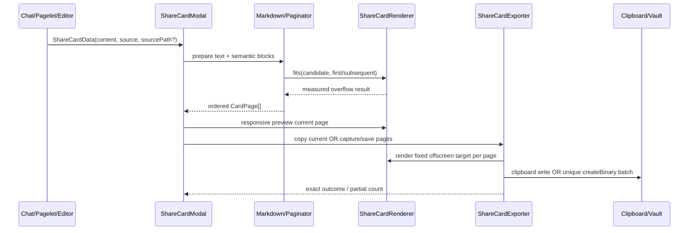

# Share Card Software Design Document

Document status: Approved
Updated: 2026-08-04
Work item: B-124
Authority: 本 track 的 source-verified implementation design、兼容性、风险与 test matrix。
Product spec: [PA Share Card Product Spec](../../../product/specs/pa-share-card-product-spec.md)
Plan: [Delivery Plan](./plan.md)
Tracker: [Development Tracker](./tracker.md)

## Current Source Baseline

| Surface | Verified current source | Design use |
| --- | --- | --- |
| Chat actions | `src/chat/chat-view.ts`: `ensureCompletedMessageActions`, history assistant path and `finalizeSuccessfulTurn`; `src/chat/types.ts`: `RenderedMessage` | `shareCardEligible` is persisted from terminal completion and optional `onShareAsCard` is passed only for completed assistant messages using current `copyContent/sourcePath` |
| Pagelet Panel | `src/pagelet/panel/PanelView.ts`: `currentFindings`, `currentVisibleFindings`, `currentExtra`, Prepared controls and footer; `types.ts`: `PanelCallbacks`; `orchestrator.ts`: callback wiring | Callback keeps app/modal ownership outside leaf DOM view and shares only visible, non-Prepared, non-progress/error findings |
| Editor command | `src/plugin.ts`: summary and featured-image editor command patterns | `share-selection-as-card` checks trimmed emptiness but passes the original selection |
| Markdown lifecycle | Existing `Component` + `MarkdownRenderer.render()` patterns in Chat, Pagelet and preview Modal | Every live/measurement/export render owns and unloads an Obsidian `Component`; sync/Promise failures fall back safely |
| DOM platform | `src/platform-dom.ts`: active document/window and animation-frame helpers; Pagelet `createHtmlElement/clearChildren` | No new global DOM assumption, raw timeout, runtime `<style>`, `innerHTML` or `outerHTML` |
| Vault binary writes | `Vault.createFolder`, `Vault.createBinary`, `normalizePath` and existing featured-image path behavior | Proposed writer owns folder/path uniqueness and truthful partial result |
| CSS / locales | `src/custom.pcss`, plugin/pagelet JSON dictionaries and translator functions | scoped `pa-share-card-*` styles and locale keys; no runtime style injection |
| Capture adapter | `src/share-card/share-card-export.ts`: owner-document SVG/Canvas rasterizer and injected test seams | Plugin-owned adapter serializes only sanitized card DOM, copies an allowlist of computed styles without `url(...)`, and writes fixed `1080×1440` PNG without runtime `<style>` / `innerHTML` |

Current modules:

```text
src/share-card/share-card-types.ts       shared data/theme/page/result contracts and dimensions
src/share-card/share-card-markdown.ts    text-first preparation, semantic blocks, Pagelet projection
src/share-card/share-card-paginator.ts   async measured greedy pagination and oversize split
src/share-card/share-card-renderer.ts    card DOM, Markdown lifecycle, fit measurement, media pruning
src/share-card/share-card-export.ts      local SVG/Canvas blob, clipboard capability, unique Vault batch writes
src/share-card/share-card-modal.ts       UI state, preview/nav/actions, operation token and cleanup
```

No persisted setting is added. Repository search verified that command ID `share-selection-as-card`
was non-conflicting before registration.

Requirement traceability: B-124/REQ-01, B-124/REQ-02, B-124/REQ-03,
B-124/REQ-04, B-124/REQ-05, B-124/REQ-06, B-124/REQ-07, B-124/REQ-08,
B-124/REQ-09, B-124/REQ-10, B-124/AC-01, B-124/AC-02, B-124/AC-03,
B-124/AC-04, B-124/AC-05, B-124/AC-06, B-124/AC-07, B-124/AC-08,
B-124/AC-09, B-124/AC-10.

## Design And Data Flow



### Text preparation

1. Normalize CRLF only; preserve leading thematic breaks/frontmatter-like content and all user text.
2. Convert Markdown image/embed forms to readable text labels before render. Preserve literal fenced and
   CommonMark indented-code content (including quote/list continuation indentation) but remove fence info
   strings so registered diagram/query/code processors cannot execute or expand Vault reads during card
   rendering. HTML-block lifecycle, paragraph interruption and same-marker thematic-break rules are tracked
   before ordinary media neutralization. Fence recognition follows top-level, blockquote, list and
   nested quote/list containers (including tab-stop continuation); when a list container ends implicitly,
   ordinary media neutralization resumes immediately. Raw HTML loses resource/event/class/id/data attributes and
   custom-element tags before render. Markdown is rendered while detached; before connection, prune any
   `img`, `.internal-embed`, `iframe`, `video`, `audio`, `canvas`, SVG/diagram runtime and interactive
   control, unwrap non-text elements, and retain only a pure-layout attribute allowlist. Never configure
   `useProxy`.
3. Split top-level Markdown into semantic blocks while fenced code remains atomic. Empty separators
   carry no user text and do not become pages.
4. Pagelet projection consumes `currentVisibleFindings`; it emits only visible title/description/
   insight text and a horizontal rule between findings. Equal description/insight text is emitted once.

### Measured pagination

`paginateShareCardMarkdown(blocks, fits)` is asynchronous and environment-independent:

- For each page, binary-search the largest measured prefix of consecutive semantic blocks and ask
  `fits(candidate, pageIndex)` using a hidden card body with the same width, source-label rule and CSS
  as export. This bounds short-block inputs to logarithmic probes per page instead of one frame per block.
- The accepted candidate is always measured. If no block fits, flush an existing non-empty page or
  treat the first block as an oversize singleton on an empty page.
- If one block cannot fit an empty page, split it at Markdown-safe line/word boundaries. Fenced code
  chunks repeat their opening/closing fence; container fences split only at complete safe lines. Other
  Markdown fragments preserve or synthesize the needed heading/list/quote/emphasis/link/inline-code
  continuation syntax, and an unprovably safe fragment fails closed instead of emitting invalid Markdown.
  Long plain text uses code-point-safe binary search.
- A split may not discard trailing whitespace, promote a mid-line marker into a new block, emit an
  empty fence body, or cut an internal inline-code backtick run. Reference links and their definitions
  must remain on the same independently rendered page. When those invariants cannot be proven, pagination
  returns the typed `unpageable-content` result instead of silently changing the document.
- Every loop must consume input or throw a typed pagination error; pages are non-empty except the
  explicit empty-content fallback. Concatenated visible text remains ordered and complete.
- `scrollHeight <= clientHeight + tolerance` is the final fit rule. Render failure switches the block
  to plain text measurement instead of guessing by character count.
- Input beyond 50,000 characters or 24 pages returns a typed too-large result; no partial pages are shown.

### Preview and capture isolation

- Modal locks `ShareCardTheme` at open and first builds pages. Visible preview may be scaled by a
  wrapper based on available width; it never serves as the export target.
- Renderer creates a fixed `540×720` offscreen target in the Modal owner document for measurement/
  export, renders and sanitizes one page while detached, connects it, waits one platform animation frame,
  then captures.
- Capture clones only safe text elements into an XHTML `foreignObject`, inlines a computed-style
  allowlist while rejecting resource-bearing CSS values, serializes the SVG with `XMLSerializer`, loads
  it through an encoded self-contained `data:image/svg+xml` URL, then rasterizes through Canvas at fixed
  `1080×1440`. The data URL preserves WebKit's origin-clean exception for `foreignObject`; capture creates
  no runtime `<style>` and assigns no `innerHTML` / `outerHTML`.
- Copy captures only `currentPageIndex`. Save-all renders, captures and writes each page sequentially;
  capture/IO failure returns the already saved paths and failed page, without deleting same-run files.
- All save batches for the same `Vault` are serialized across exporter/Modal instances. The queue covers
  folder creation, unique batch selection, capture and binary writes, so close/reopen cannot race paths.
- The renderer does not retain references to a reused mutable DOM frame. Each blob is completed before
  advancing to the next page and only one final Notice summarizes the result.

## Interfaces And Ownership

```typescript
type ShareCardSource = "chat" | "pagelet" | "selection";
type ShareCardTheme = "light" | "dark";

interface ShareCardData {
    content: string;
    source: ShareCardSource;
    sourceLabel?: string;
    sourcePath?: string;
}

interface CardPage {
    pageIndex: number;
    totalPages: number;
    content: string;
}

interface PanelShareCardRequest {
    findings: PanelFinding[];
}

interface ShareCardSaveResult {
    savedPaths: string[];
    attempted: number;
    failedPageIndex?: number;
}
```

- `ShareCardModal` owns UI and one busy operation. It delegates DOM/capture/write work and translates
  outcomes; it never imports Pagelet domain types.
- Pagelet domain → Markdown projection lives in a pure share-card helper or orchestrator adapter, not
  in `PanelView` DOM construction. `PanelView` only sends a typed callback request.
- Exporter accepts injected capture/clipboard seams in tests. Vault path selection is pure where
  possible; the writer never overwrites `getAbstractFileByPath()` results and a module-local weak queue
  serializes save transactions per `Vault` without retaining unloaded Vaults.
- Capture uses only owner-document browser primitives and injected test seams; capture failures are logged
  with content-free diagnostics, and user notices do not include note text.
- Copy starts `clipboard.write()` in the originating user gesture and supplies the asynchronous capture as
  the `ClipboardItem` PNG Promise, preserving WebKit user activation without changing failure semantics.

## Lifecycle And Cleanup

- `onOpen`: clear, add scoped classes, load preview owner, lock theme, start pagination token.
- Each async render/export captures an operation token. It may update UI only if the token is current,
  Modal is open and target still exists.
- Renderer cleanup invalidates in-flight Markdown/frame awaits. A cancelled render throws the dedicated
  cancellation signal before it can return a detached or already-cleaned card, and expected close/unload
  cancellation does not create a user-visible or content-bearing error log.
- Navigation is disabled until the target page render settles. Rapid navigation advances the token;
  stale render completion is ignored and its Component unloaded.
- Export sets one mutex/busy state. Duplicate clicks are no-ops; page navigation and the other export
  action remain disabled until completion.
- `onClose`: mark closed, invalidate tokens, unload preview/measurement/export Components, remove
  offscreen hosts/listeners and clear references. A started explicit Vault write may finish, but it may
  not issue stale UI updates; its exact result remains in content-free logs.
- Open Share Card modals register in a module-local set; plugin unload closes the set before disposing
  other runtime owners, so reload cannot leave a live Modal or capture owner behind.

## Data, Privacy, Permission And Cost

- Input is an already-visible response/finding or explicit selection; no broader Vault read.
- Markdown media/resource attributes are removed before the detached render is connected; the local
  capture adapter has no proxy/network path and only captures the plugin-owned sanitized DOM.
- No provider/network call, AI credits, analytics event, setting, history or device-local ledger.
- Copy writes OS clipboard only after the user clicks. Save creates local PNG only after the user clicks;
  existing files are never overwritten. No copy-failure auto-save.

## Compatibility, Migration And Rollback

- Persisted state: none; uninstall/removal leaves only PNGs the user explicitly saved.
- Desktop/mobile: fixed export target is independent of viewport; preview/actions remain responsive and
  touch targets at least 44px on mobile. Clipboard capability is runtime-detected from the Modal owner
  window; explicit Save works when clipboard image write is absent.
- Obsidian reload/mount/unmount: `Component` owners and offscreen DOM are per Modal and unloaded on
  close. No global listener or singleton capture host survives reload.
- Browser bundle: local adapter must pass esbuild browser build, `audit:bundle` and community DOM scan.
  No Node builtin, runtime style/HTML injection, extra package or packaged asset.
- Rollback: remove three entry adapters and `src/share-card/*`, notice output changes and scoped CSS/
  locale keys. No migration or cleanup command is needed; user-created PNGs remain ordinary files.

## Test Matrix

| Requirement / AC | Unit / integration | App smoke | Failure / fallback | Evidence target |
| --- | --- | --- | --- | --- |
| REQ-01/02, AC-01..03 | Chat completed assistant action; Pagelet visible payload; selection check/helper | trigger all three entry points | empty/generating/dismissed/Prepared content | Tracker T-03 |
| REQ-03, AC-04 | theme/dimensions/DOM class assertions; local rasterizer fixed-dimension seam | light/dark + narrow modal/mobile viewport | preview scale must not affect fixed export | Tracker T-02/T-05 |
| REQ-04/05, AC-05/06 | semantic/fence/long-line/order/task-state tests; media preparation/pruning; render fallback | 50+ lines, code/list/CJK; inspect overflow | Markdown throw → plain text | Tracker T-01/T-02 |
| REQ-06/07, AC-07/08 | clipboard absent/reject; data-URL current-page capture; unique batch; partial write | paste PNG; single/multi save; conflict | no auto-save; truthful partial notice | Tracker T-04/T-05 |
| REQ-08/10, AC-09 | duplicate click, rapid nav, close/unload token and per-Vault queue tests | close during preparation/export; reopen | stale completion ignored; later save waits and reselects path | Tracker T-02/T-05 |
| REQ-09, AC-10 | no proxy/media request; notices/license/bundle checks | browser console/network inspection | remove dependency if bundle/mobile gate fails | Tracker T-04/T-06 |

## Closed Design And Review Findings

| ID | Severity | Original draft finding | Resolution |
| --- | --- | --- | --- |
| D-01 | P1 | Fixed char-count pagination can clip styled/CJK/code content and `stripFrontmatter` can delete user text | Closed: actual rendered-height fit, semantic fallback split, no frontmatter stripping |
| D-02 | P1 | Multi-page save stores repeated references to one mutable DOM and then writes one-page batches with duplicate notices | Closed: sequential fixed offscreen render/capture/write and one summary |
| D-03 | P1 | Copy failure silently escalates to a durable Vault write | Closed: error only; Save remains a separate explicit action |
| D-04 | P1 | Fixed 540px preview overflows mobile; capturing transformed preview can change dimensions | Closed: responsive preview is separate from fixed offscreen export target |
| D-05 | P2 | Direct PanelView modal import bypasses callback ownership and shares dismissed/Prepared findings | Closed: typed callback through orchestrator with visible non-Prepared projection |
| D-06 | P2 | Async render, navigation and export lack busy/stale/close cleanup | Closed: operation token + mutex + Component/offscreen teardown |
| D-07 | P2 | Raw Markdown may load remote media/embed content during render/capture | Closed: text-first preparation, post-render pruning, no CORS proxy |
| D-08 | P2 | Hard-coded paths overwrite/fail on same-name files and errors can claim full success | Closed: unique batch selection and exact full/partial result notices |
| D-09 | P1 | Third-party capture bundle introduces runtime `<style>`/`innerHTML`, conflicting with the Obsidian community release gate | Closed: remove the package and use a plugin-owned SVG/Canvas adapter with fixed pixel dimensions and no runtime HTML/style injection |
| D-10 | P1 | Non-empty incomplete/partial Chat output and restored history could receive the completed-response action | Closed: persist `shareCardEligible` from terminal lifecycle; partial/incomplete turns fail closed and rehydrate without the action |
| D-11 | P1 | Pagelet Review progress/error replaces the visible findings while the old share payload remains addressable | Closed: dedicated `currentShareCardFindings` returns empty during progress/error/Prepared states and orchestrator revalidates identity |
| D-12 | P1 | Awaiting capture before `clipboard.write()` loses WebKit user activation | Closed: write begins in the click task with a PNG Promise value; copy failure still never saves |
| D-13 | P2 | Thousands of valid short blocks cause one rendered frame per block | Closed: measured prefix binary search bounds probes while preserving the same semantic order and fit predicate |
| D-14 | P2 | Plugin unload does not own already-open Share Card modals | Closed: registry-backed `closeAllShareCardModals()` runs at unload and is idempotent |
| D-15 | P2 | Busy state, offscreen accessibility and light-card secondary text were visually weak | Closed: localized live Copying/Saving status, inert/aria-hidden capture host, 44px mobile targets and AA-oriented light colors |
| D-16 | P1 | Reference-image scanning crossed whitespace into definitions/links and stopped after malformed syntax | Closed: only an adjacent reference label is consumed and malformed openers cannot suppress later neutralization |
| D-17 | P1 | Blob-backed SVG `foreignObject` taints Canvas in WebKit, breaking PNG copy/save | Closed: encoded self-contained SVG data URL plus explicit output dimensions and transport regression |
| D-18 | P2 | Modal-local busy state could not prevent close/reopen save races in one Vault | Closed: complete save transactions are serialized per `Vault`; delayed dual-exporter regression selects a unique second batch |
| D-19 | P1 | Container-nested fence info could reach registered Markdown processors before post-render pruning | Closed: container-aware fence preparation covers quote/list/nested/tab continuation and resumes media neutralization when a container ends |
| D-20 | P1 | An oversized raw Markdown block could be cut inside active syntax and change what the next page renders | Closed: deterministic fragment-safe splitting reconstructs supported wrappers and fails closed when no valid fragment fits |
| D-21 | P1 | Pagelet callback carried `sourcePath`, contradicting the strict text-only AC-02 boundary | Closed: the Pagelet callback and modal payload contain findings-derived text only; no path field crosses the adapter |
| D-22 | P2 | Renderer cleanup during an awaited Markdown/frame render could let a cleaned card resolve to callers | Closed: post-await cancellation checks throw a dedicated signal; close-during-render/capture regressions prove no stale card or write |
| D-23 | P1 | Canonical `completed_with_warning` also represents provider/idle/wall-clock interrupted partial text | Closed: `provider_error`, `assistant_idle_timeout` and `wall_clock_exceeded` fail Share Card eligibility while benign completed warnings remain shareable; the explicit false flag persists across history |
| D-24 | P2 | Removing rendered task-list checkbox inputs erased checked/unchecked meaning | Closed: task checkboxes become inert `[x]` / `[ ]` text before the general interactive-element prune |
| D-25 | P1 | HTML-block endings and containerized indented code could leave a false paragraph open or route code literals through media rewriting | Closed: explicit HTML-block lifecycle plus container-aware `W+4` indented-code state; independent bounded CommonMark matrices found no remaining P0–P2 |
| D-26 | P1 | Final fragment boundaries could lose trailing whitespace, split inline-code runs, separate reference definitions, normalize fence semantics, or promote an inline marker into a block | Closed: preserve-or-fail pagination, same-page reference validation, literal-code exclusion, preserved direct fence info/marker and safe fragment starts |

无未关闭的 P0/P1/P2 设计或 review finding。

## Approval

- Design authority: User request 2026-08-04 + DEC-026
- Approved on: 2026-08-04
- Authorized implementation scope: B-124 Product Spec 全部 REQ/AC；stop at validated implementation，
  without closeout/commit/push/tag/publish/release。
