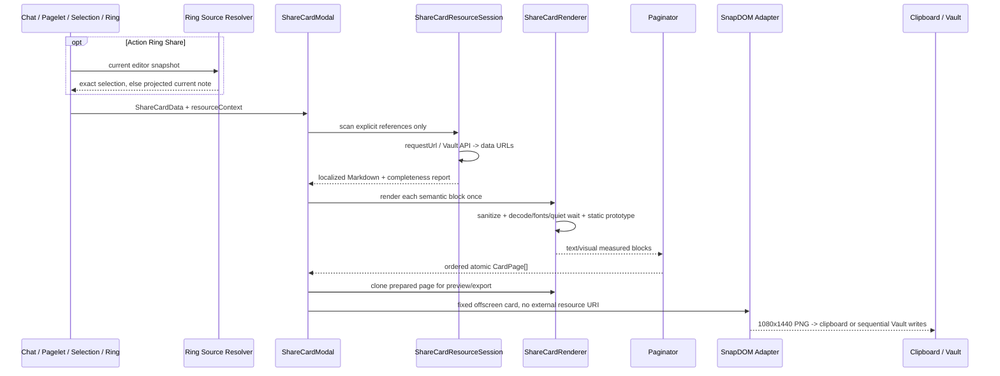

# Share Card Software Design Document

Document status: Approved
Updated: 2026-08-06
Work item: B-124
Authority: 本 track 的 source-verified implementation design、兼容性、风险与 test matrix。
Product spec: [PA Share Card Product Spec](../../../product/specs/pa-share-card-product-spec.md)
Plan: [Delivery Plan](./plan.md)
Tracker: [Development Tracker](./tracker.md)

> [!note] Owner decision 2026-08-05
> 用户选择完整渲染保真（内容方案 C）与精确锁定 `@zumer/snapdom@2.23.2`
> 的窄例外（capture 方案 A）。本 SDD 取代此前 text-first / plugin-owned rasterizer 设计。

> [!note] Owner amendment 2026-08-06
> Pagelet Action Ring 新增第四项 Share；该入口 selection-first、否则 current Markdown
> note。selection 原样且无路径，note 只剥离有效 YAML frontmatter 并显示 basename。
> 图形 logo、`Personal Assistant`、Ring 可见中英本地化标签、local-only Source Han Serif、Desktop/
> iPad 内向弧、iPhone 可容纳时横排/否则整组竖排，以及整批 `16 → 15 → 14px` 最大有效字号，
> 都是本轮必须实现和重新验证的 binding delta。

## Architecture Baseline And Current Delta

| Surface | Current design contract |
| --- | --- |
| Entry points | Chat、Pagelet callback/orchestrator、editor selection 与 Pagelet Action Ring Share 统一打开 `ShareCardModal`；Ring 在 active editor selection 与 current Markdown note 间按固定优先级准备 payload；不可见的 `resourceContext.basePath` 只用于资源解析，不进入 label 或 Pagelet 分享字段 |
| Markdown/resources | 保留 image/embed/SVG/Canvas token；只允许 Mermaid visual processor；显式远程/Vault 资源先经有界 resolver 本地化并生成完整性报告 |
| Pagination/renderer | Modal 分页前逐个语义块执行一次 render/sanitize/font readiness，随后 probes、preview 与 export 只组合 inert static prototype clone；视觉块保持原子；16/15/14px 只按减页选择最大有效字号且整批一致 |
| Capture/export | 精确 SnapDOM adapter 捕获自包含 DOM；保留 clipboard gesture、Vault queue、unique batch、取消 checkpoint 与 truthful partial result |
| UI/lifecycle | Modal 聚合整批资源、sanitization/decode 与 fallback 完整性；responsive preview、busy token、close/unload cleanup 保持生效 |
| Brand/font/CSS/locales | scoped Share Card surface 支持图形 logo、`Personal Assistant`、Ring 可见中英本地化标签、local-only Source Han Serif、视觉块、超高单视觉约束、资源占位与 incomplete 状态 |

No persisted setting or migration is added.

Requirement traceability: B-124/REQ-01, B-124/REQ-02, B-124/REQ-03,
B-124/REQ-04, B-124/REQ-05, B-124/REQ-06, B-124/REQ-07, B-124/REQ-08,
B-124/REQ-09, B-124/REQ-10, B-124/AC-01, B-124/AC-02, B-124/AC-03,
B-124/AC-04, B-124/AC-05, B-124/AC-06, B-124/AC-07, B-124/AC-08,
B-124/AC-09, B-124/AC-10.

## Approved Architecture



The core invariant is:

> Resource authority and completeness belong to PA before capture. SnapDOM receives only a fixed,
> stabilized, self-contained card DOM and is never used as a resource loader.

## Data Contracts

```typescript
type ShareCardResourceKind =
    | "markdown-image"
    | "wiki-image"
    | "html-image"
    | "svg-reference"
    | "css-image"
    | "vault-embed";

type ShareCardResourceStatus = "resolved" | "placeholder" | "failed";

interface ShareCardResourceContext {
    /** Resolution authority only; never rendered or included in Pagelet content. */
    basePath?: string;
}

interface ShareCardResourceRecord {
    id: string;
    kind: ShareCardResourceKind;
    reference: string;
    status: ShareCardResourceStatus;
    mimeType?: string;
    byteLength?: number;
    failureReason?: ShareCardResourceFailureReason;
}

interface ShareCardCompletenessReport {
    complete: boolean;
    resolvedCount: number;
    placeholderCount: number;
    failedCount: number;
    uniqueResourceCount: number;
    totalResolvedBytes: number;
    resources: ShareCardResourceRecord[];
}

interface ShareCardData {
    content: string;
    source: "chat" | "pagelet" | "selection" | "note";
    sourceLabel?: string;
    resourceContext?: ShareCardResourceContext;
}

interface LocalizedShareCardResources {
    markdown: string;
    report: ShareCardCompletenessReport;
}

interface CardPage {
    pageIndex: number;
    totalPages: number;
    content: string;
}

type ShareCardBodyFontSize = 16 | 15 | 14;

interface ShareCardPaginationResult {
    pages: CardPage[];
    /** One value for the complete preview/copy/save batch. */
    bodyFontSize: ShareCardBodyFontSize;
}
```

`sourceLabel` is visible product copy. Chat and Pagelet keep their stable product labels；Ring selection
omits it so no filename/path is exposed, while Ring note sets it to `file.basename` only. `resourceContext.basePath`
is resolution-only authority and is never serialized into Pagelet payload, card DOM, notices or logs.
Existing Chat/editor source paths may populate `basePath`; Pagelet may pass the current note path only
through its orchestrator-owned context, not through findings or the typed `PanelShareCardRequest` content.

Resource records distinguish `unsupported-scheme`, `resource-not-found`, `unsupported-mime`,
`resource-too-large`, `resource-count-limit`, `resource-total-limit`, `timeout`, `unsafe-svg`, `cycle`,
`depth-exceeded`, `embedded-content-too-large`, `localized-output-too-large`, `subpath-not-found` and
cancellation/read/network failures.
Renderer and capture keep their own typed cancellation, readiness, unsafe-resource and pagination errors.
User text and report records are not written to production logs.

## Action Ring Source Preparation

The fourth Ring action is a trigger surface, not a fifth persisted source kind. It resolves one immutable
`ShareCardData` snapshot at click time, then hands that snapshot to the existing Modal:

1. Resolve the current active Markdown editor/file once. If there is no active Markdown file, keep Share
   unavailable or show the localized `no Markdown note` notice; do not open an empty Modal.
2. Read `editor.getSelection()` once. Eligibility uses `selection.trim().length > 0`, but accepted content is
   the exact original string, including leading/trailing whitespace, indentation, line endings and Markdown.
   Emit `source:"selection"` without a visible source label; filename and Vault path stay absent from visible data.
3. If selection is not eligible, read the current Markdown note. Use Obsidian's frontmatter boundary helper
   to identify only a leading frontmatter region, then validate that region with Obsidian YAML parsing. Strip
   it only when parsing succeeds. A malformed YAML block, frontmatter-like opener or thematic break remains
   ordinary body text; no raw delimiter heuristic may delete it.
4. Emit the remaining note body as `source:"note"`, with visible `file.basename` only and
   resolution-only `resourceContext.basePath`. If the projected body is empty after the valid frontmatter
   removal, show the localized empty-content notice and do not open the Modal.
5. Source resolution performs no provider call, unrelated Vault search, durable write or background retry.
   The Ring closes first; the Modal then owns preview, Copy, Save, cancellation and error recovery.

Capture、Review and Discover keep their existing callbacks, route order and provider/data/write gates.
The Ring logical and focus order is always `Capture / Review / Discover / Share`. Each button renders a
visible current-locale label in addition to its icon: EN `Capture / Review / Discover / Share as card`；
ZH `随手记下 / 审阅 / 发现关联 / 分享为卡片`.

## Resource Session

`share-card-resources.ts` owns one session per open Modal:

1. Scan only ordinary Markdown outside literal inline/fenced/indented/raw-code regions and HTML comments.
   Recognize explicit Markdown images, image reference definitions, `![[...]]` embeds, raw `img`/SVG
   image references and raw-element style `url(...)`. Normal links are not fetched.
2. Remote `https:`/`http:` images use Obsidian `requestUrl` directly against the explicit URL. No proxy,
   fallback host, cookie discovery, page crawl or adjacent-resource scan is allowed.
3. Vault references resolve from `resourceContext.basePath` through MetadataCache/Vault APIs. Supported
   image files use `readBinary`. Markdown note embed supports whole-note, heading and block anchor;
   frontmatter is excluded for whole-note embeds. It follows only explicit nested embeds with canonical
   cache, cycle guard and bounded depth/bytes/deadline. Cycle、depth、subpath、read 或 budget 失败变成
   self-contained visible placeholder 并进入 incomplete report；不扫描或读取无关 Vault 文件。
4. Allow only bounded static image MIME types: PNG, JPEG, GIF, WebP and safe SVG. Raster input must also
   pass matching file-signature validation; a claimed MIME or extension alone is insufficient. SVG
   containing script, event handlers, `foreignObject`, doctype, imports, encoded/relative/custom-scheme
   references or nested external data-SVG references is rejected before conversion.
5. Convert accepted bytes to `data:` URLs before Markdown rendering. Deduplicate I/O by canonical explicit
   source within the Modal and cache success/failure；但每个 occurrence 仍计入 32 MiB localized-output
   budget，重复图片或 note/DAG expansion 不能绕过内存边界。No duplicate network/Vault reads across
   pagination, preview and multi-page export.
6. Apply explicit-reference count、Vault `stat.size` preflight + post-read check、per-resource bytes、
   embedded-note bytes、total bytes、localized-output bytes、depth and one shared session deadline.
   Remote/Vault work uses bounded concurrency；一次不可取消的底层 request 超时会打开 circuit
   breaker，拒绝尚未启动的队列，避免 lingering requests 超出 concurrency。Budgets are constants
   covered by tests, not settings. All work observes one `AbortSignal` invalidated on close/unload.
7. A failed explicit visual becomes a visible, inert localized placeholder and a non-complete report,
   unless continuing would be misleading or unsafe; in that case preparation returns a typed retryable
   error and capture is disabled.

Before any SnapDOM call, PA recursively audits DOM attributes and resource-bearing computed styles.
`img[src/srcset]`, SVG `href/xlink:href`, poster, background/mask/list-style/content URLs and equivalent
resource positions may contain only approved `data:` values or fragment references. Residual `http(s):`,
`blob:`, `file:`, `app:`, `obsidian:` or custom resource schemes fail closed. Ordinary anchor links are
made inert and are not resource loads.

## Markdown And Processor Boundary

- Preserve headings, paragraphs, emphasis, links-as-text, lists, quotes, task state, tables, inline/fenced
  code, image/embed tokens, safe raw SVG and static visual nodes.
- Preserve literal code exactly; text that merely looks like media inside code never creates a manifest
  record or resource read.
- Collect reference-style link/image definitions outside literal code once across semantic blocks. Each
  prepared block receives only the invisible definitions it actually uses, so separated definitions keep
  rendering correctly without becoming visible content or rerunning a processor. Pagination may therefore
  place a use and its source definition on different pages; invisible definition-only pages are folded into
  an adjacent visible page and never surface as blank cards.
- Mermaid is the only v1 fenced visual processor. Its fence info remains `mermaid`; all other info strings
  are removed before `MarkdownRenderer`, so query/dataview/third-party code processors cannot run.
- Remove script/style/link/base/meta/form/input/button/iframe/object/embed/audio/video and event handlers.
  Replace user-visible unsupported media/interactive content with an inert localized placeholder instead
  of silently deleting it.
- Allow static `img`, sanitized inline SVG, completed Canvas and Mermaid output. Preserve the minimum
  attributes/classes required for the stabilized visual result; strip navigation, event and external
  resource attributes before the card can be connected to the live Modal document.
- If `MarkdownRenderer` fails, plain-text fallback is allowed only when no approved visual resource was
  expected. Otherwise the report is incomplete and export remains disabled or visibly placeholder-backed.

## Brand, Source Labels And Local Font

- Every fixed card renders the PA graphic logo beside the literal brand text `Personal Assistant`. The old
  text-only `PA · Personal Assistant` treatment is not the current contract; no marketing CTA is added.
- When a source label is present, it follows the data contract: Chat/Pagelet keep stable product copy, Note
  shows basename only, and Selection shows no filename/path. No variant renders a directory or Vault path.
- Non-code card typography uses a bundled Source Han Serif-derived WOFF2 asset as its primary face. Build provenance pins the
  upstream version/checksum、coverage manifest、deterministic output checksum and OFL notice；the internal
  family may be renamed only as required by the font license. Runtime lazily converts those local bytes to
  a `data:font/woff2;base64,...` URL. `http:`, `https:`, font CDN, CSS import and any font network request
  are forbidden. The fixed coverage manifest is authoritative for bundled glyphs. Unicode outside that subset
  may use the device-local `serif` glyph fallback at the same batch font size; this must not trigger font discovery
  or network access and is not a fallback for failure of the primary face. Code spans/blocks retain the approved
  local monospace stack.
- Preview measurement acquires a per-owner-document `FontFace` from that data URL, awaits its load, shares
  concurrent references and removes the face after the final Modal owner releases it. PA creates no runtime
  `<style>` node in the live Obsidian UI.
- Font readiness is an input to measurement, not a best-effort decoration. The renderer loads/checks the
  exact local face before any pagination probe and keeps it stable through preview and capture. Failure is a
  typed, visible, retryable preparation error; it must not silently paginate with only a system/external fallback
  and then claim the fixed design succeeded.
- Bundle/license/notices gates parse the real WOFF2, verify its exact family/PostScript names, embedding flags,
  manifest coverage, checksum/size and pinned tool versions. Bundle audit verifies the exact committed WOFF2 bytes
  and complete OFL text are in `dist/main.js`; Settings Legal exposes that text offline for every BRAT/Community
  installation. The DOM/resource guard must report zero residual external font references before SnapDOM.

## One-time Render And Stability

Resources are localized once per Modal cache. Before pagination, Modal calls `prepareBlocks`; each semantic
input block executes `MarkdownRenderer`, allowed processor, sanitize and readiness exactly once, then the
renderer retains only an inert static prototype. Pagination probes, preview and export compose/clone those
prototypes without executing a processor again. The exact content/appearance cache is only a bounded
unprepared-path or controlled-fragment fallback, not the main pagination architecture. After pagination,
`recordPreparedFinalPages()` records any final fragment-composition fallback from static prototypes only;
it does not call `MarkdownRenderer` again.

Each measured candidate carries a non-enumerable render plan containing the semantic block identity and
exact UTF-16 source range. Before the one render, the renderer inserts collision-free inert boundary
sentinels only at paginator-approved safe boundaries, records their post-sanitize DOM positions, and removes
them before readiness measurement. Final fragments use DOM `Range` clones between those recorded positions;
they never recover a fragment through `textContent.indexOf()` or word/style heuristics. A missing or
ambiguous boundary fails closed, except for the explicit source-only test seam which is reported as an
incomplete fallback. Boundary instrumentation is deterministically capped per block, prioritizes structural
line/word boundaries, remains ordered, and supplies the same candidate set to the paginator so large CJK or
fenced-code blocks cannot create unbounded sentinel DOM.

Ordinary Markdown boundaries use inert element sentinels; inline/fenced code uses literal sentinels so
CommonMark never exposes marker markup as user text or changes code semantics. Atomic visual blocks,
including Mermaid, receive no instrumentation because pagination never consumes an internal boundary.
Task list items are indivisible: pagination may split only before a proven same-level sibling list item,
using a conservative quote/list-depth/marker-column structure key. Nested child items remain owned by their
parent, and uncertain or deeper list boundaries fail closed. A selected list-item line-start boundary snaps
to the canonical DOM position before `<li>` so neither page gains an empty list shell and task pages retain
the correct checkbox state. An individual task item that cannot fit therefore fails closed instead of losing
or duplicating task state.

Stability waits, with one shared deadline and cancellation checks, for:

- `MarkdownRenderer.render()` and its owned `Component`;
- allowed image `decode()` / load outcome;
- Mermaid/static processor completion;
- `document.fonts.ready` when available;
- two animation frames with no relevant size change.

Animations/transitions are frozen inside the capture artifact. Canvas must already contain a completed
static bitmap; tainted/unreadable Canvas is a typed failure. Every prepared prototype, Component,
observer, timer and offscreen host belongs to the Modal renderer and is removed exactly once.

## Pagination

- Keep the existing measured greedy paginator and CommonMark-safe oversize text splitter for the text
  lane. Measurement uses final card CSS, source-label occupancy and fixed `540x720` body geometry.
- Produce the valid complete batch first at `16px`. When it has more than one page, evaluate `15px` then
  `14px` in descending order. A candidate is eligible only when it produces fewer non-empty pages than the
  16px baseline and passes the same no-loss、overflow、non-empty and 24-page limits. Select the first
  eligible candidate, making it the largest effective valid size. Evaluate 14px only when 15px does not
  reduce the page count; if neither candidate does, keep 16px. A smaller size is never selected for cosmetic
  density alone, and the existing too-long/unpageable path still rejects an invalid baseline without truncation.
- Pagination returns one `bodyFontSize` with the page batch. Every page, navigation preview, current-page
  Copy and multi-page Save reuses that value; no page-local shrink, export-only repagination or mixed-size
  batch is allowed.
- A visual block (image/embed/Mermaid/SVG/Canvas plus its explicit caption) is atomic. Page boundaries
  never split its token, subtree or bitmap.
- Pagination runs after localization. Its text-only probes perform no network or Vault reads; approved
  visual blocks bypass prefix probes and reuse their exact stabilized prototype.
- An over-height visual is proportionally constrained to the available body while preserving aspect
  ratio. It is never cropped. If it remains invalid/illegible or cannot be measured, return typed
  `unpageable-content` instead of a partial/empty page.
- Every loop consumes input or fails; visible text and visual order are preserved. Existing limits remain
  original-input 50,000 characters and 24 non-empty pages.
- The paginator can select only source boundaries present in the prepared prototype. Dense source input is
  sampled deterministically under the sentinel cap while retaining endpoints and forward progress; the
  bounded set is shared by measurement and final `Range` extraction.
- Inline code may split through literal boundaries while retaining its code wrapper. Task items split only
  before a proven same-level task or ordinary list sibling; nested children stay with the parent and a single
  over-height task item returns typed `unpageable-content`.

## SnapDOM Capture Adapter

Production uses exact `@zumer/snapdom@2.23.2`. A narrow adapter factory accepts a SnapDOM-shaped seam so
Jest does not need to execute the package's native ESM artifact.

```typescript
const result = await snapdom(cardEl, {
    scale: 2,
    dpr: 1,
    type: "png",
    useProxy: "",
    embedFonts: false,
    reconcile: false,
    outerShadows: false,
    resolvePicturePlaceholders: false,
    cache: "disabled",
});
const blob = await result.toBlob({ type: "png" });
```

The adapter verifies a non-empty `image/png` Blob. SnapDOM's internal cache is disabled and is independent
of PA's per-Modal explicit-resource cache. SnapDOM rejection, null/non-PNG output or a resource
audit failure becomes a typed capture error. The approved exception covers SnapDOM's audited image-
artifact runtime style/dependency behavior only; PA source still creates no runtime `<style>` and assigns
no `innerHTML`/`outerHTML` in Obsidian UI. SnapDOM does not receive a proxy and capture-phase HTTP/XHR/
`requestUrl` calls must remain zero.

The effective SnapDOM discovery contract remains `embedFonts:false`: PA supplies Source Han Serif from the
single approved local data URL instead of allowing document-wide font discovery. If SnapDOM 2.23.2 requires
an audited plugin hook to place that exact `@font-face` CSS inside its image artifact, the initial SnapDOM
options must already set `embedFonts:false` and an empty `localFonts` array because Safari font warm-up can
precede plugin hooks. `beforeSnap` reasserts those values before the native capture scan, while `beforeRender`
may inject only the
approved data-URL face into the artifact. This is covered by the already approved artifact-only runtime-style
exception, not permission for a live UI `<style>`、another plugin、external font or network request. Tests
must assert both the bootstrap and effective pre-scan options plus the single resulting local face.

Fixed card CSS dimensions remain `540x720`; `scale:2` with `dpr:1` produces `1080x1440`. Preview is a
responsive clone and never the export target.

## Export, UI And Lifecycle

- Copy starts `clipboard.write()` in the click task and supplies the asynchronous PNG promise, preserving
  WebKit user activation. It captures current page only and never auto-saves on failure.
- Save captures/writes sequentially. Per-Vault queue, timestamp batch, deterministic page suffix, collision
  avoidance and truthful partial receipts remain unchanged.
- Modal displays Preparing, Ready, Incomplete-with-placeholders, Exporting and retryable Error states.
  Its completeness state aggregates the resource report, every prepared/captured page's sanitization/decode
  issues and plain-text fallback. Copy/Save success reports only transfer/write success and must not replace
  an existing incomplete warning; one incomplete page keeps `Save all` incomplete for the whole batch.
- One operation token/mutex prevents duplicate export and stale navigation. Closing/unloading aborts the
  resource session and renderer. A late SnapDOM result cannot write clipboard/Vault, show Notice or mutate UI.
- A started Vault write may finish only if it passed the current transaction cancellation checkpoint;
  cancellation stops later pages and reports only actually created paths to content-free diagnostics.
- The four-action Ring keeps logical/focus order independent of visual direction. Desktop and iPad place
  the buttons on an inward arc from the Pet toward the content area. iPhone uses one horizontal row when
  all four complete labels fit the available safe width; otherwise it switches the whole group to one
  vertical column, never a partial wrap. Every real button remains at least `44×44px`, stays inside visual
  viewport/safe-area bounds and does not cover critical Obsidian controls. Geometry changes never reorder
  callbacks or keyboard traversal.

## Privacy, Compatibility And Rollback

- No AI/provider call, upload, analytics, new setting or ledger. Direct remote image requests and explicit
  Vault reads are the only new data access and are disclosed by the product contract.
- Desktop/iOS/Android share the core path. Clipboard capability is detected on the Modal owner window;
  Save remains available when image clipboard is unavailable.
- Dependency/lock/license/notices, browser bundle, source community scan and deployed app smoke are release
  gates. Desktop evidence does not imply mobile evidence.
- Rollback removes the entire unpublished Share Card feature, or disables Share Card export while retaining
  the last accepted product contract; it never silently restores the superseded text-first capture path.
  Changing media fidelity, resource authority or capture runtime requires a new owner decision. Existing
  user-created PNG files remain untouched and no data migration is required.

## Test Matrix

| Lane | Required focused evidence |
| --- | --- |
| Ring source resolver | four-action order; selection trim only for eligibility while payload remains byte-for-byte equivalent; selection has no filename/path; note fallback strips only parser-valid leading YAML, preserves invalid/frontmatter-like/thematic content, shows basename only; no active Markdown/empty body stays out of Modal |
| Resource scanner | code literals do not fetch; only explicit image/embed refs; normal links ignored; reference/relative/anchor resolution; no unrelated Vault read |
| Remote/Vault | request/read once with canonical cache; stat preflight + post-read check; raster MIME + magic; explicit-count/shared-deadline/concurrency circuit breaker; 32 MiB output budget; no proxy; Vault image and bounded whole/heading/block/nested note embeds; cycle/depth/subpath/budget placeholders |
| SVG/security | scripts/events/foreignObject/encoded-relative-custom/nested external references rejected; safe SVG retained; unsupported interactive nodes visible as placeholders |
| Processors | Mermaid stabilizes once; ordinary fence remains code; unknown processor never runs; failure is typed/incomplete |
| Renderer | remote/Vault image, Mermaid, SVG and completed Canvas remain; cross-block reference definitions render invisibly; raw HTML never connects before sanitize; safe standalone Mermaid may use connected staging; code-copy button is silently removed; image/fonts/quiet wait; owner cleanup exactly once |
| Pagination | existing CJK/code/reference/no-loss suite; separated reference definitions produce no blank page; exact repeated strong/em/link/code source-range clones; inline-code literal marker; task→same-level ordinary/task boundary keeps checkbox, nested child remains atomic, first-list boundary creates no empty shell, over-height single task fails closed; bounded 50k CJK sentinel count with order/no-loss/progress; visual blocks/captions atomic and greedy; code literals never classify as visuals; oversize proportional fit or typed failure; every semantic block renders once and probes/preview/export use static clones; 16→15→14 only on page-count reduction, largest effective size and one size per batch |
| Brand/font | graphic logo + `Personal Assistant`; stable source copy with Note basename only and Selection no path; bundled Source Han Serif data URL loads before measurement; font failure typed; no external font URL/request; code remains local monospace |
| SnapDOM adapter | exact version/options including `cache:"disabled"`; attributes plus all computed/pseudo resource/font URLs audited; original element identity; PNG validation; zero capture-phase HTTP/font request |
| Clipboard/save | current-page copy, gesture timing, no failure auto-save, unique batch, ordered pages, partial result, queue recovery |
| Modal/integration | four trigger paths plus Ring selection/note branches, invisible basePath, all-page issue/fallback aggregation, success action preserves warning, rapid nav/duplicate click, close during queued resolve/render/SnapDOM/write, unload cleanup |
| Ring labels/geometry | visible localized EN `Capture / Review / Discover / Share as card` and ZH `随手记下 / 审阅 / 发现关联 / 分享为卡片`; Desktop/iPad inward arc; iPhone full four-label row when it fits and whole-column fallback when it does not; four 44px actions stay in viewport/safe area; logical/focus order unchanged |
| Runtime | light/dark, graphic brand/source projection/local font, visible localized Ring labels, fixed output pixels, one batch font size, overflow, remote/Vault/Mermaid/SVG/Canvas pixel evidence, resource failure, copy/save in deployed test vault |

Validation order:

1. Focused Jest suites for changed modules.
2. `npx tsc -noEmit -skipLibCheck`, `git diff --check`, community source scan.
3. `npm run docs:check`, `npm run lint`, exact-lock/notices, `npm ci --dry-run`, build and bundle audit.
4. `make deploy` plus real Obsidian Desktop smoke. For this delivery, the owner explicitly accepts Obsidian
   mobile emulation with a `393x852` phone viewport as iPhone evidence; label it as simulation and keep
   real-device touch/WKWebView/safe-area/performance as a release residual rather than a T-09 blocker.
5. Independent project review; fix all verified P0/P1/P2 findings before marking implementation validated.

## Resolved Design Findings

- D-07 closed by explicit-resource session, bounded direct reads, completeness report and residual URI audit.
- D-09 closed by owner-approved exact SnapDOM narrow exception plus source/bundle/community/mobile gates.
- Previous text pagination, clipboard gesture, unique save transaction, eligibility and lifecycle findings
  remain closed and must keep their regression tests.

No open product or technical selection blocks implementation. Execution status and current validation
evidence live only in the Active Package Tracker; this SDD does not mirror them. The 2026-08-05
three-entry evidence remains historical and cannot by itself cover the 2026-08-06 delta. Any change to the exact SnapDOM version,
proxy boundary, media fidelity, explicit-resource authority or incomplete-result behavior requires a new
owner decision before code diverges.

## Approval And Stop Point

- Product/media decision: user option C, 2026-08-05.
- Capture runtime decision: user option A, 2026-08-05.
- Action Ring/source/visual/font/layout/pagination amendment: user decision, 2026-08-06.
- Delivery mode: `implement-approved-spec`.
- Stop at validated implementation. Closeout, commit, push, tag, publish and release require separate authority.
