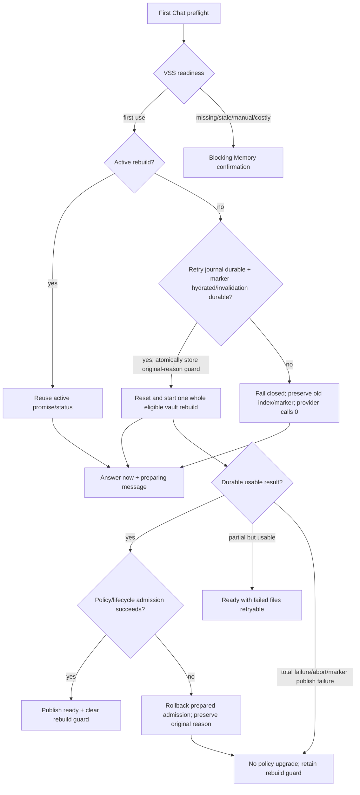

# Silent First-Use Memory Preparation Software Design Document

Document status: Approved
Updated: 2026-08-11
Work item: B-126
Authority: DEC-028 的 source-verified runtime design、数据/生命周期边界、兼容性与 test matrix。
Product spec: [Silent First-Use Memory Preparation Product Spec](../../../product/specs/pa-silent-first-use-memory-preparation-product-spec.md)
Tracker: [Development Tracker](./tracker.md)

## Current Source Baseline

- `src/memory-manager.ts`: `ensureReadyForChat()` owns first-use admission; `prepareMemory()`/`runPreparation()` own active-run reuse, progress, abort and policy upgrade; `cancelActivePreparation()`/`stopAutoMaintenance()` own lifecycle invalidation.
- `src/vss/vss-core.ts`: `getMemoryReadiness()` returns `first-use`, `local-memory-missing`, `settings-changed`, `changed-notes`, `ready` or `unavailable`; `localStateReady`/`localStateHydrated` distinguish available, known marker truth from process-local unknown state. `beginRebuildState(reason)` and atomic `replaceRebuildState({ marker, dirtyJournal, guard })` form the destructive rebuild preflight; VSS mutation stays behind its exclusive operation queue.
- `docs/architecture/vss-local-state-plan.md`: IndexedDB owns durable marker/dirty truth; OPFS owns the reconstructable index. An in-memory null marker is not proof of absence until hydration succeeds.
- `src/settings.ts`: `memoryEnabled`, `memoryAutoCheckBeforeChat` and `memoryApprovalPolicy` are persisted settings; turning Memory off calls `cancelActiveMemoryPreparation()`.
- `src/locales/plugin/{en,zh}.json`: `plugin.memory.message.buildingInBackground` already promises automatic use only once ready; Memory Settings disclosure must be reconciled with the DEC-028 exception.
- `scripts/check-platform-guards.sh` and `.github/workflows/ci.yml`: the PR's platform-sensitive regression guard exists locally but requires fatal semantics, structural exceptions, self-test and direct CI execution.
- No new persisted setting, command ID, VSS schema, vector backend, worker/WASM asset or Pagelet first-use flag is introduced by B-126.

## Design And Data Flow

B-126/REQ-01 and B-126/AC-01 require the answer-now branch to return without awaiting the rebuild or opening `MemoryApprovalModal`. The rebuild promise remains observed so failures are logged/noticed without an unhandled rejection.

B-126/REQ-03 and B-126/AC-03 use `activePreparationRun` identity plus the VSS operation queue: same-action callers reuse the promise; incompatible concurrent actions fail/serialize rather than starting parallel index mutation.

B-126/REQ-04 and B-126/AC-04 require one success predicate shared by return value, ready state, success Notice and `enableAutoRefreshAfterPrepare()`. Abort, lifecycle invalidation, total failure, ready-marker publication failure and an unavailable durable backend all take the non-ready path. Empty eligible vault may succeed only when VSS records a usable empty ready state. A denied persistent-storage request alone preserves the existing usable-but-evictable warning rather than becoming a new failure policy.

B-126/REQ-07 and B-126/AC-07 add a pre-reset truth gate. A destructive rebuild marks every candidate retryable, waits for earlier ordered state writes, then atomically stores the dirty journal, original-reason guard and null marker. That transition follows a hydrated known-absent marker or itself durably invalidates a previous/unknown marker for the same generation. If IndexedDB cannot initialize or the atomic transition fails, the operation throws/returns non-ready before `VectorIndex.reset()` and before the embedding model/provider is created or called. First-use Chat has already returned `answer-now`; a later state/status path retries IndexedDB and re-evaluates hydrated state instead of assuming absence.

B-126/REQ-08 and B-126/AC-08 use a content-free durable rebuild guard carrying `first-use`、`settings-changed` or `local-memory-missing`. The local-state store atomically replaces marker, dirty journal and guard; hydration gives the guard priority and maps it back to the original readiness/recovery reason. Abort/total failure retain the guard. Full success clears it only after ready-marker publication and Memory policy/lifecycle admission; an admission failure invokes `rollbackPreparedRebuild(reason)` so prepared index data is not exposed as usable ready and restart still recovers the original reason.

## Interfaces And Ownership

- `MemoryManager` remains the product-policy owner; Chat callers consume `MemoryDecisionResult` and never start VSS writes directly.
- `VSS`/`VSSCore` remain the only index mutation facade and keep rebuild/reset/refresh/reconcile inside the exclusive queue.
- `VSSIndexStateStore` is the durable truth source for rebuild marker/dirty state. Process-local state can bridge ordinary non-destructive maintenance retries, but cannot authorize destructive reset/provider work while marker truth is unknown.
- Its rebuild transition uses `getRebuildGuard()` plus atomic `replaceRebuildState({ marker, dirtyJournal, guard })`; `MemoryManager` uses the VSS compensation boundary `rollbackPreparedRebuild(reason)` when post-build policy/lifecycle admission fails. These APIs do not carry note content.
- Settings owns persistent disclosure and the master opt-out. Pagelet shared provider state, Memory Extraction consent and write/action policy are not inputs to first-use admission.
- The platform guard is build/CI tooling only. It rejects unguarded `getLeaf("window")` and render-time secret reads; it does not change runtime feature behavior.

## Lifecycle And Cleanup

B-126/REQ-06 and B-126/AC-06 use a lifecycle token plus active abort signal. Turning Memory off or unloading increments/invalidate the lifecycle before aborting. Every post-await side effect—provider continuation where abort is supported, policy save, ready/status update, retry scheduling and Notice—must verify the current lifecycle. Active run/status references are cleared in identity-safe `finally` paths so a late old promise cannot clear a newer run.

For destructive rebuild, cancellation/total failure leaves the durable guard intact. If cancellation or lifecycle invalidation is detected after index preparation, compensation runs before the result can be treated as ready. Guard clearing is therefore part of admitted success, not merely embedding/index completion.

## Data, Privacy, Permission And Cost

B-126/REQ-02 and B-126/AC-02 preserve the shared Data Boundary: only eligible Markdown chunks are sent to the configured embedding provider, source notes are not modified/deleted, OPFS/IndexedDB remain device-local reconstructable state, and API credits may be used. Because DEC-028 removes a blocking first-use Modal, persistent Settings copy must disclose note text/provider/cost and the opt-out before the path is eligible; Chat provides truthful non-blocking preparation status.

B-126/REQ-05 and B-126/AC-05 keep missing/stale/manual/costly Memory confirmation. The silent exception grants no Pagelet, extraction, write or external-action authority.

## Compatibility, Migration And Rollback

- Persisted settings: no key or schema migration. Existing `memoryApprovalPolicy="always"` remains valid until a durable usable prepare succeeds; existing `auto-refresh-after-prepare` behavior is unchanged.
- Old local state: previously prepared-but-missing index and stale profile take blocking recovery paths, not DEC-028 first-use.
- Marker hydration: `marker === null` before successful IndexedDB hydration is unknown, not fresh-install proof. Destructive rebuild preserves any old index/marker and waits when it cannot durable-save retry state or invalidate the marker. A successfully hydrated known-absent marker may proceed without a redundant delete.
- Non-destructive maintenance: the owner choice does not change existing process-local dirty/verify retry semantics. Browser persistent-storage permission denial also remains the separate usable-but-evictable warning path.
- Restart/recovery reason: guard hydration maps `first-use` to `uninitialized/first-use`, `settings-changed` to `stale/settings-changed`, and `local-memory-missing` to `missing-local-index/local-memory-missing`. Missing/stale guards retain their blocking confirmation semantics after restart.
- Desktop/mobile: product semantics are identical; desktop-only Obsidian APIs require structural `Platform.isDesktop` guards. Passive startup/render/input reads only the tri-state token cache and never probes `SecretStorage`; only an explicit token-management, provider-selection, or Chat-submit user action may probe Keychain. A Chat submit with `token_unknown` probes before admission instead of reporting the token missing.
- Reload/unmount: old lifecycle work cannot write state or UI after unload. OPFS/fallback constraints remain unchanged; fallback is not granted automatic writes.
- Rollback: restore the first-use call to the existing Memory Approval Modal and remove only the DEC-028 exception; no persisted-data rollback is needed.

## Test Matrix

| Requirement / AC | Unit / integration | App smoke | Failure / fallback | Evidence target |
| --- | --- | --- | --- | --- |
| B-126/REQ-01 / B-126/AC-01 | First-use `ensureReadyForChat` returns before deferred rebuild and never calls approval; one rebuild call | First Chat remains interactive and shows preparing copy | Deferred rejection is observed and yields non-blocking failure feedback | Tracker T-01 |
| B-126/REQ-02 / B-126/AC-02 | Locale/disclosure and exclusion-input assertions | Inspect Memory Settings and first Chat in EN/ZH | Excluded paths never reach embedding provider | Tracker T-02 |
| B-126/REQ-03 / B-126/AC-03 | Concurrent Chat and Chat+manual overlap with deferred promise | Repeated Chat shows one preparing state | Different active action cannot start parallel write | Tracker T-03 |
| B-126/REQ-04 / B-126/AC-04 | Success matrix: durable, partial, empty, total fail, throw, abort, marker-publication failure, unavailable backend | Ready appears only after completion | Non-usable results keep policy/state non-ready and retryable; denied persistence permission keeps prior warning semantics | Tracker T-04 |
| B-126/REQ-05 / B-126/AC-05 | Missing/stale/manual plans assert blocking approval and zero pre-confirm provider calls | Exercise Prepare/Update/Cancel | Cancel/answer-now leaves state unchanged | Tracker T-05 |
| B-126/REQ-06 / B-126/AC-06 | Desktop/mobile mocks disable or unload during deferred rebuild | Toggle Memory off during preparation; reload plugin | No late request/policy/status/Notice from old lifecycle | Tracker T-06 |
| B-126/REQ-07 / B-126/AC-07 | Preload old marker/index, fail IndexedDB initialize/hydrate, then request rebuild | First Chat answers normally while Memory remains non-ready | Assert reset/provider/policy/ready are 0 and old state survives; recover store and re-evaluate. Separate known-absent and persistence-permission fixtures | Tracker T-09 |
| B-126/REQ-08 / B-126/AC-08 | Restart fixtures for each rebuild reason plus policy-save/lifecycle-admission failure | Recovery UI follows the original reason; only first-use is silent | Abort/total fail retain guard; compensation removes usable ready and restores reason; full admitted success clears guard | Tracker T-10 |

## Open Design Findings

None. Implementation/review findings and validation state are tracked only in [Tracker](./tracker.md).

## Approval

- Design authority: Owner's explicit 2026-08-11 option A in the current PR #378 review follow-up, plus the same-day later option 1 requiring fail-closed destructive rebuild when IndexedDB marker truth is unknown; bounded by DEC-028 and the current VSS/Data Boundary contracts.
- Approved on: 2026-08-11
- Authorized implementation scope: Preserve first-Chat silent whole eligible vault Memory preparation; require durable marker truth/invalidation before destructive reset/provider work; retain original rebuild reason across failure/restart and roll back ready admission when policy/lifecycle admission fails; fix correctness, tests, current contracts and CI guard needed to make those choices truthful. Do not broaden the marker/recovery decision to ordinary non-destructive maintenance, or add Fresh Custom, progressive build, provider/model changes, Pagelet/extraction/write authority or release actions.
