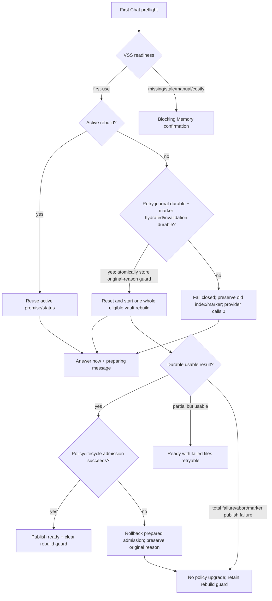

# First-Run AI Setup And Silent Memory Preparation Software Design Document

Document status: Approved
Updated: 2026-08-23
Work item: B-126
Authority: DEC-028 owning contract 与 DEC-029 scoped decision 的 source-verified runtime design、数据/生命周期边界、兼容性与 test matrix。
Product spec: [First-Run AI Setup And Silent Memory Preparation Product Spec](../../../product/specs/pa-silent-first-use-memory-preparation-product-spec.md)
Tracker: [Development Tracker](./tracker.md)

## Current Source Baseline

- `src/memory-manager.ts`: `ensureReadyForChat()` owns first-use admission; `prepareMemory()`/`runPreparation()` own active-run reuse, progress, abort and policy upgrade; `cancelActivePreparation()`/`stopAutoMaintenance()` own lifecycle invalidation.
- `src/vss/vss-core.ts`: `getMemoryReadiness()` returns `first-use`, `local-memory-missing`, `settings-changed`, `changed-notes`, `ready` or `unavailable`; `localStateReady`/`localStateHydrated` distinguish available, known marker truth from process-local unknown state. `beginRebuildState(reason)` and atomic `replaceRebuildState({ marker, dirtyJournal, guard })` form the destructive rebuild preflight；deferred success returns an opaque prepared-run handle, and VSS mutation stays behind its exclusive operation queue.
- `docs/architecture/vss-local-state-plan.md`: IndexedDB owns durable marker/dirty truth; OPFS owns the reconstructable index. An in-memory null marker is not proof of absence until hydration succeeds.
- `src/settings.ts`: `memoryEnabled`, `memoryAutoCheckBeforeChat` and `memoryApprovalPolicy` are persisted settings; turning Memory off calls `cancelActiveMemoryPreparation()`.
- `src/chat/chat-view.ts`: incomplete Chat readiness owns the inline setup form, preset selection, token-only state, keyboard/a11y feedback and Advanced Settings route; it delegates persistence to the plugin host.
- `src/plugin.ts`: tri-state token readiness and `completeAISetup()` own the explicit SecretStorage probe plus coordinated settings/token save and compensation. Passive Chat/Settings render never calls SecretStorage.
- `src/plugin.ts`: legacy Provider migration classifies the raw settings blob before defaults are merged. Explicit provider-aware Qwen/OpenAI keeps its supported current identity；provider-less history can preserve admission only through the historical Qwen-only `modelName` enum；Ollama/unsupported/unknown migration stays structurally incomplete until a new selection.
- `src/settings.ts`: when collapse storage has no value for a group, `ai-provider` defaults expanded and every other group defaults collapsed; an explicit stored boolean overrides that default.
- `src/locales/plugin/{en,zh}.json`: `plugin.memory.message.buildingInBackground` already promises automatic use only once ready; Memory Settings disclosure must be reconciled with the DEC-028 exception.
- `scripts/check-platform-guards.sh` and `.github/workflows/ci.yml`: the PR's platform-sensitive regression guard exists locally but requires fatal semantics, structural exceptions, self-test and direct CI execution.
- No new persisted setting, command ID, VSS schema, vector backend, worker/WASM asset or Pagelet first-use flag is introduced by B-126.

## Design And Data Flow

B-126/REQ-01 and B-126/AC-01 require the answer-now branch to return without awaiting the rebuild or opening `MemoryApprovalModal`. The rebuild promise remains observed so failures are logged/noticed without an unhandled rejection.

B-126/REQ-03 and B-126/AC-03 use `activePreparationRun` identity plus the VSS operation queue: same-action callers reuse the promise; incompatible concurrent actions fail/serialize rather than starting parallel index mutation.

B-126/REQ-04 and B-126/AC-04 require one success predicate shared by return value, ready state, success Notice and `enableAutoRefreshAfterPrepare()`. Abort, lifecycle invalidation, total failure, ready-marker publication failure and an unavailable durable backend all take the non-ready path. Empty eligible vault may succeed only when VSS records a usable empty ready state. A denied persistent-storage request alone preserves the existing usable-but-evictable warning rather than becoming a new failure policy.

B-126/REQ-07 and B-126/AC-07 add a pre-reset truth gate. A destructive rebuild marks every candidate retryable, waits for earlier ordered state writes, then atomically stores the dirty journal, original-reason guard and null marker. That transition follows a hydrated known-absent marker or itself durably invalidates a previous/unknown marker for the same generation. If IndexedDB cannot initialize or the atomic transition fails, the operation throws/returns non-ready before `VectorIndex.reset()` and before the embedding model/provider is created or called. First-use Chat has already returned `answer-now`; a later state/status path retries IndexedDB and re-evaluates hydrated state instead of assuming absence.

B-126/REQ-08 and B-126/AC-08 use a content-free durable rebuild guard carrying `first-use`、`settings-changed` or `local-memory-missing`. The local-state store atomically replaces marker, dirty journal and guard; hydration gives the guard priority and maps it back to the original readiness/recovery reason. Abort/total failure retain the guard. Full success clears it only after ready-marker publication and Memory policy/lifecycle admission；admit/rollback 必须回传本次 deferred rebuild 的 opaque handle，stale handle 只返回 no-op，不能修改后继 run 的 marker、guard 或 index。

### Inline setup and first Settings focus

B-126/REQ-09 and B-126/AC-09 keep presentation in `ChatView` and persistence in `PluginManager`. Chat renders only three approved preset identities (`qwen`, `qwen-intl`, `openai`) and never accepts an arbitrary endpoint inline. `completeAISetup()` resolves the selected preset through the shared preset table so runtime provider, base URL, chat model, embedding model and `aiProviderPreset` stay one tuple. Advanced/custom configuration routes to Settings.

B-126/REQ-10 and B-126/AC-10 treat settings plus SecretStorage as a coordinated transaction, not a false cross-storage atomic primitive. One shared AI-configuration queue serializes Chat setup and every Settings Provider tuple transaction as `stable snapshot -> mutation -> save -> compensation`. Chat writes a supplied token only when needed；Settings Provider changes never write or roll back the secret and therefore reuse only the stable token state that exists when their queued transaction begins. Each Settings invocation advances an external epoch before enqueue；an older queued Chat fails retryably before mutation, while a Chat submitted during a debounced Provider text draft is rejected until that draft enters the queue. Provider text fields merge drafts for 400ms without mutating stable runtime settings；preset changes are immediate；closing Settings flushes the pending draft. A Settings save failure restores the stable tuple without a success broadcast；if rollback persistence also fails, Provider admission is forced incomplete. Provider tuple and token retain separate process-local revisions so an active Chat compensates only state it still owns and a later standalone token edit is never overwritten. Unload drains the shared queue, including compensation；failures remain typed/retryable and never render false success.

B-126/REQ-11 and B-126/AC-11 use `unknown | present | missing`. Passive readiness may report unknown but cannot inspect Keychain. Only explicit provider selection, token management, Chat submit or AI/Memory command probes unknown; callers then recompute readiness and refresh the surfaces they own. A successful standalone Settings token add/remove broadcasts readiness only after the secret commit；inline setup does not broadcast a partial cross-store transaction. Local read-only Memory status depends on structural configuration and durable index state, not token presence.

B-126/REQ-12..13 and B-126/AC-12..13 keep first-run focus reversible and accessible. Collapse storage writes explicit booleans; missing or malformed entries fall back per group, so saving one group cannot expand every other group. The inline form exposes provider selection, token name, Enter submit, busy/live error state and mobile-sized controls；successful keyboard/assistive activation restores focus to the composer, while pointer/touch completion does not summon the mobile keyboard. No new success Notice or live copy is introduced.

B-126/REQ-14 and B-126/AC-14 classify legacy Provider provenance from the raw persisted blob, never from Qwen defaults added by `mergeLoadedSettings()` or migration. Historical `qwen-plus`、`qwen-max` and `qwen-turbo` identify the pre-provider Qwen-only UI; Ollama or any missing/unknown identity clears structural admission while preserving the retained secret for reuse after an explicit current Provider choice. This adds no provider, consent store or passive SecretStorage read.

## Interfaces And Ownership

- `MemoryManager` remains the product-policy owner; Chat callers consume `MemoryDecisionResult` and never start VSS writes directly.
- `VSS`/`VSSCore` remain the only index mutation facade and keep rebuild/reset/refresh/reconcile inside the exclusive queue.
- `VSSIndexStateStore` is the durable truth source for rebuild marker/dirty state. Process-local state can bridge ordinary non-destructive maintenance retries, but cannot authorize destructive reset/provider work while marker truth is unknown.
- Its rebuild transition uses `getRebuildGuard()` plus atomic `replaceRebuildState({ marker, dirtyJournal, guard })`; deferred rebuild returns `VSSPreparedRebuildHandle`, and `MemoryManager` must pass the same opaque handle to `admitPreparedRebuild(handle)` or `rollbackPreparedRebuild(handle, reason)`. These APIs do not carry note content；a stale handle has no mutation authority.
- Settings owns persistent disclosure and the master opt-out. Pagelet shared provider state, Memory Extraction consent and write/action policy are not inputs to first-use admission.
- `ChatView` owns inline setup draft/UI state only. `PluginManager` owns readiness, explicit SecretStorage access, the shared Chat/Settings AI-configuration queue, provider tuple persistence and store-scoped compensation ownership. Every Provider transaction enters the settings-write exclusive region, builds a local settings snapshot, durably saves it, then publishes only the committed tuple to `PluginManager.settings`. An invocation-scoped counted credential lease starts before any queued Provider transaction or inline token write and ends only after stable commit/rollback；while any lease remains, readiness is non-ready and `getAPIToken()`/presence probes cannot read a tentative SecretStorage value. Ordinary settings saves/listeners can therefore observe neither a staged endpoint nor a mixed endpoint/token pair. Stable success, reconciliation after a blocked probe, or fail-closed compensation is the only readiness-broadcast point.
- `SettingTab` owns debounced Provider text drafts, generation and flush timing. Its effective view overlays the latest draft on the stable plugin tuple across partial rerenders；Custom merges an unflushed URL/model draft, while a fixed preset intentionally replaces those fields. Only the latest settled generation may reconcile controls or show a save-failure Notice. Provider settle synchronizes the Provider-dependent Memory model control without rebuilding unrelated Advanced Memory controls that may be waiting for confirmation. Standalone Settings token writes claim token ownership even when SecretStorage reports a post-write failure, clear the runtime cache to `unknown`, and queue their stable readiness broadcast behind the shared AI-configuration tail；Settings remains the only Custom/advanced editor.
- Provider migration provenance is decided from the original loaded record before defaults are merged. A retained token is credential state, not Provider identity, and cannot upgrade an unproven migration to ready.
- The platform guard is build/CI tooling only. It rejects unguarded `getLeaf("window")` and render-time secret reads; it does not change runtime feature behavior.

## Lifecycle And Cleanup

B-126/REQ-06 and B-126/AC-06 use a lifecycle token plus active abort signal. Turning Memory off or unloading increments/invalidate the lifecycle before aborting. Every post-await side effect—provider continuation where abort is supported, policy save, ready/status update, retry scheduling and Notice—must verify the current lifecycle. Active run/status references are cleared in identity-safe `finally` paths so a late old promise cannot clear a newer run. Temporary auto-policy admission carries the preparation owner and original policy；a successor taking over an in-flight save performs its own durable persist, while stale completion/compensation cannot restore over that successor.

For destructive rebuild, cancellation/total failure leaves the durable guard intact. If cancellation or lifecycle invalidation is detected after index preparation, compensation runs before the result can be treated as ready. Guard clearing is therefore part of admitted success, not merely embedding/index completion.

## Data, Privacy, Permission And Cost

B-126/REQ-02 and B-126/AC-02 preserve the shared Data Boundary: only eligible Markdown chunks are sent to the configured embedding provider, source notes are not modified/deleted, OPFS/IndexedDB remain device-local reconstructable state, and API credits may be used. Because DEC-028 removes a blocking first-use Modal, persistent Settings copy must disclose note text/provider/cost and the opt-out before the path is eligible; Chat provides truthful non-blocking preparation status.

B-126/REQ-05 and B-126/AC-05 keep missing/stale/manual/costly Memory confirmation. The silent exception grants no Pagelet, extraction, write or external-action authority.

## Compatibility, Migration And Rollback

- Persisted settings: no key or schema migration. Existing `memoryApprovalPolicy="always"` remains valid until a durable usable prepare succeeds; existing `auto-refresh-after-prepare` behavior is unchanged.
- Provider migration: a provider-aware supported Qwen/OpenAI configuration keeps its explicit identity, and an exact historical Qwen-only `modelName` may keep Qwen admission. Ollama、unsupported Provider and missing/unknown pre-provider identities persist an incomplete Provider state until explicit selection；any retained token remains available for that later explicit action.
- Old local state: previously prepared-but-missing index and stale profile take blocking recovery paths, not DEC-028 first-use.
- Marker hydration: `marker === null` before successful IndexedDB hydration is unknown, not fresh-install proof. Destructive rebuild preserves any old index/marker and waits when it cannot durable-save retry state or invalidate the marker. A successfully hydrated known-absent marker may proceed without a redundant delete.
- Non-destructive maintenance: the owner choice does not change existing process-local dirty/verify retry semantics. Browser persistent-storage permission denial also remains the separate usable-but-evictable warning path.
- Restart/recovery reason: guard hydration maps `first-use` to `uninitialized/first-use`, `settings-changed` to `stale/settings-changed`, and `local-memory-missing` to `missing-local-index/local-memory-missing`. Missing/stale guards retain their blocking confirmation semantics after restart.
- Desktop/mobile: product semantics are identical; desktop-only Obsidian APIs require structural `Platform.isDesktop` guards. Passive startup/render/input reads only the tri-state token cache and never probes `SecretStorage`; only an explicit token-management, provider-selection, or Chat-submit user action may probe Keychain. A Chat submit with `token_unknown` probes before admission instead of reporting the token missing.
- First Settings focus: no migration is needed. Missing/malformed collapse storage uses the approved per-group default; explicit `true`/`false` values survive reopen and override it.
- Inline setup rollback: restoring the prior provider/token pair is best-effort across two stores. If provider or token compensation itself fails, or a Settings Provider save fails after token ownership changed, the Provider is forced structurally incomplete and best-effort persisted before the failure is broadcast. A process crash between the SecretStorage write and settings commit remains outside this best-effort runtime guarantee；crash-atomic behavior would require a separate durable transition marker and is not claimed by this slice.
- Reload/unmount: a Chat/Settings Provider transaction accepted before unload is tracked and drained through commit or fail-closed compensation；new submissions after unload starts are rejected before either store is touched. Old Memory lifecycle work cannot write state or UI after unload. OPFS/fallback constraints remain unchanged；fallback is not granted automatic writes.
- Rollback: restore the first-use call to the existing Memory Approval Modal and remove only the DEC-028 exception; no persisted-data rollback is needed.

## Test Matrix

| Requirement / AC | Unit / integration | App smoke | Failure / fallback | Evidence target |
| --- | --- | --- | --- | --- |
| B-126/REQ-01 / B-126/AC-01 | First-use `ensureReadyForChat` returns before deferred rebuild and never calls approval; one rebuild call | First Chat remains interactive and shows preparing copy | Deferred rejection is observed and yields non-blocking failure feedback | Tracker T-01 |
| B-126/REQ-02 / B-126/AC-02 | Locale/disclosure and exclusion-input assertions | Inspect Memory Settings and first Chat in EN/ZH | Excluded paths never reach embedding provider | Tracker T-02 |
| B-126/REQ-03 / B-126/AC-03 | Concurrent Chat and Chat+manual overlap with deferred promise | Repeated Chat shows one preparing state | Different active action cannot start parallel write | Tracker T-03 |
| B-126/REQ-04 / B-126/AC-04 | Success matrix: durable, partial, empty, total fail, throw, abort, marker-publication failure, unavailable backend | Ready appears only after completion | Non-usable results keep policy/state non-ready and retryable; denied persistence permission keeps prior warning semantics | Tracker T-04 |
| B-126/REQ-05 / B-126/AC-05 | Missing/stale/manual plans assert blocking approval and zero pre-confirm provider calls | Exercise Prepare/Update/Cancel | Cancel/answer-now leaves state unchanged | Tracker T-05 |
| B-126/REQ-06 / B-126/AC-06 | Desktop/mobile mocks disable or unload during deferred rebuild | Toggle Memory off during preparation; reload plugin | No late request/policy/status/Notice from old lifecycle | Tracker T-06 |
| B-126/REQ-07 / B-126/AC-07 | Preload old marker/index, fail IndexedDB initialize/hydrate, then request rebuild | First Chat answers normally while Memory remains non-ready | Assert reset/provider/policy/ready are 0 and old state survives; recover store and re-evaluate. Separate known-absent and persistence-permission fixtures | Tracker T-09 |
| B-126/REQ-08 / B-126/AC-08 | Restart fixtures for each rebuild reason, policy-save/lifecycle-admission failure and cancel/new-run stale handle interleavings | Recovery UI follows the original reason; only first-use is silent | Abort/total fail retain guard; matching-handle compensation restores reason; stale admit/rollback is no-op; successor policy survives old save resolve/reject | Tracker T-10 |
| B-126/REQ-09 / B-126/AC-09 | Fresh/partial setup presets, disabled Start, Advanced route and persisted tuple identity | Configure a fresh Chat without leaving the surface | Invalid/custom inline input is rejected | Tracker T-13 |
| B-126/REQ-10 / B-126/AC-10 | Token-only zero-settings-write/existing-token reuse, settings/token write-after-persist failure, provider/token compensation, ordinary-save/listener/provider-consumer isolation, Settings Provider × standalone token, counted queued leases, same-tick unload, two-Chat serialization, active/queued Chat→Settings ordering, debounced draft→Chat ordering and dual-save failure | Failed setup stays visible and retryable；Provider text edits remain debounced and flush on close | Pending tuple/credential is never admitted；reload preserves the stable pair or remains explicitly incomplete；older Chat cannot overwrite later Settings；post-unload submission fails before mutation；readiness broadcasts only a stable result | Tracker T-13 |
| B-126/REQ-11 / B-126/AC-11 | Passive read count 0; explicit Chat/AI/Memory probes unknown once；successful Settings add/remove broadcasts after commit | Retained-token reload does not show a false missing-token state；open Chat refreshes after Settings token change | Probe error remains neutral/unknown with feedback；failed/cancelled token edit sends no success broadcast | Tracker T-13 |
| B-126/REQ-12 / B-126/AC-12 | First default plus expanded non-AI/collapsed AI reopen fixtures | First Settings visit focuses AI Provider | Missing/malformed stored keys use per-group defaults | Tracker T-13 |
| B-126/REQ-13 / B-126/AC-13 | Provider semantics, token label, Enter, busy/live error, input modality focus, effective-draft rerender, Custom pending-draft merge, stale-generation suppression, pending Memory confirmation DOM identity and mobile CSS assertions | Keyboard and narrow-surface interaction smoke | Save failure restores stable controls with Notice；stale results cannot overwrite a newer draft；Provider settle does not detach an unrelated confirmation control；pointer/touch success does not force composer focus | Tracker T-13 |
| B-126/REQ-14 / B-126/AC-14 | Raw migration fixtures for provider-aware Qwen/OpenAI, historical Qwen-only models, missing/unknown model and Ollama | Upgrade state routes either to normal Chat or the existing provider chooser | Unsupported/non-grandfathered retained token cannot make readiness complete before selection | Tracker T-14 |

## Open Design Findings

None. Implementation/review findings and validation state are tracked only in [Tracker](./tracker.md).

## Approval

- Design authority: Owner's explicit 2026-08-11 option A plus same-day marker option 1 own DEC-028. Owner's explicit 2026-08-23 option 1 owns DEC-029: retain the bounded Chat inline setup and first Settings default focus；同日明确选择 legacy provider 方案 B，只 grandfather 可证明的旧 Qwen。Neither decision is backdated to the earlier Discovery proposal.
- Approved on: 2026-08-11 for DEC-028; scoped amendments approved 2026-08-23 for DEC-029 and legacy Provider admission.
- Authorized implementation scope: Preserve first-Chat silent whole eligible vault Memory preparation and marker/recovery truth; retain Qwen China/Qwen Intl/OpenAI inline preset setup, token-only/existing-token preservation, explicit token probe, compensated save, accessible error states and persisted first-Settings focus；只 grandfather 原始数据可证明的旧 Qwen，Ollama/来源不明迁移必须重新选择。Do not add Fresh Custom, wizard, Test Connection, PA Cloud, new provider/model, ordinary non-destructive marker changes, Pagelet/extraction/write authority or release actions.
