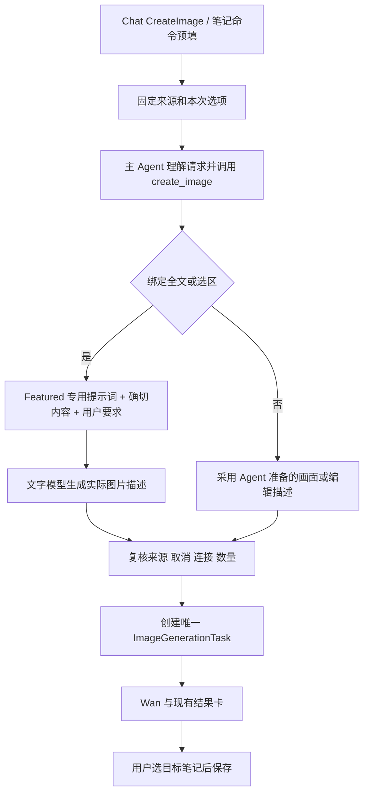

# Unified Chat Image Creation Software Design Document

Document status: Approved
Updated: 2026-09-28
Work item: B-152
Authority: 已确认方案的源码核实设计；Proposed 接口尚未实现，不能作为交付事实。
Product spec: [Product Spec](../../../product/specs/pa-unified-chat-image-creation-product-spec.md)
Tracker: [Development Tracker](./tracker.md)

## Current Source Baseline

本次设计开始时 master 工作区干净；实施前另行记录真实 commit、dirty 输入和部署身份。

| 已存在的文件 / 接口 | 已核实事实与变更点 |
| --- | --- |
| [chat-view.ts](../../../../src/chat/chat-view.ts)：parseCreateImageCommand / sendPrompt / prefillComposer | 4917 附近先 submit 原问题，4926 才 streamLLM；改为工具内唯一提交，预填须携带结构化来源 |
| [composer-draft.ts](../../../../src/chat/composer-draft.ts)：ComposerImageIntent / ComposerDraft | 草稿内存拥有，take/restore 带 revision；尚无文字快照，imageIntent 当前要求非空文字 |
| [chat-tool-factories.ts](../../../../src/ai-services/chat-tool-factories.ts)：createCreateImageTool | 同 subrequestIndex 复用 Promise；工具没有 Featured 专用提示词；current-note 无选区退回 nearby，不适合确切选区捕获 |
| [chat-tool-types.ts](../../../../src/ai-services/chat-tool-types.ts)：CreateImageHostBinding | 宿主绑定操作身份和 submit，承接受约束的专用准备 |
| [service.ts](../../../../src/ai-services/service.ts)：generateFeaturedImage / getImageDescriptionPrompt / callLLM | 全文经 getDocumentContent 后以专用 system prompt 单独调用文字模型，再同步 Wan、下载并插图 |
| [ai-actions.ts](../../../../src/plugin/ai-actions.ts)、[plugin.ts](../../../../src/plugin.ts) | ai-assistant-featured-images 当前打开 generate modal 后调用 Featured helper；设置 edit modal 独立 |
| plugin.activeChatView / [ChatPluginIntegration.createChatHost](../../../../src/chat/plugin-integration.ts) | activeChatView 返回已展开的 LLMView；复用开 Chat 能力并增加窄结构化 prefill；createChatHost 接入新宿主依赖 |
| [options](../../../../src/ai-services/featured-image-options.ts)、[modal](../../../../src/settings/featured-image-options-modal.ts)、[settings](../../../../src/settings.ts) | featuredImageModel / numFeaturedImages / featuredImagePath；默认标准模型、一张、空目录；标准/Pro、1–4 张可选 |
| [image-generation-service.ts](../../../../src/chat/image-generation-service.ts) | operationId 防重；保存原请求/实际描述；Wan 使用 submittedPrompt，但目前硬编码标准模型/2K |
| [task types](../../../../src/chat/image-generation-types.ts) / [Wan adapter](../../../../src/ai-services/wan-image-provider.ts) | schemaVersion 1，clone 函数决定持久字段；adapter 支持标准/Pro 并组装真实请求 |
| [save-to-note](../../../../src/chat/image-save-to-note.ts) | 每次选目标，promoteToNote + Vault.process；当前路径来自 Obsidian attachment path |
| [TaskSourceRun](../../../../src/ai-services/task-source-run.ts) / [guard](../../../../src/ai-services/task-source-read-guard.ts) / [lineage](../../../../src/ai-services/input-lineage.ts) | 既有物理请求准入和派生来源，新辅助调用必须接入 |
| [ChatHost](../../../../src/chat/ChatHost.ts) / [locales](../../../../src/locales/plugin/en.json) / [custom.pcss](../../../../src/custom.pcss) | 窄宿主接线、EN/ZH 文案和既有 CSS；不增加全局对象或运行时 style |

## Design And Data Flow

### 来源和草稿

- Proposed `ImageTextSourceSnapshot`：kind（note/selection）、笔记身份/path、显示标题、
  确切 text、可选选区位置、既有 InputLineage。附在 ComposerImageIntent，无来源用缺省。
  不新建素材 registry；不把 Editor/DOM/凭据放入异步服务或持久对象。
- 沿用 selection hint 的事件时机，在焦点转入 Chat 前捕获最近有效 Markdown 选区，
  排除 Chat 文本框自己的 selection。command 用回调 editor/view，在打开 Chat 前捕获。
  选择动作/来源时形成可预览快照；切换全文/选区针对绑定笔记，不暗换活动页。
- 发送前绑定笔记发生修改时提示刷新来源；发送使用预览过的同一内容。发送后普通编辑/
  切换焦点不改变快照，但删除、排除或权限撤回仍阻止后续外发。空/失效来源提示重选，
  超过实际模型输入能力提示缩小范围，不静默截断，不新增摘要链。
- 来源正文/预览只存草稿/本轮内存。复用 draft revision/take/restore，迟到失败只能
  恢复自己消费的草稿。清除动作/成功发送/取消关闭按现有生命周期释放快照和监听。
- 有来源可空补充文字；宿主用简短默认任务说明建立会话，详情标明其为默认说明，
  不冒充用户原文。无来源且无描述不能发送。来源冲突由 Agent 澄清，宿主不解释关键词权限。
- 自然语言完整描述仍走工具；涉及笔记但未选择来源时提示选择同一来源控件。
  不额外开放模型可任意指定的路径或暗读当前页，避免建立第二套自然语言来源协议。

### 专用图片描述生成

- 将 getImageDescriptionPrompt 提取到 Proposed `src/ai-services/featured-image-prompt.ts`。
  原有正文、词典、示例作为首版基线保留，不在迁移中重写创作策略。
- Proposed `prepareFeaturedImagePrompt` 窄服务接收 snapshot、用户本轮补充文字、signal、
  来源/连接检查和既有文字模型依赖，返回图片描述。主 Agent 管意图，服务管内容到画面，
  图片任务服务管生成/保存。只需此窄服务与共享模板，不新增 Agent 或通用 pipeline。
- 原模板作为 system 指导；正文作为有边界的素材，文内指令不改变权限/工具；本轮补充
  要求单独标注并优先于模板风格建议。全文复用 getDocumentContent，选区原样使用；不
  自动加未选内容、路径/标题、历史/Memory，也不把主 Agent 猜测出的另一份 prompt 当原文。
- 使用已配置文字模型，冻结本轮连接；沿用已有合法调用参数和有界超时/重试，同时接入
  本轮 signal、实际 provider 调试/费用观测、来源检查。每次物理文字请求前检查，返回后
  再检查；不能直接调用一个不受 Chat 来源/取消管控的旧 helper。
- 空白/失败/超出 Wan prompt 限制则明确失败；不再加自我修复轮、不机械截断、不发原问题。
  UI 显示「正在构思图片」，准备不算 Wan 已受理。
- 文本源与参考图片可并存，专用调用只处理文字，refs 沿用现有 reference 路径；不宣称
  文字模型见过未发送像素。后续 edit 保持确切 parent，默认不重新附上旧笔记或重做提炼。

### 单一提交与返回事实

- 去除 streamLLM 前 submit，全部经过 create_image 宿主绑定。工具参数面保持现有语义，
  来源、模型、数量选项由宿主绑定；Agent 不能替换 snapshot 或指定任意路径/端点。
- 专用准备放在工具现有同子请求 Promise 去重范围内。同 operation 先查已登记任务，
  有则返回原回执，避免文字轮重试重跑准备。不同明确图片沿用 subrequestIndex 和总量限制。
- submittedPrompt 是专用返回值，无来源时才采用 tool.prompt；userPrompt 是原请求或
  已标注的默认说明。准备结果完成并复核后才创建持久任务；Wan 只接受这份实际描述。
- 工具回执声明真实状态/taskId/来源类型；助手不得另写一份构图充当已提交事实。
  详情记录完整实际描述。要求只讨论、只写 prompt 时由 Agent 不调用工具，不能因有 @ 就抢跑。
- count 明确授权可以来自用户文字或可见的本次选项，扩展现有仅凭文字正则的检查；
  同时保持消息总预算、重复调用防重。模型/连接失效不暗换模型或重试付费。

## Interfaces And Ownership

| Owner | 最小责任 |
| --- | --- |
| ComposerDraft / ChatView | 来源、预览、空输入、选项摘要、发送/恢复；不嵌入模型传输或插图代码 |
| ChatHost / plugin AI actions | Proposed 结构化预填、准备服务依赖和默认值；command 退出旧 helper |
| 专用准备服务 | 提示词组装、模型调用、取消和来源准入；不拥有图片持久任务 |
| CreateImage host binding | 操作/费用身份，按来源准备，唯一 submit |
| ImageGenerationService / codec | 真实模型和参数、可选来源元数据、既有生命周期 |
| 图片卡 / save-to-note | 实际描述、再生成 lineage、明确保存目标和正式附件目录 |

Proposed 持久字段增加可选 `request.inputLineage`（所有派生描述的真实输入来源）、
`request.promptOrigin`（显式文字来源的 kind、显示名/path、必要选区位置与既有 InputLineage）
及正式附件目录提示。无正文/预览/闭包/凭据。clone/validator 必须
实际保留并校验字段；旧 schemaVersion 1 缺字段可读，不新增对象仓库或迁移原图片。

重新生成预填上次 submittedPrompt、refs/选项及派生 lineage，标明「沿用上次描述」，
新 operationId，不读当前笔记、不再次提炼。换源才重新准备。旧记录无来源证明仍可
查看/导出；再生成遵守现有来源准入，必要时重选源/提供独立描述，不能把应用预填的
派生文字当作用户新输入而消除其 lineage。
来源准入发生在新一轮首次文字模型外发前；普通 Agent 描述从既有实际请求 lineage
接线，专用准备只记录其确切素材和本轮用户补充。缺失/unknown 证明保持原状态，
不借克隆补成 complete。来源 receipt 沿用 TaskSourceRun，内存快照保留原文件身份。

## Lifecycle And Cleanup

- 准备属于当前 Chat run，取消/删聊天/插件卸载后迟到结果不得提交；由现有 signal 和
  草稿/turn 身份保证，不新增持久 preparing 状态或独立恢复系统。
- 已受理图片归现有插件级服务；切换会话/文字聊天不重绑目标，视图关闭不误停受理任务。
- 准备中重启为中断，用户主动重新发起；已有 prepared/not_submitted/running/
  submission_unknown 等按原规则恢复，不重新读取正文、重跑专用模型或重放未知费用请求。
- requiresSourceReceipt/实际 POST 前检查覆盖新派生描述。真实撤回及时生效；普通下一轮
  scope 切换按 DEC-043 下次生效，不回头重写当前 run。

## Data, Privacy, Permission And Cost

snapshot 与准备结果保持实际来源链；显式选区不授权同笔记其余内容，Data Boundary 不被
新入口绕过。普通 tool.prompt 继承实际主 Agent 上下文，不能以引用列表替代来源证明。
独立准备只使用明确素材和用户要求，不继承无关混合上下文。首用说明覆盖文字模型/Wan，
不新增敏感性分类或常规逐次确认。每个内容配图子请求一次逻辑准备，有限传输重试仍受
原模型策略/取消管控并如实计量；生图无自动择优或隐藏重抽。

## Compatibility, Migration And Rollback

1. **command**：保留 ID/快捷键，捕获选区优先/全文 fallback 后打开结构化草稿。非空
   草稿/运行中请求保留并提示重试；不清空、不直接生成。设置 edit-defaults 可保留。
   旧 generate modal/同步生图/下载/自动插图在核对消费者归零后退役，不误删 Summary 公共能力。
2. **参数**：保留现有 settings key/值。内容配图带入旧有效默认，在发送前显示模型/数量，
   轻量选项入口复用已有控件；当次修改不自动保存全局。普通生图保留标准模型/2K/一张默认。
   服务真正使用 task.request.model 支持原标准/Pro；不能只改 UI/详情。尺寸保留有效行为，
   不额外加比例/分辨率面板；不兼容时说明，不暗降级。
3. **路径/插入**：featuredImagePath 作为正式附件目录提示，空值沿用 Obsidian 路径。
   复用正规化、唯一命名和 promoteToNote，给 saveGeneratedImageToNote 增加窄路径选项。
   生成期先存 Chat 原件；每次选目标后迁移/插入，不自动插图，不覆盖同名文件；无效目录
   提示修正，不暗换。旧文件不搬迁。
4. **历史/平台**：新字段可选，旧模型/count/submittedPrompt 不改写；删聊天随任务删除
   新元数据。复用 MarkdownView/Editor、平台 DOM 和 EN/ZH 文案；新增控件做 mobile simulator
   验证，只有新增原生依赖/具体风险才补真机。
5. **回滚**：保留原配置/任务/图片，按提示词提取、入口编排、兼容接线审查 diff；回滚代码
   不删数据或重放任务。不给旧提前提交路径加长期双轨开关；产品回退须明确处理已知不一致。

## Test Matrix

各行是风险组，可共享集成案例，不是逐字段/全组合测试要求；命令与重跑条件只在 Tracker。

| Requirement / AC | Minimum evidence | Failure / negative case |
| --- | --- | --- |
| B-152/REQ-01 / B-152/AC-01 | composer/chat-view 三种来源及空补充；Desktop/simulator | 仅动作无材料、IME、移除后不误发 |
| B-152/REQ-02 / B-152/AC-02 | 选区内外不同标记，发送后切另一笔记，检查准备入参 | 空/超限不退回 nearby；源撤销拒绝 |
| B-152/REQ-03 / B-152/AC-03 | 专用 prompt 实际入请求、提取 diff；两段合成材料真实模型观察 | 空/失败时 Wan 为零，不靠整段字符串快照冒充质量 |
| B-152/REQ-04 / B-152/AC-04 | deferred 准备 sentinel 穿到 Wan adapter 请求体；重复工具只一次 | 旧前置路径目标红灯，保留参考/edit/多图既有断言 |
| B-152/REQ-05 / B-152/AC-05 | 详情/再生成与 payload 对齐，codec 旧记录读取 | 不用原问题/新活动页，派生来源不重置 |
| B-152/REQ-06 / B-152/AC-06 | command 真实入口；一组旧非默认 Pro/数量/目录 fixture | 不覆盖草稿、不调旧 helper、不自动插图/重置设置 |
| B-152/REQ-07 / B-152/AC-07 | 准备中取消/撤回/连接变化参数化案例，复用恢复 suite | 迟到零 POST；已受理/未知不新增费用 |
| B-152/REQ-08 / B-152/AC-08 | Desktop 两入口、一次真实 Wan 单图、simulator 新控件 | 讨论不生成，实际说明一致，未测真机不外推 |

真实模型用两段原创合成材料：全文主题「旁观 Agent 输出的失去掌控感」，选区主题
「反馈如仪表盘帮助掌握进度」，放入不同选区外标记。验收看主题符合选源、画面/风格/
镜头具体、遵守「不要文字」等要求，不要求固定措辞或像素。两次文字提炼中一次接一张
Wan 图即可核实链路，不为每个来源/模型/平台重复付费。先取得适用费用/数据授权；
不默认使用 anthelion 私人笔记。真实调用结果和原始 POST 内容需检查，助手自述不算证据。

## Open Design Findings

无未决产品取舍或未处置的设计 P0/P1/P2。已确认的当前缺陷与回归任务在 Tracker。
实施接线采用现有 activeChatView/createChatHost；辅助调用复用本轮 controller.signal、
工具执行捕获的 source-validity receipt 与绑定 snapshot 的 lineage，codec 校验可选元数据。
实施若发现现有生命周期不能覆盖某条边界，由 GPT 根据具体证据修订，不授权 worker 取消
专用步骤、放宽来源或另建任务系统。

## Approval

- Product authority: DEC-044；用户已批准产品方案与本次文档工作。
- Detailed design: GPT 于 2026-09-28 完成源码接线和风险映射核对；Proposed 名称为待实现接口。
- Approved on: 2026-09-28，依据已确认产品范围的设计审批；不代表运行时实现获准或验收完成。
- Authorized implementation scope: 用户于 2026-09-29 授权按 B-152 完成全部开发测试；执行进度、证据和接收以 Tracker 为准，Git/发布另行授权。
