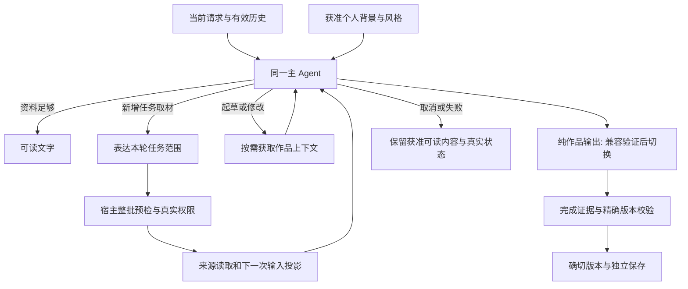

# Unified Task Execution Software Design Document

Document status: Approved
Updated: 2026-09-10
Work item: B-135
Authority: 本 track 的源码核实设计、接口、来源与交付生命周期、兼容性、迁移及验证映射；不代表运行时已实现或验证通过。
Approval scope: Owner 全量实施目标批准已确认需求的兼容实现；D2/D3 于 2026-09-09 明确选择专用作品通道，兼容验证通过后切换；D5 同日确认语义提议及保留执行保护，D8 确认无明确用户关闭证据的旧 false 迁移为开启，D10 确认停止新提取与使用已有画像解耦。接口与迁移表示仍须通过工程验证；新产品偏差另行决定。
Product spec: [Unified Task Execution Product Spec](../../../product/specs/pa-unified-task-execution-product-spec.md)
Plan: [Delivery Plan](./plan.md)
Tracker: [Development Tracker](./tracker.md)

## Current Source Baseline

增量实现记录：基线之后的独立契约恢复已修改 stream adapter 与 loop。文本数组按
原字符拼接，完成事实随内容及时传递，正常纯正文的完成与尾部传输结果分开记录。
Loop 使用 runtime 传入的 `runStartedAt`，沿既有总预算/预留量派生同一截止；不另建
冗余 `RunDeadline` record。下表仍是原基线接缝，当前部分验证及尚未实现项只看 Tracker。

T-06 增量接收在非空正文开始后使用原硬截止；到软截止后的本次输出通过既有
terminal policy 完成，不启动第二次普通请求。工具执行仍使用软截止，不因正文接收
延续而取得晚到执行资格。正常完成、异常、取消及硬截止分别保留其真实状态；
`finalization_reserve_used_by_text` 只记录预算过渡，不单独把正常完成降为警告。

T-07 先在现有文本JSON路径增加展示层预览：独立decoder只返回可读前缀，不生成
完成标记或作品。bridge按真实request/message及宿主current guard发临时预览，工具
阶段/来源撤销时清除；终态仍走原完整decoder与结束检查。失败时可读正文进入原
Chat content，原始输出留在现有recovery字段，提示单独显示；不新增持久化协议。
该过渡不能替代后续 native 组合验收；D2/D3 已另获用户明确选择，切换仍须通过兼容验证。

T-12首片已移除runtime独立分类请求及预测required工具名单；同一主Agent从当前
获准语义工具中选择取材，既有host policy保留实际工具结果/终态职责。Operations
与取材工具同时可见，但原意图、opt-in、确认和执行门不变。自然语言范围regex、
写作识别和每次输入用途投影尚待后续任务，不能据此声称统一语义路径已全量交付。

T-06诊断目前在作品投影前记录生成/传输/结构三轴；answer/context summary及
Memory rewrite/rerank在实际fetch/requestUrl创建后报告宿主attempt和序列化输出
限额。仅debug本地白名单日志；absent/unknown不推导provider默认值，宿主attempt
不冒充provider ID。它不是全部工具请求成本账单，范围与验证见Tracker。

本次只读核实输入为干净的 `master@8be89c4c0318a2a1320314cd305027f3da03af7c`。
[Solution Brief](../../discovery/pa-agent-unified-task-execution.md) 中 `9f88eb5f` 的
故障现场、`c923ee22` 的续议核对和旧测试仍只证明当时输入；不作为本 SDD 的新行为 PASS。
文档起草未改 runtime/tests/config/dependencies，未运行 provider、build 或 App。

| Responsibility | Verified source and symbols | Design consequence |
| --- | --- | --- |
| 写作分类与上下文选择 | [writing-output.ts](../../../../src/ai-services/writing-output.ts)：`isWritingRequestPrompt`、`isWritingContinuationPrompt`、`isNewWritingTopicPrompt`；[ChatView](../../../../src/chat/chat-view.ts)：`sendPrompt` 在发请求前设置 `writingRequest`、parent 和 failed-task materials | 不只是替换一个分类函数；需同时解除预先设置写作模式与正文展示、父版本和素材选择的绑定 |
| 来源预测与强制补查 | [required-capability-policy](../../../../src/ai-services/pa-agent-required-capability-policy.ts)：`CAPABILITY_SIGNALS`、`resolveRequiredCapabilityClassification`、`createRequiredCapabilityHostPolicy`、`computeMissingRequired`、`decideAfterTurn`；[control-policy](../../../../src/ai-services/pa-agent-control-policy.ts)：`createInitialAgentControlSnapshot`、`deriveAnswerReadyAgentControlSnapshot` | 当前预测同时驱动首轮指令、schema 暴露、补查与终态警告；去掉关键词后必须一起移除这些预测约束，保留真实执行事实 |
| 可选分类模型与自然语言白名单 | [runtime](../../../../src/ai-services/pa-agent-runtime.ts)：`createRequiredCapabilityClassifier` 使用非空 `policyModelName`；`createPaAgentToolUseConstraints` 把当前笔记/笔记限定转换成工具名单；[prepare helpers](../../../../src/ai-services/chat-tool-prepare-helpers.ts) 与 [factories](../../../../src/ai-services/chat-tool-factories.ts) 仍有 current-note full override | 不启用独立分类模型；把语义要求交主 Agent，但保留参数别名、schema、安全范围与按真实输入执行的校验。`policyModelName` 的 query rewrite/rerank 等其他用途不删除 |
| 真实 provider 输入 | [runtime](../../../../src/ai-services/pa-agent-runtime.ts)：`prepareCanonicalProviderInput`、`buildCanonicalModelInput`、`previewCanonicalModelInput`、`streamWithInvokeFallback`；[context manager](../../../../src/ai-services/context/PaAgentContextManager.ts)：`forPrompt` | 每次实际 stream/invoke、retry、summary/rewrite 的输入都须复核；只改工具暴露不能约束已注入资料 |
| 历史与自动背景 | [projector](../../../../src/ai-services/context/PaAgentContextProjector.ts)：`projectUserInput`、`projectHistory`、`formatInjectedContext`；[history plan](../../../../src/ai-services/context/PaAgentHistoryContextPlan.ts)；[summarizer](../../../../src/ai-services/context/PaAgentContextSummarizer.ts)：`prepareHistory`、`prepareTool` | 复用 DEC-032 的完整原文优先与结构化摘要，不能只保留用户轮或另建第二套历史 |
| 风格 | [WritingStyleService](../../../../src/chat/writing-style-service.ts)：`prepare`、`forScene`、`remember`、`readReferences`、`inferWritingScene`、`hasConflictingWritingStyleInstruction`；ChatView 的 `prepareWritingStyle` 接入 | 场景/当前要求改由主 Agent 解释，治理、预算、revision、来源和真正用户授权仍由宿主证明 |
| 当前作品协议 | `writingOutputInstruction` 要求最终文本 JSON；`decodeWritingOutput` 只解整个完整 envelope；[stream bridge](../../../../src/ai-services/pa-agent-stream-bridge.ts)：`CanonicalToLegacyEventAdapter.emitWritingResult` 在 `agent_end` 才检查 run/candidate/provider 均正常且没有 tool call | 原生作品是协议变化，不是现有功能更名；旧 JSON reader 和恢复路径须继续可读 |
| 当前展示与持久化 | ChatView 的 `handleCanonicalLifecycleEvent` 在已判写作时收到空正文回调；`finalizeSuccessfulTurn` 调用 [WritingVersionService.create](../../../../src/chat/writing-versions.ts)；[history manager](../../../../src/chat/chat-history-manager.ts) 与 [store](../../../../src/chat/chat-history-store.ts) 保管对话和版本 | 先解除可读内容与协议成功的绑定；版本保存失败不能删正文。版本 id/hash、会话归属和幂等冲突继续保护 |
| 作品操作 | [writing-modal](../../../../src/chat/writing-modal.ts)：`WritingRecoveryModal`、`WritingVersionModal`、`WritingSaveModal`；[WritingSaveAction](../../../../src/chat/writing-save-action.ts)：`prepare`、`execute`、`retry`、`listReceipts` | 复制、编辑、选回和保存继续使用确切版本；保存不重新生成，部分结果沿 SaveReceipt 恢复 |
| 完成证据 | `readProviderCompletion` 当前只保留 stop/length/content_filter，其余为 unknown；`streamWithInvokeFallback` 在循环结束后才向下发 `provider_completion`；`stringifyModelContent` 对数组使用换行连接并 trim | 结束事实晚于 EOF 和文本归并是独立问题；native 的 tool_calls 不能伪装为 stop，数组 block 也不能凭习惯补换行 |
| 预算与终局 | runtime 的 `runtimeStartedAt`/`hardAt`/`softAt` 早于 startup；[PaAgentLoop](../../../../src/ai-services/pa-agent-loop.ts) 构造时另设 `runStartedAt`；[ModelChunkConsumer](../../../../src/ai-services/pa-agent-chunk-consumer.ts) 驱动有界等待；[dispatcher](../../../../src/ai-services/pa-agent-tool-dispatcher.ts) 在 final-only 拒绝全部调用 | 统一绝对起点；Chat 纯输出必须同时适配 schemas、loop、dispatcher 与完成策略，不能仅改 prompt |
| 操作提议 | runtime 的 `hasOperationsWriteIntent` 结果进入 `OperationsTurnPolicyEngine.setActionsAllowedForTurn`，同时影响 `canExport` 和 `canExecute`；[Operations executor](../../../../src/ai-services/operations/operations-tool-executor.ts) 与 [provider](../../../../src/ai-services/operations/operations-tool-provider.ts) 负责 staging | 语义提议会改变准入，不称作只改发现；保留 per-vault opt-in、四个 core tools、用户确认和 stale-safe 执行 |
| Chat 长期提取 | [chat-memory-admission](../../../../src/pa/chat-memory-admission.ts)：`classifyChatUserProvenanceKind`、`collectChatMemorySources`；[Type A](../../../../src/ai-services/memory-extraction/type-a-extractor.ts) 使用该 collector；[Plugin](../../../../src/plugin.ts)：`admitGovernedTypeABatch`、`admitGovernedMemoryQueueInput` | 当前非 ordinary 在到提取模型前已被过滤，不能只改 prompt；真实用户输入资格与候选持久化必须分两阶段 |

以下新工具、记录和回调均为 **Proposed**，不能当成当前已存在接口。
复用现有 registry、runtime、loop、dispatcher、context delegates、版本和保存服务；
不新增独立 planner、通用 workflow engine、权限影子库、测量服务或第二个实现 Tracker。
两项学习默认的新工作全部归本 B-135；B-106 仅提供已有契约、源码与历史验证。

## Design And Data Flow

### 1. 同一主 Agent 理解任务

主 Agent 从当前请求、获准历史和有效个性化背景开始，决定回答、取材、起草、修改或
提出操作方案。普通回答仍使用 assistant text；文本提及“写文章”不构成宿主写作
模式。`isWritingRequestPrompt` 及其同族规则不再决定 Chat 是否隐藏正文、选择工具
或预先强制 JSON 输出。引用、否定、背景描述、“建议并起草”和续写由同一模型解释。

原 CAPABILITY_SIGNALS/confidence/required 路径转换为按需求取材的 prompt 指导与
反例，不保留“预测需要某工具、没调用就强制补查”的完成判据。保留真实不可用、
错误、零结果、去重、无进展、schema 校验与当前 evidence registry；Memory `none`
证明查过且无相关结果，不能当失败重试；被投影撤销的来源不能因旧 ledger 复活。
现有 `decideAnswerCompletion` 等只保留对实际运行状态有依据的收尾职责，不换一套
关键词猜测“资料足够”。

### 2. 任务取材与个性化分别投影

“只用当前笔记”绑定真实 note identity，限制本次任务的内容依据；Profile、既有
Memory 和匹配场景的已授权风格仍可帮助理解、解释和表达。其他笔记/网页事实不能
伪装为当前笔记内容，也不能把原始工具结果换一个 Memory 标签就自动获得背景资格。
保留既有 Memory 不授予自由检索全库或联网。正常准备相关、有效、有预算的背景
不需要额外的统一声明轮，也不要求全量注入。

T-13 当前实现采用 `declare_source_scope` 承接新增任务取材范围：只描述用户要求、
允许/排除的数据范围与宿主句柄，不包含 taskType、requiredTools 或 confidence。
可以与首批 source 调用同一模型响应返回；宿主先收齐并预检整个批次，再执行任何
新增读取。缺失必要范围、冲突、非法句柄或越界请求使该批次零新增执行，返回简短
纠正结果，复用现有无进展和截止预算。当前生产接线及定向测试不替代 P0 的真实模型
协议兼容与质量验收；这些门仍由 Tracker 跟踪。

已实现的 `TaskSourceConstraint` 与待完整实现的 `GenerationInputSnapshot` 是当前 run 内的小型
记录，分别持有约束 revision/用户消息依据/真实 note identity，以及当前物理请求
实际提供的来源 revision、图片 identity、父版本 hash、风格 revision 和输入用途。
模型可解释用途，不能自报可信来源、权限或持久化授权；宿主只承认已登记事实。
记录复用现有 request/run 身份和源快照，不另建持久化审计数据库。

同一轮已生效限制不能由工具内容或模型再次声明放宽；下一轮真实用户更正重新解释。
scope 不能打开真正关闭的 Memory、解除 Data Boundary、撤销 Forget 或授权写入。
检索按实际数据范围约束，不再以“只能用 search_memory”替代“只能取 vault 笔记”。
保证是执行符合有效约束及宿主权限，不宣称自然语言语义判断永远正确。

T-13工程接缝冻结：executor提供同步`preflightBatch`，dispatcher先解析全部调用，
再交给预检；此时不得已运行过滤、canonical key、prepareArguments、prepareBatch或
任何执行。回调只能验证已持有的host事实，返回纠正结果或抛错均整批拒绝；不把异步
资料读取放入预检。外层Operations/action包装仍受该批次门及读取前重验约束。

成功接纳可返回host-only admission（`kind: admitted`），含本批读取guard及
`declare_source_scope`控制回执。控制调用从普通工具准备/执行路径移除，仍匹配原
tool-call ID、保留预算/生命周期，不能生成来源证据或伪装取材进展。声明可与读取
同批，不另起模型轮；host wrapper整批验证真实读计划后才提交候选范围，普通背景
准备不因此增加统一声明。runtime纯控制schema不新增registry capability类别。
已接纳声明优先保留调用额度，回执仍按原调用顺序输出；读取不能先占完额度，导致
已生效声明只返回超额。批次准备选择和实际执行采用相同预算规则，额度不足不准备
对应来源。控制回执使用独立`control_applied`，不计作来源成功或取材进展。
成功声明单独占一轮时，completion policy 不将其计入来源观察或失败，不提前转入
final-only；后续读取仍受原轮次、调用预算与硬截止约束。成功声明与真正失败或重复
调用混合时，原失败/重复收尾规则仍对实际工具结果生效。
范围候选引用本次真实用户输入中的精确指令quote与host给出的笔记handle；quote只证明
用户输入出处，不证明模型语义正确。宿主把handle解析成真实笔记身份；候选范围先
验证整批，再原子替换当前run内范围revision。候选过期、未知句柄或放宽已生效范围
拒绝；Personal/Memory/style独立有效性沿现有门执行，不由任务范围记录伪造授权。

每个生产run的`TaskSourceRun`绑定loop实际用户消息ID、当前真实笔记及scope状态。
内部文件身份登记和模型可见句柄目录分开：读计划、guard探测、全库路径枚举均不能
自行公开路径。只有来源重验后实际进入transcript的合法sourceRecords才可发布；
普通context-used即使不用于引用也可提供定位，Memory引用仍须满足引用资格。
目录再次取当前范围与有效身份的交集，最多32条且转义JSON不超过8000字符，优先当前
及最近已公开来源；不截断原工具结果或重绑旧身份。图片与load_skill按本run实际注册/
provider持有的capability对象保留独立准入，不以同名工具或meta类别作为豁免。

真实工具读取沿每调用context携带host-only `taskSourceReadGuard`，提供当前性和
允许路径检查，adapter不可丢弃；不把run状态挂成runtime全局可变过滤器。factory原有
路径限制与新guard取交集，在editor/metadata/正文读取前检查；异步读取返回后再次
验证，失效不投影旧结果。辅助backlinks/链接等跨文件材料同样受约束，不能因目标
笔记允许就把其他文件正文或结构作为已授权材料返回。Memory检索、Operations和
物理provider投影仍需各自实际入口落实；新的callback本身不证明那些入口已受保护。
受限Memory查询沿host-only `getNoteSearchScope`取得当前允许/排除路径快照，缺失时
不得回退全库。`noteScope`在SQLite vector评分及FTS候选LIMIT前执行，保留原混合
排序、时间和generation过滤；不以逐路径首块读取替代检索。graph节点/边、最新正文、
generation及后续provider证据重验使用同一逐调用范围与原Data Boundary交集。
受限检索的readiness仅查看已有可用状态，不由该请求启动全库verify/prepare；没有
任务范围限制的既有首次准备规则、独立授权后台维护保持原有生命周期。
文件身份由当前run持有真实对象及原路径；同路径重建、rename或lookup失败不能
重绑旧句柄，动态发现只登记身份、不扩大已生效范围。支持既有Markdown及Canvas
取材工具；当前笔记仍按实际Markdown视图捕获，同文件换pane不改变笔记身份。
读取种类区分`task_material`和`output_target_exists`：只用当前笔记作为素材不应阻止
据此创建一篇新笔记。后者只准检查本批host已接纳的精确输出目标是否存在，不授予
读取其既有正文的权限；append/process/frontmatter初始baseline仍是素材读取。
同批create产生的virtual target可继续编辑，不重新当作外部既有素材。两种读取均保持
当前性及既有Data Boundary；guard不持久化到intent、preview或audit，也不授予写入。
原始读计划按完整调用顺序解析，复用实际工具的路径别名、默认当前笔记及Operations
输入验证；不为生成计划调用prepare或读取正文/metadata。每个Operations路径的首次
操作决定真实baseline，故create→append与append→create不能互换。executor移除
声明后只调用一次批次resolver，返回计划必须精确覆盖全部调用ID；不完整结果在提交
scope或调用下层预检前拒绝。未知工具不得默认为无读取，写权限仍由既有执行门决定。

### 3. 每次物理调用与完整历史

DEC-032 的历史策略继续有效：能容纳时完整原文优先，超限时结构化摘要与近期原文
共同承接早期要求、后续更正、助手方案和真实权限历史。用户说“采用第二个”时，
必须能追溯上轮助手的候选，不能只保留用户轮或丢失旧会话无 scope metadata 的上下文。
原始记录和源快照是依据，摘要不是新的权限来源。

2026-09-10 D12已获Owner批准：有宿主来源记录的旧助手回复若含已撤销材料，且
没有可信段落级来源，暂时整体排除该条模型输入；不修改界面/持久化原文，也不删除
其他用户或助手消息。来源重新获准且有效后可恢复。无来源metadata的旧普通会话
仍保留，不将缺少新字段当成有证据的撤销。原文投影、摘要准备/缓存以及物理重试
必须使用相同获准历史；不能对摘要使用未过滤原文或以旧summary替代已排除回复。

`PaAgentContextManager.forPrompt` 和 runtime 的 provider 准备接缝承接下列顺序：

1. 核对当前 user/run/session、有效 Memory 控制、来源排除、治理 pause/Forget 和实际配置。
2. 依来源身份与用途准备当前用户输入、完整历史或结构化摘要、有效 Personal/Memory、
   场景匹配风格、当前图片/parent/Pagelet 材料；旧工具证据不自动视为个性化。
3. 对派生 summary/cache/retry 输入复核来源与 revision；被排除内容不能通过派生表示
   复活。可证明地重建受影响摘要；无法证明时不把未知内容标为获准事实。
4. 正式 dispatch 前再次验证 `GenerationInputSnapshot`，随后发送同一已核实投影。
   stream 失败准备 invoke 时重新执行这一接缝，不能复用失效的 pixels/style/Memory。

上述规则覆盖 summary、query rewrite、retry/fallback、动态加载材料、工具
`prepareBatch/prepareArguments` 和 action 的 baseline/inspect 读取。确认写入不追认
此前越界读取；action/meta 类型不豁免实际数据准入。必要摘要继续用当前 Chat provider/
model 与现有预算，不以“统一 Agent”为理由删除摘要或更改 thinking。

更严格的“本次不要向 provider 发送某类背景”与“本次不要采用该背景”含义不同。
前者若在发送后才由主模型理解，宿主无法倒退成未发送。现有 settings/排除/撤销及
可核实结构化状态必须在首发前执行；任意自然语言发送限制的首请求处理尚待 P0 设计。
本 SDD 不因此新增已实现承诺或新 UI，不恢复统一清空个性化，也不新增独立分类模型。
若解决方式需要新的交互、预处理调用或能力缩减，先提交具体产品取舍。

### 4. 按需作品上下文、续写与图片

Proposed `get_writing_context` 接收主 Agent 解释的场景、本次风格要求及候选目标，
返回宿主验证过的短期 context handle、父版本正文/hash、获准材料和实际风格 revision。
已有有效背景可复用，不能因“只用当前笔记”排除风格；也不强制每轮读取相同样例。

T-16准备层使用单run的`WritingContextRun`：宿主登记当前会话允许的候选版本及短期
句柄，模型只能选择该目录内句柄，不能传任意持久化version id。prepare接收语义scene、
当前指令是否冲突及完整图片ref选择；预算和会话/currentness由宿主传入，不属模型schema。
依次验证父版本正文/hash、调用既有图片验证、调用WritingStyleService.prepare，等待后
复验；失败不发布新handle。仅保留最近一次成功准备的上下文，后续成功准备使旧handle
失效。消费前validate重读父版本并检查材料/风格/source epoch，不使用输出参数追认来源。
本层不读取任意路径、不写入版本；生产工具登记、主Agent路由和物理发送接线单独验证。

工具工厂`createWritingContextCapability`复用现有ChatToolCapability适配器并标记sequential，
因为成功准备会替换当前context。schema只接受parentHandle、scene、指令冲突和完整imageRefs；
不接受model-supplied持久化id、路径、来源、风格revision、预算或权限。模型投影仅包含
contextHandle、父正文/hash、图片元数据和风格context/revision，不输出完整版本存储记录。
宿主预算先扣父文/材料及JSON结构，再准备style；最终序列化超限拒绝，不截断绑定正文，
不发布该次handle。2026-09-10已在显式native兼容候选中注册该工具，并接入同run来源
投影、摘要/物理请求重验及output handle消费。准备额度同时受observation剩余预算
约束；最终实际投影必须包含完整canonical上下文，不能因摘要/截断仍保留有效handle。

2026-09-10自然语言App反例后的兼容修正：当前Qwen对两种object/null联合声明均返回
JSON字符串，普通object对照返回正确对象。因此模型侧scene使用可选object，未知时省略；
宿主兼容旧null并将两者归一为未知，不继承父scene、不解析JSON字符串来代替模型参数。
对象存在时仍严格要求四个短字段，parentHandle的null含义不变。显式native宿主仅对模型已选择的get_writing_context schema错误提供一次
纠正机会；其他失败、已有final-only、权限/来源限制及总预算不放宽。去重仅复用最后成功
交付且当前仍有效的同参数准备结果；回选、来源失效或准备/结果交付失败允许重新准备，
不重播旧handle。普通工具保持原去重策略。真实模型自然语义及应用验证仍记录于Tracker。

运行时指导按当前有效receipt切换：未准备或失效时要求先准备；有效时明确准备已完成并
提供当前handle及父版候选目录。同一scene的措辞改写不是再次准备的理由；用户更正、
新证据导致真实选择变化或宿主报告失效时仍可重新准备。此指导不隐藏仍合法的来源工具，
不代替来源校验，不用模糊scene比较复用旧handle。用户要求逐字复写时保留正文中的标签、
引号、空白及Unicode；模型遵循效果须由真实字符对照证明，不能以explanation自证。

WritingContextRun提供projectTranscript及captureTranscriptValidity：按实际canonical
工具结果完整JSON验证已发布receipt，先clone再异步验证父版，失效替换同时去掉正文、
preview及metadata，保留独立消息和原记录。捕获同步闭包拒绝receipt替换、材料/style
撤销及父版失效；host.isParentCurrent必须绑定实际会话/版本的同步有效状态，不能
以先前get成功或默认true代替。异步validate仍重读版本；取消继续抛出，不能冒充撤销。
runtime已在answer、summary及SDK物理回调使用这些API；真实运行时配脚本provider的
两轮测试覆盖准备→输出、来源撤销和重试。它不是当前模型兼容验证或App/设备证据。

Chat候选宿主复用ConversationPersistence.prepareWritingCandidates与现有
ChatHistoryManager.captureSourceLifetime：只读取界面允许的version IDs，验证同一
活动会话并克隆完整版本身份；删除/历史修改开始即撤销旧来源凭据，无需新增通知系统。
isParentCurrent同时检查会话、manager、来源凭据、当前允许ID和捕获身份；新的父版
读取仍走WritingVersionService.get的hash校验。ChatHost.prepareWritingStyleForScene
把模型scene和当前冲突直接交给原治理service；旧prompt入口保留兼容。两个宿主入口
已接ChatView→ChatService→runtime候选调用链。ChatHost显式native兼容入口存在时，
普通提问也交主Agent决定是否准备/交付作品；默认plugin尚未启用，必须先完成P0。
显式UI选版以候选目录selected字段传递，父版正文只在选择后读取并投影。
输出使用每物理请求冻结的父版/scene元数据；空上下文表示新作品/未知scene，不回退
本地关键词推断。中断恢复可选scene经原历史存储校验和深拷贝，重新打开人工恢复时
传给版本服务；旧无scene恢复记录继续可读。

图片host验证使用ChatImageRequestScope.verifyWritingMaterials：只接受本run注册的
完整refs，拒绝重复/未知/替换身份，按原ImageAssetService.verify和队列currentness验证，
返回有序材料与同步来源检查。它不改变selected pixels或现有材料关联，不调用像素
物化；超过单次像素上限的合法材料清单仍可验证关联，不宣称全部已查看。实际像素
仍由原prepare/resolve及数量/字节/模型能力门控制。成功准备上下文后，runtime调用
selectWritingMaterials同步移除被排除的pixels/lease/guard并替换完整关联清单；后续
resolve不能重新读取排除项，需先重新准备包含它的新上下文。关联本身不新增像素读取。

native候选的loop每轮、bridge每助手消息冻结一次宿主handle；尚无handle时不导出
present_writing，仍识别并拒绝伪造输出。get_writing_context与作品同批出现时，两种
顺序均不执行准备工具，不能事后补句柄追认。独立contextHandle支持宿主run标识及
冒号，长度有界；原requestId仍用原校验规则。最终输出保留requestId作为幂等成版身份。

- parent 必须属于当前允许的 conversation/session，正文 hash 与选中版本一致；
  “上一版/第二段/另一个问题”由模型解释，显式 UI 选版是宿主事实。
- failed task 仅有材料 lineage，不伪装为完成父版本；回选旧版、失败继续、新话题、
  图片子集和重放分别验证。`WritingVersionService.create` 使用调用方的完整材料快照，
  不再 union parent 图片；手工 edit 显式继承父版材料。Chat事件、手动恢复与失败继续
  保留宿主明确给出的空集/子集，只有旧记录缺字段时才回退已有材料；失败任务快照
  优先于父版图片，同时保留父版正文/id/hash。本次明确排除不能在这些继承接缝复活；
  语义选材及完整生成用途快照仍待实现，不能把较少的实际像素等同于材料排除。
- 样例必须实际授权、场景匹配、来源 current、未暂停/Forget，并在预算内；currentness
  在每次物理 dispatch 前重验。当前要求优先于既有风格，unknown 不冒充已参考。
- 先得到写作上下文再生成；context 与 output 不能同批追认“已参考”。用户明确要求
  某个不可用风格时如实说明，不将普通风格结果冒充该能力完成。
- 保持 B-129 当前媒体边界、真实文件、ordered pixels、source identity、模型能力和
  保存迁出规则；不恢复 HEIC 转换，不把不支持图片静默降级为只传文字。

`ChatImageRequestScope.prepare/resolve`将当前signal及真实请求快照回调传给
`ImageAssetService.resolveVariant/verify`。调用级guard贯穿asset队列、恢复、原图读取、
缓存与处理等待；在新读取前及await后复验，失效不启动后续步骤，不把取消记为源损坏。
已开始的恢复写入保留可重试状态；独立vault事件维护不归到该请求。临时读signal不写入
资产/缓存或来源receipt；receipt继续按真实文件身份/revision/stat及边界验证，正常turn
清理不应使已完成的有效读取失效。

### 5. Native 作品和 Chat 终局（D2/D3 已选择，切换待兼容验证）

Proposed `present_writing` 使用现有 native tool-call 参数承载 `body`、可选
`explanation` 和宿主已提供的 writing context handle。schema 不接受保存路径、权限、
origin、任意来源清单、图片路径或宿主版本 id；宿主生成 run/message/version/hash。
它是 Chat 内部精确登记的纯输出能力，无来源读取或写入副作用，不建设通用 action
豁免，也不向模型暴露“可以任意指定纯输出”的字段。

普通 assistant text 可独立显示，随后交付一个作品。纯输出必须是该模型响应唯一
调用；source、scope、context、action、第二个 output 任一混批均在执行前拒绝。
同一调用的 name/id/index/arguments 只在流中归并，不在 JSON 恰好合法的中间点成版。
只有完整参数、正常 provider 内容结束、身份和生成输入快照有效、未先取消/过期时
才交付精确正文；原生 `tool_calls` 是独立正常结束值，不转换成 stop。

完整输出直接结束当前生成，省去强制 acknowledgement 模型轮；模型在交付前完成
用户要求的必要任务。结构完整不证明所有目标或质量已满足。一轮仍只交付一个作品，
多篇需求可在该正文中分节满足，不自动丢弃某篇，也不建设多作品平台。

Chat final-only 只允许普通文字或这一个已登记纯输出；source/context/action 仍禁止，
Pagelet 协议不变。runtime 的 schema export、`tool_definitions`、control snapshot、
dispatcher guard、loop terminal、bridge 完成检查须一致修改。纯输出不占新增来源
tool 额度，但仍受文本/请求上限、唯一输出次数、原 hard deadline 和取消约束。
事件重放和 stream→invoke 不重复提交；同一幂等身份对应不同正文必须冲突拒绝。

2026-09-09 接入补充：loop 的显式 host `nativeWriting` 配置启用严格原始调用
累计器，在 ordinary dispatcher 前识别唯一纯输出，不制造 tool result 或消耗取材
执行额度。`captureToolIdentity` 保留 provider 原字段，不能用合成 id 或宽松旧 buffer
代替身份验证。有效参数加真实 tool_calls 后停止消费可选 EOF 尾部，宿主 afterTurn/
terminal policy 使用原剩余 hard budget，随后再验来源和取消；continue 不追加生成轮。
未观察到的尾部/usage 保持未知。分块名称完成前延迟对普通说明的重分类，只有真实
单调用通过后才补全 canonical 工具名和原参数；真实 provider index 保留稳定归并。

生产 runtime 已有仅供兼容候选验证的显式 `writingOutputProtocol: "native"`，并且
必须同时存在宿主 writingRequest 才生效。该入口同步使用固定 schema/native 指令、
原始身份捕获及 loop/bridge handle；缺少模型 bindTools 时在物理请求前拒绝。
schema 只允许 body、可选 explanation 和精确 handle，不注册普通可执行工具。
默认仍未切换，Pagelet 缺省不启用。runtime final-only 的
旧 reader 组合仍需验证；普通
来源/动作规则不得放宽，不能绕过宿主策略直接 agent_end。局部 loop 验证不代表
完整 Chat 成版、默认切换或旧 reader/App 兼容门通过。

静态输出登记放在现有 CapabilityRegistry：`getWritingOutputSchema` 只返回固定
present_writing 声明，动态 provider 不能注册同名执行能力；它不进入普通工具
definitions/executor。loop 每轮从 host nativeWriting 合约重新投影
`controlSnapshot.writingOutput`，与来源/动作 allowedToolNames 分开；无 host 合约
时剥离历史/传入声明。runtime 绑定须同时有 host request 和该当轮声明。
reserved final 只保留这个输出 schema，prompt 明示没有来源/动作能力；普通工具
dispatcher 仍拒绝收尾调用，native mixed batch 在 dispatcher 前整批拒绝。
生产 runtime 的可控时间测试覆盖模型准备进入 reserve、唯一实际请求与成版，
以及 Memory/当前笔记/写入动作/第二作品混批均零执行；这仍是合成模型证据。

bridge 的显式 `nativeContextHandle` 模式消费 loop 产生的原参数累计预览和
`nativeWritingValidated` 完成标记，仍自行核验唯一调用、参数、provider、run及来源。
来源撤销的 native recovery 不保留可重新展示的 raw/preview；取消可通过独立
isPreviewCurrent 保留仍获准正文。普通说明经 artifact 的可选 preamble 传给 Chat，
聊天显示和聊天历史保留说明与正文两个段落；WritingVersion仍只保存精确body和
explanation，不将说明混入作品文本/hash。preamble不是新增持久化协议字段。

### 6. 结束证据、绝对截止和流式保真

该修复独立适用于普通文字、旧 JSON recovery 和 native；先建立离线对照，再验证
native 兼容，不能以协议变更解释所有旧超时或宣称不再会截断。

- **完成先于 EOF：**adapter 处理一个 provider chunk 时，先归并其中最后
  content/arguments，再记录该 request/choice 的 finish 值与本地接收时刻，及时发
  typed completion。区分 missing 与 unknown；usage-only 尾块不覆盖完成事实。
- **内容与传输分开：**正常 finish、结构和快照在 hard deadline/取消前通过时，
  之后 EOF/usage 缺失只影响连接或用量状态，不改称“模型未写完”。传输清理有界，
  冲突 finish 或 finish 后正文是协议异常，不拼入已冻结结果；取消与来源失效的先后
  顺序单独验证。没有 finish 时只报告看到的宿主/传输原因和完成未知。
- **保真：**字符串和数组 text block 按 provider 的增量边界原样归并；不逐 chunk
  trim，不人为补换行，不把任意对象 stringify 成作品正文。preview 与最终 JSON
  正式解码必须逐字符一致，覆盖 escape/Unicode/surrogate/跨块边界。
- **一个绝对时钟：**runtime 创建 Proposed `RunDeadline` 输入，含 run 起点、hardAt
  和 softAt，传给 loop、准备、检索、summary/rewrite、retry 和输出；loop 不重置
  起点。每段只用剩余量，不把 startup、fallback 或模型等待重新算成新一轮完整预算。
  数值仍以源码常量为准，本次不默认增大 timeout 或修改 thinking。
- **软过渡：**尚未开始交付的普通轮在 softAt 停止新增工作并最多进入一次收尾；
  已开始可读文字或作品参数的响应可用原 hardAt 前剩余量，不能丢弃再完整重答。
  文字“我先查一下”也只是候选，不能靠关键词证明它是最终答案；若之后出现 late
  source/action，不执行，不清空候选，不重新开预算。纯输出 name/arguments 跨越
  softAt 的情况由已绑定 capability identity 验证，未识别调用不能先执行。
- **硬边界：**hardAt、用户取消、身份/来源失效不因预览或收尾而延期。只有 thinking
  的响应仍遵守 idle/截止。现有 buffered 交付在实发后可用 hardAt 的行为必须回归，
  不把 incremental 改动扩散为第二次 buffered 请求。

最小状态分别保管 `provider content completion`、`transport completion`、
`structure validation` 和 `host interruption`。length 与随后 deadline 可以并存，
stop+非法 JSON 是格式失败；不能只留下一个泛化 Runtime limit。
Proposed completion/diagnostic 字段加入现有 typed events，不引入新监控平台。

### 7. 显示、成版和精确保存

可读内容在普通回复/作品只读预览中逐步展示，不依赖作品最终成功。preview 是小型
只读增量字符串解码器，优先复用 tool buffer；它不修复参数、不启用完整版本保存，
也不是新的自动正文协议。P0 不能可靠实现预览时，AC-05 未完成，不能静默改为等结束。

完整性和 generation snapshot 通过后复用 `WritingVersionService.create`：以
request/message 幂等身份和正文 hash 建版，验证 parent 及会话；生成依据冻结在
生成该输出的物理请求，不使用 run 最后的来源 union。不声称每项提供的背景都已被
模型采用。之后无关清理 warning 不删除合法版本，持久化失败仍保留正文并允许本地
重试，不再调用模型。

中断、截断、格式失败保留获准可读候选和原因；显式选择/编辑恢复沿
`WritingRecoveryModal`，原文来源仍是 AI，局部编辑不伪造成独立用户原作。
真正删除/Forget/来源排除的内容按原治理处理，不能借“保留预览”重曝撤销原文。
版本完成、任务完成和保存完成是三件事。保存继续经 `WritingSaveAction.prepare`
预览确切正文/目标/图片，用户确认后 `execute`；`retry` 沿 SaveReceipt 幂等恢复，
成功写入后 UI 关闭不回滚笔记，不授任意二进制写入能力。

### 8. Memory 来源两阶段与既有个性化读取

删除语义正则时不能把所有 Chat 消息改成 `ordinary_user_statement`。宿主来源事实
包括真实 role、message/hash、UI 编辑、作品事件、明确风格动作；模型语义包括本次
指令、引用、作品素材、改稿、独立长期陈述。两类信息分开，模型语义只供候选/排除，
不能产生权限、`explicit_style_action` 或用户确认事实。

1. **提取输入准入：**让既有 Type A 在有效提取策略、调度、来源和预算内审阅合格的
   真实用户输入及必要上下文。当前 `collectChatMemorySources` 在模型前过滤非
   ordinary，必须拆分该用途；混合“个人事实+这次短一点”不能整体永远丢弃。
2. **候选持久化准入：**独立验证候选依据的真实 message/hash/span、语义完整性、
   provenance 与既有 effect/risk 条件，再经 `admitGovernedTypeABatch` 和
   `admitGovernedMemoryQueueInput` 两条实际路径。unknown/来源缺失不回退 ordinary；
   独立真实陈述仍按原治理处理，本次指令、AI 原稿、保存或局部改稿不自动变长期风格。

新字段最少加法，旧 `hostProvenance` 不回写或降格。必须用可运行混合样例和两条最终
准入结果验证，不能只看模型截图或 prompt 含有规则。若原治理不能承接新语义候选，
回到具体契约设计，不通过取消准入解决。

P0 来源与持久化设计（2026-09-09；各入口实施/验证状态只由Tracker记录）：

- 已实现独立 `collectChatMemorySemanticSources` 候选入口：写作请求/局部改稿可供
  Type A 审阅，旧 hostKind 不变；无metadata为unclassified，非法metadata拒绝。
  ai_draft/explicit_style_action不作为自动提取输入，同ID重复（含被排除项）拒绝。
  semantic scheduler使用该入口，不能把审阅资格当ordinary或长期记忆准入。
- `projectChatMemorySemanticText` 按真实字符预算给出不切断surrogate的原文前缀；
  `locateChatMemoryQuote` 只接受该前缀内唯一精确quote，由host计算span、原文hash、
  projection hash/长度和quote hash。输出是来源定位事实，不含语义批准或confirmed；
  后续仍须验证模型语义、版本化receipt以及两条最终持久化门。
- 新增独立 `chat-memory-semantic-receipt.ts`：模型候选只有规范化正文、独立个人
  陈述语义、证据类型/置信度及 messageId/quote；宿主对实际投影片段定位，绑定
  正文hash、规则版本及来源hash/span。任务指令、引用、原稿、不确定或低置信候选
  不生成此凭据。结构解析不等于来源验证；最终准入须对宿主持有且仍有效的投影重建
  对照，来源或正文/语义变化即拒绝。没有confirmed/授权事实，不改旧receipt。
  治理schema3、coordinator、Type A及plugin保存/Queue确认贯穿同一来源验证；
  governed模式使用semantic lane，legacy路径保持原兼容门。
  schema/IndexedDB版本3在一个升级事务内验证并保留旧1/2数据，不给旧记录补凭据。
  新receipt只允许在revision、Undo revision及Queue admission中，正文hash不匹配、
  非法/错位字段或旧schema携带新字段均拒绝，不白名单剥弃。
  coordinator的新语义规则必须有receipt及host evidence/lifetime；保存与确认在最终
  commit再次验证候选语义和来源，receipt沿确切revision/outbox及Queue保存。
  suppression identity绑定规则和真实message/content/span，改写候选或投影预算变化
  不制造新来源。旧legacy导出不能承载凭据，故拒绝含新receipt的导出；新语义
  admission通过下述保留旧副本阶段退出兼容窗口，不再以长期拒绝新学习作为保护。

兼容窗口退出采用 `governed_preserving_legacy` 内部阶段：与首个需新receipt的
治理提交原子转换，健康effect-based/governed cutover才允许进入；保留旧source hash、
data.json副本及兼容payload/delta，不继续生成会丢凭据的旧格式增量。
这不是 `finalized`，不调用barrier.finalize或制造清理确认。普通保存继续原始Memory
passthrough；重启直接恢复治理态，不重新adopt旧Profile或导入旧副本覆盖新revision。
旧副本hash变化单独隔离到pendingLegacySourceHash，不由此禁止无关新治理工作。
Forget仍清理用户明确遗忘的精确旧副本；GC保留此阶段兼容材料，普通Undo期限保持。
该阶段不承诺旧客户端编辑自动合并或删除自动等价于Forget，也不提供有损旧格式回退。

Type A新增 `extractSemanticCandidatesWithLLM` 复用既有invoker，返回候选和宿主持有的
实际投影。它按原500/2000字符材料预算收集可审阅输入，一次调用选择独立个人陈述，
逐项绑定quote；provider异常、JSON及顶层结构错误返回retry，不走旧关键词fallback。
单项候选无效则过滤，全部被过滤是parsed空列表，不能把这类拒绝称为provider重试。
scheduler必须显式选择semantic lane，携带实际投影贯穿plugin最终门；不能将方法级脚本模型测试当真实语义质量验收。
- 旧 `cloneChatMemoryCandidateEvidence` 会把输入重建成 version 1 并丢弃顶层新字段；
  直接把 `chatEvidence` 改成 v2 不能保证降级失败关闭。新语义回执须独立版本化，
  保留旧 receipt 的原 kind；存在但无效的新回执不可回落到旧 ordinary 通道。
- D11（Owner 2026-09-09 答复“同意”）确认明确格式版本边界：升级后的治理库在
  降级旧版期间保留原数据，并暂停旧版读取、确认及恢复；重新升级后恢复使用。
  原笔记不修改。T-04/T-10/T-19 必须覆盖旧 bootstrap 拒绝后的普通保存、队列确认、
  outbox 恢复及 legacy 画像路径，证明不会清空或覆盖治理库，也不会绕过拒绝结果；
  再以重新升级读取验证凭据和记录保真。旧 parser 拒绝未知版本仅为局部证据，
  具体版本号与迁移实现待工程验证，不把产品确认当作兼容验收通过。
  失败后的独立 legacy UserProfile 路径须单独记录：它可能继续使用历史画像，
  不读取被拒绝的治理库；D11 的暂停范围是该治理库，不承诺全局停止 Personal 或学习。
  新治理记录的派生正文也不得借独立旧Profile库绕过这条版本边界。基线旧插件在治理
  bootstrap失败后仍可直接注入该库内容，因此不能把新semantic正文降格为无receipt的
  旧Profile行，或以confirmed=false冒充隔离。当前派生缓存与历史兼容来源的隔离必须
  同时保留重复提取的稳定目标身份、精确Forget和重启恢复；切换门与证据由Tracker跟踪。

  具体隔离复用现有IndexedDbUserProfileStore/readonly reader，在独立
  `personal-assistant-governed-user-profile-v1`命名空间创建新派生缓存；旧factory/库名
  不变。canonical Profile link显式持久化`store: governed`及host生成的`profileKey`，
  outbox用`profileStore: governed`携带同一归属；缺省字段只表示legacy，不能猜测为新库。
  schema3验证这些字段，旧schema携带新字段拒绝；新receipt禁止upsert回旧库。
  correction/Undo保留新目标，旧清理link并存；Forget逐一删除精确目标，失败保持pending。
  含governed link/Undo目标的回滚同样拒绝有损导出，不因receipt后来移除而解除保护。

  semantic key按完整规范化正文生成不含可读个人陈述的`semantic-`加8位hex；
  scheduler只采纳host baseline同key的既有ID，模型不决定身份。baseline由治理link与
  Queue确定；首次关联旧行须精确匹配legacy目标ID和当前revision正文。冲突映射拒绝，
  不任意选一条。新库丢失不生成另一份canonical身份；新提交不修改历史库正文。

  bootstrap ready且订阅建立后对照active governed link与新库缓存：缺行/正文或key不符
  创建或恢复当前revision的pending outbox，实际写成功后才applied。旧pending操作只能
  按确切claim/id/revision重定向归属。错ID占用同key时仅清理无其他active目标归属的
  新派生行，再执行原有upsert；任一步失败可重试，另一有效claim拥有的行保持原样。
  readonly结果unknown/unavailable不猜测缺库；history尚未就绪走现有retry，不回旧库
  导入正文。该恢复不是跨治理/Profile库原子事务，来源guard继续约束实际写事务。
- 旧历史 `cloneMessage` 使用字段白名单，`cloneChatHostProvenance` 仅接受 v1/既有
  kind。不能直接替换 kind/version，也不能把未知附加字段在旧版丢失后解释为 ordinary。
  新宿主事实需区分真实键入输入与 AI 原稿/局部编辑；旧语义标签只作兼容输入。
- 模型候选可返回原文 quote 与 messageId；宿主在实际送给模型的片段内唯一精确匹配，
  自行计算 UTF-16 span 与 hash。重复 quote、截断越界或切断 surrogate 均拒绝；不要求
  模型自行数偏移。定位成功仅证明来源，不证明长期意图；后者仍为候选语义及治理审查。
- governed Type-A admission 与 Profile outbox须保留确切revision及semantic receipt，
  后续写入须加载当前来源验证，不通过伪造旧chatEvidence表达新语义。
  另一 `admitGovernedMemoryQueueInput` 目前以 note sourceRefs/pa_inference 建立准入，
  不可把 Chat 证据塞进 metadata 或伪装 note 来源来获得通过。

Profile恢复已补确切revision接缝：worker传入targetRevisionId，plugin按该ID和claimId
读取revision，并核对active revision、Forget状态、确切Profile link与summary。
不匹配保留pending outbox而不写Profile，新revision的任务仍可恢复。常规入口沿
既有memoryLifecycleMutationTail串行；该检查是外部投影前的快照核对，不是跨治理库
和ProfileStore的原子提交。新semantic恢复在读会话前捕获短期来源lease，按原投影片段
重建并验证receipt；来源失效时保留pending，写入guard贯穿Profile port/store，来源修改
的abort signal持续绑定到IDB事务结束并释放。Profile初始化的旧规范化写入仍是独立维护。

执行中退出复用现有 repository commit guard：Type A batch 携带宿主生成、仅运行期
有效的 `isCurrent` 和取消 signal；scheduler dispose 永久使该批次失效。plugin 在
生命周期队列、逐条 admission 和 durable cursor 事务重查有效提取门及本批身份，
coordinator 将同一检查传入最终提交门。关闭再开启产生新 scheduler，不能恢复旧批。
关闭保存成功后同步使旧 scheduler 失效，不等异步 settings watcher；若批次失效前
已有单条提交，保留该 claim/outbox，调用既有投影恢复调度，仅停止剩余候选和 cursor。
这些回调/signal 不进入模型 schema、持久化 provenance 或历史；已成功提交的记录
按实际事务结果处理，不把随后取消当作回滚完成。

**新提取、读取既有 Personal/Memory、使用显式授权风格是三个不同作用。**
Owner 2026-09-09 已确认 D10：停止/暂停新增提取与使用已有有效画像解耦。
基线普通 Personal/governed context 与 extraction/consent 的联动须在 T-11 改造；
关闭提取后不运行新学习，但已有画像仍可进入后续模型请求。已有画像读取继续受
Memory 主控制、治理、来源/currentness、排除、Forget 和预算约束；停止使用背景
的控制与暂停提取不能混淆。设置说明须解释停止学习与使用已有内容的区别。
实际 Plugin host callbacks、provider 投影及保存失败/reload 必须一起验证；
显式风格保留已有独立授权、场景匹配和撤销规则，不重新绑定提取开关。

Legacy 无 scheduler 路径（T-11 部分实现）：插件通过
`createExistingUserProfileReader().read()` 只读访问现有数据库，维护独立于 scheduler
的同步 Profile 快照。settings/governance bootstrap 后及设置通知时 await 去重读取；
只有治理明确为 legacy_threshold、Memory 主门开启且 ready 的有效结果在内存
sanitize 后供 getter 使用。读取不调用可写 store initialize，不加载 Vault Insights。
Memory 关闭、存储范围变化、unload、旧画像 mutation/Forget 开始使快照/读取
generation 失效；成功持久化后重新读取，迟到结果不得复活旧画像。governance
失败/未知不能因为停止提取而取得新 legacy fallback。设置说明明确停止新学习仍可
使用已有画像；原启用确认文案的默认迁移更新另归 T-09。该缓存不是跨窗口持续来源
证明，provider 输入重验及完整来源限制仍由 T-13 承担；阶段证据以 Tracker 为准。

### 9. 两项默认与旧值迁移（REQ/AC-17）

长期提取与本地习惯学习分别默认开启，首次透明说明，可独立关闭、暂停、管理和
清除/遗忘。默认是产品策略，不伪造 `confirmed`/`confirmedAt` 或用户动作。
现有 `memoryExtractionEnabled`、`memoryExtractionConsent`、
`retrievalHabitProfile.enabled` 的默认、merge/load、真实触发、UI 保存和 runtime
准入必须一起迁移；只把默认布尔改为 true 会被旧准入压回关闭。

已知缺省/旧默认与真实关闭/暂停分别建 fixture；load/save/reload 和无关设置保存
不得复活有明确证据的退出，改变其中一项不得联动另一项。按 Owner 2026-09-09
D8 决定，没有明确用户关闭证据的旧 false（含来源不明）迁移为开启；明确关闭或
有效暂停保持原状态。这是 B-135 的新迁移策略，不是对旧用户意愿的推断，也不
套用 B-106 五个废弃开关的规则。迁移后用户关闭必须持久化并在后续加载中保留。
默认开启不联动 `includeVaultInsights`、provider/联网/跨 vault/写入权限，不让迁移或
首次通知自行触发全量提取、历史回填或整库重建。正常调度的调用与迁移零调用分开验证。
本切片在本 Tracker 维护，不重新打开 B-106 T-14/T-15 或复制两份实施状态。

| Verified seam | Current source fact | Proposed change / retained rule |
| --- | --- | --- |
| `settings.ts`：`mergeLoadedSettings`、`mergeMemoryExtractionConsentSettings` | 非 confirmed 会将 extraction/includeVaultInsights 关回 false；paused 重载不保留 confirmedAt | 在 merge 前读取 raw 值；统一解析有效学习策略，保留历史字段，不再以伪造 confirmed 让默认穿过运行门 |
| `plugin.ts`：`loadSettings`、`canRunMemoryExtractionRuntime` | 旧 true 且缺少 consent 时补 confirmed 和当前时间；运行要求 memoryEnabled + extraction + confirmed | 旧启用兼容不新增确认事实；Memory 主控制与有效提取偏好继续约束 scheduler；既有确认记录原样保留，不解释为准确人工点击证据 |
| `plugin.ts`：`saveSettingsPermissions`、`saveSettingsData` | 权限保存有队列；普通保存写归一化后的完整 settings，旧缺失默认可能已变成持久化 false | 复用保存成功后生效、窄字段合并与失败保持；来源不明 false 不能根据字段存在、时间或空 aggregates 猜测 |
| `retrieval-habit-profile.ts`：`normalizeRetrievalHabitProfileSettings`、`recordSignals` | enabled 默认 false；没有选择来源字段；清除 aggregates 不证明关闭 | 新默认只改变自身有效偏好，保持本地安全来源与弱影响；清除和暂停分开，不能根据 clearedAt 自动启用或停用 |
| `plugin.ts`：`getMemoryExtractionPromptContext`、`getLegacyMemoryExtractionPromptContext` | 基线普通画像复用提取门；style 已有独立准入 | 按已确认 D10 拆开新提取与已有画像读取，保留 Memory/治理/来源/遗忘门；显式样例原有独立规则保持 |

本轮实现采用顶层 `learningPreferences: { version: 1, memoryExtraction, habitLearning }`，
每项为 `default | enabled | disabled`。仅版本号不足：旧 reader 普通保存会保留未知
顶层字段，却把 unconfirmed 的提取布尔镜像改为 false。独立权威偏好避免把这个
归一化结果误判为用户关闭；两个旧布尔字段继续作为有效值镜像。有效 paused 优先。
真实开关动作在既有权限保存队列中更新对应偏好，成功保存后发布；无关保存不重推。
新默认准入不构造 confirmed；历史 confirmed/paused 的确认时间保留，不新增时间。
独立开启 Vault Insights 时，未 confirmed 的用户须完成该操作的发送/成本说明确认，
才保存真实确认事实；其加载、scheduler、两种画像投影与提示继续使用一致的确认门。

兼容证据包括旧 reader 源码核对、持久化形状回归，以及将基线 `c923ee2` 的实际
`settings.ts` 临时装载后的四项新→旧 merge→JSON 保存→新 merge 往返。该 probe
使用当前共享依赖；habit helper 的唯一差异为缺省值，本次均传显式布尔镜像，不受
影响。它不覆盖完整旧 App/旧 UI，不能替代这些兼容门。
已知边界：旧版普通保存可保留顶层偏好；旧 UI 的 habit 关闭只有布尔镜像，不能
覆盖新版权威偏好；旧 UI 的 extraction 恢复也不会更新已有 disabled 偏好。旧版
extraction 关闭写 paused，能够识别。不得把普通读写兼容表述为跨版本 UI 全兼容。

| Raw input before merge | Candidate migration result | Evidence / decision |
| --- | --- | --- |
| 新安装或该能力从未保存偏好，且无有效暂停 | 采用默认开启；只建立产品版本语义，不制造确认 | AC-17；缺失与非法状态分别测试，非法不当作已授权 |
| 旧 true / 已有有效开启 | 保持有效启用；兼容旧无 consent 的 true，不新增 confirmedAt | 不联动另一能力或 includeVaultInsights；冲突 paused 优先 |
| `memoryExtractionConsent.state=paused` 或其他有效治理暂停 | 保留关闭/暂停及已有治理语义 | 无关 load/save/reload 不复活 |
| 已保存 false，有明确用户关闭证据 | 保持关闭 | D8；真实动作证据不得由单一 false、字段存在或空 aggregates 推定 |
| 已保存 false，无明确用户关闭证据，含来源不可证明 | 按新默认迁移为开启，不额外询问 | D8 已确认；仅为默认迁移，不新增 consent/confirmedAt；有效暂停优先，版本迁移后不再重推偏好 |
| 新版本明确关闭/恢复/暂停 | 保留最新成功持久化的有效偏好 | 11/10/01/00（依次为长期提取/习惯学习）、并发窄合并、失败无提前生效 |

`memoryExtractionIncludeVaultInsights`、`memoryAutoAcceptPaused`、已授权风格记录与
provider/token 不属于默认清理项；原有合法状态依各自门处理。首次说明复用现有
notice 生命周期，不调用提取；actual plugin→scheduler→Type A 模型适配器及
plugin→collector→持久化已加入源级集成回归，覆盖启动无历史读取/模型创建、
Chat 新回合触发、关闭取消排队和拒收后续调度、本地反馈持久化及独立关闭。
模型/历史/存储边界为 fixture，不代表真实 provider/App 或执行中写入退出门。
旧 reader 可能继续按旧 consent 关闭提取，此类功能
差异须列入回滚说明，但不得以删除治理记录或造 confirmedAt 来消除差异。

### 10. Operations 语义提议（D5 已确认）

按 Owner 2026-09-09 的确认，替代 `hasOperationsWriteIntent` 对 action 暴露和
提议准入的本地语义门，在原 per-vault opt-in 和四个 core tools 内让 Agent 判断
用户是否请求动作方案。普通咨询不主动制造卡片，明确目标可 staging；真实执行仍
使用现有 inline 确认、目标范围、stale/取消检查、Undo 和 audit，不增加写能力。
当前 `prepareBatch` 会读取资料并 staging，需在任何 baseline/inspect 之前完成
实际来源准入；准备读取不因尚未写入而豁免。此变化须显式承接 DEC-014，不称作
仅整理 prompt。实施与组合验收由 T-15 承担，不重开旧 Operations track。

## Interfaces And Ownership

| Interface / record | Status and owner | Invariant |
| --- | --- | --- |
| `declare_source_scope` / `TaskSourceConstraint` | 已有生产run接线；runtime/dispatcher维护，P0真实模型协议门见Tracker | 只承接用户约束；不授予权限，不强制检索，不阻止正常获准背景 |
| `get_writing_context` / context handle | Proposed；Chat host + WritingStyleService + image scope | parent/session/hash/scene/materials 均由宿主校验；先准备后生成 |
| `present_writing` | Proposed 接口，D2/D3 方向已选择；Chat registry 静态登记 + loop/bridge，P0 验证后切换 | 唯一纯输出，零新来源/动作，完整 provider 结束与参数才提交 |
| `GenerationInputSnapshot` | Proposed；复用物理 request scope 和现有 source registry | 实际提供的来源，不接受模型伪造，不使用 run 末尾 union |
| `RunDeadline` | Proposed；runtime 创建、loop/工具/准备共同消费 | 单一绝对起点，fallback/收尾不续期 |
| completion/preview typed events | Existing event 通道的 Proposed 增量；adapter/consumer/bridge | 已获内容完成与 EOF 分开，预览不等于成版，不暴露正文诊断 |
| WritingVersion / SaveReceipt | Existing；WritingVersionService/HistoryStore/SaveAction | 确切 hash、幂等、旧 reader/部分恢复不退化 |
| 提取输入与候选准入 metadata | Proposed 最少字段；collector/Type A/两条 admission | 真实来源与语义分开，legacy provenance 不覆盖，默认不等于授权动作 |

主整合者统一修改 runtime/loop/dispatcher、ChatView、Plugin 和共享类型；具体独占
文件与任务顺序放 Tracker。reviewer 可读共享依赖；最终 source/tests/fixtures/config/
dependencies 冻结后只安排一次 build/full/deploy 执行，发现修复先停止或完成旧运行。

## Lifecycle And Cleanup

run 内 constraint、context handles、input snapshots 和 preview buffer 随 run 结束、
会话切换、取消或 plugin unload 清理；不把工具暂存参数写进长期 Memory。
每个异步准备与消费接入既有 signal、deadline、session/source epoch，迟到结果不能
覆盖新会话、已撤销来源或新版输入。provider 内容结束后传输关闭仍有界，释放 reader、
timer/listener/lease，不以 `--forceExit`、无限 timeout 或重试隐藏泄漏。

作品版本一旦通过持久化即按既有生命周期管理，run buffer 清理不删除它；保存任务
继续由 SaveAction/receipt 处理，UI teardown 不重新生成或重复写入。React/Modal
新增订阅遵守原 unmount/onClose/unload，普通界面只呈现进度、正文、版本和真实恢复提示。

## Data, Privacy, Permission And Cost

- 用户要求、当前资料与个性化背景按用途区分；来源、治理和配置才是宿主可证明的
  权限。模型提出 scope/scene/长期语义不建立新的发送、存储或写入授权。
- 新提取仍按既有调度；本地习惯仍 local、clearable、weak influence、精确候选反馈，
  不因默认开启增加 provider 请求、同步或身份推断权限。
- 默认关闭/暂停与当前不用某项材料分别处理。已发送内容无法撤回这一事实如实记录，
  不承诺任意自然语言发送限制已有完备首发机制。
- 成本只按同输入的实际调用序列、自然结束、可得 usage 和 wall-clock 比较；缺值保留
  unknown，不把并行时间相加，不把删一个分类调用等同于整体更快或归因模型速度。
- 诊断只扩展现有 run/request/阶段/时刻/finish/结构状态/实际限额等白名单字段；
  在历史被 recovery 提示替换前记录，无正文、思考、图片 bytes、敏感配置或默认上传。
  provider 记录只有匹配该物理请求时才可作为对照，平台成功状态不证明 JSON 完整。

## Compatibility, Migration And Rollback

保留旧 Chat、WritingVersion、SaveReceipt、JSON recovery 和 Markdown，不批量重写。
需新增持久化字段时验证旧 reader 是忽略、拒绝还是丢字段；不能只凭 git revert 宣称
可回滚。优先补兼容 reader 再写新格式；否则回滚须保留合法作品/笔记并禁用不兼容
新写入，不能清空治理记录、复活 Forget 或把 user edit 变 AI/反向改写来源。

现有支持的 provider/model、Desktop/mobile、图片与 native 工具能力需实际矩阵核对。
不静默换模型、关闭 thinking、缩小媒体格式或以手选恢复替代自动作品能力。
native 不满足原能力时停止推广，带可执行备选重新决策；不加隐形 regex fallback、
常驻双路由开关或多套自动协议。旧 JSON reader 保留不等于继续维护第二套自动生成主线。
Pagelet final-only、Operations 真正写入、VSS 算法/维护和 B-129 图片保存沿原契约。

按已确认 D10 将普通 Personal 读取与新提取解耦，其准入、新默认和未知旧值必须同时覆盖重载/保存失败，
不通过迁移重建 Memory、备份全部配置或生成假的同意历史。迁移机制及用户选择以
本 Product Spec/Tracker 为准，旧 B-106 测试仅用于不受影响责任的回归证据。

## Test Matrix

以下为实施证据目标，尚未运行。完整命令、输入身份、结果与重跑触发只记 Tracker。
source 使用 `npm test`，tooling 使用 `test:tooling`，artifact 先当前 production build；
不因选错组或缺构建直接扩大全套。旧 source PASS 不能证明新准入或原生作品兼容。

| Requirement / AC | Unit / integration | App smoke | Failure / fallback | Evidence target |
| --- | --- | --- | --- | --- |
| B-135/REQ-01 / B-135/AC-01 | `pa-agent-runtime-prompt`、`pa-agent-required-capability-policy`、`pa-agent-control-policy`、`chat-view`；旧强制分类断言按新契约替换，保留来源与终态责任 | 原博客建议、引用/否定、写作背景、图片理解、建议并起草 | 不因词命中隐藏回答、强制成版；不新增分类模型 | Tracker：语义闭环与真实模型样例 |
| B-135/REQ-02 / B-135/AC-02 | `pa-agent-host-tools`、runtime memory/search、answer-completion/loop 对实际证据的用例 | 充分上下文直接回答，缺口才取材，全文查找与 zero-hit | none 不重查；真实失败如实说明；预测名单不驱动补查 | Tracker：取材与无进展 |
| B-135/REQ-03 / B-135/AC-03 | runtime/dispatcher/context admission 的批次与用途对照 | 当前笔记+Profile/旧经历/风格、禁网、跨轮更正 | 缺约束/冲突批次零新增执行；旧经历不冒充当前笔记事实 | Tracker：D1/P0 与来源闭环 |
| B-135/REQ-04 / B-135/AC-04 | `pa-agent-context-admission`、`pa-agent-context-continuity`、`pa-agent-context-summary-projection`、`pa-agent-runtime-chat-history`；捕获 stream/invoke/summary/rewrite 输入 | 三方案后“第二个”、早期要求/后续更正、旧会话与混杂摘要 | 关闭/排除/撤销覆盖派生路径；不裁空获准历史换取通过 | Tracker：每次物理输入与 DEC-032 |
| B-135/REQ-05 / B-135/AC-05 | `chat-view`、`chat-writing-output`、bridge/loop；逐块 preview 与最终字符对照 | 普通文字/作品预览中断、版本持久化失败 | 可读内容保留；无输出真实原因；未知来源不重曝 | Tracker：可读交付 |
| B-135/REQ-06 / B-135/AC-06 | `writing-versions`、`b129-multimodal-runtime`、`chat-writing-output` | 成版、重开、精确复制与人工恢复 | 未闭合/非法/身份冲突不成版；重放幂等，AI 来源保留 | Tracker：精确版本 |
| B-135/REQ-07 / B-135/AC-07 | `pa-agent-loop`、runtime tool definitions、dispatcher、stream fallback | forced-final 普通文字/作品 | 单 output 可交付；source/context/action/混批拒绝，无强制额外模型轮 | Tracker：D2/D3/P0 与终局 |
| B-135/REQ-08 / B-135/AC-08 | `writing-versions`、`chat-view`、`b129-multimodal-runtime`、history suites | 回选旧版、失败继续、新话题、多图指代/子集 | parent/session/hash 和明确排除不被 union 绕过 | Tracker：续写与图片 |
| B-135/REQ-09 / B-135/AC-09 | `chat-writing-style-service`、`memory-writing-style`、实际 input revision | 当前笔记仍可用已授权风格；当前不用/撤销/Forget | 先取后写、物理 dispatch 重验、关闭提取不误停既有风格 | Tracker：风格组合 |
| B-135/REQ-10 / B-135/AC-10 | `writing-save-action`、`writing-save-modal`、history store/manager、Memory admission | 编辑/复制/保存确切版本、部分保存重试、混合事实与本次要求 | 零再生成；两个候选准入路径一致；AI/本次要求不自动学长期风格 | Tracker：保存与来源 |
| B-135/REQ-11 / B-135/AC-11 | 旧 Chat/version/receipt/provenance reader fixtures；现有 native transport/图片 suite | 当前支持的 Desktop/受影响 mobile 模型与旧记录重开 | 旧 reader 实测后才宣称回滚；不静默降级媒体/作品 | Tracker：兼容矩阵 |
| B-135/REQ-12 / B-135/AC-12 | 现有 diagnostics/request scope；固定输入与 provider 配置 | 同口径真实样例记录序列、自然结束、耗时和可得 usage | 缺值 unknown；额外准备轮如实记录，不推断因果 | Tracker：质量/成本对照 |
| B-135/REQ-13 / B-135/AC-13 | `operations-agent-runtime`、`operations-intent-controller`、`operations-service`、PolicyEngine | 普通咨询无卡片，明确要求可 staging，确认/取消 | opt-in 关闭不暴露/执行；准备读也受来源约束；零未经确认写入 | Tracker：D5 与操作提议 |
| B-135/REQ-14 / B-135/AC-14 | `pa-agent-stream-fallback`、`pa-agent-loop`、`chat-writing-output`；可控尾帧离线对照 | 百炼及另一受支持 native provider 的最小对照 | length、stop+非法格式、stop后tail挂起/报错、finish同chunk正文、usage-only、missing/unknown 分开 | Tracker：独立结束证据 |
| B-135/REQ-15 / B-135/AC-15 | `pa-agent-loop`、`pa-agent-context-admission`、runtime startup/fallback/consumer | 多轮取材后的已开始交付与一次收尾 | 一个绝对截止；text后late tool、输出跨softAt、硬期限/取消、buffered不重发 | Tracker：独立预算门 |
| B-135/REQ-16 / B-135/AC-16 | 现有 lifecycle/debug 白名单、history 投影与事件测试 | 原 run 与实际物理请求匹配后的原因展示 | 历史恢复提示改写不覆盖原阶段证据；无正文/思考/敏感配置 | Tracker：故障定位 |
| B-135/REQ-17 / B-135/AC-17 | `settings`、`plugin-lifecycle`、`memory-extraction`、`retrieval-habit-profile`、Personal/治理/风格 suites | 新默认实际触发、独立关闭/暂停/恢复和 reload；Personal 按 D10 最终选择验证 | 新默认不被旧consent关回；真实退出不复活；未知false按已选迁移，零假确认/额外回填 | Tracker：T-08/T-09；Personal 独立读取另依 D10 |

共享 runtime/DOM 完整行为阶段遵守 Local Validation Gate；冻结后 `make deploy`
覆盖 lint/build/full Jest，符合复用条件才用 deploy-current。真实 provider、Desktop、
移动模拟器和 iOS 证据分别记录；iOS 特有风险以真实设备回答，模拟器不冒充真机。
只按受影响结果选设备门；未改动的设备实现不因本 SDD 重新验证整套旧功能。

## Open Design Findings

| ID / scope | Finding and required closure | Boundary until closed |
| --- | --- | --- |
| D1/P0 来源表达 | 冻结是否保留 `declare_source_scope`、同批预检与用途投影；验证常规保留个性化、完整历史及真实关闭/排除 | 不能把旧整类 bootstrap 当默认/fallback；任意自然语言首发发送限制不虚报已解决，新 UI/调用或能力边界需用户选择 |
| D2/D3 | 用户 2026-09-09 已选择 native 作品和 Chat final-only 纯输出主线；仍须通过 provider/preview/终态/旧reader 的 P0 | 验证通过前不切换默认或删除旧恢复，不以产品批准替代技术证据 |
| D4/P0 来源准入 | collector 可审阅输入、模型语义与两条候选持久化之间需可运行混合样例及 reader 对照 | 不全改ordinary、不丢独立真实事实、不让模型赋予长期授权 |
| D5 | 用户 2026-09-09 已确认 Operations 的主 Agent 语义提议 | 保留真实 opt-in/core tools/确认与来源准入；T-15 同步验证 canExport/canExecute 和提议/执行路径，不扩大动作权限 |
| D6/P0 完成与预算 | 原生 protocol、finish/EOF 修复、单一截止和软过渡分别离线对照，覆盖 incremental 与 buffered | 不加总超时、不重置fallback、不把text_delta当最终性证明 |
| D10 既有 Personal | 用户已确认停止新增提取与读取既有有效 Personal 拆门，后者仍受 Memory 主控制/来源/治理/遗忘约束 | T-11 验证实际输入与停止学习、关闭 Memory、删除/撤销、重载及保存失败；设置说明不可误称关闭提取后不再发送已有画像 |
| REQ-17 迁移 | D8 已确认无明确关闭证据的旧 false 迁移为开启；字段级准入、动作证据与旧 reader 仍需验证；已有 Personal 读取按 D10 解耦 | 明确关闭/有效暂停优先，不伪造 confirmedAt；一次迁移后尊重最新成功保存偏好，全部新增工作归本轨 |
| P0 兼容出口 | 完整native参数/跨chunk预览、唯一输出/final-only、混批与重放、旧reader、风格/图片/Personal/history均有最小可执行证据 | 任一当前能力不能保持则回具体决定，不能静默降级并标阶段完成 |

以上是实施前要关闭或明确处置的设计项，不把模型建议、文档 Approved 标签或旧测试
当作用户批准。已有明确的统一 Agent、默认开启和当前笔记保留个性化方向不重复询问。

## Approval

- Design authority: Owner 的统一主 Agent 方向、2026-09-09 默认与个性化选择，以及本次方案/SDD 设计请求；当前 Product Spec 为产品边界，Brief 保留独有论证和旧故障证据。
- Approved on: 2026-09-09，依据Owner后续全量实施目标；仅批准已确认需求与兼容实现，Pending设计不得凭本文状态获准。D2/D3、D5、D10和旧值处置按实际用户回复更新，不能倒填批准日期。
- Authorized implementation scope: 已确认范围的实现与必要验证，执行状态及证据见Tracker；Git commit/push/merge、发布与显式closeout保留各自授权边界。

2026-09-09 后续授权：Owner 已要求完成全部 B-135 任务，实施与必要验证现由 Tracker
承接。D2/D3、D5、D8、D10 已完成真实产品答复，技术与阶段验证仍未完成。
T-05 中数组文本保真与已有完成事实不丢失属于已确认契约的独立恢复，先补
反例并修复；T-06/T-07按已确认的共同硬截止、可读中断与来源治理推进，不将这些
局部实现视为native/来源/权限新方案已经冻结。
