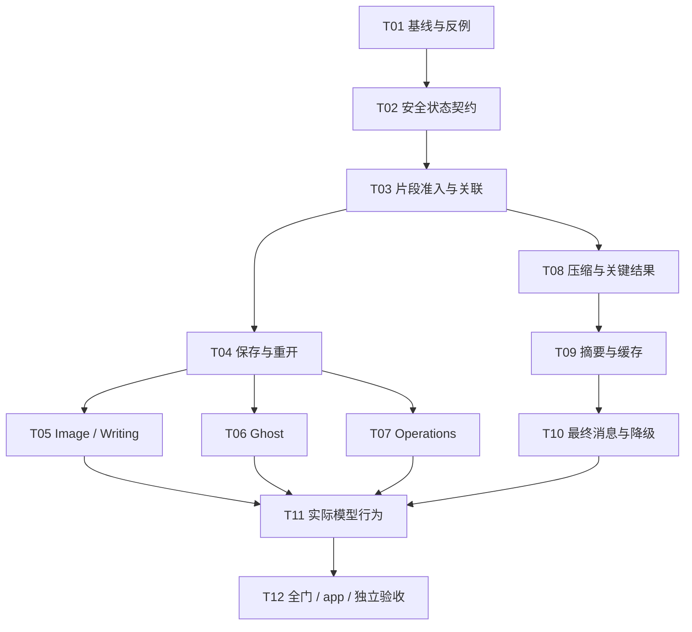

# B-157 开发与测试计划

Document status: Approved
Updated: 2026-10-03
Work item: B-157
Authority: Owner 已明确授权按 B-157 完整方案及本计划完成全部任务；实施、合成模型评测与 test-vault 验证在该范围内，Git/release 未授权。执行状态以 Active Package Tracker 为准。
Design: [B-157 Discovery 与优化方案](../context-reliability-and-action-continuity.md)
Current contracts: [Context Product Spec](../../../product/specs/pa-context-management-product-spec.md)、[Agent Runtime Product Spec](../../../product/specs/pa-agent-runtime-evolution-product-spec.md)、[DEC-043](../../../product/decisions/dec-043-agent-runtime-evolution-and-source-scope.md)

## 1. 目标、边界与完成定义

完整范围是 Image、Writing、Ghost、Operations 的执行事实在当前运行、跨轮、保存重开、状态更新、预算压缩、摘要及兼容回退中保持一致。修复发生在 context 链路；不能以新增 Host 自然语言意图分类器、命令关键词拦截或每个工具局部去重替代。

本计划承接 Brief 中的 B-157/REQ-01–06。以下 AC 是实施前的候选验收细化，不是已交付声明；既有产品与权限契约继续有效。

| 需求 | 候选 AC | 完成证据 |
| --- | --- | --- |
| B-157/REQ-01 | B-157/AC-01：已获准 accepted/ready/saved/pending/partial/unknown 与对应动作身份进入下一实际请求；accepted 不冒充完成，旧用户要求不因执行事实遗漏被单独保留为未完成任务 | C01/C05/C06 的最终消息与请求捕获；S4 三轮行为对照 |
| B-157/REQ-02 | B-157/AC-02：来源依赖 unknown、混合不可拆分、篡改、过期和撤销依赖继续拒绝；状态不能恢复被排除正文、参数、错误回显或动作授权。领域结果 unknown/outcome_unknown 在来源合法时仍应保留 | C02–C04/C14/C20 的边界反例、dispatch 前重验与实际出境 sentinel 检查 |
| B-157/REQ-03 | B-157/AC-03：确认、取消、后台完成、部分失败、核实和 Undo 后，下一轮看到最新合法阶段；新记录重开能读到有证据的状态，旧/失联记录保持未知；读取状态不触发动作 | C06/C07/C09–C15 的领域事件→历史/存储→下一请求链 |
| B-157/REQ-04 | B-157/AC-04：压缩不以工具 success 判断领域完成；关键编号、必要证据、未决阶段与身份有合法承接；三次摘要更新不复活旧目标或填补未知；必要信息放不下时明确阻止不完整发送 | C16–C24 的预算前后 final messages、摘要 payload/cache 与实际连续续答 |
| B-157/REQ-05 | B-157/AC-05：当前轮、历史、native/compat、摘要和降级消费同一获准事实表示；当前 user 原文恰好一次、观察不重复；Host-only 原对象/凭据不外发；持久化仅存允许的安全状态 | C05/C06/C18/C20/C21 的 serializer、请求、存储和 fallback 反例 |
| B-157/REQ-06 | B-157/AC-06：四域分别验证解释、明确新任务/续接、未知结果三类续问；解释不重做旧动作，明确请求仍正常，未知先核实；真实 test-vault 可见交互与模型/卡片阶段一致 | C25–C28 的真实模型轨迹、独立人工判断及 desktop/mobile simulator smoke |

非目标：新 task ledger、Agent SDK、长期 Memory/摘要存储、持久化原始 canonical/推理/日志、持久化 Undo 的笔记 before/after 正文、自动重放未知动作、跨设备同步、真实 Ghost 发布或付费生图认证、正式 vault 部署与发布。已有防重复、授权和取消保护保留，但不能拿它们代替 context 正确性。

Owner 已授权完整实施，现有 [Feature Home](../../active/context-reliability-and-action-continuity/README.md)、[Tracker](../../active/context-reliability-and-action-continuity/tracker.md) 与 source-verified SDD 承接执行。Tracker 是唯一执行状态与验证权威，本文件只保留任务和验收设计。

## 2. 当前源码、存储限制与实施输入

| 接线面 | 已验证的现有入口 | 实施关注点 |
| --- | --- | --- |
| 回执与阶段 | [result facts](../../../../src/ai-services/pa-agent-result-facts.ts)、[tool factory](../../../../src/ai-services/chat-tool-factories.ts)、[adapter](../../../../src/ai-services/capability-adapter.ts)、[chat types](../../../../src/ai-services/chat-types.ts) | resultFact 当前 Host-only；不能原样入模，空 sources 不等于已证明来源 |
| 准入与动作关联 | [runtime](../../../../src/ai-services/pa-agent-runtime.ts)、[TaskSourceRun](../../../../src/ai-services/task-source-run.ts)、[action history](../../../../src/ai-services/pa-agent-action-history.ts)、[final messages](../../../../src/ai-services/pa-agent-prompts.ts) | 当前轮与历史的 sync/async projection、call/result 关联、最终 dispatch、native/compat |
| 历史保存/重开 | [canonical history](../../../../src/ai-services/pa-agent-history.ts)、[history manager](../../../../src/chat/chat-history-manager.ts)、[store](../../../../src/chat/chat-history-store.ts)、[conversation persistence](../../../../src/chat/ConversationPersistence.ts) | manager 有意不落盘 canonical.messages，重开 messages 为空；须扩展现有历史中最小安全状态字段，而不是存整份 transcript |
| 领域最新状态 | [Chat view](../../../../src/chat/chat-view.ts)、[image service](../../../../src/chat/image-generation-service.ts)、[Writing versions](../../../../src/chat/writing-versions.ts)/[save](../../../../src/chat/writing-save-action.ts)、[Ghost service](../../../../src/ghost-publishing/service.ts)/[store](../../../../src/ghost-publishing/state-store.ts)、[Operations controller](../../../../src/ai-services/operations/operations-intent-controller.ts) | 图片下一轮已有 saved refs/version 目录；不是完全没刷新。Operations terminal/undo 主要在内存，不存在现成可重载结果 ledger |
| 压缩与摘要 | [Context directory](../../../../src/ai-services/context/PaAgentContextManager.ts)、[history plan](../../../../src/ai-services/context/PaAgentHistoryContextPlan.ts)、[projector](../../../../src/ai-services/context/PaAgentContextProjector.ts)、[summarizer](../../../../src/ai-services/context/PaAgentContextSummarizer.ts) | 领域阶段、关键结果承接、summary 实际输入与 binding/currentness 必须一致 |
| 测试与评测 | [test groups](../../../../scripts/lib/jest-test-groups.cjs)、[runtime eval](../../../../src/pa/eval/runtime-runner.ts)、[continuity runner](../../../../scripts/context-continuity-smoke-runner.js)、[live runner](../../../../scripts/pa-agent-runtime-eval-live.js) | source/tooling 分开；旧 B-128/B-149 harness 不能直接证明 B-157 的跨轮副作用行为 |

安全状态设计必须固定：领域 owner、原会话/请求/调用身份、操作 opaque ID、真实阶段、来源依赖及当前性证据、状态更新顺序。字段名与是否需要现有历史 schema 的可选扩展由 T02/T04 的设计确定；不靠格式合法的 ID、模型自述、时间戳更晚或空 sources 证明动作发生。

正文/参数与安全状态分别准入不意味着状态一律 source-free。仍依赖被撤销资料的状态应拒绝；只有独立可证明、封闭且当前获准的状态才能保留。旧事实始终是 context，不能赋予继续、确认、写入或付费权限。

Operations 后续事件应记录为真实 Host/领域状态更新，不伪造成 Agent 又调用了一次工具，也不把 stage 的历史返回改写成“当时已应用”。优先将最小结果状态写入已有 conversation/turn 存储，建立只读投影；不新增第二个操作数据库。缺持久回执的 legacy/reload 状态显示未知或已失联，不声称仍可确认。Undo 能力仍按现有内存生命周期，不因记住“已执行”而恢复 Undo 正文。

多动作 intent 的 applied/partial/Undo 按实际 action/receipt 关联保留；撤销一个 receipt 不代表整个 batch 已 undone。真实动作成功但状态落盘失败时，当前会话可使用仍可验证的内存执行事实并标明未可靠保存；重开后缺可信 receipt 则 unknown/失联，不能沿用可确认 pending，也不能为补记录再次执行。running placeholder/finalize 的旧 snapshot 不得覆盖已经记录的领域新状态。

实施前 T01 核对工作树及改动归属；其他任务的源码、文档和未跟踪文件不能覆盖、清理或未经归属核对纳入构建证据。隔离工作树不会自动带入未提交的 B-157 文档，派工时须显式带入并核对。实际初态与资源记录见 Tracker；未知测试输入身份不得复用 PASS。

## 3. 开发任务与依赖



图表示依赖，不要求并行 writer。默认一个 GLM 连续交付上下文，GPT 定义/核对设计与独立验收；各领域不是独立重复项目。

| 任务 / 阶段 | 开发工作与输出 | 依赖 | 最低验证与退出条件 |
| --- | --- | --- | --- |
| T01 / P0 基线 | 固定 B-157 REQ/AC、字段与依赖问题；核对相关 diff、测试分组和实际工具/部署目标。用现有夹具建立 F-01 的 scoped accepted 跨轮反例、F-02 的唯一编号/pending/unknown 反例和 F-03 的实际 summary payload 反例；保存目标断言失败 | 实施授权、有效 GLM preflight | 红灯是目标行为失败，不是导入/mock 故障；正常 Ghost/Writing 与范围反例基线不被削弱。禁止重新付费复现私有故障 |
| T02 / S1 状态契约 | 在既有 fact/canonical 边界定义领域 owner 的最小安全视图与严格解析/clone；补 image accepted 语义，保持 ready/saved、prepared/published、工具 outcome/领域 phase 分离。明确哪些字段留 Host、哪些依赖仍阻止复用 | T01 | C01/C02/C04；GPT 核对安全视图与 schema 设计后才接准入，不能放宽来源依赖 unknown，也不能误删来源合法的领域 unknown |
| T03 / S1 准入与关联 | 当前 transcript、跨轮历史及 sync/async source projection 按获准片段处理；独立安全状态不被未知正文整轮污染。保留原 canonical/可见历史；共享 action-history 与 final builder 保持真实 call/result 关系 | T02 | C01–C05/C08；实际下一请求保留 accepted，出境无 forbidden sentinel；重复/缺失 ID 保持歧义，当前 user 恰好一次 |
| T04 / S1 最小持久化 | 扩展现有 PersistedTurn/PersistedChatMessage 的最小安全状态/关联字段与 store clone/parse；接 serialize→store→hydrate→新请求。字段白名单、旧版本及损坏字段降级；不存完整 canonical。固定 Host 后续结果更新的存储入口供 S2 使用 | T02/T03 | C06/C07；保留同一 Memory store、重建 manager 做进程内往返；同一 IDB 数据库、新 store/manager 验证持久化。缺证据不造成功，重开零提交，原记录不被投影修改 |
| T05 / S2 Image 与 Writing | 在请求准备链合并现有 task/output/version 与 Writing version/save receipt 的合法最新状态；关联原 turn。保持历史 accepted/ready 与当前 saved/completed 区别；失败、partial 与取消如实呈现 | T04 | C09/C10/C14/C15；后台完成/保存后下一请求正确，list/read 不 submit/save；图片引用目录行为和 Writing parent 准入不回归 |
| T06 / S2 Ghost | 用现有 operation store/controller 的本地回执读取相关操作状态；普通追问不以新显式命令重复 prepare。核对当前笔记与显式目标参数契约；unknown 不升格 published；晚到旧 session 不更新新请求 | T04 | C11/C14/C15；prepared≠published；卡片确认/核实后实际模型输入刷新；无 receipt 不猜配置原因，不因状态读取 POST |
| T07 / S2 Operations | 捕获 confirm/cancel/expire/partial/Undo 的真实领域结果，在 T04 存储入口保存有限无正文状态。会话、intent 与 action/receipt 身份绑定；活跃 intent、部分撤销、已终结动作及 reload 后失联分开，保持内存 Undo 能力边界 | T04 | C12–C15；完成结果不再仅更新 UI；部分 Undo 不覆盖整个 batch；落盘失败/重开不沿用可确认 pending；竞态只反映真实胜出状态，不新增执行或 Undo 内容存储 |
| T08 / S3 压缩承接 | action DTO 与 history plan 消费安全领域阶段；取消 success→closed 近似。将“历史结果语义缩减”纳入 Manager/Projector 规划，关键结果先由获准摘录/摘要承接；pending/unknown 的最小状态确定性保留 | T03，领域映射可先用 T02 夹具 | C16/C17/C22–C24；编号仅在工具正文也能保留或明确 local_overflow；零 omittedCount 不再掩盖结果丢失 |
| T09 / S3 摘要与缓存 | summary payload 使用获准 prose+动作事实；Host binding/实际来源序列化一致。阶段/身份/来源变化使旧 summary 失效，取消与迟到结果不污染缓存；保持六字段、fit-first、无工具/写入权限 | T08；T05–T07 供当前性接线 | C18–C20/C23；真实 summary 请求含事实而非仅 Host binding；三次更新保留完成/未决/未知和最新修正，不带回排除材料 |
| T10 / S3 最终消息与降级 | 核对 native、compat、历史压缩导致 native→compat、stream→invoke 与 SDK retry 的真实最终请求；复用同一获准投影和 dispatch 前重验，无第二份观察 | T03/T09 | C05/C21/C22；完整 native 与 compat 分别可达且断言消息类型；fallback/retry 不泄露撤销内容或误报完成；不足时不静默发送 |
| T11 / S4 行为评测 | 定向适配现有 runtime/continuity harness 的 B-157 场景、真实模型传输和记录型领域端口；另输出可在已部署 test-vault 使用的受控外部端口与事件观测接线供 C27 使用。完整事实参考/候选使用同模型、同合法材料、同工具集合与受控预算；记录请求、摘要、回答和动作轨迹，独立判读 | T05–T07/T10 | C25/C26；解释无重做，明确新任务仍可执行，unknown 先核实；不得禁用工具后用零调用冒充通过；原生 adapter 缺失不能关闭 C27 |
| T12 / S4 交付验收 | 冻结最终 source/tests/fixtures/config，统一 broad gate 与部署；desktop/mobile simulator 的真实可见交互、重开、恢复临时状态；核对所有 AC/负例与文档，关闭或明确处理 findings | T11 | C27/C28、G-final；缺模型/app 或必要反例证据保持未验证。仅规划/本地验证完成，不自动 commit、收尾或发布 |

每个实现任务按 `目标反例 → 开发 → focused 验证 → review → 修复/受影响复测`。T02 的来源/字段设计与 T04 的保存契约是高风险检查点；常规实现细节不再逐项询问用户。阶段局部 PASS 只证明对应技术条件，整项完成仍要求 T12；不能用 S1 生图修复替代 S2–S4。

## 4. 领域状态与跨轮测试设计

这里定义必须保留的语义区别，不要求四域共用同一内部 enum。以真实 owner 的回执与转移为准。

| 领域 | 需要区分的阶段 | 主要转移/测试 | 不能声称或自动执行 |
| --- | --- | --- | --- |
| Image | 未接受、accepted/submitting/running、saving、completed、partial、failed、unknown、实际取消结果 | accepted→running→completed；partial/failed；同 operation 重开；来源/会话撤销期间晚到完成 | accepted 就已生成/保存；仅因找不到结果重新提交；saved ref 目录存在就代表整个任务完成 |
| Writing | 生成候选、artifact_ready/version、未保存、save prepared、partial/incomplete、save completed、unknown | 生成后普通咨询；保存后下一轮；partial 恢复后 completed；重开 selected parent 与保存状态 | ready 就已写入笔记；解释问题自动写新作品或保存；受损回执补造成功 |
| Ghost | preparing、prepared/awaiting-publish、needs_attention、checked、completed、unknown、实际取消/失败结果 | prepare 后追问；卡片发布/核实后追问；unknown/resume；显式目标与当前笔记 | prepared 就 published；核实前重发 POST；用“主机未授权目标”推断 API token 配置错误 |
| Operations | staged/approval_pending、applied、partial、cancelled/expired、按 action/receipt 的 undone/Undo failed/unknown、失联 | confirm/partial/cancel/expire→下一轮；部分与完整 Undo→下一轮；reload 无旧 pending intent；竞态结果 | 预览就已执行；一个 receipt 撤销就代表整个 batch undone；记住 applied 就有可用 Undo；确认结果被伪装成 Agent 新调用；reload 自动继续 |

### 确定性用例矩阵

先扩展现有 suite/夹具；通用来源与压缩反例参数化复用，各领域留真实接线用例，避免四份机械矩阵。表中路径均为 repo 根的 `__tests__/*.test.ts`，命令组在下一节。C 编号是计划用例，不表示当前已实现测试。

| Case / REQ | Setup → action | 必须检查的观察/断言 | 对应现有 suite / 层 |
| --- | --- | --- | --- |
| C01 / REQ-01/05 | notes/combined scope 的 create_image accepted/already_accepted → 普通下一轮 | 真实 provider input 有 accepted/taskId 与关联；不会变 unknown 或完成；同 binding submit 次数为 1 | b133-create-image-tool、chat-service；领域+请求捕获 |
| C02 / REQ-02 | unknown 正文含私有 sentinel + 独立 owner-proven 状态；另设只有 sources=[] 的对照 | sentinel/路径/参数回显不外发；只有真正独立且获准状态保留；空 sources 对照仍 unknown | task-source-run、chat-service；边界反例 |
| C03 / REQ-02 | 混合 notes/web invocation + 纯 Web result/错误回显；切换为 Web-only | 依赖随调用，不能洗白 query/路径；状态也按自身依赖拒绝；显示历史不删除 | task-source-run、task-source-runtime-admission |
| C04 / REQ-02/05 | 篡改状态阶段、ID、字段、fact/observation 一致性、owner、持久化 lineage | 不伪造成功或安全状态；未证明字段降级/拒绝；summary 不替它补全 | chat-service、chat-history-store；输入边界 |
| C05 / REQ-01/05 | 同工具不同参数/多 subrequest/乱序结果；同组重复 ID、跨组复用 ID | 只按真实关联配对；歧义 unknown；native/compat 无双份观察；当前 user 原文一次 | pa-agent-action-history、pa-agent-runtime-chat-history |
| C06 / REQ-01/03/05 | accepted/ready/pending/terminal → serialize→store→新 manager→下一请求；同一 Memory store 的进程内往返、同一 IDB 数据库的新 store/manager 重开；成功后注入状态落盘失败 | 分别标注内存往返/持久化证据；新建空 Memory store 不算恢复。写失败时内存可信事实准确，重开缺证据为未知/失联；无共享引用/新存私有原文，零重放 | chat-history-manager、chat-history-store、conversation-persistence |
| C07 / REQ-02/03 | legacy 缺字段、损坏字段/schema/关联、reload 后失联 intent | 旧记录可显示，执行结果未知；不得凭 user provenance 修复证明；不报告可确认 pending | chat-history-manager、chat-history-store、operations-service |
| C08 / REQ-01/02 | 未知原结果污染 whole-turn lineage；同轮另有合法独立事实 | 获准片段保留，原未知正文仍拒绝；不能换用最后 assistant lineage 放行原 canonical | pa-agent-history、task-source-run、chat-service |
| C09 / REQ-03 | Image running→completed/partial/failed → 下一轮及 reload | 最新阶段/输出身份正确，历史 accepted 仍为历史；list/read 不 submit；既有 saved refs 可用性不回归 | image-generation-service、chat-image-generation-store、chat-view |
| C10 / REQ-03 | Writing ready 未保存 → 保存 partial→恢复 completed → 下一轮/reload | 区分生成与落盘；选定 parent 与真实保存 receipt 关联；刷新不调用 save | writing-save-action、conversation-writing-admission、writing-context-runtime |
| C11 / REQ-03 | Ghost prepared/unknown/checked/completed → 卡片动作→下一轮/reload | 未发布不声称发布；恢复只核实现有 operation，不新增远端写；正确目标/错误原因 | ghost-publishing-service/controller/workflow、b153-prepare-ghost-post-tool |
| C12 / REQ-03 | Operations stage→confirm/applied/partial → 下一轮/reload | 最新结果确实出现在 final input；stage 的历史语义不改写；刷新不再次执行 | operations-intent-controller/review-session/agent-runtime、chat-view |
| C13 / REQ-03 | Operations cancel/expire 或多动作 apply→部分/完整 Undo→下一轮/reload | action/receipt 的已应用/已撤销/撤销失败或未知准确；部分不变全部 undone；Undo 正文不存；终结 intent 不可确认 | operations-intent-controller、operations-service、conversation-persistence |
| C14 / REQ-02/03 | dispatch 准备中撤销/取消；confirm 与 cancel、旧完成与新状态、placeholder/finalize 与结果落盘竞争 | dispatch 前重验；迟到/旧 snapshot 不覆盖新状态；同动作不重复，sync/async 准入等价 | task-source-runtime-admission、conversation-persistence、领域 controller/service |
| C15 / REQ-02/03 | 换/删会话、关闭服务→晚到完成/保存/发布结果 | 不写入新会话、不复活被删历史；订阅清理；真实已发生结果如实归原操作 | conversation-persistence、chat-view、领域 services |
| C16 / REQ-04 | 超预算历史，合成编号 CONTRACT_ID_734 仅在成功工具正文中部 | final messages 有合法承接或明确 overflow；不以 marker/omittedCount=0 当连续性成功 | pa-agent-action-history、pa-agent-context-admission/pressure |
| C17 / REQ-04 | outcome success/succeeded + accepted/pending/unknown/partial；另设真正 terminal | 未决状态与身份保留，不变 completed；terminal 所需证据仍有承接 | pa-agent-action-history、pa-agent-context |
| C18 / REQ-04/05 | assistant prose 不复述 tool fact → 发摘要请求；裸 assistant 声称成功对照 | 实际 summary payload 有获准事实；私有 resultFact 原对象不发；裸声称不变执行证明 | pa-agent-context-summarizer、pa-agent-runtime-eval |
| C19 / REQ-04 | 连续三次 append/correction 与状态更新触发摘要 | 完成事项不回到未开始；新限制取代旧限制；unknown 不被补成成功；原文/摘要覆盖不重复 | pa-agent-context-summary-projection/summarizer + C26 实际模型 |
| C20 / REQ-02/04/05 | prose 不变而 phase/ID/run/turn/来源/currentness/模型配置改变 | summary binding/缓存失效；取消晚到摘要不更新；撤销资料不借 summary 回流 | pa-agent-context-summary-projection/summarizer、stream-fallback |
| C21 / REQ-05 | 完整 native、显式 compat、压缩 native→compat、stream→invoke/SDK retry | 各路径真的到达；消息类型/实际 request 一致保留事实、user 一次；重验不丢失；回退证据单列 | pa-agent-action-history、pa-agent-stream-fallback、pa-agent-runtime-eval |
| C22 / REQ-04/05 | 摘要非法/超时/取消或必要材料仍放不下 | 保留可用安全未决状态；缺必要承接则报告 local_overflow/对应限制，不静默 dispatch；零晚到缓存 | pa-agent-context-admission/cooperative/summarizer |
| C23 / REQ-04 | 原文或完整可逆投影正好能容纳 | 全部合法事实仍在；无 history summary 调用；最终预算准确，当前 user 不变 | pa-agent-context-summary-projection/summarizer |
| C24 / REQ-04 | 巨大工具结果经过 micro/full reduction，关键错误/编号/引用唯一 | 各 reduction 路径均承接必要证据；不是只保护历史、丢当前工具；不反复摘要同材料 | pa-agent-context/continuity/pressure |
| C25 / REQ-06 | 四域三轮解释、明确新任务/续接、unknown 核实 | 同模型真实行为：解释无新副作用调用，明确请求正常，未知不盲重放；工具保持可用 | T11 适配后的实际 runtime + live provider/记录型领域端口 |
| C26 / REQ-04/06 | 同材料 reference/candidate 的预算压力与三次摘要续答 | 关键事实、最新限制、已做/未做正确；实际回答与工具轨迹独立判读；不是 schema/fit PASS | runtime/continuity harness 定向新增场景 |
| C27 / REQ-03/06 | test vault 实际确认/保存/取消/Undo/后台事件→普通追问→重开 | 实际事件→存储→下一请求可观察；卡片/本地结果/回答一致。预置 terminal store 不替代状态变化证明；Ghost desktop-only | desktop；mobile simulator 覆盖共享历史与适用入口及 Ghost 桌面限制 |
| C28 / REQ-02/05/06 | 删除测试会话、恢复 source/debug/mobile 初态、停止 runner | 订阅/计时器不残留；原临时模式恢复；无生成/发布后台任务继续；只清任务 owned fixtures | app 状态与 dev:errors；清理不是删除用户资料 |

## 5. 测试命令、阶段门与证据复用

以下是完整实施的验证命令，执行结果记录于 Tracker。source 命令不依赖 dist；改了哪个接线就选择对应组，不能每次把所有 focused 组重跑。

**G1：回执、准入、持久化。** T02–T04 使用这些已存在的 source suites；更改 cooperative/physical admission 时追加 `task-source-runtime-admission`，更改 Writing 共享准入时追加 `writing-context-runtime`。

```bash
npm test -- --runInBand --runTestsByPath __tests__/b133-create-image-tool.test.ts __tests__/b153-prepare-ghost-post-tool.test.ts __tests__/capability-registry.test.ts
npm test -- --runInBand --runTestsByPath __tests__/task-source-run.test.ts __tests__/pa-agent-history.test.ts __tests__/pa-agent-action-history.test.ts __tests__/chat-service.test.ts
npm test -- --runInBand --runTestsByPath __tests__/chat-history-manager.test.ts __tests__/chat-history-store.test.ts __tests__/conversation-persistence.test.ts
```

**G2：领域状态。** T05–T07 按实际改动选择相应行；公共 next-request 接线用 G1 的 chat-service 或 chat-view/历史测试补证明，不能只测领域对象。

```bash
npm test -- --runInBand --runTestsByPath __tests__/image-generation-service.test.ts __tests__/chat-image-generation-store.test.ts
npm test -- --runInBand --runTestsByPath __tests__/writing-save-action.test.ts __tests__/conversation-writing-admission.test.ts __tests__/writing-context-runtime.test.ts
npm test -- --runInBand --runTestsByPath __tests__/ghost-publishing-controller.test.ts __tests__/ghost-publishing-service.test.ts __tests__/ghost-publishing-workflow.test.ts
npm test -- --runInBand --runTestsByPath __tests__/operations-intent-controller.test.ts __tests__/operations-review-session.test.ts __tests__/operations-service.test.ts __tests__/operations-agent-runtime.test.ts
```

**G3：context 与 harness。** 普通 `.test.ts` 属 source，`*-script.test.ts` 属 tooling。当前 artifacts 组仅有 FTS receipt/probe suites；不能因文件名带 live/runtime 就当 artifact 或真实模型证据。

```bash
npm test -- --runInBand --runTestsByPath __tests__/pa-agent-context.test.ts __tests__/pa-agent-context-pressure.test.ts __tests__/pa-agent-context-admission.test.ts __tests__/pa-agent-context-summary-projection.test.ts __tests__/pa-agent-context-summarizer.test.ts
npm test -- --runInBand --runTestsByPath __tests__/pa-agent-action-history.test.ts __tests__/pa-agent-context-cooperative.test.ts __tests__/pa-agent-stream-fallback.test.ts __tests__/pa-agent-runtime-eval.test.ts
npm run test:tooling -- --runInBand --runTestsByPath __tests__/context-continuity-smoke-runner-script.test.ts __tests__/pa-agent-runtime-eval-runner-script.test.ts __tests__/pa-agent-runtime-eval-live-script.test.ts
```

每个变更 slice 还执行仓库 Local Validation Gate 的 type check 与 diff 检查；触及 DOM/CSS 则按 AGENTS 做社区 source scan。focused PASS、类型通过和脚本模拟输出只能关闭对应风险问题，不声明整个 B-157 验收完成。

**G-final：最终共享行为/存储/部署门。** T12 冻结相关输入，由一个执行者运行 `make deploy`：它包含 platform guards、lint、production build、完整 Jest 与 test vault 部署。再补 `npm run docs:check`、`git diff --check` 和 AGENTS 的 DOM/style/HTML source scan，并完成 C27/C28。source scan 无匹配的 exit 1 是 PASS。

若本次同一输入的 lint/build/`npm run test:all -- --runInBand` 已自然通过且 production build 当前，可按仓库条件用 `make deploy-current`；它不证明测试通过。不要把 make deploy 已覆盖的命令再重复运行。artifact 测试若确有新增 build-bound 风险，必须先 build，不能改变分组让检查漏跑。

复用证据记录：执行者/真实 provider-model、命令及测试分组、输入基线与相关 diff、自然 exit、目标 assertions、构建与实际安装身份、结果及局限。stage/commit/无关 docs 不使 runtime 证据失效；相关 source/tests/fixtures/config/依赖或模型/部署身份变化才重跑对应检查。未授权 Git 操作本计划不执行。

| 变化/风险 | 首选证据 | 扩展/重跑触发 |
| --- | --- | --- |
| 安全字段/owner/lineage/存储 | G1 + C01–C08；字段边界 diff 与 store round-trip | 来源/持久格式、clone/parser 或请求准备变更；无法归属的并发修改 |
| 领域阶段/事件竞态 | 对应 G2 + 实际下一请求、C09–C15 | event ordering、session identity、domain currentness 或 reload 行为改变 |
| 摘要/压缩/formatter/fallback | 对应 G3 + C16–C24、C26 | 预算策略、摘要源/binding、降级或实际模型改变 |
| 跨域或共享最终交付 | G-final + C25/C27/C28 | reviewer 必须修复、最终输入并发变化、构建/部署过期；先停旧 gate 再修复 |

## 6. 实际模型评测与原生 app 验收

### T11 的 harness 适配与对照条件

现有 `runtime-runner.ts` 可走真实 runtime/SDK 与固定响应并捕获请求；它的 offline 模式证明请求结构，不能证明模型理解。当前尚未把 historyBudgetChars 传入 streamTurn，压力场景需补定向选项与测试。CLI runner 的 live 模式当前返回 provider_unavailable，不可当实时入口。

B-128 continuity runner 支持 reference/deterministic/candidate 和三次增量摘要，但只允许内置 prose 场景、禁止工具执行；其中 tool-middle candidate 走 prepareTool+独立回答，deterministic 为固定剪裁。现有捕获主要保留 message.content，未完整保留 native tool_calls/tool_call_id；适配时必须捕获实际 SDK 消息角色、调用参数与关联。它不能直接证明 Manager/Agent 在工具仍可用时不会重做，亦不能作为完整 native 请求证据。

B-149 live script 固定 `B149-runtime-eval/cases.json`、fixture hash、12 个 E-* 场景、`qwen/deepseek-v4-pro` 条件与 reload marker，maxRequests 仅接受 1–50。这些是旧评测约束。复用其实际 dispatch 计数、bundle 身份和安全传输机制；B-157 使用独立 synthetic fixture 身份、显式 physical call cap 与新增场景/adapter，不改旧冻结样例让它们“通过”，不把旧 cap/120 秒诊断截止变成产品限制，也不为脚本静默切换用户模型。

适配后的 B-157 harness 必须具备：当前合法历史/存储重开输入、historyBudgetChars、reference/candidate 两臂、固定 fixture 身份、部署 bundle 身份、实际 Chat provider/model、明确 physical request 上限及 abort/cleanup；用已存在 service/能力端口的记录型 Image/Ghost/保存/Operations 执行，计数所有尝试，不做真实远端写。它必须走实际 source projection、context manager、final builder 与 SDK dispatch，不能直接拼一个正确 prompt 绕过待测链路。保持 test-only，不在生产增加“忽略权限”开关。

跨轮主夹具必须由实际 `ChatService.streamLLM` 执行前序轮次，产生真实调用/回执关联；重开场景经过 serialize/store/hydrate 后创建新 service 再续问。直接给 PaAgentRuntime 注入现成 history 只作单路径结构用例，不代替跨轮/重开验收。采集的 model payload 包含 roles、tool_calls、tool_call_id 和安全结果，禁采请求认证 header/密钥。

评测最小集为四域 × 三种续问 × 两臂，即 24 个对照 episodes；episode 是会话样例，不是物理请求数。每个样例只用达到目标状态所需的前序轮次，再提出：解释当前问题、明确新任务/既有合法续接、结果未知需要核实。将预算压力分配到其中有代表性的样例，另有一个三次摘要更新 episode；不再把所有域与所有预算/模式做笛卡尔积。实际预算值从源码与本次 fixture 投影读取，避免恰巧不触发压缩。

摘要压力保留原三次用户修正，并允许随后两次普通非写核对，使仍在完整最近turn中的修正自然进入后续摘要。核对只询问当前方案及原操作状态，复用既有容量材料，不再次提示目标答案、增加授权、清缓存或重试失败轮。须逐实际source index证明各次修正分次进入被接受摘要，独立检查至少三次有意义的摘要承接及最终最新决定；不能以binding变化、不同文本、aux数或预设覆盖前缀替代语义验证。旧失败轨迹保留，新增轮次、harness身份与物理请求数据实记录。

两臂使用同一实际 provider/model、相同材料/工具与当前用户原文，保持相同 provider 总窗口与输出预留。reference 是完整获准事实表达，在总窗口内给予足以 fit 的 history lane allocation；candidate 使用正常或受控压力的 allocation 触发实际压缩，分别记录 lane 预算、原历史大小与缩减结果。不能让两臂沿 fit-first 走相同路径后声称完成了压缩对照，也不由不同 lane 预算推断性能提升。完整 reference 无法放进总窗口时仅作为离线事实 oracle，该样例不能声明完整原文模型对照通过，应缩减为仍触发候选压缩的合成材料重新建立可达对照。任何 arm 都不关闭范围/预算保护。保存失败样例和新假设后的修订，不反复重试挑选成功回答；真实行为失败先定位请求事实/领域状态/模型解释哪层不符。

未决操作的明确续接仍遵守原确认流程：Ghost 发布和 Operations 应用通过实际确认边界；模型不能凭“继续”历史绕过卡片权限。未知样例允许合法核实，缺核实能力时如实说明，不能伪造“已检查”或再次提交。评测工具必须可调用，零真实副作用由记录型端口保证，不能先把工具移除再判零重做 PASS。

每个 episode 证据：合法 fixture 与历史身份、最新 user 原文、实际 final provider input（包括 fact/summary/fallback）、回答、工具尝试与记录型提交计数、各目标已做/未做的判断、实际请求数/可归属 usage、取消/错误/限制、独立 reviewer verdict。摘要 JSON 合法、script recorded_for_review、预算 fit 均不等于语义 PASS。基线失败是问题证据，候选须全部满足本场景约束；不承诺任意模型零错误。

2026-10-03 Owner 验收澄清：历史动作后无实际执行的继续／重做询问为非阻塞的后续体验优化，原 Writing 裁定后续明确扩展至四域。解释不重做以实际调用及副作用轨迹判定，将纯文字提示、未证实过程细节、核心执行状态错报与明确新任务的交付错误分别记录；按实际影响判断，避免过严验证和实现。不把讨论要求转为作品要求，不因内部explanation字段为空否定其它既有分离载体已交付的解释，也不豁免真实重放、未知被确定说成成功／未发生或明确成品缺失。当前观察缺行与历史效果未知须分别表达；不为区分二者另造删除竞态或强制核实流程。旧 NoOffer verdict 保留，当前分类以 Product Spec 的最新裁定为准；分类纠正复用冻结报告，不追加模型请求或为措辞堆叠新执行规则。

### C27/C28 的 test-vault 交互步骤

1. 核对 test vault 的实际路径、Obsidian/插件版本与部署身份；用 `command -v obsidian` 与当前 CLI help 核对命令。记录 source scope、debug/mobile 初态，不用 PA debug 设置推断 CLI 状态。
2. G-final 后重载 test vault 插件，打开任务 owned 的合成笔记与测试会话。CLI/deep link 用于准备状态；模型问答、菜单/卡片确认、保存与 Undo 必须真实进入界面操作。
3. Writing：生成合成作品→先问是否保存→点击保存→普通追问→重开。Operations：预览→确认/取消→普通追问→有可用回执时 Undo→追问→重开，检查新状态及实际本地结果。
4. Image/Ghost：用 T11 输出的、可在已部署 test-vault 使用的受控外部端口准备卡片，实际卡片动作/后台 service 事件发生后，观察事件→存储→下一 provider 请求的链，再普通追问与重开。store 预置 fixture 可验证读取，但不替代“状态变化后刷新”；fixture 不能直接注入最终 prompt。adapter 未可用时该链保持未验证，C27 不关闭；补最小 test-only 接线，不拿 UI 恢复截图或 C09/C11 的合成模型证据冒充原生 PASS。
5. 桌面四域分别完成“旧结果解释不重做”与“明确请求正常”的可见路径，检查卡片、回复及工具计数。Ghost 当前为 desktop-only，其发布卡片动作只在桌面验收。mobile simulator 覆盖共享历史/重开、适用的 Writing/Operations 入口和 Ghost 桌面限制提示，不要求不存在的移动发布确认流程。仅出现 iOS 专属风险时另行安排真机，不能用 simulator 声称 iPhone 通过。
6. 收集实际 next-request 状态证据、可见结果与 dev:errors；区分第三方/app 噪声。失败也恢复已知 source/debug/mobile 初态，停止 owned service/runner、取消录制器与订阅，保留必要证据，只清理本任务 synthetic fixtures。

记录型 provider/model 评测、原生本地交互与真实图片/Ghost远端成功是不同证据。B-157 验收不为观察 context 而真实付费/发布；远端认证若后来成为明确要求，再按既有权限另行处理。不能未经验证部署到 anthelion。

## 7. 分工、风险、回滚与 stop point

按 [GPT-6/GLM workflow](../../workflows/gpt6-glm-delivery-workflow.md) 派工。GPT 维护契约、任务修订、风险判断与唯一 Tracker，GLM 在有效 preflight 后以一个 bounded writer 连续实现/测试/自查并交付证据。领域/source/持久化风险适用 `reproduce → implement` 检查点，不拆成反复全仓调查。只读 reviewers 可以并行，writer 文件所有权不重叠。GLM 不接收私人 vault、密钥、敏感原始日志或其他工作区数据。

任务单沿用 [现有模板](../../templates/glm-worker-task.md)，列出本阶段完整 REQ/AC/C-case、负例、基线/dirty 所有权、必要读集、允许编辑与生成范围、交付终点、验证分工和 owned 临时资源。实际 provider/model/工具依赖与额度接管按现有流程核对，不将 GPT subagent 描述为 GLM。

| 风险 | 预防/检测 | 回滚或失败处置 |
| --- | --- | --- |
| 用状态标签洗白资料或授权 | T02 独立设计审查；C02–C04/C14/C20 出境 sentinel、实际 dispatch 负例 | 保持 fail-closed；撤销有问题的投影，不发包含未知资料的请求。不得为连续性放宽来源 |
| safe status 仍只存内存，重开复发 | T04 新 store/manager 往返，C06/C07；Operations真实事件接线 | 无回执如实 unknown/失联；保留旧资料与存储，不自动恢复 pending 或重做动作 |
| 增加字段造成不兼容或泄露 | 现有历史 optional/versioned 白名单、旧 reader/legacy/损坏记录测试；不存原始 transcript/Undo 正文 | 不做破坏性迁移；旧 reader 可忽略可选字段，恢复代码后仍保留新记录。若需不可兼容迁移先列 material deviation |
| stale/late 状态把完成又改成 pending | owner 身份、已有阶段/版本规则、会话和 dispatch 重验；C12–C15 | 忽略不属当前操作的迟到更新；结果未知时核实，不用 wall-clock 任选 winner |
| 压缩/摘要过度删减或循环调用 | C16–C24；真实 payload、预算与摘要调用计数 | 保留获准原文/最小状态；必要承接不足则明确 overflow。禁止加大次数/削弱断言制造绿色 |
| 模型仍误读，误以 Host 补门为修复 | C25/C26 比较最终输入、动作轨迹和解释 | 分层定位并回到 writer 修正；不能用禁用工具、关键词 Host classifier 或挑成功样例替代验收 |
| gate 输入被并发改动 | T12 冻结相关输入，实际 diff/构建部署核验 | 完成或停止旧 gate，标记 superseded；修复后重跑受影响项，不声称 mixed-state PASS |
| provider/app/工具不可用 | 使用准确失败命令/错误，第二次同因失败换诊断；继续独立工作 | 对应证据保持未验证，不假成功；健康长测试不按诊断截止中止；不擅自改 provider 或目标 vault |

Stop points：Owner 后续完整实施授权已覆盖本计划的开发与验证。T02/T04 若出现无法兼容现有隐私/存储/模型范围的偏离，只暂停依赖它的步骤并交 Owner 判断。代码与验收完成不自动 commit/push、关闭 package 或发布。

## 8. 本计划的核验清单

- [x] REQ-01–06 均有候选 AC、开发任务、正反用例与证据层。
- [x] 四域、当前/跨轮/重开、生命周期/竞态、压缩/摘要/native/compat/fallback 均有接线与检查。
- [x] 现有测试文件、命令分组和 harness 限制已核对；未来适配不冒充现有入口。
- [x] 状态不洗白来源、resultFact Host-only、无第二 ledger/意图分类器的边界明确。
- [x] broad gate、模型行为、desktop/mobile simulator、证据复用及清理/回滚均有退出条件。
- [x] 文档检查与新增文件 whitespace 通过；runtime、模型、app 验证仍属未来实施。

规划核验（2026-10-02）：三路只读 review 的必要修正已吸收；10 条拟执行 focused 命令中的 33 个不同测试文件存在且未被对应 source/tooling 配置排除。docs:check 与 diff/新增文件 whitespace 检查通过，4 条原有文档 advisory 未增加。勾选项只确认计划完整性，不代表 C01–C28、runtime 测试、真实模型或 app 验收已经执行。
