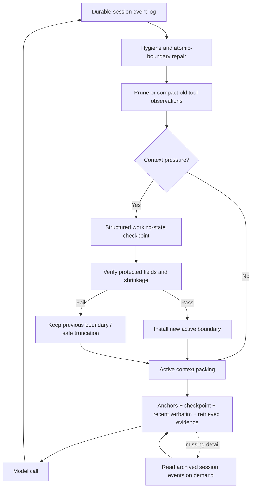
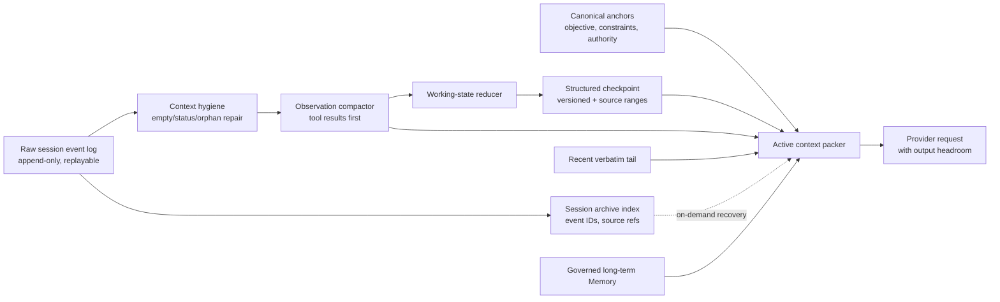

# PA Agent Context Management Research Report

Document status: Current
Delivery status: Exploring
Updated: 2026-08-25
Work item: B-128
Authority: 本报告是跨项目实现与学术研究证据，不代表已批准改变 PA runtime、产品行为、数据边界或长期 Memory 契约。

## 1. Executive Summary

本报告研究当前著名 Agent 如何处理会话历史持续增长并超过 LLM context
window 的问题，重点检查 GitHub 项目的真实实现、官方文档和近期 arXiv
研究，并结合 PA 当前代码提出可验证的演进方向。

核心结论如下：

1. **完整会话记录不应等于模型活跃上下文。** 成熟实现保留完整、可审计的
   event log，同时为每次模型调用生成更小的 active context view。
2. **优先压缩工具结果，再压缩自然语言。** 终端输出、网页、文件全文和测试日志
   通常体积最大，而且可以通过路径、URL、调用参数或事件 ID 重新获取。
3. **最可靠的组合是“不可变锚点 + 结构化 checkpoint + 最近原文 + 可回溯
   archive”。** 只有自然语言摘要、没有目标/约束/计划保护的系统，会在多次压缩后
   逐渐漂移。
4. **压缩必须理解 tool call / tool result 原子边界。** 任意删除中间消息可能制造
   orphan tool result、破坏 provider-native reasoning item，或让模型误解已经执行过的
   操作。
5. **摘要需要验证和 fail-closed。** Gemini CLI 的二次遗漏检查、OpenHands 的最小
   压缩收益门、OpenCode 的 durable checkpoint，以及 Codex 的 canonical context
   重新注入，都体现了同一原则：压缩失败时保留旧状态，不能用低质量占位内容覆盖
   真实历史。
6. **新的学术方向正在从固定摘要转向 agentic context editing。** AgentFold、ACM、
   ACON、ReSum 等工作让 Agent 学习何时压缩、压缩什么、何时外置以及何时重新读取。
7. **任务完成率不足以评价压缩。** 新研究显示，任务最终仍能完成时，Agent 可能已经
   付出了数倍的重新搜索和读取成本；评测还必须覆盖约束保留、事实漂移、重新获取成本、
   延迟和多次压缩后的累积误差。
8. **PA 当前的 micro-compaction 与 hygiene 方向正确，主要短板是 history summary。**
   当前固定保留 10 个 turn、对更老 turn 做字符级摘要；它缺少显式 objective、
   constraints、decisions、artifacts、next step、来源事件范围和摘要验证。

对 PA 的总建议不是简单增大 context window 或调高字符阈值，而是从字符截断式历史
摘要升级为：

> Immutable anchors + structured working-state checkpoint + recent verbatim tail
> + recoverable session archive.

## 2. Research Question And Scope

### 2.1 Primary Question

当 Agent session 因对话、工具调用和环境 observation 持续累积而接近或超过模型
context window 时，领先系统如何在以下目标之间取舍：

- 不超过模型输入上限；
- 为模型输出、tool schema 和系统提示保留预算；
- 保留用户目标、约束、计划和执行状态；
- 避免 tool call / result 结构损坏；
- 控制 token cost、延迟和摘要调用成本；
- 允许丢失内容被重新获取；
- 防止多次摘要导致事实和意图漂移。

### 2.2 Scope

本报告重点覆盖：

- GitHub 上可定位真实 context management 源码的著名 Agent 或 Agent 框架；
- 官方文档中明确披露、但源码不完全开放的实现；
- 2023-2026 年 arXiv 上与 agent context compression、working memory、long-term
  memory 和评测直接相关的代表论文；
- PA 当前 Context Management 实现与这些模式之间的差距。

不覆盖：

- 只讨论模型原生 long-context architecture、但不涉及 Agent session 管理的工作；
- 仅凭营销文案无法验证的内部实现；
- 将 RAG、长期 Memory 和 session compaction 混为一个问题的宽泛综述；
- 未经用户批准的 PA runtime、产品契约或持久 Memory 行为变更。

### 2.3 Evidence Grades

| Grade | Meaning | Usage in this report |
| --- | --- | --- |
| Confirmed | GitHub 源码、官方文档或 PA 当前代码可以直接定位 | 用于描述真实机制和默认值 |
| Paper-reported | 论文作者在预印本中报告的方法或实验结果 | 保留“论文报告”措辞，不视为独立复现 |
| Inference | 跨项目比较后得到的工程归纳 | 用于架构建议，不冒充项目原始设计意图 |
| Unknown | 闭源、快速演进或缺少独立验证 | 明确记录局限，不填补缺失实现 |

所有外部来源检查日期均为 2026-08-25。GitHub `main`、`master`、`dev` 分支仍可能
继续变化；涉及具体阈值时，应在实施前重新核验对应 commit。

## 3. Problem Decomposition

“Context management”至少包含三个不同问题：

| Layer | Lifetime | Source of truth | Main operation |
| --- | --- | --- | --- |
| Active context | 一次或若干次模型调用 | 从其他层投影生成 | select、trim、compact、pack |
| Session history | 当前任务或线程 | 完整事件日志 / transcript | append、checkpoint、replay、retrieve |
| Long-term memory | 跨 session | 用户原文、受治理的 Memory store | admission、consolidation、update、forget、retrieve |

这三层不能互相替代：

- 更长 active context 不是 durable session history；
- session compaction summary 不是已经验证的长期用户 Memory；
- 长期 Memory 检索也不能恢复被摘要丢失的当前任务控制状态；
- 完整 transcript 能用于恢复和审计，但不应每轮全部发送给模型。

### 3.1 Why A Larger Window Is Not Enough

即使模型窗口足够大，Agent 仍面临：

- 输入成本和首 token 延迟随上下文增长；
- 长工具输出挤占高价值目标和计划；
- 中间位置的信息更难被稳定利用；
- 输出 token、tool schema、system prompt 和 provider wrapper 仍需要预算；
- provider-native reasoning、tool result 和 cache 边界可能限制历史重组；
- 长期任务会跨越单个请求、进程甚至设备生命周期。

因此 context window 是容量上限，不是 context policy。

## 4. GitHub Project Implementation Analysis

### 4.1 OpenAI Codex

Evidence: Confirmed.

Primary sources:

- [Local compaction implementation](https://github.com/openai/codex/blob/main/codex-rs/core/src/compact.rs)
- [Remote compaction implementation](https://github.com/openai/codex/blob/main/codex-rs/core/src/compact_remote.rs)
- [Model auto-compaction threshold](https://github.com/openai/codex/blob/main/codex-rs/protocol/src/openai_models.rs)
- [OpenAI compaction guidance](https://developers.openai.com/api/docs/guides/latest-model?model=gpt-5.2)

Implementation findings:

- Codex 支持本地模型摘要与服务端 `/responses/compact` 两条路径。
- 自动压缩阈值来自模型 context window 的比例，并允许配置覆盖；源码快照中的派生逻辑
  接近窗口的 90%，同时受模型和配置约束。
- 本地压缩不是简单把全部历史变成一段摘要。它会保留一定量的真实用户消息，把摘要
  作为新的历史组成，并重新注入 canonical initial context。
- 服务端压缩结果被当作下一轮的 active history，而不是给应用解析的普通摘要文本；
  旧的 developer message、tool item、reasoning item 和重复输出会被有选择地清理。
- 压缩后重新注入当前有效的规范和环境上下文，避免旧摘要继续携带已经失效的 policy
  或工作区状态。
- 实现会提醒用户重复 compaction 可能降低准确性，必要时应开启新线程。

Engineering interpretation:

Codex 的关键价值不是某个阈值，而是把“历史压缩”和“当前权威上下文”分开。系统
指令、权限和当前环境不应依赖摘要保真，而应从 canonical source 重新投影。

### 4.2 Gemini CLI

Evidence: Confirmed.

Primary sources:

- [ChatCompressionService](https://github.com/google-gemini/gemini-cli/blob/main/packages/core/src/context/chatCompressionService.ts)
- [CLI commands](https://github.com/google-gemini/gemini-cli/blob/main/docs/reference/commands.md)

Implementation findings:

- 默认在模型 token window 使用约一半时开始考虑压缩，属于相对保守的早触发策略。
- 压缩后保留最近约 30% 的 history；旧 history 进入摘要。
- 对 recent history 内的大型 function response 设独立预算，工具输出可在进入语义摘要前
  先被截断。
- 分割点只选择安全的 user boundary，避免留下没有 response 的 function call。
- 如果此前 LLM summarization 已失败，后续可退回纯截断，避免反复支付失败的摘要调用。
- 如果已有 `<state_snapshot>`，新摘要被要求合并仍然有效的信息，而不是无条件重写。
- 摘要完成后进行第二次 verification call，专门寻找遗漏的技术细节、路径、工具结果和
  用户约束，再生成改进版 snapshot。
- 若新上下文 token 数反而大于原上下文，则拒绝本次压缩。

Engineering interpretation:

Gemini CLI 提供了当前开源实现中很实用的三道安全阀：safe boundary、summary
self-critique、no-inflation guard。其代价是压缩阶段需要额外模型调用和延迟。

### 4.3 OpenHands

Evidence: Confirmed.

Primary sources:

- [Condenser architecture](https://docs.openhands.dev/sdk/arch/condenser)
- [LLM summarizing condenser](https://github.com/OpenHands/software-agent-sdk/blob/main/openhands-sdk/openhands/sdk/context/condenser/llm_summarizing_condenser.py)

Implementation findings:

- 支持 manual、token pressure 和 event count 等不同触发原因。
- 通常保留前部少量关键事件与尾部 recent events，对中段进行摘要。
- 通过 manipulation indices 保护 tool loop 等原子事件边界。
- 可使用独立 condenser LLM；Agent 主模型仍用于 token counting 或执行。
- 摘要产生 `Condensation` 事件，记录 summary、被折叠的 event IDs、offset 和模型响应
  标识。
- 原始 append-only event log 仍然存在；active view 根据 condensation 过滤旧事件并
  插入摘要。
- 设置 minimum progress guard，若压缩后释放的空间过小，则拒绝为一次低收益压缩
  付出成本。
- 对实际 context overflow 有受限重试与逐步缩小事件表示的回退逻辑。

Engineering interpretation:

OpenHands 最值得借鉴的是 event log 与 model view 分离，以及显式记录“哪些事件被摘要
覆盖”。这让恢复、调试、评测和未来重新检索都有可靠依据。

### 4.4 OpenCode

Evidence: Confirmed on `dev`; implementation is fast-moving.

Primary sources:

- [Context compaction source](https://github.com/anomalyco/opencode/blob/dev/packages/core/src/session/compaction.ts)
- [Session v2 specification](https://github.com/anomalyco/opencode/blob/dev/specs/v2/session.md)

Implementation findings:

- 在 turn 开始前估算完整模型请求，而不仅统计聊天正文；同时为输出和安全 buffer 预留
  空间。
- 将旧工具输出 pruning 与语义 compaction 分开处理。
- `dev` 快照采用 structured checkpoint，字段倾向于覆盖 Objective、Important
  Details、Completed、Active、Blocked、Next Move 和 Relevant Files。
- active representation 由最近 token-bounded context 加 checkpoint 组成；完整
  transcript 仍作为 durable data 保存。
- provider-native assistant、reasoning 和 tool message 不跨 checkpoint 边界复用，
  降低签名、加密 reasoning 或 tool pairing 错误。
- checkpoint 写入采用 started/ended 语义；只有完成的 checkpoint 才成为 active
  boundary，失败时旧 boundary 继续有效。
- 当预算估算遗漏而出现真实 overflow 时，只允许一次 compaction-and-retry，避免在
  已有 durable output 后循环重放。

Snapshot-specific constants observed on `dev` include a 20k buffer, an 8k recent
keep budget, a bounded old tool-output representation, and a bounded summary
output. These are implementation snapshots, not stable product contracts.

Engineering interpretation:

OpenCode v2 把 compaction 当作 durable execution checkpoint，而不是普通聊天摘要。
这是 coding agent 中更接近状态机的实现，但分支演进快，不能直接复制阈值。

### 4.5 Cline

Evidence: Confirmed at documentation level; exact runtime thresholds are less
stable and are not treated as core evidence here.

Primary sources:

- [Auto Compact](https://github.com/cline/cline/blob/main/docs/features/auto-compact.mdx)
- [Task and compression commands](https://github.com/cline/cline/blob/main/docs/core-workflows/using-commands.mdx)

Implementation findings:

- 接近 context limit 时生成综合摘要，以摘要替换较旧 history。
- 文档明确要求保存技术细节、代码变更、决定和任务计划。
- 不支持自动 compact 的模型可回退到基于规则的 truncation。
- `/compact` 或 `/smol` 用于同一任务中的历史压缩。
- `/newtask` 则为新任务创建显式 handoff，提炼计划、已完成工作、文件和下一步。
- 摘要调用的成本对用户可见；checkpoint 机制允许回到先前状态。

Engineering interpretation:

Cline 区分“继续同一个 session”和“把当前任务交接给新 session”。当一个线程经历多次
压缩或任务语义已经变化时，显式 handoff 往往比继续滚动摘要更可靠。

### 4.6 Aider

Evidence: Confirmed.

Primary sources:

- [Chat history summarizer](https://github.com/Aider-AI/aider/blob/main/aider/history.py)
- [Model history budget](https://github.com/Aider-AI/aider/blob/main/aider/models.py)
- [Coder integration](https://github.com/Aider-AI/aider/blob/main/aider/coders/base_coder.py)

Implementation findings:

- Chat history 拥有独立、较小的预算，源码按模型最大输入 token 的约 `1/16` 派生，
  并设最小和最大边界。
- 超限时保留近期 tail，摘要较老 head；仍超限时允许有限深度递归摘要。
- 摘要优先尝试较弱、成本较低的模型，失败后回退到主模型。
- 摘要可以在后台准备，降低主交互路径的阻塞。
- Repo map、当前文件内容和 chat history 是不同 context channel，因此聊天本身不需要
  占据整个模型窗口。

Engineering interpretation:

Aider 的核心启示是按信息类型分配预算，而不是把所有上下文放进一个全局 token 桶。
它的摘要状态相对简单，更适合作为经典 baseline。

### 4.7 LangChain / LangGraph / DeepAgents

Evidence: Confirmed as framework capabilities.

Primary sources:

- [LangChain SummarizationMiddleware](https://github.com/langchain-ai/langchain/blob/master/libs/langchain_v1/langchain/agents/middleware/summarization.py)
- [LangGraph memory concepts](https://github.com/langchain-ai/langgraphjs/blob/main/docs/docs/concepts/memory.md)
- [DeepAgents summarization middleware](https://github.com/langchain-ai/deepagents/blob/main/libs/deepagents/deepagents/middleware/summarization.py)

Implementation findings:

- 支持按 token、模型窗口比例、消息数或组合条件触发。
- 支持 rolling summary 与 recent message window。
- 截断点会尝试避开 AI/tool message pair，防止破坏工具语义。
- middleware 可配置保留消息数、摘要输入上限和不同触发组合。
- DeepAgents 在此基础上增加 backend persistence，并可截断旧 tool-call arguments。

Known limitation:

框架的灵活性意味着安全性高度依赖配置。已有公开 issue 展示了摘要输入窗口中缺少
HumanMessage 时，middleware 可能用“内容过长无法摘要”的占位内容替换真实 checkpoint。
这不是所有版本的必然行为，但证明 summary failure 必须 fail-closed。

Engineering interpretation:

LangChain/LangGraph 更适合作为机制库，而不是一套已经替用户决定好的 context policy。

### 4.8 AutoGen

Evidence: Confirmed; the token-limited context is marked experimental.

Primary sources:

- [Token-limited model context](https://github.com/microsoft/autogen/blob/main/python/packages/autogen-core/src/autogen_core/model_context/_token_limited_chat_completion_context.py)
- [Buffered model context](https://github.com/microsoft/autogen/blob/main/python/packages/autogen-core/src/autogen_core/model_context/_buffered_chat_completion_context.py)
- [AssistantAgent context configuration](https://github.com/microsoft/autogen/blob/main/python/packages/autogen-agentchat/src/autogen_agentchat/agents/_assistant_agent.py)

Implementation findings:

- Buffered context 提供最近 N 条消息视图。
- Token-limited context 会反复从中间移除消息直至满足 token budget。
- 实现会处理开头孤立的 function execution result，但当前策略并不等价于完整的
  tool-loop atomicity。
- 框架要求调用方主动选择和配置 bounded model context，没有一套强制语义摘要策略。

Engineering interpretation:

AutoGen 是有价值的对照组：预算视图容易实现，但在中间删除消息时保持 tool pair、
计划和因果链完整，比简单 token counting 困难得多。

### 4.9 SWE-agent

Evidence: Confirmed.

Primary sources:

- [History processors](https://github.com/SWE-agent/SWE-agent/blob/main/sweagent/agent/history_processors.py)
- [Agent observation handling](https://github.com/SWE-agent/SWE-agent/blob/main/sweagent/agent/agents.py)

Implementation findings:

- `LastNObservations` 保留最近 N 个 environment observation，将更早输出替换成省略
  标记。
- 可按 tag 保留或移除某类历史。
- 对超长单次 observation，提示模型使用 head、tail、grep 或文件重定向等方法缩小
  当前结果。
- 原始 SWE-agent 方法常以最近少量 observation 为主，适合 shell 输出密集的 coding
  环境。

Engineering interpretation:

Selective observation elision 对可重复读取的终端输出很有效，但不能单独承担用户决定、
产品约束和跨阶段计划的长期保存。

### 4.10 Closed-source Industry Reference

Claude Code 官方环境变量文档公开了
[`CLAUDE_CODE_AUTO_COMPACT_WINDOW`](https://code.claude.com/docs/en/env-vars)，产品也提供
`/compact` 语义；但完整 compaction implementation 不在开放源码中。本报告因此只把它
作为行业存在性参照，不使用 GitHub issue 中猜测的阈值描述其内部机制。

## 5. Cross-project Comparison

| Project | Trigger | First reduction step | Semantic summary | Recent verbatim tail | Full source retained | Verification / fail-safe | Explicit handoff |
| --- | --- | --- | --- | --- | --- | --- | --- |
| Codex | model-aware token threshold | history/item filtering | local or remote compaction | yes | thread semantics retained | canonical context reinjection; warning on repeats | new thread recommended when needed |
| Gemini CLI | early token ratio | tool/function response trimming | state snapshot | yes | history remains in application state | second-pass omission check; reject inflation | manual command boundary |
| OpenHands | token/event/manual | boundary-aware event selection | condensation event | yes | append-only event log | minimum progress; bounded retry | possible through event/checkpoint flow |
| OpenCode v2 | pre-turn request estimate | old tool-output pruning | structured checkpoint | yes | durable transcript | atomic completed boundary; one overflow retry | checkpoint-oriented |
| Cline | near context limit/manual | rule truncation when needed | comprehensive summary | yes | task/checkpoint dependent | fallback strategy | `/newtask` distilled handoff |
| Aider | separate history budget | old-head selection | recursive chat summary | yes | conversation state retained | weak-to-main model fallback | new chat/task workflow |
| LangGraph | configurable | trim/remove middleware | rolling summary | configurable | checkpoint dependent | application must define failure policy | application-defined |
| AutoGen | message/token limit | message removal | no default semantic summary | configurable | source context object retained | limited pair cleanup | application-defined |
| SWE-agent | observation count/tag | old observation elision | no | yes | underlying environment/files retain evidence | deterministic placeholder | application-defined |

### 5.1 Dominant Engineering Pattern



### 5.2 Common Rules Emerging From Implementations

1. Durable log and active prompt view are separate data structures.
2. Tool observations have independent budgets and are compacted before user conversation.
3. Recent raw messages remain verbatim to preserve local conversational continuity.
4. Old history becomes task state, not a prose transcript recap.
5. Objective, constraints, decisions, artifacts and next step receive explicit protection.
6. Tool calls, results and provider-native items are treated as atomic or boundary-sensitive.
7. Trigger calculation includes output headroom, tool definitions and non-chat prompt sections.
8. Summary replacement is transactional: incomplete/failed compaction cannot become current state.
9. Content remains re-readable through event IDs, paths, URLs or external session memory.
10. Repeated compaction eventually leads to a fresh-task handoff rather than infinite summary nesting.

## 6. Academic Research Landscape

### 6.1 Unified Context Engineering

[A Survey of Context Engineering for Large Language Models](https://arxiv.org/abs/2507.13334)
将领域划分为 context retrieval/generation、context processing、context management 以及
RAG、memory、tool reasoning、multi-agent 等系统集成层。它提供了一个重要边界：prompt
engineering 只是在写指令，context engineering 则是在整个推理生命周期中选择、转换、
组织和管理信息。

本报告据此把 session compaction 看作 context management，把从 vault 或 archive 重新
获取证据看作 retrieval，不把两者混成单一 summary 算法。

### 6.2 Learned And Agentic Context Editing

#### ACON

[ACON: Optimizing Context Compression for Long-horizon LLM Agents](https://arxiv.org/abs/2510.00615)

Paper-reported findings:

- 同时压缩 environment observations 与 interaction history；
- 从“完整上下文成功、压缩上下文失败”的 paired trajectories 中分析失败原因并优化
  自然语言压缩 guideline；
- 将优化后的 compressor 蒸馏到更小模型，降低额外模块成本；
- 论文报告在多个 benchmark 上降低 26%-54% peak tokens，并在蒸馏设置下保留超过
  95% 的原任务准确率。

Research direction: 不再手写静态摘要 prompt，而是从压缩失败案例学习 retention policy。

#### AgentFold

[AgentFold: Long-Horizon Web Agents with Proactive Context Management](https://arxiv.org/abs/2510.24699)

Paper-reported findings:

- 将 context 视为需要主动塑形的 cognitive workspace；
- Agent 学习何时执行 folding；
- granular condensation 保存细粒度重要信息，deep consolidation 折叠完整子任务；
- 目标是避免每一步全量摘要的不可逆信息损失。

Research direction: 压缩粒度由任务阶段和信息价值决定，而不是固定周期。

#### ReSum

[ReSum: Unlocking Long-Horizon Search Intelligence via Context Summarization](https://arxiv.org/abs/2509.13313)

Paper-reported findings:

- 周期性把增长中的 search trajectory 转为 compact reasoning state；
- ReSum-GRPO 训练模型适应 summary-conditioned continuation；
- 论文报告 ReSum 相对 ReAct 平均提升 4.5 个百分点，训练后最高再提升 8.2 个百分点。

Research direction: 摘要不仅是推理前处理，Agent 本身也需要训练适应“从 checkpoint
恢复推理”。

#### ACM

[ACM: Agentic Context Management for Long Horizon Tasks](https://arxiv.org/abs/2607.23809)

Paper-reported findings:

- 为 Agent 提供专用 context editing tools；
- Agent 自主决定何时压缩，把移出的内容放入 external memory，并在需要时查询；
- 使用 post-training demonstrations 教模型管理上下文；
- 论文称之为 lossless context management，其“无损”来自可恢复外部存储，而不是
  自然语言摘要本身无损。

Research direction: context management 成为 Agent tool-use policy。

### 6.3 Hierarchical Context And Information Isolation

#### MemGPT

[MemGPT: Towards LLMs as Operating Systems](https://arxiv.org/abs/2310.08560)
以操作系统 memory hierarchy 和 paging 类比有限 context window，把 context 内外的信息
迁移显式化，是后续分层 Agent memory 的基础工作。

#### HyMem

[HyMem: Hierarchical Context Management for Long-Horizon Agents via Information Isolation](https://arxiv.org/abs/2608.15703)

Paper-reported findings:

- 将 high-level planning、isolated subtask reasoning 和 memory summaries 按功能分层；
- 子任务的复杂中间推理不持续污染主 planning context；
- structured summary 负责跨 refresh 保存任务进度；
- 论文报告在 GAIA 和 BrowseComp-plus 上优于其最强 baseline。

Research direction: context isolation 可能比对单一扁平 history 做更激进的压缩更重要。

#### MemoryOS

[MemoryOS: An Operating System for Personalized AI](https://arxiv.org/abs/2506.06326)
探索 short-term、mid-term、long-term 分层以及 dialogue-chain、segment/page 等组织方式。
其价值更多在跨 session memory architecture，不应直接当作当前任务 compactor。

### 6.4 Persistent And Structured Long-term Memory

#### Mem0

[Mem0: Building Production-Ready AI Agents with Scalable Long-Term Memory](https://arxiv.org/abs/2504.19413)
动态提取、合并和检索会话中的显著信息，并探索 graph memory。它解决多 session
personal memory，与 session overflow 有关联但不是同一层问题。

#### A-MEM

[A-MEM: Agentic Memory for LLM Agents](https://arxiv.org/abs/2502.12110)
借鉴 Zettelkasten，以可演化属性和动态链接的 memory notes 组织长期知识。

#### Zep Temporal Knowledge Graph

[Zep: A Temporal Knowledge Graph Architecture for Agent Memory](https://arxiv.org/abs/2501.13956)
通过时间和历史关系表达事实变化，适合处理“旧事实仍是历史证据、但不再是当前事实”的
场景。

Research interpretation:

这些工作共同说明长期 Memory 应保存来源、时间、作用域和更新关系；不能把一次 session
摘要直接提升成永久用户事实。

### 6.5 Protecting Plans And Constraints

[Plans Don't Persist: Why Context Management Is Load Bearing for LLM Agents](https://arxiv.org/abs/2606.22953)
提供了对 plan eviction 的直接压力测试。论文报告 naive plan eviction 使 ALFWorld 成功率
下降 34.7 个百分点，并指出仅重新呈现 plan 仍不足以完全恢复。

Implications:

- 模型不会可靠地把早期计划“内化”为跨步骤持久状态；
- objective、plan 和 constraints 必须主动保留或重新注入；
- 仅有计划也不够，current progress、environment changes、失败尝试和 next step 需要同步；
- 不能假设 reasoning model 在一次看过要求后会始终记住。

### 6.6 Summary Drift And Faulty Consolidation

[Useful Memories Become Faulty When Continuously Updated by LLMs](https://arxiv.org/abs/2605.12978)
研究反复 consolidation 的错误累积。论文报告 memory utility 可能先上升后下降，甚至低于
没有 memory 的 baseline；保留 raw episodes 的控制组具有竞争力。

Implications:

- 不要每轮自动重写 summary；
- 不能只保存 summary-of-summary；
- raw episodes 必须是一等证据；
- consolidation 需要明确 gate、版本和来源；
- 从原始事件重新提取重要字段，通常比从旧摘要继续改写更可靠。

### 6.7 Serving Efficiency And Compaction Latency

[Parallel Context Compaction for Long-Horizon LLM Agent Serving](https://arxiv.org/abs/2605.23296)
研究将大历史分块并行压缩，以减少同步摘要造成的数十秒阻塞，并更可控地限制每块摘要
体积。论文也强调 LLM summarization 具有随机性和不可预测的保留量。

Implications:

- compaction latency 是用户体验指标，不只是后台实现细节；
- 大型 session 可按事件边界并行提取局部事实，再由确定性 reducer 组合结构化状态；
- 并行摘要仍是有损操作，不能替代 source tracking 和 verification。

### 6.8 Evaluation Beyond Task Completion

#### Hidden Reacquisition Cost

[What Does Context Compression Cost an Agent?](https://arxiv.org/abs/2608.16370)
提出重新获取成本评测。论文的受控实验显示，在部分环境中，任务完成率变化不显著时，
retrieval calls 仍可能大幅增加；但这一现象依赖环境，并非所有任务都会出现。

#### Long-term Memory Benchmarks

- [LongMemEval](https://arxiv.org/abs/2410.10813)：覆盖信息抽取、多 session reasoning、
  temporal reasoning、knowledge update 和 abstention。
- [LoCoMo](https://arxiv.org/abs/2402.17753)：长对话、多 session、时间与因果记忆。
- [LoCoMo-Plus](https://arxiv.org/abs/2602.10715)：进一步关注 latent constraints 和
  cue-trigger semantic disconnect。

Evaluation interpretation:

Context compaction benchmark 应同时包含：

- continuation task success；
- protected objective/constraint recall；
- current-plan and next-step accuracy；
- source and artifact path recall；
- tool-call/result structural validity；
- factual precision and unsupported additions；
- compression ratio and compact latency；
- re-read、search、retrieval 和重复 tool-call 数量；
- repeated-compaction drift；
- ability to abstain or reopen source evidence。

## 7. Research Trends And Open Problems

### 7.1 From Fixed Triggers To Learned Policies

当前工程系统普遍使用 50%、70%、90% 或固定消息数等 heuristic。研究正在探索让模型
根据任务阶段、未来需要和信息可恢复性决定何时压缩。开放问题是：模型本身可能无法
准确判断未来重要性，因此仍需要 deterministic protected fields 和 hard budget guard。

### 7.2 From Prose Summaries To Typed State

自然语言段落容易遗漏字段、混淆事实与推断，并在多次重写中漂移。趋势是把 checkpoint
表示为 typed task state，同时保留一个供模型阅读的自然语言投影。

### 7.3 From Lossy Compression To Recoverable Eviction

严格意义上的自然语言摘要不可能无损。更可信的方向是：

- active context 中保留索引和关键事实；
- 原始事件移到可查询 archive；
- 缺失细节按需重新读取；
- 对重新获取行为和成本进行观测。

### 7.4 From Single Flat Context To Functional Isolation

Planning、subtask exploration、tool observations、retrieved evidence、long-term memory 和
user profile 有不同生命周期。将其隔离，可以减少一种信息挤占另一种信息，也降低局部
错误被提升成全局状态的风险。

### 7.5 From One-shot Accuracy To Lifecycle Reliability

未来评测需要跨多个 compaction cycle，观测摘要漂移、过时事实、计划偏移、权限边界和
恢复行为。单次 long-context QA 无法代表真实 Agent session。

### 7.6 Security And Authority Preservation

当前论文普遍更关注任务性能，对 prompt injection、tool output authority、用户授权和
隐私边界关注不足。对实际产品而言，摘要不能把“不可信上下文中的句子”提升成 system
instruction，也不能因为旧摘要而延续已经撤销的权限。

## 8. PA Current Implementation Assessment

Evidence: Confirmed from current repository source on 2026-08-25.

Primary sources:

- [`PaAgentContextManager`](../../../src/ai-services/context/PaAgentContextManager.ts)
- [`PaAgentContextCompactor`](../../../src/ai-services/context/PaAgentContextCompactor.ts)
- [`PaAgentContextProjector`](../../../src/ai-services/context/PaAgentContextProjector.ts)
- [`PaAgentContextHygiene`](../../../src/ai-services/context/PaAgentContextHygiene.ts)
- [`PaAgentContextBudget`](../../../src/ai-services/context/PaAgentContextBudget.ts)
- [PA Agent architecture](../../architecture/pa-agent-architecture-plan.md)
- [Context Pager product spec](../../product/specs/pa-context-pager-product-spec.md)

### 8.1 Current Strengths

| Current behavior | Assessment |
| --- | --- |
| Manager composes Projector, Hygiene, Compactor and Budget | 模块边界清晰，便于独立演进和测试 |
| Micro-compaction prioritizes old tool results | 与 Gemini、OpenCode、SWE-agent 的高价值模式一致 |
| Default trigger `0.7`, target `0.55` | 为 observation 留出回旋空间，不等到完全溢出 |
| Protects two recent user turns | 保留局部交互连续性 |
| Compacted tool result retains source metadata and up to four paths | 支持来源追溯，比无信息 `[truncated]` 更可信 |
| Projector creates a prompt-only history view | 原始 chat history 不被 projection 直接修改 |
| Hygiene removes empty/status-only/orphaned items | 降低无价值 token 和 tool pairing 污染 |
| Provider usage is captured diagnostically | 已具备未来校准字符估算的观测入口 |
| Context Pager separates user receipt from Replay Trace | 产品层已有“receipt vs ledger”的正确契约 |

### 8.2 Current History-compaction Behavior

Current source behavior:

- `MAX_CHAT_HISTORY_CHARS = 60_000`；
- context manager 的默认 prompt 观测上限为 `120_000` chars；
- tool observation 默认上限为 `64_000` chars；
- `estimateTokensFromChars` 使用约 `chars / 4`；
- chat history 固定保留最近 10 个 turn；
- 更老 turn 被确定性转写为 `User` 最多约 160 字符、`Assistant` 最多约 220 字符；
- compaction summary 默认最多 2400 字符；
- 若投影仍超过 history budget，会继续移除较早 recent messages，最后再缩短 summary。

### 8.3 Gaps Relative To Leading Implementations

| Gap | Risk | Comparative evidence |
| --- | --- | --- |
| 固定 10-turn boundary，不看真实 token pressure | 很短但关键的历史和很长但低价值的历史被同等处理 | Codex/Gemini/OpenCode 使用模型或请求预算 |
| 160/220 字符级 turn 摘要 | 决定、约束、路径、错误和下一步可能被截断 | OpenCode structured checkpoint；Cline handoff |
| summary 总长 2400 且按拼接结果截断 | 越接近 recent boundary 的旧决定可能完全落在截断之外 | Gemini omission verification |
| 缺少 immutable objective / constraints | 多次压缩后任务意图可能漂移 | Plans Don't Persist；Codex canonical reinjection |
| 缺少 summary source event ranges | 无法精确回溯“这句话总结自哪些 turn” | OpenHands forgotten event IDs |
| 缺少 summary verifier 和 minimum shrink guard | 低质量或低收益摘要仍可能成为 active state | Gemini/OpenHands |
| 缺少 session-history on-demand retrieval | 被压缩细节只能依赖用户重述或重新做工具调用 | ACM recoverable external memory |
| `maxPromptChars` 主要用于 snapshot/reporting | 没有形成覆盖全部 prompt section 的最终 hard admission gate | OpenCode pre-turn full-request estimate |
| Provider usage 未闭环校准估算和触发 | `chars / 4` 对不同语言、模型和 payload 不稳定 | Model-aware budgets in Codex/Gemini |
| Session summary 与 long-term Memory 的边界依赖约定 | 未来扩展时存在把临时工作状态固化成用户事实的风险 | Faulty consolidation research |

These are research-informed gaps, not authorization to change current behavior.

## 9. Proposed PA Target Architecture

Status: Inference / candidate option. Not approved.

### 9.1 Data Layers



### 9.2 Immutable Anchors

Suggested fields:

```text
originalObjective
explicitUserConstraints
authorityAndApprovalBoundaries
acceptanceCriteria
currentScope
canonicalRuntimeInstructionsRef
```

Rules:

- anchors 不从旧摘要继承，始终从当前 canonical source 投影；
- 用户修改目标或约束时写入新的版本，不静默覆盖历史；
- tool output、Memory 或 Pagelet evidence 不能提升为 authority；
- compactor 可以缩短展示形式，但不能删除字段语义。

### 9.3 Structured Working-state Checkpoint

Suggested shape:

```text
checkpointId
sourceEventStart / sourceEventEnd
objectiveStatus
confirmedFacts[]
decisions[]
completedWork[]
activeWork[]
failedAttempts[]
blockers[]
nextStep
relevantArtifacts[]
openQuestions[]
retrievalHandles[]
createdAt
compactorVersion
```

Each item should distinguish:

- user statement；
- tool-observed fact；
- Agent inference；
- approved decision；
- unresolved hypothesis。

### 9.4 Tool-result Compaction Contract

Instead of a generic placeholder, a compacted observation should retain:

```text
toolName
callId
inputDigest
keyFacts
sourceRefs
artifactPaths
exitStatus
originalEventId
originalLength
reReadRequired
```

Not every result needs LLM summarization. Deterministic extraction is preferable for:

- command exit status；
- changed file list；
- test pass/fail counts；
- file paths and line references；
- URL and document title；
- structured tool result metadata。

### 9.5 Budget Policy

Use a model-aware request budget:

```text
inputBudget
= modelContextWindow
- reservedOutputTokens
- providerSafetyMargin
```

Within the input budget, track separate lanes:

```text
system and canonical instructions
tool definitions
immutable anchors
working-state checkpoint
recent verbatim dialogue
tool observations
retrieved vault/session evidence
governed long-term Memory
```

Do not adopt Gemini's 50% or Codex's approximately 90% threshold as a universal PA
default. Use local eval and provider usage telemetry to choose soft and hard watermarks.

### 9.6 Transactional Compaction

Recommended lifecycle:

1. Emit `compaction_started` with old active boundary.
2. Select a safe event range outside protected recent turns.
3. Build deterministic candidate facts and references.
4. Optionally call an LLM to produce typed checkpoint fields.
5. Verify protected anchors, artifact paths, decisions and source coverage.
6. Measure shrinkage and token headroom.
7. If verification fails or shrinkage is negligible, keep old boundary.
8. If successful, emit `compaction_completed` and atomically install new boundary.
9. Preserve the old events in session archive.
10. Expose only compact product-language context information through Context Pager.

### 9.7 Recovery Tools

Candidate internal tools:

```text
search_session_history(query, beforeEventId?, afterEventId?)
read_session_events(eventIds)
read_compaction_sources(checkpointId, field?)
```

These tools should be read-only and scoped to the current session. Their results should
enter the same observation budget and carry provenance.

## 10. Recommended Delivery Sequence

Status: Candidate plan only; no implementation authority.

### Phase 1: Deterministic Reliability Foundation

- Add explicit immutable anchor representation.
- Replace fixed-turn-only decision logic with final request budget accounting.
- Preserve tool call/result atomic units.
- Enrich compacted tool placeholders with structured metadata.
- Record checkpoint source ranges and compression metrics.
- Add long-session deterministic tests before introducing a summarizer model.

Expected value: closes the highest-risk gaps without additional AI calls or provider cost.

### Phase 2: Structured LLM Compactor With Verification

- Generate typed working-state checkpoints only under pressure or task boundary.
- Run omission verification for protected fields.
- Reject inflation, insufficient shrinkage and unsupported facts.
- Preserve previous checkpoint until the new checkpoint completes.
- Compare same-model, weak-model and deterministic-only strategies.

Expected value: higher semantic retention than character truncation, with controlled cost.

### Phase 3: Recoverable Session Archive

- Index archived event metadata and source handles.
- Add on-demand history search/read tools.
- Track reacquisition rate and repeated tool calls.
- Support explicit new-session handoff after repeated compactions.

Expected value: reduce irreversible loss and allow long-running tasks to exceed a single window.

### Phase 4: Learned Or Adaptive Policy

- Use real eval failures to tune retention rules.
- Calibrate trigger thresholds per model/provider/language.
- Explore task-boundary and subtask isolation inspired by AgentFold/HyMem.
- Consider a learned compressor only after deterministic contracts and evaluation exist.

Expected value: optimize efficiency after reliability and observability are established.

## 11. Evaluation Plan

### 11.1 Core Metrics

| Dimension | Metric |
| --- | --- |
| Capacity | pre/post tokens, peak tokens, headroom, compression ratio |
| Correctness | continuation success, factual precision, unsupported additions |
| Control state | objective, constraint, approval boundary, AC and next-step recall |
| Structure | orphan tool calls/results, invalid provider items, replay consistency |
| Recovery | re-read calls, repeated searches, repeated tool calls, recovered source precision |
| Stability | drift after 1/3/5 compactions, summary version disagreement |
| Efficiency | compact latency, extra model calls, prompt/output tokens, cost |
| Trust | source coverage, Context Pager accuracy, ability to inspect original evidence |

### 11.2 Required Test Scenarios

1. **Long coding task:** plan established early, many tests and file reads later.
2. **Constraint retention:** user prohibits a file or operation in the first turn.
3. **Permission change:** authorization is granted, narrowed and later revoked.
4. **Repeated failure:** several similar tool errors must not be summarized as success.
5. **Large observation burst:** one test/log output nearly consumes the observation budget.
6. **Tool pair boundary:** function call and result sit exactly across a proposed cutoff.
7. **Conflicting facts:** later tool evidence supersedes an older assumption.
8. **Artifact recovery:** compressed history contains a path needed twenty turns later.
9. **Multiple compactions:** same task crosses at least five compaction boundaries.
10. **Chinese-heavy session:** token estimation differs materially from `chars / 4`.
11. **Provider-native items:** encrypted/reasoning/tool IDs must remain valid after checkpoint.
12. **Summary failure:** timeout, refusal, malformed output and inflated summary all fail closed.

### 11.3 Baselines

Compare at least:

- full context until hard overflow；
- oldest-message dropping；
- current PA fixed-turn character summary；
- tool-pruning only；
- structured deterministic checkpoint；
- structured LLM checkpoint without verifier；
- structured LLM checkpoint with verifier and recovery tools。

## 12. Anti-patterns

Avoid the following designs:

1. Blindly drop the oldest N messages regardless of semantics.
2. Summarize after every turn.
3. Delete source transcript after generating a summary.
4. Let a summary override current system policy or user constraints.
5. Split tool call and tool result across a compaction boundary.
6. Treat `[truncated]` as sufficient provenance.
7. Use task completion as the only metric.
8. Promote session checkpoint directly into long-term user Memory.
9. Keep recursively summarizing summaries without returning to raw events.
10. Retry overflow indefinitely after tool side effects or durable output.
11. Expose token and internal context jargon as the default PA product surface.
12. Use a single threshold for all models, languages and task types without calibration.

## 13. Product Fit With PA North Star

The research supports PA's product constraints:

- **Less interruption:** compaction should normally remain internal and automatic.
- **More source-backed evidence:** every summary field should be traceable to events, paths or
  notes.
- **Preserve original thinking:** raw user messages remain intact and recoverable.
- **Earned trust:** compaction may change the model view but cannot invent authority or persist
  long-term Memory without the appropriate contract.
- **Quiet surface:** ordinary users see compact language such as “older conversation was
  summarized” and can inspect sources through Context Pager; token dashboards remain diagnostic.

User-facing interruption is justified only when:

- repeated compactions make continuation confidence low；
- recovery cannot reconstruct a required decision or constraint；
- starting a fresh task with an explicit handoff is safer；
- a costly provider summarization or broad data transfer needs disclosure under current policy。

## 14. Options

| Option | User value | Cost / risk | North Star fit |
| --- | --- | --- | --- |
| A. Keep current implementation | No new complexity or provider cost | Long sessions retain current silent-loss risks | Medium for short sessions; weak for long-lived trust |
| B. Deterministic reliability foundation | Protects authority and improves observability without new LLM call | Requires state schema, migration-free runtime integration and tests | High |
| C. Verified structured compactor | Better semantic retention and task continuity | Additional latency/cost; verifier can still miss errors | High if source-backed and quiet |
| D. Recoverable archive + adaptive policy | Supports very long tasks with lower irreversible loss | Highest complexity; needs retrieval and lifecycle governance | High long-term, but should follow B/C |

Recommended sequence: **B → C → D**, with independent approval and validation for each phase.

## 15. Open Questions

1. Should B-128 become a formal PA product/runtime evolution, or remain research evidence only?
2. Which fields are truly immutable anchors versus versioned working state?
3. Should the first implementation be deterministic-only, or include an optional LLM compactor?
4. What provider/data disclosure applies when older chat and tool text are sent to a compactor model?
5. Where should raw session events live, for how long, and under which deletion/privacy policy?
6. Should session archive retrieval be automatic, or visible through Context Pager when used?
7. At what confidence or compaction count should PA recommend a fresh chat with explicit handoff?
8. Which model/language/task combinations define the initial budget calibration matrix?

## 16. Decision Needed

- Decision: 是否把本报告的结论提升为 PA Context Management runtime / product contract 演进。
- Decision authority: User / product maintainer.
- Trigger: 用户明确要求设计、规划或实现 B-128；在此之前保持 research-only。
- If accepted: 先确认 material product/data/privacy boundaries，再创建或更新 Decision、
  Product Spec、source-verified SDD 和 Tracker。
- If deferred: 保留 B-128 与本 Discovery，记录明确重启条件。
- If rejected: 将独有研究证据压缩归档或在被当前 authority 吸收后删除。

## 17. Source Index

### 17.1 Project Implementations

- OpenAI Codex: [local](https://github.com/openai/codex/blob/main/codex-rs/core/src/compact.rs),
  [remote](https://github.com/openai/codex/blob/main/codex-rs/core/src/compact_remote.rs),
  [threshold](https://github.com/openai/codex/blob/main/codex-rs/protocol/src/openai_models.rs)
- OpenAI Docs: [Compaction guidance](https://developers.openai.com/api/docs/guides/latest-model?model=gpt-5.2)
- Gemini CLI: [ChatCompressionService](https://github.com/google-gemini/gemini-cli/blob/main/packages/core/src/context/chatCompressionService.ts)
- OpenHands: [Condenser source](https://github.com/OpenHands/software-agent-sdk/blob/main/openhands-sdk/openhands/sdk/context/condenser/llm_summarizing_condenser.py)
- OpenCode: [Compaction source](https://github.com/anomalyco/opencode/blob/dev/packages/core/src/session/compaction.ts),
  [v2 spec](https://github.com/anomalyco/opencode/blob/dev/specs/v2/session.md)
- Cline: [Auto Compact](https://github.com/cline/cline/blob/main/docs/features/auto-compact.mdx)
- Aider: [History summarizer](https://github.com/Aider-AI/aider/blob/main/aider/history.py)
- LangChain: [SummarizationMiddleware](https://github.com/langchain-ai/langchain/blob/master/libs/langchain_v1/langchain/agents/middleware/summarization.py)
- AutoGen: [Token-limited context](https://github.com/microsoft/autogen/blob/main/python/packages/autogen-core/src/autogen_core/model_context/_token_limited_chat_completion_context.py)
- SWE-agent: [History processors](https://github.com/SWE-agent/SWE-agent/blob/main/sweagent/agent/history_processors.py)

### 17.2 Academic Papers

- [A Survey of Context Engineering for Large Language Models](https://arxiv.org/abs/2507.13334)
- [MemGPT](https://arxiv.org/abs/2310.08560)
- [ACON](https://arxiv.org/abs/2510.00615)
- [AgentFold](https://arxiv.org/abs/2510.24699)
- [ReSum](https://arxiv.org/abs/2509.13313)
- [ACM](https://arxiv.org/abs/2607.23809)
- [HyMem](https://arxiv.org/abs/2608.15703)
- [Parallel Context Compaction](https://arxiv.org/abs/2605.23296)
- [Plans Don't Persist](https://arxiv.org/abs/2606.22953)
- [What Does Context Compression Cost an Agent?](https://arxiv.org/abs/2608.16370)
- [Useful Memories Become Faulty When Continuously Updated by LLMs](https://arxiv.org/abs/2605.12978)
- [Mem0](https://arxiv.org/abs/2504.19413)
- [A-MEM](https://arxiv.org/abs/2502.12110)
- [Zep temporal knowledge graph](https://arxiv.org/abs/2501.13956)
- [MemoryOS](https://arxiv.org/abs/2506.06326)
- [LongMemEval](https://arxiv.org/abs/2410.10813)
- [LoCoMo](https://arxiv.org/abs/2402.17753)
- [LoCoMo-Plus](https://arxiv.org/abs/2602.10715)

## 18. Discussion Summary

| Date | Authority / participants | Conclusion | Still open |
| --- | --- | --- | --- |
| 2026-08-25 | User request + Agent source research | 著名 Agent 已从简单截断收敛到 durable log、tool pruning、structured checkpoint、recent tail、verification 与 recoverable archive 的组合 | 是否将研究提升为 PA 的正式产品和 runtime 演进 |
