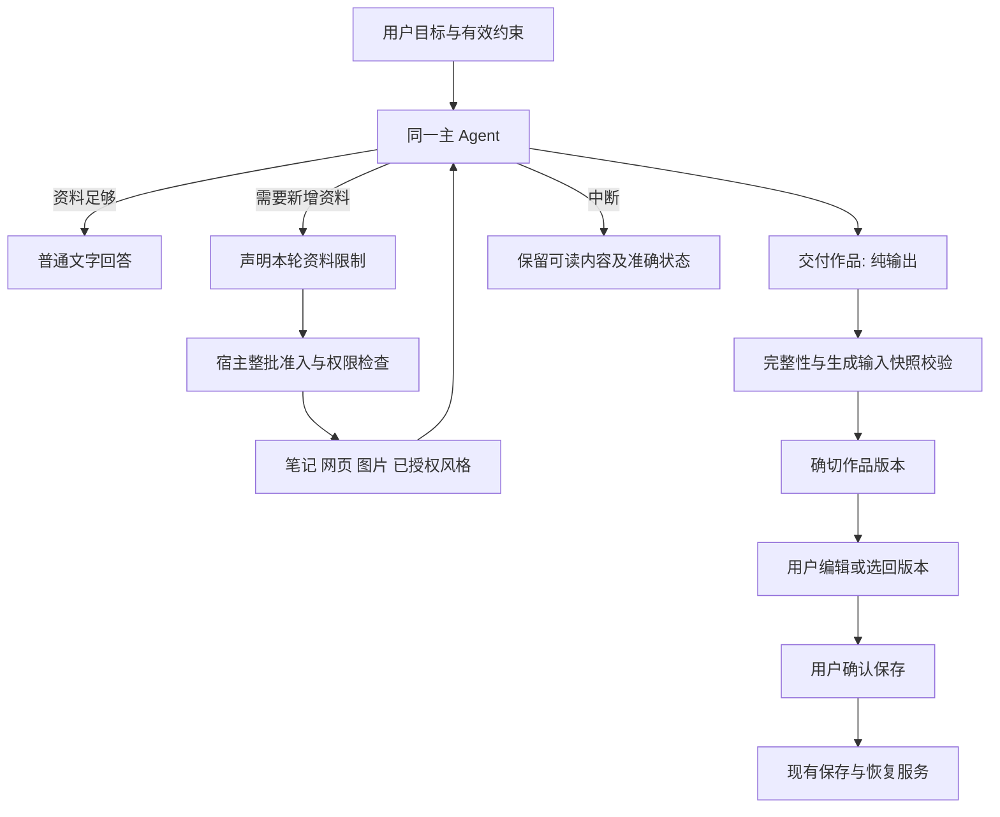

# PA Agent Unified Task Execution — Solution Brief

Document status: Current
Delivery status: Exploring
Updated: 2026-09-08
Work item: B-135
Authority: 用户已认可的方向、源码事实与产品/架构/实现交叉审查后的完整候选方案；不把候选机制标为已批准或已实现。

## 1. Outcome And Authority

用户于 2026-09-08 明确要求：写作意图、Memory/Web/current-note 需求等语义判断由模型完成，本地语义规则整理为 prompt；写作统一到主 Agent，保留作品、准确保存和风格治理。随后认可该方向，要求从产品、架构、程序实现角度讨论、交叉验证并形成新方案。

推荐 **同一主 Agent 决策 + 按需声明资料范围 + 终局作品交付 + 宿主执行校验**。不补关键词，不增加独立分类模型再强制执行分类标签。

- 目标：用户自然提出咨询、检索、创作、修改和保存需求；结果可读，作品可独立操作，资料与动作边界可信。
- 已认可：模型负责语义；去除本地关键词对任务路径的强制分类；统一任务决策，保留现有产品能力。
- 本轮产物：完整候选方案、取舍、实施顺序与验收设计，并补充原故障的App只读取证、源码诊断和离线验证；没有 runtime 修改、新的真实模型调用、部署或发布。
- 尚未批准：资料准备时机变化、native 作品交付、Chat 终局输出与预算过渡、Memory 语义准入、Operations 提议准入及兼容处置。第 12 节集中列出，不通过本文自行替代当前契约。
- 范围：Chat 语义路由、资料准入/投影、作品及相邻续写/风格/来源归属。Pagelet 自主调度、VSS 检索算法、Memory 自动维护、图片格式/存储政策不重新设计。

遵循 [North Star](../../product/pa-product-north-star.md)：用户不管理任务模式；旧笔记按需返回；生成不自动保存，保存不自动学习风格。

## 2. Baseline And Evidence

源码基线：`codex/chat-image-management-b129`，`9f88eb5f6d7a8ba4496f3345863362a59020516a`。本次此前已实时查询远端同名分支并核对一致；这只描述审查输入，不声称后续远端不变。

| Evidence | Grade | Source / implication |
| --- | --- | --- |
| 原句“我好久好久没有写博客了，你有什么文章话题的建议吗？”命中“写博客了，你有什么文章” | Confirmed | [writing-output](../../../src/ai-services/writing-output.ts) 实际函数返回 true，无需既有写作上下文 |
| beta.5 已输出 10 个选题和结尾建议，JSON停在下个字段开头 | Confirmed | 当前App精确requestId的`writingRecovery.rawText`为836字符且JSON解析失败，尾部与用户粘贴一致；排除仅复制选区不完整 |
| warning 使作品进入 recovery，Chat 隐藏普通正文 | Confirmed | [bridge](../../../src/ai-services/pa-agent-stream-bridge.ts)、[ChatView](../../../src/chat/chat-view.ts)；展示与成版耦合 |
| 可选模型分类仍回退本地规则，结果限制工具、强制补查 | Confirmed | [required policy](../../../src/ai-services/pa-agent-required-capability-policy.ts)、[control policy](../../../src/ai-services/pa-agent-control-policy.ts)、[runtime](../../../src/ai-services/pa-agent-runtime.ts) |
| 主 Agent 已有“足够上下文直接答，需要时调用工具”指导 | Confirmed | [prompts](../../../src/ai-services/pa-agent-prompts.ts)；复用现有 loop，无需新增 Agent |
| 独立来源正则/current-note参数覆盖、自动Personal入模、风格前置依赖仍在 | Confirmed | [prepare helpers](../../../src/ai-services/chat-tool-prepare-helpers.ts)、[tool factories](../../../src/ai-services/chat-tool-factories.ts)、runtime、[projector](../../../src/ai-services/context/PaAgentContextProjector.ts) |
| 续写、风格场景及 Chat Memory 来源分类也使用关键词 | Confirmed | [style service](../../../src/chat/writing-style-service.ts)、[admission](../../../src/pa/chat-memory-admission.ts)、ChatView |
| 正文分离、固定版本、显式保存和独立风格授权必须保留 | Confirmed | [DEC-030](../../product/decisions/dec-030-multimodal-chat-image-copywriting.md)、[B-129 Spec](../../product/specs/pa-multimodal-chat-product-spec.md)、[Architecture](../../architecture/multimodal-chat-architecture.md) |
| 新方案准确率/速度一定更高 | Unverified | 待验收目标，不由静态分析或mock推导 |
| 原事件有4次实际Memory检索及4个重复调用；末轮由宿主硬期限结束 | Confirmed | 原始run仍在当前App内存，非rehydrated；见§2.1。精确模型净耗时、原始SSE结束帧/usage仍未知 |
| 百炼API调用日志未见请求失败 | User-reported | 用户2026-09-08补充；尚未取得对应最后回答的逐请求记录。与本地deadline一致，不等于provider正常stop、完整JSON或客户端完整接收 |
| qwen3.8-max新native作品协议的效果 | Unknown | 原事件不能替代新协议的provider验证 |

历史：`b6c67987` 引入写作识别；`7c71292` 的旧 B-129 SDD §4.2 选择最终文本 JSON，以分离正文、准确保存且不增加分类调用。旧 Tracker D-11 解决“假定已有 artifact 通道、实际缺少完成协议”的缺口。这解释作品边界的需要，不证明关键词分类不可替代。

### 2.1 JSON不完整：原事件取证与因果分层

用户补充故障发生在当前电脑、阿里云百炼API。2026-09-08通过Obsidian CLI只读目标Chat，匹配`writing_821ecfd0a30447c5ae985ef6f2a473ee`，取得非历史重建的`run_mtshaxoy_jaxvs56n`。已加载manifest为`2.10.0-beta.5`；当前配置为qwen / qwen3.8-max / DashScope兼容接口、thinking开启、Debug关闭。当前配置不是逐请求原始参数证明，manifest也不单独证明bundle字节身份；核心链路已与beta.5源码核对。取证未重跑提问、改设置或调用provider，也未复制笔记/思考正文及凭据。

| 原run阶段 | 相对首条assistant创建时刻 | 现场事实 |
| --- | --- | --- |
| 第1轮 | 0 ms | 2个search_memory，均success；执行耗时28,756/26,897 ms，其中一个已返回evidence/relevant且needsMoreEvidence=false |
| 第2轮 | 36,167 ms | 1个search_memory，success，28,923 ms，evidence/relevant |
| 第3轮 | 72,690 ms | 1个search_memory，success，28,757 ms，evidence/relevant |
| 第4轮 | 125,867 ms | 4个search_memory均duplicate_skipped，无第二次工具执行 |
| 最后回答 | 133,552 ms | 无工具；`stopReason=wall_clock_exceeded`，`providerCompletion=unknown`；整轮completed_with_warning，recovery reason=incomplete |

相邻开始时刻的差包含模型、工具和调度，不能称为模型净耗时；同批工具耗时可能重叠，不能相加作为墙钟。第一轮有一个partial结果，但当前completion policy没有“旧partial未清债务”：后续成功证据不被它强制补查。第四轮全duplicate与`duplicate_only`触发final-only的源码条件一致，原controlSnapshot未保留。以180秒loop默认预算估算，最后回答开始时尚有约46秒；**本例不能归因为“第165秒才开始、只给15秒写作”**。

结论分三层：

1. **已证实的直接终止机制：**PA在硬期限结束了最后响应的接收/等待，保留的JSON未闭合；这不能单独证明provider仍在生成或服务端恰在此处截断。前四轮模型生成、检索及调度累计到相对133.6秒，恢复提示不是单纯格式校验后伪造的超时。
2. **证据最支持的因果链：**误入写作协议 → 多轮模型/检索消耗共同预算 → 最终JSON尚未完成时宿主结束接收 → 不成版且正文被恢复提示替代。正文语义写完不等于后续字段、对象和provider结束事件已完成。
3. **仍不能排除的组合原因：**provider先因length/格式错误结束，或完成后尾部传输异常，随后PA也到期限。未保留原始SSE结束帧和usage，`unknown`不足以排除这些组合；不虚称已知道服务端生成到哪一个字符。

用户随后查百炼API调用日志，未见请求失败。该证据使“平台将本次调用记录为API故障”的解释缺少支持，进一步把排查重点放在PA预算与响应交付；它不推翻已确认的本地deadline，也不把未知提升为正常stop。百炼[模型监控文档](https://help.aliyun.com/zh/model-studio/model-telemetry)区分日志状态0（请求成功但客户端/用户主动中断）、200成功、4xx及5xx；未取得原记录前，不推定本次为0或200，也不把0自动对应为这次PA超时。成功响应仍需单独查看finish_reason及结构，不能由“无失败”排除length或正常stop但JSON非法。

一个PA run会包含多次provider调用；平台记录须按provider请求ID、调用时间、模型及阶段匹配到最后回答，不能用此前检索/重排的成功覆盖它。若已有对应响应：length支持输出限额解释；正常stop且服务端JSON完整、客户端rawText更短支持接收/归并问题；正常stop且服务端本身未闭合支持格式问题。仅状态成功无法选择这三者。对照优先使用现有数据，不为此默认开启含完整Prompt/Response的推理日志。

### 2.2 已验证机制与替代解释

| Mechanism | Evidence / conclusion |
| --- | --- |
| 硬期限截断接收 | [chunk consumer](../../../src/ai-services/pa-agent-chunk-consumer.ts)在计时器或next结果越线时拒绝后续chunk；[loop](../../../src/ai-services/pa-agent-loop.ts)abort并保留已收到文本。离线probe已复现body闭合但下字段未完的前缀被保留 |
| 软截止与硬截止不同 | 默认loop总预算180秒，预留15秒包含其中。普通incremental轮在软期限可能被abort、已有文字重分类，再开final-only；提前由duplicate触发的final-only使用当时剩余预算，不固定只有15秒。该软中断是独立设计风险，不是本例已证明的触发点 |
| 完成证据在尾部丢失 | [runtime](../../../src/ai-services/pa-agent-runtime.ts)的`streamWithInvokeFallback`先局部记录finish，等stream正常EOF才发provider_completion；finish后的异常/超时可使下游unknown。离线probe已复现“完整JSON+stop已到，tail抛错→正文仍完整但完成证据丢失”。loop即使收到completion也仍等待done |
| provider输出限额 | 最终回答建模没有显式传maxTokens，只有摘要等其他调用有单独输出预算；120,000字符是本地prompt预算，不是回答token上限。不能用正文长度猜出服务端截断；需同一请求的finish_reason、实发限额与usage |
| 格式遵循失败 | 旧envelope由prompt要求，无强制结构化响应模式；provider正常stop也可能产生不合法JSON。应独立记为schema/格式失败，不能都叫超时 |
| 字符串流与恢复UI | 字符串content原样追加，bridge用join("")，recovery/modal原样保留；超长历史是拒绝而非切尾。未发现这些路径故意删去最后字段 |
| 数组content的保真缺陷 | `stringifyModelContent`对数组执行join("\n").trim()；离线probe证实可在JSON字符串内部插入换行而破坏语法。未证明百炼本例走该形状，不能当作本例根因 |
| stream→invoke | 仅无reasoning/正文/工具输出之前的失败可fallback；有输出后不再invoke，所以不会自动补JSON尾，也未发现将两次回答混合的路径 |
| 生成后历史投影 | 当前canonical末条text为124字符恢复提示，rawText为836字符。原因是[history转换](../../../src/ai-services/pa-agent-history.ts)用committedFinalText替换writing正文，避免raw envelope回流；不是adapter少接收了712字符。诊断必须在该投影之前取hash/长度 |
| 计时起点不一致 | runtime hardAt起于startup前，loop预算起于稍后的构造时刻；不能据默认180秒推导精确用户墙钟。需统一绝对截止来源，记录startup与各阶段；该偏移未被证明导致本例 |

百炼官方[Chat Completions参考](https://help.aliyun.com/zh/model-studio/qwen-api-via-openai-chat-completions)区分stop、length、tool_calls；函数参数也必须校验，native调用不能保证JSON永不截断。官方[流式协议示例](https://help.aliyun.com/zh/model-studio/stream)明确展示stop之后仍有usage及[DONE]。官方[思考模式文档](https://help.aliyun.com/zh/model-studio/deep-thinking)说明qwen3.8-max支持思考及输出预算；当前thinking开启只能证明要记录思考成本，不能证明它是耗时主因。以上按2026-09-08查阅的接口文档解释，不猜模型默认限额，不自动关闭用户思考设置。

### 2.3 最小诊断边界

复用现有`PA Agent timing`及生命周期事件，在历史内容转换前产生有字段白名单的单run诊断：run/turn/message/request身份、transport、各轮开始/准备/首reasoning/首正文/最后正文/finish/EOF/abort时刻、进入final-only原因及剩余预算、真实工具耗时/跳过原因、实发输出与思考控制、provider原始结束枚举和字段缺失、真实usage、正文长度/可选hash、格式与恢复原因。缺失保留unknown，不能写0；不记录正文、思考、工具参数、笔记路径、凭据或图片。数字usage采用严格白名单，不全局放松现有token键脱敏。

请求身份应区分PA逻辑run/turn与每次物理调用的provider请求ID，标注回答、摘要、重排及stream→invoke尝试；可得时保存平台关联ID与HTTP状态。HTTP/平台调用状态、provider生成结束原因、客户端接收状态分别记录，不能把200、平台无失败或本地unknown当成完整交付证明。关联失败明确标未知；不采集API Key或任意响应header。

取证时Debug关闭；现存Chat对象未保留原始finish/usage、模型净耗时及精确结束时刻，当前配置不证明故障时的Debug状态。重开历史还会进一步丢失原run transcript，因此后续取证先检查原run是否还在，不能拿rehydrated数据冒充原始事件。若要持久保留诊断，需要另行明确有界字段、保留期与旧reader兼容；本方案首选当前内存/现有Debug，不默认新增完整事件日志或遥测上传。

## 3. Candidate Requirements And Acceptance

以下待提升为 Product Spec，不表示执行已开始。

| Requirement | Acceptance outcome |
| --- | --- |
| B-135/REQ-01 — 主 Agent 语义决策 | B-135/AC-01：原句、否定、引用、写作背景和图片理解正常回答；咨询不因词命中自动成版；混合“建议并起草”同一任务完成 |
| B-135/REQ-02 — 按真实证据需求取材 | B-135/AC-02：充分上下文直接答；需要资料时正确取材；不因预测名单重复补查；失败/零结果如实说明 |
| B-135/REQ-03 — 来源限制先于执行 | B-135/AC-03：首次新增访问前有有效约束；无效/冲突批次零外部执行；禁止联网、仅当前笔记、混合来源和跨轮更正均覆盖 |
| B-135/REQ-04 — 全部provider输入准入 | B-135/AC-04：Personal/Memory/style、旧工具结果、摘要、图片、retry/summary/rewrite均按有效范围准备，不能只限工具名 |
| B-135/REQ-05 — 回答与作品展示独立 | B-135/AC-05：普通文本和作品预览中断后仍可读；协议失败不替换整条回答；无输出给出真实原因 |
| B-135/REQ-06 — 精确作品版本 | B-135/AC-06：完整事件才成版；字符/hash一致；截断、身份冲突、来源失效不成版；人工恢复保留AI来源 |
| B-135/REQ-07 — 终局可以交付 | B-135/AC-07：Chat收尾输出文字或一个作品，无新来源/动作，也无强制acknowledgement模型轮 |
| B-135/REQ-08 — 续写与素材归属 | B-135/AC-08：模型解析目标，宿主验证parent/session/hash；回选、失败继续、新话题、多图指代和重放不串版串图 |
| B-135/REQ-09 — 风格按需且授权不变 | B-135/AC-09：模型提出场景；有效且匹配的已授权样例才入模；撤销/Forget/排除/预算变化物理请求前重验 |
| B-135/REQ-10 — 保存与Memory来源保真 | B-135/AC-10：复制/编辑/保存确切版本，不再生成；AI原稿/本次修改/明确风格动作区分；本次要求不自动变长期偏好 |
| B-135/REQ-11 — 兼容与回滚 | B-135/AC-11：旧聊天、JSON recovery、版本、图片、SaveReceipt可用；模型/Desktop/iOS能力不静默缩减；旧reader验证后才声明可回滚 |
| B-135/REQ-12 — 质量与成本可复核 | B-135/AC-12：同输入记录结果、调用序列、结束原因、耗时及可得usage；无独立分类模型；额外准备轮如实记录 |
| B-135/REQ-13 — 操作提议按用户目标 | B-135/AC-13：现有 opt-in/core tools 内，普通咨询不主动产生写入卡片；明确请求可提出方案；关闭、未确认、取消均不写入 |
| B-135/REQ-14 — 结束事实与格式分开 | B-135/AC-14：区分宿主deadline、provider length、正常stop但格式错误、finish后尾部异常及缺失finish；后续usage/EOF不抹掉已取得结束证据，native同样需完整校验 |
| B-135/REQ-15 — 共同预算内可靠收尾 | B-135/AC-15：统一绝对截止起点，取材/准备/思考/交付共享预算；已开始的正文/作品不因软过渡被丢弃重答，硬期限/取消不延期；禁止late工具及多次收尾重试 |
| B-135/REQ-16 — 故障能按原run定位 | B-135/AC-16：投影前保留无正文的最小阶段与终止证据，说明unknown与实发限额；可区分“生成不完整”和“只缺usage/尾部结束”，不新增默认全文日志或上传 |

首版保留现有每轮一个作品，不建设通用多产物平台。多篇请求可交付有分节的组合正文，不任意丢弃某篇；独立多作品管理不由本文自动授权。

## 4. Alternatives And Recommendation

| Option | Assessment |
| --- | --- |
| 补正则/仅启用policyModelName | 不符合已认可方向，其他语义覆盖和强制路径仍在 |
| 独立模型先分类，再执行固定路径 | 新增固定调用和失败点，仍锁定路径，不推荐 |
| 主Agent直接选工具，仅prompt约束来源 | 机制最少，但宿主不能独立核验首调是否符合自然语言限制，不能声称访问保障无变化 |
| **同一Agent声明范围，按需取材，native纯输出交付** | **推荐**；不预分类任务，复用工具边界；需整批预检、Chat输出终局和provider完成证据 |
| 普通文本内可选run-bound正文块 | 可行备选，保留text-only final；需自建增量定界、碰撞、多块、截断及精确空白语法 |
| 所有回答统一answer/artifact JSON | 将结构失败扩散到普通问答，不推荐 |

独立审查有实质分歧：架构lane偏好正文块以减少loop改动；实现lane偏好native已有参数边界。综合裁定：本次是共享Agent职责调整，不再限定单函数补丁；优先native并设置P0完整性/兼容门，避免另造文本协议解析器。若现有支持模型不能通过native门，停止该路线推广，回到正文块备选的独立设计决定；不在runtime叠加两个自动协议，也不以手选静默替代既有自动成版能力。

## 5. Proposed Architecture

下文新接口名均为 **Proposed**。复用registry、loop、dispatcher、context manager和WritingVersionService，不新增独立planner服务、缓存平台或通用workflow引擎。

### 5.1 资料范围不是任务分类

Proposed `declare_source_scope` 只表达用户限制，不含taskType、requiredTools、confidence或“必须检索”名单。示意字段为来源类别限制、宿主引用、风格限制和当前用户消息依据。`not_restricted`表示未识别到新增限制，不是授权。

- 显式输入足够的普通文字回答无需声明。首次扩大本轮资料范围前，由同一主Agent声明。
- 允许scope与source调用同批；收齐完整响应，校验整个批次，建立约束快照，再执行。参数仍在流式增长时不提前检索。
- 缺失/冲突声明、非法引用或任一越界请求使执行批次整体拒绝；不先执行合法前半批。返回简短纠正结果，使用现有无进展/时间预算，不能无限声明重试。
- scope只收紧settings、Data Boundary、平台及真实权限，不打开关闭的Memory、不解除排除、不授权写入。
- 本轮已采用限制不能由工具内容或模型再次声明放宽。下一轮新用户要求重新解释；收紧只影响未发生访问。错误收紧影响目标时说明/澄清，不假造授权。
- 按数据范围约束：vault笔记可以使用适合的笔记工具，不等于只准search_memory；当前笔记绑定note identity，不只限工具名。
- 模型解释可能错。保证的是“声明在前、执行符合声明及宿主权限”，不是语义永远准确。

### 5.2 首次入模与自动上下文

这是明确的产品变化：当前首请求自动带Personal/Memory等上下文。只挡检索工具不能兑现来源限制。

推荐bootstrap只含当前用户文字、有界的原始用户对话文字、宿主记录的结构化来源限制、能力说明、用于指代的材料/版本opaque handles及次序。原始用户轮用于解释“继续刚才的”等指代与约束，其中引用仍是数据，不授予权限。自动Profile、vaultInsights、governed Memory、风格、旧工具证据和来源混杂摘要不提前注入。附图像素、选中作品全文及Pagelet来源正文也延至声明后按需读取；添加材料不等于忽略同条消息的“不要看这张图”。

- 范围解释与回答使用同一Agent，scope与资料请求可同批；串行工具模型可能多一次往返。图片/依赖历史材料的请求也可能比现在多一个准备轮，需测量并作为代价。
- 当前及有界历史用户文字是理解指令的必要输入，程序不能在读懂前区分其中所有引用；此例外必须纳入数据边界，不承诺这些输入已经完成任意自然语言隔离，更不能撤回过去已发送内容。来源排除约束后续资料投影与使用，不意味着模型未读过用于解释指令的用户文字。
- 结构化历史范围记录必须来自已经完成的范围准入，绑定用户消息身份，只含来源枚举/宿主引用等非正文约束；不能在scope前再调用模型处理混杂历史来制造“有效约束”。旧会话无记录时使用有界原始用户轮，不回退旧source-rich摘要。
- 范围记录是历史限制上下文，最新用户更正由主Agent解释，不能由旧记录自行覆盖。历史被截断或指代不足时，未知不等于`not_restricted`：先在已知范围内读取所需历史，或简短澄清，再验证后续访问；不能先放行Web再追补限制。无法可靠提供bootstrap历史时，P0不得通过。
- 原始用户对话之外的历史来源事实单独处理。明确“只用当前笔记”时，后续不再投影其他来源事实。来源混杂、无法过滤的摘要不复用，按可证明范围重建，不删除历史。
- 复用canonical source/turn身份和现有摘要缓存，不新建第二套历史。bootstrap提供不含正文的引用目录；Agent按scope读取必要历史材料。
- 准入覆盖物理dispatch、summary、query rewrite、retry/fallback和图片/风格准备，不只最终Chat prompt。
- 工具`prepareBatch/prepareArguments`、动作提议的baseline/inspect读取、动态加载返回的用户资料同样受scope约束；按实际数据读入执行，不以action/meta等工具类别豁免。确认写入不反向授权此前越界读取。
- Personal价值通过按需host projection保留，不全局关闭，也不把所有个人材料每轮重新搜索。它的首轮伴随时机变化必须作为新方案取舍批准。

### 5.3 工具选择与终态

将CAPABILITY_SIGNALS、confidence→required、自然语言allow/block及current-note full override迁移为取材指导与反例。移除“预测工具没调用→强制纠正/缺能力警告”作为完成判据；同时清理由预测来源类别造成的工具隐藏。

保留实际可用性、参数schema/别名、来源事实、取消/期限、去重和无进展收尾。Memory `none`表示查过但无相关证据，`unavailable`表示无法查得；不删除evidence registry，不恢复已被投影撤销的证据。资料返回后由Agent判断具体缺口，预算/无进展可以关闭新增访问，但不以另一套词规则猜测“资料足够”。

Operations的`hasOperationsWriteIntent`不仅影响schema暴露，还参与`canExport/canExecute`。推荐在现有per-vault opt-in及四个core tools范围内，由主Agent判断用户是否要求操作方案，替代这一语义硬门。工具暴露及提议准入方式因此改变；真实写入仍保留用户确认、执行权限、目标与stale检查，不增加core write能力。普通咨询不主动制造写入卡片。此项是[DEC-014](../../product/decisions/dec-014-defer-operations-agent.md)的明确候选变更，列为D5，不能称作仅整理prompt或完全不改准入。

### 5.4 按需写作上下文

Proposed `get_writing_context`接收模型解释的目标、场景和本次风格要求，返回宿主可验证的会话作品/材料句柄；复用WritingStyleService治理、预算及currentness。

- 模型判断“上一版/第二段/换话题”，宿主核对允许的parent、session、正文hash、当前显式选版及材料身份；不接受任意路径。
- 失败写作只有材料lineage，不能伪装为已完成父版本。回选旧版及默认关联图片保留；明确排除某图不能被现有parent图片union加回。
- 只有已授权且场景匹配的样例可用；unknown、冲突、暂停、Forget、预算不足不注入。明确要求已记住风格而不可用时说明，不能普通写作冒充完成。
- 先取上下文，再生成；两者不能同批冒充“已参考”。每次物理dispatch前重验pause/forget/settings/source epoch，记录真实revision。

### 5.5 Native作品交付

Proposed `present_writing`是纯输出能力，以现有native tool-call参数承载`body`、可选`explanation`和已提供的作品上下文handle。宿主生成run/message/version/origin/hash、真实来源与图片；schema不接受保存路径、权限、可信来源清单或origin。

- 普通答复仍是assistant text。可先给简短说明再交付一个作品；纯输出调用不把说明重分类成隐藏的工具思考。
- 它必须是该响应唯一调用，不与source、scope、action或第二作品混批。混批执行前拒绝，不能先取资料再追认作品用了它。
- 完整交付直接终结当前生成，不追加acknowledgement模型轮，不复述/重写正文。Agent须在交付前完成必要任务步骤；结构完整不证明所有用户目标已满足。
- 保留真实`finish_reason=tool_calls`，新增正常作品输出完成判断，不伪装为stop。需完整参数、正常provider结束、调用身份、生成输入快照有效及无取消。
- 不在中途JSON恰好合法时成版；完整正式解码后正文原样进入WritingVersion。不能从DOM取字或调用第二模型提取。
- 一轮一个作品；event重放及stream→invoke不重复提交；同一幂等身份正文不同须冲突拒绝，不覆盖。

### 5.6 Chat最终收尾

明确替代Chat当前“final_answer_only导出零工具schema”的技术规则：收尾只允许文字或一次注册的纯输出，禁止source/context/action；Pagelet保持原协议。

schema binding、loop、dispatcher、completion policy与bridge共同执行，不只改prompt。输出不借用source tool额度，仍受原硬时间、文本/请求预算和一次输出上限；不能续期、重试绕过或重开普通工具。硬期限先于完整结果到达，或provider未正常完成时保留预览，不成版；完整结果在期限前取得的尾部处理见§5.7。deadline数值以源码为准，不以增加timeout掩盖无进展。

### 5.7 完成证据与预算的独立修复线

**native解决作品表达边界，不能消除超时、token耗尽或非法参数。** 本节对普通文字、旧写作恢复及新作品协议均适用，须先于新协议的兼容结论验证。

- **及时传递完成事实：**adapter收到provider结束字段时，在同一响应最后content/arguments已处理后，记录结束枚举、所属request/choice及本地接收时刻，不等EOF才首次通知。保留missing与未知枚举的区别；`tool_calls`按新输出协议处理，不能转成stop。
- **分开内容结束与连接结束：**只含usage的尾块不改变正文或结束事实。正常内容结束、结构完整、快照有效且在硬期限/取消前取得的结果，不能仅因之后EOF/usage缺失就降格为“模型没写完”；连接清理仍有界且不延长生成。相互冲突的finish/晚到正文按协议异常处理，不拼入已冻结结果。源/身份失效和取消的先后顺序须单独验证。
- **失败原因可并存：**provider length后又遇宿主deadline，记录两件事；正常stop但JSON非法属于格式失败。无finish时只报告实际看到的宿主/传输原因及完成未知，不能推断模型被token截断。
- **逐段保真：**字符串与数组text block均按provider规定的增量边界原样归并，禁止逐chunk trim或人为插入换行。对不支持的content形状明确拒绝，不将任意对象stringify为作品正文；完整解码后才建版本。
- **统一预算来源：**runtime创建一个绝对截止，loop、准备、检索、summary/rewrite、provider retry及交付使用同一剩余量。记录startup占用，不把每个阶段或fallback重置为新180秒。收尾预留只限制新增取材，不能被误报为所有最终回答的固定时长。
- **保护已开始的交付：**推荐软过渡在轮次边界或尚未开始正文/作品交付时发生；已开始交付的响应在原硬期限内继续，不把其正文重分类丢弃后再要求完整重答。晚到来源/动作调用不能执行；不将两次生成的半段JSON拼接。只有thinking的等待仍受既有idle/截止约束。此项改变现有incremental软过渡，列为D6，P0验证后再冻结具体状态迁移。
- **不以文字猜测最终性：**`text_delta`只证明有可读候选，“我先查一下”也可能随后带工具。推荐允许已有文字响应使用硬期限内余量，但承认它可能耗尽收尾预留；随后出现的late source/action不得执行，不清空候选、不重置预算，也不自动另开完整重答。P0覆盖“文字后工具”及“纯输出名称/参数跨软期限”，明确候选与最终成版的区别，不再用关键词判断哪段像最终答案。
- **先解释成本再调参数：**对本例先解决多轮取材后收尾和结束证据，不默认增加180秒、关闭thinking、截短用户目标或套统一max_tokens。确需调整思考/输出预算时按模型支持、实际usage与质量对照决定，区分回答上限、思考预算和总输出上限；不把普通120,000字符prompt预算混用为输出配置。

最小状态分开记录`provider内容结束`、`transport结束`、`结构校验`、`宿主中断`，复用现有typed events/diagnostics，不新建workflow框架。先用可控尾帧的离线样例验证，再做百炼同口径样例；一次成功无法证明不会再超时。

## 6. Display, Completion And Provenance

| State | UI | Program consequence |
| --- | --- | --- |
| 普通文字生成中 | 逐步显示可读内容 | 不依赖作品协议 |
| 作品参数到达中 | 合法body字符串前缀只读预览，标未完成 | 不成版、不启用完整版本保存 |
| 完整输出且版本持久化成功 | 正文、版本操作及参考详情 | 复制冻结text，不混入解释 |
| 输出完整但版本持久化失败 | 正文仍可读，说明版本未保留，可本地重试 | 不声称可重开，不重新生成 |
| 截断/取消/非法协议 | 保留可读内容、说明中断，允许明确选择/编辑恢复 | 不补JSON、不自动成版；选取原文仍为AI来源 |
| 正常内容完成，usage/EOF异常 | 保留经校验正文，仅在详情说明用量或连接结束状态未知 | 按§5.7保留已验证完成事实，不泛化为内容截断；结构/快照未通过仍不成版 |
| 来源/会话身份失效 | 保留获准保留内容，关闭受影响参考/未准入预览 | 来源删除/隐私规则优先，不能重曝被撤销原文 |
| 用户确认保存 | 预览确切版本/图片/目标，区分部分完成 | 复用SaveReceipt与恢复，不再调用Agent |

native预览仍需小型只读增量字符串解码，不能声称没有parser。优先复用tool buffer；支持JSON escape/Unicode/跨chunk，绝不补参数；完整JSON结束后解码并核对预览与最终字符。若P0不能可靠预览，不得声称流式AC通过或静默改成等结束才显示。

来源冻结在**生成该输出的provider请求**，不是run最后的来源union。只说明实际提供，不声称逐项采用；同批之后返回资料不属于生成依据。版本、任务、保存完成分别判断；与已完成证据无关的后续清理warning不删除版本。准入前取消/来源失效/身份冲突阻止成版，保存成功后UI关闭不回滚笔记。

### Chat Memory与长期风格

不能删`classifyChatUserProvenanceKind`后把一切标ordinary。分开两类信息：宿主事实（真实user/assistant来源、消息/hash、UI编辑、作品事件、明确风格授权）；模型语义（本次约束/作品素材/改稿/独立长期陈述）。模型语义仅供候选/排除，不伪装成宿主授权。

复用Type A提取与治理来理解语义，补充用户上下文和宿主事实，不每条Chat新调分类模型。写作/改稿、生成及派生内容不自动成为长期风格；未知/不完整语义或来源缺失先不产生候选，不回退ordinary；独立真实陈述按既有自动Memory契约处理。

P0必须验证“个人事实+本次写作要求”的混合消息、新旧metadata reader及两条持久化准入路径：不能整体永久丢掉个人事实，也不能模型自报durable就获得授权。新字段按需加法，旧hostProvenance不回写/降格；explicit_style_action只来自真实用户动作。若既有治理无法承接，提出具体补充决定，不放宽准入。

当前`collectChatMemorySources`在Type A之前就过滤非ordinary，最终两条准入也只认ordinary。P0必须具体分开“可交现有提取模型审阅的真实用户来源”与“可持久化候选的证据”，或给出等价可执行契约；不能只改提取prompt，否则unknown永远到不了模型。宿主校验消息身份/hash及真实动作，模型解释独立事实、本次要求和引用；进入提取输入不等于获得长期保存或风格学习资格。交付物包括可运行的混合消息样例、两条最终准入结果及旧/新reader结果，不能只凭模型回答截图通过。

## 7. Prompt Organization

在现有主prompt、工具planner guidance、按需writing guidance维护职责一致的指导，不保留prompt与关键词表双重权威：

- 结合当前请求与相关对话，区分提及、经历、引用、否定、建议和作品交付。
- 按用户限制与实际缺口取材；有证据直接答，无资料不虚称个性化或验证完成。
- scope只承接限制，不预测必调工具，不改变权限。全文精确查找用合适范围/full，不以nearby无结果代替全文。
- 足够即回答；相同结果不反复检索；收尾仅用已有证据。取写作上下文后再一次交付，不同批请求新资料。
- 选题建议只需找到能支撑建议的主题，不必为每个选题都再查一遍；已有相关结果时直接组织答案。换查询措辞前指出真实缺口，不能把检索状态说明误当成必须继续的指令。这是模型指导与真实样例验收，不新增“第几次检索必停”的语义硬规则。
- 选择、修改、保存和风格授权分别处理。目标或来源歧义实质影响结果时简短澄清，不固定每问先访谈。

把规则转成目的、适用条件和反例，不改写为“看见这个词就用这个工具”。语义正确性靠真实案例，执行不变量靠自动化测试。

## 8. Implementation Map And Phases

| Area | Proposed change / retention |
| --- | --- |
| prompts / tool factories / prepare helpers | 统一语义指导，去语义参数覆盖；保留schema/别名 |
| required / control policy | 去预测强制和工具隐藏；留真实证据/无进展；policyModelName其他rewrite/rerank用途不删除 |
| runtime / loop / chunk consumer / dispatcher | scope批次准入、实际投影、纯输出及生成快照；完成事实及时传递、统一截止与软过渡；权限不扩张 |
| projector / history plan / summarizer | bootstrap与scope投影、摘要来源与retry重验，不另建日志 |
| writing-output / bridge / chat types / history | 新完整性、预览、版本事件，旧recovery兼容；内容/连接/格式分开，诊断在历史重写前产生 |
| ChatView / modal / locales | 去外层模式和隐藏正文；保留选版、恢复、准确状态；普通UI不露内部工具名 |
| style / plugin / ChatHost | 模型场景到受治理上下文，保留撤销/预算/currentness |
| provenance / admission / extractor | 事实与语义候选分开，两条准入保真，保护独立真实陈述 |
| versions / persistence / save | 优先复用exact版本/receipt，防parent素材union违背本次范围；按需才改schema |

以下仅为实施建议。采纳后建立L3 Decision/Spec/Active Package/Approved SDD；现有B-129图片Tracker仍拥有它的iOS门，不被本方案替代。

| Phase | Work / exit | Stop or expansion |
| --- | --- | --- |
| P0 可行性与契约冻结 | 先完成本例取证与结束/预算离线对照，定义原始finish及时传递、尾部异常和格式独立判定；再验证真实模型scope/历史/native预览与终态、软过渡、Memory准入及旧reader | 已有现场及离线证据见§9.1；新协议与预算迁移未验证。能力/边界无法保持则回决策，不以“改native后自然好”跳过 |
| P1 语义与资料闭环 | prompt、范围/批次/隐式注入一起接通，迁移取材与操作提议规则；写作交付及其剩余意图规则在P2一起切换 | 本阶段来源机制及Desktop真实门通过；旧作品格式/UI可暂留，style、parent全文、图片与Personal必须先接scope；无法分离则与P2合成完整行为slice，不提前标完成 |
| P2 统一作品闭环 | 输出/终局/预览/parent素材/按需风格/provenance作为完整slice切换 | 不丢风格、不自动学入任务要求、不以手选替代成版；完成Desktop及受影响移动门 |
| P3 兼容与整体验收 | 旧历史/恢复/保存、跨轮scope、模型矩阵、最终完整gate及App | 冻结输入，修复或明确裁定P1/P2问题；发布另行授权 |

可细分提交，以完整行为门退出。新方案不承诺降低耗时，不设置更长timeout作主修复。

## 9. Minimum Sufficient Validation

| Risk / AC | Minimum evidence / command | Pass condition | Rerun / expansion |
| --- | --- | --- | --- |
| AC-01/02 语义 | 固定中英文真实模型集；runtime-prompt/required/control/host-tools相关suite | 原句、否定、引用、混合来源、充分上下文及全文查找行为正确，不只断言prompt含词 | 语义失败、工具缺失或新模型声明 |
| AC-03/04 首调与入模 | runtime/dispatcher/context-admission/history/summary；捕获物理输入/调用顺序 | 无scope/冲突零新访问，所有来源与派生上下文按范围，新要求不复活旧内容 | 新provider路径/来源/摘要/配置 |
| AC-05/06/07 输出 | chat-writing-output、b129-multimodal-runtime、pa-agent-loop、stream-fallback、chat-view | 文字保留、跨chunk保真、完整tool_calls才成版、混批/多output/length/filter/abort拒绝、final-only无源/动作/新模型轮 | provider完成字段、bridge/loop/parser改变 |
| AC-08/09/10 风格/来源 | chat-writing-style-service、memory-writing-style及admission相关suite，实际输入revision | style先取后写、撤销重验、父/图正确、AI不自动学、混合事实不丢 | schema/准入/权限/来源改变 |
| AC-10/11 保存兼容 | writing-versions/save-action/save-modal/history-store/manager及旧fixtures | text/hash/图一致、重试幂等，旧reader结果明确，部分保存不误报 | 持久化/reader/素材归属改变 |
| AC-13 操作提议 | operations runtime/controller/PolicyEngine相关suite及真实普通咨询/明确写入 | 咨询无多余卡片，明确目标可提议；opt-in关闭不暴露/执行，未确认及取消不写入；准备读取也受scope约束 | schema暴露、提议或执行准入改变 |
| AC-14 完成/格式/保真 | stream-fallback/loop/writing-output：相同短JSON用可控尾帧驱动 | 硬截止前缀、length正常EOF、合法/非法JSON+stop、stop后tail挂起/报错、finish同chunk含文字、usage-only、数组chunk均被正确区分；不误成版 | adapter/SDK/transport/parser改变 |
| AC-15 预算 | runtime/loop/chunk-consumer：startup、重复工具、提前final-only、软过渡、文字后工具、纯输出名称/参数跨软期限、硬期限/取消对照 | 单一截止、不重置预算、不丢候选、不误认最终性、不执行late工具；记录预留耗尽，思考不会续期，既有buffered行为有回归证据 | 截止/准备/fallback/输出/模型参数改变 |
| AC-16 定位 | 现有Debug/生命周期白名单投影、history相关suite | 原run事件与显示/历史改写分开；无正文、思考或敏感配置；缺值unknown，错误不被泛化为Runtime limit | 诊断字段或持久化范围改变 |
| AC-01–16 真实路径 | qwen3.8-max及另一已支持native provider；普通/Memory写作/风格/续写/范围/操作提议/forced-final | 自然结束、序列、正文/版本hash与投影可对照；目标模型不可用标BLOCKED | 同因两次无进展缩小重现，不立即扩大所有矩阵 |
| 共享runtime/App | npm run lint；npm run build；npm run test:all -- --runInBand；git diff --check；AGENTS.md DOM scan；同构建Desktop/iOS | 每阶段所需门真实通过，版本/续写/保存/重开可用 | 相关source/tests/fixtures/config/dependency/build改变 |

按现有Jest分组选source/tooling/artifact；artifact先build。上表简称实施时对应实际文件，不把漏跑suite算PASS；新增对抗用例放既有相关suite，不建设通用eval平台。默认不额外收coverage，发布门另行执行。

`make deploy`复用其lint/build/full Jest；已满足当前输入所有条件才用deploy-current。iOS需授权的设备/测试库和加载身份，Linux源码不替代。P0仅用合成非敏感资料；缺API/发送授权/设备记录门未完成，继续独立工作。

真实案例包含本例、已有作品后新咨询、仅当前笔记、禁网、引用/否定、跨轮更正、旧Memory摘要、建议+起草、风格撤销、body似完整但调用未闭合。mock证明机制，真实模型证明样本行为；结构完整不等于作品质量完整。

### 9.1 本轮已取得的证据

2026-09-08，源码输入为§2基线，无runtime/tests/config/dependency修改：

- 原故障App只读投影：精确requestId/runId、loaded version、836字符recovery尾部、5个assistant轮次及8个工具结果；见§2.1。这是原事件取证，不是新版本smoke或完整原始SSE记录。
- `npm test -- --runInBand __tests__/pa-agent-loop.test.ts --testNamePattern='soft deadline|finalization reserve|wall-clock expiry|timer fires mid-stream|pending text with a warning|resets assistant idle|provider errors after visible text'`：1 suite / 11匹配用例PASS，73跳过，3.654秒自然退出。
- `npm test -- --runInBand --runTestsByPath __tests__/pa-agent-stream-fallback.test.ts __tests__/b129-multimodal-runtime.test.ts --testNamePattern='yields stream chunks unchanged|rethrows mid-stream failures|retries streaming as invoke|does not promote legal JSON|counts full text' --no-cache`：2 suites / 8匹配用例PASS，52跳过，5.386秒自然退出。
- `/tmp`临时离线probe直接调用未修改的runtime/loop，以合成JSON验证3种当前机制：硬期限拒收闭合尾、已收到stop但尾部报错导致完成事件丢失、数组text归并插入换行破坏JSON。`node node_modules/jest/bin/jest.js --config /tmp/pa-b135-diagnostics/probe.config.cjs --runInBand`：1 suite / 3用例PASS，1.032秒自然退出。它们描述当前缺陷，不是修复后的验收；实施时将最小对照提升到现有suite，不依赖临时文件长期存在。
- 没有新的真实provider请求、重现耗费、插件构建或部署。上述source用例及合成probe不证明新native方案、性能或设备验收通过。

## 10. Compatibility, Rollback And Scope Control

- 现有模型/provider能力矩阵实际核对，沿用Chat模型，不强制另一个视觉/分类模型，不要求JSON-mode。native不可证明时可读回答/手选仅为恢复，不等于原自动能力已保持。
- 旧Chat、WritingVersion、SaveReceipt、JSON recovery及Markdown不批量重写。必要新字段最少加法，旧reader可能忽略/拒绝/丢字段，须实测。
- 不改变当前图片分支“实际交付文件、拒绝新HEIC、保存迁出”的批准边界，不恢复旧转换行为。
- 保存复用目标核对、确认、迁出及部分恢复，不授任意二进制写入。
- 回滚按受控提交保留合法版本/笔记，不重置数据。旧reader不兼容时先补reader或禁止写新格式，不能只说git revert即可。
- 不增长期双路由开关、隐形regex fallback、多套自动作品协议。P0失败要新决定。
- B-130纯JSON回答格式是相关事项，不顺带解决全部通用格式；B-129图片/iOS验收不由本方案关闭。

## 11. Cross-Review Record

2026-09-08，产品、架构、实现三个独立lane读相同源码/契约，再互审输出、资料准入和Memory联动；主代理综合。以下是设计审查，不是运行验证。

| Finding / disagreement | Disposition |
| --- | --- |
| 换分类模型仍被required/exposure锁死 | §5.3同时去预测强制/覆盖，保留证据 |
| scope前已自动入模 | §5.2覆盖bootstrap及物理路径，额外轮次/个性化时机单列取舍 |
| native与final-only矛盾 | §5.6明确Chat纯输出例外，不重开source/action |
| 正文块与native分歧 | §4说明两种成本，综合推荐native+P0门，保留未采纳备选 |
| warning吞正文 | §6分开预览、版本、任务和保存完成 |
| 同批来源被追认 | §5.5禁混批，§6绑定生成输入快照 |
| 删除判定后丢风格或扩大样例使用 | §5.4按需上下文，治理/撤销保留 |
| 全改ordinary污染Memory | §6事实与语义候选分开，P0检查混合消息/reader，不降低授权 |
| 手选被当自动成版兼容 | §4/10不允许静默能力缩减，失败回决策 |
| bootstrap历史限制来源存在循环依赖 | §5.2明确原始用户轮与结构化约束来源、语义隔离例外及未知不放行 |
| unknown在Type A之前被过滤 | §6拆开提取输入与候选持久化，P0要求可运行的混合消息与两条准入结果 |
| P1旧写作或工具prepare形成来源旁路 | §5.2/8覆盖实际准备读取；无法分离则合并P1/P2行为验收 |
| Operations不只是schema发现变化 | §5.3/12记录实际准入变化，新增AC-13及待决定D5 |
| 只改路由/native仍会缺JSON尾 | §2补原run取证；§5.7/9独立覆盖期限、结束事件、格式、字符保真和可诊断性 |
| 误将本例解释为最后只有15秒 | 现场末轮相对133,552ms开始；§2.1明确约46秒默认剩余量与不可恢复的精确结束时刻 |
| 平台无失败被误当成JSON完整 | §2.1记录用户补充及百炼状态定义；§2.3增加逻辑run到物理provider请求关联，保留finish/结构/接收的独立判断 |
| canonical124字符与recovery836字符被误作丢包 | §2.2核对历史投影替换为提示；长度/hash证据改在转换之前采集 |

源码路径/数据流已只读交叉核对；原事件取证与离线诊断已完成。新方案P0尚未完成，native效果、参数优化成本及新版本设备行为未验证。

## 12. Decision Needed And Exit

推荐整体采纳下列机制，尚不自称已批准：

| Choice | Original | Proposed / tradeoff | Rollback |
| --- | --- | --- | --- |
| D1 按需资料 | 首次自动Personal/部分材料入模，词规则限制部分工具 | 同一Agent声明后准备来源及历史派生；部分任务多准备轮、个性化时机变化 | 保留历史，按阶段回退，新模式不暗启旧regex |
| D2 native作品 | 最终文本JSON+整轮终态 | 纯输出调用+自身完成证据+生成快照；需先证实兼容 | P0失败不推广，旧JSON reader保留，正文块另决策 |
| D3 Chat终局 | final-only零工具schema | 仅文字或单输出，无来源/动作，Pagelet不变 | 回退Chat协议适配，保留已有作品 |
| D4 来源与语义 | 正则hostProvenance参与提取 | 模型理解用途，宿主来源/授权；未知不变ordinary，独立陈述仍可处理 | 留旧metadata，reader门前不写不兼容字段 |
| D5 Operations提议 | 本地写入意图信号同时约束工具暴露与提议准入 | 主Agent按用户目标判断，在现有opt-in/core tools内提议；确认/权限/目标校验保留，咨询不主动产生写入卡片 | 保留现有确认及执行服务，提议适配可回退，不扩展写入数据格式 |
| D6 收尾预算过渡 | runtime/loop不同起点；incremental普通轮软截止可丢弃已产生正文再重答 | 单一绝对截止，保护已开始文字/作品至原硬期限；候选不等于最终，可能耗尽重答预留且late工具不执行；无新加时，不自动改thinking | 独立回退预算适配，保留完成事实/诊断修复；不得以全局增时代替 |

Decision authority：用户。已认可的模型判断/统一Agent不重复询问；上表是新机制与代价，实施前须明确采纳。当前授权是形成方案，不视为runtime改动、commit/push/merge或发布授权。

采纳后建立Decision + Product Spec + L3 Active Package，再据此形成Approved SDD/Tracker。本文结论吸收后按生命周期删除，仅独有证据另留；未采纳则更新Backlog和重启条件，不把当前Architecture改成未来态。
