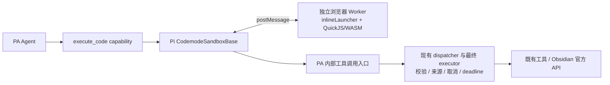

# Pi Codemode 在 PA 中的复用：分析与 MacBook Pro 验证交接

Document status: Current
Delivery status: Exploring
Updated: 2026-10-10
Work item: B-170
Authority: 本主题跨设备研究的事实、候选方案与待确认事项；不是已批准的产品规格、实现授权或已通过的设备验收。

## 1. 接手摘要

用户希望 PA 具备通用的确定性计算能力，处理日期、数值、统计及查询组合，减少模型手算和反复判断；要求优先复用现成实现、兼容 Obsidian 桌面与移动端、避免过度设计。2026-10-10 用户要求将讨论形成详细交接文档，把必要验证转到 MacBook Pro。

当前建议：**主线程复用 Pi `CodemodeSandboxBase`，补浏览器 `VmLauncher`；独立 Web Worker 内复用 `inlineLauncher` 和 QuickJS/WASM；脚本通过 PA 现有工具执行链调用工具。** 浏览器原生 `postMessage` 已足够，不需要 Cloudflare、远程执行服务或 Pi Agent 主循环。

接手时最重要的六件事：

1. **尚无 PA Codemode 实现或运行原型。** 已完成源码、发布包和接口分析；桌面、iOS、Android 的 QuickJS 集成均未实测。
2. **当前 npm `@earendil-works/pi-codemode@1.1.0` 不包含所讨论的 portable/inline 代码。** 源码与发布包不一致，不能直接照源码示例安装导入。
3. 最小复用候选是固定 Pi 提交的有限源码纳入，约 6 个实现模块加类型；另外补浏览器启动器、Worker 入口和 PA 执行链适配。该选型仍待确认。
4. 先在 Mac 验证引擎和生命周期，再接 PA 工具，最后做真实模型对照。前两类无需模型 API 调用，也不需要读取私人 vault。
5. Mac 上 Chrome、Safari 或 Obsidian 桌面通过，分别只证明各自环境；不能替代 iOS Obsidian 的 WKWebView 实机证据。
6. 用户已追加授权将本文及相关索引提交到 master 并推送；本机仍不继续写原型、改生产代码、部署或重新调用模型。Mac 会话按用户届时的验证授权推进；本次文档交付不授予后续生产实施、发布或私人 vault 部署权限。

建议接手顺序：阅读本节 → 核对 §3 输入身份 → 执行 §9 的适用验证 → 用 §10 模板返回证据 → 确认 §11 的产品选择。若只授权验证，成果应停在原型、证据和方案确认，不自动进入生产集成。

## 2. 问题来源与已有性能证据

### 2.1 原始任务与已经完成的查询修正

原 prompt：

> 看一下最近两周我都有哪些笔记记录

用户曾在另一设备看到 **5 分 19 秒**。该设备的原始 trace 未取得，不能把本机结果或原因直接等同于那次运行。

此前查询工具在条件匹配前限制候选集合，可能遗漏第 500 条之后的匹配项，促使模型拆目录、追加查询。用户已明确要求：优先复用 Obsidian 官方 API，按条件返回完整匹配笔记列表，正文按需读取，不让模型分页或拆目录补查。该修正已经提交至本地 master：

`ded0b2a10a116efcb9d1899ce3fdbb0a04ebf856` — `fix(agent): return complete matching note lists`

稳定行为见 [Complete Note Query Product Spec](../../product/specs/pa-complete-note-query-product-spec.md)，原实现与验证见 [B-169 Tracker](../active/complete-note-query/tracker.md)。B-169 Tracker 中的“未部署 anthelion”是该次源码交付的截止快照；用户随后另行授权部署与复测，下表记录后续观察，不能把两个时间点混为一谈。本次不重开已经完成的查询修正，也不修改该任务状态。

### 2.2 本机 anthelion 的前后单次样本

来源：2026-10-10 会话中的实际 Chat UI 测试及本地 `comparison.json` / `timing-summary.json` 摘要。保持配置模型 `glm-5.3`、thinking=true，使用新会话及同一 prompt；配置 provider 为 `qwen`。这是客户端配置身份，不独立证明服务端实际模型。WebSearch、Debug 和来源模式保持一致。

| 指标 | 查询修正前 | 查询修正后 |
| --- | ---: | ---: |
| UI 记录耗时 | 424.540 s | 193.872 s |
| Debug run 耗时 | 424.100 s | 193.431 s |
| 物理模型请求数 | 7 | 3 |
| 模型请求累计时间 | 398.558 s | 183.978 s |
| 工具调用数 / 批次数 | 17 / 6 | 5 / 2 |
| 工具批次占用时间 | 21.706 s | 7.844 s |
| input tokens | 131,599 | 45,581 |
| output tokens | 26,542 | 15,689 |
| reasoning tokens | 24,910 | 14,982 |
| `query_notes` 调用数 | 11 | 1 |

工具批次时间按并发区间计，不把同批多个工具时长直接相加。reasoning 是 provider 上报的细分统计，不与 output 再相加当作额外输出总数。

限制：每个版本只有一次样本；模型路径、provider 负载及缓存可不同。Markdown 清单同为 1,902 篇，查询报告允许范围同为 1,859 篇，但没有冻结前后完整正文快照。修正本身改变了工具 schema/guidance；没有另外改 system prompt。后一次日期参数也不严格正确，因此这些结果说明本次调用链缩短，不能宣称跨设备稳定提速比例或完全等价的答案质量。

### 2.3 第二轮 118 秒的具体观察

修正后第二个物理模型请求：

| 项目 | 观察 |
| --- | --- |
| 请求耗时 | 118.4487 s |
| input / output / reasoning | 15,435 / 10,047 / 9,886 tokens |
| 请求开始到首个模型内容 | 约 3.897 s |
| 首个模型内容之后到请求结束 | 约 114.552 s |
| 期间工具执行 / 重试 | 该请求内无工具执行，也未观察到请求重试 |
| 之后的实际查询范围 | 2026-09-24 至 2027-01-01 |

该轮主要时间在模型持续生成 reasoning，而非本地查询或界面投影。已观察的推理主题包括：转换原始 epoch 时间戳、判断最新笔记日期是否代表“今天”、猜测同步/文件时间的意义，以及选择日期过滤方式。请求没有明确提供当天时间和时区；模型把最新笔记约 10 月 8 日当作参照，而当次运行日期是 10 月 10 日，并选择 2027 年 1 月 1 日作为宽泛上界。

**日期上界被设到 2027 年，不等于已经证实 vault 中存在 2027 年的笔记。** 这里证实的是查询参数及时间参照错误。对模型推理的解释是可见内容的主题归纳，不是逐 token 因果证明；不能据此声称某一规则恰好消耗多少 reasoning tokens。

原始 trace/reasoning 涉及私人笔记信息，不随本文复制。本文保留必要数值和脱敏结论，足以启动新的验证。

### 2.4 短 prompt 为什么仍是较重任务

PA 普通 Chat 会组合全局 system 规则、当前允许的工具 schema、skill 目录、历史和已读取的工具结果。用户短句本身没有被简单改写成长需求，但进入了通用 Agent 工作环境。

已核实的 PA 结构：基础语义工具、按权限/来源导出的能力、逐步加载的 skill、工具结果进入下一轮上下文。存在常驻 action/recovery 领域规则和部分纯输出 schema 的重复声明；这属于可以另行评估的 prompt 成本，不能仅凭字符数量归因 118 秒。

Pi 同样由 system、工具、项目上下文和 skill 目录构成提示词；skill 正文按需读取。关键差别不是“Pi 没有上下文”，而是它提供 Bash 等通用执行能力，并可通过 Codemode 在代码中完成确定性计算与工具组合。**PA 已经有 skill 渐进加载，不需要为了复用 Codemode 再做一套 skill 系统。** 这次候选只增加必要工具说明，不同时重写提示词、调整 thinking 或替换模型；否则后续对照难以解释。

## 3. 已核实输入、证据级别与可迁移性

### 3.1 固定输入

| 输入 | 2026-10-10 调查身份 | 接手要求 |
| --- | --- | --- |
| PA 源码 | `ded0b2a10a116efcb9d1899ce3fdbb0a04ebf856`，文档编写前工作区干净 | 在 Mac 核对 commit 与 dirty diff；不同输入不能直接复用全部结论 |
| anthelion 已安装 `main.js` | SHA-256 `29011532c03165ee247587c457d9897f7e0dab97d30e79f5b2777e5503fb658c`，manifest 仍为 2.10.8 | 只是此前 Linux 安装身份，不说明 Mac 已安装同一构建 |
| Pi 源码 | `c5f5b3282d5e4203c085e59837ba17aeaf2829b5` | 固定该提交重取；不要用持续变化的 main 替代基线 |
| 已发布 Pi 包 | `@earendil-works/pi-codemode@1.1.0` | 检查实际 tarball 与 exports；源码 package 同名同版本不代表内容一致 |
| QuickJS 依赖 | `quickjs-wasi@3.6.2` | 精确固定；Pi VM 使用该依赖的内部 exports 接口，升级需重验 |
| Obsidian 最低版本声明 | 当前 manifest 为 1.11.4，非 desktop-only | 是 PA 声明，不是新执行引擎已兼容所有最低版本环境的证明 |

本机实际读取的发布包：Pi tgz 58,943 bytes，SHA-256 `0676eeaf714297c281c2fe88a6ffdf8c133f4620f6a5a44fc5a5cac3f5cffac0`；QuickJS tgz 568,844 bytes，SHA-256 `f1f4349f19a2d849e33ea0ae9bec2e7062b8839f4eceb17c9051ddbaa2720982`。这些来自发布包字节检查，不是构建或运行成功证据。`quickjs.wasm` 为 637,405 bytes；内联 base64 及 JS 包装还会增加产物大小。

### 3.2 结论分级

| 结论 | 级别 | 证据 / 限制 |
| --- | --- | --- |
| Pi 有无需 Node 内置模块的执行核心 | Confirmed | 固定提交的 execution/inline/vm/protocol 源码 |
| npm 1.1.0 缺少 portable/inline/remote/execution 发布文件 | Confirmed | registry exports 与实际 tarball；不能直接 npm import portable |
| PA 有可复用的内联 Worker/WASM 构建机制 | Confirmed | 当前 SQLite 路径与 esbuild 配置 |
| 浏览器 `VmLauncher` 能接入 Pi 执行核心 | Inference | 接口与消息协议支持；尚未编译、运行该组合 |
| QuickJS 的 Date 默认镜像宿主时区、提供当前时钟 | Confirmed documentation | 精确版本官方 README；PA/各设备的实际值仍需验证 |
| 完整 `Intl` / IANA 时区、任意 npm 模块可用 | Unknown / not promised | 不从“支持 JS”推导完整浏览器或 Node 能力 |
| `Symbol.dispose` 是依赖兼容风险 | Confirmed source / runtime unknown | 发布 JS 包含访问及缺失时抛错；实际目标系统需检测 |
| QuickJS 在 Obsidian iOS 可用且可及时取消 | Unknown | 现有 SQLite 成功不能替代 QuickJS 证据 |
| Codemode 将降低真实 prompt 的 reasoning | Hypothesis | 需要同模型、同 thinking 的新样本；当前无速度承诺 |

Pi 和 QuickJS 相关代码为 MIT；纳入源码时保留版权、许可和来源清单，并走 PA 现有 third-party notices/bundle audit。本文没有执行 vendoring 或安装依赖。

### 3.3 跨设备交接方式

本文、Backlog 和 Discovery 索引通过用户于 2026-10-10 明确授权的 master 提交与推送交接。实际交付 SHA 和推送结果以本次 Git 回执为准；Mac 拉取后核对文档已存在及所需 PA 基线可追溯，不能只凭本地分支名称判断同步成功。本次 Git 授权仅覆盖文档交付，不扩大后续实现或部署范围。

不依赖原主机绝对路径：PA 链接使用仓库相对路径，Pi 使用固定 SHA 的公开链接。原主机临时目录只作追溯线索，Mac 上不存在属正常：

- `/tmp/pa-anthelion-timing-20261010/`：修正前样本，包含私人运行数据。
- `/tmp/pa-anthelion-after-query-20261010/`：修正后对照与安装身份，包含私人运行数据。
- `/tmp/pa-anthelion-round2-analysis-20261010/`：第二轮原始请求及 reasoning，包含私人信息。
- `/tmp/pi-agent-source-20261010/`：固定 Pi 源码，可从公开仓库重新取得。
- `/tmp/pa-prompt-analysis-glm/`、`/tmp/pa-codemode-feasibility-glm-20261010/`：PA 只读源码调查；关键结论已纳入本文。

无需迁移全部临时日志。必须复核历史细节时再选取脱敏证据；不要把原始私人请求、凭据或整个插件配置文件复制进仓库或派工材料。

## 4. 推荐架构与 native 方案比较



模型继续使用现有 JSON function-calling，通过一个候选工具 `execute_code({ code: string })` 提交 JavaScript。计算、JSON 处理、日期运算、排序分组由 VM 完成；笔记查询/读取仍交现有工具。普通查询可以直接调用 `query_notes`，不强制绕一遍代码执行。

| 方案 | 可复用点 | 成本或限制 | 当前建议 |
| --- | --- | --- | --- |
| Obsidian 官方 API | Vault、文件、metadata 等宿主语义 | 公开 API 没有通用受限脚本执行器；编辑器命令/Bases 不是通用 async JS 执行 API | 继续负责笔记业务 |
| 普通 Web Worker 直接执行脚本 | 原生引擎、线程隔离、terminate | 仍有 fetch 等浏览器能力；仅线程隔离不足以限制脚本权限 | 不作为直接执行后端 |
| Worker + SES | 现成原生 JS 隔离库，省去 WASM | 仍需较多工具桥接与生命周期接入；无同等 VM 分配上限；lockdown 只能在独立 Worker realm | 备选，Pi 路线出现实证阻碍时再比较 |
| Worker + Pi QuickJS 核心 | VM、工具桥、输出/错误、取消与中断机制 | WASM 体积、移动兼容、有限源码维护 | 优先验证 |
| Node shell / node:vm | 桌面生态丰富 | 移动端缺 Node；权限与产品边界显著扩大 | 不作为桌面移动统一方案 |

不把 Templater/DataviewJS 的宿主访问能力当作权限沙箱，不向脚本暴露 `app`。Worker 负责界面响应与硬终止，QuickJS 负责能力隔离；两者职责不同。

### 4.1 Pi 最小复用范围

固定提交下的实现闭包：

```text
packages/codemode/src/identifier.ts
packages/codemode/src/runtime/execution.ts
packages/codemode/src/runtime/inline.ts
packages/codemode/src/runtime/vm.ts
packages/codemode/src/runtime/prelude-source.ts
packages/codemode/src/runtime/protocol.ts
```

六个实现模块共约 1,353 行，另加 `types.ts` 和纯 `CodemodeWasmModule` 类型，总量约 1,500 行。运行依赖为固定版 `quickjs-wasi`。Node WASM 文件加载器不能进入浏览器包；type-only 依赖要保持 type-only。

PA 需要的浏览器适配点：

- Host launcher：创建 Worker 后立即返回可停止的 channel；转发消息、error/messageerror，停止时 terminate 并清理监听/URL。
- Worker entry：先准备消息接收与初始化期间的结果暂存，再加载 WASM、创建 inline channel；复用既有 protocol。
- 额外初始化/failure 消息：Inline 中断预算耗尽通过 `events.failure(kind: timeout)` 报告，不能一律降成 crash/sandbox error。
- Worker 专用依赖兼容入口：若需 `Symbol.dispose` shim，保证它先于依赖求值；同文件静态 import 前写一条赋值并不能保证执行顺序。

不需要 `remote.ts`、Cloudflare adapter、Node host/worker 启动器，也不必导入重导出这些入口的整个 barrel。此前讨论过 Remote sandbox + RPC，最终推荐已收敛到更直接的浏览器 `VmLauncher`。

## 5. PA 工具接入与职责边界

### 5.1 必须复用完整执行路径

当前 `CapabilityRegistry.execute()` 与 `prepareAndValidate()` 是不同入口；schema 校验、来源准入和 timeout 不全在 registry 内。直接调用 capability 或仅调用 registry 会遗漏必要边界。

候选接法：从现有 dispatcher 中复用内部 admission/execution 路径，面向已经组装好 Operations/Write Action/task-source 包装的最终 executor，增加一个 Host 内部调用入口。脚本继续使用 Pi 的 `tools.<name>(args)`，不另造一套公开批处理 DSL。

内部入口必须：

1. 每次动态调用都按当前工具许可、schema、run 身份和来源范围重新准入；仅启动时给一个静态 allowlist 不够。
2. 共用已有调用预算、physical attempt 计数、取消和绝对 deadline；第一版内部请求在 Host 顺序执行，避免 `Promise.all` 绕过既有串行工具规则。
3. 排除 `execute_code` 自身，避免递归生成 Worker。不要把所有有注册名的工具都自动开放给脚本。
4. 保留内部调用耗时/结果用于 Debug 与诊断；只把外层代码执行作为一次模型工具调用写入 canonical transcript。不能直接重入会生成独立 ToolMessage 的完整模型轮次入口。
5. 从经过允许范围投影的结构化 observation 交给 VM，不解析 `promptText`，也不传入原始 vault/memory evidence 或 Host 对象。
6. Host 汇总 sourceRecords、Context Used 和必要执行事实；脚本派生结果保留读取依赖。来源被排除、切换或 Forget 后，不能继续把旧派生结果当有效材料。

源码入口见 [dispatcher](../../../src/ai-services/pa-agent-tool-dispatcher.ts)、[最终 runtime 组装](../../../src/ai-services/pa-agent-runtime.ts)、[来源准入](../../../src/ai-services/task-source-executor.ts)、[结果转换](../../../src/ai-services/pa-agent-host-tools.ts)。

### 5.2 推荐首版范围，尚待产品确认

建议开放：通用 JavaScript 计算，以及当前任务允许的只读查询/读取工具。包括 Date/数值计算、数组处理、统计去重、笔记列表筛选和按需读取正文；具体读取范围仍由现有工具及来源约束决定。

写入继续通过当前直接工具执行。原因是脚本的“已写一部分、后来失败、整体重试”会引入真实重复副作用和未知状态传递问题，当前日期/统计需求不需要先解决这类批量写入事务。**这是建议边界，不是用户已批准的永久限制。** 若选择脚本内写入，必须先说明与现有 Operations intent、receipt、Undo 和 `acceptance_unknown` 的衔接。

不引入持久 VM、跨会话变量、脚本库、任意 npm 导入、新权限体系或第二个 Agent 循环。每次新建执行环境，只缓存不含笔记内容的 WASM 资源。不向脚本直接开放 DOM、网络、文件系统、Obsidian app 或凭据。

完整查询要求仍成立：不得把完整列表再偷偷截成 500 条；若真实资源不足，明确报告失败/不完整，不能把截断结果冒称完整。执行资源上限也不能代替产品的查询条件。脚本可以按用户需求聚合，但不得擅自丢掉用户要求的完整列表。

### 5.3 与现有 Command Architecture Contract 的映射

| 决策或行为 | Owner | 事实依据 / 输出 |
| --- | --- | --- |
| “最近两周”语义、created/modified/笔记日期选择、是否需要代码 | Agent | 用户请求与已知上下文；必要歧义由模型处理，不增加关键词路由 |
| 当前时钟、工具许可、来源身份、取消、资源与生命周期 | Host / harness | 实际运行环境与已有控制事实；脚本不能伪造 |
| 日期/数值/JSON 确定性计算 | 代码执行能力 | VM 执行结果、错误和计算预算；不自行判断用户任务完成 |
| 笔记匹配与读取 | 既有工具 / Obsidian API | 完整匹配结果、正文按需、现有 source guard |
| 输出解释、任务完成与恢复选择 | Agent | 可见结果与实际失败，不由 Host 规则替模型决定下一步工具 |

当前 [架构契约](../../architecture/pa-agent-architecture-plan.md#command-architecture-contract) 仍写有默认不提供通用 script 的边界；能力类型中的 `local-script` 只是预留，不代表已实现或获批。若选择生产集成，应显式确认“受限本地计算”范围并同步 owning contract，不能用本文自称 Approved 来绕过该变化。

## 6. 取消、超时与资源方案

| 场景 | 候选机制 | 必须观察的事实 |
| --- | --- | --- |
| 持续同步计算 / `while (true) {}` | Worker 内 Pi interrupt budget；主线程取消或 deadline 时 terminate | UI 可操作，能结束本次计算，下一次调用可运行 |
| 持续 Promise job / `while (true) await null` | Pi VM 的 job-loop 中断检查，加主线程 terminate | 不因微任务不断续接逃过终止 |
| 等待嵌套工具 | 外层 signal → Pi pending call controller → PA 工具 signal | 工具实际收到取消；未 await 的调用随脚本结束被取消 |
| 工具忽略 signal / 结果迟到 | 既有 abort grace 与终态保护 | 如实记录工具未确认结束；迟到结果不改写终态或下次结果 |
| Worker 初始化期间取消 | launcher 立即提供 channel，Host 可直接 terminate | WASM 尚未 ready 时也能结束，不遗留 Worker |
| 卸载/重载 | 终止、pending 清理、监听与 URL 释放 | 不自动重放脚本；重载后的继续沿用显式恢复语义 |
| iOS 后台暂停/恢复 | 保留绝对 deadline，恢复时重新检查 | 不重置预算，不承诺后台定时器始终及时执行 |

两类预算分开：

- **等待/总时限**：PA 当前普通工具默认单次 30 分钟，可由具体能力覆盖。代码执行和子工具都收敛到外层 `outerToolDeadlineAt`，不能每次子调用重开 30 分钟；不把该默认值误记成全任务总时限。
- **计算量**：Pi Inline 默认累计 100,000 次中断检查，跨 await 不重置。它不是 100,000 ms，也不是固定 CPU 秒数；在目标设备测量其实际表现。
- **内存**：Pi 库默认没有适合移动端的显式分配上限。64 MiB 只是原型可用的起测值，最终要由代表性输入确认；QuickJS 分配限制不等于整个 Worker/JSON 复制/浏览器进程内存上限。

Pi 库默认 `timeoutMs=300000`，CLI wrapper 又有自己的 Infinity/256 MiB 选择；PA 应显式配置，不混用这些默认值。`SharedArrayBuffer` 不作为本方案前提。停止 Worker 只结束计算；即使未来允许写入，也不等于撤销已发生的宿主写操作。

## 7. 桌面、移动与打包

复用 [SQLite inline assets](../../../src/vss/sqlite-inline-assets.ts) 与 [esbuild](../../../esbuild.config.mjs) 的 `?worker-source`、lazy binary 机制，保持 `main.js`、manifest、styles 的现有分发形态。不要让 Worker 内部残留 Node import 或运行期拉取 CDN 文件。首次需要代码工具时才初始化；是否缓存编译模块由实际启动成本决定，不先做 Worker 池。

| 环境 | 本文已知 | 未验证项 |
| --- | --- | --- |
| Mac Obsidian / Chromium | 浏览器 Worker/WASM 路线适配其平台能力 | 最终插件加载、交互、取消、卸载、内存及冷启动 |
| Mac Safari | 可用于发现 WebKit API/加载兼容问题 | 不能替代 Obsidian WKWebView 或 iPhone 生命周期 |
| iOS Obsidian | 平台没有 Node；依赖存在 Symbol.dispose 兼容风险 | 目标系统 API、WASM/Blob/CSP、硬终止、前后台与资源释放 |
| Android Obsidian | 同一浏览器方案有可行性 | 实际 WebView 及设备行为；没有设备则保留 NOT TESTED |

`Symbol.dispose` 需要区分四件事：目标环境是否存在符号、依赖何时访问、兼容入口是否先执行、实际资源是否释放。不能只看到符号已定义就判定兼容完成。避免在 Obsidian 主线程 realm 全局打补丁。

源代码中的 Date 行为有官方依据，但 `Intl`、命名时区库、浏览器全部 globals、Node 内置模块均不自动可用。日期验证应覆盖实际设备当前时间、本地偏移、UTC 与跨月/闰年；需要 DST 的产品范围再补对应日期，不能把固定毫秒减法等同于所有日历语义。

## 8. MacBook Pro 接手准备

先记录下列非敏感信息，不扫描或输出密钥：

- Mac 芯片/架构、macOS、Obsidian 应用及安装器版本、浏览器/WebKit 版本；iPhone 验证时另记 iOS/Obsidian 版本。
- PA 实际 repo root、HEAD、dirty diff 和归属；Node 22 / npm 10 或 11。
- Pi 固定 SHA、QuickJS 精确版本、实际包 exports；若发布包已经更新，作为新的输入评估，不静默替换旧基线。
- 实际测试 vault 的完整路径、窗口/进程及已加载插件身份；`vault=test` 这个名字本身不证明隔离。
- 仅在真实模型测试阶段记录 provider 类型、配置模型、thinking、来源模式和 Debug 状态；不复制完整配置文件。

可用的只读起始命令，在实际 PA repo root 中运行：

```bash
git status --short --branch
git rev-parse HEAD
node --version
npm --version
command -v obsidian
```

Pi 源码不存在时，按接手时的研究授权取得公开仓库并切到固定提交；不要假设原 Linux `/tmp` 路径在 Mac 存在。没有必要为了读文档拉取所有依赖。原型工作放临时目录或明确的工作树，保留与生产改动的区别。

真实 Obsidian 验证沿用 [test-vault smoke](../../../.agents/skills/obsidian-test-vault-smoke/SKILL.md)。涉及本次已识别的 iOS 引擎兼容与生命周期时，验证结论需要目标设备证据；通过 Mac 的 Safari Web Inspector 连接 iPhone 时沿用 [iOS real-device smoke](../../../.agents/skills/obsidian-ios-real-device-smoke/SKILL.md)。当前写文档不启动部署或设备操作。

## 9. 分阶段验证与停止条件

以下均为**待执行任务**，没有任何一行已因源码分析而 PASS。先覆盖能推翻方案的关键未知；只有输入变化、失败或未覆盖风险才扩大/重跑。阶段推进按接手时授权，不为每个常规步骤重复询问，也不把验证自动扩大成正式功能交付。

### V0：固定来源与构建可行性

- 核对 Pi/QuickJS 身份、最小依赖闭包、许可证与实际发布 exports。
- 建一个只含执行核心和两个浏览器适配入口的临时原型；复用 PA 的 browser/ES2020 构建方式，检查最终 Worker 是否还有 Node 运行依赖。
- 记录最终 JS/WASM 字节数、初始化时间、是否运行期请求外网、是否需要 shim。
- 通过：精确来源可复现，Worker 与 WASM 可加载，错误可返回。
- 停止：发布包缺模块、Node 泄漏、CSP/资源加载失败时，先解决来源/包装，不接 PA 或模型。

### V1：纯计算与时钟，暂不接工具和模型

| 用例 | 操作 | 通过条件 / 记录 |
| --- | --- | --- |
| 确定性计算 | 固定数组求和、排序、分组，JSON 往返，async/await 与 Promise | 与独立期望一致；不把浮点近似误判成任意精度十进制支持 |
| 当前时钟 | 对比 Host 与 VM 的 Date.now、本地时间与时区偏移 | 时间偏差有解释，未从笔记 mtime 猜今天；记录环境时区 |
| 日历边界 | 固定输入验证两周区间、跨月、闰年；需要 DST 时覆盖该边界 | 记录语义和上下界开闭；不预先强制唯一自然语言解释 |
| 能力隔离 | 检查 VM 中的 app、document、fetch、Node require 等 | 没有意外宿主能力；工具只能经显式桥调用 |

这些用例在浏览器/原型通过，不能单独证明插件集成或模型会正确选用工具。

### V2：取消、超时、错误与资源

| 用例 | 触发 | 必须核对 |
| --- | --- | --- |
| 计算预算 | 同步死循环与持续 Promise job 分别运行 | 预算耗尽归类 timeout；主界面可响应 |
| 用户取消 | 在独立取消用例中确保脚本仍运行，再发取消 | Host channel 已可停止；Worker 停止；下一次简单计算成功 |
| 初始化取消 | WASM/初始化未完成时取消 | 不等待初始化才能清理，不遗留 pending 请求 |
| 短 deadline | 原型配置一个短的测试 deadline | 终止原因保持正确；不修改生产 30 分钟默认来方便测试 |
| 内存/输出边界 | 在临时原型中受控触发 VM 分配和输出限制 | 明确失败，无界面失控或假完整成功；记录实际内存口径 |
| 卸载/反复运行 | 结束、取消、失败后再运行；插件阶段补卸载 | 无遗留 Worker/监听/Blob URL；不靠重启应用才能恢复 |

记录 cancel_requested_at、terminal_at、实际延迟、终态、是否还有被接纳的后续调用、下一次执行结果。中断预算先触发不算用户取消已验证；必要时只在该测试中调整预算以区分两条路径，并保留实际配置。

### V3：接 PA 执行链，用可控工具验证

前提：已授权原型接线；首轮使用固定数据和可控只读工具，不发送私人笔记。

- 合法/非法参数、不存在/未许可的工具、来源被排除：都经过原执行链，失败不触及真实能力。
- 顺序调用及 `Promise.all`：Host 内部串行策略有效，不绕过既有准入和预算；不开放递归代码执行。
- 等待工具时取消、未 await 调用随脚本结束、忽略 signal 的迟到工具：记录实际 signal 与终态，迟到值不污染外层和下次执行。
- 一个外层短 deadline 下连续调用两个延迟工具：第二个只能获得剩余时间，不能重新领取完整预算。
- 运行中来源切换/撤销：每个动态调用受最新有效准入约束，旧来源派生结果不能被继续接受。
- 返回结构化 observation；Host 保留 sourceRecords、Context Used、执行事实。canonical transcript 只有真实外层模型调用的对应结果，不伪造内部模型轮次。

通过标准是复用管线的真实效果，不是 mock 只验证某个方法被调用。出现直接 capability 调用、来源遗漏或终态污染时停在本层修复，不用真实模型重试掩盖接线错误。

### V4：Mac Obsidian 独立 test vault 集成

在获准的集成范围内完成适用的源码检查，再部署当前构建；依 [AGENTS](../../../AGENTS.md#testing-instructions) 复用 enclosing gate。`make deploy` 包含 guards/lint/build/full Jest；已有当前输入有效检查时可用 `make deploy-current`，它只验证构建身份，不能代替测试。

最小实际场景：

1. 核对 vault 路径、可见窗口、已安装并已加载 bundle，reload 后执行纯计算，操作输入/滚动确认响应。
2. 用明确属于本任务的合成笔记验证查询组合：大于 500 篇、阈值后仍命中、关键词完整列表、正文按需读取。复用 B-169 有效证据，只补 Codemode 新桥是否裁剪/丢来源，不无条件重跑旧实现全套。
3. 通过 UI 停止正在计算及等待工具的执行，验证下一次 Chat 可继续；记录错误和内存/资源回收观察。
4. 卸载/重载后不存在旧执行自动重放。清理本任务夹具并恢复临时设置，保留用户已有数据。

本阶段先用确定性输入验证接线；需要证明模型工具选择时再进入 V6。没有原型/候选构建时，不能声称已执行 V4。

### V5：WebKit / 移动端确认

- Mac Safari 可以先跑 V0–V2 的关键原型，定位 Symbol.dispose、Blob、WASM 和终止问题；记录实际版本。
- iOS Obsidian 验证对应构建、依赖加载顺序、纯计算/查询、用户停止，以及切后台/恢复后截止时间和结果处理。Mac 的 mobile simulator 只覆盖通用移动呈现，不覆盖 iOS 引擎。
- 没有 iPhone/连接权限时，标记 iOS NOT TESTED 或 BLOCKED，保留桌面结论；不因此反复排查工具，也不擅自把产品范围改成 desktop-only。
- Android 没有设备证据时保持 NOT TESTED，不从 Mac 或 iOS 推导 Android 已通过。若要作 Android 兼容发布声明，补对应目标验证。

这项真机需求来自已经识别的 WebKit API 与生命周期风险，不是所有 PA 改动都默认增加一轮 iPhone 测试。

### V6：原 prompt 的行为和耗时对照

仅在引擎/桥接通过、且接手时已授权真实模型验证后进行。先用合成 test vault；若要复测 anthelion，核对该设备的用户授权与实际目标。不得将旧主机一次部署授权解释为任意设备/任意 vault 可覆盖安装。

对照要求：

- 相同 prompt、配置模型、thinking、provider、来源模式及可解释的数据快照；记录每次时间、时区、笔记清单变化和缓存统计。当前 Mac 的“最近两周”不应硬编码成历史 2026-09-24 区间。
- 原始基线与 Codemode 候选均新建会话；必要工具 schema/说明变更是候选输入的一部分，不声称 payload 完全相同。其余 system prompt 不同时重构。
- 记录 UI/Debug 总耗时、物理模型请求数、每请求首内容时间/总时长、input/output/reasoning/cached tokens、工具批次时间及脚本初始化/计算/等待分段。脚本子调用不是额外模型轮次。
- 同时检查时间参照、查询字段、起止范围、匹配完整性、正文读取必要性与来源；不能只看速度。
- 接受合理解释或必要澄清，不强制唯一工具顺序或固定调用次数。若模型没用代码但直接正确完成，不能单凭未调用 Codemode 判失败；需要观察通用能力时另给明确计算场景。
- 一组最小对照只支持个案结论。样本噪声大或结果矛盾才追加；不要为了获得更好数字反复采样，也不从单次生成推断稳定 p50/p95。

若日期正确性改善但 reasoning 仍高，分别报告能力是否解决问题、模型是否使用、耗时是否改善，再讨论 prompt；不要边测试边关闭 thinking 或替换模型。

## 10. 验证结果如何交回

沿用已有任务响应/后续获批 Tracker 记录，不再建一套测试平台。每个已执行阶段保留下列最小字段：

| 字段 | 填写要求 |
| --- | --- |
| Scope / case | V0–V6 及具体场景；区分原型、源码测试、模型、实际 app |
| Inputs | PA HEAD + 相关 dirty diff、Pi SHA、QuickJS 版本、原型/构建身份、测试数据 |
| Environment | macOS/芯片、Obsidian/浏览器、目标 vault；移动时写具体系统和设备 |
| Execution | 命令或实际交互、关键配置、开始/结束时间、自然退出码 |
| Observation | 原始预期与实际值、取消/超时原因、是否有迟到接纳或残留资源 |
| Verdict | PASS / FAIL / BLOCKED / NOT TESTED；注明可证明与不能证明的范围 |
| Evidence | 可访问的脱敏日志/结果路径；不只给文字“已通过” |
| Reuse | 哪些已有证据复用，哪些变化会使它失效 |

Mac 结论应回答：是否保留 Pi 方案；首版范围是否接受；哪些兼容问题已实证解决；还有哪些设备/行为未验证；是否具备开始生产实施的依据。日期功能通过不等于总体性能通过，运行原型通过也不等于产品集成完成。

## 11. 待确认事项与退出条件

| 待确认项 | 当前建议 | 决策触发 |
| --- | --- | --- |
| 首版脚本能力范围 | 通用计算 + 已允许的只读工具；写入仍走直接工具 | 开始生产集成前由用户确认 |
| 复用来源 | 固定 Pi SHA 的有限源码纳入，固定 QuickJS；未来可替换官方发布入口 | V0 核对新的发布状况与维护成本后 |
| 脚本输入、错误和内部调用展示 | 保持单一 Agent 工具协议；保留必要 Debug/来源，普通 UI 不暴露内部实现细节 | 原型证明最小接线后定稿 |
| 计算/内存参数 | 复用中断机制和外层 deadline；64 MiB 仅起测值 | V1–V5 代表性数据结果后，不凭猜测固化 |
| 移动范围 | 目标是桌面移动共用实现；未验证保持明确缺口 | 发现实际不兼容时提交证据/替代方案，不静默降为 desktop-only |
| 下一步实施 | 验证与范围确认后，再建立适用 Decision/Spec/执行记录并同步架构 | 明确实施授权后 |

接受方案后按 [Documentation Workflow](../documentation-workflow.md) 进入合适产品链；本文仍是研究依据，最终事实与契约吸收后再处置。延期则保留 Backlog 和具体重启条件；否决则保留必要原因，不把本轮分析写成实现失败。

## 12. 定位与参考资料

### PA 当前源码和规则

| 主题 | 入口 / 搜索符号 |
| --- | --- |
| 系统提示与 skill 目录 | [pa-agent-prompts.ts](../../../src/ai-services/pa-agent-prompts.ts)、[skill-context-provider.ts](../../../src/ai-services/skill-context-provider.ts) |
| runtime 与最终 executor | [pa-agent-runtime.ts](../../../src/ai-services/pa-agent-runtime.ts)，`createWriteActionAwareToolExecutor` / `createTaskSourceConstrainedExecutor` |
| 执行与超时 | [pa-agent-tool-dispatcher.ts](../../../src/ai-services/pa-agent-tool-dispatcher.ts)，`executeSingle` / `createToolInterruptPromise` |
| 结构化结果 | [capability-types.ts](../../../src/ai-services/capability-types.ts)、[pa-agent-types.ts](../../../src/ai-services/pa-agent-types.ts)、[pa-agent-host-tools.ts](../../../src/ai-services/pa-agent-host-tools.ts) |
| transcript | [pa-agent-loop.ts](../../../src/ai-services/pa-agent-loop.ts)，`emitToolResult` |
| Worker/WASM | [sqlite-inline-assets.ts](../../../src/vss/sqlite-inline-assets.ts)、[esbuild.config.mjs](../../../esbuild.config.mjs) |
| 架构责任 | [Command Architecture Contract](../../architecture/pa-agent-architecture-plan.md#command-architecture-contract) |
| 证据与分工 | [GOV-001](../governance/gov-001-agent-managed-project-lifecycle.md#validation-evidence-and-diagnosis)、[GPT-6 / GLM workflow](../workflows/gpt6-glm-delivery-workflow.md) |

### 固定外部来源

- [Pi 固定源码](https://github.com/earendil-works/pi/tree/c5f5b3282d5e4203c085e59837ba17aeaf2829b5/packages/codemode)；[execution.ts](https://github.com/earendil-works/pi/blob/c5f5b3282d5e4203c085e59837ba17aeaf2829b5/packages/codemode/src/runtime/execution.ts)、[inline.ts](https://github.com/earendil-works/pi/blob/c5f5b3282d5e4203c085e59837ba17aeaf2829b5/packages/codemode/src/runtime/inline.ts)、[vm.ts](https://github.com/earendil-works/pi/blob/c5f5b3282d5e4203c085e59837ba17aeaf2829b5/packages/codemode/src/runtime/vm.ts)、[protocol.ts](https://github.com/earendil-works/pi/blob/c5f5b3282d5e4203c085e59837ba17aeaf2829b5/packages/codemode/src/runtime/protocol.ts)。
- [Pi system prompt](https://github.com/earendil-works/pi/blob/c5f5b3282d5e4203c085e59837ba17aeaf2829b5/packages/coding-agent/src/core/system-prompt.ts)；[Pi Codemode 工具接线](https://github.com/earendil-works/pi/blob/c5f5b3282d5e4203c085e59837ba17aeaf2829b5/packages/coding-agent/src/extensions/codemode/execute.ts)。
- [Pi npm 1.1.0 元数据](https://registry.npmjs.org/@earendil-works/pi-codemode/1.1.0)；[QuickJS 3.6.2 元数据](https://registry.npmjs.org/quickjs-wasi/3.6.2)；[QuickJS 精确版本 README](https://raw.githubusercontent.com/vercel-labs/quickjs-wasi/quickjs-wasi@3.6.2/README.md)。
- [Obsidian Mobile development](https://docs.obsidian.md/Plugins/Getting%20started/Mobile%20development)。
- [Worker 可用能力](https://developer.mozilla.org/en-US/docs/Web/API/Web_Workers_API/Functions_and_classes_available_to_workers)；[Worker terminate](https://developer.mozilla.org/en-US/docs/Web/API/Worker/terminate)；[Symbol.dispose 兼容性](https://developer.mozilla.org/en-US/docs/Web/JavaScript/Reference/Global_Objects/Symbol/dispose)；[SES 官方说明](https://docs.endojs.org/modules/ses.html)。

以上外部行为与发布状态均以 2026-10-10 调查为基线；固定源码链接用于复现，未固定的浏览器兼容说明在 Mac 接手时应结合实际版本重新核对。
