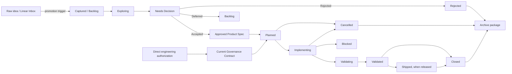

# Product Documentation Workflow

Document status: Current
Updated: 2026-07-12
Authority: 本仓库需求、讨论、决策、产品设计、开发执行、验证与归档/删除的唯一文档治理规则。

## 目标

`docs/` 是已晋升产品工作的 repo-local system of record。原始 PA idea 默认可以只停留在 Linear inbox：它尚未进入版本候选、产品决策、跨会话研究或执行，因此不分配 `B-xxx`，也不构成当前产品权威。一旦触发任一晋升条件，必须建立 repo-local Backlog/Discovery/Decision/Spec 入口；Chat、Linear、Issue、邮件或本机 Memory 此后只能作为输入渠道或镜像，不能替代仓库内状态。

这套 workflow 要让用户和 Agent 始终能回答：

1. 为什么要做，需求来自哪里？
2. 讨论过什么，谁决定了什么，为什么？
3. 当前产品契约与技术契约是什么？
4. 正在做什么，做到哪一步，证据在哪里？
5. 完成、拒绝、取消或替代后，信息去了哪里？

核心原则：

- 一个状态只有一个权威来源。
- 结论优先于聊天转录，稳定契约优先于过程日志。
- 用最轻的 lane 覆盖工作，不为窄修复制造整套 SDD。
- 删除前必须证明独有信息已被吸收；不能证明就归档。
- Archive 保存原因和证据，但不继续驱动当前实现。

## 低负担 Agent 入口

默认由 [`pa-docs-lifecycle-manager`](../../.agents/skills/pa-docs-lifecycle-manager/SKILL.md)
接收用户的自然语言想法、反馈、决定和开发意图。用户不需要选择 lane、记住
ID、指定文档路径或维护状态；Agent 负责查重、建档、同步、验证与归档，只在
产品价值、范围、优先级、风险接受或实现/Git/release 授权确实需要用户判断时，
一次提出一个问题。

自然语言边界固定为：

- “记录/有个想法”默认只进入 Linear inbox，不创建 `B-xxx`，不自动开发。
- “先讨论/分析/规划”可以先做当次澄清；需要产品决策、进入版本候选或跨会话研究/执行时，先晋升为 Backlog，再停在对应的 Discovery、Decision、Spec 或 Plan 阶段。
- “实现/落地/修复”才授权 runtime 修改，但不自动授权 commit。
- “完整做完/收尾”才继续到 Closeout 与 Archive。
- commit、push、tag、publish、release 始终需要明确授权。

该 skill 负责晋升后的文档路由；复杂实现继续复用 `sdd-lifecycle`。
`pa-linear-product-manager` 负责 raw idea inbox，并镜像已晋升事项的外部状态；raw
idea 尚不是批准需求，晋升后则以 repo docs 为权威。以下规则仍是 Agent 的执行标准，
不是要求用户记忆的操作手册。

## 工作类型路由

| Lane | 适用场景 | 必需文档 | Stop point |
| --- | --- | --- | --- |
| L0 Fast change | 恢复既有契约的窄 bug、文案/文档维护、单点低风险修复 | 受影响代码 + focused regression test 是默认 durable evidence；行为契约变化时更新现有 Product/Architecture/Governance | 验证后结束；不新建 Product Spec/SDD/Tracker |
| L1 Discovery / Decision | 已从 Linear inbox 晋升，需要产品决策、版本候选、跨会话研究或方案比较 | Backlog ID；需要跨会话讨论时创建 Discovery Brief；重要结论创建 Decision Record | Accepted 后进入 Spec；Deferred 回 Backlog；Rejected/Cancelled 归档或删除 |
| L2G Engineering governance / tooling | repo docs lifecycle、Agent workflow、checker、CI/release tooling 或工程授权边界，且不改变 PA runtime/用户行为 | `GOV-xxx` Current Governance Contract；多文件或需跨会话执行时建立 Active Package | 完成实现、验证与 closeout；不创建 Product Decision/Spec |
| L2 Feature | 已批准、会改变用户行为或涉及多个模块的 feature | Accepted Decision、Product Spec、Active Package | 完成实现、验证与 closeout |
| L3 Cross-cutting / Release-sensitive | PA 架构、数据/隐私、安全、共享 runtime、迁移、产品 packaging/release 行为或 UI 生命周期 | L2 全部内容，并要求完整 SDD、风险/回滚、review、smoke/release gate | 所有要求的验证与 closeout 完成 |

只有新增或改变 PA runtime、用户行为、数据/权限/隐私、Obsidian UI 或产品生命周期时，才进入 L2/L3 Product Decision + Product Spec 链。纯 repo governance/tooling 即使跨多个文档、Skill、checker 或 CI，也使用 L2G；若实施中触碰上述产品边界，必须停止 L2G 并升级到 L2/L3。用户可以直接授权 engineering bootstrap 并分配 `B-xxx`，此时记录 `User direct authorization`，不得伪造成 Linear raw-idea promotion。

## 权威文档地图

| Artifact | 回答什么 | 当前路径 | 生命周期 |
| --- | --- | --- | --- |
| Roadmap | 哪些产品方向有优先级 | `docs/development-roadmap.md` | 只写方向和顺序，执行状态链接 Backlog/Tracker |
| Backlog | 哪些事项尚未开始、延期或等待条件 | `docs/backlog.md` | 只保存 unresolved item 与稳定 ID |
| Discovery Brief | 需求、证据、讨论摘要、选项与待决策项 | `docs/development/discovery/<slug>.md` | Exploring/Needs Decision 时活跃；结论吸收后归档或删除 |
| Decision Record | 接受、拒绝、延期或替代了什么，以及原因 | `docs/product/decisions/` | Accepted 决策长期保留；Rejected/Superseded 转历史证据 |
| Product Spec | 用户行为、范围、非目标与验收标准 | `docs/product/specs/` | 行为仍有效时长期保留 |
| Governance Contract | repo workflow/tooling 如何工作、authority 与 fail-closed 边界 | `docs/development/governance/` | Closed 且规则仍有效时长期保留；Cancelled/Superseded 转年度直属 Archived GOV record；不用 Product Decision/Spec 承载 |
| Feature Home | 该 track 的一页式状态与所有入口 | `docs/development/active/<feature>/README.md` | Active Package 的入口；closeout 后随包归档 |
| Plan | 交付 phase、依赖、风险、stop point | Active Package `plan.md` | 开发期活跃，closeout 后归档 |
| SDD | 接口、数据流、安全、迁移、回滚与 test matrix | Active Package `sdd.md` | L2/L3/L2G 开发期活跃，closeout 后归档 |
| Tracker | 唯一执行状态、finding、验证与 traceability | Active Package `tracker.md` | 当前执行权威，closeout 后归档 |
| Architecture | 当前代码如何工作 | `docs/architecture/` | 与代码同步的长期契约 |
| Guide / Operations | 用户如何使用、团队如何发布和观测 | `docs/guides/` / `docs/operations/` | 当前操作仍有效时保留 |
| Closeout | 最终结果、验证、遗留项和信息 disposition | Active Package `closeout.md`，完成后归档 | Closed/Cancelled track 的历史入口 |
| Archive | 已完成、已替代、冻结证据与历史决策 | `docs/archive/` | 只用于溯源 |

产品链权威优先级为：North Star → Accepted Decision → Approved Product Spec → Current Architecture → Active SDD/Tracker → 代码与验证证据。Engineering governance/tooling 链为：用户明确授权 → Current Governance Contract → Active SDD/Tracker → checker/测试/执行证据。两条链不能互相冒充；代码与 owning contract 冲突时视为 drift，必须校准。

## 标准状态机



上图的 Raw → Decision → Product Spec 是产品链；L2G 可由用户直接 engineering authorization 建立 `B-xxx` + Current Governance Contract 后进入 Planned，不声明 Linear promotion，也不经过 Product Decision/Spec。

文档状态与交付状态分开记录：

- `Document status`: `Draft | Approved | Current | Superseded | Archived`
- `Delivery status`: `Captured | Exploring | Needs Decision | Planned | Implementing | Validating | Validated | Shipped | Blocked | Rejected | Cancelled | Closed`

每次状态迁移必须更新日期、决策/执行 authority、原因与下一权威入口。`Validated` 只表示证据门通过，`Shipped` 需要真实 release 证据，`Closed` 表示 closeout 已完成。

## 1. Capture 与 Backlog

Backlog 接收已经晋升的 product work，不承担 raw idea inbox。创建 `B-xxx` 前先搜索重复项；当事项需要产品决策、进入版本候选、跨会话研究或执行时，分配稳定 ID 写入 [Backlog](../backlog.md)。一条 Backlog 至少包含：问题/结果、当前边界、下一步或启动条件、来源/依据；从 Linear 晋升时记录原始 intake 链接或 ID，不需要为了制造链接而提前创建 Discovery。

- 原始 PA idea 先写入 Linear inbox，不创建 `B-xxx`；它可以在未晋升时继续收集反馈或被去重/关闭。
- 晋升触发器只有四类：需要产品决策、进入版本候选、需要跨会话研究、或准备进入执行。任一触发后必须先建立 repo-local Backlog authority。
- 当次即可完成且不改变契约的 L0 修复，不必创建 Backlog。
- Linear/Issue 在晋升后只镜像状态；影响范围、优先级、决定或实现的结论必须回写 repo docs。
- Backlog 不是设计文档；复杂讨论不要塞入表格。
- Backlog ID 在进入 Active 时可从 Backlog 删除：Product track 必须已同时进入 Accepted Decision、Approved Product Spec 和 Feature Home；L2G 必须已进入 Current Governance Contract 和 Feature Home。最终 Closeout 继续保留该 ID；Rejected/Cancelled 项只有在 owning contract/Closeout 记录最终去向后才能删除。

L0 的证据落点固定为“受影响代码 + focused regression test”；commit/PR 只是运输与 review 载体，不是另一个产品权威。如果没有可自动化测试，必须在 commit/PR 或当次交付说明记录精确复现与验证步骤；未授权 commit/PR 且需要跨会话继续时，创建 Backlog ID 保存复现、预期与下一步。

## 2. Discovery、讨论与 Proposal

需要跨会话研究、讨论或方案比较时，使用 [Discovery Brief template](./templates/discovery.md) 创建 `docs/development/discovery/<slug>.md`，并从 Backlog 与 [Discovery index](./discovery/README.md) 双向链接。

Discovery Brief 只保留：

- 用户问题、来源与成功结果。
- 已验证事实、推断、未知项和研究证据。
- 候选需求与选项比较。
- 按日期压缩的讨论结论、分歧与待决策项。

聊天逐字稿、重复 research dump、临时截图清单不是长期文档。结论已进入 Decision/Product Spec/Backlog 后，没有独立证据价值的原始过程应删除。

`docs/development/proposals/` 只用于已经形成完整边界、但尚未获准进入产品或 runtime 的长期 proposal。Proposal 必须有 Backlog ID、重启条件和明确的 `not approved` 状态；批准后转 Product Spec/Active Package，拒绝或失效后归档。

## 3. Decision

本节只适用于 PA 产品、runtime、数据/隐私、用户行为或产品 Architecture 的长期决定。纯 repo governance/tooling 选择进入 `GOV-xxx`，不创建 Product Decision。

以下产品结论必须记录 Decision：改变产品范围或 North Star 解释；在多个方案中选择；接受安全/隐私/兼容性风险；延期、拒绝、取消或替代重要产品工作；形成跨 feature 的长期产品约束。

1. 使用 [Decision template](./templates/decision.md)，分配唯一 `DEC-xxx`。
2. 写清 Context、Options、Decision、Consequences、Revisit trigger 与 authority。
3. Accepted 决策放在 `docs/product/decisions/` 并更新 [Decision index](../product/decisions/README.md) 与 [Active Decision Register](../product/active-decisions.md)。
4. Deferred 决策把执行状态放回 Backlog；Decision 只保存选择和原因。
5. Rejected/Superseded 决策若有长期解释价值则归档，否则在结论被吸收后删除。

小而明确、没有备选方案或长期后果的决定可以只写入 Active Decision Register；不能因此省略重要取舍的 rationale。

## 4. Product Spec

用户批准产品范围后，使用 [Product Spec template](./templates/product-spec.md) 创建或更新 `docs/product/specs/` 中的 durable contract。

- 每个要求和验收标准用 Work item 命名空间，例如 `B-123/REQ-01`、`B-123/AC-01`，避免多个 Spec 都出现无法区分的 `REQ-01`。
- Spec 必须链接来源 Backlog、Discovery 与 Accepted Decision。
- 只描述产品行为、边界与验收；不记录 task 顺序、测试输出或 commit 日志。
- 未批准想法不能用 Draft Spec 绕过 Discovery/Decision。
- 纯 engineering governance/tooling 不创建 Product Spec；使用 [Governance Contract template](./templates/governance-contract.md) 与 [Governance index](./governance/README.md)。只有改变 PA runtime 或用户行为时才进入本节的产品链。

## 5. Active Development Package

L2/L3 或需要跨会话执行的 L2G 进入 planning 时，先在 `docs/development/active/<feature>/` 建立：

```text
README.md    # 一页式状态、authority 和入口
plan.md      # phase、范围、依赖、风险、stop point
tracker.md   # 唯一执行状态、finding、验证与 traceability
sdd.md       # 进入 SDD phase 后创建；实现前必须 Approved
```

使用 [Templates](./templates/README.md) 并在 [Active Registry](./active/README.md) 登记。L0/L1 不创建空壳 Active Package。

- Feature Home 必须能一眼看到 Work item、owning contract（Product track 的 Decision + Product Spec，或 L2G 的 Governance Contract）、derived delivery status、当前 phase、下一步和 stop point。
- Tracker 是 delivery status 与执行状态唯一权威；Feature Home/Active Registry 只显示 derived mirror，`docs:check` 必须强制一致。Plan/SDD 不维护完成百分比。
- `Design status: Not started` 的 plan-only package 可以没有 `sdd.md`；`Draft`/`Approved` 必须存在 SDD，进入 `Implementing` 前必须为 `Approved`。
- SDD test matrix 必须映射 `REQ/AC`，Tracker 的验证证据必须回链相同 ID。
- Product scope 改变时先更新 Decision/Product Spec；governance/tooling contract 改变时先更新 `GOV-xxx`。随后再更新 SDD/Tracker 和实现。

## 6. Delivery 与验证

每个行为 slice 循环：

```text
implement → focused validation → review → fix → verify
```

需要 app-runtime 信心时，再执行 `make deploy → Obsidian smoke → fix`。Docs-only 或 L0 工作可以跳过 smoke，但必须在 Tracker、PR 或最终报告写明原因。

| 事件 | 必须更新 |
| --- | --- |
| 需求或用户行为改变 | Decision（如有取舍）→ Product Spec → SDD/Tracker |
| 技术契约改变 | Architecture → SDD/Tracker |
| Engineering governance/tooling 改变且不触碰 PA 行为 | Governance Contract → SDD/Tracker |
| 新 finding | 当前 Tracker；跨 track/延期时进入 Backlog |
| 用户批准/拒绝/延期 | Decision → Active Register / Backlog / Archive |
| 实现完成但未验证 | Delivery status = `Validating`，不能写 `Closed` |
| 验证完成但未发布 | Delivery status = `Validated`；release 状态保持独立 |
| 已真实发布 | Roadmap/CHANGELOG/Operations 证据 → `Shipped` |

## 7. Closeout、归档与删除

实现完成、取消或被替代时，使用 [Closeout template](./templates/closeout.md) 创建 `closeout.md`。Closeout 必须完成：

1. 对齐实际行为、owning contract（Decision/Product Spec 或 Governance Contract）、Architecture（适用时）、Plan、SDD 与 Tracker。
2. 记录 focused checks、review、smoke/release 证据和未解决风险。
3. 把仍未完成的工作压缩成 Backlog，写明启动条件和历史依据。
4. 为该 track 实际创建或使用的每份过程 artifact 逐项填写 disposition：`durable contract | backlog | archive | delete-after-absorption`。至少逐行枚举 Feature Home、Plan、Tracker、实际存在的 SDD、review/verification 记录、handoff 与临时日志；不得用目录通配符或一句“全部归档”替代逐项去向。
5. 删除项必须写明被哪个当前文档、Backlog 或 Closeout 吸收。
6. 移动前确认目标 `docs/archive/<year>/<feature>/` 不存在。若目标已存在，必须 fail closed：停止移动并人工判定是否为同一 package、重复 closeout 或 slug 冲突；禁止覆盖、目录合并或自动改名后继续。
7. 将包内文档的 `Document status` 更新为 `Archived`，Feature Home/Tracker/Closeout 更新为一致终态，再将整个包移动到 `docs/archive/<year>/<feature>/`；该路径与 Active Package 深度一致，内部相对链接可保持稳定。
8. 更新 Active Registry、年度 Archive index、总 Archive index 和仓库引用。

终态 authority 必须与实际结果一致：

- `Closed` Product track：已交付契约继续由 `docs/product/decisions/` 中的 Accepted Decision 与 `docs/product/specs/` 中的 Approved/Current Product Spec 管理；归档包只链接这些当前 authority。
- `Closed` L2G track：已交付工程规则继续由 `docs/development/governance/` 中的 Current Governance Contract 管理；归档包链接该 `GOV-xxx`，不得补造 Product Decision/Spec。
- `Cancelled` Product track：不得把未交付契约继续伪装成 current。将 Rejected Decision 与 Cancelled Product Spec 作为年度目录直属记录移到 `docs/archive/<year>/`，两者均标记 `Document status: Archived`，由 Feature Home、Closeout 与年度 README 链接。
- `Cancelled` L2G track：将未交付 Governance Contract 改为 `Document status: Archived` + `Delivery status: Cancelled`，作为年度直属 `docs/archive/<year>/gov-xxx-<slug>.md` 移出 Current Governance index；Feature Home、Closeout、完整归档 package 与年度 README 都链接该 record。
- `Superseded` Product track：将 Superseded Decision 与 Superseded Product Spec 作为年度目录直属记录归档，并链接 successor authority（若存在）。
- `Superseded` L2G track：将旧 Governance Contract 改为 `Document status: Archived` + `Delivery status: Superseded`，作为年度直属 `gov-xxx-<slug>.md` 归档，移出 Current Governance index，并必须链接一个新的 Current successor GOV；没有 successor 时使用 `Cancelled`，不得标记 `Superseded`。

归档后至少保留实际创建的 `README.md`、`plan.md`、`tracker.md` 与 `closeout.md`。只有进入过 SDD phase 的 track 才保留 `sdd.md`；不得为 plan-only Cancelled track 补造空 SDD。L0 没有 Active Package，不需要为了归档而补造这些文件。

未进入 Active Package 的 Rejected/Cancelled Discovery 或 Decision 作为单文件移动到 `docs/archive/<year>/<slug>-discovery.md` 或 `docs/archive/<year>/<decision-id>-<slug>.md`，标记 `Document status: Archived` 与终态，并由年度 README 索引；不要把它伪装成完整 feature package。

年度目录直属的 Discovery、Decision、Product Spec 或 Governance Contract record 只代表该 record 本身，不能代表或替代 package。任何曾进入 Active Package 的 track，无论终态为 Closed、Cancelled 还是 Superseded，都必须保留实际创建的完整 package 与 Closeout；Cancelled/Superseded 的年度直属终态记录由 package 链接，不得用它们省略 package 归档。

### 必须归档

- 独有的需求/决策 rationale、重要 rejected option、迁移/回滚设计。
- 最终验证、review、安全、发布或事故证据。
- 后续需要解释当前实现为何如此的历史上下文。

### 可以删除

- 已被 Tracker/Closeout 吸收的逐轮 task/review/verification 日志。
- 已被 Decision/Product Spec 吸收的讨论逐字稿和重复 research dump。
- 重复 checklist、临时 baseline、无独有结论的生成物。

删除或吸收的 tracked Markdown 必须登记在 [Disposition Log](../archive/disposition-log.md)。无法证明信息去向时，选择归档。

## 状态头与模板

所有新 Discovery、Decision、Product Spec、Governance Contract、Active Package 和 Closeout 使用 [Templates](./templates/README.md)。至少记录：

```text
Document status: <...>
Delivery status: <... when applicable>
Updated: YYYY-MM-DD
Work item: B-xxx
Authority: <what this document controls>
```

Decision 另用 `Decision ID` / `Status`；Active Package 另需 Product Spec、Decision、Tracker 等精确链接。旧文档无需一次性机械迁移；下次实质修改时按新模板校准。

## 查找与更新顺序

1. [docs/index.md](../index.md)
2. [Development Roadmap](../development-roadmap.md) 与 [Backlog](../backlog.md)
3. [Discovery index](./discovery/README.md) / [Decision index](../product/decisions/README.md)
4. 对应 Product Spec / [Governance Contract](./governance/README.md) 与 Architecture
5. [Active Registry](./active/README.md) → Feature Home → Tracker
6. 仅在需要历史原因时进入 [Archive](../archive/README.md)

推荐使用稳定 ID 或 feature slug 搜索：

```bash
rg -n "B-[0-9]+|DEC-[0-9]+|B-[0-9]+/(REQ|AC)-[0-9]+|<feature-slug>" docs
```

## 验证门

文档新增、移动、closeout 或删除后至少运行：

```bash
npm run docs:check
git diff --check
rg --files docs -g '*.md'
```

`docs:check` 必须验证：

- Markdown 链接和纯文本 repo path 存在。
- 当前文档按完整路径从对应 index 可达，不使用 basename 猜测。
- Active Package 完整、已登记、状态合法且没有 Closed/Cancelled 残留。
- Discovery 与 Decision 有 metadata、唯一 ID 和 repo-local authority。
- Backlog ID 唯一，Archive package 不重名，年度索引完整。
- 被删除的 Markdown 有移动目标或 Disposition Log 记录。

本地默认以 `HEAD` 检查未提交删除；CI 通过 `DOCS_CHECK_BASE` 指向 PR/push 基线，验证已提交的移动与删除。

Docs-only 变更无需运行 Jest、Build 或 Obsidian smoke；若同时修改 runtime、release automation 或 UI，按 `AGENTS.md` 和对应 workflow 补充验证。
