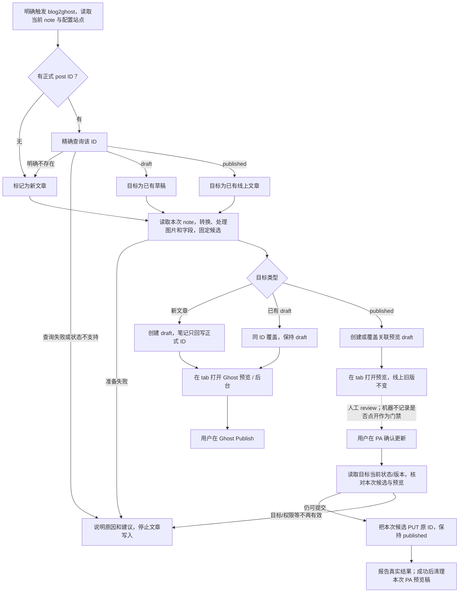

# blog2ghost 精简优化方案

Document status: Approved
Updated: 2026-10-06
Work item: B-163
Authority: [DEC-053](../product/decisions/dec-053-lean-ghost-publishing.md) 与 [Product Spec](../product/specs/pa-ghost-blog-publishing-product-spec.md) 下的完整目标方案。本文复用原设计路径，描述下一次改造；不宣称当前代码已经实现，也不授予实施或 Git/release 权限。

## 1. 目标与已确认边界

**从当前 Obsidian note 同步完整内容，打开真实 Ghost 页面人工 review，人工决定上线。**

| 情况 | PA 准备 | 人工上线 |
| --- | --- | --- |
| 无 ID，或 Ghost 明确确认该 ID 不存在 | 新建 draft，笔记只回写正式 post ID | Ghost Publish |
| 原 ID 为 draft | 全量覆盖受管内容，保持原 ID 和 draft | Ghost Publish |
| 原 ID 为 published | 新建/覆盖对应 PA 预览草稿，原文章保持在线 | PA“确认更新线上文章”，PUT 原 ID、保持 published |
| 查询失败或非本流程支持的状态 | 解释具体原因及建议，停止写入 | 不自动新建或转换状态 |

正常草稿写入不再追加“是否覆盖”。已发布文章只保留最后一次人工上线确认，不 Unpublish。
不开发编辑器、Ghost 后台替代品或浏览器自动填表。URL 深链负责打开指定文章，
不能自动把另一份草稿的内容送进原文章编辑器；因此已发布文章的最后一笔 API 写入由 PA 执行。

用户此次明确取消：Ghost 手工正文/排版保留、冲突合并、自动预览检查、Undo、持久恢复阶段、
中断/重启续接、跨设备协调、历史完成记录作为准入前提。内容/媒体支持不缩减。

## 2. 完整流程



图中的失败出口按已发生效果解释：图片已上传、Ghost 已保存、本地关联失败不能统称为
“没有执行”。具体规则见第 7 节。

### 新文章与已有草稿

- 查询在文章写入之前完成；普通 404 网页、错误 API 地址、401/403、网络失败及不完整
  响应不能当作 Ghost 已确认该 post 不存在。
- 新建成功以返回 ID 为正式关联，只回写 `GHOST_ID`；URL 用于展示，不写入笔记。
  原 ID 确认不存在时，允许新建成功后替换旧 ID，失败时保留旧关联。
- 已有草稿直接 PUT 受管内容，带 Ghost 要求的 updated_at，保持 draft 和已有 URL。
- 成功卡片提供真实预览与后台入口。PA 不轮询等待用户 Publish；下次明确使用时再读真实状态。

### 已发布文章

1. 读取原文章 ID、状态、URL 与必要运营/渲染信息；不读取旧 PA baseline 作为更新前提。
2. 从本次 note 构造完整受管内容，存为对应预览 draft。每篇原文章最多关联一个可复用
   PA 预览 ID；复用前精确读取，确认站点、关联对象及其 draft 身份。
3. 卡片显示“更新稿已准备，线上原文尚未被 PA 修改”；打开真实 Ghost 预览 URL。
4. 用户点击“确认更新线上文章”。这是针对明确原文章与本次候选的一次确认，不叠加
   机器预览检查或第二个等价确认弹窗。
5. 读取原文章最新状态与 updated_at，核对当前权限/连接及预览仍对应本次候选。原文章
   不存在或不再 published 时停止旧确认、提示重新同步；不借旧确认新建/重新 Publish。
6. PUT 固定候选的受管字段，原 ID、URL 和 published 状态保持；非管理运营字段不覆盖。
   Ghost 若报告实际版本碰撞，明确说明并停止本次提交，不循环自动写入。
7. 先交付已确认的更新结果，再清理本次 PA 预览 draft；清理失败单独提示。

原文章在 review 期间发生受管正文编辑，不触发旧三方合并：Owner 已选择 note 覆盖。
提交前读取最新 API 版本不等于重新比较历史正文。预览稿被手工更改则不能拿它当作
本次候选的 review，应提示重新同步；不吸收 Ghost 编辑到候选。

## 3. 内容与字段

字段的唯一产品定义见 [Field Policy](../product/specs/pa-ghost-blog-publishing-product-spec.md#field-policy)。

- 正文、标题、发布标签、封面、摘要和 SEO 描述由本次 note 与本次合法生成结果完整决定。
  可选受管字段缺失时主动发送空值/空数组清除，不以省略参数保留远端旧内容。
- 自动字段范围固定：缺失的摘要、SEO 描述；新文章缺失的 slug。人工值优先；明确清空
  阻止自动补齐。每次重新同步可重新生成缺失字段，不再需要“重新生成摘要”独立流程。
- 已有 slug/URL 不随标题修改而改变。现有草稿要改 URL，直接在 Ghost 后台完成；
  后续查询接受平台实际 URL，不把它误判为文章身份冲突。
- 作者、访问范围、发布时间、主题模板和非 PA 注入保持；临时稿按必要运营字段保持
  review 的站点呈现，最终 PUT 不扩大管理范围。站点级配置不写入。
- 保留当前正文清理、显式嵌入、普通双链、Lexical、图片及渲染 recipe。图片完整性、
  来源排除和真实转换错误仍检查；自动视觉探针退役不改变支持范围。
- 普通双链不再读取 completed record/checksum：仅读取本次明确链接且获准目标的
  `GHOST_ID`，在当前配置站点核实 published 状态及真实 URL；不读取旧关联字段，
  不要求 UID/site/URL。不展开或外发目标正文，
  不扫描历史或接管文章。未关联、缺失、查询失败或无法确认时保留可见文字并提示。
  这是辅助链接的可读降级，不改变本次发布目标查询失败必须停止文章写入的规则。
- 同站可用图片 URL、本次相同内容去重复用不依赖历史 baseline；不为跨次资源缓存另建
  历史账本，也不删除已上传图片来模拟事务回滚。

## 4. 校验收敛

| 保留的边界检查 | 目的 | 删除的旧前置 |
| --- | --- | --- |
| 真实来源身份、当前外发权限、显式嵌入/图片范围 | 不读取或发送未经准入内容 | 用无关 vault 变化或全局 epoch 相等代替当前权限判断 |
| 配置站点 + note 的 exact post ID + 远端状态 | 定位正确对象、区分不存在和查询失败 | UID/site/URL 成套属性前置、completed record 必须存在、跨设备完成记录、全库归属扫描 |
| 内容可转换、图片可用、字段合法 | 不悄悄丢内容或提交无法解析的 payload | 远端手工排版保留、三方基线比较、语义 block 对齐 |
| 当前候选与预览对应 | 人工确认提交 review 的内容 | 自动 probe、DOM/脚本断言、活 tab 票据、检查 nonce/计时器 |
| published 人工确认及 API updated_at | 明确上线动作、处理真实请求碰撞 | 预览必须自动验证通过、额外恢复确认 |
| 取消、连接变化、同目标并发与返回身份/状态 | 避免已取消动作继续执行或重复点击重发 | Ghost 专用持久阶段/补偿队列、后置 guard 抹掉远端成功 |

**候选语义：**准备时固定本次实际读取并转换的内容。之后编辑主 note、嵌入或图片，
不会在确认时偷偷换入新版；用户要包含新修改就再次同步。该选择不解除当前来源权限：
权限撤销、取消或连接变化仍阻止尚未发送的动作。准备过程中各依赖读取需保持一致，
防止混用正在修改的不同内容；只核对实际参与本次准备的依赖，PA 关联属性不属于文章内容。

独立预览稿的版本核对只用于确认当前 URL 对应当前候选，不比较历史发布快照，不恢复
旧 ticket/scope。发送后拿到可信 Ghost 成功响应，后续本地来源变化也不能改变既成事实。

## 5. 最小数据与职责

| 数据 | 生命周期与用途 |
| --- | --- |
| 正式关联 | 只识别和写入 note 的 `GHOST_ID`；不再生成或要求额外 note UID、site、post URL，不兼容旧字段 |
| 站点与文章当前信息 | 站点来自 PA 配置；按 ID 查询 status、url、uuid、updated_at，只用于本次操作，不重复持久化到 note |
| 预览资源指针 | 只含站点、原 post ID、PA preview ID 等资源定位；复用现有本机存储接口中的轻量记录，不保存内容、阶段、确认或执行日志，不自建同步；preview ID 永不替换 note 的正式 ID |
| 本次候选与结果 | 当前会话内保存完整受管 payload、真实来源身份/权限依据、目标身份/版本、预览身份/版本、必要 busy/取消信息及真实效果回执 |
| 历史数据 | 不再读写 Ghost completed/Undo/operation 数据来驱动新流程；既有数据留原处，不批量清理 |

关联字段规则由 [Association Metadata](../product/specs/pa-ghost-blog-publishing-product-spec.md#association-metadata)
统一定义。新笔记示例：

```yaml
GHOST_ID: 6ac4f4e0910d6f00010bb89b
```

ID 只定位文章，不编码发布状态和链接。单字段方案限当前配置目标站点；切站需明确重新
关联，不承诺从 ID 自动辨认旧站点，也不另建隐藏的笔记站点历史。来源文件身份仍由
现有来源机制负责，不为发布关联再生成一个 UID。

资源指针只是避免重复建预览稿。新触发总是读取当前 note、重新准备并重新确认，不因
指针存在恢复旧动作；资源已不存在就按明确事实创建新预览，身份/状态不符则说明问题，
不自动删除或接管别的文章。无指针时不扫描全站旧草稿找“可能的候选”。

当前会话失败后仍保留已知远端 ID 与真实结果，避免因本地关联尚未成功再次 POST。
关闭/重启不承诺续接；旧 Chat 卡片保留信息和链接，但旧确认不能继续执行。

| 决策/动作 | Owner 与事实依据 | 输出 |
| --- | --- | --- |
| 用户意图、选源歧义、错误解释 | 主 Agent；真实请求和返回事实 | 明确来源或必要澄清，不用 Host 关键词猜测 |
| 准备/确认的能力与来源准入 | 既有 Host/harness；当前权限、真实文件/连接与取消状态 | 当前授权作用域，不用全局观察时效代替权限 |
| 转换、字段、目标查询和写入 | Ghost domain；本次候选、精确响应、API 版本 | 草稿/预览/更新事实及 ID/URL |
| 人工上线 | 新文在 Ghost；已发布更新在 PA 明确 UI 动作 | 绑定本次候选和原 ID 的确认，不由模型参数伪造 |
| 结果入 Chat/context | 复用现有领域回执与结果事实通道 | 保存成功、局部失败、确实未知分别表达，不新增第二本 ledger |

遵循 [Command Architecture Contract](../architecture/pa-agent-architecture-plan.md#command-architecture-contract)。
Ghost 来源时效修正只影响其真实调用边界；不得因此关闭其他领域的撤销、来源或效果保护。

## 6. UI 与 URL

| 场景 | 主文案 | 主要操作 |
| --- | --- | --- |
| 草稿保存成功 | 草稿已保存，请在 Ghost 审阅并发布 | 打开预览；在 Ghost 编辑 |
| 已发布文章候选准备完成 | 更新稿已准备，确认后才更新线上文章 | 打开预览；确认更新线上文章 |
| 已发布文章更新成功 | 文章已更新 | 查看文章；按需打开 Ghost 编辑 |
| 可处理错误/局部失败 | 具体失败对象、已发生效果、对应建议 | 已知有效入口；重新同步作为次级动作 |

- 预览按钮只在 tab view 打开真实 Ghost URL。页面载入失败就是打开失败，不能回写成
  “草稿保存失败”；没有自动检查通过标识，不隐式打开另一套后台探针。
- Ghost 后台直接使用配置站点对应的 `/ghost/#/editor/post/{id}`；新文/草稿打开自身 ID，
  published 的后台入口打开正式 ID。预览稿不以“发布这篇文章”的入口引导。
- 公开文章使用查询返回的 `url`；草稿预览复用现有 URL helper，以返回的 `uuid` 生成
  `/p/{uuid}/`。post ID、uuid 与 slug 不混用；这些链接不作为 note 的持久关联属性。
- 不要求用户向 PA 证明已浏览预览，不以浏览器可见性和历史按钮点击作确认条件。
- 保留既有卡片可访问性、键盘、忙碌反馈与作用域样式；减少动作不靠隐藏有效错误。
- 移除 Continue、Restore、Replace all、Check preview、Check published、独立摘要再生成
  及 PA 改 URL 的专门状态；重新同步走原入口或次级按钮。

## 7. 错误与资源收尾

| 结果 | 必须表达的事实 | 行为 |
| --- | --- | --- |
| 查询/准入未发送文章写入 | 尚未保存，具体原因 | 给检查站点、网络、Admin Key 或来源的对应建议 |
| 准备部分成功 | 例如图片已上传，但转换/生成未完成 | 不报告文章就绪，不补偿删除共享图片 |
| Ghost 已确认写入，本地关联失败 | 草稿/文章已保存，关联保存失败 | 展示真实 ID/入口，当前动作复用已知 ID |
| 明确 API 拒绝 | 请求失败及真实原因 | 不伪装为成功，不无条件新建替代文章 |
| 请求已发出，响应丢失 | 保存结果未确认 | 已知 ID 可做一次有界只读核实；无可靠 ID 引导后台核实；不自动重发 |
| 原文章更新成功，预览删除失败 | 更新成功、预览稿尚未清理 | 附资源入口；无恢复队列、无重复 PUT |
| 取消或来源/连接变化 | 已完成部分与尚未执行部分 | 停止后续发送，已知远端结果不变 |

只有真实写入已发送且无法确定结果时才使用“结果未确认”。删除来源时效误判不等于承诺
网络永远可确认；同时不以“简化错误处理”为由重放未知 POST/PUT。

清理只针对确认属于本次 PA 预览资源且仍为 draft 的 exact ID，不能删除正式文章。
清理前必要身份/状态核对不扩展为历史内容合并、站点扫描或跨设备锁。失败资源由用户
看到具体入口；不建立维护中心、后台重试或定时垃圾回收。

## 8. 改造范围与原实现的差异

以下以 2026-10-06 改造前的源码为对照，描述本次范围；实际完成状态和证据由
[B-163 Tracker](./active/lean-ghost-publishing/tracker.md) 维护。

| 模块 | 改造内容 |
| --- | --- |
| [exporter](../../src/ghost-publishing/exporter.ts)、[markdown-exporter](../../src/ghost-publishing/markdown-exporter.ts)、[source-cleanup](../../src/ghost-publishing/source-cleanup.ts)、[resources](../../src/ghost-publishing/resources.ts)、[recipe](../../src/ghost-publishing/recipe.ts) | 复用完整转换、图片、清理与渲染能力，解除对历史 baseline 的资源依赖 |
| [fields](../../src/ghost-publishing/fields.ts)、[snapshot](../../src/ghost-publishing/snapshot.ts)、[action-context](../../src/ghost-publishing/action-context.ts) | 完整受管 payload；缺失字段清除/生成；删除远端旧 metadata 回填和 baseline 三方合并 |
| 原 format-preservation 模块 | 退役 Ghost 手工内容保留路径，按实际依赖删除专用代码 |
| [service](../../src/ghost-publishing/service.ts)、[state-schema](../../src/ghost-publishing/state-schema.ts)、[state-store](../../src/ghost-publishing/state-store.ts) | 三种主路径 + 当前候选/结果 + 资源指针；删除专用恢复 journal、completed record、Undo 与 refresh/repairRecord 续接 |
| [binding](../../src/ghost-publishing/binding.ts)、[binding-properties](../../src/ghost-publishing/binding-properties.ts) | 仅 `GHOST_ID` 读写；移除额外 UID、成套属性准入及旧字段解析/迁移路径；无该字段按新文章处理，精确原 ID 不存在后允许新 ID 替换；不改正文/内容字段/其他属性 |
| [wiki-links](../../src/ghost-publishing/wiki-links.ts) | 取消对 completed record/checksum 和历史 UID 归属的依赖；按同一单字段规则读取获准目标 ID，在配置站点查询真实状态/URL，无法确认则保留文字提示 |
| [preview](../../src/ghost-publishing/preview.ts)、[controller](../../src/ghost-publishing/controller.ts)、[card](../../src/ghost-publishing/card.ts) | 直接 tab URL；删除探针与 ticket/计时器；精简按钮；真实状态/结果反馈 |
| [host-integration](../../src/ghost-publishing/host-integration.ts)、[task-source-constraint](../../src/ai-services/task-source-constraint.ts)、[result-facts](../../src/ai-services/pa-agent-result-facts.ts) | Ghost 选择 Host 已有的真实来源权限回执；其他工具的时效规则保持。保留已确认领域效果，不因后置检查失败丢掉成功事实 |

不为新的简单流程换一套通用框架，也不只隐藏按钮而保留全部旧恢复分支。
源码、测试与当前契约一起调整；旧测试若仅断言已撤销产品规则，应按新 REQ/AC 修订，
不是为了让失败测试通过而改变仍正确的权限或发布断言。

### External Evidence

- [Ghost Post API](https://docs.ghost.org/admin-api/posts/overview)：支持按 ID 精确查询，返回
  status、url、uuid、updated_at；单 ID 足以从当前配置站点读取操作所需信息，无须回写整套属性。
- [Ghost Admin API 更新](https://docs.ghost.org/admin-api/posts/updating-a-post)：更新需要 updated_at；
  save_revision 是更新时保存修订，不是把新版隔离等待上线。
- [Ghost v6.65.0 编辑器](https://github.com/TryGhost/Ghost/blob/v6.65.0/apps/ember-admin/app/controllers/lexical-editor.js#L282-L324)：
  自动保存只对 draft；published 正文先进入编辑器 scratch，Update 才提交。
- [Ghost v6.65.0 服务端](https://github.com/TryGhost/Ghost/blob/v6.65.0/ghost/core/core/server/services/posts/posts-service.js#L75-L110)：
  published 写入更新线上，published→draft 取消发布。
- [预览保存条件](https://github.com/TryGhost/Ghost/blob/v6.65.0/apps/ember-admin/app/components/editor/modals/preview.js#L187-L197)
  与 [预览路由](https://github.com/TryGhost/Ghost/blob/v6.65.0/ghost/core/core/frontend/services/routing/controllers/previews.js#L50-L60)：
  published 的原 preview URL 重定向线上页，不承载未提交新版。
- 本轮依据官方版本源码与当前 PA 调用链；未向生产 Ghost 写入，后台截图不证明存在
  集成 API 的同 ID 待发布版本。未来接口变化再按 DEC-053 重评。

## 9. 实施顺序与验收

Owner 于 2026-10-06 授权开发验证，当前实施与证据见
[B-163 Tracker](./active/lean-ghost-publishing/tracker.md)。沿用
[GPT-6 / GLM delivery](./workflows/gpt6-glm-delivery-workflow.md)，GLM 周限额由 GPT 接管；
实际运行验收以 Tracker 为准。

1. **内容与身份主路径**：固定受管 payload、去掉基线合并、单 ID 关联与按需查询、同 ID
   覆盖和精确不存在后换 ID。
2. **准备与确认**：保留独立预览资源，缩为当前会话候选，移除持久恢复/Undo/跨桌面规则；
   同时修正来源时效和远端结果投影，避免新旧门禁交叉。
3. **UI 与旧流程收束**：直接 tab/后台 URL、精简卡片、只识别 GHOST_ID、旧确认不续接；删除无生产
   消费者的专用代码/测试。复用既有内容转换，避免顺带重写整个发布模块。
4. **集中验证**：针对冻结输入运行适用检查并部署测试 vault；不使用用户生产文章作夹具。

| REQ / AC | 改变与具体风险 | 最低充分证据 |
| --- | --- | --- |
| B-163/REQ-01、B-163/REQ-02、B-163/REQ-08、B-163/REQ-12；B-163/AC-01、B-163/AC-09 | 仍读取旧关联、失败时 ID 丢失、预览 ID 替换正式 ID、查询错误被当不存在 | 定向契约测试：仅 GHOST_ID 有效、仅有旧字段按新文章且不迁移、非法 ID/失败不改属性、无 ID/精确不存在、鉴权/网络失败、draft 覆盖；核对只写正式 ID 且不要求 completed record |
| B-163/REQ-04、B-163/REQ-05；B-163/AC-02、B-163/AC-08 | 少发清空字段或缩窄转换/媒体/链接 | 字段输入→实际 payload 回归；无 completed record 时普通双链按已发布状态转 URL，查询失败保留文字；复用一篇已有综合内容夹具人工检查 Ghost 页与可编辑性 |
| B-163/REQ-03、B-163/REQ-06、B-163/REQ-11；B-163/AC-03、B-163/AC-04 | 提前上线、预览稿误发布、ID/uuid/URL 混用、按钮仍受探针限制 | 定向写入/URL 断言 + 部署后真实草稿/已发布两条路径、tab 与后台入口交互；仅 ID 属性即可定位正确入口 |
| B-163/REQ-07；B-163/AC-05、B-163/AC-06 | 全局变化误作废、真实撤销失效、旧候选改发新版 | 无关 note/PA 回写/权限撤销/取消/目标状态改变/版本碰撞的行为回归；观察实际入口 |
| B-163/REQ-08、B-163/REQ-09、B-163/REQ-10；B-163/AC-07、B-163/AC-09 | 成功被报未知、重复写、旧恢复仍在运行 | 已发送/未发送/已确认结果夹具，回写/清理失败，未知写入不自动重发，旧 Chat 不恢复执行 |

实现属于跨模块行为改造，按 AGENTS 完成 lint、生产 build、full test 与 diff/社区 DOM 检查，
适用 app 验收使用已部署测试 vault；同一输入的有效证据复用。本文这次 docs-only 整理仅运行
docs:check、diff check 及受影响文档契约测试，不把文档检查当作功能验收。

## 10. 字段切换、回退与历史证据

- 仅支持 `GHOST_ID`。旧 `pa_ghost_post_id`、`pa_ghost`、`pa_ghost_site`、
  `pa_ghost_post_url` 不读取、不回退、不迁移、不自动清理；正文、内容字段和其他属性保持。
  无 `GHOST_ID` 即按新文章创建草稿；要沿用原文章，由用户显式填写其 ID。
- 失败不清空已有 `GHOST_ID`；远端成功、本地 ID 回写失败分别报告。原 ID 只在精确确认
  不存在且新建成功后替换；非法 `GHOST_ID` 明确报错，不当作未关联处理。
- 停止生成/依赖旧历史数据，不在此次功能改造中批量删除它们或远端未知旧稿。
- 不做跨版本混用、跨设备协调或重启自动恢复承诺；仍不得把旧 Chat 当新写入授权。
- 当前旧版 reader 不识别 `GHOST_ID`；不承诺新旧版本关联互通，不为降级保留旧字段双写。
  回退实现不自动改写 note 或重建 Ghost 文章。
- 出现实际验收失败，保留外部文章/资源和真实回执，修复或回退实现变更；不删除用户文章，
  不自动退化为直接上线、不扩大成正文 HTML blob。
- [B-153 最终验证](../archive/2026/b153-ghost-blog-publishing-validation.md) 是旧实现历史证据。
  原始来源问题未完整复现的限制仍保留；真实双桌面补验不再是本方案验收项。
- 当前实施由 [B-163 Tracker](./active/lean-ghost-publishing/tracker.md) 承接；DEC-053、Product Spec 和本文
  的目标定义不能被当成代码已交付或已在 anthelion 验证。
