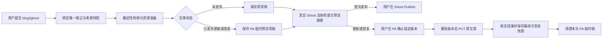

# Ghost Blog Publishing — 实施设计与验收

Document status: Draft
Updated: 2026-09-28
Work item: B-153
Authority: 对已批准产品范围的 source-verified 设计；拟新增接口均为 Proposed，未实现部分不能视为当前能力。
Product spec: [Ghost Blog Publishing](../product/specs/pa-ghost-blog-publishing-product-spec.md)
Decision: [DEC-045](../product/decisions/dec-045-ghost-blog-publishing.md)

当前授权止于设计。仓库已有 Planned package，本项保留在 [Backlog](../backlog.md#下一步可执行)，
不新增第二个 Planned Tracker、不改变其他任务排期。实现获得授权且排期允许后，将本文移入
`active/ghost-blog-publishing/sdd.md`，建立最小 Feature Home + Tracker；把下方任务与验证映射
移入 Tracker，而不是维护两套状态。本文兼作设计入口，不另造 Plan、调查报告或验收平台。

## Current Source Baseline

2026-09-28 核对基线 `791a1ff6`；开始实施时复核受影响文件，不把 HEAD 当完整输入身份证明。

| 已有模块 | 可复用事实 / 必要变化 |
| --- | --- |
| [bundled-skills](../../src/ai-services/bundled-skills.ts)、[SkillContextProvider](../../src/ai-services/skill-context-provider.ts) | `load_skill` 加载指引，不执行脚本；新增 `skills/blog2ghost/SKILL.md` 与 catalog 注册即可承载指引 |
| [Chat](../../src/chat/chat-view.ts)、[skill-router](../../src/ai-services/skill-router.ts) | 技能 typeahead 当前匹配 `#`；目标需接受 `@blog2ghost`，保持已有 `#skill` 和 `@CreateImage` 等动作行为 |
| [PolicyEngine](../../src/ai-services/policy-engine.ts)、[capability-types](../../src/ai-services/capability-types.ts)、[host tools](../../src/ai-services/pa-agent-host-tools.ts) | 非读取工具已有固定领域 Host 准入模式；不能给所有 Skill/network-read 放开网络写入 |
| [SourceAccess](../../src/plugin/source-access.ts)、[TaskSourceReadGuard](../../src/ai-services/task-source-read-guard.ts) | 宿主检查来源，`isCurrent`/`isPathAllowed` 覆盖实际读取与外发；生成状态不能成为检索来源 |
| [plugin configuration](../../src/ai-services/plugin-configuration.ts)、[settings persistence](../../src/plugin/settings-persistence.ts) | 已用 `app.secretStorage` 与串行设置写入；Ghost 单独 secret ID，不复用 AI token 或同步明文 |
| [Obsidian transport](../../src/ai-services/obsidian-fetch.ts) | 现有 `requestUrl` 封装面向提供方；可复用小型网络/错误处理 helper，不把 CMS 凭据装进 AI 请求 |
| Obsidian 1.12.3 类型、[platform helpers](../../src/platform-dom.ts) | 可用 `MetadataCache.getFirstLinkpathDest`、`resolveSubpath`、`FileManager.processFrontMatter`、SecretStorage；没有已验证的跨站点渲染探针 |

### External Evidence

- [Admin API](https://docs.ghost.org/admin-api)、[创建](https://docs.ghost.org/admin-api/posts/creating-a-post)、
  [更新](https://docs.ghost.org/admin-api/posts/updating-a-post)：Lexical 为正文输入；HTML 导入有损；
  PUT 带 `updated_at`，`save_revision=true` 是更新时留历史，不是隔离的新版本。
- [图片上传](https://docs.ghost.org/admin-api/images/uploading-an-image)、
  [Post 字段](https://docs.ghost.org/admin-api/posts/overview)：图片 multipart 上传；文章有
  `codeinjection_head`、`codeinjection_foot`、`custom_template`、`custom_excerpt` 等字段。
- [官方 Preview 帮助](https://ghost.org/help/publishing-content/)，对应站点所声明 6.65 系列的
  [v6.65.0 预览保存条件](https://github.com/TryGhost/Ghost/blob/v6.65.0/apps/ember-admin/app/components/editor/modals/preview.js#L187)、
  [预览路由](https://github.com/TryGhost/Ghost/blob/v6.65.0/ghost/core/core/frontend/services/routing/controllers/previews.js#L50)：
  草稿先保存；已发布 `/p/{uuid}/` 转正式 URL。需要临时稿才能保留旧版在线并预览新版。
- [Send to Ghost 参考实现](https://github.com/Southpaw1496/obsidian-send-to-ghost/blob/f8877bb432fd38606c748f523ba05239fe07cc32/src/methods/publishPost.ts)：
  当前笔记 Markdown 转 HTML 后 POST；没有本设计所需的绑定更新、图片搬运和渲染验证。
- 本次只读查看 edony.ink dashboard：全站 footer 有 Prism 1.29 按需加载，header 有旧脚本兼容 shim；
  全站 injection 未见 Mermaid/数学库。个别文章有 Mermaid/MathJax，不能据此推定全部文章均覆盖。
  这是当次配置观察，不是永久兼容承诺；实现时从实际页面/合法只读配置重新识别，不保存凭据。

## Design And Data Flow

### Interfaces And Ownership

拟新增一个 `src/ghost-publishing/` 领域目录；职责可按以下边界落 5–7 个文件，不逐接口建层。
名称为 Proposed，GLM 可调整局部文件拆分，不能改变权限、持久化或产品边界。

| 责任 | 输入 → 输出 / 约束 |
| --- | --- |
| Source/export | 唯一来源 + 发布选项 → 完整导出树、依赖清单、需要的渲染能力；直接读受准入保护的原始内容，不用可能截断的 `read_note` 文本充当全篇 |
| Ghost client | 固定站点请求 → 类型化结果；JWT 仅在 Host 内生成，短期有效；区分失败与结果不明；不接收模型给出的任意 URL、HTTP 方法或密钥 |
| Publishing service | `prepare` / `prepareRestore` / `refresh` / `confirm` → 领域状态；处理单文串行、版本检查、写回与恢复；确认方法仅供 Host UI 调用 |
| State store | 每篇绑定、当前基线、一个待确认版本、最近一次恢复快照；原子替换本地文件、校验关联与 schema，不建通用事件库 |
| Desktop preview | 临时/原草稿链接 + 渲染预期 → verified / failed / unavailable；运行固定检查，不依赖 LLM 看网页判断是否成功 |
| Chat/Settings 接线 | 选择来源、连接配置、状态卡、预览链接、确认/继续/恢复入口；沿用 Chat 生命周期与 locale/CSS 约定 |

Proposed 工具 `prepare_ghost_post` 只接受笔记定位和准备意图，采用固定
`ghost-publishing` 权限、`desktop`、`sequential`。Host 保存本次用户请求与实际目标的绑定；
工具参数不能提供 `confirmed`、文章正文、远端 ID 或代码注入。`load_skill` 不授予权限。
新权限只允许这一领域工具，确认写入通过 Host 内的候选 ID/版本执行，不导出通用 publish/delete 工具。
`chat-tool-types`、工具工厂/registry、PolicyEngine、来源准入与 result-fact 都需完整接线；
不将真实草稿写入伪装为 read-only，也不扩大现有 Vault Write Action Framework 的能力。

### 1. 来源、字段与转换

- 当前笔记在 Chat 提交时捕获，不能在异步执行时重新拿活动标签。路径精确匹配；名称按
  Obsidian 解析规则且必须唯一。正文使用完整快照，嵌入递归按整篇/heading/block 限定，
  记录每个依赖的路径、内容 hash 和来源准入；发现循环/排除/缺失即停止外发。
- Proposed `ghost` frontmatter 管发布选项，`pa_ghost` 只管机器关联。发布选项包含
  `title/tags/feature_image/custom_excerpt`；缺字段=不管理，null 或约定空值=明确清空。
  标题缺省回到文件名；不猜摘要、封面、标签或剔除正文 H1。正式 slug/作者/访问范围沿用远端。
- 采用确定性 Markdown token/AST 转换，拟新增 `markdown-it` 作为直接依赖；不以 Obsidian
  插件渲染后的 DOM 反推文章，不执行 Dataview/Templater。具体依赖版本与 license 在 T-01 锁定。
- 常规段落、标题、列表、引用、链接、图片、代码映射 Ghost 原生 Lexical 节点；复杂表格、
  Mermaid/数学可用有界 HTML card。节点 schema 按目标 Ghost 实证固定；不把整篇塞 HTML card，
  不将 `source=html` 有损导入当默认正确性保证。只对确实需要的语法加转换器。
- Mermaid/数学在解析层识别，排除代码段和转义字符；保留原表达式，不让模型重写代码。
  常规 callout/脚注/任务列表保留文字与结构，动态/未知构造定位说明并停止，不静默删除。
- 保存源块与导出块的对应信息。后续仅在源块未变且远端语义一致、对应唯一时保留远端排版；
  重复块无法对应或远端内容实质改变时暂停并解释。可重新生成全篇覆盖预览，但须用户明确选择；
  不在首版开发通用三方合并编辑器。恢复已获批直接覆盖，不走这项格式合并逻辑。

### 2. 图片与注入

- 用 MetadataCache 解析本地附件；网络图片只读取正文明确引用的资源，不带 Ghost/AI 凭据。
  二进制 hash + 站点身份作复用键；先完成必要上传，再创建可检查的文章。不自动重编码、压缩、
  放大或删除共享图片；目标站已有 URL 可直接复用。上传上限/格式拒绝是可说明的阻塞原因。
- 配置画像记录实际站点资源、版本与初始化能力；Prism 全局对象存在可能只是 shim，不能当作
  高亮成功。合法只读 API 无法读取全站 injection 时，从实际页面检测并让用户确认站点画像，
  不把 session-only 管理接口假定为 Integration key 能力。
- 按导出树选择固定、版本锁定的 Prism/Mermaid/数学 recipe。优先复用已兼容全站/文章能力；
  缺失才在 `codeinjection_head/foot` 的 PA 标记区域补充。管理区含 recipe 版本和 hash，
  其余人工内容逐字保留；管理区被人工改动、版本冲突或无法确认加载顺序时暂停处理。
- HTML/脚本只在 Ghost 页面或隔离网页环境执行，不在 Obsidian 主 DOM/Node 环境执行。
  笔记中的任意脚本不作为指令或自动部署来源；未知可执行内容不能静默放进文章。

### 3. 文章身份与多桌面状态

Proposed 最小 note binding：`note_uid`、`site`、`post_id`、`post_url`，归于 `pa_ghost`。
`note_uid` 在首次远端创建前固定；Ghost 返回 ID 后即写回，URL/状态以远端实际结果校准。
机器属性写回用 `processFrontMatter` 串行处理，并验证正文未变；不能覆盖同期编辑。
网络成功但属性写回失败时保留已知 ID，继续时补写，不能重新 POST。

Proposed 同步存储为 vault 普通 Markdown 文件
`PA System/Ghost Publishing/<site-id>/<note-uid>.md`，内部为带 schemaVersion 的结构化数据，
便于现有 vault 同步携带；不用仅设备可用的 OPFS、localStorage、Chat history 作权威。
这是技术默认路径，不增加文件管理 UI；创建前查占用，不能覆盖用户同名文件。
文件带明确 PA 系统标记，接入 SourceAccess 的系统数据排除，不能因某个 consumer 允许生成笔记
而把快照送入 Memory/普通检索。Host 状态读取使用专用 store，不借此扩大 note source scope。

每篇只保留以下有用途的数据，不建立无限历史：

| 数据 | 用途 / 保留范围 |
| --- | --- |
| binding + remote identity | 站点 canonical admin origin、post ID、稳定 slug、已知状态及原笔记身份 |
| baseline | 上次源快照、导出映射、实际 Ghost 受管字段与内容 hash；支持格式保留及远端变化判断 |
| prepared | 候选 ID、来源依赖 hash、远端基线版本、完整提交内容 hash、profile/recipe hash、预览稿身份 |
| lastUndo | 最近一次成功 PA 更新前的受管内容/字段、对应来源 manifest；恢复只覆盖这次管理范围 |
| pending operation | 发起前记录的 operation ID、目标、阶段和预期 hash；用于未知结果核对，而非通用任务平台 |

本机串行处理同一 binding。两台桌面顺序续接无需重绑；同步未完成、文件冲突或远端版本不符时
先恢复/重新准备。复制 `note_uid` 后出现多个笔记候选时暂停，不能按最先搜索到的文件覆盖。
同步的是发布状态，不同步凭据和确认授权；在另一桌面重新打开候选并确认，不能重放设备 A 的点击。
持久化候选与来源 manifest 不是权限。重启或换桌面继续时，Host 根据本次用户选择、当前来源范围和
Data Boundary 建立新的来源准入，逐项核对主笔记、嵌入、图片及恢复 manifest；不能复用旧 Chat 的
内存回调。Ghost 写路径要求有效准入，缺失或无法建立即停止，不能借可选 guard 的默认放行继续。
首版不承诺离线同时首次创建的全局 exactly-once；用 Ghost 归属标记和远端核对识别重复/不明结果，
不唯一则停止提交，不引入云锁或后台同步服务掩盖平台限制。

### 4. Prepare / Confirm / Restore

状态由一个领域 service 管理：`preparing → ready → committing → succeeded`，另有
`needs_attention`、`outcome_unknown`；清理待办与提交结果分开，避免清理失败触发重复发布。

1. 创建候选前重验来源/连接；读取原文最新版本、当前 status、受管/非受管字段。
   原文为 draft 时更新原草稿；published 时创建/复用 `#pa-ghost-preview-<note_uid>` 标记的
   临时草稿。另存 originalPostId；不能将临时 ID 写入笔记正式关联。
2. 用「远端保留值 + 本次管理值」形成一份完整候选，临时稿与最终提交都从它派生。
   渲染相关值包括 tags 及顺序、模板、作者、访问范围、封面、摘要、日期和人工 injection；
   T-01 按实际主题与 API 核定清单。只有身份、临时 slug、draft 状态和内部归属标记有意不同，
   内部标记不能改变公开标签/主标签或进入展示。无法等价的主题行为明确列为验证限制。
   保持 draft，不带 newsletter 参数。使用 Ghost 返回的 UUID 构造 `/p/{uuid}/` 预览链接。
   临时 slug 与正式 slug 不同，不承诺所有依赖 URL 的自定义脚本天然一致；测试需覆盖实际主题。
3. 图像、代码字符、Mermaid 和公式检查通过才进入 ready。结果卡包含标题、站点、操作类型、
   预览入口和简短注意事项；不把这些全文 payload/预览密钥链接回传模型。
4. 新文用户在 Ghost Publish；PA 下次显式 refresh 读取正式状态，形成已发布 baseline。
   若用户在 Ghost 改了格式，采用实际远端版本核对语义/映射；不能只把旧候选标作最终版本。
5. 更新/恢复的确认绑定 prepared ID/hash，不接受聊天里一个脱离候选的“是”作为永久授权。
   提交前重读来源依赖、连接/站点画像、临时稿与原文章。任一相关版本变动，旧确认失效，
   准备新预览；用户在临时稿中的手工调整必须先被读取、校验、纳入新候选，不能预览 B 却提交 A。
6. 在写入前持久化实际远端 pre-update snapshot。PUT 只发送本次管理字段和匹配的 `updated_at`，
   保持原 published 状态、ID/slug/作者/未管理字段；tags/authors 是替换关系时必须保留未管理值。
   成功后 GET 核对内容与状态再更新 baseline/lastUndo；渲染复核失败如实报告已上线，不自动反向写入。
7. Restore 以 lastUndo 为目标，生成同样的临时预览；确认后直接覆盖对应内容/字段和 PA 管理的注入区。
   不展示额外差异页、不自动合并后续内容；不改 Obsidian 当前正文，不清除现在的人工注入区。
   仅提供最近一次 PA 更新的恢复，不做无限撤销/重做；恢复成功后消费本次恢复入口。

### 5. 网络失败与资源生命周期

- Admin origin、站点身份与密钥在 Host 固定；跨 origin 重定向不能转发 JWT。图片请求使用无凭据
  transport。日志/错误移除鉴权、完整 payload、预览 token，密钥只存在 SecretStorage。
- Ghost 创建没有在本次核查中证实可依赖的通用 idempotency key。POST 发送前存 operation 标记，
  写入 Ghost 内部归属标签；未知结果按精确标记查远端，唯一且内容相符才接续，多条/不可核实则暂停。
  不能将 timeout/AbortSignal 当成服务端未执行，也不能直接再次创建或自动重发 PUT。
- PUT 409/连接变化不刷新 `updated_at` 后无条件重放；重新准备预览。恢复/取消/重载后只在用户
  显式继续时恢复处理，保留当前步骤，取消不能撤销已发出的远端请求。
- 清理前 GET 精确临时 ID，核对站点、归属标记、draft 状态和已确认内容/版本。修改过、发布过、
  归属不明即保留并说明；只删除本任务确定归属的临时文章，不按名称前缀批量删，不删图片。
  删除失败作为待清理结果保留，下次显式继续核对；正式更新已经成功时不再提交原文章。
- 组件关闭卸载监听器/探针和计时器；关闭预览不删除远端草稿，不让旧组件完成回调更新新会话。
  插件禁用不触发任何远端清理/下线，也不删除同步快照。

### 6. 真实渲染检查与兼容性

**必须先验证的技术点**：Obsidian 公共 API 没有已确认可直接读取外部浏览器 DOM 的接口。
仅打开系统浏览器、抓静态 HTML、Prism 全局对象存在，均不能证明 Mermaid/公式已渲染。

Proposed DesktopPreviewProbe：在桌面宿主允许的隔离网页容器加载 Ghost preview，使用固定诊断
读取图片加载尺寸、代码原文/高亮状态、Mermaid SVG 或错误、数学输出和对应元素数量。
优先验证 Electron webview 的可用性；禁用 Node、共享 Obsidian 会话/preload 和任意宿主桥接，
只允许固定页面地址/固定探针。不引入远程浏览器服务、Playwright 运行时或第二个 AI Agent。
若该方式不被实际宿主支持，T-01 返回证据并暂停受影响实施，不能改成“用户看过=自动检查通过”。

Probe 结果绑定 candidate hash、页面 URL、recipe/profile 和当次加载；能力加载失败与语言不支持
分开处理。人工预览仍存在：系统浏览器中检查实际观感，PA 内置/Obsidian 网页入口检查可用性。
Ghost 临时稿不会天然执行所有以正式 slug 为条件的主题行为；URL 依赖是明确验证项。
升级主题/全站脚本后重新识别画像和准备预览，不自动修改全站设置。

## GPT / GLM Implementation Handoff

沿用 [GPT-6/GLM 工作流](./workflows/gpt6-glm-delivery-workflow.md) 与
[任务模板](./templates/glm-worker-task.md)。GPT 持有契约、派工和独立验收；GLM 用单独 CLI，
一个 writer 连续完成获派切片、测试、自查。此处没有启动 worker，预检/工具可用性未声称通过。

| 切片 | 模式与允许范围 | 终点 / 依赖 |
| --- | --- | --- |
| T-01 最小可行性检查 | `understand` 加明确授权的合成 prototype：确认 Ghost Lexical 节点、Integration key 可读权限、预览字段清单、渲染探针和同步文件在两桌面可用；只动获派 scratch/fixture | 返回真实结果与失败原因。GPT 固定 schema、recipe、probe 和 store 接线后才批准生产设计；不搭完整新平台 |
| T-02 完整垂直实现 | 一个 GLM `deliver` 上下文：先 source/export 与 client/store，再 service/准备-确认-恢复，最后 Skill/Chat/Settings 接线；只动 `src/ghost-publishing/`、必要既有接线、skill、locale/CSS 与对应 tests/依赖 | 全部 REQ/AC 的运行时实现、focused checks 与自查报告；不能改产品范围、Tracker 或擅用 edony.ink 试发布 |
| T-03 集中集成与验收 | GLM 对冻结输入执行一次完整 gate/deploy，GPT 独立检查 diff、原始证据和实际桌面交互；有问题交同一 writer 修复 | 所有必需 AC 通过才标 Validated；未测、失败、环境缺失分开记录，不自动 commit/closeout/release |

每次派工补齐模板的实际字段：绝对工作树与基线/dirty 归属、目标接收树、准确读集、允许文件、
已核对 provider/model/CLI 配置、测试站点/实际 vault、输出目录和资源归属。不能把本设计的
相对建议路径直接当作机器已配置的运行环境。新 worktree 不自动包含本次未提交文档，派工前显式携带。

首个 dispatch 的不可变约束：已确认的 10 项 REQ/AC、API-only 正式写入、临时草稿预览、原 ID/URL、
SecretStorage、本地正文不改、无 newsletter/全站设置/旧文接管；不能将模型输出当正文或确认。
负例来自下面矩阵，不另造泛化测试平台。GLM 缺桌面工具时，由 GPT 补实际 UI 证据，不以 CLI 成功代替。

## Validation Matrix

优先使用一篇合成综合文章与少量独立失败变体，不将格式 × 主题 × 设备 × 网络状态做笛卡尔积。
自动化按行为归并为 resolver/export、workflow/store/client、permission/UI 三组；具体 suite 名在实施时建立，
本设计不假装已有测试文件。每组覆盖的风险不同，不在多层重复同一组字符串/快照断言。

| REQ / AC | 变化 → 最低充分证据 | 通过条件 | 重跑/扩展触发 |
| --- | --- | --- | --- |
| B-153/REQ-01 / B-153/AC-01；B-153/REQ-04 / B-153/AC-04 | 定位/依赖解析的 focused tests；真实三入口各一次 | 唯一目标、嵌入范围、普通链接降级；歧义/排除/循环不外发；活动标签切换无误绑 | 解析规则、来源 guard、mention/入口改变 |
| B-153/REQ-02 / B-153/AC-02；B-153/REQ-03 / B-153/AC-03 | AST/块映射语义断言；一篇 Ghost 综合夹具 + 桌面真实渲染 | 原文/代码精确保留，普通块可编辑；未变格式保留、冲突停下；SVG/数学/图像实际呈现，人工 injection/全站配置未改 | compiler、schema、recipe、主题或探针改变 |
| B-153/REQ-05 / B-153/AC-05；B-153/REQ-06 / B-153/AC-06 | 图像复用与失败、字段三态参数化 focused；真实夹具含本地图与网络图及已有标签 | 引用正确、资源失败阻止就绪；清空/缺省正确，预览与提交的标签顺序等渲染字段一致；URL/作者/权限保持，无凭据/内部字段泄露 | 上传、redirect、字段归属或连接实现改变 |
| B-153/REQ-07 / B-153/AC-07；B-153/REQ-09 / B-153/AC-09 | 状态机集成：prepare/取消/确认；真实测试站新文与更新各一次 | 预览前后原线上内容不变，确认才 PUT；人工临时稿变动使候选失效；无邮件，打开链接两入口可用 | service、确认卡、站点写入路径改变 |
| B-153/REQ-08 / B-153/AC-08；B-153/REQ-09 / B-153/AC-09 | 重载/缺快照/复制身份/远端冲突 focused；两台桌面一次真实顺序续接 | 同 ID/URL、无需旧 Chat；重建来源准入，缺准入/基线暂停，撤销来源后不外发；响应丢失先核对、重复确认不重复提交，不靠 mock 声称跨设备通过 | store、同步布局、来源准入、恢复或 Ghost 冲突语义改变 |
| B-153/REQ-10 / B-153/AC-10 | 恢复与精确清理 focused；真实站点一次更新→恢复循环 | 预览旧版再覆盖，笔记不变；误归属/人工接管不删除，清理失败不重提原文 | snapshot、managed 字段或清理逻辑改变 |

### 最小执行门禁

- 本次 docs-only：`npm run docs:check`、`git diff --check` 与既有 `npm run test:docs -- --runInBand`。
  不加检查文案字面值的测试，不跑插件 build、全量运行时测试或 Obsidian smoke。
- T-01：合成数据与定向 API/渲染证据；不把 prototype 成功当完整交付。使用明确配置的 Ghost 测试站，
  不自动访问真实笔记、不向 edony.ink 创建/发布测试文章。新增外部写入目标需在派工时获得授权。
- T-02：最近的 source suites，权限接线覆盖既有 PolicyEngine/host 调用路径，`git diff --check`；
  需要真实行为时先部署当前切片并按 AGENTS 门禁执行，不能把必需阶段 app gate 都留到最后。
- T-03：一个执行者对冻结输入运行 `make deploy`（含 lint/build/full Jest），另补 docs 与
  AGENTS 的 DOM/community source scan。通过后不再重复单独 lint/build/full Jest；输入变化才重验。
  本任务不加覆盖率百分比、全主题矩阵、多模型评测、性能基准或移动实机门禁。
- GPT 独立验收检查完整 diff、关键断言及原始命令/自然退出、部署身份、真实 Ghost 与桌面观察。
  两台真实桌面续接缺失就保留 AC-08 未验证；无需所有 OS 组合。只补缺失/不可信的证据。

## Compatibility, Rollback And Design Gates

- 现有 Skill、Chat、来源权限、旧笔记均不迁移；仅显式使用本功能才创建关联。关闭功能后既有文章
  仍可在 Ghost 编辑；恢复旧插件时系统快照可保留，但不能承诺旧版本能解析新 schema。
- 发布状态 schema 未知或损坏时停止写入，保留数据；不 reset store。连接/站点改变使已准备确认失效。
  当前配置管理器可复用，Ghost 凭据与 AI 连接分开；不假定 SecretStorage 会自动跨桌面同步。
- 移动端可以编辑带关联的笔记，不能调用发布工具；不为首版加载桌面探针、Electron 或写入依赖。
- 渲染容器隔离与宿主可用性、Lexical schema 和多桌面同步文件三项由 T-01 给出真实证据；
  是实现前检查点，不是新增产品选择，也不是已通过门禁。失败不得以静默降级满足 AC。
- 技术方案 Draft；产品范围已按 DEC-045 获批。完成 T-01 后 GPT 根据证据收敛设计、标记 Approved，
  仍须已有明确实现授权才可进入 T-02。此次没有运行 GLM、请求密钥或修改 Ghost。
