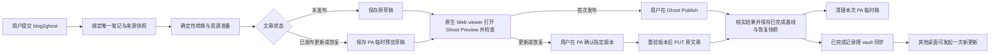

# Ghost Blog Publishing — 实施设计与验收

Document status: Approved
Updated: 2026-10-01
Work item: B-153
Authority: 对已批准产品范围、源码和 T-01 可行性证据的实施设计；实际交付与验证状态以 owning Tracker 为准。
Product spec: [Ghost Blog Publishing](../product/specs/pa-ghost-blog-publishing-product-spec.md)
Decision: [DEC-045](../product/decisions/dec-045-ghost-blog-publishing.md)

本技术设计由 [B-153 Feature Home](./active/ghost-blog-publishing/README.md) 引用，保留原路径，
不复制第二份 SDD。2026-10-01 beta.17 反馈修订见来源/字段小节；详细任务与验证方法见 [开发测试方案](./active/ghost-blog-publishing/plan.md)，
执行状态、证据和接续只记 [Tracker](./active/ghost-blog-publishing/tracker.md)。
Owner 已授权完整开发测试和本机隔离 Ghost 合成测试。T-01 技术选择由 GPT 核定；
真实产品行为仍按 Tracker 验收，不把设计 Approved 当作运行时通过。

## Current Source Baseline

下表起于 2026-09-28 的 `791a1ff6`，2026-09-29 在 `10635c6` 补查了 Skill/Chat、Host、
来源 guard、设置和结果事实接线；具体路径与 owner tests 见开发测试方案。此为只读源码事实，
不是运行时验证。实施前只复核发生变化的相关输入，不把 HEAD 当完整输入身份证明。

| 已有模块 | 可复用事实 / 必要变化 |
| --- | --- |
| [bundled-skills](../../src/ai-services/bundled-skills.ts)、[catalog](../../src/ai-services/bundled-skill-catalog.ts)、[SkillContextProvider](../../src/ai-services/skill-context-provider.ts) | `load_skill` 加载指引，不执行脚本；新增 `skills/blog2ghost/SKILL.md` 与 catalog 注册承载指引 |
| [Chat](../../src/chat/chat-view.ts)、[skill-router](../../src/ai-services/skill-router.ts) | Chat 的 `getSkillTriggerMatch` 匹配 `#`，`getActionTriggerMatch` 匹配 `@CreateImage` / `@Writing`；增加 `@blog2ghost` 时保留这些入口与 IME，skill-router 负责 Skill 解析/上下文 |
| [tool factories](../../src/ai-services/chat-tool-factories.ts)、[adapter](../../src/ai-services/capability-adapter.ts)、[registry](../../src/ai-services/capability-registry.ts)、[PolicyEngine](../../src/ai-services/policy-engine.ts)、[host tools](../../src/ai-services/pa-agent-host-tools.ts) | 新领域需完整工厂→adapter→registry→Host 接线及 context 类型；非读取工具按固定领域准入，不能给所有 Skill/network-read 放开网络写入 |
| [SourceAccess](../../src/plugin/source-access.ts)、[TaskSourceReadGuard](../../src/ai-services/task-source-read-guard.ts) | `isCurrent`/`isPathAllowed`、`isNoteDomainAllowed` 与 `captureSourceValidity` 支持当前来源准入；发布必须取得必要 guard，不能借缺省放行；生成状态不能成为检索来源 |
| [result facts](../../src/ai-services/pa-agent-result-facts.ts)、[Operations acknowledgement](../../src/ai-services/operations/operations-acknowledgement-policy.ts) | 领域结果保留真实语义：准备草稿不能被报告成已发布，结果不明和清理待办须独立表达。2026-10-04 harness 精简移除了旧 required capability policy；领域确认仍由 Operations 持有。 |
| [plugin configuration](../../src/ai-services/plugin-configuration.ts)、[settings persistence](../../src/plugin/settings-persistence.ts) | 已用 `app.secretStorage` 与串行设置写入；Ghost 单独 secret ID，不复用 AI token 或同步明文 |
| [Obsidian transport](../../src/ai-services/obsidian-fetch.ts) | 现有 `requestUrl` 封装面向提供方；可复用小型网络/错误处理 helper，不把 CMS 凭据装进 AI 请求 |
| Obsidian 1.12.3 类型、[platform helpers](../../src/platform-dom.ts) | 可用 `MetadataCache.getFirstLinkpathDest`、`resolveSubpath`、`FileManager.processFrontMatter`、SecretStorage；类型基线不等于原生 Web viewer 检查接口的公开兼容承诺，实测范围见第 6 节 |

### External Evidence

- [Admin API](https://docs.ghost.org/admin-api)、[创建](https://docs.ghost.org/admin-api/posts/creating-a-post)、
  [更新](https://docs.ghost.org/admin-api/posts/updating-a-post)：Lexical 为正文输入；HTML 导入有损；
  PUT 带 `updated_at`，`save_revision=true` 是更新时留历史，不是隔离的新版本。
- [图片上传](https://docs.ghost.org/admin-api/images/uploading-an-image)、
  [Post 字段](https://docs.ghost.org/admin-api/posts/overview)：图片 multipart 上传；文章有
  `codeinjection_head`、`codeinjection_foot`、`custom_template`、`custom_excerpt` 等字段。
- [官方 Preview 帮助](https://ghost.org/help/publishing-content/)，对应站点所声明 6.65 系列的
  [v6.65.0 预览保存条件](https://github.com/TryGhost/Ghost/blob/v6.65.0/apps/ember-admin/app/components/editor/modals/preview.js#L187)、
  [预览路由](https://github.com/TryGhost/Ghost/blob/v6.65.0/ghost/core/core/frontend/services/routing/controllers/previews.js#L50)：
  草稿先保存；已发布 `/p/{uuid}/` 转正式 URL。需要临时稿才能保留旧版在线并预览新版。
- [Send to Ghost 参考实现](https://github.com/Southpaw1496/obsidian-send-to-ghost/blob/f8877bb432fd38606c748f523ba05239fe07cc32/src/methods/publishPost.ts)：
  当前笔记 Markdown 转 HTML 后 POST；没有本设计所需的绑定更新、图片搬运和渲染验证。
- 2026-09-28 只读查看 edony.ink dashboard：全站 footer 有 Prism 1.29 按需加载，header 有旧脚本兼容 shim；
  全站 injection 未见 Mermaid/数学库。个别文章有 Mermaid/MathJax，不能据此推定全部文章均覆盖。
  这是当次配置观察，不是永久兼容承诺；实现时从实际页面/合法只读配置重新识别，不保存凭据。

## Design And Data Flow

一次操作的准备、检查、确认及结果核实在同一桌面完成；跨桌面只复用已完成记录。
同步不是流程驱动事件，用户在另一桌面显式发起新更新时才读取记录和远端实际状态。

### Interfaces And Ownership

拟新增一个 `src/ghost-publishing/` 领域目录；职责可按以下边界落 5–7 个文件，不逐接口建层。
名称为 Proposed，GLM 可调整局部文件拆分，不能改变权限、持久化或产品边界。

| 责任 | 输入 → 输出 / 约束 |
| --- | --- |
| Source/export | 唯一来源 + 发布选项 → 完整导出树、依赖清单、需要的渲染能力；直接读受准入保护的原始内容，不用可能截断的 `read_note` 文本充当全篇 |
| Ghost client | 固定站点请求 → 类型化结果；JWT 仅在 Host 内生成，短期有效；区分失败与结果不明；不接收模型给出的任意 URL、HTTP 方法或密钥 |
| Publishing service | `prepare` / `prepareRestore` / `refresh` / `confirm` → 领域状态；处理单文串行、版本检查、写回与恢复；确认方法仅供 Host UI 调用 |
| State store | 区分随 vault 同步的已完成记录与本机进行中操作；持久化、校验关联与 schema，缺必要数据暂停，不建同步状态机或任务交接协议 |
| Desktop preview | Ghost 原生 Preview 链接 + 渲染预期 → 原生 Web viewer 标签页与 verified / failed / unavailable；同页固定检查，不另建预览页面、不依赖 LLM 判断 |
| Chat/Settings 接线 | 选择来源、连接配置、状态卡、预览链接、确认/继续/恢复入口；沿用 Chat 生命周期与 locale/CSS 约定 |

Proposed 工具 `prepare_ghost_post` 只接受笔记定位和准备意图，采用固定
`ghost-publishing` 权限、`desktop`、`sequential`。Host 保存本次用户请求与实际目标的绑定；
工具参数不能提供 `confirmed`、文章正文、远端 ID 或代码注入。`load_skill` 不授予权限。
新权限只允许这一领域工具，确认写入通过 Host 内的候选 ID/版本执行，不导出通用 publish/delete 工具。
`chat-tool-types`、工具工厂/registry、PolicyEngine、来源准入与 result-fact 都需完整接线；
不将真实草稿写入伪装为 read-only，也不扩大现有 Vault Write Action Framework 的能力。

### 1. 来源、字段与转换

- 当前笔记在 Chat 提交时捕获，不能在异步执行时重新拿活动标签。路径精确匹配；名称按
  Obsidian 解析规则且必须唯一。正文使用完整快照，嵌入递归按整篇/heading/block 限定，
  记录每个依赖的路径、内容 hash 和来源准入；发现循环/排除/缺失即停止外发。
- Agent 根据完整用户请求选择目标与 locator，包括混合目标和否定条件。省略 locator 时，
  Host 使用提交时捕获的当前笔记；提供 `path` 或 `name` 时，Host 验证真实 Markdown 文件、
  路径合法性和名称唯一性，不通过用户文本匹配决定目标或设置语义旁路。
- `ghost` frontmatter 管发布选项，`pa_ghost` 及其文本伴随属性只管机器关联。发布选项包含
  `title/tags/feature_image/custom_excerpt/meta_description`；null 或约定空值=明确清空且不自动补齐。
  标题缺省回到文件名；发布标签不猜测。封面先取显式配置，再取普通非空 `feature_image`，
  最后识别主笔记 `[!personal-assistant]` 的 `Featured Images` / `题图` 管理块中的唯一图片。
  识别成功后不导出该管理块；多候选拒绝，普通正文/嵌入图片不自动选为封面。
  注释在每个准入来源展开引用前处理；使用理解代码段的解析规则，保留行定位与原始依赖 hash，
  未闭合注释失败封闭。只去掉主笔记首个可见块且文本与发布标题一致的 H1。
  作者/访问范围沿用远端，已发布 slug 不变；草稿 URL 的显式操作见下文。
  不回写整理后的正文或 AI 元数据到原笔记。
- AI 元数据只接收已经准入、展开并排除注释/管理块后的文章，复用 `AIUtils.createChatModel`
  与现有 token 预算/取消/来源及提供方配置有效性检查；不把 Ghost key、预览地址或任意 vault
  内容放进模型输入。人工 `ghost.custom_excerpt` / 普通非空 `excerpt` 优先，
  `ghost.meta_description` 管 SEO 描述；其次保留远端已有字段，只对仍缺的字段生成一次。
  增加主动重新生成入口，替换候选需重新预览；普通 prepare/重试/更新/恢复不重复调用模型。
  结果以有界结构校验并进入相同 candidate hash、managedFields、远端冲突和 lastUndo 机制。
  新持久字段对旧记录可选，不通过补默认值改变已签校验和；旧格式读取与恢复有回归。
- 新文章 slug 使用顶层 Text 属性 `ghost_slug`，兼容 `ghost.slug`；两者同时存在且不同则拒绝。
  人工值和 AI 结果均须为 1–80 字符的小写 ASCII 单词/数字，以单个连字符分隔；空值、URL、
  路径、拼音自动回退和未经验证的结果不发送。英文是 slug 的语言要求，摘要/SEO 仍用文章语言。
  缺失 slug 与缺失元数据在同一次配置文本 AI 调用中生成；候选持久保存请求值，首次创建
  接受 Ghost 实际返回值（含冲突后缀）。普通重试/重启、标题变化和摘要再生成不重新生成 URL。
  手工配置只在首次创建或明确更换草稿 URL 时生效，不把新增属性当自动改 URL 的授权。
- 卡片增加「更换草稿 URL」动作，仅针对已知 ID、仍为 draft 的原始文章，恢复/已发布文章
  的专用临时预览稿不适用。复用 serial、当前 source/provider admission、updated_at 和 durable
  pending/reconcile。生成前读原稿，发送前重新核对其状态、版本与精确归属，只 PUT slug。
  可选 non-slug 源意图 hash 允许明确更换动作准入单独的 `ghost_slug` 变化；正文或其他
  发布字段变化仍须重新准备。pending 保存请求 slug、写前版本/URL/发布日期及非 slug
  事实 hash；响应丢失后只读同 ID，须匹配请求或数字冲突后缀及其他字段，才能核实成功。
  请求值限制不用于已核实的远端旧地址。首次草稿已知 ID 与验证后的格式先保存，再写回
  笔记关联，避免本地写回失败造成重复建稿或丢失恢复基线。
  成功采用同 ID 的实际 URL、写回关联、失效旧预览凭证；其他正文、封面、摘要、SEO、作者、
  标签和访问范围不能由该动作覆盖。
  草稿 API 的 `/p/<uuid>/` 预览链接在 slug 改变后仍可保持；只接受与实际文章 UUID、站点
  基路径一致且无 query/hash 的这一稳定链接，仍核对请求 slug、版本前进和非 slug 事实。
  未完成请求保存所需 slug/原版本与核实事实（可选 schema
  字段不更改旧 checksum）；响应丢失时读取同 ID 核实，不能借此 POST、重发或修改已发布文章。
  版本/内容冲突、并发 Publish、来源或配置变化暂停；不增加通用 URL 事务框架。
- 卡片复用现有 DOM 构建和 action dispatch，CSS 放在 `src/custom.pcss`。
  操作区采用最多四列布局，按卡片宽度切换文字/图标；按钮保留 tooltip、aria-label、键盘、
  busy/disabled 和确认状态。不得注入运行时 style 或 HTML，不改预览通过条件。
- 采用确定性 Markdown token/AST 转换，拟新增 `markdown-it` 作为直接依赖；不以 Obsidian
  插件渲染后的 DOM 反推文章，不执行 Dataview/Templater。固定 `markdown-it@15.0.2`（MIT），
  类型依赖 `@types/markdown-it@14.2.0`（MIT）；T-02 更新 lock/notices 并验证现有构建兼容性。
- 常规段落、标题、列表、引用、链接、图片、代码映射 Ghost 原生 Lexical 节点；复杂表格、
  Mermaid/数学可用有界 HTML card。节点 schema 按目标 Ghost 实证固定；不把整篇塞 HTML card，
  不将 `source=html` 有损导入当默认正确性保证。只对确实需要的语法加转换器。
- Mermaid/数学在解析层识别，排除代码段和转义字符；保留原表达式，不让模型重写代码。
  常规 callout/脚注/任务列表保留文字与结构，动态/未知构造定位说明并停止，不静默删除。
- 保存源块与导出块的对应信息。后续仅在源块未变且远端语义一致、对应唯一时保留远端排版；
  重复块无法对应或远端内容实质改变时暂停并解释。可重新生成全篇覆盖预览，但须用户明确选择；
  不在首版开发通用三方合并编辑器。恢复已获批直接覆盖，不走这项格式合并逻辑。
- 内容比较用于转换完整性、格式保留及远端冲突判断，不用作跨桌面接续门槛。忽略纯展示
  样式，但保留文字/结构顺序、链接目标、图片身份及代码/公式/Mermaid 原文；代码空白不能
  一律归一化。本地图片与上传 URL 按可靠资源对应关系识别，不能只比较 Markdown 或 HTML 字符串。

### 2. 图片与注入

- 用 MetadataCache 解析本地附件；网络图片只读取正文明确引用的资源，不带 Ghost/AI 凭据。
  二进制 hash + 站点身份作复用键；先完成必要上传，再创建可检查的文章。不自动重编码、压缩、
  放大或删除共享图片；目标站已有 URL 可直接复用。上传上限/格式拒绝是可说明的阻塞原因。
- 配置画像记录实际站点资源、版本与初始化能力；Prism 全局对象存在可能只是 shim，不能当作
  高亮成功。合法只读 API 无法读取全站 injection 时，从实际页面检测并让用户确认站点画像，
  不把 session-only 管理接口假定为 Integration key 能力。
- 按导出树选择固定、版本锁定的 Prism/Mermaid/数学 recipe。优先复用已兼容全站/文章能力；
  缺失才在 `codeinjection_head/foot` 的 PA 标记区域补充。管理区含 recipe 版本和 hash，
  其余人工内容逐字保留；管理区被人工改动、版本冲突或无法确认加载顺序时暂停处理。
- T-01 固定配方基线为 Prism 1.30.0、Mermaid 12.0.0、KaTeX 0.18.9（均 MIT）。Prism 按
  实际语言及依赖顺序加载，JavaScript 包含 core→clike→javascript；Mermaid 的
  `dist/mermaid.min.js` 是 classic global bundle，不能当 ESM default import；使用 strict
  安全级别并显式渲染。KaTeX 区分 inline/display。固定 CDN 版本与文件 SRI，不加载任意
  笔记提供的脚本。该配方是缺失能力时的补充，不覆盖或重复加载已兼容的站点库。
- Integration 配置读取采用最小合法范围和白名单（版本、主题、全站注入的必要画像）；
  不读取/记录全量 private settings。配置权限不足或画像未知时用实际页面核对，不能把
  全局对象、加载回调或 HTTP 200 当成高亮/图表/公式通过。
- HTML/脚本只在 Ghost 页面或隔离网页环境执行，不在 Obsidian 主 DOM/Node 环境执行。
  笔记中的任意脚本不作为指令或自动部署来源；未知可执行内容不能静默放进文章。

### 3. 文章身份、已完成记录与本机操作

最小逻辑 binding 保持 `note_uid/site/post_id/post_url`，原生 frontmatter 写入四个 Text：
`pa_ghost`=原 note UID、`pa_ghost_site`=站点、`pa_ghost_post_id`=文章 ID、
`pa_ghost_post_url`=实际文章 URL；尚未绑定时只写前两项，文章 ID/URL 必须成对。
数值形状的 ID 仍写为字符串。`note_uid` 在首次远端创建前固定；Ghost 返回 ID 后即写回。
旧 `pa_ghost` 对象仍支持读取，下一次明确准备/写回时原子迁移；伴随属性如存在须与旧对象
完全一致，否则拒绝，不推测丢失字段。无主 UID 的部分属性、畸形类型、跨站或 ID/URL 不成对
均失败封闭。保留 `pa_ghost` 字段名使 beta.17 原适配器遇到新字符串明确拒绝，而非误判为
未绑定并重新生成 UID。无需新的版本属性或全 vault 迁移。
binding adapter、MetadataCache 唯一性与双链目标读取共享新旧格式语义；迁移不能丢失复制 UID
检测、改名/移动或缓存延迟保护。机器属性不进入正文、普通发布字段或 AI 意图。
机器属性写回用 `processFrontMatter` 串行处理，并验证正文未变；不能覆盖同期编辑。
网络成功但属性写回失败时保留已知 ID，继续时补写，不能重新 POST。

新操作写入 markerVersion=2，用 `#PA Draft <完整 operationId>`、`#PA Note <完整 noteUid>`
（原始草稿）和 `#PA Preview <完整 noteUid>`（专用临时稿）标明角色；不截短唯一 ID。
未带版本的旧操作继续按原 `#pa-ghost-op/preview-…` 名称核实，不注入默认值改变 checksum。
笔记归属查询同时查新旧标识，完整性要求不降低，按 post ID 去重，歧义停止；各 marker 名称
由同一个受限 helper 生成/识别，所有发送、readback、清理和跨桌面保护保持一致。新 draft
不删除已有标签，旧 Ghost 标签不自动批量改名或更新全局实体；其他人工标签保留。

每次发布、更新或恢复由同一桌面完成，支持该桌面重启后显式继续。完成后其他桌面可对
同一文章发起新更新，文章不永久绑定设备；首版不支持进行中操作的跨桌面接续。

Proposed 已完成记录存储为 vault 普通 Markdown 文件
`PA System/Ghost Publishing/<site-id>/<note-uid>.md`，内部为带 schemaVersion 的结构化数据，
由用户现有 vault 同步携带；一份文件承载同一次已核实完成的基线与恢复记录，原子替换。
远端结果不明或仍待确认时，不发布为新的已完成记录；同一桌面根据本机记录继续核实或补写。
这是技术默认路径，不增加文件管理 UI；创建前查占用，不能覆盖用户同名文件。
文件带明确 PA 系统标记，接入 SourceAccess 的系统数据排除，不能因某个 consumer 允许生成笔记
而把快照送入 Memory/普通检索。Host 状态读取使用专用 store，不借此扩大 note source scope。

每篇只保留以下有用途的数据，不建立无限历史：

| 数据 | 保存范围 | 用途 / 保留范围 |
| --- | --- | --- |
| binding + remote identity | 关联随笔记；已完成远端身份归入发布记录 | 站点 canonical admin origin、post ID、稳定 slug、原笔记身份；移动/重命名仍定位同一文章 |
| completed baseline | 随 vault 同步 | 最近一次已完成的源快照、导出/资源映射、实际 Ghost 受管内容与字段、远端版本及 hash；支持下一次更新与排版保留 |
| lastUndo | 随已完成记录同步 | 最近一次成功 PA 更新前的受管内容/字段、对应来源 manifest；恢复只覆盖这次管理范围 |
| prepared | 仅本机 | 候选 ID、来源依赖 hash、远端基线版本、提交内容 hash、profile/recipe hash、预览稿身份与检查结果；重启后重新检查和确认 |
| pending operation / cleanup | 仅本机 | 写入前记录的 operation ID、目标、预期结果及未完成结果核实/清理；用于同桌面恢复，不向另一桌面交接 |

本机记录使用经实际 Obsidian restart 验证的 IndexedDB，复用项目已有的 vault scope 方式；
DB 名为 `personal-assistant-ghost-publishing-v1-<scope-hash>`，scope 由现有 plugin/vault
身份及本地存储路径产生，store 为 `operations`，操作键含 site/note/operation 身份。
不新建跨设备 ID 注册或锁。首次使用可创建数据库；已有操作丢失、读取失败或 schema 未知
时不能当作“从未发送”，须结合 binding/精确远端标记核实，不 reset 或盲目重发。
不能假定普通插件 `data.json`
不会被用户同步，也不能将候选或进行中请求混入上述 vault 文件。具体本机存储接线由 T-01
固定为上述 IndexedDB，不另建同步服务。确认授权不持久复用，重启后一律重新确认。

已完成记录固定为带 `pa_system: ghost-publishing`、schema/身份标记的 Markdown，正文一个
结构化 JSON block，包含完整且有界的 binding/completed/baseline/可选 lastUndo；实际 schema
必须验证嵌套字段及来源 manifest，不能只验证 hash 或顶层对象存在。首次发布无 lastUndo。
Desktop 文件适配器采用同目录临时文件写入、无覆盖创建、原子 rename 替换；先验证原文件归属、
schema/身份及预期修订，失败保留旧文件和本机待补写事实。沿用 Vault 事件发现最终文件，
不为此建立文件同步管理器。路径与明确系统标记都必须接入来源硬排除，移动文件或
generated-note 允许策略不能把发布快照变成普通检索/Memory 来源。

本机串行处理同一 binding。A 完整发布并保存记录、现有 vault 同步后，B 才据此开始一次
新更新；B 读取必要记录与远端实际版本，按普通更新流程核对差异，不接续 A 的候选/执行进度。
当前笔记相对线上旧版的修改是正常输入，不要求二者内容相同，也不以此推断同步是否完成。
缺必要已完成记录、记录损坏或存在同步冲突时，提示先完成同步/处理冲突后重试，不自动修复
或重建历史；只阻止依赖缺失数据的操作。远端变化按既有冲突规则处理，不能刷新版本后盲写。

发现可识别的其他桌面未完成草稿时保留现场、引导回原桌面完成，不接管/覆盖/删除。若已完成
记录能确认对应提交成功，遗留临时稿只作为清理待办，不能误报提交失败或重复更新。
实现中以 Ghost 校验过的 `created_at` 与已完成记录的远端 `updatedAt` 作保守分界：仅
draft 且创建时间严格更早的候选视为被后续已完成版本取代；它不能再沿用旧原文版本/基线
提交，但仍留在原处，不接管或清理。后来人工编辑导致的 `updated_at` 变化不重新建立在途
所有权。时间缺失、非法、相等或更晚均不能据此放行；不用本机核实时间判断。绑定查询必须
取得完整的有界结果，超过单次上限或分页不完整就停止，不能忽略第一页旧稿后假定不存在
其他在途稿。未知 POST 的精确 operation marker 查询仍使用两条即歧义的规则。
复制 `note_uid` 出现多个笔记候选时暂停，不能按最先找到的文件覆盖。无需设备注册、设备锁、
同步监听或任务交接协议；首版不承诺离线同时首次创建的全局 exactly-once。

已完成记录和本机记录均不是权限。重启继续或换桌面开始新操作时，Host 根据本次用户选择、
当前来源范围和 Data Boundary 建立新的准入，核对主笔记、嵌入、图片及恢复 manifest；
不能复用旧 Chat 的内存回调，也不能借可选 guard 默认放行。凭据与确认授权不随 vault 同步。

### 4. Prepare / Confirm / Restore

状态由一个领域 service 管理：`preparing → ready → committing → succeeded`，另有
`needs_attention`、`outcome_unknown`；清理待办与提交结果分开，避免清理失败触发重复发布。

1. 在本次操作桌面创建候选前重验来源/连接及必要已完成记录；读取原文最新版本、当前 status、受管/非受管字段。
   原文为 draft 时更新原草稿；published 时创建/复用 `#pa-ghost-preview-<note_uid>` 标记的
   临时草稿。另存 originalPostId；不能将临时 ID 写入笔记正式关联。
2. 用「远端保留值 + 本次管理值」形成一份完整候选，临时稿与最终提交都从它派生。
   渲染相关值包括 tags 及顺序、模板、作者、访问范围、封面、摘要、日期和人工 injection；
   T-01 按实际主题与 API 核定清单。只有身份、临时 slug、draft 状态和内部归属标记有意不同，
   内部标记不能改变公开标签/主标签或进入展示。无法等价的主题行为明确列为验证限制。
   保持 draft，不带 newsletter 参数。使用 Ghost 返回的 UUID 构造 `/p/{uuid}/` 预览链接。
   临时 slug 与正式 slug 不同，不承诺所有依赖 URL 的自定义脚本天然一致；测试需覆盖实际主题。
3. 原生 Web viewer 打开对应 Ghost Preview，图像、代码字符、Mermaid 和公式检查通过才
   进入 ready。结果卡包含标题、站点、操作类型、预览入口和简短注意事项，并引导在当前
   桌面完成本次确认；不把这些全文 payload/预览密钥链接回传模型。
4. 新文用户在 Ghost Publish；PA 下次显式 refresh 读取正式状态，形成已发布 baseline。
   若用户在 Ghost 改了格式，采用实际远端版本核对语义/映射；不能只把旧候选标作最终版本。
   原桌面核实并保存已完成记录后，其他桌面才能用它发起新更新；不将「草稿已保存」当作发布完成。
5. 更新/恢复的确认绑定 prepared ID/hash，不接受聊天里一个脱离候选的“是”作为永久授权。
   提交前重读来源依赖、连接/站点画像、临时稿与原文章。任一相关版本变动，旧确认失效，
   准备新预览；用户在临时稿中的手工调整必须先被读取、校验、纳入新候选，不能预览 B 却提交 A。
6. 在写入前持久化实际远端 pre-update snapshot。PUT 只发送本次管理字段和匹配的 `updated_at`，
   保持原 published 状态、ID/slug/作者/未管理字段；tags/authors 是替换关系时必须保留未管理值。
   成功后 GET 核对内容与状态再原子更新 completed baseline/lastUndo。远端成功但记录写回
   失败时保留本机结果、提示待补齐记录，不能重发 PUT；渲染复核失败如实报告已上线，不自动反向写入。
7. Restore 以 lastUndo 为目标，生成同样的临时预览；确认后直接覆盖对应内容/字段和 PA 管理的注入区。
   不展示额外差异页、不自动合并后续内容；不改 Obsidian 当前正文，不清除现在的人工注入区。
   仅提供最近一次 PA 更新的恢复，不做无限撤销/重做；恢复成功后消费本次恢复入口。

### 5. 网络失败与资源生命周期

- Admin origin、站点身份与密钥在 Host 固定；桌面 Host 在平台检查后加载 `node:http` /
  `node:https`，使用不自动跟随重定向的小型请求实现。Admin 的 3xx 停止并提示核对站点地址，
  不自动重新发送携带 JWT 的请求；已发送写入的结果仍按未知结果规则核实。外部图片下载
  使用独立无凭据请求，有限跳数内逐跳检查地址，不带 Ghost/AI 鉴权或浏览器 cookie；
  向目标 Ghost Admin 上传图片则使用该站点的鉴权请求。日志/错误移除鉴权、完整 payload、
  预览 token，密钥只存在 SecretStorage。移动端不加载或执行桌面网络模块。
- 上述选择基于实际 test vault 的只读比较：在 `app://obsidian.md` 中，对同一本机 Ghost
  site 地址，renderer `fetch` 返回 Failed to fetch，Node 请求返回 HTTP 200。只使用无效合成
  令牌且未读取响应正文；这证明基础 transport 可用性，不代表鉴权、重定向或写入已验收。
  不用 `requestUrl` 或 renderer `fetch` 的未核实重定向行为作为 Admin JWT 边界，也不增加网络代理服务。
- Ghost 创建没有在本次核查中证实可依赖的通用 idempotency key。POST 发送前存 operation 标记，
  写入 Ghost 内部归属标签；未知结果按精确标记查远端，唯一且内容相符才接续，多条/不可核实则暂停。
  不能将 timeout/AbortSignal 当成服务端未执行，也不能直接再次创建或自动重发 PUT。
- PUT 409/连接变化不刷新 `updated_at` 后无条件重放；重新准备预览。恢复/取消/重载后只在用户
  显式继续时恢复处理，保留当前步骤，取消不能撤销已发出的远端请求。
- 清理前 GET 精确临时 ID，核对站点、归属标记、draft 状态和已确认内容/版本。修改过、发布过、
  归属不明即保留并说明；只删除本任务确定归属的临时文章，不按名称前缀批量删，不删图片。
  删除失败作为待清理结果保留，下次显式继续核对；正式更新已经成功时不再提交原文章。
- 组件关闭卸载监听器/探针和计时器；关闭预览不删除远端草稿，不让旧组件完成回调更新新会话。
  插件禁用不触发任何远端清理/下线，也不删除同步快照。

### 6. 原生 Preview、固定检查与兼容性

保存草稿后直接使用 Ghost 的 Preview 链接，在 Obsidian 原生 Web viewer 标签页打开或复用；
固定检查读取同一页面的图片尺寸、代码原文/高亮状态、Mermaid SVG 或错误、数学输出及数量。
系统浏览器保留为人工查看入口。不另建预览页面、独立浏览器或复杂会话管理，不引入远程
浏览器服务、Playwright 运行时或第二个 AI Agent。仅打开链接或全局对象存在不能证明渲染成功。

2026-09-29 在 repo-local `test/` vault、Obsidian 1.14.2（installer 1.13.7）验证了
原生 Web viewer 与本机 Ghost 6.65.0 / Source 主题的合成文章；尚未部署 B-153 运行时：

- `WorkspaceLeaf.setViewState` 打开并复用 `webviewer`，同一 leaf 内取得底层 `webview` 后，
  `executeJavaScript` 能返回固定页面检查结果；通过页面链接输入跳转后可读回不同 URL。
- 正常图片读取到 `120 × 60`，故意缺图返回 `0 × 0`；代码字符完整，动态生成 SVG 数量为 1，
  原生 MathML 有非零布局尺寸。页面中的 `require`、`process`、`app` 均为 `undefined`，
  没有配置 preload 或启用 Node integration；这只是基础能力证据，不是完整安全审计。
- 原生容器使用 vault 级持久化网页会话。接受其正常浏览行为，不要求为每次预览另造空白会话；
  PA 不读取/导出浏览器凭据，不将 Admin API 密钥或任意宿主桥接注入页面，正式写入仍走 Host API。
- 取内部 `webview` 不是专用公开 Obsidian 接口，实施时需能力检测与生命周期处理；本次未验证
  所有 Obsidian/主题版本，不能推广为跨桌面或产品全链路验收。
- 真实 Ghost 原生 Lexical 保存/读回保留可编辑段落、代码等普通节点；综合原生页面含两张
  真实上传图片、代码原文与高亮、Mermaid、行内及块公式、表格。错误样例缺图和 Mermaid
  语法错误被识别；Mermaid 错误也可能生成 SVG，须检查错误标记/状态和有效图表，不能只数 SVG。
- 复用标签的导航须走实际支持的原生导航能力，不能对尚未完成的导航调用旧页面 reload。
  该版本原生 view 的 `navigate` 会同步地址并在成功后显示 webview；能力检测失败则 unavailable。
  核对实际 URL、当前可见 webview/非 error 模式和此次加载，不能读取隐藏旧页冒充成功。
  Ghost 图片可能懒加载，固定检查应等待预期图片真实加载/解码（可触发其正常加载），
  不能把未进入视口误判为缺图，也不能忽略尚未加载的图片就返回 ready。检查必须有界超时。

Proposed DesktopPreviewProbe 只执行固定诊断、核对预期地址与候选；网页/笔记内容不能提供
待执行脚本。结果绑定 candidate hash、页面 URL、recipe/profile 和当次加载，跳转/重载/
候选变化使旧结果失效，关闭或卸载释放观察与回调。能力不可用时明确报告 unavailable，不能
用人工看过或系统浏览器打开成功替代自动检查通过。核心 Web viewer 未开启时给出开启指引；
不擅自长期改动用户开关。测试临时开启后恢复。每个具体格式按导出预期核对，不要求所有文章加载所有库。

Ghost 临时稿不会天然执行所有以正式 slug 为条件的主题行为；URL 依赖仍需在实际主题验证。
升级主题/全站脚本后重新识别画像和准备预览，不自动修改全站设置。自动检查保证具体内容/
资源结果，人工查看负责整体观感，不承诺逐像素一致或把当前预览可见等同于正式访问范围。

## GPT / GLM Implementation Handoff

具体顺序、每张任务卡的输入/范围/停点、工作树与本机预检字段统一见
[开发测试方案](./active/ghost-blog-publishing/plan.md#phases)，执行状态与原始证据统一见
[Tracker](./active/ghost-blog-publishing/tracker.md)。不在技术设计复制第二套任务状态或派工清单。

不可变设计边界：完整 REQ/AC、API-only 正式写入、原生临时草稿预览、原 ID/URL、
SecretStorage、本地正文不改、无 newsletter/全站设置/旧文接管；模型输出不是正文或确认。
每次操作同桌面完成，仅完成记录跨桌面复用。GPT 批准设计和独立验收，GLM 限定实现，
不得因 worker 没有桌面工具而用 CLI 内部方法调用冒充真实 UI。

## Validation Matrix

完整风险映射、通过条件、重跑触发、准确命令及 app 操作见
[Plan 的 Validation Strategy](./active/ghost-blog-publishing/plan.md#validation-strategy)；
全部 REQ/AC 的结果映射见 [Tracker Work](./active/ghost-blog-publishing/tracker.md#work)。
一篇合成综合文章覆盖主流程，自动化在 exporter、workflow、host-ui 的 owner 层验证失败矩阵；
真实站点只做必要代表路径。Owner于2026-09-29明确选择本轮以同机`test`/`test2`独立vault
完成AC-08，分别配置凭据、不共享本机进度，只复制源与完成记录模拟同步；真实双桌面同步留后续补验，不阻塞本轮。
mobile 普通编辑、入口限制和布局用 CLI mobile 模式；只有 iOS 独有依赖才追加对应真机检查，
不把模拟或本地合成 Web viewer 证据写成真实 Ghost、两桌面或 iOS 真机通过。

## Compatibility, Rollback And Design Gates

- 现有 Skill、Chat、来源权限、旧笔记均不迁移；仅显式使用本功能才创建关联。关闭功能后既有文章
  仍可在 Ghost 编辑；恢复旧插件时系统快照可保留，但不能承诺旧版本能解析新 schema。
- 发布状态 schema 未知或损坏时停止写入，保留数据；不 reset store。连接/站点改变使已准备确认失效。
  当前配置管理器可复用，Ghost 凭据与 AI 连接分开；不假定 SecretStorage 会自动跨桌面同步。
- 设置页只接收配置管理器返回的密钥状态，不接收密钥值。状态读取复用既有站点与本地 scope
  的 SecretStorage ID，区分空值/无有效密钥和存储不可读；异步配置变化或 UI 销毁不显示旧状态。
  仅检查本机保存状态，不发送 Ghost 验证请求，也不改变存储格式或删除行为。
- 移动端可以编辑带关联的笔记，不能调用发布工具；不为首版加载桌面探针、Electron 或写入依赖。
- T-01 已固定真实 Ghost 渲染、Lexical schema 和本机持久化技术选择；不替代生产实现的
  来源准入、并发/网络恢复、格式保留、UI 或独立环境证据。完成后在另一独立vault发起新更新
  在T-03 S-04验收；本轮双vault模拟与后续真实跨设备同步证据分别记录，失败不得静默降级。
- 技术设计 Approved 与 Owner 既有实现授权共同允许进入 T-02；仍保留 K-02 写入前检查点、
  完整 gate 与实际 app 验收。首版未新增生产站点、邮件、Git 或发布授权。
