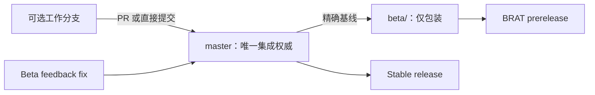

# GOV-002 — Master-First Branch And Beta Packaging

Document status: Current
Governance ID: GOV-002
Updated: 2026-07-19
Work item: B-117
Authority: PA 仓库的代码、测试、研究/设计文档、工程治理与 BRAT beta 分支来源规则；不定义 PA runtime 或用户产品行为。

Bootstrap source: 用户于 2026-07-19 直接决定：所有代码修改与研究产物先通过 PR 或直接提交进入 `master`，BRAT beta 再从已验证的 `master` 创建专用包装分支。B-117 是直接 engineering authorization，不要求外部 intake 来源。

## Context And Selected Governance Choice

旧流程允许开发分支在进入 `master` 前直接创建 beta 包装分支，导致 BRAT 已验证代码、开发 authority 与稳定集成线暂时分叉。新流程选择 `master-first`：工作分支仍可用于隔离和 review，但只有进入 `master` 的内容才可以成为 beta 或 stable 的发布输入。

## Requirements

- B-117/REQ-01: 所有已接受的 runtime 代码、测试、研究/设计文档、治理规则和 release tooling 修改必须先通过 PR 或直接提交进入并验证于 `master`。
- B-117/REQ-02: `beta/<version>` 必须从已验证且与 `origin/master` 同步的本地 `master` 精确 HEAD 创建；release 前不得在 beta 分支加入独立代码、测试、研究或文档提交。
- B-117/REQ-03: beta 分支只允许由 release tooling 创建一个版本/CHANGELOG/NOTICE 等 prerelease 包装提交及对应 tag；该提交不得合并或 rebase 回 `master`。
- B-117/REQ-04: beta 反馈修复必须先进入 `master`；需要重新测试时从更新后的 `master` 创建新的 `beta/<next-version>`，不得改写已发布 beta 分支或 tag。
- B-117/REQ-05: stable release 始终直接从已验证 `master` 创建；允许 PR merge 或用户授权的 direct commit，两者不形成不同发布通道。

## Non-goals

- NG-01: 不强制所有工作都直接在 `master` 编辑；短期 work branch 仍可用于隔离和 review。
- NG-02: 不追溯改写 `2.9.0-beta.1`、`2.9.0-beta.2` 或其他已发布历史。
- NG-03: 不授权 push、tag、publish、force-push 或 stable release。
- NG-04: 不修改 PA runtime、数据/隐私边界、Obsidian UI 或用户行为。

## Acceptance Criteria

- B-117/AC-01: `AGENTS.md`、BRAT skill、BRAT runbook 与 release process 使用同一条 `work → master → beta/stable` 路径，并明确 research/docs 也受约束。
- B-117/AC-02: prerelease release/dry-run 在 beta HEAD 不等于 `master` 时 fail closed，从 `master` 精确切出的匹配 beta 分支可通过来源门禁。
- B-117/AC-03: prerelease publish 只接受 tag/HEAD 为 `master` 之上唯一直接 release commit、本地 `master` 等于实时查询的 `origin/master`、版本 metadata 一致且 commit 只含完整生成包装文件；beta branch + tag 原子推送。
- B-117/AC-04: GitHub release workflow 对 prerelease tag 重复校验 release parent 仍属于当前 `origin/master` 历史、匹配 beta ref、版本 metadata 与完整包装文件集合；正常并发快进可接受，分叉/重写与手工不完整包装被拒绝。
- B-117/AC-05: 当前文档保留已发布 beta.2 的真实历史，不把新政策伪装成旧发布事实；focused tests、docs check 与 diff check 通过。

## Traceability

| Requirement / AC | Design | Delivery evidence |
| --- | --- | --- |
| B-117/REQ-01 + B-117/REQ-05 / B-117/AC-01 | [SDD — Authority flow](../active/master-first-branch-management/sdd.md#authority-flow) | [Tracker T-01](../active/master-first-branch-management/tracker.md#work) |
| B-117/REQ-02 / B-117/AC-02 | [SDD — Release preflight](../active/master-first-branch-management/sdd.md#release-and-publish-gates) | [Tracker T-02](../active/master-first-branch-management/tracker.md#work) |
| B-117/REQ-03 + B-117/REQ-04 / B-117/AC-03 + B-117/AC-04 | [SDD — Publish and workflow gates](../active/master-first-branch-management/sdd.md#release-and-publish-gates) | [Tracker T-03](../active/master-first-branch-management/tracker.md#work) |
| B-117/AC-05 | [SDD — Compatibility](../active/master-first-branch-management/sdd.md#compatibility-migration-and-rollback) | [Tracker T-04](../active/master-first-branch-management/tracker.md#work) |

## Authority And Change Boundary

- Current governance authority: 本文件；操作细节由 [BRAT Beta Testing Process](../../operations/brat-beta-testing.md) 与 [Release Process](../../operations/release-process.md) 实现。
- Delivery authority: [B-117 Active Package](../active/master-first-branch-management/README.md) 与 [Tracker](../active/master-first-branch-management/tracker.md)。
- Product escalation: 若实现会改变 PA runtime、数据/隐私边界、Obsidian UI 或用户行为，停止 governance-only lane，建立 Product Decision + Product Spec。
- Revisit trigger and successor rule: 只有 master-first 阻断无法通过 PR/direct commit 恢复、或发布平台要求不同 immutable source model 时，才通过 successor `GOV-xxx` 修订。

## Terminal Disposition

- 交付关闭后，本 contract 保持 `Document status: Current`；完整 B-117 package 进入年度 Archive。
