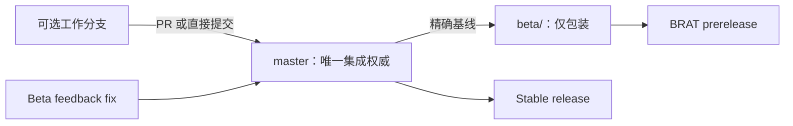

# GOV-002 — Master-First Branch And Beta Packaging

Document status: Current
Governance ID: GOV-002
Updated: 2026-09-09
Work item: B-117
Authority: PA 仓库的代码、测试、研究/设计文档、工程治理与 BRAT beta 分支来源规则；不定义 PA runtime 或用户产品行为。

Bootstrap source: 用户于 2026-07-19 直接决定：所有代码修改与研究产物先通过 PR 或直接提交进入 `master`，BRAT beta 再从已验证的 `master` 创建专用包装分支；2026-08-07 进一步决定发布资格不得强绑定项目文档生命周期状态。B-117 是直接 engineering authorization，不要求外部 intake 来源。

## Context And Selected Governance Choice

旧流程允许开发分支在进入 `master` 前直接创建 beta 包装分支，导致 BRAT 已验证代码、开发 authority 与稳定集成线暂时分叉。新流程选择 `master-first`：工作分支仍可用于隔离和 review，但只有进入 `master` 的内容才可以成为 beta 或 stable 的发布输入。

```mermaid
flowchart LR
  Work["可选工作分支"] -->|"PR 或直接提交"| Master["master：唯一集成权威"]
  Master -->|"精确基线"| Beta["beta/<version>：仅包装"]
  Beta --> BRAT["BRAT prerelease"]
  Master --> Stable["Stable release"]
  Feedback["Beta feedback fix"] --> Master
```

## Requirements

- B-117/REQ-01: 所有已接受的 runtime 代码、测试、研究/设计文档、治理规则和 release tooling 修改必须先通过 PR 或直接提交进入并验证于 `master`。
- B-117/REQ-02: `beta/<version>` 必须从已验证且与 `origin/master` 同步的本地 `master` 精确 HEAD 创建；release 前不得在 beta 分支加入独立代码、测试、研究或文档提交。
- B-117/REQ-03: beta 分支只允许由 release tooling 创建一个版本/CHANGELOG/NOTICE 等 prerelease 包装提交及对应 tag；该提交不得合并或 rebase 回 `master`。
- B-117/REQ-04: beta 反馈修复必须先进入 `master`；需要重新测试时从更新后的 `master` 创建新的 `beta/<next-version>`，不得改写已发布 beta 分支或 tag。
- B-117/REQ-05: stable release 始终直接从已验证 `master` 创建；允许 PR merge 或用户授权的 direct commit，两者不形成不同发布通道。
- B-117/REQ-06: beta/stable 发布只把 source/tag、版本/包装完整性、公开与法律文档、tests/lint/build/bundle 及 Community `Error` 作为硬门；Backlog、Discovery、Active Package、Tracker、Decision/Spec/Governance 状态和跨 tag 文档连续性只由独立 docs/CI gate 管理，不得阻断发布。

## Proportional Validation And Deployment

2026-09-05 用户授权按测试/发布流程审察建议实施第一阶段优化。此轮是本
contract 下的同会话工程维护，不创建产品 Decision 或新的跨会话 Active Package。

- 默认 `npm test` 运行不依赖仓库 `dist/` 的源码测试；工具链测试和两个绑定
  当前 production bundle 的测试分别提供显式入口。`test:all` 保留全部测试，
  CI 的完整路径、本地完整验证和发布都必须在 build 后调用它。覆盖率阈值不变，
  完整门禁在一次 Jest invocation 中统计，不能用分组覆盖率代替。
- 常规 CI 保持同一个 `validate` job。只有全部变更路径属于明确允许的仓库
  文档范围，才运行文档契约测试而跳过 runtime gates；完整 `docs:check` 始终
  advisory。未知路径、混合修改、缺失/无效 diff 基线回退完整验证。
  被打包的 `skills/**`、公开/法律/发布文档、workflow 和脚本不走文档捷径。
- 默认 `make deploy` / `make deploy-icloud` 继续完整验证。新增显式复用部署
  入口，只复制与当前 checkout 匹配的 production 产物；复用既有 build provenance
  校验 main.js，并比对 styles 与两个 manifest 的源/产物内容。
  校验失败必须在修改目标目录前退出。该入口仅证明构建身份，不代表测试已通过；
  仅在当前改动已经完成相应验证、构建输入未变时使用。
- 正式发布仍独立验证最终 tag 的版本、来源、构建与完整测试。预先验证的旧版本
  `dist/` 不能替代版本更新后的 tag 构建；不增加无证据的默认 skip-checks 或跨提交绿色缓存。

验证映射：CI classifier 用真实临时 Git 仓库覆盖重命名、删除、混合与未知基线；
测试分组验证无重叠且并集等于 Jest 的完整发现结果；部署测试覆盖当前产物复制及
过期/缺失/不匹配时目标不变；原 release tests 继续锁定 build-before-full-test。
回滚只需恢复 CI 的无条件完整路径、`npm test` 的完整入口及默认部署调用；无 PA
数据迁移或产品行为变化。

## Beta Preparation CI Reuse

2026-09-09 用户根据 beta.6 的耗时分析授权优化 beta 发布流程。本轮沿用本
contract 的同会话工程维护入口，不创建新的产品或跨会话过程包。已核实 beta.6
本地完整测试耗时 1205.859 秒，标签 CI Test 耗时 891 秒；同一 master 此前已有
成功 CI。本次选择复用 master CI 的源码验证，保留最终标签独立完整门禁。

- B-117/REQ-07: beta 本地 preparation 默认查询 origin 所属 GitHub 仓库的
  `.github/workflows/ci.yml`，只复用与干净 checkout、local master 和实时
  origin/master 完全相同 SHA 的 master push CI。最新 run/attempt 必须完成且成功，
  `validate` job 的依赖安装、Lint、Build、Test、Audit bundle 均必须成功；
  docs-only、跳过/缺失步骤、旧 SHA、旧成功 run、PR/fork、未知状态均不算证据。
- B-117/REQ-08: 查询有界，证据不可用时说明原因并回退本地完整门禁；显式
  `RELEASE_LOCAL_CHECKS=1` 或 `--local-checks` 可强制本地完整门禁。stable 保持
  原完整验证。dry-run 不查询网络或执行门禁。既有手动 skip-checks 不作为复用途径。
- B-117/REQ-09: 复用成功仍执行本地 diff、notice 和发布文档检查，在写入前确认
  HEAD、master、分支与工作区未漂移。此证据只替代 preparation 的本地重验，
  不声明本机 node_modules/dist 已通过验证；最终 tag 必须重新安装依赖、构建、
  完整 coverage、审计和发布。不创建本地 receipt/cache 服务。
- B-117/REQ-10: 发布后默认核实工作流成功、非草稿 prerelease、完整资产列表和
  下载的 manifest 版本；全资产下载/hash/语法验证用于明确请求或具体诊断。
  必须等下载自然完成再读取文件，轮询等待不计为额外测试时间。

验证映射与通过条件：

| Risk / requirement | Change | Minimum evidence | Pass / expansion trigger |
| --- | --- | --- | --- |
| REQ-07 错误复用 | CI 身份与完整步骤校验 | `release-ci-evidence-script` 表驱动反例 | exact success 接受；不完整、漂移、旧 run/attempt 拒绝；API schema 改动重跑 |
| REQ-08/09 门禁绕过或漂移 | release CLI 分支与写前复核 | `release-script` 临时 Git + fake API/npm | 成功只跑轻检查；无证据回退；stable/force-local 完整；漂移不创建发布状态 |
| REQ-09 最终发布包 | 保留 tag workflow | 既有 release/publish 契约与完整验证 | tag build-before-full-test、来源与包装检查仍通过；workflow变更扩大审查 |
| REQ-10 核验过重 | operations docs + BRAT skill | docs/release-docs + 定向文档审查 | 默认下载仅 manifest，实机证据仍独立；核验要求变化重审 |

回滚使用 `RELEASE_LOCAL_CHECKS=1 make release VERSION=...` 恢复本地完整门禁，
或撤回本节及对应自动复用实现；不改写已有 beta、tag 或 Release。此优化不是新版本
发布授权，也不改变 master-first、Community Error 或真实设备 smoke 的证据边界。

## Non-goals

- NG-01: 不强制所有工作都直接在 `master` 编辑；短期 work branch 仍可用于隔离和 review。
- NG-02: 不追溯改写 `2.9.0-beta.1`、`2.9.0-beta.2` 或其他已发布历史。
- NG-03: 不授权 push、tag、publish、force-push 或 stable release。
- NG-04: 不修改 PA runtime、数据/隐私边界、Obsidian UI 或用户行为。
- NG-05: 不从常规 CI 或文档维护中移除完整 `docs:check`；常规 CI 以独立 advisory
  报告 finding，不阻断后续 source/runtime gates。

## Acceptance Criteria

- B-117/AC-01: `AGENTS.md`、BRAT skill、BRAT runbook 与 release process 使用同一条 `work → master → beta/stable` 路径，并明确 research/docs 也受约束。
- B-117/AC-02: prerelease release/dry-run 在 beta HEAD 不等于 `master` 时 fail closed，从 `master` 精确切出的匹配 beta 分支可通过来源门禁。
- B-117/AC-03: prerelease publish 只接受 tag/HEAD 为 `master` 之上唯一直接 release commit、本地 `master` 等于实时查询的 `origin/master`、版本 metadata 一致且 commit 只含完整生成包装文件；beta branch + tag 原子推送。
- B-117/AC-04: GitHub release workflow 对 prerelease tag 重复校验 release parent 仍属于当前 `origin/master` 历史、匹配 beta ref、版本 metadata 与完整包装文件集合；正常并发快进可接受，分叉/重写与手工不完整包装被拒绝。
- B-117/AC-05: 当前文档保留已发布 beta.2 的真实历史，不把新政策伪装成旧发布事实；focused tests、release docs check 与 diff check 通过。
- B-117/AC-06: 本地 release 与 GitHub tag workflow 都只调用 `docs:check:release`；release checker 不读取 lifecycle status，常规 CI 仍调用完整 `docs:check` 并将 finding 作为不阻断后续 gate 的 advisory warning。

## Traceability

| Requirement / AC | Design | Delivery evidence |
| --- | --- | --- |
| B-117/REQ-01 + B-117/REQ-05 / B-117/AC-01 | [Release Process](../../operations/release-process.md) + [BRAT process](../../operations/brat-beta-testing.md) | Current repo instructions and release gate |
| B-117/REQ-02 / B-117/AC-02 | [`release.mjs`](../../../scripts/release.mjs) source gate | [`release-script.test.ts`](../../../__tests__/release-script.test.ts) |
| B-117/REQ-03 + B-117/REQ-04 / B-117/AC-03 + B-117/AC-04 | [`publish-release.mjs`](../../../scripts/publish-release.mjs) + [release workflow](../../../.github/workflows/release.yml) | [`publish-release-script.test.ts`](../../../__tests__/publish-release-script.test.ts) |
| B-117/AC-05 | Current release/changelog behavior | [`changelog-script.test.ts`](../../../__tests__/changelog-script.test.ts) |
| B-117/REQ-06 / B-117/AC-06 | [Release Process — gate levels](../../operations/release-process.md#release-gate-levels) | [`check-release-docs-script.test.ts`](../../../__tests__/check-release-docs-script.test.ts)、[`release-script.test.ts`](../../../__tests__/release-script.test.ts) |

## Authority And Change Boundary

- Current governance authority: 本文件；操作细节由 [BRAT Beta Testing Process](../../operations/brat-beta-testing.md) 与 [Release Process](../../operations/release-process.md) 实现。
- Delivery authority: current release tooling, workflow, operations docs and focused tests listed above。B-117 已于 2026-07-19 完成验证并于 2026-07-21 closeout。
- Product escalation: 若实现会改变 PA runtime、数据/隐私边界、Obsidian UI 或用户行为，停止 governance-only lane，建立 Product Decision + Product Spec。
- Revisit trigger and successor rule: 只有 master-first 阻断无法通过 PR/direct commit 恢复、或发布平台要求不同 immutable source model 时，才通过 successor `GOV-xxx` 修订。

## Terminal Disposition

- 本 contract 保持 `Document status: Current`。B-117 的 Feature Home、Plan、SDD 与 Tracker 已将稳定规则和验证证据吸收到本 contract、release tooling、operations docs 与 focused tests，因此 closeout 后删除，不复制进 Archive。

## Delivery Closeout Evidence

- 2026-07-19：release/publish/changelog 3 个 focused suites 共 21 tests 通过，覆盖 beta-only commit 拒绝、实时 `origin/master` drift、metadata/file-set gate、原子 beta+tag push 与 sibling beta changelog。
- TypeScript、ESLint、Node syntax、workflow YAML、docs check 与 `git diff --check` 通过；独立 review 无 P0/P1/P2。
- 本 track 不改变 PA runtime 或 Obsidian UI，因此无需 app smoke。
- 无剩余工作进入 Backlog；push、tag、publish 与 release 权限仍保持独立。
