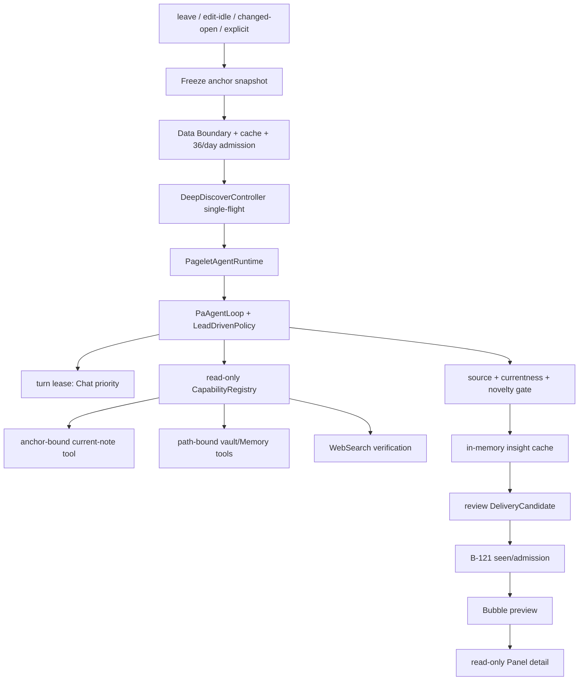

# Pagelet Agent Deep Discover Software Design Document

Document status: Current
Design status: Approved
Delivery status: Closed
Updated: 2026-08-01
Work item: B-123
Implementation step: Step 1 — Pagelet Agent Deep Discover
Authority: [Owner decision record](../proposal-review-response-2026-07-28.md)
Restart condition: B-123 已由 owner 于 2026-08-01 关闭；本文永久保留为 Step 1 source-verified design 与最终验证依据。
Handoff: [Implementation Handoff Brief](../implementation-handoff.md)
Direction: [Pagelet Agent proposal](./pagelet-agent-proposal.md)

## 1. Scope

本 SDD 只设计 Step 1：以一篇冻结笔记为锚点运行只读 Agent，自主使用 vault
读工具追查线索，产出有来源、可验证、对用户有新增价值的自由文本洞察，并通过现有
Bubble → Panel 与 B-121 Attention-Aware Delivery 交付。

本 Step：

- 复用 `PaAgentLoop`、`CapabilityRegistry`、现有只读工具和 Chat 模型。
- 支持离开笔记、编辑停止、打开已变化笔记与显式命令四类触发。
- 直接切断 generic preload、foreground review、Discovery、Scope Recap、Quiet
  Recall 的旧 single-shot provider 调用路径；不并行维护两套生产管道。
- 保留 local explicit-link、scope explanation、Maintenance/Graph 等零 provider
  能力作为 UI 事实或降级信息，但它们不能伪装成 Agent insight。
- 不写 vault，不注册 action capability，不执行代码、命令或 `eval`。

本 Step 不实现 Operations、Insight action、Pagelet → Chat handoff 或任何写入能力。

## 2. Settled Decisions

以下内容直接采用 owner 决策，不在实现中重新选择：

- Agent 自主决定探索路径；模型自由度优先。
- 输出是自然语言 Markdown，不使用 rigid insight schema。
- 和 Chat 使用同一 provider/model。
- 正常预期 3–5 turns、8–12 tool calls；只设 30 tool calls / 180s 熔断器。
- WebSearch 可用于验证，但 vault 是发现来源。
- 每日上限 36 次。
- Agent insight 进入 B-121 delivery 管道，复用 Bubble → Panel。
- 无值得呈现的 insight 时保持沉默。

`NO_INSIGHT` 是内部 terminal control token，只用于把“没有值得说的”映射为静默
结果；它不是 insight 输出 schema，也不会显示给用户或写入 cache。

## 3. Current Source Baseline

以下名称和行为已按当前源码核实。

### 3.1 Agent runtime

- `src/ai-services/pa-agent-loop.ts`
  - `PaAgentLoopOptions` 已注入 model、tool executor、host policy、取消和预算。
  - `PaAgentLoop.run()` 已返回 transcript、turn summary、最终自由文本和 timing。
  - 当前没有 turn-level lease；Chat/Pagelet 优先级不能只靠 host policy 等待，否则
    policy promise 可能在取消后迟到取得许可。
- `src/ai-services/pa-agent-runtime.ts`
  - Chat runtime 内部匿名 model adapter 负责 native tool schema、流式调用与 fallback。
  - Chat prompt、required-capability policy、active-note tool 和 legacy event adapter
    与 Chat 强耦合；不直接加入 `mode === "pagelet"` 分支。
- `src/ai-services/capability-registry.ts`、
  `src/ai-services/capability-adapter.ts` 与
  `src/ai-services/pa-agent-host-tools.ts`
  - 可直接组成 Pagelet 独立的只读 registry 和 tool executor。
- `src/ai-services/chat-tool-factories.ts`
  - `get_current_note_context` 和 path 省略时的 `inspect_obsidian_note` 读取 active
    workspace，不能用于离开笔记后的 anchor。
  - 除 `search_memory` 外，vault 枚举工具当前没有统一应用 Pagelet Data Boundary。
- `src/ai-services/chat-service.ts`
  - `streamLLM()` 是所有 Chat run 的最窄抢占入口。

### 3.2 Pagelet runtime

- `src/pagelet/orchestrator.ts` 是触发、Pet、Bubble、Panel 和旧分析路由的唯一协调层。
- `src/pagelet/PageletHost.ts` 是 plugin/provider 与 Pagelet UI 的窄边界。
- 当前五条 provider-backed 路径互相独立：
  - `BackgroundPreparationCoordinator` → `PreloadEngine` →
    `createPreloadAnalyzeCallback()`
  - `AnalysisSessionManager` → `createForegroundAnalyzeCallback()` →
    `PageletReviewModel`
  - `discoverConnections()` → `runDiscoveryAnalysis()`
  - Scope Recap timers → `runScopeRecap()`
  - Quiet Recall timers/commands → `runQuietRecall()`
- `PreloadCache` 只有一个内存 entry，不含 anchor/source/boundary/pipeline identity。
- `handleLeafChange()` 当前只接收新 leaf，未保存离开的 Markdown anchor。
- foreground 外层 timeout 为 120s；不能继续包住新的 180s Agent breaker。

### 3.3 Delivery and UI

- `src/pagelet/bubble/types.ts`
  - `DeliveryCandidate` 已支持多 `sourceRefs`。
  - `DeliveryCandidateKind` 已包含 `"review"`，用它承载 Deep Discover insight，
    不增加平行的 UI payload hierarchy。
- `src/pagelet/attention/types.ts` 与
  `AttentionAwareDeliveryStore.ts` 当前只接受 `recall | recap`。
- `BubbleView.show()` 已在真实可见后提交 receipt。
- `BubbleCoordinator` 当前没有 Review/Agent insight ticket。
- `PanelView` 已支持 `preparedReadOnly`；timeline/insight CSS 可复用。
- stable command `pa-pagelet:discover-connections` 已存在，命令 ID 保持不变。

### 3.4 Settings and storage

- `src/settings/pagelet/index.ts` 统一管理 Pagelet defaults、merge 与 Settings UI。
- `PageletRateLimiter` / localStorage storage 已提供 per-vault content-free usage
  persistence。
- Chat model authority 是 `chatModelName`；不新增第二个模型选择器。

### 3.5 Proposed modules and fields

- `src/ai-services/agent-run-coordinator.ts`
- `PaAgentLoopOptions.turnLeaseProvider`
- `src/pagelet/agent/anchor-snapshot.ts`
- `src/pagelet/agent/anchor-note-tool.ts`
- `src/pagelet/agent/lead-driven-policy.ts`
- `src/pagelet/agent/pagelet-agent-runtime.ts`
- `src/pagelet/agent/pagelet-agent-cache.ts`
- `src/pagelet/agent/pagelet-agent-quality-gate.ts`
- `src/pagelet/agent/pagelet-deep-discover-controller.ts`
- `src/pagelet/agent/delivery-adapter.ts`
- `PageletSettings.deepDiscoverEnabled`
- `DeliveryKind = "recall" | "recap" | "review"`
- `NudgeOwner.AgentInsight`

## 4. Architecture



### 4.1 Ownership

| Component | Ownership |
| --- | --- |
| `AgentRunCoordinator` | 容量 1 的公平队列；Chat 高优先级；可取消 lease。 |
| `PaAgentLoop` | turn/tool/budget/wall-clock/cancel；不理解 Pagelet 语义。 |
| `PageletAgentRuntime` | Pagelet prompt、固定工具集合、registry、model adapter、loop。 |
| `LeadDrivenPolicy` | 跟踪 content-free evidence checkpoint 与真实调用数；正常阶段由模型停止，接近熔断时预留一次 finalization。 |
| `DeepDiscoverController` | trigger 去重、snapshot、cache、36/day、single-flight、supersede、result callback。 |
| `QualityGate` | source grounding、source currentness、backlink/seen novelty；不读取 model confidence。 |
| `PageletAgentCache` | 按 anchor 保存最后一个已验证结果；只在内存。 |
| `delivery-adapter` | verified result → `DeliveryCandidate(kind="review")`。 |
| `PageletOrchestrator` | 触发与 Bubble/Panel 路由；不直接调用模型。 |

## 5. T1 — Anchor Freeze

### 5.1 Snapshot

```ts
interface PageletAnchorSnapshot {
  path: string;
  content: string;
  mtime: number;
  size: number;
  contentHash: string;
  capturedAt: number;
}
```

冻结流程：

1. trigger 记录准确的 target path；edit-idle 必须使用 modify event 的 path，不读取稍后
   的 active note。
2. 从 path 解析 `TFile`，确认 Markdown、Data Boundary、Pagelet scope。
3. 记录 pre-read `{mtime, size}`，读取完整内容，再验证 post-read stat 未变。
4. 若读取期间变化，丢弃本次 snapshot，由最新 trigger 重排；不扩大到新 active note。
5. `handleLeafChange()` 维护 previous Markdown anchor；离开时先为旧 path 请求 snapshot，
   再挂载新 leaf。

### 5.2 Anchor-bound tools

Pagelet registry 中：

- `get_current_note_context` 保持现有工具名，但实现只读冻结 snapshot；无论 workspace
  后续切换到哪篇笔记，都返回同一个 path/content/mtime/contentHash。
- `inspect_obsidian_note` 要求显式 path；省略时只映射到 frozen anchor，绝不 fallback
  到 active note。Pagelet variant 可返回 bounded full text + structure，以支持深读。
- `read_note_outline` 始终要求 path。
- 所有 path 参数 normalize 后重新检查 Data Boundary。

## 6. Agent Loop and Tools

### 6.1 Fixed read-only tool set

- `search_memory`
- anchor-bound `get_current_note_context`
- Data-Boundary-aware `search_vault_snippets`
- path-bound `inspect_obsidian_note`
- Data-Boundary-aware `search_vault_metadata`
- Data-Boundary-aware `list_recent_notes`
- path-bound `read_note_outline`
- `webSearch`（provider 可用时）

不注册 Skill、Canvas、tags、action、shell、script、command 或 write capabilities。
Tool executor 额外传固定 allowlist，形成 registry + executor 双层约束。

### 6.2 Data Boundary

现有 vault tool factory 增加可选 `isPathAllowed(path)`：

- metadata/recent 在候选枚举前过滤；
- outline/inspect 在读取前拒绝；
- snippet search 在结果送入模型前过滤；
- anchor 在 snapshot 前拒绝；
- `search_memory` 继续使用现有 host filter，但只提供 lead，不能单独成为最终非 anchor
  内容证据；
- 每个非 anchor vault source 在 observation 进入下一 model turn 前，必须按当前
  Data Boundary 重新捕获正文与 content identity；任一 source 无法读取、越界或变化时，
  整条 observation fail closed 丢弃，最终证据需再经 inspect/snippet/outline 验证。

被排除路径的标题、path、metadata、snippet 和正文都不进入 model observation。

### 6.3 Lead-driven prompt

系统提示只定义任务与安全边界，不规定 insight JSON：

1. 先完整理解 anchor，提取可追查 leads。
2. 自主选择 vault 工具，优先发现矛盾、思维演进、缺口、正反面和结构盲区。
3. WebSearch 只能验证已从 vault 形成的外部事实，不能单独生成 vault insight。
4. 已有 wikilink/backlink 或“都提到 X”不是新洞察。
5. 最终只保留足以改变行为的最强发现；证据不足则 `NO_INSIGHT`。
6. 最终文本使用自然 Markdown；只引用成功正文读取返回的准确 vault path，每个 path
   使用 inline code，并附短证据片段。

正常运行由模型自行停止。Lead policy 在 anchor + 至少一个非 anchor 正文来源已进入
模型后标记 answer-ready，并提示正常目标 3–5 turns / 8–12 tool calls；它不在正常范围
强制截断探索。接近最后一个 turn、真实调用预算耗尽或只剩 30 秒 wall-clock 时，切换
`final_answer_only` 预留一次收尾。`maxTurns=12` 只用于防异常，产品熔断仍以
`maxToolCalls=30`、`maxWallClockMs=180_000` 为准。

Pagelet native model 在每轮 provider prompt 投影时执行 Pagelet-aware compaction：
累计 observation 达 64k 的 70% 后压缩到该目标内，优先保留最近非 anchor 正文证据、
anchor 与 Web 验证，旧 search/metadata/error 退化为 content-free source summary；
原始 transcript、tool provenance、source records 与 quality-gate 输入不改写。不增加
产品层 per-run token budget。

WebSearch 使用 turn-level control snapshot 执行验证门控：首轮既不向 native model
暴露 schema，也由 dispatcher 拒绝幻觉调用；只有成功 vault observation 已进入模型后，
下一 turn 才解锁。即使模型在同一 hybrid turn 同时请求 anchor 与 WebSearch，WebSearch
仍保持阻断。被阻断的 preflight 调用不计入 tool-call budget，也不写入 duplicate ledger。

## 7. T2 — Cache Identity

```ts
interface PageletAgentSourceSnapshot {
  path: string;
  mtime: number;
  size: number;
  contentHash: string;
}

interface PageletAgentCacheIdentity {
  pipelineVersion: "pagelet-deep-discover-v1";
  anchor: PageletAnchorSnapshotIdentity;
  sources: PageletAgentSourceSnapshot[];
  dataBoundaryIdentity: string;
  providerPolicyIdentity: string;
}
```

- source path 来自本次成功 tool result 的 `sourceRecords`，只保留实际进入模型的
  vault sources。
- run 结束后重新读取 cited sources 并建立 snapshot；snapshot 过程中变化则失败。
- cache read 时重新验证 anchor、每个 source、Data Boundary、provider/model/locale
  policy identity 与 pipeline version。
- source rename/delete/modify、boundary/provider/model/locale 改变或 pipeline bump
  都使 entry 失效。
- WebSearch observation 记录 URL + observation hash；含 Web 验证的 entry 最长复用
  24 小时，避免把外部事实无限期视为 current。
- cache 只在内存，不持久化 note text；36/day usage 与 cache 分离并 content-free 持久化。

## 8. T3 — Quality Gate

模型最终文本不能凭 self-reported confidence 通过。按以下顺序 fail closed：

1. **静默 gate**：空文本或 `NO_INSIGHT` → quiet。
2. **工具 provenance**：至少成功读取 anchor；所有引用 path 必须出现在成功 tool
   source records 中。
3. **跨笔记 gate**：至少两个不同的、仍在 Data Boundary 内的 vault source，其中一个
   必须是 anchor。
4. **source support**：最终文本引用准确 source path；每个 cited source 的正文或工具
   snippet 与 finding 至少存在一个可验证的 evidence overlap。只出现文件名不算支撑。
   引用解析按 wikilink、Markdown link、inline-code path 的完整 span 进行，裸 `.md`
   只扫描未占用区间；含目录的 path 必须精确匹配，只有无目录且 basename 唯一的短
   wikilink 才允许解析到完整 path。未知或歧义 path 一律 fail closed。
5. **currentness**：anchor 与 cited source 的 live snapshot 必须仍等于 run snapshot。
6. **backlink novelty**：若所有非 anchor sources 已是 anchor 的显式 links/backlinks，
   且文本只有“相关/相似/都提到”等表层关系，没有矛盾、演进、缺口、因果、风险或
   具体行动证据，则拒绝。
7. **shown novelty**：构建 `review` delivery receipt；若 B-121 ledger 已 seen，或当前
   cache 已有相同 normalized body + source identities，则不再次主动投递。

Quality Gate 返回 verified source refs 与拒绝 reason code；日志只记录 reason、数量、
timing，不记录 path 或正文。

## 9. T4 — Chat-Priority Concurrency

新增通用容量 1 coordinator：

- Chat 在 `ChatService.streamLLM()` 开始前申请 high-priority run lease，在 success、
  error、abort 的 `finally` 释放。
- Pagelet 不持有整 run lease；`PaAgentLoop` 每个 turn 开始前通过
  `turnLeaseProvider` 申请 low-priority lease，并在 model + tool phase 的 `finally`
  释放。
- Chat 在 Pagelet turn 中排队时，当前 Pagelet turn 完成；下一 turn 因 high-priority
  waiter 暂停，Chat 先运行。
- Pagelet wait 支持 user/supersede/unload abort 和剩余 wall-clock timeout；取消后
  waiter 从队列移除，不能迟到取得 lease。
- 同一时刻只运行一个 Pagelet controller；新的自动 trigger 合并为每个 anchor 最新
  snapshot。显式 trigger 可 supersede 同 anchor 的旧自动任务。

## 10. T5 — Cost and Settings

- `36/day` 定义为“通过 cache/currentness/admission 后实际启动的 Deep Discover
  run”；cache hit、stale、boundary deny、provider unavailable 与 quiet local skip
  不计数。
- 每个 run 同时记录 content-free `modelTurns`、`toolCalls`、wall time 和可得的 token
  usage，便于真实 dogfood 后优化。
- 使用独立 per-vault localStorage bucket `deep-discover`；不复用旧 Preload、Recap、
  Recall limiter，避免双计数。
- 第 37 个自动 trigger 静默跳过；显式 trigger 显示本地 limit 说明。
- Settings 新增：
  - `Deep Discover` 开关；
  - “使用 Chat 模型：<model>”只读说明；
  - “今日 X / 36 次”，以及本日 model turns/tool calls。
- 不允许用户调高 36 或 30/180s；本 Step 不增加 token budget 控件。
- 新安装默认开启；已有安装在新 key 缺失时继承旧 `preloadEnabled`，尊重既有后台
  provider opt-out。旧 preload interval/cap/token setting 仅保留反序列化兼容，不再
  驱动 runtime，也不继续显示。

## 11. T6 — B-121 Delivery

`pageletAgentInsightToDeliveryCandidate()`：

```ts
{
  id: cacheIdentityHash,
  kind: "review",
  title: firstHeadingOrSentence,
  body: verifiedFreeformMarkdown,
  sourceRefs: verifiedSources,
  whyNow: localizedTriggerExplanation,
  preparedAt,
  staleStatus: "fresh",
  route: { surface: "panel", payloadType: "pagelet-agent-insight-v1" },
  deliveryReceipt: buildReviewDeliveryReceipt(...)
}
```

- Attention `DeliveryKind`、fingerprint builder、parser/store allowlist 扩展 `"review"`；
  persisted schema 仍兼容旧 recall/recap entries。
- `NudgeOwner.AgentInsight` 使用共享 quiet hours/cooldown、seen gate 与 Pet ownership。
- 自动结果：candidate admission → Pet nudge → Bubble 展示一条摘要；Bubble 真正可见
  后才 `markSeen`。
- Bubble `查看` 打开 read-only Panel；Panel 显示完整自由文本和所有 source links，
  不显示保存/写入操作。
- 显式命令不受 seen gate 阻断；有效 cache 立即打开 Panel，force run 完成后原位更新。
- 无 Bubble anchor 的自动结果留在 cache，不制造 Notice；下一次 Pagelet surface
  可读取。

## 12. T7 — Direct Migration

生产切换在同一个 orchestrator change 中完成：

| 旧入口 | 新入口 |
| --- | --- |
| `BackgroundPreparationCoordinator` / PreloadEngine callback | Deep Discover leave/open/edit-idle scheduler |
| `analyzeFiles()` / foreground review callback | explicit Deep Discover |
| `discoverConnections()` single-shot | explicit Deep Discover；local explicit-link 仅作辅助事实 |
| Scope Recap provider timer/retry | Deep Discover cache/explicit entry；local overview 可保留解释 |
| Quiet Recall evaluator/timer/Bubble Discover | Deep Discover cache/explicit entry |

切换要求：

- 不再创建/启动旧 background coordinator。
- 不再注册旧 Recap/Recall provider timers。
- Review、Discover、Recap、Recall 命令保留稳定 ID/名称，但全部路由到同一个 controller。
- 旧 implementation 可暂留为未引用 rollback code，不能被 command、timer、leaf event
  或 Bubble callback 调用。
- 删除旧 Settings UI 控件与生产 factory wiring；旧 persisted fields 保留兼容读取。
- 单次 trigger 只能产生一个 budget reservation、一个 Agent run、一个 cache write 和
  一个 delivery candidate。

## 13. Trigger Lifecycle

| Trigger | Snapshot target | Cache behavior | UI behavior |
| --- | --- | --- | --- |
| Leave note | previous Markdown path | unchanged/valid → skip | quiet background |
| Edit idle (5s) | exact modified path | latest snapshot wins | quiet background |
| Open changed note | newly opened path | valid cache → no run | cached candidate available |
| Explicit command/Pet action | current Markdown path | show valid cache, then force refresh | working → Panel or quiet |

Controller 在 unload、feature disable、Data Boundary/provider identity change时 abort
active run、清空 pending queue 与 content cache，并释放所有 lease/listener/timer。

## 14. Privacy and Security

- runtime policy 是 read-only；不设置 `allowWrite`，不注册 WAF/action provider。
- vault source content 仅发送到用户已配置的 Chat provider；首次自动使用显示非阻塞
  disclosure，Settings 可关闭。
- WebSearch query 由模型产生，只能验证已形成的 vault lead；网络结果按 untrusted
  observation 处理。
- cache 含 note-derived text，因此只在内存；usage/attention storage 只含 opaque
  fingerprint、计数和时间。
- debug/usage/dogfood summary 默认不记录 note path、prompt、insight 正文或 Web query。

## 15. Compatibility and Rollback

- desktop/mobile 共用 runtime；UI 继续使用现有 Bubble/Panel responsive behavior。
- model/provider 无 native tool calling、WebSearch unavailable、Memory unavailable或
  某个 read tool 失败时，Agent 可用剩余 vault tools 继续；无法满足 source gate 则
  quiet。
- plugin reload 会丢失 insight cache，但不会损坏 vault；usage 与 seen ledger继续。
- rollback 只需恢复旧 orchestrator routes/Settings presentation；新 cache 无磁盘迁移，
  新 `review` seen entries可安全保留或随 fingerprint version bump 失效。
- 不改变 source notes、Memory index、Review Queue 或 Saved Insight。

## 16. Test Matrix

| Requirement | Unit / integration | App smoke | Failure / fallback |
| --- | --- | --- | --- |
| T1 anchor freeze | active leaf 切换后仍返回旧 snapshot；read-race abort；path normalize | 写完 A 切到 B，结果仍以 A 为 anchor | deleted/renamed/modified snapshot fail closed |
| T2 cache | anchor/source/boundary/provider/pipeline identity matrix | reopen unchanged note instant cache；改任一 source 后 rerun | corrupt/unavailable storage不影响内存 cache |
| T3 quality | source path/support/currentness/backlink/seen novelty matrix | 无价值 note 不 nudge；有价值 result source 可打开 | unsupported/stale/seen → quiet |
| T4 concurrency | Pagelet current turn → Chat → Pagelet next turn；abort waiter无 lease leak | Pagelet working 时发 Chat，Chat 优先完成 | Chat error/abort 仍 release |
| T5 cost | 36/37 boundary；cache hit不计；content-free metrics | Settings 显示今日 usage | storage unavailable → fail closed for auto、explicit explains |
| T6 delivery | review fingerprint/ledger/ticket/Bubble visibility/Panel route | Pet nudge → Bubble → read-only Panel | render failure不 mark seen |
| T7 migration | commands/events 只命中新 controller；旧 provider spies 为 0 | Review/Discover/Recap/Recall 均进入同一结果面 | no double timers/calls/count |
| verification-only Web | 首轮 schema/dispatcher 均阻断；vault observation 后下一轮解锁；同轮 hybrid 不越权 | vault lead 后才允许外部事实验证 | vault read 失败或越界 → Web 保持阻断 |
| loop safety | 30 calls、180s、12 turns、abort、one finalization | cancel/reload无残留 working state | quiet on incomplete unsupported result |

Local validation 使用最接近的 Jest suites、type-check、diff/community scan；最终
runtime/UI 证据必须来自 `make deploy` 后的 Obsidian。

## 17. Real-vault Dogfood Protocol

同一版本、同一 provider/model、同一 Data Boundary 下选至少 20 个 anchor，覆盖：

- permanent/literature/unsorted/project 等不同目录；
- 短、中、长笔记；
- 已有 backlinks 与几乎无 links；
- 新近编辑与旧笔记；
- 预期有矛盾/演进/缺口，以及预期应静默的 negative cases。

每个 case 保存仅限当前 dogfood session 的对照：

| Dimension | Single-shot baseline | Deep Discover |
| --- | --- | --- |
| source correctness | 0/1/2 | 0/1/2 |
| incremental multi-hop value | 0/1/2 | 0/1/2 |
| novelty beyond backlinks | 0/1/2 | 0/1/2 |
| action usefulness | 0/1/2 | 0/1/2 |
| false positive | yes/no | yes/no |
| latency | ms | ms |
| provider/model turns and tool calls | count | count |

production 不保留 single-shot route。对照 runner 只在显式 dogfood/debug session 注入
legacy baseline function，不注册 command/timer，不写 vault；原始 note/insight 内容不进
repo、Settings、audit 或持久日志。

Step 1 通过条件：

- 至少 20 cases 完成；
- Deep Discover 在 source correctness 不下降的前提下，multi-hop/novelty/action
  总体优于 baseline；
- false positive 与静默 negative cases 可接受；
- Chat 抢占、36/day、30/180s、cache invalidation、B-121 seen 行为均有真实证据；
- owner dogfood 判断质量提升成立。

## 18. Open Technical Findings

### 18.1 2026-07-31 first-pass checkpoint

匿名真实 vault 第一轮选取 20 个 cases；其中 17 个完成 provider run，后 3 个由真实
36/day 上限 fail closed，未绕过产品限制。17 个实际结果为 6 verified / 11 quiet：

- quiet reasons：`ungrounded-path` 5、`runtime-incomplete` 3、`no-insight` 1、
  `insufficient-vault-sources` 1、`unsupported-source` 1；
- verified source 数：5 个结果使用 2 sources，1 个结果使用 4 sources；
- latency：mean 119.5s、median 124.2s、P90 176.0s、P95 180.0s；
- 平均 7.7 model turns / 16.2 tool calls。

真实行为证据已覆盖 cache hit 不计额度、policy identity 失效、Chat 排队优先、
B-121 detail seen 后不再主动展示，以及达到 36/day 后的静默拒绝；dogfood 期间未捕获
plugin error。真实 vault 的插件、配置、日志与 `pa-pagelet-*` local state 随后已恢复
到 dogfood 前状态。

本轮暴露并已进入实现闭环的技术缺陷：

1. 含空格的正确 inline-code path 会被裸 `.md` matcher 二次切碎为
   `ungrounded-path`；已改为 typed、span-aware、exact-first 的 fail-closed 解析，
   basename fallback 仅保留给唯一 wikilink，并覆盖伪 scheme、强调语法及路径内
   `%` / `#`。
2. Pagelet provider prompt 未实际执行 64k observation 投影，且倒数第二 turn 未预留
   finalization；已接入不改写原始 transcript/provenance 的 Pagelet-aware prompt
   projector，并在普通 lease、model、tool 阶段使用 30 秒 soft deadline，逐轮取消
   未完成请求后再进入 `final_answer_only`。
3. 全部 vault tool 结果为可纠错错误时会过早收束；已允许
   `recoverable_error` / `schema_invalid` 各 run 共用一次纠错机会，仍对
   `policy_rejected`、预算与重复调用 fail closed。

修复版最终复审未发现 P0–P2；`make deploy` 已通过 170 suites / 3602 tests、lint、
type-check、build，并确认 `dist` 与 test vault 部署产物一致。Mac 锁定且 Obsidian
未运行，因此本次部署后的 app 内 provider-free runner 与可视交互证据仍待解锁后补齐。

仍需在每日额度恢复后用修复版重跑至少 20 个有效 cases，并完成同版本 baseline 盲评；
不得绕过 36/day 或高风险确认。Mac 解锁后补 Bubble → Panel 可视交互证据。当前
first-pass 不满足 §17 的最终通过条件。

### 18.2 2026-08-01 repaired-run checkpoint

修复版在同一 Qwen provider、`deepseek-v4-pro` 模型和原 Data Boundary 下完成 20 个
匿名分层 cases；覆盖 4 类目录、短中长笔记、低/高链接密度、新近/较旧笔记与 5 个
预期静默样本。20 个 case 全部完成，0 blocked：

- Deep Discover：14 verified / 6 quiet；累计 118 model turns、215 tool calls；总 wall
  time 1,975,316ms，mean 98.8s。
- single-shot baseline：同版本 legacy function 仅注入当前 renderer session，不注册
  command/timer、不写 vault；总 wall time 226,962ms，mean 11.3s。
- Deep quota 从 0 严格递增到 20 / 36；两批之间等待真实 12/hour 与 baseline
  10/hour rolling window 自然释放，未清理、恢复、调高或绕过 limiter。
- 质量门实际静默原因包括 `insufficient-vault-sources`、`runtime-incomplete` 与
  `ungrounded-path`；均以 fail-closed 结束，没有形成不可核验交付。
- `data.json` hash 在 dogfood 前后保持不变；原始 note/path/insight 只留 renderer
  内存，CLI、repo、Settings 与持久日志只保留 content-free 指标。

本轮开始前发现 explicit / `force=true` admission 会绕过 Deep limiter，与 §10 的
“所有实际启动 run 计入 36/day”冲突。已移除该旁路并补 2 个回归测试：force run
成功时先 reserve、provider admission 后 commit；quota exhausted 时不进入 provider。
修复后 `make deploy` 通过 170 suites / 3604 tests、lint、type-check 与 build；独立复审
未发现 P0–P2。

test vault provider-free runner 为 26 PASS / 1 BLOCKED / 0 bugs；受保护的 durable
Memory probe 按设计未改 fixture。清空缓冲后复跑及持续观察均无 error/console error。
早先一次 VSS dirty-journal flush 失败未复现，属于 Memory 后台链而非 Deep blocker。

owner 已完成 20-case 匿名 A/B 盲评。各维度均为每 case `0/1/2`：

| Dimension | Deep Discover | baseline | 20-case mean |
| --- | ---: | ---: | --- |
| source correctness | 33 | 16 | 1.65 vs 0.80 |
| incremental multi-hop value | 26 | 10 | 1.30 vs 0.50 |
| novelty beyond backlinks | 18 | 4 | 0.90 vs 0.20 |
| action usefulness | 9 | 2 | 0.45 vs 0.10 |
| false positive | 0 | 3 | 0% vs 15% |

Deep Discover 的 multi-hop、novelty 与 action 合计 53，对照组为 16；source
correctness 未下降，且从 16 提升到 33。结合 14 verified / 6 quiet 与 0 false
positive，owner 盲评分支持 §17 的质量提升门通过。代价是平均 wall time 98.8s，对照组
11.3s；本 Step 保留 36/day 与安静交付边界，不把速度差异伪装为等价体验。

评分后已销毁临时 dogfood runtime，并从完整备份恢复真实 vault 的原插件
`2.9.0-beta.1`。6 个关键文件逐字节一致，完整插件目录仅目录时间戳不同；原
Pagelet local state 已恢复，dogfood 实际消耗的 Deep 日配额仍保留为 20 / 36，未回滚。

最终可见验证在已部署的 test vault 2.8.4 / Obsidian 1.13.4 完成：以
`pagelet-smoke-golden.md` 为 active leaf，使用仅当前 renderer session 的
provider-free verified candidate，真实点击 Pet 打开 Bubble，再点击 `View insight`
进入 source-backed Connection Discovery Panel；候选使用 session-only attention store，
provider calls 与持久写入均为 0。独立 `Settings - test` 窗口同时确认 Deep Discover
已启用、共用 Chat model `deepseek-v4-flash`、provider/cost 提示可见，今日用量为
`0 / 36 runs · 0 model turns · 0 tool calls`。候选随后清理，debug 与 mobile emulation
均关闭，Obsidian error buffer 为空。

UI 观察期间仍出现 test vault 既有 Memory dirty-journal 的 VSS reconcile/flush 失败；
它未进入 Obsidian error buffer、未影响 Deep candidate/Bubble/Panel/Settings，并与本次
provider-free UI 路径无调用关系，因此不阻断 Step 1。该现象属于独立 Memory/VSS
follow-up，不在 B-123 内扩 scope。至此 §17 的 Step 1 通过条件全部满足；后续只需
owner 已于 2026-08-01 关闭 B-123，并启动 B-101 / Step 2。

## 19. Approval

- Design authority: project owner decision record §4–§7。
- Approved on: 2026-07-30 owner implementation authorization；本 source-verified SDD
  于 2026-07-31 落地。
- Authorized scope: Step 1 SDD、runtime/tests、`make deploy`、真实 vault 20+ case
  dogfood；不含 Git commit、push、tag、publish、release 或 Step 2/3。
