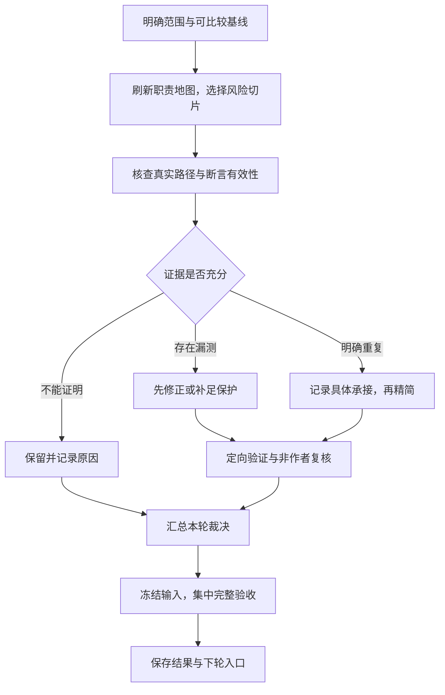

# 可复用测试审计与精简流程

Document status: Current
Updated: 2026-09-26
Authority: GOV-003/004/005 的执行指引与经验总结；不替代契约，不新增实施、外传、变异、Git 或发布授权。

目标是在保留可信回归保护的前提下，降低测试维护、执行和诊断成本。顺序是：
**先证明测试有效，再证明重复，最后实施精简。** 测试增加、修正或明确保留，都可以
是审计成果；删减比例不作为必须完成的指标。

约束来源：[GOV-003 适度测试](../governance/gov-003-proportionate-test-design.md)、
[GOV-004 审计与质量保护](../governance/gov-004-test-audit-quality-preservation.md)、
[GOV-005 本轮精简](../governance/gov-005-quality-first-test-reduction.md)。
借鉴 [OpenClaw test-audit](https://github.com/openclaw/openclaw/blob/main/.agents/skills/test-audit/SKILL.md)
按契约、可信失败与主要责任边界判断测试价值的方法；其工具链和生产清理范围不直接移植。

## 何时使用、每轮做多大

| 场景 | 建议工作量与产物 |
| --- | --- |
| 新增或修改测试时 | 当场回答保护什么、什么错误会使其失败、已有证据为何不足、能否从真实生产边界验证；不另建审计项目 |
| 一个功能批次稳定后，或同类测试持续增长 | 更新发现集合与受影响职责，选择一个完整小范围深审；复用仍有效的旧证据 |
| 出现反复误报、脆弱等待、重型夹具或维护困难 | 围绕具体成本和失败模式审计；慢、大、使用 mock 本身不是删除理由 |
| 大规模架构变化或职责地图过时 | 刷新全仓地图，再按风险分批；不一轮扫删全仓 |

日常准入防止重复重新增长；阶段性审计处理存量。优先检查近期改动、唯一但可疑的
保护，以及来源/权限、数据写入、持久化、取消恢复、真实 CLI/Git 和发布身份。
高风险保护薄弱时优先补足；低风险且承接明确的重复项优先精简。

本流程不设自动运行周期。每轮只承诺选定范围内的调查与质量结论，不承诺删多少。

## 一轮的执行顺序



### 1. 定范围、选基线

先读工作区状态、当前契约与已有 Tracker，明确是只读审计还是已授权实施；复用仍然
适用的用户决定。默认交付限测试、夹具、测试辅助代码与文档；生产问题单列。
模型分工和材料外传遵守当前任务授权，不能把 B-150/B-151 的 GPT-6 例外推广到其他任务。

只读轮止于调查、候选建议与证据缺口，结果留在回复中并仅复用已有报告；缺少基线
不自动触发会写入文件的测试或构建。以下修改、补跑、集中门禁与持久记录步骤，只在
相应实施或记录范围已获授权时执行。

保留一个能解释的基线：实际发现的 suites、展开后的 cases、分组、原始测试结果、
coverage 路径/计数/位置、命令和自然退出结果。身份包括相关源码、测试、共享 helper、
夹具、配置、依赖、环境和适用构建产物；有未提交修改时仅记录 HEAD 不够。

检查**输入集合和内容**，不能只核对旧清单中已有文件的哈希而漏掉新增依赖。
历史证据完整且输入可比时复用；缺少必要基线才补跑。若依靠历史 Git 或其他原始
证据补核遗漏项，应保留原清单并标明补核来源，不把事后补核写成原先已经冻结。
基线失败先分清产品缺陷、夹具/执行器问题、环境或陈旧构建，再开展相关删减。

### 2. 刷新地图，选完整小切片

以实际 Jest discovery 为全集，核对 source/tooling/artifacts 的并集与完整入口一致，
无意外遗漏或重复；包含 `src/` 共置测试。分组权威见
[jest-test-groups.cjs](../../../scripts/lib/jest-test-groups.cjs)。

地图最小字段为：测试路径、分组、主要生产职责、保护的契约、证据层级、关键共享
依赖、深审状态。历史地图只作起点，按新发现集合更新。**已建图不等于已深审**；
未知职责和未审项保持明确标注，不因全量测试通过而自动升级状态。

一批选一个责任边界，完整阅读相关用例及参数行，同时追溯生产入口、调用者、下游、
重叠测试、历史原因与 CI 路由；不只查看搜索命中的断言。

### 3. 先审真实性，再判价值

对每个候选问：它实际执行了哪段生产逻辑？什么可信错误会让它失败？预期是否独立？
fixture 或 mock 是否提前提供了本应由生产代码生成的结果？负例是否到达目标检查？

| 发现 | 处理方式 |
| --- | --- |
| 有独立状态、边界、失败原因、时序或接线保护 | 保留，即使结果与另一用例相同 |
| 标题强于实际断言，或无关的提前拒绝让负例通过 | 修正证据声明；需要的目标保护另行补足 |
| mock 实现被测行为、期望由被测函数生成、fixture 替生产完成回滚 | 先修正测试，证明它能区分真实错误 |
| 同输入、同路径、同契约被更强且准确的断言覆盖 | 建立承接关系后合并或删除重复执行 |
| 只复述非契约的样式字面值或测试内自证 | 说明为什么没有独立保护；无需制造同类替代测试 |
| 静态检查、私有访问、慢测试或 test-only 接口 | 仅作为调查线索；API、存储、平台、架构和发布契约可能仍需它们 |
| 无法证明等价，或依赖尚未取得的真实宿主证据 | 保留并记录原因，结束该候选裁决 |

规则矩阵、跨层接线、真实 IO/CLI 和宿主交互各有作用。指定主要测试位置是消除
同一风险的无意义重放，不是用一个大型集成测试取代所有层级。

### 4. 写清承接，先加强后删除

行为测试删除前，精确列出保留测试及断言。逐项核对输入、前置状态、生产路径、
结果、副作用、失败原因与时序；相同标题、相同结果或覆盖同一行都不足以证明重复。
不同参数行分别裁决，不能把不同输入装进一个 `it` 来制造用例数下降。

保留项已有充分证据就引用；不足时先补强并验证，再删旧项。完整对象、列表、顺序
等约束不能在合并中退化成宽松的包含判断。共享准备逻辑可复用，但可变状态、时钟、
文件树、receipt 和清理过程仍须独立。仅做参数化不宣称减少执行量。

只有具体保护问题需要反证时，才按
[GOV-004 受限隔离协议](../governance/gov-004-test-audit-quality-preservation.md#5-受限隔离变异协议)
和该任务有效授权开展：正常绿 → 一个最小目标错误 → 目标断言红 → 精确恢复 → 绿。
编译、导入、超时或无关拒绝不算有效红灯；源码和实际执行产物都须恢复。不要为了
删减数量给明确重复正例额外制造变异，也不把历史授权当作全仓变异许可。

### 5. 小批验证与非作者复核

每批在原 Tracker 记录“风险 → 修改 → 最小证据/命令 → 通过条件 → 重跑触发”。
作者运行正确分组的定向测试；非作者比较旧、新断言与保留路径，专门寻找丢失的
保护、错误的失败原因、精确约束退化和共享状态串扰。实现者自查不等于独立验收。

可以并行调查不同边界，但写入归属必须互斥。共享 fixture 单一写入负责人；检查
全部受影响使用方。复核者复用有效的原始证据，不各自重跑完整门禁。

### 6. 冻结后集中完整验收

冻结源码、测试、夹具、配置、依赖及构建输入，安排一个执行者统一运行完整门禁。
本轮沿用的节奏是每批定向检查和独立复核，全部修改冻结后一次完整验收；不为每个
候选重复全量。后续契约若要求独立阶段退出，则仍完成相应阶段门禁。

验证运行中不编辑输入。发生变化时，先完成并标明旧证据，或明确停止被取代的运行；
修改后重新冻结并补受影响检查，不能把混合状态报告标为通过。最终验收同时看：

| 检查面 | 通过条件 |
| --- | --- |
| 发现与用例 | suites 和展开 cases 的增删改符合裁决，无意外失踪或新增 skip/todo；用名称多重集合比较，保留重名次数，改名不算净删除 |
| 覆盖率数字 | 行、语句、函数、分支分别按原始 covered/total 比较；不依赖显示值四舍五入，不改统计范围或原门槛 |
| 覆盖位置 | 比较所有可比文件的 statement/function/branch 位置与命中状态；汇总没变也要查，不能遗漏一增一减互相抵消的损失 |
| 行为承接 | 每项实际删改均有具体证据，无未处置保护缺口；覆盖率不统计的脚本/CLI 同样必须复核 |
| 输入与执行 | 输入、环境及产物身份可核对，必需检查自然成功退出；没有用 forceExit、加 timeout 或放宽正确预期取得通过 |

覆盖率映射按位置和语义核对，不能只匹配易变的内部编号。修正错误 fixture 后若
偶然覆盖消失，应解释变化并补真正缺少的保护，不为恢复数字而恢复错误 fixture。

GOV-005 的“四项各最多下降 2 个百分点”是 **B-151 相对 B-150 最终基线** 的批准上限，
不自动成为后续每轮可消耗的额度。后续先明确适用标准与比较基线；建议在源码和
统计口径可比时同时查看本轮变化与固定系列起点的累计变化，避免 `90% → 88% → 86%`
逐轮放行。产品演进导致基线变化时记录原因与可比性；新数值余量需明确决定。
数字余量始终不免除行为保护的承接要求。

### 7. 报告实际收益并停止扩张

报告补强了什么、消除了哪些重复成本、哪些候选保留及原因，以及未深审的范围。
附实际用例增减、覆盖率路径/分母/位置差异、定向与完整证据、独立复核和剩余风险。
不把参数化当作执行减量，不把测试减少当作按比例提速。

运行时间优先复用现有验证日志。只有任务需要评估性能改造时才做可比实验：相同
输入、环境、coverage 模式与并行配置的配对数据；单次耗时不证明稳定收益。
没有更多证据充分的候选就结束本轮，不为凑比例扩大范围。

### 8. 保存可继续的入口，分别办理交付

跨会话工作使用现有治理契约和最小 Feature Home + Tracker；窄范围当次完成的工作
只留必要的裁决与验证，不另建重复台账或通用审计平台。Tracker 是唯一执行状态。

验收、文档收尾、提交、推送与发布分别按授权执行；保留适用 CI、最终 tag、宿主和
设备门禁。仅测试改动不例行部署，mock/CLI 通过也不能替代所需真实交互证据。
提交推送获准后保留签名、核实远端引用，并等待对应提交的 CI 自然完成。

获准收尾后吸收稳定结论、保留独有关键证据，精简过程记录；原始证据尚需复核时
不删除。下轮从当前代码、上轮未审/保留项及其启动条件继续；历史审计结论须核对
后才复用，不反复审已经稳定且无新风险的部分。

## 最小候选记录

一张卡可以涵盖同契约的少量重复项，放在现有 Tracker，无需每个用例单独建文件：

```text
候选与契约：精确测试名称/位置、生产职责、历史存在理由
真实保护：输入和状态、目标路径、可观察结果、可信失败、mock 边界
承接依据：具体保留测试/断言与等价理由；或原项为何没有独立契约
裁决：保留 / 修正 / 补足 / 合并 / 删除；不确定点与范围外发现
验证：命令和实际选择范围、输入身份、原始结果、自然退出、重跑触发
复核：非作者、检查过的旧新保护、结论与缺口
```

## PA 验证入口

命令以 [AGENTS.md](../../../AGENTS.md#testing-instructions) 和当前脚本为准：

| 用途 | 入口 |
| --- | --- |
| Source 定向验证 | `npm test -- --runInBand <suite>` |
| Tooling/fixture 定向验证 | `npm run test:tooling -- --runInBand <suite>` |
| Artifact 验证 | 先当前 production build，再 `npm run test:artifacts -- --runInBand <suite>` |
| 跨组定向验证 | `npm run test:all -- --runInBand <suite...>`，按所选组满足 build 前提 |
| 最终测试优化门禁 | `npm run lint` → `npm run build` → `npm run test:all -- --runInBand --coverage` → `npm run docs:check` → `git diff --check` |
| 仅本流程等文档维护 | `npm run docs:check`、`git diff --check`，以及受影响的现有文档契约；不跑插件完整门禁 |

为该轮保存原始结果与 coverage JSON，避免覆盖比较基线；记录命令实际选中了哪些
用例。生产 build 已含类型检查，完整 gate 已覆盖的分组契约不另跑。证据有效时复用，
输入变化、失败或具体未解风险才触发扩大检查。

## 停止条件与需要讨论的事项

缺少独立承接、目标负例无法到达、输入漂移、无法解释的分母/位置损失或共享状态
串扰时，停止相关删项，保留或局部回滚本批修改；其他独立工作可以继续。
测试失败先诊断，不盲目重试，不删除失败测试换绿灯。健康的长时间运行不是失败。

只有影响结果的选择才提问：扩大到生产修改、扩大变异范围、降低质量标准、接受
保护缺口、改变数据外传/真实 provider 边界，或缺少必需环境/宿主证据。已授权的
同一范围和常规候选取舍无需重复确认；Git/发布沿用各自授权边界。

## 本轮经验与后续调用

- [B-150 验收记录](../../archive/2026/b150-test-audit/final-report.md)：从 327 文件/8273 例
  到 328 文件/8276 例，重点是修正假保护、补足真实路径；18 份既有测试加 1 份新增
  测试深审，其余 309 份未深审。说明质量审计可能增加测试。
- [B-151 执行记录](../active/test-reduction/tracker.md)：随后仅精简证据充分的 5 个文件，
  8276 → 8265，净减 11 例；436 个覆盖路径及各指标计数、分母和覆盖位置不变。
  Markdown 边界与动态 rebuild 分类等证据不足的候选保留，没有为 20% 扩大删除。

上述数字是 2026-09-26 的实例，不是以后必须保持的仓库规模或验收数量。

后续可直接这样发起（替换范围即可）：

> 按可复用测试优化流程，对「模块/近期变更」进行一轮质量优先的审计与精简。
> 先核对现状和基线，再处理证据充分的候选；保留独立风险，不设删除比例。
> 范围限测试、夹具与文档，先补保护再删除；每批定向验证与非作者复核，冻结后
> 集中完整验收。有质量、范围或授权取舍立即提问；完成后报告实际收益和保留项。
> 不提交、不推送、不发布。

若只要调查，将第一句改成“只读审计并提出候选，不修改文件”。
