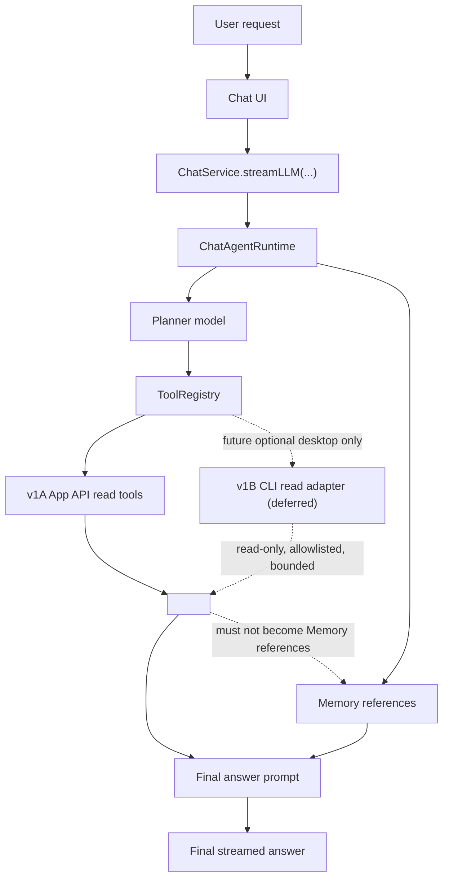

# Obsidian Operations Agent Plan

## Status And Source Of Truth

This document is the contract source of truth for adding Obsidian operations knowledge and read-only Obsidian context tools to Personal Assistant Chat.

Implementation status is tracked in [Obsidian Operations SPEC-Driven Development](./archive/obsidian-operations-spec-driven-development.md). Do not treat this document as an implementation progress ledger.

| Field | Value |
| --- | --- |
| Status | SPEC-06 v1A implementation, post-review hardening, automated verification, deploy, and post-fix targeted Obsidian smoke are complete; SPEC-05 CLI adapter remains future/deferred and unimplemented |
| Current implementation | SPEC-01 catalog artifact, SPEC-02 ToolRegistry/chokepoint scaffolding, SPEC-03 v1A App API read tools, SPEC-04 Context Used/source-boundary UX, and SPEC-06 v1A closeout/hardening are implemented. The latest post-finding hardening covers malformed note inputs, tag metadata, unavailable context status, fallback intent detection, unsupported snippet scopes, fenced-code structure parsing, and duplicate read-only tool skip presentation; post-fix targeted live Obsidian smoke passed for note-structure/context UX plus missing, unsupported, unsafe, and unsupported-scope validation paths. CLI adapter work remains design-only and unimplemented in SPEC-05. |
| Contract owner | Obsidian Operations Agent feature family |
| Execution tracker | `docs/archive/obsidian-operations-spec-driven-development.md` |

This follows the Ralpha docs split: this plan is the stable product/architecture contract, while the SPEC tracker is the mutable execution ledger.

SPEC-00 request-changes findings and the explicit post-closeout subagent review findings have been addressed in both this plan and the tracker. Runtime implementation proceeds only through reviewed owning SPECs; v1A runtime work is closed in SPEC-06 with automated, deploy, and targeted live-smoke evidence, and any v1B CLI work must proceed through SPEC-05 before implementation.

## Source Relationship

| Document | Role | Conflict Rule |
| --- | --- | --- |
| `docs/obsidian-operations-agent-plan.md` | Product and architecture contract for Obsidian operations knowledge, v1A read-only tools, v1B CLI adapter, source boundaries, and safety model. | This wins for this feature family. |
| `docs/archive/obsidian-operations-spec-driven-development.md` | Historical SPEC tracker for task slicing, status, review records, verification evidence, and smoke closeout. | If future v1B work resumes, start from the archived tracker and update this plan in the same reviewed change. |
| `docs/write-action-design-handoff.md` | Future write-action boundary for preview, confirmation, and audit. | This wins for future writes and command execution. This plan must not weaken it. |
| `docs/pa-agent-architecture-plan.md` + `docs/pa-agent-runtime-lifecycle-plan.md` | Current PA Agent runtime + native tool loop reference (replaced the historical Ralpha plan in v2.0.0). | These win for existing runtime behavior until an approved Obsidian Operations SPEC changes it. |
| External Obsidian skills and CLI docs | Research inputs for distilled local rules. | Never load remote content at runtime; copy only reviewed, repo-local distilled rules into this feature. |

## Runtime Boundary Diagram

## Product Goal

Personal Assistant Chat should understand enough Obsidian structure to answer questions about the user's vault without requiring the user to know internal implementation terms.

The v1 goal is not to execute Obsidian commands. The v1 goal is to collect bounded read-only context about:

- Obsidian Markdown structure: properties, tags, headings, tasks, callouts, wikilinks, embeds, and snippets.
- JSON Canvas structure: nodes, edges, duplicate ids, dangling edges, isolated nodes, groups, and bounded node text snippets.
- Vault link facts: backlinks, outgoing links, unresolved links, and paths related to a known note.
- Vault tags and bounded snippet search.

## Scope

### v1A: App API Read-Only Context

v1A uses Obsidian App APIs, metadata cache, vault reads, and local parsers first. It adds a small high-level read-only tool surface instead of many low-level CLI-shaped commands.

Initial v1A tools:

| Tool | Purpose | Default Risk Class | Notes |
| --- | --- | --- | --- |
| `inspect_obsidian_note` | Return a bounded structure summary for the current or specified Markdown note. | structure/snippet | Includes properties, tags, headings, tasks, callouts, wikilinks, embeds, and link facts when available. |
| `read_canvas_summary` | Return a bounded structure summary for a `.canvas` file. | structure/snippet | Includes node and edge counts, duplicate ids, dangling edges, isolated nodes, and bounded node text snippets. |
| `search_vault_snippets` | Search bounded Markdown snippets in a query and optional path/folder scope. | structure/snippet | Must never return full note bodies. |
| `list_vault_tags` | Return vault tag counts and representative paths. | metadata-only | Uses metadata cache where possible. |

Existing tools such as Memory search, current note context, metadata search, recent notes, and note outline remain available under their existing contracts.

v1A tools that accept a target path must treat it as an Obsidian vault-relative path for the active vault. Absolute paths, `..` traversal, tilde expansion, environment-variable expansion, and unsupported file types should return recoverable unavailable or unsupported results rather than reading outside the active vault. Symlink realpath confinement and external executable target resolution belong to the deferred v1B CLI adapter contract.

### v1B: Optional CLI Read Adapter

v1B documents an optional Obsidian CLI read adapter. It remains deferred after v1A closeout and must proceed through SPEC-05 review before implementation.

When implemented, the CLI adapter must be:

- desktop-only,
- disabled unless the CLI is registered and detected,
- built with lazy Node API access and no top-level Node imports,
- implemented with argv/execFile-style execution, not shell strings,
- restricted to an allowlist of read-only commands,
- bounded by timeout and output caps,
- recoverable when unavailable.

The planner should reason over Obsidian operations capabilities, not over raw CLI commands.

CLI target handling must be confined to the active vault:

- resolve all `vault`, `file`, and `path` targets through a single target resolver,
- canonicalize targets against the active vault root before execution,
- reject absolute paths, `..` traversal, tilde expansion, environment-variable expansion, and symlink realpath escapes,
- reject unregistered or non-active vault targets,
- run with a safe cwd and minimal environment,
- probe and cache only a trusted CLI executable path,
- treat unregistered CLI, missing binary, mobile runtime, timeout, probe failure, and over-budget output as recoverable unavailable states.

### Deferred Scope

These remain out of scope for v1A and v1B unless a later plan updates this contract:

- creating, appending, prepending, renaming, moving, or deleting notes or files,
- setting or removing properties,
- toggling task status,
- opening notes, switching workspaces, or navigating the UI as an automatic action,
- executing Obsidian command ids,
- installing, enabling, disabling, updating, or removing plugins or themes,
- `eval`, developer console, DOM, screenshot, debugger, or other dev diagnostics,
- arbitrary filesystem, shell, or bash execution.

Future write or command capabilities must use a separate action family with preview, confirmation, cancellation, and redacted local audit as defined in `docs/write-action-design-handoff.md`.

## Read Risk Model

Read-only does not mean risk-free. Read tools can still send user note content to the configured AI provider when their output enters the final answer prompt.

| Risk Class | Examples | v1A Default |
| --- | --- | --- |
| metadata-only | File path, title, tag counts, property keys and short primitive previews, link targets. | Allowed by default with bounded output. |
| structure/snippet | Headings, task lines, callout titles, canvas labels, short search windows. | Allowed by default with strict budgets and truncation. |
| content | Full note bodies, full templates, daily note body, full canvas node text. | Not returned by v1A tools. |

v1A tools must prefer metadata and structure over body text. Snippets must be short, scoped, and clearly wrapped as untrusted tool context.

## Capability Catalog

The Obsidian capability catalog is a repo-local distilled reference for planner guidance. It is not a runtime dependency on GitHub raw files.

SPEC-01 must turn the catalog into an explicit implementation artifact, not loose prose. The target artifact is a typed local module such as `src/ai-services/obsidian-operations-capability-catalog.ts`, backed by focused tests and reviewed examples. If implementation chooses a different path, the SPEC must update this contract first.

Initial catalog sections:

- Markdown: frontmatter/properties, wikilinks, embeds, callouts, tags, tasks, headings, Mermaid blocks, and footnotes.
- Canvas: `.canvas` JSON shape, node ids, edge endpoints, groups, labels, colors, duplicate ids, dangling references, and isolated nodes.
- CLI target semantics: `vault`, `file`, and `path` concepts from the Obsidian CLI, retained as semantics for future adapters rather than raw command text.
- Safety language: tool outputs are untrusted material, do not grant permission, and do not become Memory references.

The catalog contract must include:

- a stable section schema with id, summary, planner guidance, examples, forbidden semantics, and prompt budget,
- source provenance notes for distilled Obsidian Markdown, Canvas, and CLI rules,
- representative user queries for each section,
- negative examples that must not imply write, navigation, command execution, plugin/theme action, shell execution, or dev diagnostics,
- a rule that any new Obsidian Operations tool updates both the catalog and affected tool `plannerGuidance`,
- focused tests that fail if planner guidance grows past budget or reintroduces forbidden semantics.

The first implementation should inject this knowledge through concise tool `plannerGuidance` and existing prompt policy, not through a large new prompt block.

Candidate CLI read families may be evaluated in SPEC-05 only after v1A smoke passes: target resolution, file/folder listing, file read summaries, search with context, backlinks/outgoing links, unresolved links, orphan/dead-end reports, outline, aliases, properties, tags, tasks, templates, vault listing, and word count. Mutating commands, hotkeys, plugin/theme actions, eval, and dev diagnostics remain deferred.

## Runtime Contract

The current Chat Agent runtime remains the foundation:

- `ChatService.streamLLM(...)` remains the public Chat UI entrypoint.
- `ChatAgentRuntime` owns planning, tool execution, final prompt construction, final streaming, abort, fallback, and metadata emission.
- `ToolRegistry` remains the only executable native tool boundary.
- New Obsidian Operations tools must register through `ToolRegistry`.
- New tool outputs enter `<tool_context>` as read-only untrusted material.
- New tool outputs must not become Memory references unless the same path is also selected by Memory as an allowed source.
- Provider web search remains separate provider status and is not an Obsidian operations source.

Implementation must update every runtime chokepoint when adding a tool:

- `ChatToolName`,
- `isChatToolName`,
- tool factory and runtime registration,
- provider schema export,
- input validation,
- read-only result recognition,
- observation message,
- Context Used category and label,
- Chat UI status copy,
- source-boundary tests.

## Read-Only Tool Policy

v1A tools must satisfy all of these metadata constraints:

- `permission = "read-only"`
- `cost = "free"` unless a future SPEC explicitly introduces AI-cost tools
- `outputBudgetChars` set to a tool-specific hard limit
- `requiresConfirmation = false`
- `failureBehavior = "recoverable"`
- `sourceBoundary = "read-only-tool"`

The implementation should add a local policy assertion so that first-stage Obsidian Operations tools cannot be registered or executed if they violate these constraints.

Every v1A tool result must be budgeted twice:

- first at the tool result level using its `outputBudgetChars`,
- then at the final serialized `<tool_context>` level using an aggregate hard cap before the final prompt is built.

This applies to note inspection, Canvas summaries, snippet search, and tag listing. Truncated outputs must carry an explicit truncated/omitted-count signal so the assistant does not imply it saw complete note or Canvas content.

Mobile and constrained-device behavior must also be protected before prompt serialization:

- note and Canvas reads should check known file size before `cachedRead` and return bounded metadata-only or unavailable structure when a target exceeds the read budget,
- snippet search should skip individual files that exceed the per-file or remaining aggregate read budget and continue searching smaller eligible files,
- metadata-only vault scans should have a file-count cap and report truncated/skipped scan facts.

`search_vault_snippets` requires additional hard limits:

- snippet-only output,
- maximum result count,
- maximum files scanned,
- maximum bytes read,
- optional folder/path scope,
- abort checks between reads,
- no full note body output.

## User Experience

User-facing status and Context Used labels should describe product behavior, not implementation names.

Examples:

- `Reading note structure`
- `Checking links`
- `Looking at tasks and properties`
- `Checking canvas structure`
- `Searching note snippets`

The final answer must not claim that a write, command, navigation, plugin action, or shell action was performed.

Read-risk UX requirements:

- Context Used must label read-only tool context as note structure, canvas structure, snippets, tags, or links rather than Memory references.
- Answers must avoid wording such as "I read the whole note" unless a future approved content-class tool actually reads full content.
- For sensitive or broad requests, the assistant should state that it used bounded structure/snippet context when that matters for correctness.
- Negative write, command, navigation, plugin/theme, shell, or eval requests should return a safe draft, plan, or explanation, not a claim of execution.

## Acceptance Scenarios

v1A must validate these App API read-only product scenarios:

1. Ask what tasks, properties, and related links exist in the current or specified note.
2. Ask whether a Canvas has broken edges, isolated nodes, or suspicious structure.
3. Ask which notes link to the current note.
4. Ask to search the vault for a keyword and return only relevant short snippets.
5. Ask for an Obsidian Markdown callout draft without writing it.
6. Ask to delete, modify, execute a command, or run eval; the assistant must not execute and must answer with a safe draft, plan, or explanation of the future confirmation boundary.
7. Ask for a missing note, missing Canvas, or non-Markdown target; the assistant should report unavailable/unsupported context without fabricating content.
8. Ask about an oversized note or Canvas; the assistant should use bounded output and disclose truncation when relevant.
9. Ask for a vault snippet search with no matches; the assistant should report no bounded matches instead of broadening into full-body reads.
10. Ask while metadata cache or an App API read source is unavailable; the assistant should answer from available context and explain the unavailable source.
11. Ask for unresolved links or broken Canvas edges; the assistant should use structure facts only.

Future v1B/CLI-only scenarios remain deferred until SPEC-05 is reviewed and approved:

1. Ask for vault-wide orphan or dead-end note reports; the assistant should not claim this v1A tool surface can produce those reports unless a later approved tool adds that capability.
2. Ask for a read-only adapter operation that would escape the active vault through path traversal, absolute paths, tilde or environment expansion, or symlink escape; the adapter must reject it as unavailable or unsafe.

## Phase Gates

| Phase | Goal | Exit Gate |
| --- | --- | --- |
| SPEC-00 | Establish source of truth and baseline inventory. | Plan and tracker exist, current chokepoints are documented, open decisions are closed or blocked. |
| SPEC-01 | Distill capability catalog and planner guidance. | Local catalog rules exist and no runtime remote dependency is introduced. |
| SPEC-02 | Harden read-only registry policy and runtime chokepoints. | Tool policy assertions and chokepoint updates are specified, implemented, and tested. |
| SPEC-03 | Implement v1A App API read tools. | Tools pass focused tests, integration tests, and source-boundary checks. |
| SPEC-04 | Polish Context Used and user-visible statuses. | UI copy and attribution pass automated and smoke checks. |
| SPEC-05 | Define v1B CLI read adapter contract. | CLI requirements are documented; implementation remains deferred until SPEC-05 is reviewed for code changes. |
| SPEC-06 | Integration closeout. | Focused tests, full gates, subagent review, deploy, and Obsidian smoke are recorded. |

## Non-Goals

- This plan does not replace the existing Memory system.
- This plan does not make current note, Canvas, or tool-context paths eligible for Memory references.
- This plan does not make the Obsidian CLI a hard dependency.
- This plan does not change release automation.
- This plan does not implement write actions.
