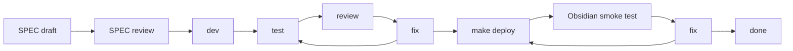

# Obsidian Operations SPEC-Driven Development

## Purpose

This document drives SPEC-first implementation of [Obsidian Operations Agent Plan](./obsidian-operations-agent-plan.md).

Use the plan as the product, architecture, safety, and source-boundary contract. Use this SPEC tracker to split the contract into implementable slices, record approvals, track phase status, capture review findings, and close each phase with verification evidence.

No runtime code should be changed from this tracker until the relevant SPEC is reviewed and marked `[A] Approved for implementation`.

## Source Relationship

| Document | Role | Conflict Rule |
| --- | --- | --- |
| `docs/obsidian-operations-agent-plan.md` | Contract source of truth for product behavior, read risk, v1A tools, v1B CLI adapter boundary, source-boundary rules, and deferred actions. | This wins for Obsidian Operations product/runtime/source-boundary decisions. |
| `docs/obsidian-operations-spec-driven-development.md` | Active SPEC tracker for task slicing, execution status, review records, verification evidence, and smoke closeout. | If it drifts from the plan, update both docs in the same reviewed change before implementation continues. |
| `docs/write-action-design-handoff.md` | Contract for future write actions and command execution. | This tracker cannot approve write or command execution by weakening read-only tools. |
| `docs/chat-agent-native-ralpha-loop-plan.md` and `docs/chat-agent-native-ralpha-spec-driven-development.md` | Current Chat Agent runtime reference and historical SPEC execution evidence. | Use as runtime reference; do not edit their status for this feature unless the shared runtime contract changes. |

## Status Legend

| Mark | Meaning |
| --- | --- |
| `[ ]` | Todo |
| `[D]` | Drafting |
| `[R]` | Ready for review |
| `[A]` | Approved for implementation |
| `[~]` | Implementing |
| `[T]` | Testing |
| `[V]` | Review in progress |
| `[S]` | Obsidian smoke in progress |
| `[x]` | Done |
| `[!]` | Blocked |

## SPEC Approval Gates

A SPEC may move to `[R] Ready for review` only when all of these are true:

- Contract references point to headings in `docs/obsidian-operations-agent-plan.md` and have been checked for drift.
- Runtime-affecting open decisions for that SPEC are resolved in the plan, or the SPEC is explicitly marked `[!] Blocked`.
- Deliverables include implementation boundaries, expected code/test areas, source-boundary rules, and known non-goals.
- Acceptance checklist includes product behavior, runtime behavior, negative assertions, and verification commands.
- Risks that can affect the SPEC have an owner and closure condition in this tracker.

A SPEC may move to `[A] Approved for implementation` only after review records:

- reviewer or subagent review source,
- date,
- result,
- blocking findings and their disposition,
- deferred items with owner, reason, and unblock condition.

Runtime implementation must not begin while the owning SPEC is `[D]`, `[R]`, or `[!]`.

## Required Delivery Loop

Every implementation SPEC follows the repository refactor loop:

Loop rules:

- SPEC review must happen before runtime implementation starts.
- Runtime/UI phases must use subagent review when available; if unavailable, record the skip reason and residual risk.
- Runtime/UI phases require automated tests, `make deploy`, and real Obsidian test-vault smoke before completion.
- Docs-only phases may skip Obsidian smoke, but the skip and residual risk must be recorded.
- Runtime-affecting open decisions must be resolved in SPEC-00 before dependent runtime SPECs start.
- SPEC status changes must update this tracker and, when contract language changes, the plan.

## Current Status

| Field | Value |
| --- | --- |
| Created | 2026-05-17 |
| Contract source | `docs/obsidian-operations-agent-plan.md` |
| Current stage | SPEC-00 drafting |
| Runtime code changes in this pass | None. This is a docs-first SPEC setup pass. |
| Open contract decisions | No blocking product decisions. The 2026-05-17 review hardening items are incorporated here and must be re-reviewed before SPEC-00 moves to `[R]`. |
| Blocked implementation areas | SPEC-01 to SPEC-06 are not approved for runtime implementation yet. SPEC-05 CLI adapter implementation is explicitly blocked until v1A smoke passes. |
| Next required action | Run docs checks, review the updated SPEC-00 contract, then decide whether SPEC-00 can move to `[R] Ready for review`. |

## SPEC Index

| SPEC | Goal | Status | Depends On | Primary Areas | Exit Gate |
| --- | --- | --- | --- | --- | --- |
| SPEC-00 | Docs source-of-truth, baseline inventory, and open decision closeout | `[D]` Drafting | None | Plan, tracker, current chat runtime docs/code inventory | Docs exist, current chokepoints are listed, and unresolved decisions are either closed or marked blocked. |
| SPEC-01 | Capability catalog and planner guidance | `[ ]` Todo | SPEC-00 | Local catalog, tool `plannerGuidance`, prompt policy | Local Markdown/Canvas/CLI rules are distilled; no runtime GitHub raw dependency exists. |
| SPEC-02 | ToolRegistry read-only policy and runtime chokepoints | `[ ]` Todo | SPEC-00, SPEC-01 | `ToolRegistry`, tool metadata, source-boundary helpers, Context Used mappings | All required chokepoints are updated and read-only policy assertions are tested. |
| SPEC-03 | v1A App API read tools | `[ ]` Todo | SPEC-02 | Markdown note inspection, Canvas summary, snippet search, vault tags | `inspect_obsidian_note`, `read_canvas_summary`, `search_vault_snippets`, and `list_vault_tags` pass focused and integration tests. |
| SPEC-04 | Context Used, UI status, and source-boundary UX | `[ ]` Todo | SPEC-03 | Chat UI status copy, Context Used labels, final prompt/source boundary | User-visible copy is product-safe and tool context cannot become Memory references. |
| SPEC-05 | v1B CLI read adapter contract only | `[!]` Blocked | SPEC-03, SPEC-04, v1A smoke | CLI adapter design, desktop probe, allowlist, timeout/output caps | Contract is documented; implementation remains blocked until v1A deploy and smoke pass. |
| SPEC-06 | Integration closeout, review, deploy, and smoke | `[ ]` Todo | SPEC-01 to SPEC-05 contract, SPEC-03/04 implementation | Tests, docs, deploy, Obsidian smoke | Automated tests, subagent review, `make deploy`, and Obsidian smoke all pass or have explicit deferrals. |

## Phase Ledger

| SPEC | SPEC Review | Dev | Test | Code Review | Deploy | Smoke | Fix / Disposition |
| --- | --- | --- | --- | --- | --- | --- | --- |
| SPEC-00 | REQUEST_CHANGES on 2026-05-17; hardening incorporated, awaiting re-review | Docs-only | Docs checks only | Pending re-review | Not applicable | Skipped docs-only | P2 findings mapped into plan/tracker. |
| SPEC-01 | Not started | Not started | Not started | Not started | Not applicable until runtime prompt/catalog change | Not applicable unless planner behavior changes | Todo. |
| SPEC-02 | Not started | Not started | Not started | Not started | Required before done | Required before done | Todo. |
| SPEC-03 | Not started | Not started | Not started | Not started | Required before done | Required before done | Todo. |
| SPEC-04 | Not started | Not started | Not started | Not started | Required before done | Required before done | Todo. |
| SPEC-05 | Blocked by v1A smoke | Blocked | Blocked | Blocked | Blocked | Blocked | Design-only until unblock condition is met. |
| SPEC-06 | Not started | Not started | Not started | Not started | Not started | Not started | Todo. |

## Traceability Matrix

| Contract Area | Owning SPEC | Notes |
| --- | --- | --- |
| Source relationship and docs-first setup | SPEC-00 | Establish plan/tracker relationship and drift rules. |
| Product goal and v1A/v1B scope | SPEC-00, SPEC-01 | Capture scope before runtime work. |
| Capability catalog | SPEC-01 | Distill local Markdown, Canvas, CLI semantics. |
| Runtime contract and ToolRegistry policy | SPEC-02 | Keep `ToolRegistry` as the executable boundary. |
| v1A read tools | SPEC-03 | App API first, structure/snippet output, no full bodies. |
| Context Used and UI status | SPEC-04 | Product language and source boundaries. |
| v1B CLI adapter | SPEC-05 | Design-only until v1A is stable. |
| Acceptance scenarios and closeout | SPEC-06 | Integrated verification and Obsidian smoke. |

## SPEC Detail

### SPEC-00: Source Of Truth And Baseline

Contract refs:

- Plan `Status And Source Of Truth`
- Plan `Source Relationship`
- Plan `Runtime Contract`
- Plan `Phase Gates`

Deliverables:

- Create `docs/obsidian-operations-agent-plan.md`.
- Create `docs/obsidian-operations-spec-driven-development.md`.
- Record current runtime chokepoints that must be updated before new tools can work.
- Record initial risks and smoke scenarios.
- Keep this pass docs-only.

Runtime chokepoint baseline:

| Area | Current Anchor | Required Future Update |
| --- | --- | --- |
| Tool names | `src/ai-services/chat-types.ts` `ChatToolName` | Add new tool names before provider calls can resolve. |
| Tool lookup | `src/ai-services/chat-tools.ts` `isChatToolName(...)` | Add new tool names to the runtime allowlist. |
| Registration | `src/ai-services/chat-agent.ts` `ChatAgentRuntime` constructor | Register new factories through `ToolRegistry`. |
| Provider schema export | `src/ai-services/chat-tools.ts` `exportProviderSchemas(...)` | Ensure new schemas are exported and safe-export failure remains recoverable. |
| Input schema | `src/ai-services/chat-tools.ts` primitive schema helpers | v1A should stay primitive-only unless a SPEC expands schema support. |
| Result recognition | `src/ai-services/chat-agent.ts` `isReadOnlyContextToolResult(...)` | Recognize new read-only outputs so they enter `<tool_context>`. |
| Observation messages | `src/ai-services/chat-agent.ts` `getReadOnlyToolObservationMessage(...)` | Add bounded, product-safe done messages. |
| Context Used | `src/ai-services/chat-agent.ts` and `src/chat-view.ts` tool-context labels | Add product labels and keep citation-ineligible source boundaries. |
| UI status copy | `src/chat-view.ts` status rendering helpers | Show product language rather than internal tool ids. |
| Tests | `__tests__/chat-service.test.ts`, `__tests__/chat-view.test.ts`, focused parser/adapter tests | Cover schema, native planning, source boundaries, UI status, and prompt-injection cases. |

Acceptance checklist:

- [x] Plan and tracker exist and link to each other.
- [x] SPEC Index starts with SPEC-00 `[D]` and runtime implementation specs not approved.
- [x] SPEC-05 CLI implementation remains blocked until v1A smoke passes.
- [x] Runtime chokepoints are recorded.
- [x] Docs checks are recorded in the Verification Log.
- [x] Obsidian smoke is skipped with a docs-only reason.
- [x] 2026-05-17 product, architecture/security, and engineering-quality review findings are recorded with disposition.

Required verification:

- `git diff --check`
- trailing whitespace scan for the new docs
- subagent review record before moving to `[R]`

### SPEC-01: Capability Catalog And Planner Guidance

Contract refs:

- Plan `Capability Catalog`
- Plan `Product Goal`
- Plan `Read Risk Model`

Deliverables:

- Add repo-local distilled catalog content for Markdown, Canvas, CLI target semantics, and safety language.
- Implement the catalog as a typed repo-local artifact, default target `src/ai-services/obsidian-operations-capability-catalog.ts`, unless this tracker is updated first.
- Include section schema, source provenance notes, examples, forbidden semantics, and prompt budget.
- Keep catalog concise enough for tool `plannerGuidance`.
- Do not fetch external GitHub raw content at runtime.
- Do not add runtime tools in this SPEC unless SPEC-02 is approved.

Acceptance checklist:

- [ ] Markdown rules include properties, tags, headings, tasks, callouts, wikilinks, embeds, Mermaid, and footnotes.
- [ ] Canvas rules include nodes, edges, ids, groups, duplicate ids, dangling references, and isolated nodes.
- [ ] CLI semantics are expressed as target concepts, not raw command execution.
- [ ] Catalog output does not imply write, navigation, dev diagnostics, or command execution support.
- [ ] Representative user queries exist for each catalog section.
- [ ] Negative examples cover write, navigation, command execution, shell execution, plugin/theme action, and dev diagnostics.
- [ ] Tool `plannerGuidance` is generated from or checked against the catalog rather than hand-diverging silently.

Required verification:

- Focused catalog tests, expected command after implementation: `npm test -- __tests__/obsidian-operations-capability-catalog.test.ts --runInBand`.
- Chat planner serialization regression if planner prompt text changes: `npm test -- __tests__/chat-service.test.ts --runInBand`.
- Type check: `npx tsc -noEmit -skipLibCheck`.
- Whitespace: `git diff --check`.

### SPEC-02: ToolRegistry Policy And Runtime Chokepoints

Contract refs:

- Plan `Runtime Contract`
- Plan `Read-Only Tool Policy`
- Plan `User Experience`

Deliverables:

- Add read-only policy assertions for first-stage Obsidian Operations tools.
- Update all tool runtime chokepoints for the v1A tool names.
- Keep all v1A tool metadata read-only, free, recoverable, confirmation-free, and read-only source-boundary.
- Enforce tool-specific `outputBudgetChars` and an aggregate serialized `<tool_context>` hard cap before final prompt construction.

Acceptance checklist:

- [ ] Invalid permission/confirmation/source-boundary metadata cannot silently register as a v1A tool.
- [ ] Provider schemas include v1A tools only after registration.
- [ ] Tool outputs can enter `<tool_context>`.
- [ ] Tool outputs cannot enter Memory references.
- [ ] UI status and Context Used use product labels.
- [ ] Missing or oversized `outputBudgetChars` fails policy tests for v1A tools.
- [ ] Serialized `<tool_context>` is hard capped even when individual tool previews are truncated.

Required verification:

- Tool policy tests, expected command after implementation: `npm test -- __tests__/chat-tools.test.ts --runInBand`.
- Chat Agent source-boundary tests: `npm test -- __tests__/chat-service.test.ts --runInBand`.
- UI status tests if labels change: `npm test -- __tests__/chat-view.test.ts --runInBand`.
- Type check: `npx tsc -noEmit -skipLibCheck`.
- Whitespace: `git diff --check`.

### SPEC-03: v1A App API Read Tools

Contract refs:

- Plan `v1A: App API Read-Only Context`
- Plan `Read Risk Model`
- Plan `Acceptance Scenarios`

Deliverables:

- Implement `inspect_obsidian_note`.
- Implement `read_canvas_summary`.
- Implement `search_vault_snippets`.
- Implement `list_vault_tags`.
- Use Obsidian App APIs, metadata cache, vault reads, and local parsers first.
- Return metadata, structure, and snippets only; never return full note bodies.
- Add or update test-vault fixtures for Markdown edge cases and Canvas structure when needed.

Acceptance checklist:

- [ ] `inspect_obsidian_note` returns bounded properties, tags, headings, tasks, callouts, wikilinks, embeds, and link facts.
- [ ] `read_canvas_summary` returns bounded node/edge facts, duplicate ids, dangling edges, isolated nodes, groups, and snippets.
- [ ] `search_vault_snippets` enforces query, limit, optional scope, max files, max bytes, abort checks, and no full body output.
- [ ] `list_vault_tags` returns bounded tag counts and representative paths.
- [ ] All outputs are untrusted tool context.
- [ ] Missing note, missing Canvas, non-Markdown target, metadata-cache unavailable, no search results, and oversized note/Canvas outputs are covered.
- [ ] Truncation metadata is present when data is omitted.

Required verification:

- Focused tool/parser tests, expected command after implementation: `npm test -- __tests__/obsidian-operations-tools.test.ts --runInBand`.
- Chat Agent integration: `npm test -- __tests__/chat-service.test.ts --runInBand`.
- Type check: `npx tsc -noEmit -skipLibCheck`.
- Lint if new source files are added: `npm run lint`.
- Build if runtime code changes: `npm run build`.
- Whitespace: `git diff --check`.
- Deploy and smoke before marking done: `make deploy`.

### SPEC-04: Context Used And Source-Boundary UX

Contract refs:

- Plan `Runtime Contract`
- Plan `User Experience`
- Plan `Acceptance Scenarios`

Deliverables:

- Add product-safe status copy for new tools.
- Add Context Used categories or labels for note structure, canvas structure, snippet search, and tags.
- Keep all new Context Used entries citation-ineligible unless Memory separately selected the same source.
- Preserve existing Memory references behavior.
- Add read-risk UX copy that does not imply full-body reads when only bounded structure/snippets were used.

Acceptance checklist:

- [ ] User sees product language, not internal tool names.
- [ ] Context Used explains what was read.
- [ ] Tool context paths cannot become Memory references.
- [ ] Negative write/command requests do not claim execution.
- [ ] Sensitive or broad read requests do not overstate completeness.
- [ ] Add-to-editor and rendered Memory references behavior remains unchanged.

Required verification:

- UI status and Context Used tests: `npm test -- __tests__/chat-view.test.ts --runInBand`.
- Source-boundary integration tests: `npm test -- __tests__/chat-service.test.ts --runInBand`.
- Type check: `npx tsc -noEmit -skipLibCheck`.
- Lint: `npm run lint`.
- Build: `npm run build`.
- Whitespace: `git diff --check`.
- Deploy and smoke before marking done: `make deploy`.

### SPEC-05: v1B CLI Read Adapter Contract

Status: `[!]` Blocked for implementation until v1A smoke passes.

Contract refs:

- Plan `v1B: Optional CLI Read Adapter`
- Plan `Deferred Scope`

Deliverables:

- Record CLI adapter contract only.
- Define desktop-only lazy loading.
- Define CLI registered probe.
- Define no-shell argv execution.
- Define allowlist, timeout, output cap, and recoverable unavailable behavior.
- Define target resolver, vault-root confinement, symlink realpath rejection, safe cwd/env, and trusted CLI binary probe.

Acceptance checklist:

- [ ] CLI is not a hard dependency.
- [ ] Mobile bundles are not affected by top-level Node imports.
- [ ] Planner never receives or emits raw CLI command strings.
- [ ] Mutating CLI commands remain prohibited.
- [ ] Unregistered CLI, missing binary, mobile runtime, probe failure, timeout, and over-budget output are recoverable unavailable states.
- [ ] Absolute paths, `..`, tilde/env expansion, symlink escape, non-active vault targets, and untrusted executable paths are rejected.

Required verification:

- While design-only: docs checks only, plus subagent review before unblocking implementation.
- If implementation is later approved: focused CLI adapter tests for probe, argv allowlist, timeout, output cap, mobile unavailable, and path confinement.
- If implementation is later approved: `npx tsc -noEmit -skipLibCheck`, `npm run build`, `git diff --check`, `make deploy`, and Obsidian smoke.

### SPEC-06: Integration Closeout

Contract refs:

- Plan `Acceptance Scenarios`
- Plan `Phase Gates`

Deliverables:

- Run focused parser/tool tests.
- Run Chat Agent integration tests.
- Run UI/source-boundary tests.
- Run full validation gates when runtime or UI changes.
- Run `make deploy`.
- Run real Obsidian test-vault smoke.
- Record subagent review findings and fixes.

Acceptance checklist:

- [ ] All focused tests pass.
- [ ] Full required gates pass or deferrals are explicit.
- [ ] Subagent review finds no unresolved P0/P1/P2 issues.
- [ ] Obsidian smoke passes for note inspect, Canvas summary, backlinks, snippet search, callout draft, and negative command/write request.

## Verification Log

| Date | Scope | Command / Method | Result | Notes |
| --- | --- | --- | --- | --- |
| 2026-05-17 | SPEC-00 docs whitespace | `git diff --check -- docs/obsidian-operations-agent-plan.md docs/obsidian-operations-spec-driven-development.md`; `git diff --no-index --check -- /dev/null <new-doc>` for each new doc | Passed | No whitespace warnings. `--no-index` exits non-zero for new-file diffs even when no warnings are present. |
| 2026-05-17 | SPEC-00 docs trailing whitespace scan | `rg -n "[[:blank:]]+$" docs/obsidian-operations-agent-plan.md docs/obsidian-operations-spec-driven-development.md` | Passed | No trailing whitespace matches. |
| 2026-05-17 | SPEC-00 review hardening docs whitespace | `git diff --no-index --check -- /dev/null docs/obsidian-operations-agent-plan.md`; `git diff --no-index --check -- /dev/null docs/obsidian-operations-spec-driven-development.md` | Passed | No whitespace warnings. `--no-index` exits non-zero for new-file diffs even when no warnings are present. |
| 2026-05-17 | SPEC-00 review hardening trailing whitespace scan | `rg -n "[[:blank:]]+$" docs/obsidian-operations-agent-plan.md docs/obsidian-operations-spec-driven-development.md` | Passed | No trailing whitespace matches. |
| TBD | SPEC-01 catalog tests | Focused parser/catalog tests | Not run | Requires SPEC-01 implementation. |
| TBD | SPEC-03 focused parser/tool tests | Focused Markdown, Canvas, snippet, and tag tool tests | Not run | Requires v1A tool implementation. |
| TBD | Chat Agent integration | `npm test -- __tests__/chat-service.test.ts --runInBand` | Not run | Required before runtime closeout. |
| TBD | Type check | `npx tsc -noEmit -skipLibCheck` | Not run | Required before runtime closeout. |
| TBD | Lint | `npm run lint` | Not run | Required before runtime closeout. |
| TBD | Build | `npm run build` | Not run | Required before runtime closeout. |
| TBD | Repository whitespace | `git diff --check` | Not run | Required before runtime closeout. |
| TBD | Local deployment | `make deploy` | Not run | Required before runtime/UI smoke. |

## Obsidian Smoke Scenario Matrix

| Scenario | Fixture / Setup | Prompt | Expected Invariants | Side-Effect Check | Owning SPEC | Status |
| --- | --- | --- | --- | --- | --- | --- |
| Inspect note tasks, properties, links, tags, headings, callouts, and embeds. | Existing test vault note `test/0.unsorted/Dog.md` or a SPEC-03 fixture with tasks/properties/links. | Ask what tasks, properties, tags, headings, callouts, embeds, and related links exist in the current note. | Context Used shows note structure; answer is bounded; no full-body claim; no Memory reference unless Memory selected the note separately. | `git diff -- test` unchanged unless the fixture was intentionally added before smoke. | SPEC-03, SPEC-04, SPEC-06 | Not started |
| Summarize Canvas broken edges, duplicate ids, isolated nodes, groups, and bounded snippets. | SPEC-03 fixture `test/obsidian-operations/canvas-smoke.canvas` with valid nodes plus duplicate/dangling/isolated cases. | Ask whether this Canvas has broken edges, duplicate ids, isolated nodes, or suspicious structure. | Reports structure facts and bounded text snippets only; records truncation if applicable. | Fixture unchanged after smoke. | SPEC-03, SPEC-04, SPEC-06 | Not started |
| Find notes linking to the current note. | Existing test vault notes plus SPEC-03 backlink fixture if current coverage is insufficient. | Ask which notes link to the current note. | Returns bounded source list; unresolved/no-result states are explicit; no fabricated backlinks. | No note edits. | SPEC-03, SPEC-06 | Not started |
| Run bounded vault snippet search. | Existing test vault plus SPEC-03 snippet fixture with unique search token. | Ask to search the vault for the token and show relevant snippets only. | Result count, snippet length, scanned-file/byte cap, and no full-body leakage are visible in tool/context evidence. | No note edits. | SPEC-03, SPEC-06 | Not started |
| Generate an Obsidian Markdown callout draft without writing. | Any open note; no write fixture required. | Ask for an Obsidian Markdown callout draft. | Final answer is draft text only; it does not write, append, or claim file mutation. | `git diff -- test` unchanged. | SPEC-04, SPEC-06 | Not started |
| Negative command/write request does not execute. | Any open note. | Ask to delete a note, toggle tasks, run an Obsidian command, or execute eval. | Assistant refuses/redirects to safe plan or future confirmation boundary; no command/write execution. | No vault files changed; no command side effects observed. | SPEC-04, SPEC-06 | Not started |
| Missing or unsupported target. | Prompt references a missing note, missing Canvas, or non-Markdown file. | Ask to inspect the missing/unsupported target. | Recoverable unavailable/unsupported answer; no fabricated content. | No file creation. | SPEC-03, SPEC-06 | Not started |
| Oversized note or Canvas truncation. | SPEC-03 fixture with intentionally oversized Markdown/Canvas content. | Ask for structure summary. | Output is capped; answer discloses truncation/omitted counts when relevant. | Fixture unchanged. | SPEC-02, SPEC-03, SPEC-06 | Not started |
| Metadata cache or adapter unavailable. | Mocked automated coverage required; live smoke records if manually reproducible. | Ask for tags/properties/links while source is unavailable. | Uses available context only and reports unavailable source. | No retries that mutate state. | SPEC-03, SPEC-06 | Not started |
| CLI path confinement negative case. | SPEC-05 implementation phase only; mobile/unregistered/path traversal fixtures or mocks. | Ask for CLI read with absolute path, `..`, tilde/env expansion, or symlink escape. | Adapter rejects as unavailable/unsafe; planner does not emit raw CLI command string. | No vault-external file read. | SPEC-05, SPEC-06 | Blocked |

## Obsidian Smoke Log

| Date | SPEC / Phase | Build | Smoke Scenario | Result | Notes |
| --- | --- | --- | --- | --- | --- |
| 2026-05-17 | SPEC-00 docs setup | Not applicable | Not applicable | Skipped | Docs-only setup; no runtime/UI behavior changed. |

## Risk Register

| Risk | Impact | Owner | Blocks | Closure Condition | Evidence / Log Ref | Status |
| --- | --- | --- | --- | --- | --- | --- |
| Read-only data is still sent to the AI provider | Note metadata, snippets, tasks, or Canvas text could enter the final prompt. | SPEC-01, SPEC-03, SPEC-04 | SPEC-06 | Read risk classes are implemented, UI labels are product-safe, and smoke shows bounded structure/snippet context. | SPEC-03/04 tests and smoke log. | Open |
| Too many tools increase planner noise | Native planning may waste the current small tool budget or choose poorly. | SPEC-01, SPEC-03 | SPEC-03 | v1A exposes only the approved high-level tools and catalog tests keep planner guidance concise. | SPEC-01 catalog tests; chat-service planner tests. | Open |
| Snippet search leaks full note bodies | Broad vault search could read and expose too much content. | SPEC-03 | SPEC-03, SPEC-06 | Snippet tool enforces max files, max bytes, snippet length, result limit, abort checks, no full body output, and oversized tests pass. | SPEC-03 focused tests; snippet smoke. | Open |
| Tool context is mistaken for Memory references | Final answers could cite read-only tool paths as Memory. | SPEC-02, SPEC-04 | SPEC-04, SPEC-06 | `<tool_context>` remains citation-ineligible, Context Used labels are separate, and Memory references tests pass. | chat-service/chat-view tests; Context Used smoke. | Open |
| Read-only output exceeds prompt budget | Oversized note, Canvas, tag, or snippet output could leak too much content or destabilize final prompts. | SPEC-02, SPEC-03 | SPEC-03, SPEC-06 | Each v1A tool has `outputBudgetChars`, runtime enforces per-tool and aggregate serialized caps, and oversized tests pass. | SPEC-02 policy tests; SPEC-03 oversized tests. | Open |
| Capability catalog drifts from tool guidance | Planner may learn stale or unsafe Obsidian semantics. | SPEC-01 | SPEC-02, SPEC-03 | Catalog artifact, section budget, examples, forbidden semantics, and tool guidance checks are tested. | SPEC-01 catalog tests. | Open |
| CLI adapter becomes implicit shell execution | A raw command string path could bypass safety boundaries. | SPEC-05 | SPEC-05, SPEC-06 | Adapter uses argv/execFile-style execution, allowlist, timeout/output caps, and tests prove raw shell strings are rejected. | SPEC-05 tests after unblock. | Blocked |
| CLI adapter reads outside the active vault | Read-only CLI command could still expose vault-external content. | SPEC-05 | SPEC-05, SPEC-06 | Target resolver canonicalizes to active vault root and rejects absolute paths, traversal, env/tilde expansion, symlink escape, non-active vault, and untrusted binary paths. | SPEC-05 path confinement tests after unblock. | Blocked |
| Mobile bundle breaks from Node API imports | The plugin is not desktop-only, so top-level Node imports can break mobile. | SPEC-05 | SPEC-05, SPEC-06 | CLI adapter uses desktop-only lazy loading and mobile unavailable tests pass. | SPEC-05 mobile-unavailable tests after unblock. | Blocked |
| Smoke evidence is not reproducible | Manual smoke could pass once but fail to catch regressions later. | SPEC-06 | SPEC-06 | Smoke matrix records fixture, prompt, expected invariants, side-effect check, build/deploy id, and result. | Smoke Log rows with build and scenario evidence. | Open |

## Review Log

| Date | Scope | Reviewer | Result | Findings / Disposition |
| --- | --- | --- | --- | --- |
| 2026-05-17 | Initial plan review | Product and architecture subagents | Request changes | Plan split into v1A/v1B, read risk classes, runtime chokepoints, CLI boundary, and snippet-search limits. |
| 2026-05-17 | Contract/tracker review | Product, architecture/security, and engineering-quality subagents | Request changes | P2 findings: catalog artifact, CLI registered/probe failure states, read-risk UX, CLI vault/path confinement, output hard caps, per-SPEC verification, risk closure, phase ledger, and reproducible smoke. Disposition: incorporated into plan/tracker; requires re-review before SPEC-00 can move to `[R]`. |

## Update Rules

- Keep this tracker as the only active SPEC tracker for the Obsidian Operations Agent feature family.
- When a SPEC status changes, update the SPEC Index, Review Log, and Verification Log in the same change.
- When contract language changes, update `docs/obsidian-operations-agent-plan.md` and this tracker together.
- Do not mark runtime/UI SPECs `[A] Approved for implementation` without a review record.
- Do not mark runtime/UI SPECs `[x] Done` without automated tests, `make deploy`, and Obsidian smoke evidence or explicit deferral.
