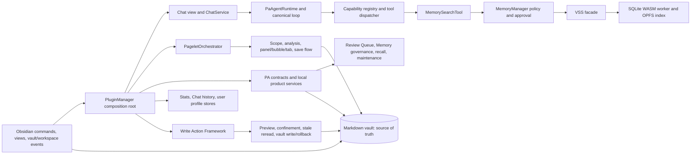

# Architecture Analysis

## System overview

The system is a single-process Obsidian plugin. `src/main.ts` exports
`PluginManager` from `src/plugin.ts`; `PluginManager.onload()` is the composition
root for settings, commands, views, event subscriptions and subsystem hosts.
There is no server component in this repository.

## Entrypoints

| Entrypoint | Code evidence | Responsibility | Confidence |
| --- | --- | --- | ---: |
| Plugin load/unload | `src/main.ts`; `PluginManager.onload`, `onLayoutReady`, `onIdle`, `unloadAsync` in `src/plugin.ts` | Settings migration, host construction, views/commands/events, lazy Pagelet, timers and teardown | 5/5 |
| Obsidian commands | `PluginManager.addCommand` and `registerAdvancedMemoryCommands` | Capture, Chat, Memory, Pagelet, preview/stats, plugin/theme and note-management operations | 5/5 |
| Views | `PluginManager.registerView`; `src/chat/chat-view.ts`; `src/preview.ts`; `src/stats-view.ts`; `src/pagelet/tab/PageletDetailView.ts` | Chat, records, statistics and Pagelet detail UI | 5/5 |
| Vault/workspace events | `PluginManager.registerVaultEventDispatch`; Pagelet event registration in `PageletOrchestrator.initialize` | Dirty/verify/reconcile Memory state, extraction scheduling, Pagelet activity and stale-state invalidation | 5/5 |
| Chat send | `LLMView` send path in `src/chat/chat-view.ts`; `ChatService.streamLLM` | Turn identity/abort, streaming UI, persistence, PA Agent invocation | 5/5 |
| Pagelet foreground work | `PageletOrchestrator.reviewCurrentNote`, `runMaintenanceReview`, `runQuietRecall`, `runGraphDiscovery`, `runScopeRecap` | Provider-backed review and local evidence surfaces with routing/timeout guards | 5/5 |
| Quick Capture | `QuickCaptureService.captureText` in `src/quick-capture.ts` | Append original text to current/daily/inbox note, then optional async enrichment | 5/5 |

## Module responsibilities and call direction

### Composition and UI

- `src/plugin.ts` owns lifecycle and converts the wide Obsidian plugin object
  into narrower internal hosts: `MemoryHost`, `AiServiceHost`, `PageletHost`,
  `StatsHost`, editor and view hosts. It is the intended inward dependency
  boundary, although at 4,246 lines it also contains several product workflows.
- `src/chat/chat-view.ts` owns Chat DOM, active-turn identity, abort and final
  persistence. It calls only `ChatService`/host methods for model work.
- `src/pagelet/orchestrator.ts` coordinates Pagelet's `AnalysisSessionManager`,
  `BackgroundPreparationCoordinator`, `BubbleCoordinator`, `PanelView`, Pet,
  scope resolver, preload cache/budget, research and `ReviewNoteSaveFlow`.
- `src/components/*`, `src/preview.ts` and `src/stats-view.ts` implement the
  remaining React/item views; registered roots are torn down through their view
  lifecycle (individual lifecycle coverage remains an audit concern, not assumed).

### Chat and agent runtime

- `ChatService.streamLLM` creates a per-turn `PaAgentRuntime` with the configured
  provider/platform/policy and optional Qwen web-search provider.
- `PaAgentRuntime` registers core capabilities, projects context through
  `PaAgentContextManager`, exports provider-native tool schemas, and runs
  `PaAgentLoop`.
- `PaAgentLoop` buffers streaming tool calls and delegates them to
  `ToolExecutionDispatcher`. Hybrid mode runs read-only/idempotent calls in
  parallel, while any capability declaring sequential execution serializes the
  whole batch.
- Tool and loop controls are explicit: default tool timeout 30 seconds, abort
  grace 2 seconds, assistant idle handling, tool-call budgets and overall turn
  wall clock 180 seconds (`MAX_TURN_WALL_CLOCK_MS`).
- `MemorySearchTool` is the sole normal Chat path into Memory. It requests a
  decision from `MemoryManager`, runs query rewrite and query embedding in
  parallel, performs hybrid vector/FTS search, expands one graph hop, enforces
  the Data Boundary again, and optionally reranks.

### Memory and VSS

- `MemoryManager` owns product policy, approval copy/modal, active preparation
  deduplication, background timers/queue, retries and status/progress.
- `src/vss.ts` is a small export facade over `VSS` in
  `src/vss/vss-core.ts`. VSS owns the dirty journal, verification queue, local
  marker, embedding profile, SQLite worker/index lifecycle, reconciliation and
  search.
- All current VSS mutation/read-index critical sections enter the single
  `operationQueue` through `runExclusive`; `SqliteVectorIndex` adds a worker
  request queue. Query embedding is intentionally performed before the VSS
  exclusive section, then the current profile/status is revalidated inside it.
- The durable backend is SQLite WASM using OPFS SAH pool. Current production
  call sites pass `allowFallback: false`; failures produce disabled/error state
  or scheduled SQLite recovery rather than automatic background writes to an
  alternate index.

### PA product contracts and local services

- `src/pa/contracts/*` defines source refs, data boundary, Memory taxonomy,
  retrieval outcomes/traces and Review Queue invariants.
- `src/pa/active-vault-indexer.ts` maps VSS search results into evidence,
  skipped sources, activity/structure lanes and replay-safe source references.
- `ReviewQueueStore`, `SavedInsightStore`, `MemoryGovernanceStore` and
  `RetrievalHabitProfileStore` hold bounded/curated product state and persist it
  through callbacks into plugin settings.
- `src/pa/maintenance-review.ts` is preview-only analysis;
  `maintenance-review-apply.ts` allows only source-backed, confined, Data
  Boundary-approved moves and records a move-back undo action.
- `src/quick-capture.ts` preserves raw user text and serializes appends per target
  path. Enrichment is scheduled only after the source capture is saved.

### Write Action Framework

- `src/ai-services/write-action-framework/runtime-integration.ts` sequences
  target confinement, user preview/confirmation, stale reread and execution.
- The self-write registry suppresses Pagelet-generated vault-event ripples for a
  five-second TTL and is disposed with the Pagelet runtime.
- Append actions bind their target to the active file rather than model input,
  cap generated content, mark the inserted boundary and retain original content
  for rollback.

## Core call chains

### Startup and recovery

1. Obsidian loads `src/main.ts` -> `PluginManager.onload()`.
2. Settings load/migrate through Obsidian `loadData`/`saveData`.
3. Chat history store, VSS and `MemoryManager` are initialized; automatic Memory
   maintenance schedules startup reconcile but does not perform a costly rebuild.
4. Views, commands, editor extensions and vault/workspace listeners register.
5. `onLayoutReady()` initializes history/stats/callouts and defers Pagelet,
   onboarding and extraction startup to `onIdle()`.
6. On unload, timers/observer/listeners are cancelled through registered
   lifecycles; Memory auto-maintenance stops; VSS awaits initialization/recovery
   barriers and disposes its worker/index/state store; Pagelet runtimes dispose.

### Chat with optional Memory

1. Chat creates a turn ID and `AbortController`, snapshots prior history, and
   rejects concurrent sends.
2. `ChatService` creates `PaAgentRuntime`; the model may call `search_memory`.
3. `MemorySearchTool` asks `MemoryManager.ensureReadyForChat()`.
4. Ready state searches immediately. Approved durable dirty state schedules
   reconcile/verify/flush and searches the prior snapshot without blocking.
   First use, missing local index or settings-stale rebuild asks for approval;
   unavailable/declined state returns an explicit no-Memory result.
5. VSS embeds the query, builds FTS input, locks the index, hybrid-searches and
   returns normalized source-backed chunks. Data-boundary filtering happens both
   during candidate normalization and graph expansion.
6. Canonical lifecycle events update the Chat UI. Only a live, non-cancelled
   turn is finalized and persisted to IndexedDB history.

### Vault change to Memory maintenance

1. `create`/`modify` events first reject recent Pagelet self-writes.
2. Extraction scheduler observes allowed events; VSS compares indexed metadata
   and either confirms dirty state or queues hash verification.
3. `MemoryManager` coalesces timers and serializes `verify`, `reconcile` and
   `flush` tasks in `maintenanceQueue`.
4. VSS serializes mutations, preserves dirty entries when a refresh fails, and
   writes dirty journal/marker state locally.
5. Failures retry at 60 seconds, 5 minutes and 15 minutes; success clears the
   shared failure counter and updates the status surface.

### Pagelet review and save

1. A command/panel action enters the foreground guard and reserves hourly/daily
   budget.
2. `AnalysisSessionManager` snapshots active path/range and discards superseded
   or wrong-active-note results. Route-based tasks additionally use a monotonically
   increasing route token.
3. `PageletOrchestrator` applies a 120-second foreground wait ceiling and routes
   results to panel/tab/bubble state.
4. Save goes through `ReviewNoteSaveFlow`, which rejects concurrent saves and
   uses `PageletHost.writeReviewNote` -> the Write Action Framework.
5. The framework confines the `.pagelet` target, previews, confirms, stale-checks,
   executes and registers the self-write; original source notes are not overwritten.

### Maintenance move

1. Local scan produces evidence-backed preview-only proposals.
2. Explicit apply revalidates source/target paths, Data Boundary, source/target
   existence and target confinement immediately before `vault.rename`.
3. An action-log entry records old/new paths and `move_back` undo.
4. Undo refuses missing/occupied/out-of-boundary recovery paths before renaming
   the file back.

## State ownership and consistency

| State | Owner and location | Consistency mechanism | Source of truth |
| --- | --- | --- | --- |
| Notes and explicit generated review notes | Obsidian Markdown vault | Vault APIs, confinement, preview/confirmation, stale reread, move undo | Markdown vault |
| Plugin configuration and PA ledgers | `PluginManager.settings` / Obsidian plugin `data.json` | Store validation plus `saveSettings`; lifecycle transitions in domain stores | Plugin data blob |
| Memory vector index | SQLite WASM OPFS database | VSS exclusive queue, worker queue, marker/profile signature, dirty journal/reconcile | Rebuildable cache; Markdown remains authoritative |
| VSS dirty/marker state | vault-scoped IndexedDB (`local-state-store.ts`) | state generation and chained writes | Local maintenance state |
| Chat history | vault-scoped IndexedDB (`chat-history-store.ts`) | IndexedDB transactions; atomic append-turn/update-conversation path | Local conversation store |
| User profile extraction | vault-scoped IndexedDB (`profile-store.ts`) | IndexedDB transactions and timeouts | Local curated profile |
| Statistics | IndexedDB by default; optional vault sync shards | repository/write chains, per-device records, migration checks | Local store or opted-in vault shards |
| Ephemeral UI/run state | Chat view, Pagelet orchestrator/managers | turn IDs, abort signals, route sequence, active-run guards, timers | In-memory only |

Important transaction boundaries are local rather than global: a Memory
candidate confirmation first reserves the Review Queue item, then persists the
confirmed record, then marks the queue applied and increments a counter. The
code includes recovery/logging for partial failures, but these writes are not a
single database transaction. Maintenance file rename and settings action-log
write are likewise separate reversible steps.

## Concurrency, retries and idempotence

- VSS: single promise queue for index operations; worker-side queue; dirty
  epochs prevent a successful refresh from clearing a newer edit.
- Memory: coalescing verify/reconcile/flush timers plus one maintenance promise
  chain; preparation requests reuse a compatible in-flight preparation.
- Chat: one active UI turn, `AbortController`, session/turn identity checks,
  stale render cancellation and per-tool timeout/abort handling.
- Pagelet: one foreground run, route token, analysis sequence, rate/token budgets,
  pending-save guard, self-write TTL and teardown of registered timers.
- Capture: per-path append queues prevent lost concurrent appends.
- Stats/chat stores: IndexedDB transaction boundaries; statistics also maintains
  a write generation/chain.
- Provider embeddings: bounded batches, single concurrency, throttling and
  retry delays only for retryable errors.

## Trust and process boundaries

- Vault note text crosses the local/plugin boundary only when a user-enabled
  feature invokes the configured AI provider under its disclosure/approval
  rules. The provider is untrusted with respect to tool arguments.
- Model-proposed writes cross four independent gates before vault mutation.
- Data Boundary checks exclude configured folders/tags/generated notes from
  retrieval/review; persisted replay refs remove raw excerpts/provider/prompt text.
- Qwen web search is an optional network capability loaded only for compatible
  base URLs and an enabled setting.
- Plugin/theme updater and image generation are separate explicit external
  actions; they are not background architecture dependencies for normal startup.
- OPFS/IndexedDB/localStorage are device-local browser/WebView facilities and
  may be unavailable or cleared independently of the Markdown vault.

## Error propagation and observability

- Normal user paths convert failures to calm notices/status/terminal Chat rows;
  background work logs and retries without repeated intrusive notices.
- `PluginManager.log` is debug-gated and recursively redacts token/key/header
  fields plus `sk-*` strings. Canonical PA Agent lifecycle/timing and context-used
  metadata feed the Chat UI and debug logs.
- Write Action Framework emits structured gate events only to a debug observer;
  production default is a no-op and there is no persistent trace/audit store.
- SQLite worker emits integrity/runtime warnings to the developer console.
- The project has no production telemetry by default; therefore most operational
  failures are visible through UI status and optional debug console, not metrics.

## Public and internal interfaces

- Public user contract: Obsidian commands, ribbon/status controls, registered
  views, settings, Markdown artifacts and documented plugin behavior.
- Internal stable seams: `MemoryHost`, `MemorySearchPort`, `AiServiceHost`,
  `PageletHost`, `StatsHost`, capability/provider interfaces, VSS facade and PA
  contract types.
- No repository-owned HTTP API or database schema is exposed publicly. Changes
  to persisted settings/Markdown formats remain compatibility-sensitive even
  when TypeScript symbols are internal.

## Architecture hotspots

1. `src/plugin.ts` is both composition root and a container for several product
   workflows. It is high-change/high-blast-radius, but splitting it without a
   proven failure would violate this run's conservative scope.
2. `src/pagelet/orchestrator.ts` coordinates many independent state machines;
   stale results, teardown and cross-surface routing are the highest correctness
   review surface.
3. Settings-backed PA stores rely on asynchronous persistence callbacks. Their
   behavior under concurrent mutations requires dedicated audit/reproduction;
   no ordering guarantee is assumed here.
4. Quiet Recall, Maintenance Review and graph discovery can traverse the vault.
   Existing candidate caps/cache/debounce reduce risk, but no controlled large-
   vault benchmark exists to quantify p95 latency or memory.
5. Observability is intentionally debug-first. Silent production recovery is
   product-aligned, but failure diagnosis depends on context-rich logs and tests.
6. Current VSS code retains an `allowFallback` option shape while all observed
   production calls disable fallback. Documentation referring to a live fallback
   should be treated as historical until a reachable caller proves otherwise.

## Analysis blind spots

- No live provider request was made, so provider streaming, quota and billing
  behavior is inferred from adapters/tests, not observed in this run.
- No controlled 1,000+ note fixture or profiler exists; performance hotspots are
  structural candidates, not measured bottlenecks.
- iOS/Android WebView lifecycle and OPFS behavior were not exercised; Android is
  already documented as unverified.
- IndexedDB/OPFS quota eviction and abrupt process termination cannot be fully
  simulated by the baseline mount smoke.
- Third-party Obsidian internals and plugin/theme update behavior are outside the
  safe no-external-write baseline.

