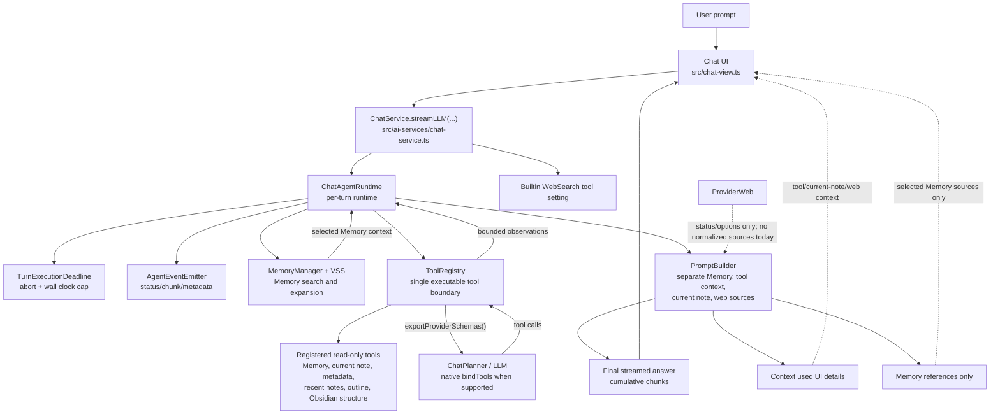
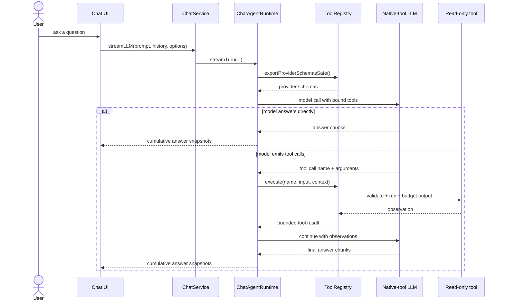
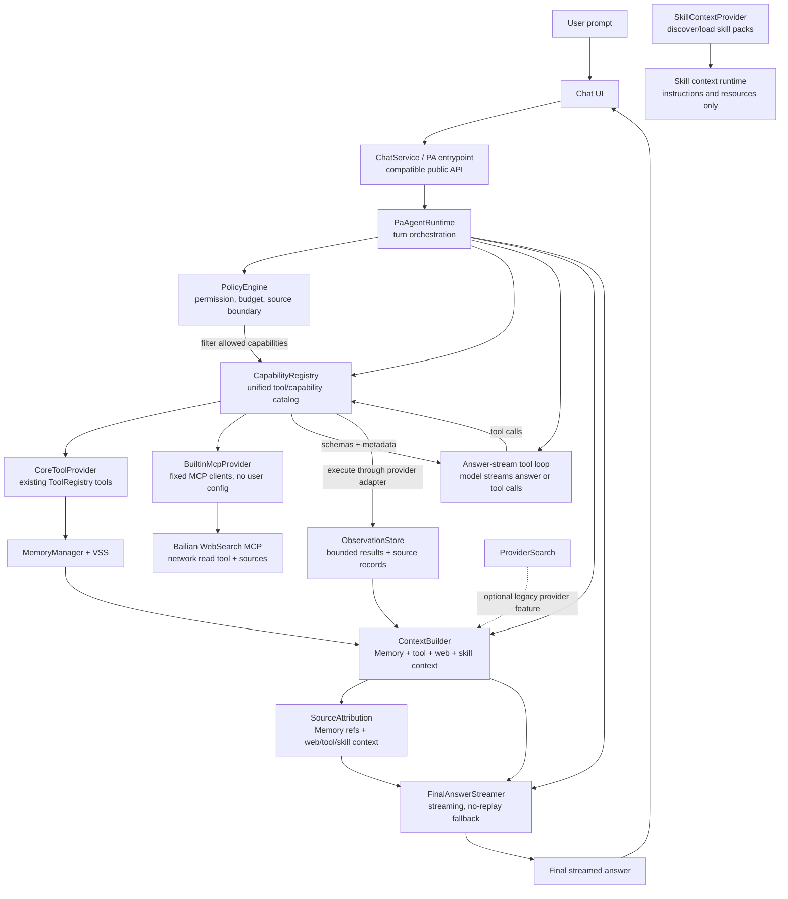
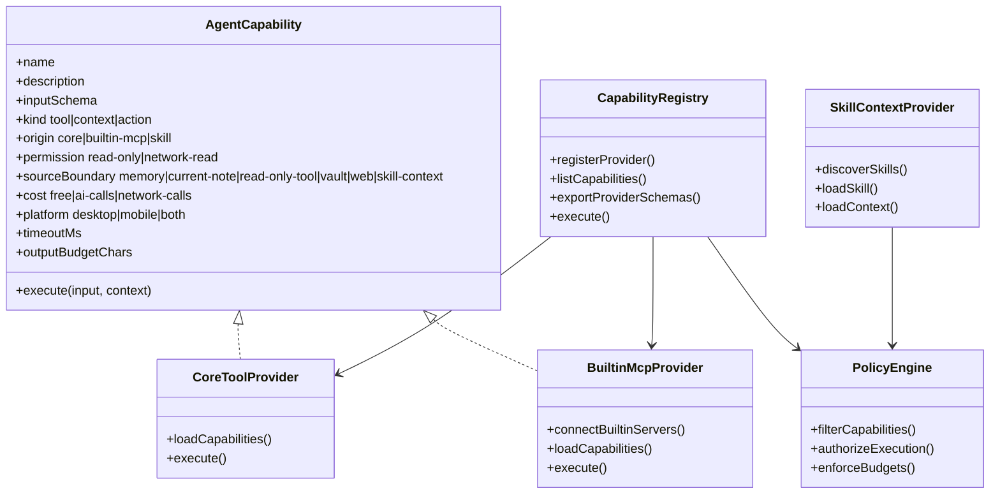
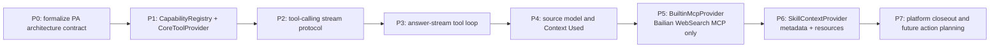

# PA Agent Architecture Comparison

## Status

This document compares the current Chat Agent runtime with a proposed PA Agent architecture that can support core tools, builtin MCP tools, and skills.

The current diagram describes existing implementation boundaries. The proposed diagram is a design target and is not implemented yet.

The implementation contract now lives in [PA Agent Architecture Plan](./pa-agent-architecture-plan.md), with execution tracked in [PA Agent Development Tracker](./pa-agent-development-tracker.md). If this comparison document conflicts with the plan, the plan wins.

## Current Chat Agent Architecture

### Current Tool Call Flow

## Proposed PA Agent Architecture

### Proposed Capability Model

## Key Differences

| Area | Current Chat Agent | Proposed PA Agent |
| --- | --- | --- |
| Main boundary | `ChatAgentRuntime` plus `ToolRegistry` | `PaAgentRuntime` plus `CapabilityRegistry` and providers |
| Tools | Built-in read-only tools registered directly in runtime constructor | Core tools become one provider; MCP adds tool capabilities; skills add context capabilities only |
| MCP | Not supported as a runtime capability source | Builtin MCP clients, fixed allowlist, no user-configured servers initially |
| Web search | Builtin WebSearch tool only after provider-search cleanup | Builtin WebSearch MCP only for PA Agent; provider built-in search is not supported |
| Skills | Only archived design notes; not a runtime primitive | Skill discovery, selection, and bounded context resources become first-class; skills are context capabilities in v1, not executable tools or exported tool schemas |
| Policy | Mostly embedded in tool definitions and registry checks | Central policy layer filters capabilities and enforces permission, budget, and source boundaries |
| Attribution | Memory references are strict; tool/current-note/web status goes to Context Used | Memory references stay strict; Web sources are a separate citation bucket; tool/current-note/skill context goes to Context Used |
| Migration risk | Stable existing Ralpha loop | Medium if done provider-by-provider; high if combined with full agent framework migration |

## Desktop And Mobile Compatibility

The core PA Agent architecture can support both desktop and mobile if capability providers are platform-aware. The compatibility risk is not the `PaAgentRuntime` shape itself. The risk sits in MCP transports, skill execution, Node/Electron dependencies, network APIs, bundle size, and source attribution.

| Layer or provider | Desktop | Mobile | Design note |
| --- | --- | --- | --- |
| `PaAgentRuntime` orchestration | Supported | Supported | Keep it browser-compatible TypeScript with no top-level Node/Electron imports. |
| `CapabilityRegistry` and `PolicyEngine` | Supported | Supported | Pure runtime catalog, schema export, filtering, and budget logic should be platform-neutral. |
| Existing core read-only tools | Supported | Supported | Continue using Obsidian App/Vault/MetadataCache APIs instead of Node filesystem APIs. |
| Memory and VSS | Supported today | Depends on current durable/fallback behavior | Do not add mobile-only blocking rebuild paths or new Node/OPFS assumptions without separate verification. |
| Remote builtin MCP over Streamable HTTP | Supported | Likely supportable | Use Obsidian `requestUrl` or a mobile-safe transport adapter. Avoid SDK code paths that require Node globals. |
| Local stdio MCP servers | Supported only with strict desktop gates | Not supported | stdio requires launching a subprocess, which is not available on mobile. |
| User-configured MCP servers | Deferred | Deferred | This remains higher risk on both platforms because it adds arbitrary network endpoints, auth, trust, and schema bloat. |
| Bailian WebSearch MCP | Supported if network/auth works | Likely supportable if CORS/mobile request behavior works | Treat as a builtin remote MCP. Store API key with existing plugin settings rules and disclose network use. |
| Provider built-in search | Legacy-only historical behavior | Not supported | All PA Agent web search goes through the builtin WebSearch tool. |
| Skill metadata and instruction packs | Supported | Supported | Loading `SKILL.md`-style metadata/resources from the vault or plugin bundle can be cross-platform. |
| Skill resource reads | Supported | Supported | Use vault-relative paths and Obsidian Vault APIs; keep output bounded. |
| Skill script execution | Desktop-only at best, high risk | Not supported for v1 | Defer or require a separate sandbox design. Do not execute arbitrary local scripts on mobile. |
| CLI / shell / external executables | Desktop-only deferred | Not supported | Keep separate from PA core and require explicit desktop-only gates. |

### Cross-Platform Rules For The New Core

- No Node, Electron, `fs`, `path`, `child_process`, shell, or stdio imports at top level.
- Platform-specific modules must be loaded lazily behind `Platform.isDesktopApp` or equivalent checks.
- Remote MCP should use an HTTP transport that works in Obsidian mobile. If the official SDK pulls in Node-only code, write a narrow browser-safe MCP client adapter for the builtin WebSearch server first.
- Do not make MCP connection failure fatal to chat. A provider should degrade to "capability unavailable" and let the agent answer from other context.
- Keep local stdio MCP, CLI, and script execution out of mobile. They should not be registered in `CapabilityRegistry` on mobile.
- Skill v1 should mean metadata, instructions, resources, and tool guidance. Script execution should be a later desktop-only or sandboxed phase.
- Every capability must declare platform support, permission, cost, source boundary, timeout, and output budget before it can be exported to the model.

## Suggested Migration Shape

The PA Agent target is the answer-stream tool loop described in the architecture plan. Existing tools should migrate unchanged through CoreToolProvider, then builtin MCP and skill context providers can be added behind the same capability policy boundary.
