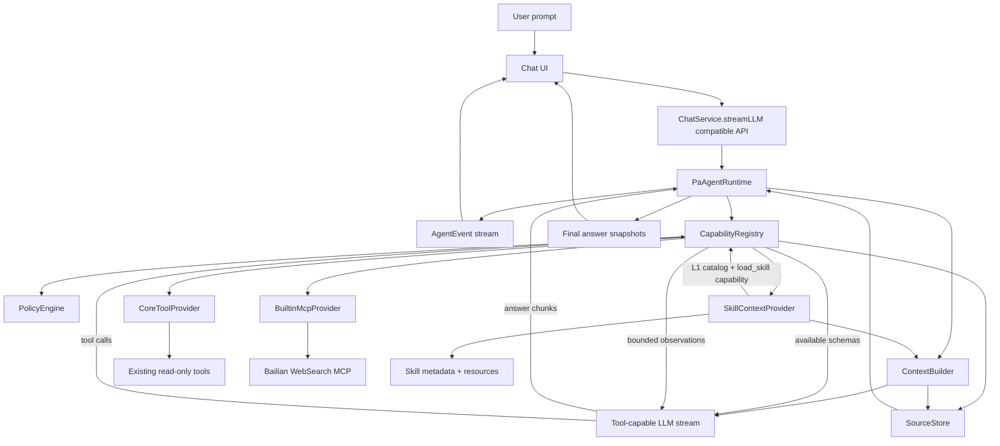
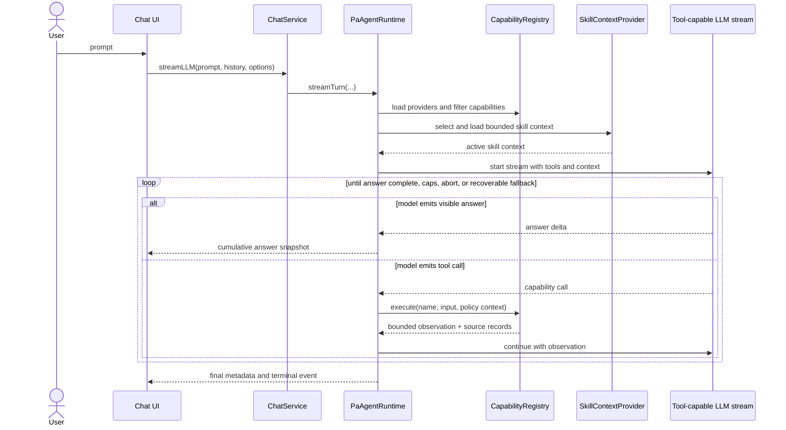
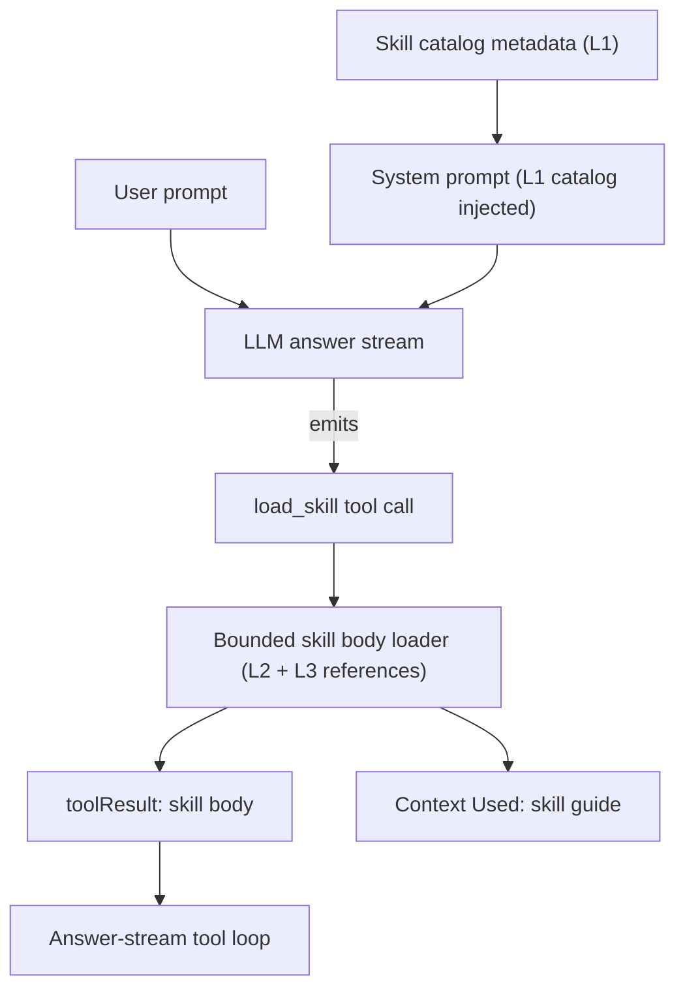

# PA Agent Architecture Plan

## Status And Source Of Truth

> Last revised: 2026-05-24. Revision history and closeout evidence have been folded into [PA Agent Design Completion Audit](./pa-agent-design-completion-audit.md).

This document is the product, architecture, runtime, capability, source-boundary, platform, and migration contract for evolving Personal Assistant Chat into PA Agent.

PA Agent is the next architecture step after the current Chat Agent and Ralpha native-tool loop work. The goal is not to add a few isolated tools to chat. The goal is to evolve chat into a transparent, cancellable, read-only assistant for understanding, auditing, organizing, and drafting safe next steps for the user's Obsidian vault, with a long-term path toward a more general personal agent while keeping the v1 boundary safe, understandable, and shippable.

Implementation completion is summarized in [PA Agent Design Completion Audit](./pa-agent-design-completion-audit.md). The deeper canonical runtime lifecycle refactor contract lives in [PA Agent Runtime Lifecycle Plan](./pa-agent-runtime-lifecycle-plan.md). Historical trackers (development-tracker, architecture-comparison, runtime-lifecycle-development-tracker, post-1.11.0 review/execution/cleanup, A3 progressive-skill-disclosure, Tool Calling Refactor) were precise during execution but have been精简归档 2026-05-27; their conclusions are folded into the audit doc.

## Product Goal

PA Agent v1 should turn the existing chat experience into a visible, cancellable, source-aware, read-only vault assistant.

For v1, the assistant's vault scope means it can reason across:

- Memory from the user's notes,
- the current note and vault metadata,
- read-only Obsidian structure tools,
- builtin web search with explicit web sources,
- selected skills that provide instructions, resources, and workflow guidance.

PA Agent v1 还要满足两个非功能性约束：

- v1 通过 `CapabilityRegistry` 暴露 opt-in usage event hook（`capability invoked / failed / skipped`），settings 默认关闭，不上传个人内容。目的是为 v1 ship 后的 Operations Agent 决策提供数据依据，避免重蹈 v1.6–v1.11 "在黑盒里做产品" 的覆辙。
- v1 ship 后立刻启动 Operations Agent 设计；v1 不分心做 write action，但 plan 的 `kind: "action"` 占位、`requiresConfirmation` 字段、`networkPolicy` 9 字段、独立 `PolicyEngine` 类等"过早抽象" 有意识为后续 action mode 预留。

For v1, "vault assistant" means understanding, auditing, explaining, summarizing, finding, and drafting plans or suggested edits. It does not mean executing changes.

PA Agent v1 remains a read and network-read assistant. It must not write notes, run commands, execute scripts, install plugins, call arbitrary endpoints, or invoke local executables.

The long-term direction is closer to a general agent. Future write actions, script execution, local MCP, CLI integration, and broader automation are intentionally reserved behind separate action-mode designs with preview, confirmation, cancellation, audit, platform gates, and rollback/failure handling.

## Current Implementation Baseline

The current code now has a PA Agent default path plus a legacy fallback path:

- `ChatService.streamLLM(...)` is the stable public chat entrypoint.
- `ChatAgentRuntime` owns turn orchestration, capability registration, answer-stream tool calls, final prompt construction, abort, fallback, and metadata emission.
- Existing read-only tools are exposed through `CoreToolProvider` and execute through `CapabilityRegistry` on the PA path.
- PA Agent canonical runtime is the only chat path. The legacy Ralpha planning/tool-collection fallback has been removed (v2.0.0). `paAgentAnswerStreamEnabled` is a historical setting kept as a no-op flag for stored-settings compatibility; OpenAI-compatible providers and DashScope-compatible Qwen remain the supported provider matrix and unsupported providers (e.g. Ollama) now surface an error rather than falling back. See provider matrix in `src/ai-services/ai-utils.ts` for the authoritative gate.
- Builtin Bailian WebSearch is registered as an optional desktop/mobile `network-read` provider when the builtin WebSearch setting is enabled and DashScope-compatible settings are present.
- Provider built-in web search, such as Qwen `enable_search`, is not supported. PA Agent WebSearch must go through the builtin WebSearch tool.
- Memory references are strict Memory sources. Current-note and read-only tool context belong in Context Used, not Memory references.

PA Agent v1 fully owns the default ChatService path; no rollback flag remains.

## Decision Record

| Decision | Final Choice | Implementation Meaning |
| --- | --- | --- |
| Product direction | Read-only Obsidian vault assistant, long-term general-agent path | PA Agent is more than tool plumbing, but v1 management means understanding, auditing, explaining, and drafting safe next steps. |
| Public entrypoint | Keep `ChatService.streamLLM(...)` compatibility | UI migration should be incremental. PA runtime can sit behind the existing service API. |
| Target tool loop | Design directly for answer-stream tool loop | Do not build a new planning-loop intermediate state for PA Agent. |
| Existing tools | Preserve as CoreToolProvider capabilities | Keep names, schemas, validation, budgets, source boundaries, and behavior first. |
| Memory | No old automatic Memory presearch in PA v1 | `search_memory` becomes a model-called core capability in the answer-stream loop. Use lightweight prompt guidance only. |
| Capability contract | `AgentCapability` is a ToolRegistry contract superset | Capability metadata is an executable policy boundary, not only provider schema. |
| v1 permissions | Only `read-only` and `network-read` | `write`, `local-script`, shell, CLI, and stdio MCP are reserved future permissions and rejected in v1. |
| Capability kinds | `tool`, `context`, `action` | v1 supports tool and context. Action is a reserved future kind and must not export or execute. |
| Skills | Skill v1 is Context Capability, not a tool by default | Skill runtime means discovery, selection, bounded context loading, and answer guidance. No scripts or custom tool execution. |
| Skill selection | Automatic plus user-explicit selection | User-explicit skill selection wins. Automatic selection uses metadata and small budgets. |
| Source model | Three separate buckets | Memory references, Context Used, and Web sources stay separate. |
| Web search | Builtin MCP WebSearch only | Web search must use the builtin WebSearch tool. Provider built-in web search is not passed to final answer model calls and does not appear as fallback/status. |
| MCP v1 scope | Builtin remote MCP only, first Bailian WebSearch | No user-configured MCP, local stdio MCP, shell bridge, arbitrary endpoint, or MCP self-expansion. |
| MCP trigger | Model-called tool in answer-stream loop | No keyword trigger. Tool description and policy guide use. |
| Desktop/mobile | Core, existing tools, skill context, and builtin WebSearch target both platforms | Desktop mobile-emulation smoke covers core PA Chat and the historical WebSearch-unavailable path. Real iPhone smoke covers core chat/direct answer, current-note answer after retry, current-note-only full-context exact token lookup, historical mobile WebSearch-unavailable behavior, positive mobile WebSearch after API-key entitlement fix, no-memory warning suppression, WebSearch ordinary recovery, WebSearch cancel/recovery, and general cancel/recovery. stdio MCP, CLI, shell, scripts are future desktop-only. |
| Provider lifecycle | Providers load independently | CoreToolProvider is required. BuiltinMcpProvider and SkillContextProvider are optional/recoverable. |
| Policy strictness | Practical safety, not hostile UX | Builtin web search should feel usable by default while protecting endpoints, keys, budgets, and source boundaries. |
| v1 telemetry | opt-in usage events through `CapabilityRegistry` | settings 默认关闭、不上传内容；事件覆盖 capability invoked / failed / skipped；为后续 Operations Agent 决策提供数据。 |
| Operations Agent 时间表 | v1 ship 后立刻启动 | v1 期间不做 write action 设计，但 ship 同周开始 `docs/operations-agent-plan.md`。 |
| Skill 内容方向 | Obsidian 运维向 + 减负向 | v1 ship 7 个 skill：3 个从 kepano/obsidian-skills 改写（read-only 措辞）+ 4 个 PA 独有运维向；不做与 Copilot Custom Commands 重叠的通用写作 skill。 |
| Skill 格式 | 采用 agentskills.io 规范 | SKILL.md (YAML frontmatter + Markdown body) + `references/` 子目录；与 Claude Code / Codex CLI 兼容；可直接消费 kepano 仓库 skill。 |
| Source UI 呈现 | 引用列表 + 折叠详情 | 3 个 source bucket 在数据层保留；UI 主区只展示 Citations (Memory refs + Web sources)，Context Used 默认折叠到二级面板。 |
| PA Agent runtime 拆分 | 内改 + feature flag | 先在 `ChatAgentRuntime` 内加 feature flag 路径；先抽 `PromptBuilder` / `AgentEventEmitter` / `TurnExecutionDeadline` 为独立类（行为不变）；SPEC-03 落地后再 rename 为 `PaAgentRuntime`。 |
| Tool input repair | pi-style 每 tool `prepareArguments` hook + fail-loud strict validation（2026-05-26 Phase A 落地） | `chat-tools.ts:ChatToolDefinition.prepareArguments?` 字段做 alias 映射；`CapabilityRegistry.prepareAndValidate(name, raw, ctx)` 前置验证；失败 → `schema_invalid` outcome → HostPolicy corrective + force_finalize 自动承接。删除 `pa-agent-host-tools.ts` 散乱的 `normalizeHostToolCallInput` switch 与 silent userInput fallback（净减 ~338 行）。详见 [PA Agent Design Completion Audit §4.4](./pa-agent-design-completion-audit.md)。 |

## Target Architecture



## Answer-Stream Tool Loop

PA Agent target behavior:



Rules:

- Every tool call executes through `CapabilityRegistry`.
- Policy filtering happens before schema export and again before execution.
- Unsupported platform, missing settings, missing key, policy failure, duplicate name, and provider unavailable states must prevent export to the model.
- Recoverable provider and capability failures should become observations or unavailable statuses, not whole-chat failures.
- Abort remains the strongest stop condition and must cancel model stream, tool execution, MCP requests when possible, skill loading, and queued UI events.
- Loop caps must cover model turns, tool executions, per-tool calls, wall-clock time, output size, and source record budgets.

### Segment State Machine

`PaAgentRuntime` 在 answer-stream loop 内维护一个 `currentSegment` 状态：

- `thinking` — 模型尚未输出任何 visible content；
- `answering` — 模型正在输出 answer chunk；
- `tool-calling` — 模型正在发出 tool call（含 incremental `tool_call_chunks`）。

合法转移：`thinking → answering`、`thinking → tool-calling`、`answering → tool-calling`（answer 分段后调工具）、`tool-calling → answering`（tool 结果回灌后继续 answer）。

错误条件（替换现有 `chat-agent.ts:899-911` 中 "visible-output started 后再有 tool call = 协议错误"）：

- 同一 answer segment 关闭前出现新的 tool call delta = 协议错误。
- segment 边界必须 emit `AgentSegmentBoundary` 事件供 UI 区分 "新一段 answer" vs "tool 调用打断"。

`no-replay fallback` 重写为三档：

- `before-visible-output`：可全量降级到非流式 transport。
- `mid-tool`：可重试单个 tool（保留已有 observation）。
- `post-visible-output`：只能 graceful close + 写 Context Used 状态行。

## Capability Model

`AgentCapability` is the PA Agent execution contract. It is a superset of the existing `ChatToolRegistryDefinition`, not only an LLM function schema.

```ts
type AgentCapabilityKind = "tool" | "context" | "action";

type AgentCapabilityOrigin = "core" | "builtin-mcp" | "skill";

type AgentPermissionV1 = "read-only" | "network-read";

type AgentPermissionFuture =
  | "write"
  | "local-script"
  | "shell"
  | "stdio-mcp";

type AgentPlatformSupport = "desktop" | "mobile" | "both";

type AgentSourceRecordKind =
  | "memory-reference"
  | "context-used"
  | "web-source"
  | "skill-guide";

interface AgentCapability {
  name: string;
  description: string;
  inputSchema: Record<string, unknown>;
  plannerGuidance: string[];

  kind: AgentCapabilityKind;
  origin: AgentCapabilityOrigin;
  providerId: string;

  permission: AgentPermissionV1;
  sourceBoundary: "memory" | "current-note" | "read-only-tool" | "vault" | "web" | "skill-context";
  cost: "free" | "ai-calls" | "network-calls";
  platform: AgentPlatformSupport;

  outputBudgetChars: number;
  timeoutMs: number;
  requiresConfirmation: false;
  failureBehavior: "recoverable";
  statusMessageText: string;
  sourceRecordKind: AgentSourceRecordKind;

  networkPolicy?: AgentNetworkPolicy;
}

interface AgentNetworkPolicy {
  transport: "streamable-http";
  allowedEndpoints: string[];
  authKeyId: string;
  redactHeaders: string[];
  redactQueryParams: string[];
  maxResponseBytes: number;
  maxCallsPerTurn: number;
  maxCallsPerMinute?: number;
}
```

v1 constraints:

- `permission` must be `read-only` or `network-read`.
- `kind = action` is reserved and rejected by v1 registry policy.
- `requiresConfirmation` remains `false` only because v1 has no write/action capability. Future action capabilities must use a separate confirmation model.
- A capability that fails policy must not be exported to the model.
- A capability that is not supported on the current platform must not be exported to the model.
- Duplicate capability names are rejected with a diagnostic; the later registration does not win silently.
- Capability ordering should be stable so prompt/schema behavior does not drift between turns.

## Provider Contracts

```ts
type CapabilityProviderKind = "tool-provider" | "context-provider";

interface CapabilityProvider {
  id: string;
  displayName: string;
  required: boolean;
  kind: CapabilityProviderKind;
  platform: AgentPlatformSupport;
  load(context: ProviderLoadContext): Promise<ProviderLoadResult>;
  execute?(name: string, input: unknown, context: AgentCapabilityContext): Promise<AgentCapabilityResult>;
  loadContext?(request: AgentContextRequest, context: AgentCapabilityContext): Promise<AgentContextResult>;
}

interface ProviderLoadContext {
  turnId: string;
  platform: "desktop" | "mobile";
  settings: Record<string, unknown>;
  signal?: AbortSignal;
  redactor: AgentRedactor;
}

interface ProviderLoadResult {
  status: "available" | "unavailable";
  capabilities: AgentCapability[];
  unavailableReason?: string;
  diagnostics?: Record<string, unknown>;
}

interface AgentCapabilityContext {
  turnId: string;
  signal?: AbortSignal;
  platform: "desktop" | "mobile";
  onStatus?: (status: string) => void;
  redactor: AgentRedactor;
}

interface AgentCapabilityResult {
  status: "ok" | "unavailable" | "failed";
  observation: unknown;
  sourceRecords: SourceRecord[];
  truncated?: boolean;
  omittedCount?: number;
  unavailableReason?: string;
  userSafeMessage?: string;
}

interface AgentContextRequest {
  name: string;
  reason: string;
}

interface AgentContextResult {
  status: "ok" | "unavailable";
  context: UntrustedContextBlock[];
  sourceRecords: SourceRecord[];
  unavailableReason?: string;
}

interface UntrustedContextBlock {
  kind: SourceRecordKind;
  label: string;
  text: string;
  sourceRecords: SourceRecord[];
  truncated?: boolean;
}

interface AgentRedactor {
  redactText(value: string): string;
  redactUrl(value: string): string;
  redactHeaders(value: Record<string, string>): Record<string, string>;
  redactJson(value: unknown): unknown;
}
```

Provider rules:

- `CoreToolProvider` is required and wraps existing read-only tool implementations.
- `BuiltinMcpProvider` is optional and recoverable. Its first v1 server is Bailian WebSearch MCP.
- `SkillContextProvider` is optional and recoverable. It provides skill metadata and bounded context, not arbitrary executable tools.
- Provider load failure must be isolated. One optional provider failure must not remove capabilities from another provider.
- Provider availability is recomputed per turn from platform, settings, key availability, and runtime gates.
- The registry exports only `kind = "tool"` capabilities that are both available and policy-allowed.
- Context capabilities are exposed through `SkillContextProvider.getCatalog` (L1 catalog into system prompt) and the `load_skill` tool capability (L2 body fetched on model tool call). The earlier `SkillRouter` bag-of-words selector and its deprecated `selectContext` / `selectAllEnabledContexts` paths were deleted in v2.0.0 cleanup; the model is now the router (see [Audit §4.5](./pa-agent-design-completion-audit.md) for A1→A3 history).

## CoreToolProvider

CoreToolProvider migrates the current tool surface without redesigning it first:

- `search_memory`
- `get_current_note_context`
- `search_vault_metadata`
- `list_recent_notes`
- `read_note_outline`
- `inspect_obsidian_note`
- `read_canvas_summary`
- `search_vault_snippets`
- `list_vault_tags`

Migration rules:

- Keep tool names unchanged.
- Keep input schemas unchanged.
- Keep validation, output budgets, status messages, and source boundaries unchanged first.
- Keep Context Used behavior compatible.
- Treat `search_memory` as a model-called tool in the answer-stream loop; do not run old automatic Memory presearch in PA Agent v1.
- Add prompt/tool guidance that encourages Memory and vault tools for user-note, project, vault, and past-writing questions.

## Skill Model

PA Agent v1 SKILL 格式采用 [Agent Skills specification](https://agentskills.io/specification)，与 Claude Code、Codex CLI、`kepano/obsidian-skills` 等工具兼容。这意味着：

- PA 用户已有的 Claude Skills 可被 PA 直接消费（待 v1.x 启用 vault-local skill scan）。
- PA 编写的 skill 可放回 kepano-style 仓库供其它 agent 复用。
- 不重新发明 metadata / 加载 / 触发机制。

Skill v1 is Context Capability and is implemented by `SkillContextProvider`.

A skill is a bounded, inspectable package of:

- metadata,
- applicability description,
- instructions,
- output contract guidance,
- optional resources or examples,
- optional allowed-tool hints.

Skill v1 does not:

- execute scripts,
- define arbitrary tools,
- grant permissions,
- call MCP directly,
- write files,
- call shell, CLI, or local executables,
- bypass `CapabilityRegistry` or `PolicyEngine`.

Skill flow (A3 progressive disclosure, post v2.0.0 cleanup):



Selection rules:

- User-explicit skill selection wins.
- Automatic selection uses skill metadata first and loads only selected skills.
- Per-turn selected skill count is small and budgeted.
- Skill context is untrusted context.
- Skill Context Used entries should use product language such as "Used guide: newsletter-writing" instead of exposing implementation terms.
- Skill context capabilities must not export provider tool schemas.
- Skill context capabilities must not implement `execute()`.

Initial implementation uses plugin-bundled skill metadata and Markdown resources that ship with the plugin. Vault-local skill folders, skill marketplaces, and custom skill tools require a later SPEC unless explicitly approved.

Plugin-bundled skill 规则：

- 目录结构：`skills/<skill-name>/SKILL.md` (必需) + `references/*.md` (可选，按需加载)。
- `SKILL.md` 必须含 YAML frontmatter，必需字段 `name` (kebab-case, ≤64 chars) + `description` (含 "Use when ..." 触发提示)。可选字段：`version` / `author` / `allowed-tools`。
- `allowed-tools` 字段在 v1 仅作 prompt hint，不改 `CapabilityRegistry` allowlist；模型仍只能调用 Registry 已 export 的 capability。
- 三层渐进加载：L1 frontmatter 始终进 system prompt；L2 `SKILL.md` body 由模型 `load_skill` tool call 触发加载（详见 [PA Agent Design Completion Audit §4.5](./pa-agent-design-completion-audit.md)）；L3 `references/*.md` 在 body 显式引用时按需加载。早期方案 §445 写的 "L2 在 SkillRouter 选中后加载" 已被 A3 决策取代——bag-of-words router 召回率不足以承担 L2 选择，模型自判通过 description 是更好的 router。
- 描述应聚焦 read-only：v1 ship 的 skill body 用 "draft / suggest / inspect" 措辞，不用 "create / edit / write"。
- Bundled skill 仍是 untrusted context；skill body 通过 `<skill_body name="...">` envelope 标记；所有 tool observation（含 vault / Memory / web / current note / skill body）通过 `formatToolObservations` 统一包裹为 `<untrusted source="tool:X" turn="N" index="M" is_error="bool">...</untrusted>`（详见 `src/ai-services/pa-agent-runtime.ts` 的 `formatToolObservations` helper），防止 prompt injection 攻击者通过 vault/web 内容劫持模型指令。
- v1 仅扫描 plugin-bundled skill；settings 预留 `.pa/skills/` vault-local 扫描开关（默认关），由 v1.x 启用后兼容 kepano 安装路径。

## MCP WebSearch Model

PA Agent v1 supports builtin remote MCP only.

Initial builtin MCP:

- Bailian WebSearch MCP at `https://dashscope.aliyuncs.com/api/v1/mcps/WebSearch/mcp`.

Explicitly out of scope for v1:

- user-configured MCP servers,
- local stdio MCP,
- local SSE server bridges,
- arbitrary endpoints,
- shell/CLI bridges,
- MCP tools that register more unknown tools at runtime.

Network policy:

- Endpoint must match a builtin allowlist.
- Authorization, secret headers, secret query params, request/response body summaries, errors, metadata, Context Used, source records, and model observations must pass through a common redactor.
- Calls have deadlines, response byte limits, per-turn limits, and optional per-minute limits.
- Failure is recoverable and should not fail the whole chat.
- The model may call WebSearch MCP from the answer-stream loop when needed. There is no keyword trigger.
- Tool description should guide use for latest information, community discussion, official docs, external facts, or explicit search requests.
- Obsidian `requestUrl` transports may not provide hard network cancellation or streaming byte caps. MCP adapters must treat abort as "ignore future results and stop updating the turn", use conservative deadlines, enforce maximum serialized response size, and return a recoverable unavailable/failed result on over-budget responses.

Provider built-in web search policy:

- Provider built-in web search is not supported.
- Qwen `enable_search` / provider `search_options` must not be sent by PA Agent runtime.
- If builtin WebSearch is unavailable, not called, or fails recoverably, the turn should continue with an unavailable/skipped tool observation or required-capability diagnostic; it must not fall back to provider search.

### MCP Abort Semantics

由于 Obsidian `requestUrl` 不提供真硬网络取消和真流式字节上限，MCP adapter 必须明确以下行为：

- 维护 `inflightRequests: Set<string>`，abort 触发后立即从 set 移除并丢弃后续 resolve。
- 整响应缓冲式回调，超 `maxResponseBytes` 时整体丢弃 + 返回 recoverable `unavailable`，不假装节省流量。
- UI 文案必须明示 "请求已发出，结果已丢"（user-facing message：例如 "Web search cancelled — request was already sent to the provider"），避免用户误以为请求被网络层截断。
- v1 不承诺移动端 MCP 的硬取消；mobile builtin WebSearch 通过同一 `requestUrl` adapter、inflight 丢弃、timeout、response-size budget 和 recoverable failure path 处理。真实 iPhone `requestUrl` auth smoke 已在 API-key entitlement fix 后通过；cancel/recovery 真机 smoke 已通过。硬 timeout/deadline 行为由 adapter 自动化测试覆盖，除非后续引入专门的手动 timeout fixture。

## Untrusted Context And Prompt Injection

Every capability observation and context block that comes from notes, vault snippets, web results, MCP responses, or skill resources is untrusted data.

Rules:

- Untrusted data must be wrapped as data, not instructions.
- Tool, web, skill, and vault outputs must not grant permission or override system/developer instructions.
- The final prompt should label these blocks as untrusted context and instruct the model to use them only as evidence.
- Malicious note snippets, web titles, web summaries, skill resources, and MCP response fields must be covered by tests.
- The model must not follow instructions embedded inside web/search results, skill resources, vault snippets, Canvas text, or note content.

## Source Model

PA Agent v1 keeps four source buckets separate:

| Bucket | Meaning | Can be shown as citation | Can enter Memory references |
| --- | --- | --- | --- |
| Memory references | Selected Memory sources from vault notes | Yes, as Memory references | Yes |
| Context Used | Current note, vault tools, skill guides, non-citation context | No | No |
| Web sources | Verifiable URL/title/source records from MCP WebSearch | Yes, as web sources | No |

Rules:

- Memory references remain Memory-only.
- Core tool outputs go to Context Used unless a Memory result explicitly selects that same source through Memory rules.
- Skill context goes to Context Used as skill guide context.
- MCP WebSearch results with URLs can become Web sources.
- Source records must support truncation, redaction, provider id, capability name, and turn id.

```ts
type SourceRecordKind =
  | "memory-reference"
  | "context-used"
  | "web-source"
  | "skill-guide";

interface SourceRecord {
  kind: SourceRecordKind;
  turnId: string;
  providerId?: string;
  capabilityName?: string;
  title?: string;
  path?: string;
  url?: string;
  snippet?: string;
  score?: number;
  truncated?: boolean;
  redacted?: boolean;
  metadata?: Record<string, unknown>;
}
```

Web source rules:

- Only `http` and `https` URLs can become Web sources.
- Credentials, fragments that contain sensitive data, and known secret query params must be removed or redacted.
- `file://`, `obsidian://`, `javascript:`, `data:`, and other non-web schemes are rejected.
- Titles and snippets must be plain text, HTML-stripped, length-bounded, and redacted.
- URLs should be canonicalized and deduplicated before UI display.

User-facing attribution UI 规则：

- 主区显示 `Citations`（Memory references + Web sources），是唯一的引用列表。
- `Context Used` 默认折叠为二级面板，可展开查看 current note / 各 vault tool / skill guide / fallback。
- bucket 元数据在 `SourceRecord` 层完整保留，UI 折叠仅影响呈现，不影响数据。
- Context Used 折叠面板每条仍显示 provenance：note path、context kind、truncated、citation-eligible。

## Permission And Transparency UX

PA Agent v1 does not require per-tool confirmation because it has no write/action capability. It still needs clear read/network transparency.

Rules:

- First-use or settings copy should explain that read-only context may be sent to the configured AI provider when it is used in an answer.
- Network-read settings should explain that web search sends search queries to the configured/builtin web provider.
- Context Used should show which categories were used in a turn: Memory, current note, note structure, snippets, web search, and skill guide.
- Broad vault searches, truncated results, unavailable mobile capabilities, and unavailable WebSearch should be visible in Context Used or a concise status row.
- Normal successful read-only use should avoid noisy confirmation prompts.
- When a request is broad, sensitive, or materially incomplete because of budgets/platform fallback, the answer should briefly state that it used bounded context.
- Skill 选择对用户暴露两路径：(a) 自动选择由模型在 answer-stream 中通过 `load_skill` tool 主动加载匹配的 skill body（L1 catalog 进 system prompt，模型按 description 自判），默认开启 (b) chat 输入区 typeahead 显式选择，显式优先。settings 提供全局 "禁用所有 skill" 开关与 per-skill enable/disable 列表。早期版本曾用 `SkillRouter` bag-of-words 选择器，已被 A3 progressive disclosure 取代并在 v2.0.0 cleanup 删除（详见 [Audit §4.5](./pa-agent-design-completion-audit.md)）。
- v1 提供 opt-in usage telemetry：settings "Share anonymous capability usage" 开关，默认关闭。事件仅含 capability/skill 名 + ok/failed/skipped + 耗时，不含 prompt / observation / note 内容。

## Desktop And Mobile Strategy

| Capability area | Desktop | Mobile | v1 rule |
| --- | --- | --- | --- |
| PA runtime | Supported | Supported | Browser-compatible TypeScript only. |
| CapabilityRegistry and PolicyEngine | Supported | Supported | No Node/Electron top-level imports. |
| CoreToolProvider | Supported | Supported | Use Obsidian App/Vault/MetadataCache APIs. |
| Skill context | Supported | Supported | Bounded metadata/resource reads only. |
| Bailian WebSearch MCP | Supported | Enabled | Uses the same Obsidian `requestUrl` adapter on mobile. Real iPhone positive auth smoke and cancel/recovery smoke passed after API-key entitlement fix; hard timeout/deadline behavior remains adapter-test coverage unless a manual timeout fixture is added. |
| Provider built-in web search | Not supported | Not supported | All PA web search goes through the builtin WebSearch tool. |
| Local stdio MCP | Future desktop-only | Not supported | Not in v1. |
| CLI/shell/external executable | Future desktop-only | Not supported | Not in v1. |
| Script execution | Future desktop-only or sandboxed | Not supported | Not in v1. |
| Write/action capabilities | Future action mode | Future action mode | Separate plan required. |

Platform rules:

- Unsupported capabilities are not registered or not exported to the model.
- Mobile unavailable states should not interrupt ordinary chat, but consequential missing capabilities should be visible in Context Used or a concise status row.
- Mobile WebSearch MCP is exported when the builtin WebSearch setting is enabled and DashScope-compatible settings are present. Failure must remain recoverable, must not fall back to provider search, and must surface incomplete/unavailable state without fabricating web-source claims.
- Bundle size, desktop mobile-emulation smoke, real mobile cold-start/core smoke, real mobile `requestUrl` auth smoke, and real mobile WebSearch cancel/recovery smoke are separate gates for MCP and skill phases.

## Future Action Mode

**时间表**：PA Agent v1 ship 后立刻启动 Operations Agent 设计；不在 v1 期间并行调研。v1 期间所有 action mode 字段保持占位，不实际 export 或 execute。

PA Agent v1 reserves but does not implement action capabilities.

Future `write`, `local-script`, `shell`, `stdio-mcp`, CLI, and automation work must use a separate action design with:

- explicit product scope,
- preview,
- user confirmation,
- cancellation,
- local-only redacted audit,
- platform gating,
- target confinement,
- failure and rollback/undo behavior where applicable,
- separate tracker and review closeout.

The future action mode must not weaken the v1 read/network-read capability boundary.

## Validation Strategy

Every implementation phase must prove:

- existing chat entrypoint compatibility,
- answer-stream cumulative snapshot behavior,
- abort and no-replay fallback behavior,
- provider load failure isolation,
- duplicate capability rejection,
- policy filtering before schema export,
- policy enforcement before execution,
- source bucket separation,
- untrusted context wrapping and prompt-injection resistance,
- provider built-in web search disabled,
- URL sanitization for Web sources,
- mobile unsupported capability non-export,
- output and source budget enforcement,
- redacted diagnostics,
- Obsidian smoke for runtime/UI behavior changes,
- segment 状态机的所有合法/非法转移测试覆盖,
- MCP abort 后 inflight 丢弃 + UI 文案断言,
- skill frontmatter 解析（含缺字段 / 长度超限 / 非 kebab-case）测试,
- skill `references/` 按需加载预算测试,
- telemetry 事件不含 prompt / observation / note 内容的负样本测试,
- segment 边界事件（`AgentSegmentBoundary`）在 UI dual-emit 期间的兼容性测试.
