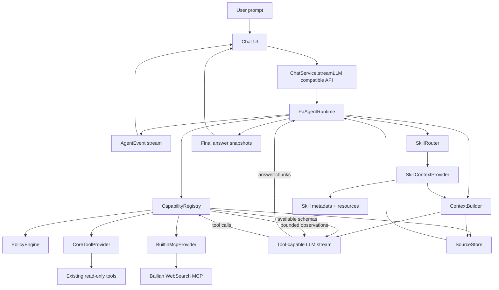
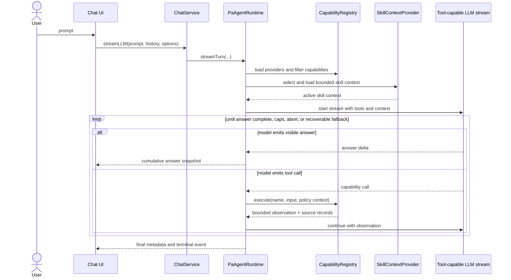
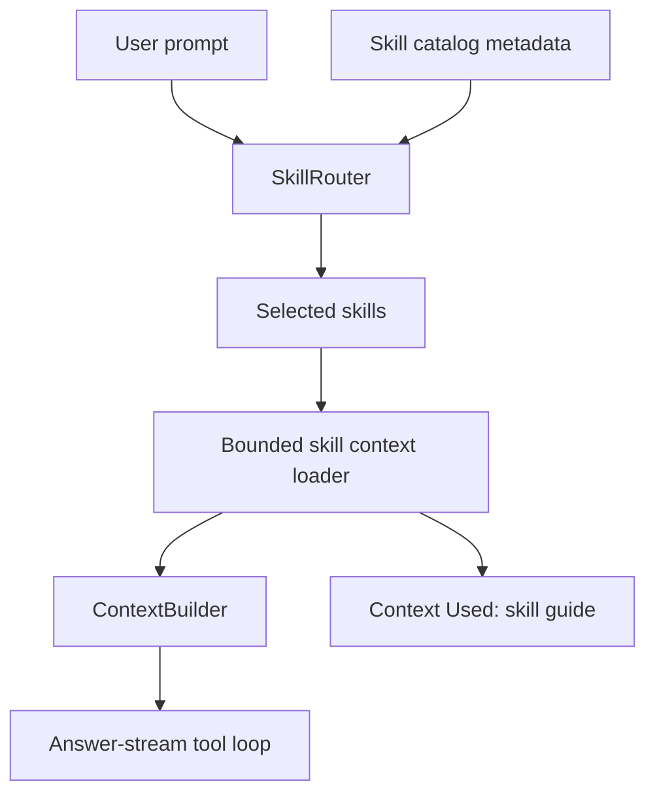

# PA Agent Architecture Plan

## Status And Source Of Truth

This document is the product, architecture, runtime, capability, source-boundary, platform, and migration contract for evolving Personal Assistant Chat into PA Agent.

PA Agent is the next architecture step after the current Chat Agent and Ralpha native-tool loop work. The goal is not to add a few isolated tools to chat. The goal is to evolve chat into a transparent, cancellable, read-only assistant for understanding, auditing, organizing, and drafting safe next steps for the user's Obsidian vault, with a long-term path toward a more general personal agent while keeping the v1 boundary safe, understandable, and shippable.

Implementation progress is tracked in [PA Agent Development Tracker](./pa-agent-development-tracker.md). Architecture comparison diagrams remain in [PA Agent Architecture Comparison](./pa-agent-architecture-comparison.md), but this document is the implementation contract.

If this document conflicts with `docs/pa-agent-architecture-comparison.md`, this document wins. If this document conflicts with existing Ralpha runtime behavior, the current code remains the factual baseline until a PA Agent implementation SPEC changes it and updates the tracker.

## Product Goal

PA Agent v1 should turn the existing chat experience into a visible, cancellable, source-aware, read-only vault assistant.

For v1, the assistant's vault scope means it can reason across:

- Memory from the user's notes,
- the current note and vault metadata,
- read-only Obsidian structure tools,
- builtin web search with explicit web sources,
- selected skills that provide instructions, resources, and workflow guidance.

For v1, "vault assistant" means understanding, auditing, explaining, summarizing, finding, and drafting plans or suggested edits. It does not mean executing changes.

PA Agent v1 remains a read and network-read assistant. It must not write notes, run commands, execute scripts, install plugins, call arbitrary endpoints, or invoke local executables.

The long-term direction is closer to a general agent. Future write actions, script execution, local MCP, CLI integration, and broader automation are intentionally reserved behind separate action-mode designs with preview, confirmation, cancellation, audit, platform gates, and rollback/failure handling.

## Current Implementation Baseline

The current code is not yet PA Agent:

- `ChatService.streamLLM(...)` is the stable public chat entrypoint.
- `ChatAgentRuntime` owns turn orchestration, Memory selection, tool planning, final prompt construction, final answer streaming, abort, fallback, and metadata emission.
- Existing tools are registered directly in the `ChatAgentRuntime` constructor through `ToolRegistry`.
- Native tools currently run in a planning/tool-collection phase before the final answer stream. The final answer stream is not yet the target answer-stream tool loop.
- Provider web search, such as Qwen `enable_search`, is a model request option and does not produce normalized web sources today.
- Memory references are strict Memory sources. Current-note, read-only tool, and provider-web context belong in Context Used, not Memory references.

PA Agent will replace the old planning/tool-collection shape with an answer-stream tool loop as the target architecture.

## Decision Record

| Decision | Final Choice | Implementation Meaning |
| --- | --- | --- |
| Product direction | Read-only Obsidian vault assistant, long-term general-agent path | PA Agent is more than tool plumbing, but v1 management means understanding, auditing, explaining, and drafting safe next steps. |
| Public entrypoint | Keep `ChatService.streamLLM(...)` compatibility | UI migration should be incremental. PA runtime can sit behind the existing service API. |
| Target tool loop | Design directly for answer-stream tool loop | Do not build a new planning-loop intermediate state for PA Agent. |
| Existing tools | Preserve as CoreToolProvider capabilities | Keep names, schemas, validation, budgets, source boundaries, and behavior first. |
| Memory | No old automatic Memory presearch in PA v1 | `search_memory` becomes a model-called core capability in the answer-stream loop. Use lightweight prompt guidance only. |
| Capability contract | `AgentCapability` is a ToolRegistry contract superset | Capability metadata is an executable policy boundary, not only provider schema. |
| v1 permissions | Only `read-only` and `network-read` | `write`, `local-script`, shell, CLI, and stdio MCP are reserved future permissions and rejected in v1. |
| Capability kinds | `tool`, `context`, `action` | v1 supports tool and context. Action is a reserved future kind and must not export or execute. |
| Skills | Skill v1 is Context Capability, not a tool by default | Skill runtime means discovery, selection, bounded context loading, and answer guidance. No scripts or custom tool execution. |
| Skill selection | Automatic plus user-explicit selection | User-explicit skill selection wins. Automatic selection uses metadata and small budgets. |
| Source model | Four separate buckets | Memory references, Context Used, Web sources, and Provider web status stay separate. |
| Web search | Builtin MCP WebSearch is preferred; provider search is fallback/status only | Prefer MCP WebSearch. For explicit search requests, provider web search may be used as fallback when MCP WebSearch is unavailable, not called, or recoverably fails, but provider search still does not create Web sources. |
| MCP v1 scope | Builtin remote MCP only, first Bailian WebSearch | No user-configured MCP, local stdio MCP, shell bridge, arbitrary endpoint, or MCP self-expansion. |
| MCP trigger | Model-called tool in answer-stream loop | No keyword trigger. Tool description and policy guide use. |
| Desktop/mobile | Core, existing tools, and skill context target both platforms | WebSearch MCP targets both with mobile fallback. stdio MCP, CLI, shell, scripts are future desktop-only. |
| Provider lifecycle | Providers load independently | CoreToolProvider is required. BuiltinMcpProvider and SkillContextProvider are optional/recoverable. |
| Policy strictness | Practical safety, not hostile UX | Builtin web search should feel usable by default while protecting endpoints, keys, budgets, and source boundaries. |

## Target Architecture



## Answer-Stream Tool Loop

PA Agent target behavior:



Rules:

- Every tool call executes through `CapabilityRegistry`.
- Policy filtering happens before schema export and again before execution.
- Unsupported platform, missing settings, missing key, policy failure, duplicate name, and provider unavailable states must prevent export to the model.
- Recoverable provider and capability failures should become observations or unavailable statuses, not whole-chat failures.
- Abort remains the strongest stop condition and must cancel model stream, tool execution, MCP requests when possible, skill loading, and queued UI events.
- Loop caps must cover model turns, tool executions, per-tool calls, wall-clock time, output size, and source record budgets.

## Capability Model

`AgentCapability` is the PA Agent execution contract. It is a superset of the existing `ChatToolRegistryDefinition`, not only an LLM function schema.

```ts
type AgentCapabilityKind = "tool" | "context" | "action";

type AgentCapabilityOrigin = "core" | "builtin-mcp" | "skill";

type AgentPermissionV1 = "read-only" | "network-read";

type AgentPermissionFuture =
  | "write"
  | "local-script"
  | "shell"
  | "stdio-mcp";

type AgentPlatformSupport = "desktop" | "mobile" | "both";

type AgentSourceRecordKind =
  | "memory-reference"
  | "context-used"
  | "web-source"
  | "provider-web-status"
  | "skill-guide";

interface AgentCapability {
  name: string;
  description: string;
  inputSchema: Record<string, unknown>;
  plannerGuidance: string[];

  kind: AgentCapabilityKind;
  origin: AgentCapabilityOrigin;
  providerId: string;

  permission: AgentPermissionV1;
  sourceBoundary: "memory" | "current-note" | "read-only-tool" | "vault" | "web" | "skill-context";
  cost: "free" | "ai-calls" | "network-calls";
  platform: AgentPlatformSupport;

  outputBudgetChars: number;
  timeoutMs: number;
  requiresConfirmation: false;
  failureBehavior: "recoverable";
  statusMessageText: string;
  sourceRecordKind: AgentSourceRecordKind;

  networkPolicy?: AgentNetworkPolicy;
}

interface AgentNetworkPolicy {
  transport: "streamable-http";
  allowedEndpoints: string[];
  authKeyId: string;
  redactHeaders: string[];
  redactQueryParams: string[];
  maxResponseBytes: number;
  maxCallsPerTurn: number;
  maxCallsPerMinute?: number;
}
```

v1 constraints:

- `permission` must be `read-only` or `network-read`.
- `kind = action` is reserved and rejected by v1 registry policy.
- `requiresConfirmation` remains `false` only because v1 has no write/action capability. Future action capabilities must use a separate confirmation model.
- A capability that fails policy must not be exported to the model.
- A capability that is not supported on the current platform must not be exported to the model.
- Duplicate capability names are rejected with a diagnostic; the later registration does not win silently.
- Capability ordering should be stable so prompt/schema behavior does not drift between turns.

## Provider Contracts

```ts
type CapabilityProviderKind = "tool-provider" | "context-provider";

interface CapabilityProvider {
  id: string;
  displayName: string;
  required: boolean;
  kind: CapabilityProviderKind;
  platform: AgentPlatformSupport;
  load(context: ProviderLoadContext): Promise<ProviderLoadResult>;
  execute?(name: string, input: unknown, context: AgentCapabilityContext): Promise<AgentCapabilityResult>;
  loadContext?(request: AgentContextRequest, context: AgentCapabilityContext): Promise<AgentContextResult>;
}

interface ProviderLoadContext {
  turnId: string;
  platform: "desktop" | "mobile";
  settings: Record<string, unknown>;
  signal?: AbortSignal;
  redactor: AgentRedactor;
}

interface ProviderLoadResult {
  status: "available" | "unavailable";
  capabilities: AgentCapability[];
  unavailableReason?: string;
  diagnostics?: Record<string, unknown>;
}

interface AgentCapabilityContext {
  turnId: string;
  signal?: AbortSignal;
  platform: "desktop" | "mobile";
  onStatus?: (status: string) => void;
  redactor: AgentRedactor;
}

interface AgentCapabilityResult {
  status: "ok" | "unavailable" | "failed";
  observation: unknown;
  sourceRecords: SourceRecord[];
  truncated?: boolean;
  omittedCount?: number;
  unavailableReason?: string;
  userSafeMessage?: string;
}

interface AgentContextRequest {
  name: string;
  reason: string;
}

interface AgentContextResult {
  status: "ok" | "unavailable";
  context: UntrustedContextBlock[];
  sourceRecords: SourceRecord[];
  unavailableReason?: string;
}

interface UntrustedContextBlock {
  kind: SourceRecordKind;
  label: string;
  text: string;
  sourceRecords: SourceRecord[];
  truncated?: boolean;
}

interface AgentRedactor {
  redactText(value: string): string;
  redactUrl(value: string): string;
  redactHeaders(value: Record<string, string>): Record<string, string>;
  redactJson(value: unknown): unknown;
}
```

Provider rules:

- `CoreToolProvider` is required and wraps existing read-only tool implementations.
- `BuiltinMcpProvider` is optional and recoverable. Its first v1 server is Bailian WebSearch MCP.
- `SkillContextProvider` is optional and recoverable. It provides skill metadata and bounded context, not arbitrary executable tools.
- Provider load failure must be isolated. One optional provider failure must not remove capabilities from another provider.
- Provider availability is recomputed per turn from platform, settings, key availability, and runtime gates.
- The registry exports only `kind = "tool"` capabilities that are both available and policy-allowed.
- Context capabilities are routed through `SkillRouter` and `ContextBuilder`; they do not export tool schemas and do not use `execute()`.

## CoreToolProvider

CoreToolProvider migrates the current tool surface without redesigning it first:

- `search_memory`
- `get_current_note_context`
- `search_vault_metadata`
- `list_recent_notes`
- `read_note_outline`
- `inspect_obsidian_note`
- `read_canvas_summary`
- `search_vault_snippets`
- `list_vault_tags`

Migration rules:

- Keep tool names unchanged.
- Keep input schemas unchanged.
- Keep validation, output budgets, status messages, and source boundaries unchanged first.
- Keep Context Used behavior compatible.
- Treat `search_memory` as a model-called tool in the answer-stream loop; do not run old automatic Memory presearch in PA Agent v1.
- Add prompt/tool guidance that encourages Memory and vault tools for user-note, project, vault, and past-writing questions.

## Skill Model

Skill v1 is Context Capability and is implemented by `SkillContextProvider`.

A skill is a bounded, inspectable package of:

- metadata,
- applicability description,
- instructions,
- output contract guidance,
- optional resources or examples,
- optional allowed-tool hints.

Skill v1 does not:

- execute scripts,
- define arbitrary tools,
- grant permissions,
- call MCP directly,
- write files,
- call shell, CLI, or local executables,
- bypass `CapabilityRegistry` or `PolicyEngine`.

Skill flow:



Selection rules:

- User-explicit skill selection wins.
- Automatic selection uses skill metadata first and loads only selected skills.
- Per-turn selected skill count is small and budgeted.
- Skill context is untrusted context.
- Skill Context Used entries should use product language such as "Used guide: newsletter-writing" instead of exposing implementation terms.
- Skill context capabilities must not export provider tool schemas.
- Skill context capabilities must not implement `execute()`.

Initial implementation uses plugin-bundled skill metadata and Markdown resources that ship with the plugin. Vault-local skill folders, skill marketplaces, and custom skill tools require a later SPEC unless explicitly approved.

Plugin-bundled skill rules:

- Skill metadata and resources are reviewed and versioned with the plugin.
- Metadata describes name, description, triggers/applicability, budgets, and optional recommended existing tools.
- Markdown resources describe workflow guidance, output format, examples, and constraints.
- Bundled skills must still be treated as untrusted context when injected into a model turn.
- Users cannot add arbitrary vault-local `SKILL.md` files in v1.

## MCP WebSearch Model

PA Agent v1 supports builtin remote MCP only.

Initial builtin MCP:

- Bailian WebSearch MCP.

Explicitly out of scope for v1:

- user-configured MCP servers,
- local stdio MCP,
- local SSE server bridges,
- arbitrary endpoints,
- shell/CLI bridges,
- MCP tools that register more unknown tools at runtime.

Network policy:

- Endpoint must match a builtin allowlist.
- Authorization, secret headers, secret query params, request/response body summaries, errors, metadata, Context Used, source records, and model observations must pass through a common redactor.
- Calls have deadlines, response byte limits, per-turn limits, and optional per-minute limits.
- Failure is recoverable and should not fail the whole chat.
- The model may call WebSearch MCP from the answer-stream loop when needed. There is no keyword trigger.
- Tool description should guide use for latest information, community discussion, official docs, external facts, or explicit search requests.
- Obsidian `requestUrl` transports may not provide hard network cancellation or streaming byte caps. MCP adapters must treat abort as "ignore future results and stop updating the turn", use conservative deadlines, enforce maximum serialized response size, and return a recoverable unavailable/failed result on over-budget responses.

Provider web search interop:

- MCP WebSearch and Qwen provider built-in search are mutually exclusive per turn.
- If MCP WebSearch is available and exported, provider built-in search is disabled for that turn.
- If MCP WebSearch is unavailable and the user setting allows provider search, provider search can be used as fallback/status only.
- Provider search does not create Web sources unless the provider returns verifiable source metadata and PA Agent explicitly parses it in a future SPEC.
- For explicit search requests, provider search fallback is allowed when MCP WebSearch is unavailable, when the model did not call exported MCP WebSearch, or when MCP WebSearch returned a recoverable failure. Fallback provider search remains status-only and must not create Web sources.
- The implementation must avoid simultaneous MCP and provider search inside the same model stream. If provider fallback is used after MCP non-use/failure, it should be a controlled fallback path with clear Provider web status.

## Untrusted Context And Prompt Injection

Every capability observation and context block that comes from notes, vault snippets, web results, MCP responses, or skill resources is untrusted data.

Rules:

- Untrusted data must be wrapped as data, not instructions.
- Tool, web, skill, and vault outputs must not grant permission or override system/developer instructions.
- The final prompt should label these blocks as untrusted context and instruct the model to use them only as evidence.
- Malicious note snippets, web titles, web summaries, skill resources, and MCP response fields must be covered by tests.
- The model must not follow instructions embedded inside web/search results, skill resources, vault snippets, Canvas text, or note content.

## Source Model

PA Agent v1 keeps four source buckets separate:

| Bucket | Meaning | Can be shown as citation | Can enter Memory references |
| --- | --- | --- | --- |
| Memory references | Selected Memory sources from vault notes | Yes, as Memory references | Yes |
| Context Used | Current note, vault tools, skill guides, non-citation context | No | No |
| Web sources | Verifiable URL/title/source records from MCP WebSearch | Yes, as web sources | No |
| Provider web status | Provider-level web search status without normalized sources | No | No |

Rules:

- Memory references remain Memory-only.
- Core tool outputs go to Context Used unless a Memory result explicitly selects that same source through Memory rules.
- Skill context goes to Context Used as skill guide context.
- MCP WebSearch results with URLs can become Web sources.
- Provider built-in search status can only say that provider web search was enabled or may have been used. It must not claim specific URLs.
- Source records must support truncation, redaction, provider id, capability name, and turn id.

```ts
type SourceRecordKind =
  | "memory-reference"
  | "context-used"
  | "web-source"
  | "provider-web-status"
  | "skill-guide";

interface SourceRecord {
  kind: SourceRecordKind;
  turnId: string;
  providerId?: string;
  capabilityName?: string;
  title?: string;
  path?: string;
  url?: string;
  snippet?: string;
  score?: number;
  truncated?: boolean;
  redacted?: boolean;
  metadata?: Record<string, unknown>;
}
```

Web source rules:

- Only `http` and `https` URLs can become Web sources.
- Credentials, fragments that contain sensitive data, and known secret query params must be removed or redacted.
- `file://`, `obsidian://`, `javascript:`, `data:`, and other non-web schemes are rejected.
- Titles and snippets must be plain text, HTML-stripped, length-bounded, and redacted.
- URLs should be canonicalized and deduplicated before UI display.

User-facing attribution:

- `Citations` are Memory references and Web sources.
- `Context Used` is evidence used in the turn but not a citation list.
- Context Used entries should still show useful provenance such as note path, context type, truncation status, and whether the entry is citation-capable.

## Permission And Transparency UX

PA Agent v1 does not require per-tool confirmation because it has no write/action capability. It still needs clear read/network transparency.

Rules:

- First-use or settings copy should explain that read-only context may be sent to the configured AI provider when it is used in an answer.
- Network-read settings should explain that web search sends search queries to the configured/builtin web provider.
- Context Used should show which categories were used in a turn: Memory, current note, note structure, snippets, web search, provider web status, and skill guide.
- Broad vault searches, truncated results, unavailable mobile capabilities, and provider fallback without URL sources should be visible in Context Used or a concise status row.
- Normal successful read-only use should avoid noisy confirmation prompts.
- When a request is broad, sensitive, or materially incomplete because of budgets/platform fallback, the answer should briefly state that it used bounded context.

## Desktop And Mobile Strategy

| Capability area | Desktop | Mobile | v1 rule |
| --- | --- | --- | --- |
| PA runtime | Supported | Supported | Browser-compatible TypeScript only. |
| CapabilityRegistry and PolicyEngine | Supported | Supported | No Node/Electron top-level imports. |
| CoreToolProvider | Supported | Supported | Use Obsidian App/Vault/MetadataCache APIs. |
| Skill context | Supported | Supported | Bounded metadata/resource reads only. |
| Bailian WebSearch MCP | Supported | Target supported with fallback | Use mobile-safe HTTP adapter; do not assume Node or streaming SDK support. |
| Provider built-in web search | Supported | Supported if provider request works | Fallback/status only when MCP WebSearch is unavailable. |
| Local stdio MCP | Future desktop-only | Not supported | Not in v1. |
| CLI/shell/external executable | Future desktop-only | Not supported | Not in v1. |
| Script execution | Future desktop-only or sandboxed | Not supported | Not in v1. |
| Write/action capabilities | Future action mode | Future action mode | Separate plan required. |

Platform rules:

- Unsupported capabilities are not registered or not exported to the model.
- Mobile unavailable states should not interrupt ordinary chat, but consequential missing capabilities should be visible in Context Used or a concise status row.
- Mobile WebSearch MCP failure can fall back to provider search status if settings allow it.
- Bundle size and mobile smoke are gates for MCP and skill phases.

## Future Action Mode

PA Agent v1 reserves but does not implement action capabilities.

Future `write`, `local-script`, `shell`, `stdio-mcp`, CLI, and automation work must use a separate action design with:

- explicit product scope,
- preview,
- user confirmation,
- cancellation,
- local-only redacted audit,
- platform gating,
- target confinement,
- failure and rollback/undo behavior where applicable,
- separate tracker and review closeout.

The future action mode must not weaken the v1 read/network-read capability boundary.

## Validation Strategy

Every implementation phase must prove:

- existing chat entrypoint compatibility,
- answer-stream cumulative snapshot behavior,
- abort and no-replay fallback behavior,
- provider load failure isolation,
- duplicate capability rejection,
- policy filtering before schema export,
- policy enforcement before execution,
- source bucket separation,
- untrusted context wrapping and prompt-injection resistance,
- MCP/provider web search mutual exclusion,
- URL sanitization for Web sources,
- mobile unsupported capability non-export,
- output and source budget enforcement,
- redacted diagnostics,
- Obsidian smoke for runtime/UI behavior changes.
