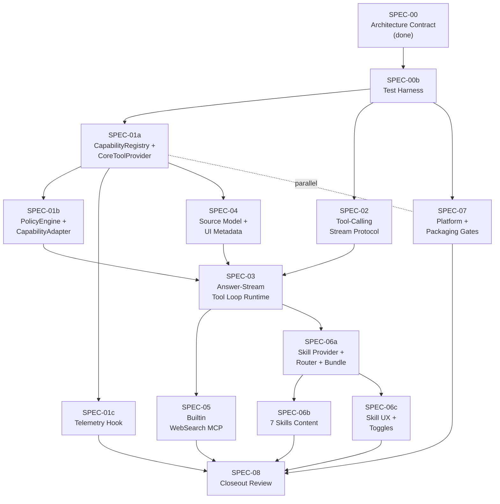

# PA Agent Development Tracker

## Status

| Field | Value |
| --- | --- |
| Track | PA Agent architecture upgrade |
| Current status | PA Agent v1 implementation closeout complete through SPEC-08 for the already-scoped core runtime, mobile, and WebSearch paths. Builtin WebSearch is now enabled for mobile behind the existing DashScope-compatible provider/settings gates. Desktop Obsidian mobile-emulation smoke covers core PA Chat load, direct answer, and the historical mobile WebSearch-unavailable warning path. Real iPhone smoke now covers cold-start sample collection, core chat load, direct answer, current-note answer after retry, current-note-only full-context exact token lookup, historical mobile WebSearch-unavailable behavior, mobile WebSearch success after API-key entitlement fix, mobile WebSearch no-memory warning re-smoke, mobile WebSearch ordinary recovery, mobile WebSearch cancel/recovery, and general cancel/recovery. The iPhone-found false WebSearch-required warning, tool drift, insufficient nearby context, duplicate current-note tool-call empty-answer defects, mobile WebSearch 403 diagnostic gap, and no-memory false warning have code-level regression coverage and passed real-device re-smoke where applicable. The later broad desktop Obsidian smoke passed core chat, Memory, WebSearch, recent-notes, tags, skill, read-only boundary, and cancel/recovery paths; its structured vault tool `query`/`path` follow-up is now mitigated by schema-aware argument repair, focused regression coverage, and targeted Obsidian smoke for snippets, metadata, outline, canvas, path-specific note inspection, and current-note warning re-check. Telemetry baseline instrumentation and the post-ship collection runbook are complete; real aggregate telemetry collection remains a future milestone. |
| Last revised | 2026-05-24 |
| Plan source of truth | [PA Agent Architecture Plan](./pa-agent-architecture-plan.md) |
| Runtime lifecycle refactor | [PA Agent Runtime Lifecycle Plan](./pa-agent-runtime-lifecycle-plan.md), [PA Agent Runtime Lifecycle Development Tracker](./pa-agent-runtime-lifecycle-development-tracker.md) |
| Answer completion follow-up | [PA Agent Answer Completion Policy Plan](./pa-agent-answer-completion-policy-plan.md) |
| Comparison diagrams | [PA Agent Architecture Comparison](./pa-agent-architecture-comparison.md) |
| Revision history | [PA Agent v1 Plan Revisions](./pa-agent-v1-plan-revisions.md) — 14-decision revision (2026-05-22) |
| Current runtime baseline | `ChatService.streamLLM(...)` now defaults to the PA answer-stream path through `ChatAgentRuntime` + `CapabilityRegistry` for supported providers; legacy Ralpha planning remains behind `paAgentAnswerStreamEnabled=false` and for declined providers such as Ollama |

This tracker records execution status only. Product, architecture, and boundary decisions live in the plan. If this tracker drifts from the plan, update both before implementation continues.

## Confirmed Decisions

All product / architecture / boundary decisions are documented in [PA Agent Architecture Plan — Decision Record](./pa-agent-architecture-plan.md#decision-record). As of 2026-05-22 there are 22 confirmed decisions. This tracker does not duplicate the decision text; update the plan first if a decision changes.

## MVP Shape

Core MVP:

- [x] Answer-stream tool loop.
- [x] Existing Memory, current-note, and vault read tools migrated through CoreToolProvider.
- [x] Source and Context Used UX for Memory, current note, vault structure, snippets, Web sources, and skill guides.
- [x] Cancellation, fallback, and no-replay behavior preserved in automated coverage.

Required v1 capabilities:

- [x] Builtin Bailian WebSearch MCP.
- [x] SkillContextProvider v1.

WebSearch MCP and SkillContextProvider v1 are implemented and have desktop Obsidian smoke evidence. Builtin WebSearch is now exported on mobile when enabled with DashScope-compatible settings. Earlier desktop mobile-emulation and real iPhone smoke confirmed the unavailable path did not fall back to provider search or fabricate web sources. After the API-key entitlement was adjusted, real iPhone smoke confirmed positive WebSearch evidence: the mobile path returned `WebSearch / 5 normalized web sources` and answered `obsidian.md / Obsidian Help`. Follow-up iPhone smoke confirmed no-memory warning suppression, ordinary recovery after WebSearch, and WebSearch cancel/recovery. Hard timeout/deadline behavior remains adapter automated-test coverage unless a dedicated manual timeout fixture is introduced.

## Phase Plan

### SPEC Dependency Graph

Critical path (longest): SPEC-00 → SPEC-00b → SPEC-01a → SPEC-04 → SPEC-03 → SPEC-06a → SPEC-06b → SPEC-08.

Parallel-able pairs:
- SPEC-01a ⇄ SPEC-07 (platform gates can mature while Registry stabilizes)
- SPEC-01b ⇄ SPEC-01c (independent extensions of SPEC-01a)
- SPEC-02 ⇄ SPEC-01a/01b (stream protocol independent of Registry internals)
- SPEC-05 ⇄ SPEC-06a (MCP and Skill Provider independent after SPEC-03)
- SPEC-06b ⇄ SPEC-06c (skill content authoring vs UX wiring)

### SPEC-00: Architecture Contract

| Field | Value |
| --- | --- |
| Status | [x] Done |
| Effort | S (done) |
| Goal | Capture confirmed PA Agent product, runtime, capability, source, MCP, skill, and platform decisions. |
| Owner docs | `docs/pa-agent-architecture-plan.md`, `docs/pa-agent-development-tracker.md`, `docs/pa-agent-architecture-comparison.md` |
| Out of scope | Runtime code changes. |
| Exit gate | Plan and tracker exist; comparison doc points to plan as source of truth; whitespace check passes. |

Verification:

- [x] `git diff --check`
- [x] `rg -n "[[:blank:]]+$" docs/pa-agent-architecture-plan.md docs/pa-agent-development-tracker.md docs/pa-agent-architecture-comparison.md`

### SPEC-00b: Test Harness

| Field | Value |
| --- | --- |
| Status | [x] Done |
| Effort | S (2-3 天) |
| Goal | 在 SPEC-01 之前补齐 PA Agent 的测试脚手架，使后续 SPEC 不需要各自重发明 fixture / factory / fake provider。 |
| Owner files | `src/tests/factories/`, `src/tests/fakes/`, `src/tests/fixtures/llm-stream/` |
| Out of scope | 任何 runtime 行为变更。 |
| Exit gate | (a) LangChain `AIMessageChunk` 流可被录制并回放 (b) `ToolRegistry` / 后续 `CapabilityRegistry` 可用 factory 构造 (c) fake provider 可注入 `ChatPlanner` 供单测 (d) jest 跑通示例 fixture 测试。 |

Required checks:

- [x] `npm test` 通过新增 fixture/factory 的 self-check。
- [x] 至少 3 个 LLM stream fixture：直接 answer、单 tool call、多 tool call + partial JSON args。
- [x] fake provider 支持模拟：unavailable / timeout / 协议错误。
- [x] 文档 `src/tests/README.md` 说明 fixture 录制方式与命名。

### SPEC-01a: CapabilityRegistry + CoreToolProvider

| Field | Value |
| --- | --- |
| Status | [x] Done |
| Effort | M (3-5 天) |
| Goal | Introduce minimum `CapabilityRegistry` + `CoreToolProvider` boundary so existing 9 read-only tools can be listed/exported/executed through the new abstraction without behavior change. |
| Owner files | `src/ai-services/capability-registry.ts` (new), `src/ai-services/capability-types.ts` (new), `src/ai-services/core-tool-provider.ts` (new), `src/ai-services/chat-tools.ts` (existing, wrap), `src/ai-services/chat-agent.ts` (call site swap), `src/tests/capability-registry.test.ts` (new) |
| Out of scope | PolicyEngine, telemetry hook, answer-stream loop, MCP, skill, write/actions. |
| Exit gate | (a) 9 existing tools register via `CoreToolProvider` and export identical provider schemas as today (snapshot test) (b) `exportProviderSchemas()` returns capabilities in registration order across 3 sequential turns (snapshot test) (c) duplicate capability name rejected with diagnostic and earlier registration wins (d) all existing tool tests green (e) typecheck green. |

Required checks:

- [x] Existing `chat-tools.ts` tool tests remain green.
- [x] Snapshot test: `CoreToolProvider.loadCapabilities()` output equals current `ToolRegistry.exportProviderSchemas()` output (modulo new `kind/origin/providerId` fields).
- [x] Snapshot test: capability ordering identical across 3 sequential `loadCapabilities()` calls.
- [x] Negative test: registering 2 capabilities with the same name → second registration rejected with diagnostic, first kept.
- [x] Cross-platform check: no Node-only imports (`fs/path/child_process`) added.

### SPEC-01b: PolicyEngine + CapabilityAdapter

| Field | Value |
| --- | --- |
| Status | [x] Done |
| Effort | S (2-3 天) |
| Goal | Add `PolicyEngine` (filter capabilities before schema export and again before execution) and `CapabilityAdapter` shim that converts old `ChatToolResult` to new `AgentCapabilityResult`. |
| Owner files | `src/ai-services/policy-engine.ts` (new), `src/ai-services/capability-adapter.ts` (new), capability-registry tests |
| Out of scope | Telemetry hook, runtime loop, MCP, skill. |
| Exit gate | (a) Policy filters reject `kind=action` and non-v1 permissions before schema export (b) Policy re-checks before `execute()` (c) Adapter converts existing `ChatToolResult.sources` → `AgentCapabilityResult.sourceRecords` with correct `kind` mapping (d) old `ToolRegistry.execute()` tests green via adapter. |

Required checks:

- [x] Policy rejection test: a capability with `permission="write"` is not exported.
- [x] Policy rejection test: a capability with `kind="action"` is not exported and not executable.
- [x] Adapter test: `current-note` tool's `ChatAgentSource` correctly maps to `SourceRecord{kind:"context-used", capabilityName:"get_current_note_context"}`.
- [x] Adapter test: `search_memory` tool's source maps to `kind:"memory-reference"`.
- [x] Cross-platform check: no Node-only imports.

### SPEC-01c: Telemetry Hook

| Field | Value |
| --- | --- |
| Status | [x] Done |
| Effort | S (1-2 天) |
| Goal | `CapabilityRegistry` emits opt-in `onCapabilityEvent` events; settings adds default-off toggle "Share anonymous capability usage". |
| Owner files | `src/ai-services/capability-registry.ts`, `src/settings.ts`, telemetry tests |
| Out of scope | Actual upload pipeline (v1 keeps events local). |
| Exit gate | (a) `onCapabilityEvent` fires for `invoked/failed/skipped/unavailable` with payload `{capabilityName, providerId, status, durationMs}` (b) settings default OFF (c) negative test: payload does NOT contain prompt / observation text / note content / vault paths. |

Required checks:

- [x] Unit test: invoking a capability while telemetry OFF → no event emitted.
- [x] Unit test: invoking a capability while telemetry ON → exactly one event matching payload schema.
- [x] Negative test: event payload JSON does NOT match `/note|prompt|content|path/i` keys.
- [x] Settings UI test: toggle default value is `false`.

### SPEC-02: Tool-Calling Stream Protocol

| Field | Value |
| --- | --- |
| Status | [x] Done |
| Effort | M (3-5 天) |
| Goal | Define and test the provider adapter protocol for streamed tool calls before replacing the runtime loop. |
| Owner files | `src/ai-services/*tool-calling*`, `src/ai-services/ai-utils.ts`, provider fixtures/tests, `docs/pa-agent-tool-call-protocol-matrix.md` (new) |
| Out of scope | Runtime replacement, MCP, skill loading, write/actions. |
| Exit gate | (a) `docs/pa-agent-tool-call-protocol-matrix.md` 落地，OpenAI / Qwen / Ollama 三家各 1 行记录 `transport / streaming / tool_call_id / 回退路径` (b) 每个 supported provider 至少 3 个 fixture 通过：direct answer / single tool call / multi tool call + partial JSON (c) 每个 declined provider（如 Ollama 流式）的回退路径有 1 个 fixture 验证 (d) abort during stream 的 fixture 通过且无残留 promise resolve。 |

Required checks:

- [x] Fixture tests for direct answer, tool-call chunk aggregation, multiple tool calls, partial JSON arguments, `tool_call_id` preservation, abort during stream, and provider unsupported fallback.
- [x] Tests that current final-stream late-tool-call protocol errors are intentionally replaced only on the PA Agent path.
- [x] 协议矩阵文档化：OpenAI / Qwen / Ollama 三家的 transport、streaming、`tool_call_id`、最早可观察 turn 形状各成一行。
- [x] Ollama 流式 tool call 不支持，需明确回退到 JSON planning loop 或非流式 transport。
- [x] per-provider `tool_call_chunks` tracker 单测覆盖。

### SPEC-03: Answer-Stream Tool Loop Runtime

| Field | Value |
| --- | --- |
| Status | [x] Done |
| Effort | L (6-10 天) |
| Goal | Replace PA target runtime path with model streaming that can emit answer deltas and tool calls in the same loop. |
| Implementation Strategy | Runtime 拆分采用"内改 + feature flag"：先抽 `PromptBuilder` / `AgentEventEmitter` / `TurnExecutionDeadline` 三个独立类（行为不变），feature flag 路径走 segment 状态机的 answer-stream loop；SPEC-03 落地后再 rename 为 `PaAgentRuntime`。 |
| Owner files | `src/ai-services/chat-agent.ts`, `src/ai-services/chat-service.ts`, capability registry modules, related chat runtime tests |
| Out of scope | MCP provider, skill loading, write/actions, user-configured providers. |
| Exit gate | (a) `ChatService.streamLLM(...)` 签名 + cumulative snapshot 事件 payload 在 feature flag 关闭时与现状逐 chunk 等价（snapshot test） (b) feature flag 开启时，all tool calls execute through `CapabilityRegistry`（grep + runtime trace test） (c) 三档 fallback 各 1 个 fixture 通过：`before-visible-output` 降级到非流式 / `mid-tool` 重试单个 tool / `post-visible-output` graceful close (d) abort during stream + abort during tool execution 各 1 个 smoke 通过 (e) feature flag 关闭时旧 native planning loop 零回归（既有 native planning test 全绿）。 |

Required checks:

- [x] Focused runtime tests for direct answer, tool call then answer, multiple tool calls, abort during stream, abort during tool, failure before visible output, failure after visible output.
- [x] Tests that old automatic Memory presearch is not used on the PA Agent path and `search_memory` is model-callable.
- [x] `ChatService.streamLLM(...)` defaults to the PA answer-stream path for supported providers, with legacy Ralpha planning preserved behind `paAgentAnswerStreamEnabled=false` and for declined providers such as Ollama.
- [x] Typecheck.
- [x] Obsidian smoke for direct answer, Memory/tool answer, cancel, and fallback.
  - [x] Direct answer smoke passed in the Obsidian test vault.
  - [x] Current-note read-only tool smoke passed in the Obsidian test vault.
  - [x] Cancel smoke passed in the Obsidian test vault.
  - [x] Memory-specific search answer passed in the Obsidian test vault after runtime lifecycle query-drift recovery.
  - [x] Runtime fallback / source-honest unavailable behavior passed through the unsupported required WebSearch warning UI smoke; no-replay fallback stages remain covered by automated fixtures.
- [x] segment 状态机的合法/非法转移单测（thinking / answering / tool-calling 全组合）。
- [x] `no-replay fallback` 三档（before-visible-output / mid-tool / post-visible-output）覆盖。
- [x] feature flag 关闭时旧 native planning loop 行为零回归。
- [x] `segment-boundary` AgentEvent schema 锁定，UI/ChatService 先兼容忽略。
- [x] segment 语义下需重定义 budget，包含 tool 调用次数上限 + observation 总字节上限；具体常量名留给 SPEC-03 实施期决定。

### SPEC-04: Source Model And UI Metadata

| Field | Value |
| --- | --- |
| Status | [x] Done |
| Effort | M (3-5 天) |
| Sequence | 提前到 SPEC-03 之前。理由：SPEC-03 loop 重写必须基于新 `SourceRecord` 结构，否则 source 数据要在 SPEC-04 完成后再迁一次。 |
| Goal | Implement `SourceRecord`/`SourceStore` and separate source buckets for Memory references, Context Used, Web sources, and skill guide context. |
| Owner files | `src/ai-services/chat-types.ts`, `src/ai-services/chat-agent.ts`, `src/chat-view.ts`, source metadata tests |
| Out of scope | Actual MCP WebSearch implementation. |
| Exit gate | (a) 提交至少 1 个 negative test：构造一个含 web result 的 SourceStore，断言 `query("memory-reference")` 返回空数组 (b) `SourceRecord.dedupKey = hash(url\|path)` 字段实现，跨桶相同 dedupKey 的 chip 折叠（UI snapshot test） (c) `AgentEvent` schema 加 `version` field，dual-emit 期间旧 chat-view.ts 仍正常 render（兼容测试）。 |

Required checks:

- [x] Tests for source bucket separation, redaction, truncation, duplicate handling, URL sanitization, UI labels, and Memory-only references.
- [x] Obsidian smoke for Memory references plus Context Used deferred to SPEC-03 runtime/UI path, because SPEC-04 only adds the source data model and preserves existing chat-view rendering; no new live UI path is enabled yet.
- [x] UI 呈现按"引用列表 + Context Used 折叠"的规则；`chat-view.ts` 现有 `mergeContextUsedItems` / `getContextUsedItemsFromStatus` 按桶分组。
- [x] `SourceRecord` 加 `dedupKey: hash(url|path)` 字段，UI 跨桶折叠 chip。
- [x] `AgentEvent` schema 加 version 字段或 discriminated union，迁移期 dual-emit。
- [x] 反例测试：构造一个 web result，断言 `memory-reference` 桶为空。

### SPEC-05: Builtin WebSearch MCP

| Field | Value |
| --- | --- |
| Status | [x] Done |
| Effort | L (6-10 天) |
| Goal | Add builtin remote Bailian WebSearch MCP as a gated `network-read` tool capability. v1 WebSearch MCP 作为通用 web search 出现，不在 v1 加入 "save to vault" / Operations Agent 联动逻辑（推到后续 patch 或 Operations Agent 阶段）。 |
| Owner files | MCP provider/adapter modules, settings integration if needed, AI service transport helpers, runtime tests |
| Out of scope | User-configured MCP, local stdio MCP, arbitrary endpoints, local MCP servers. |
| Exit gate | (a) ADR `docs/pa-agent-mcp-adapter-decision.md` 落地，锁 transport / auth / redact / abort 4 契约 (b) 模型可在 answer-stream loop 中调用 `webSearch` capability（fixture test） (c) endpoint allowlist 校验：非 allowlist URL 触发 reject（unit test） (d) key redact 覆盖：query / body / header / error message / source url / source title / source snippet（7 个 unit test 各 1 个） (e) call-cap 触发后第 N+1 次调用返回 recoverable unavailable（unit test） (f) abort 触发后 inflight 集合清空（unit test） (g) Web sources `SourceRecord.kind === "web-source"`（fixture test） (h) Desktop search prompt smoke passes, and mobile export is blocked until mobile `requestUrl`/auth/deadline smoke exists. |

Required checks:

- [x] Adapter spike/ADR or fixture package deciding official SDK, narrow HTTP adapter, or hybrid before implementation. **ADR 前置（≤2 天）**：narrow HTTP adapter（推荐，约 200 行）vs 官方 MCP SDK；锁 transport / auth / redact / abort 四契约。
- [x] Unit tests for allowlist, missing key, timeout, response truncation, oversized response, call cap, key redaction across query/body/header/error/source, URL sanitization, Web source records, and recoverable unavailable state.
- [x] Unit tests for prompt-injection wrapping.
- [x] Fixture test: answer-stream loop can call injected WebSearch capability and emits `web-source` records.
- [x] Test that PA Agent does not send provider built-in web search options to final answer model calls.
- [x] Test recoverable builtin WebSearch unavailable/failure paths without provider search fallback/status.
- [x] Test explicit-search no-tool and unavailable paths as diagnostics rather than provider-search fallback.
- [x] Builtin Bailian MCP endpoint allowlist and minimal Streamable HTTP sequence (`initialize` -> `notifications/initialized` -> `tools/list` -> `tools/call`) covered by unit test.
- [x] ChatService wires Builtin WebSearch provider when builtin WebSearch is enabled on a DashScope-compatible base URL.
- [x] Desktop smoke with a search prompt.
- [x] Mobile WebSearch export gate: mobile export is enabled only behind the existing builtin WebSearch setting, DashScope-compatible base URL, and provider API-key checks.
  - Current decision: mobile WebSearch is enabled for real iPhone validation. Focused tests prove `BuiltinWebSearchProvider` and ChatService export `webSearch` on mobile, while provider-search fallback remains removed.
- [x] Bundle/metafile audit.
- [x] abort 后 inflight 丢弃单测；UI 文案 "Web search cancelled - request was already sent to the provider" 断言。
- [x] Mobile MCP/WebSearch is not globally default-available; it requires the builtin WebSearch setting plus DashScope-compatible settings. Cancellation quota copy applies to both desktop and mobile WebSearch paths, and mobile release readiness requires separate iPhone smoke evidence.
- [x] key redact 必须覆盖以下面：query / body / header / error message / source url / source title / source snippet。

### SPEC-06a: SkillContextProvider + SkillRouter + Bundle Pipeline

| Field | Value |
| --- | --- |
| Status | [x] Done |
| Effort | M (3-5 天) |
| Goal | 基于 [Agent Skills specification](https://agentskills.io/specification) 实现 `SkillContextProvider` 运行时（discovery / 三层加载 / SkillRouter / bundle pipeline）。不含 skill 内容。 |
| Owner files | `src/ai-services/skill-context-provider.ts` (new), `src/ai-services/skill-router.ts` (new), `esbuild.config.mjs` (modify for text loader), `src/tests/skill-*.test.ts` |
| Out of scope | 实际 7 个 skill 的 markdown 内容（SPEC-06b）、settings UI（SPEC-06c）、vault-local scan、marketplace。 |
| Exit gate | (a) Provider 能 load 任意符合 agentskills.io 规范的 `SKILL.md` (b) SkillRouter 根据 `description` "Use when..." 选 skill (c) 三层渐进加载 L1+L2+L3 总字符 ≤ `MAX_SKILL_CONTEXT_CHARS` (d) bundle pipeline 决策落地（esbuild text loader 推荐），bundle 增量 ≤ 60KB (e) Provider 不 export tool schema，不实现 `execute()`，不能调用 `CapabilityRegistry.execute()`。 |

Required checks:

- [x] Unit test: SKILL.md frontmatter 解析（必需字段缺失 / kebab-case 校验 / ≤64 chars / `allowed-tools` 字段）。
- [x] Unit test: 三层加载预算 (L1 + L2 + L3 各自的字符上限断言)。
- [x] Unit test: SkillRouter 在 N 个 skill 中根据 description 命中 1 个。
- [x] Negative test: Provider 不导出 tool schema（`exportProviderSchemas()` 不含 skill）。
- [x] Negative test: Provider 无 `execute()` 方法（typeof check）。
- [x] Negative test: Provider 代码 import 中无 `CapabilityRegistry.execute` 调用（grep test）。
- [x] Bundle audit: 7 个 bundled skill 的 resource gzip ≤ 60KB。
- [x] Skill context 进入 Context Used 而非 Memory references（断言 `contextItem.kind === "skill-guide"` 且 `sourceRecords[].kind === "skill-guide"`）。

### SPEC-06b: 7 Skills Content

| Field | Value |
| --- | --- |
| Status | [x] Done |
| Effort | M (3-5 天) |
| Goal | 编写 v1 ship 的 7 个 plugin-bundled skill markdown 内容，分两类。 |
| Owner files | `skills/obsidian-markdown/SKILL.md`, `skills/obsidian-bases/SKILL.md`, `skills/json-canvas/SKILL.md`, `skills/pa-frontmatter-audit/SKILL.md`, `skills/pa-callout-cleanup/SKILL.md`, `skills/pa-vault-link-health/SKILL.md`, `skills/pa-plugin-config-review/SKILL.md`, plus optional `references/*.md` |
| Out of scope | Provider runtime（SPEC-06a）、UX（SPEC-06c）、skill scripts。 |
| Exit gate | (a) 7 个 SKILL.md 全部通过 SPEC-06a 的 frontmatter 解析 (b) 每个 SKILL.md body grep 不到 "create / edit / write" 等 write-capability 措辞（read-only 改写完成） (c) 每个 SKILL.md 至少 1 个 obsidian smoke 跑过：给出对应场景的 prompt，模型选中该 skill 并按指南回答。 |

**Skill Catalog v1**：

Fork 自 `kepano/obsidian-skills`（改写为 read-only / draft / inspect 措辞）：

- `obsidian-markdown` — wikilinks / callouts / properties / embeds 语法指南
- `obsidian-bases` — `.base` 文件结构 inspect/draft
- `json-canvas` — `.canvas` 文件结构 inspect/draft

PA 独有运维向（zero Copilot Custom Commands overlap）：

- `pa-frontmatter-audit` — 检查 frontmatter 一致性 / 缺失字段 / tag 拼写
- `pa-callout-cleanup` — 列出 callout 类型分布 / 找未关闭 callout / 建议归类
- `pa-vault-link-health` — 列未解析 wikilink / 孤立 note
- `pa-plugin-config-review` — 基于 plugin 目录列已装插件 / 找 unused

不 ship 到 v1（依赖 write / execute）：`obsidian-cli`、`defuddle`，推到 Operations Agent ship 后。

Required checks:

- [x] 7 个 SKILL.md 通过 SPEC-06a 的 frontmatter 解析单测。
- [x] Negative test (grep)：7 个 SKILL.md body 不含 `\bcreate\b|\bedit\b|\bwrite\b|\bmodify\b|\bappend\b|\bdelete\b` 等 write 动词（fork 自 kepano 的 3 个尤其要核）。
- [x] 7 个 bundled skill 均有代表 prompt 的 SkillRouter selection 单测。
- [x] 7 个 obsidian smoke 各跑 1 个对应场景 prompt。

### SPEC-06c: Skill UX + Toggles

| Field | Value |
| --- | --- |
| Status | [x] Done |
| Effort | S (2 天) |
| Goal | Chat UI 加 skill typeahead + settings 加 per-skill enable/disable 列表 + 全局禁用开关。 |
| Owner files | `src/chat-view.ts`, `src/settings.ts`, `src/tests/chat-view-skill.test.ts` |
| Out of scope | Provider 运行时（SPEC-06a）、skill 内容（SPEC-06b）、vault-local scan。 |
| Exit gate | (a) chat 输入区输入 typeahead 触发字符（待 SPEC-06a 决定，例如 `#`）后可见 skill 候选列表 (b) settings 显示 7 个 skill 的 enable/disable toggle + 1 个全局禁用 (c) 全局禁用时 SkillRouter 不被调用（unit test） (d) per-skill disable 时该 skill 不出现在 typeahead 也不被自动选中。 |

Required checks:

- [x] Chat-view test: typeahead 候选列表包含全部 enabled skill。
- [x] Settings/runtime test: per-skill disable 后 next turn 不选中该 skill。
- [x] Settings/runtime test: 全局禁用后 SkillRouter/selection 短路。
- [x] Settings UI snapshot test：7 个 toggle + 1 个全局开关。

### SPEC-07: Platform And Packaging Gates

| Field | Value |
| --- | --- |
| Status | [x] Done |
| Effort | S (2-3 天) |
| Sequence | 与 SPEC-01a 并行：platform gate / bundle 审计脚本可在 capability 适配期间持续维护。 |
| Goal | Prove desktop/mobile compatibility and prevent Node-only or heavy SDK paths from breaking mobile. |
| Owner files | build config, provider modules, platform gates, tests |
| Out of scope | New product features. |
| Exit gate | (a) Mobile-不支持 capability 在 mobile `loadCapabilities()` 返回里不存在（snapshot test） (b) `scripts/audit-bundle.mjs` 落地，可输出 bundle 大小报告（命令运行返回 JSON） (c) mobile bundle 增量 ≤ 80KB gzip 默认预算，超限触发 CI warning（实际值可根据测量调整） (d) Node builtin polyfill 审计：`audit-bundle.mjs` 检测到 `fs/path/child_process` 引用立即报错 (e) 移动端冷启动时间相对 v1.11 baseline 不退化超过 10%（手测记录），或在 release scope 中明确延后并保留 future mobile gate。 |

Required checks:

- [x] Tests for platform gating.
- [x] Build.
- [x] Lint.
- [x] Reproducible bundle/metafile review command or script, size budget, and Node builtin/polyfill audit before MCP/skill dependencies are default-enabled.
- [x] Desktop Obsidian smoke for deployed plugin UI.
- [x] Mobile smoke or policy evidence when MCP or skill paths are enabled for mobile.
  - Builtin WebSearch is enabled on mobile for validation; focused tests prove it is exported through the same provider/registry path when settings allow it. `ChatAgentRuntime` initializes `PolicyEngine` with the actual `runtimePlatform`, so directly injected desktop-only capabilities are still filtered on mobile. Skill guides remain context-only and covered by cross-platform bundle/registry tests.
- [x] mobile bundle 增量预算默认 80KB gzip，SPEC-07 启动时可根据实际测量调整；超过则触发分析。
- [x] Node builtin / polyfill 审计脚本（`scripts/audit-bundle.mjs`）。
- [x] 移动端 runtime smoke：desktop Obsidian mobile emulation 已验证 PA Chat load、direct answer、historical mobile WebSearch unavailable warning、无新增 CDP console error/warning 事件。真实 iPhone smoke 已记录 cold-start sample、core chat/direct answer、current-note retry success、historical mobile WebSearch unavailable、cancel/recovery；该 smoke 发现并随后 re-smoke 通过 current-note-only turn false WebSearch-required warning、非 current-note vault tool drift、incomplete/tool-phase warning、exact-token lookup 因 nearby current-note context 不足而失败、以及 full context 后重复 current-note 工具调用导致空回答。false warning、current-note-only tool-scope、current-note-only exact-token full-context、duplicate-tool follow-up 均已有 code-level fix + regression tests，并已通过 iPhone real-device re-smoke。mobile WebSearch 后续真机 smoke 已通过：API-key entitlement 调整后返回 `WebSearch / 5 normalized web sources`，no-memory warning re-smoke 无 Memory warning，普通恢复返回 `PA_IPHONE_WEBSEARCH_RECOVERY_OK`，取消后显示 `Generation cancelled` 且恢复 prompt 返回 `PA_IPHONE_WEBSEARCH_CANCEL_RECOVERY_OK`。

### SPEC-08: Closeout Review

| Field | Value |
| --- | --- |
| Status | [x] Done |
| Effort | M (3-5 天) |
| Goal | Close PA Agent v1 with review, verification, docs, and future-action boundaries aligned. |
| Owner files | Plan, tracker, todo, product/safety review doc, runtime/UI/tests touched by implementation |
| Out of scope | Starting write/script/local MCP implementation. |
| Exit gate | (a) Risk Register 中 Status 列不再含 `Open`；任何 `Open` 项必须迁移到 future milestone 并附迁移理由 (b) Verification Log 包含 SPEC-00b 到 SPEC-07 全部条目（≥10 行） (c) `npm test -- --runInBand` 全绿 (d) `npm run lint` + `npm run build` + `git diff --check` 全通 (e) Obsidian smoke matrix desktop core 100% 通过，mobile-only gaps must be explicitly re-scoped and not claimed as smoke (f) `docs/operations-agent-plan.md` 草稿已落地（含范围 / preview/confirm / target confinement / rollback 章节）。 |

Required checks:

- [x] Subagent architecture review.
- [x] Product/safety review.
- [x] Focused tests.
- [x] `npm test -- --runInBand` when broad runtime changes land.
- [x] `npm run lint`.
- [x] `npm run build`.
- [x] `git diff --check`.
- [x] Obsidian smoke matrix.
  - [x] Desktop core matrix is complete through the runtime lifecycle tracker: direct answer, current-note tool, Memory, builtin WebSearch, unsupported warning, bundled skills, cancel/recovery, and DevTools console no-error.
  - [x] Historical mobile WebSearch unavailable matrix passed in desktop mobile emulation: explicit WebSearch request returned a required-capability warning and no WebSearch/web-source status before mobile export was enabled.
  - [x] Real iPhone cold-start sample, current-note-only re-smoke, positive mobile WebSearch `requestUrl` auth smoke, no-memory warning re-smoke, ordinary WebSearch recovery, and WebSearch cancel/recovery are recorded.
- [x] 启动 Operations Agent 设计文档草稿（`docs/operations-agent-plan.md`），含范围、preview/confirm 设计、target confinement、rollback。
- [x] v1 telemetry baseline instrumentation and runbook are complete: `docs/pa-agent-telemetry-baseline.md` defines content-free aggregate collection. Actual post-ship aggregate data remains a future milestone.
- manifest / README 改写不在本 SPEC 强制；按需在 v1 ship 后另行处理。

## Risk Register

| Risk | Severity | Mitigation | Status |
| --- | --- | --- | --- |
| Current implementation baseline confused with target answer-stream loop | P1 | Plan states current planning loop and PA target loop separately. | Mitigated: ChatService now defaults to PA answer-stream; legacy path remains only as rollback/test path |
| Capability policy too weak for MCP/network/skill | P1 | Make `AgentCapability` a policy contract superset before MCP. | Mitigated by SPEC-01b policy fields, SPEC-05 network policy, and SPEC-06 context-only skill provider |
| Provider load failure breaks chat | P1 | Optional providers are recoverable; only available policy-allowed capabilities export. | Mitigated by `CapabilityRegistry.registerProvider`; SPEC-05/SPEC-06 providers must use it |
| Web sources mixed into Memory references | P1 | Separate Memory, Context Used, Web source, and skill-guide buckets with UI tests. | Mitigated by SPEC-04/SPEC-05 SourceStore bucket tests |
| Provider built-in search hides untracked network use | P1 | Provider built-in web search is disabled; only builtin WebSearch tool may perform PA web search. | Mitigated by SPEC-05 provider-search cleanup tests and settings removal |
| Skill context grants implicit permission | P1 | Skill v1 is context-only and untrusted. | Mitigated by SPEC-06 no-schema/no-execute provider tests and read-only skill body tests |
| MCP SDK introduces Node/streaming-only mobile breakage | P2 | Prefer narrow WebSearch adapter; bundle/mobile gates. | Mitigated by SPEC-05 ADR choosing narrow HTTP, no SDK import, focused mobile export tests, real iPhone positive `requestUrl` auth smoke, and real iPhone WebSearch cancel/recovery smoke |
| Security policy harms usability | P2 | Builtin defaults, recoverable failure, no per-search confirmation for v1 web search. | Mitigated by default builtin providers and recoverable WebSearch failures |
| Future write/script pressure weakens v1 boundary | P1 | Future action mode requires separate design and tracker. | Mitigated for v1 by `docs/operations-agent-plan.md`; runtime remains read/network-read only |
| Prompt injection through web, skill, or vault context | P1 | All observations are untrusted data; add injection tests before MCP/skill enablement. | Mitigated by WebSearch untrusted wrapping, vault/tool untrusted-context tests, and skill context read-only/no-execute tests |
| Web source URL creates unsafe UI links | P1 | Add URL sanitizer and source snapshot tests before Web sources ship. | Mitigated in SPEC-04/SPEC-05 source URL tests |
| 测试基础设施薄弱（仅 `src/tests/utils.test.ts`） | P1 | SPEC-00b 前置补齐 fixture / factory / fake provider | Mitigated in SPEC-00b |
| `chat-agent.ts:899-911` 语义反转破现有 native planning 回归 | P0 | SPEC-03 双路径 + feature flag，PA 走新 segment 状态机 | Mitigated by default PA answer-stream path, legacy rollback flag, old-path regression tests, and desktop direct/current-note/Memory/WebSearch/cancel smoke |
| `requestUrl` 无真 abort，MCP 阻断后仍跑可能撞移动端配额 | P0 | MCP adapter abort 后丢 inflight + UI 明示 | Mitigated by inflight discard, timeout, recoverable unavailable results, requestUrl auth/sequence tests, cancel copy, real iPhone positive WebSearch auth smoke, and real iPhone WebSearch cancel/recovery smoke. Hard timeout/deadline behavior remains adapter-test coverage unless a manual timeout fixture is introduced |
| Mobile runtime falsely marks non-web tool turns as WebSearch-required, drifts into unrelated vault tools, misses exact-token content outside nearby current-note context, or ends empty after duplicate current-note tool calls | P2 | Add mobile/current-note warning regression tests, separate required-WebSearch diagnostics from generic incomplete/tool-phase states, enforce current-note-only constraints at tool definition export plus executor scope, promote exact current-note-only lookups to bounded full current-note context, and nudge duplicate-only tool turns to answer from prior observations. | Closed for current-note-only mobile smoke: code-level mitigation added by honoring explicit no-web/current-note-only constraints in required-capability classification, limiting current-note-only tool export/execution to `get_current_note_context`, promoting current-note-only exact token/prefix lookups to `get_current_note_context` full mode, and adding a duplicate-tool follow-up instruction before stopping repeated duplicate loops; iPhone real-device re-smoke returned `pa-positive-snippet-token-1701` with `Current note (full)` and no WebSearch warning/tool drift. |
| Structured vault tool arguments are dropped in live PA Agent smoke | P2 | Add schema-aware argument extraction/repair for required string fields and regression tests for `search_vault_snippets`, `search_vault_metadata`, `read_note_outline`, `read_canvas_summary`, and path-specific note inspection. | Mitigated: host tool normalization now repairs omitted `query`/`path` from user input or nested aliases, path-specific `inspect_obsidian_note` preserves target paths, and successful note inspection satisfies current-note required-capability policy. Focused tests and targeted Obsidian smoke passed on 2026-05-24. |
| LangChain 1.x breaking 链 | P2 | v1 期间不动，breaking 出现时再处理 | Acknowledged |
| 移动端 bundle 大小预算超标 | P2 | SPEC-07 加 80KB gzip 默认预算 + audit 脚本 | Mitigated by audit script and current bundle/resource budget pass; desktop mobile-emulation runtime smoke passed; real iPhone startup sample was recorded as follow-up evidence |
| `AgentEvent` schema breaking 影响 `chat-view.ts` | P1 | SPEC-04 加 schema versioning + chat-view compatibility coverage | Mitigated in SPEC-04 |
| 删除 Memory presearch 后 `search_memory` 模型自调单 turn 多 1 LLM RT + cold start 退化 | P1 | 保留 prompt 级 top-k 文件名 hint 或 first-turn fast peek 兜底 | Accepted v1 tradeoff with model-callable `search_memory` coverage; live Memory/tool answer smoke passed in Obsidian test vault |
| Skill body fork 自 kepano 含 write capability 假设触发模型尝试写笔记 | P1 | v1 ship 前 skill body 改写为 draft/suggest 措辞 + 负样本测试 | Mitigated by SPEC-06b read-only grep, representative routing tests, and 7/7 live skill smoke prompts in the Obsidian test vault |

## Verification Log

| Date | Scope | Command or smoke | Result | Notes |
| --- | --- | --- | --- | --- |
| 2026-05-22 | SPEC-00 | `git diff --check` | Passed | Docs-only setup. |
| 2026-05-22 | SPEC-00 | `rg -n "[[:blank:]]+$" docs/pa-agent-architecture-plan.md docs/pa-agent-development-tracker.md docs/pa-agent-architecture-comparison.md` | Passed | Covered new untracked docs before staging. |
| 2026-05-22 | SPEC-00b | `npm test -- src/tests/pa-agent-test-harness.test.ts --runInBand` | Passed | 5 tests passed. Covers AIMessageChunk record/replay, 3 LLM stream fixtures, ToolRegistry factory stable ordering, fake planner dependencies, and fake provider unavailable/timeout/protocol failures. |
| 2026-05-22 | SPEC-00b | `npm test -- src/tests/pa-agent-test-harness.test.ts __tests__/chat-tools.test.ts --runInBand` | Passed | 12 tests passed. Confirms new harness and existing tool registry tests together. |
| 2026-05-22 | SPEC-00b | `npx tsc -noEmit -skipLibCheck` | Passed | Test harness types compile without runtime changes. |
| 2026-05-22 | SPEC-00b | `npm run lint` | Passed | New `src/tests/*` helpers satisfy repo lint rules. |
| 2026-05-22 | SPEC-00b | `git diff --check` | Passed | No whitespace errors. |
| 2026-05-22 | SPEC-00b | `rg -n "[[:blank:]]+$" docs/pa-agent-architecture-plan.md docs/pa-agent-development-tracker.md src/tests` | Passed | No trailing whitespace matches. |
| 2026-05-22 | SPEC-01a/01b/01c | `npm test -- __tests__/capability-registry.test.ts __tests__/settings.test.ts --runInBand` | Passed | 11 tests passed. Covers provider schema parity, ordering, duplicate rejection, policy rejection, source mapping, telemetry off/on, and default-off setting. |
| 2026-05-22 | SPEC-01a/01b/01c | `npm test -- __tests__/chat-service.test.ts __tests__/chat-tools.test.ts __tests__/capability-registry.test.ts __tests__/settings.test.ts src/tests/pa-agent-test-harness.test.ts --runInBand` | Passed | 167 tests passed. Confirms ChatAgentRuntime uses CapabilityRegistry without breaking existing native planning/tool behavior. |
| 2026-05-22 | SPEC-01a/01b/01c | `npx tsc -noEmit -skipLibCheck` | Passed | New capability modules and runtime swap typecheck. |
| 2026-05-22 | SPEC-01a/01b/01c | `npm run lint` | Passed | New capability modules and tests satisfy lint. |
| 2026-05-22 | SPEC-01a/01b/01c | `rg -n "from ['\"](fs\|path\|child_process\|node:fs\|node:path\|node:child_process)['\"]\|require\\(['\"](fs\|path\|child_process\|node:fs\|node:path\|node:child_process)['\"]\\)" src/ai-services/capability-*.ts src/ai-services/core-tool-provider.ts` | Passed | No Node-only imports in new capability boundary. |
| 2026-05-22 | SPEC-02 | `npm test -- __tests__/tool-calling-protocol.test.ts --runInBand` | Passed | 6 tests passed. Covers provider matrix, OpenAI/Qwen direct/single/multi fixtures, ID preservation, Ollama JSON fallback, late-tool policy split, and abort-before-yield behavior. |
| 2026-05-22 | SPEC-01/SPEC-02 | `npm test -- __tests__/chat-service.test.ts __tests__/chat-tools.test.ts __tests__/capability-registry.test.ts __tests__/settings.test.ts __tests__/tool-calling-protocol.test.ts src/tests/pa-agent-test-harness.test.ts --runInBand` | Passed | 173 tests passed after SPEC-02. |
| 2026-05-22 | SPEC-01/SPEC-02 | `npx tsc -noEmit -skipLibCheck`; `npm run lint`; `git diff --check` | Passed | Typecheck, lint, and whitespace checks passed after SPEC-02. |
| 2026-05-22 | SPEC-04 | `npm test -- __tests__/source-store.test.ts __tests__/chat-service.test.ts __tests__/chat-view.test.ts --runInBand` | Passed | 223 tests passed. Covers SourceStore buckets/citations/dedup/URL hygiene/truncation, AgentEvent `version`, and old chat-view Context Used rendering compatibility. |
| 2026-05-22 | SPEC-04 | `npx tsc -noEmit -skipLibCheck`; `npm run lint` | Passed | Source model types and UI compatibility compile and lint. |
| 2026-05-22 | SPEC-03 primitives | `npm test -- __tests__/answer-stream-state.test.ts __tests__/source-store.test.ts __tests__/tool-calling-protocol.test.ts --runInBand` | Passed | 15 tests passed. Covers segment state transitions, invalid mid-answer tool delta, and three no-replay fallback stages. |
| 2026-05-22 | SPEC-03 primitives | `npx tsc -noEmit -skipLibCheck` | Passed | Segment state primitives compile. |
| 2026-05-22 | SPEC-07 audit script | `npm test -- __tests__/audit-bundle-script.test.ts --runInBand` | Passed | 2 tests passed. Covers JSON report, gzip budget output, and Node builtin detection. |
| 2026-05-22 | SPEC-07 audit script | `node scripts/audit-bundle.mjs --input package.json --budget-gzip-bytes 100000` | Passed | Smoke-verified JSON output path without requiring a production bundle. |
| 2026-05-22 | SPEC-01/02/03-primitives/04/07-audit | `npm test -- __tests__/chat-service.test.ts __tests__/chat-tools.test.ts __tests__/capability-registry.test.ts __tests__/settings.test.ts __tests__/tool-calling-protocol.test.ts __tests__/source-store.test.ts __tests__/answer-stream-state.test.ts __tests__/audit-bundle-script.test.ts src/tests/pa-agent-test-harness.test.ts --runInBand` | Passed | 184 tests passed across the current PA Agent implementation slice. |
| 2026-05-22 | SPEC-01/02/03-primitives/04/07-audit | `npx tsc -noEmit -skipLibCheck`; `npm run lint`; `git diff --check` | Passed | Typecheck, lint, and changed-file whitespace checks passed for the current slice. |
| 2026-05-22 | SPEC-01/02/03-primitives/04/07-audit | `npm run build` | Passed | Full TypeScript, Tailwind, and production esbuild bundle passed. Browserslist printed its existing caniuse-lite update advisory. |
| 2026-05-22 | SPEC-07 platform gates | `npm test -- __tests__/capability-registry.test.ts __tests__/audit-bundle-script.test.ts --runInBand` | Passed | 13 tests passed. Covers mobile capability filtering during provider registration, platform-unsupported provider load skip, provider load failure isolation, and bundle audit script. |
| 2026-05-22 | SPEC-07 platform gates | `npx tsc -noEmit -skipLibCheck` | Passed | Provider registration/platform gate additions typecheck. |
| 2026-05-22 | SPEC-03 runtime primitives | `npm test -- __tests__/chat-service.test.ts __tests__/answer-stream-state.test.ts __tests__/capability-registry.test.ts --runInBand` | Passed | 159 tests passed after extracting `AgentEventEmitter` / `TurnExecutionDeadline` into runtime primitives. |
| 2026-05-22 | SPEC-03 segment schema | `npm test -- __tests__/agent-runtime-primitives.test.ts __tests__/answer-stream-state.test.ts __tests__/chat-service.test.ts --runInBand` | Passed | 150 tests passed. Covers versioned `segment-boundary` AgentEvent schema and current chat-service compatibility. |
| 2026-05-22 | SPEC-03 turn budget | `npm test -- __tests__/answer-stream-state.test.ts __tests__/agent-runtime-primitives.test.ts --runInBand` | Passed | 8 tests passed. Covers answer-stream tool-call and observation budget primitives. |
| 2026-05-22 | SPEC-05 ADR | `docs/pa-agent-mcp-adapter-decision.md` | Landed | Decision chooses narrow builtin HTTP adapter over official MCP SDK and locks transport/auth/redaction/abort contracts before implementation. |
| 2026-05-22 | SPEC-05 redaction | `npm test -- __tests__/agent-redactor.test.ts __tests__/source-store.test.ts --runInBand` | Passed | 11 tests passed. Covers redaction for query/body/header/error/source URL/source title/source snippet plus SourceStore URL hygiene. |
| 2026-05-22 | SPEC-05 WebSearch provider skeleton | `npm test -- __tests__/builtin-web-search-provider.test.ts __tests__/agent-redactor.test.ts __tests__/capability-registry.test.ts --runInBand` | Passed | 26 tests passed. Covers provider load gates, allowlist/HTTPS rejection, `network-read` schema export, redacted/truncated web-source records, per-turn call cap, timeout, request failure, abort inflight discard, and oversized response fallback. |
| 2026-05-22 | SPEC-05 WebSearch provider skeleton | `npx tsc -noEmit -skipLibCheck` | Passed | WebSearch provider skeleton and `webSearch` tool contract extensions typecheck. |
| 2026-05-22 | PA Agent integrated slice | `npm test -- __tests__/chat-service.test.ts __tests__/chat-tools.test.ts __tests__/capability-registry.test.ts __tests__/settings.test.ts __tests__/tool-calling-protocol.test.ts __tests__/source-store.test.ts __tests__/answer-stream-state.test.ts __tests__/agent-runtime-primitives.test.ts __tests__/agent-redactor.test.ts __tests__/builtin-web-search-provider.test.ts __tests__/audit-bundle-script.test.ts src/tests/pa-agent-test-harness.test.ts --runInBand` | Passed | 12 suites, 206 tests passed across the current PA Agent implementation slice. |
| 2026-05-22 | PA Agent integrated slice | `npx tsc -noEmit -skipLibCheck`; `npm run lint`; `git diff --check`; `npm run build` | Passed | Typecheck, ESLint, whitespace, Tailwind, and production bundle passed. Build printed the existing Browserslist caniuse-lite advisory. |
| 2026-05-22 | SPEC-03 answer-stream runtime path | `npm test -- __tests__/pa-agent-answer-stream-runtime.test.ts --runInBand` | Passed | 11 tests passed. Covers feature-flag PA answer-stream direct answer, tool call then answer, multiple tool calls, no old Memory presearch, `search_memory` model-callable, `webSearch` model-callable via injected provider, stream abort, tool abort, before-visible fallback, and post-visible graceful close. |
| 2026-05-22 | SPEC-03 answer-stream runtime path | `npx tsc -noEmit -skipLibCheck` | Passed | Feature-flag answer-stream runtime compiles while default ChatService path remains unchanged. |
| 2026-05-22 | SPEC-05 WebSearch answer-stream integration | `npm test -- __tests__/pa-agent-answer-stream-runtime.test.ts --runInBand`; `npx tsc -noEmit -skipLibCheck` | Superseded | Historical row superseded by the 2026-05-23 provider-search cleanup. Current WebSearch uses only the builtin WebSearch tool and no provider fallback/status records. |
| 2026-05-22 | SPEC-05 prompt-injection wrapping | `npm test -- __tests__/builtin-web-search-provider.test.ts __tests__/pa-agent-answer-stream-runtime.test.ts --runInBand` | Passed | 17 tests passed. Covers WebSearch observation wrapping under `untrusted_web_results` plus PA answer-stream runtime path. |
| 2026-05-23 | SPEC-05 explicit provider-search fallback | `npm test -- __tests__/pa-agent-answer-stream-runtime.test.ts --runInBand`; `npx tsc -noEmit -skipLibCheck` | Superseded | Provider built-in web search fallback was removed by later cleanup; all PA WebSearch now goes through the builtin WebSearch tool. |
| 2026-05-23 | SPEC-05 WebSearch integration slice | `npm test -- __tests__/builtin-web-search-provider.test.ts __tests__/pa-agent-answer-stream-runtime.test.ts __tests__/source-store.test.ts --runInBand`; `git diff --check` | Superseded | Historical row superseded by provider-search cleanup. Provider fallback paths were removed; current WebSearch uses only the builtin WebSearch tool. |
| 2026-05-22 | PA Agent integrated slice | `npm test -- __tests__/chat-service.test.ts __tests__/chat-tools.test.ts __tests__/pa-agent-answer-stream-runtime.test.ts __tests__/capability-registry.test.ts __tests__/settings.test.ts __tests__/tool-calling-protocol.test.ts __tests__/source-store.test.ts __tests__/answer-stream-state.test.ts __tests__/agent-runtime-primitives.test.ts __tests__/agent-redactor.test.ts __tests__/builtin-web-search-provider.test.ts __tests__/audit-bundle-script.test.ts src/tests/pa-agent-test-harness.test.ts --runInBand` | Passed | 13 suites, 214 tests passed after adding the feature-flag PA answer-stream runtime tests. |
| 2026-05-22 | PA Agent integrated slice | `npm run lint`; `git diff --check`; `npm run build` | Passed | ESLint, whitespace, Tailwind, and production bundle passed. Build printed the existing Browserslist caniuse-lite advisory. |
| 2026-05-22 | PA Agent integrated slice | `npm test -- __tests__/chat-service.test.ts __tests__/chat-tools.test.ts __tests__/pa-agent-answer-stream-runtime.test.ts __tests__/capability-registry.test.ts __tests__/settings.test.ts __tests__/tool-calling-protocol.test.ts __tests__/source-store.test.ts __tests__/answer-stream-state.test.ts __tests__/agent-runtime-primitives.test.ts __tests__/agent-redactor.test.ts __tests__/builtin-web-search-provider.test.ts __tests__/audit-bundle-script.test.ts src/tests/pa-agent-test-harness.test.ts --runInBand` | Superseded | Historical row superseded by provider-search cleanup; provider built-in search fallback/status tests no longer exist. |
| 2026-05-23 | SPEC-05 provider-search cleanup | `npm test -- __tests__/settings.test.ts __tests__/ai-utils.test.ts __tests__/chat-service.test.ts __tests__/pa-agent-answer-stream-runtime.test.ts __tests__/source-store.test.ts __tests__/chat-view.test.ts __tests__/plugin-record-note.test.ts --runInBand`; `npx tsc -noEmit -skipLibCheck`; `npm run lint`; `npm run build`; `git diff --check` | Passed | 7 suites, 293 tests passed. Removed provider built-in web search support. Current PA WebSearch uses only the builtin WebSearch tool; Qwen `enable_search` / `search_options`, provider-web status, provider fallback UI, setting, and tests were removed. Build printed the existing Browserslist caniuse-lite advisory. |
| 2026-05-22 | PA Agent integrated slice | `npx tsc -noEmit -skipLibCheck`; `npm run lint`; `git diff --check`; `npm run build` | Passed | Typecheck, ESLint, whitespace, Tailwind, and production bundle passed. Build printed the existing Browserslist caniuse-lite advisory. |
| 2026-05-22 | SPEC-06a SkillContextProvider core | `npm test -- __tests__/skill-context-provider.test.ts --runInBand`; `npx tsc -noEmit -skipLibCheck` | Passed | 7 tests passed. Covers Agent Skills frontmatter parsing, invalid metadata rejection, allowed-tools parsing, bounded three-layer context, SkillRouter description matching, context provider no-schema/no-execute boundary, no registry execute dependency, and `skill-guide` context/source records. |
| 2026-05-22 | SPEC-06a/06b bundled skills runtime slice | `npm test -- __tests__/skill-context-provider.test.ts __tests__/pa-agent-answer-stream-runtime.test.ts --runInBand`; `npx tsc -noEmit -skipLibCheck` | Passed | 20 tests passed. Covers 7 bundled skill resources, read-only body grep, default PA answer-stream skill context injection, `skill-guide` Context Used metadata, and skill router false-positive tuning for generic note prompts. |
| 2026-05-22 | PA Agent integrated slice | `npm test -- __tests__/chat-service.test.ts __tests__/chat-tools.test.ts __tests__/pa-agent-answer-stream-runtime.test.ts __tests__/skill-context-provider.test.ts __tests__/capability-registry.test.ts __tests__/settings.test.ts __tests__/tool-calling-protocol.test.ts __tests__/source-store.test.ts __tests__/answer-stream-state.test.ts __tests__/agent-runtime-primitives.test.ts __tests__/agent-redactor.test.ts __tests__/builtin-web-search-provider.test.ts __tests__/audit-bundle-script.test.ts src/tests/pa-agent-test-harness.test.ts --runInBand` | Passed | 14 suites, 227 tests passed after adding bundled skill resources and PA answer-stream skill context injection. |
| 2026-05-22 | PA Agent integrated slice | `npm run lint`; `git diff --check`; `npm run build` | Passed | ESLint, whitespace, Tailwind, and production bundle passed. Build printed the existing Browserslist caniuse-lite advisory. |
| 2026-05-22 | SPEC-06a bundle audit | `node scripts/audit-bundle.mjs --input dist/main.js --budget-gzip-bytes 2000000` | Passed | Current full bundle gzip is 1,151,658 bytes and contains no Node builtin references. The SPEC-06a 60KB incremental skill budget remains open because the current audit script reports total bundle size only. |
| 2026-05-23 | SPEC-06c skill UX/settings slice | `npm test -- __tests__/audit-bundle-script.test.ts __tests__/settings.test.ts __tests__/pa-agent-answer-stream-runtime.test.ts __tests__/skill-context-provider.test.ts __tests__/chat-view.test.ts --runInBand`; `npx tsc -noEmit -skipLibCheck` | Passed | 5 suites, 109 tests passed. Covers skill settings defaults/normalization, global and per-skill gating in the PA answer-stream runtime, typeahead candidate filtering/insertion, settings UI toggle rendering, and resource-audit script coverage. |
| 2026-05-23 | SPEC-06a skill resource audit | `npm run build`; `node scripts/audit-bundle.mjs --input dist/main.js --budget-gzip-bytes 2000000 --resource-dir skills --resource-gzip-budget-bytes 61440` | Passed | Production build passed. Full bundle gzip is 1,152,778 bytes with no Node builtin references. `skills/` contains 7 files, 6,499 bytes raw and 2,375 bytes gzip, under the 60KB skill resource budget. |
| 2026-05-23 | SPEC-06c settings UI snapshot | `npm test -- __tests__/settings.test.ts --runInBand` | Passed | 7 tests passed. Covers the global skill-guide toggle, 7 bundled per-skill toggles, and disabled per-skill toggle state when the global switch is off. |
| 2026-05-23 | SPEC-06b bundled skill routing | `npm test -- __tests__/skill-context-provider.test.ts --runInBand` | Passed | 9 tests passed. Covers all 7 bundled skill resources, read-only body grep, and one representative SkillRouter prompt per bundled skill. |
| 2026-05-23 | Settings migration regression | `npm test -- __tests__/plugin-record-note.test.ts --runInBand` | Passed | 12 tests passed. Covers legacy settings migration with new `skillContextEnabled` / `enabledSkillIds` defaults and existing record-note behavior. |
| 2026-05-23 | PA Agent integrated slice | `npm test -- __tests__/chat-service.test.ts __tests__/chat-tools.test.ts __tests__/pa-agent-answer-stream-runtime.test.ts __tests__/skill-context-provider.test.ts __tests__/capability-registry.test.ts __tests__/settings.test.ts __tests__/chat-view.test.ts __tests__/tool-calling-protocol.test.ts __tests__/source-store.test.ts __tests__/answer-stream-state.test.ts __tests__/agent-runtime-primitives.test.ts __tests__/agent-redactor.test.ts __tests__/builtin-web-search-provider.test.ts __tests__/audit-bundle-script.test.ts src/tests/pa-agent-test-harness.test.ts --runInBand`; `npm run lint`; `git diff --check`; `npm run build` | Passed | 15 suites, 311 tests passed. ESLint, whitespace, TypeScript/Tailwind/esbuild production build, and resource audit passed. Build printed the existing Browserslist caniuse-lite advisory. |
| 2026-05-23 | PA Agent integrated slice after SPEC-05 forced-search fallback | `npm test -- __tests__/chat-service.test.ts __tests__/chat-tools.test.ts __tests__/pa-agent-answer-stream-runtime.test.ts __tests__/skill-context-provider.test.ts __tests__/capability-registry.test.ts __tests__/settings.test.ts __tests__/chat-view.test.ts __tests__/tool-calling-protocol.test.ts __tests__/source-store.test.ts __tests__/answer-stream-state.test.ts __tests__/agent-runtime-primitives.test.ts __tests__/agent-redactor.test.ts __tests__/builtin-web-search-provider.test.ts __tests__/audit-bundle-script.test.ts src/tests/pa-agent-test-harness.test.ts --runInBand`; `npm run lint`; `npm run build`; `node scripts/audit-bundle.mjs --input dist/main.js --budget-gzip-bytes 2000000 --resource-dir skills --resource-gzip-budget-bytes 61440` | Passed | 15 suites, 312 tests passed. ESLint and production build passed. Full bundle gzip is 1,152,874 bytes; `skills/` resource gzip remains 2,375 bytes. |
| 2026-05-23 | PA Agent integrated slice after SPEC-06b routing and SPEC-08 draft | `npm test -- __tests__/chat-service.test.ts __tests__/chat-tools.test.ts __tests__/pa-agent-answer-stream-runtime.test.ts __tests__/skill-context-provider.test.ts __tests__/capability-registry.test.ts __tests__/settings.test.ts __tests__/chat-view.test.ts __tests__/tool-calling-protocol.test.ts __tests__/source-store.test.ts __tests__/answer-stream-state.test.ts __tests__/agent-runtime-primitives.test.ts __tests__/agent-redactor.test.ts __tests__/builtin-web-search-provider.test.ts __tests__/audit-bundle-script.test.ts src/tests/pa-agent-test-harness.test.ts --runInBand`; `npm run lint`; `git diff --check`; `npm run build`; `node scripts/audit-bundle.mjs --input dist/main.js --budget-gzip-bytes 2000000 --resource-dir skills --resource-gzip-budget-bytes 61440` | Passed | 15 suites, 313 tests passed. ESLint, whitespace, and production build passed. Full bundle gzip is 1,152,874 bytes; `skills/` resource gzip remains 2,375 bytes. |
| 2026-05-23 | Full deploy gate | `make deploy` | Passed | Full 39-suite Jest run passed with 584 tests, followed by lint/build and copying `dist/main.js`, manifests, and styles into `test/.obsidian/plugins/personal-assistant/`. |
| 2026-05-23 | Desktop Obsidian smoke: skill guides | `make deploy`; Obsidian test vault reload; chat `#` typeahead; Settings > Personal Assistant | Passed | Verified chat `#` displays 7 skill guide candidates and Settings shows the global `Use skill guides` toggle plus 7 per-skill toggles. No answer-generation/API-call smoke was run. |
| 2026-05-23 | SPEC-08 Operations Agent draft | `docs/operations-agent-plan.md` | Landed | Drafted future action-mode scope, preview/confirmation, target confinement, rollback/failure, audit/privacy, and test gates without adding runtime write capabilities. |
| 2026-05-23 | Full deploy gate after SPEC-05/06b/08 updates | `make deploy` | Passed | Full 39-suite Jest run passed with 586 tests, followed by lint/build and copying latest plugin assets into `test/.obsidian/plugins/personal-assistant/`. Build printed the existing Browserslist caniuse-lite advisory. |
| 2026-05-23 | SPEC-03/05 default PA runtime wiring | `npm test -- __tests__/chat-service.test.ts __tests__/pa-agent-answer-stream-runtime.test.ts __tests__/builtin-web-search-provider.test.ts __tests__/settings.test.ts __tests__/plugin-record-note.test.ts --runInBand`; `npx tsc -noEmit -skipLibCheck` | Passed | 5 suites, 193 tests passed. Covers ChatService PA answer-stream opt-in/default setting migration, legacy rollback and declined-provider Ollama path, Bailian MCP Streamable HTTP sequence, raw MCP response budget enforcement, answer-stream integration, and settings migration. Typecheck passed. |
| 2026-05-23 | PA Agent integrated slice after default PA runtime + Bailian MCP sequence | `npm test -- __tests__/chat-service.test.ts __tests__/chat-tools.test.ts __tests__/pa-agent-answer-stream-runtime.test.ts __tests__/skill-context-provider.test.ts __tests__/capability-registry.test.ts __tests__/settings.test.ts __tests__/chat-view.test.ts __tests__/tool-calling-protocol.test.ts __tests__/source-store.test.ts __tests__/answer-stream-state.test.ts __tests__/agent-runtime-primitives.test.ts __tests__/agent-redactor.test.ts __tests__/builtin-web-search-provider.test.ts __tests__/audit-bundle-script.test.ts src/tests/pa-agent-test-harness.test.ts --runInBand` | Passed | 15 suites, 318 tests passed after default PA runtime wiring, declined-provider legacy routing, Bailian MCP sequence, and raw response budget coverage. |
| 2026-05-23 | Full deploy gate after default PA runtime | `make deploy`; `node scripts/audit-bundle.mjs --input dist/main.js --budget-gzip-bytes 2000000 --resource-dir skills --resource-gzip-budget-bytes 61440`; `git diff --check` | Passed | Full 39-suite Jest run passed with 591 tests, followed by lint/build and copying latest plugin assets into `test/.obsidian/plugins/personal-assistant/`. Bundle audit passed: full gzip 1,156,482 bytes and `skills/` resource gzip 2,375 bytes. Whitespace check passed. Build printed the existing Browserslist caniuse-lite advisory. |
| 2026-05-23 | SPEC-08 serial full test gate | `npm test -- --runInBand` | Passed | Full serialized 39-suite Jest run passed with 591 tests. |
| 2026-05-23 | SPEC-08 product/safety review | `docs/pa-agent-product-safety-review.md` | Passed with residual gates | Historical local review found no new P0/P1/P2 product-safety blocker. The residual gate list reflected the 2026-05-23 state; later 2026-05-24 rows supersede Memory/WebSearch desktop smoke, subagent review, and mobile WebSearch export scope. Current remaining gates are tracked in the Status section. |
| 2026-05-23 | Desktop Obsidian smoke: PA answer/tool/cancel partial | `make deploy`; Obsidian 1.12.7 test vault; chat prompts for direct answer, Memory search, current-note context, WebSearch, and cancel | Partial | `make deploy` passed first: 39 Jest suites / 591 tests, lint, build, and plugin asset copy. Direct answer returned `PA_DIRECT_OK`; current-note tool returned `pa-positive-snippet-token-1701`; Stop generation recovered the input after two hung generations. Memory-specific search and WebSearch prompts hung at model thinking and were cancelled, so those gates stay open. |
| 2026-05-23 | SPEC-06b live skill smoke | Obsidian 1.12.7 test vault prompts for `#obsidian-markdown`, `#obsidian-bases`, `#json-canvas`, `#pa-frontmatter-audit`, `#pa-callout-cleanup`, `#pa-vault-link-health`, and `#pa-plugin-config-review` | Passed | All 7 bundled skill guide prompts returned relevant one-sentence answers: wikilink syntax, `.base` extension, Canvas `nodes`/`edges`, frontmatter missing fields/key casing, valid/closed callouts, broken links/outdated URLs, and plugin option/community-plugin settings review targets. |
| 2026-05-24 | Runtime lifecycle closeout smoke | `docs/pa-agent-runtime-lifecycle-development-tracker.md` SPEC-08 smoke matrix | Passed | Desktop Obsidian 1.12.7 test vault evidence now covers direct answer, current-note tool, bundled skills, Memory prompt, builtin WebSearch prompt, unsupported required WebSearch warning UI, cancel/recovery, and direct DevTools console no-error inspection. This supersedes the 2026-05-23 partial desktop smoke failures for Memory and WebSearch. |
| 2026-05-24 | PA Agent final automated closeout slice | `npm test -- --runInBand`; `npm run lint`; `npm run build`; `git diff --check` | Passed | Full serialized Jest passed 43 suites / 703 tests after the runtime-platform policy regression tests were added. ESLint passed. Production build passed with the existing Browserslist caniuse-lite warning only. Whitespace check passed. |
| 2026-05-24 | SPEC-05/SPEC-07 mobile WebSearch v1 re-scope | `npm test -- __tests__/builtin-web-search-provider.test.ts __tests__/chat-service.test.ts __tests__/capability-registry.test.ts --runInBand`; `npm test -- __tests__/pa-agent-answer-stream-runtime.test.ts --runInBand`; `npx tsc -noEmit -skipLibCheck`; `npm run lint`; `npm run build`; `git diff --check` | Passed | 3 focused suites / 173 tests passed for provider registry, mobile provider skip, ChatService desktop positive export, and ChatService mobile non-export. Answer-stream runtime passed 30 tests, confirming desktop WebSearch runtime behavior remains covered and mobile runtime policy filters directly injected desktop-only capabilities. Typecheck, ESLint, production build, and whitespace check passed; build printed the existing Browserslist caniuse-lite advisory. |
| 2026-05-24 | SPEC-07/SPEC-08 release re-scope and telemetry baseline runbook | `docs/pa-agent-development-tracker.md`; `docs/pa-agent-telemetry-baseline.md`; `docs/todo.md` | Landed | Mobile cold-start smoke is explicitly not claimed; it is deferred as future mobile release evidence. Telemetry baseline gate is closed as instrumentation/runbook readiness only; actual post-ship aggregate collection remains a future milestone because v1 has local/default-off events and no upload pipeline. |
| 2026-05-24 | SPEC-07/SPEC-08 desktop mobile-emulation smoke | `make deploy`; Obsidian 1.12.7 test vault with `app.emulateMobile(true)` via local CDP; PA Chat prompts `PA_MOBILE_DIRECT_OK` and `PA_MOBILE_WEBSEARCH_UNAVAILABLE_OK`; 5s CDP console observation | Passed | `make deploy` passed first with 43 suites / 703 tests, lint, build, and asset copy. Mobile emulation was confirmed by `localStorage.EmulateMobile=1` and body classes `emulate-mobile is-mobile`; PA Chat loaded against `obsidian-operations/snippet-smoke.md`; direct answer returned `PA_MOBILE_DIRECT_OK`; explicit WebSearch prompt returned `PA_MOBILE_WEBSEARCH_UNAVAILABLE_OK` with warning `Answer may be incomplete - WebSearch was required but was not used`; no WebSearch status, no web-source text, and zero new CDP error/warning events were observed. Temporary Advanced URI eval was disabled, the temporary data file was removed, and Obsidian was restored to desktop emulation after the smoke. |
| 2026-05-24 | Real iPhone Obsidian smoke: cold start, core chat, mobile unavailable path, cancel | User-provided screenshots from Apple iPhone16,2, iOS 26.4.2, Obsidian 1.12.7 Build 303, Personal Assistant 1.11.0 | Passed with WebSearch caveat later superseded | Startup sample: total app startup 15,253ms, vault 14,411ms, community plugins 408ms, Personal Assistant 126ms. PA Chat loaded and accepted input. Direct answer returned `PA_IPHONE_DIRECT_OK`. Current-note prompt first read `Cat` but ended incomplete with tool-phase and false WebSearch-required warnings; retry/strict prefix prompt returned `pa-positive-snippet-token-1701` with `Current note` context but still showed the false WebSearch warning. Follow-up fixes removed the false WebSearch warning, blocked unrelated vault-tool drift, promoted exact token lookup to `Current note (full)`, and handled duplicate current-note tool calls by continuing with tool results. Final re-smoke returned `pa-positive-snippet-token-1701` with `Current note (full)`, `Thinking complete`, and no WebSearch warning/tool drift. Explicit WebSearch prompt returned `PA_IPHONE_WEBSEARCH_UNAVAILABLE_OK` with no web sources under the then-current mobile non-export policy. Cancel showed `Generation cancelled`, and the next prompt returned `PA_IPHONE_CANCEL_RECOVERY_OK`. Later mobile WebSearch rows supersede this caveat with positive iPhone auth, no-memory, recovery, and cancel/recovery evidence. |
| 2026-05-24 | Real iPhone smoke follow-up: current-note-only warning, tool-scope, full-context, and duplicate-tool regression fix | `npm test -- __tests__/pa-agent-host-tools.test.ts __tests__/pa-agent-answer-stream-runtime.test.ts __tests__/pa-agent-required-capability-policy.test.ts --runInBand`; `npm test -- __tests__/chat-service.test.ts --runInBand`; `npx tsc -noEmit -skipLibCheck`; `npm run lint`; `git diff --check`; real iPhone re-smoke screenshot | Passed | Added required-capability post-processing so explicit `current note only` / `do not use web search` prompts cannot be upgraded to required `webSearch` by the policy classifier. Added current-note-only tool-scope enforcement so model `tool_definitions`, bound tool schemas, and executor scope are limited to `get_current_note_context`; rogue non-current-note tool calls are policy-rejected. Added `get_current_note_context` full mode and host-side promotion for current-note-only exact token/prefix lookups so buried current-note tokens are visible in the follow-up model turn. Added duplicate-only tool-result follow-up so the next model turn is explicitly instructed to stop calling already gathered tools and answer from prior observations. Focused policy/host/runtime tests passed, ChatService passed 149 tests, typecheck/lint/whitespace passed. iPhone real-device re-smoke passed: prompt returned `pa-positive-snippet-token-1701` with `Current note (full)` after duplicate tool handling. |
| 2026-05-24 | Deploy build after current-note-only follow-up fix | `make deploy` | Passed | Full 43-suite Jest run passed with 709 tests, followed by lint/build and copying latest `dist/main.js`, manifests, and `styles.css` into `test/.obsidian/plugins/personal-assistant/`. Build printed the existing Browserslist caniuse-lite advisory. Assets were redeployed to iPhone for the passing re-smoke above. |
| 2026-05-24 | Mobile WebSearch enable candidate | `npm test -- __tests__/builtin-web-search-provider.test.ts __tests__/chat-service.test.ts __tests__/capability-registry.test.ts --runInBand`; `npm test -- __tests__/pa-agent-answer-stream-runtime.test.ts --runInBand`; `npx tsc -noEmit -skipLibCheck`; `npm run lint`; `git diff --check`; `make deploy` | Superseded by iPhone smoke | Removed the ChatService mobile WebSearch load block and changed `BuiltinWebSearchProvider`/capability platform support to `both`. Focused provider/registry/ChatService tests passed with mobile `webSearch` export enabled, answer-stream runtime tests passed, typecheck/lint/whitespace passed, and `make deploy` passed 43 suites / 709 tests plus lint/build and local test-vault asset copy. Later real iPhone smoke rows supersede this candidate state: first with HTTP 403 diagnostics, then with positive WebSearch evidence after API-key entitlement adjustment. |
| 2026-05-24 | Mobile WebSearch iPhone failure diagnostic fix | User-provided iPhone screenshots; `npm test -- __tests__/builtin-web-search-provider.test.ts __tests__/pa-agent-required-capability-policy.test.ts __tests__/pa-agent-answer-stream-runtime.test.ts --runInBand`; `npx tsc -noEmit -skipLibCheck`; `npm run lint`; `git diff --check`; `make deploy` | Automated/deploy passed; iPhone re-smoke pending | iPhone showed mobile `webSearch` export and invocation working (`Searching the web...` / `webSearch result received`) but the WebSearch MCP request returned unavailable; the runtime then retried into malformed/duplicate tool calls and hit `Runtime limit reached`. Added redacted HTTP/JSON-RPC diagnostic text for WebSearch endpoint failures and changed required-capability HostPolicy so failed required WebSearch gets one finalization turn and then stops with warnings instead of burning turns. Focused tests passed 67 tests, typecheck/lint/whitespace passed, and `make deploy` passed 43 suites / 713 tests plus lint/build and local test-vault asset copy. |
| 2026-05-24 | Mobile WebSearch 403 confirmation and warning polish | User-provided iPhone screenshot; `npm test -- __tests__/pa-agent-required-capability-policy.test.ts __tests__/pa-agent-answer-stream-runtime.test.ts --runInBand`; `npx tsc -noEmit -skipLibCheck`; `npm run lint`; `git diff --check`; `make deploy` | Superseded by entitlement fix | iPhone re-smoke confirmed the mobile transport path is functional: WebSearch was exported, invoked, and returned an HTTP 403 from DashScope WebSearch MCP. Runtime no longer hit the model-turn limit and surfaced `WebSearch request failed (HTTP 403)` in activity and Context Used. Added explicit no-memory suppression for prompts such as `Do not answer from memory`, and changed failed required-capability warnings from `was not used` to `failed or was unavailable`. Focused tests passed 54 tests, typecheck/lint/whitespace passed, and `make deploy` passed 43 suites / 714 tests plus lint/build and local test-vault asset copy. Later iPhone smoke resolved the provider entitlement issue and confirmed successful WebSearch sources. |
| 2026-05-24 | Real iPhone mobile WebSearch success after API-key entitlement fix | User-provided iPhone screenshot after API-key permission adjustment | Passed with warning-polish follow-up | WebSearch success path passed on iPhone: the Thinking panel showed `webSearch result received`, Context Used showed `WebSearch` with `5 normalized web sources`, and the assistant answered `obsidian.md` / `Obsidian Help`. This confirms mobile export, Obsidian `requestUrl`, MCP auth after entitlement fix, source normalization, and final answer continuation. The screenshot still showed a `Memory from notes was required but was not used` warning from the prompt phrase `Do not answer from memory`; code-level suppression for that false positive was already added in the warning-polish patch and should disappear after the latest bundle is synced/reloaded. |
| 2026-05-24 | Real iPhone mobile WebSearch final smoke: no-memory warning, recovery, and cancel/recovery | User-provided iPhone screenshots from Apple iPhone16,2 / Obsidian 1.12.7 mobile test vault | Passed | Success re-smoke returned `WebSearch / 5 normalized web sources` and `obsidian.md / Obsidian Help` without WebSearch unavailable, HTTP 403, or Memory warning. Ordinary follow-up returned `PA_IPHONE_WEBSEARCH_RECOVERY_OK` without invoking WebSearch again. Long WebSearch generation cancellation showed `Generation cancelled` after WebSearch sources were gathered, and the next prompt returned `PA_IPHONE_WEBSEARCH_CANCEL_RECOVERY_OK`. This closes the real iPhone mobile WebSearch manual smoke matrix for success, no-memory warning polish, ordinary recovery, and cancel/recovery. Hard timeout/deadline remains covered by adapter automated tests rather than a separate manual fixture. |
| 2026-05-24 | Answer completion policy architecture review | `docs/pa-agent-answer-completion-policy-plan.md` | Drafted | Architect-level analysis found the recurring `Answer incomplete` cases share one root cause: PA Agent has a tool-execution contract and required-capability contract, but not a generic answer-completion contract. The plan proposes a pure `TurnFacts` derivation, run evidence ledger, generic `AnswerCompletionController`, finalization-only turn mode, and tool input repair metadata so missing/invalid args, recoverable failures, duplicate/no-op results, and empty assistant turns converge through one cross-tool finalization path without changing current v1 feature delivery. |
| 2026-05-24 | Answer completion controller implementation | `npm test -- __tests__/pa-agent-answer-completion-policy.test.ts __tests__/pa-agent-required-capability-policy.test.ts __tests__/pa-agent-loop.test.ts __tests__/pa-agent-answer-stream-runtime.test.ts --runInBand`; `npx tsc -noEmit -skipLibCheck`; `npm run lint`; `npm run build`; `git diff --check`; `make deploy`; user-provided real iPhone screenshots | Passed | Added a generic answer-completion policy module with turn facts, run evidence ledger, finalization-only decisions, and deterministic unit coverage. Required-capability HostPolicy now composes through the generic policy for failed required tools, duplicate/no-op tool results, empty assistant turns after observations, and schema-invalid/missing-argument tool results. `PaAgentLoop` carries `toolMode: final_answer_only` into follow-up turns, and the PA answer-stream path exports no tool schemas in finalization-only turns while preserving the stable system prompt and prior observations. Focused runtime tests now pass 4 suites / 106 tests, including a `read_note_outline` missing-path regression that finalizes without tools; typecheck, lint, production build, and whitespace check passed; `make deploy` passed 44 suites / 721 tests plus lint/build and copied assets to the local `test` vault. User-provided iPhone smoke covers direct answer, current-note-only full-context exact token lookup, WebSearch success/unavailable behavior, no-memory warning suppression, ordinary WebSearch recovery, WebSearch cancel/recovery, and general cancel/recovery. Local Computer Use window inspection and `screencapture` remain unavailable, so no additional local desktop Obsidian smoke is claimed for this row. |
| 2026-05-24 | Desktop Obsidian policy re-smoke after answer-completion follow-up | `make deploy`; Computer Use against Obsidian 1.12.7 `test` vault | Passed | `make deploy` passed 44 suites / 721 tests, lint, build, and copied assets into `test/.obsidian/plugins/personal-assistant/`. Obsidian test vault was reloaded through the Obsidian URI handler, then Computer Use verified three PA Chat paths: direct answer returned `PA_DESKTOP_POLICY_DIRECT_OK`; explicit current-note-only prompt returned `Smoke stats local write check.` without WebSearch warning or `Answer incomplete`; WebSearch prompt returned `obsidian.md` / `Obsidian Help`, and expanded Thinking visibly showed `Searching the web...`, `WebSearch complete`, and `webSearch result received` without visible `Answer incomplete` or Memory warning. |
| 2026-05-24 | Desktop Obsidian broad PA Agent capability smoke after policy changes | `make deploy`; Computer Use against Obsidian 1.12.7 `test` vault; targeted prompts for direct answer, current note, WebSearch, Memory, recent notes, note structure, snippets, metadata, outline, tags, canvas, skill context, read-only write boundary, and cancel/recovery | Partial | Passed paths: direct answer returned `PA_DESKTOP_POLICY_DIRECT_OK`; current-note prompt returned `Smoke stats local write check.`; WebSearch returned `obsidian.md` / `Obsidian Help` with `WebSearch / 5 normalized web sources`; Memory returned `周至` with `Source: [2025-12-13.md]`; `list_recent_notes` returned `snippet-smoke`; current-note `inspect_obsidian_note` returned `Operations Smoke Note; tags; callout; embed`; `list_vault_tags` confirmed `#obsidian-operations` and `#smoke`; skill context routed to `pa-plugin-config-review`; unsupported write prompt refused write access and `rg` confirmed `PA_UNSUPPORTED_WRITE_SMOKE` was not written to `test/obsidian-operations/note-structure-smoke.md`; cancellation showed `Generation cancelled` and recovery returned `PA_DESKTOP_CANCEL_RECOVERY_OK`. Open findings: path-specific `inspect_obsidian_note` observed the current note instead of the requested path, current-note inspect still showed a false `current note context was required but was not used` warning, and `search_vault_snippets`, `search_vault_metadata`, `read_note_outline`, and `read_canvas_summary` selected the correct tool family but executed with empty required `query`/`path` arguments. |
| 2026-05-24 | Structured vault tool argument fix and targeted desktop smoke | `npm test -- __tests__/pa-agent-host-tools.test.ts __tests__/pa-agent-required-capability-policy.test.ts --runInBand`; `npm test -- __tests__/pa-agent-answer-stream-runtime.test.ts __tests__/pa-agent-loop.test.ts __tests__/obsidian-operations-tools.test.ts --runInBand`; `npx tsc -noEmit -skipLibCheck`; `npm run lint`; `make deploy`; Computer Use against Obsidian 1.12.7 `test` vault | Passed | Focused regression tests passed 34 tests and adjacent runtime/operation tests passed 98 tests. Typecheck and ESLint passed. `make deploy` passed 44 suites / 723 tests, lint, build, and copied assets into the local test vault. After reloading Obsidian, targeted PA Chat smoke passed: `search_vault_snippets` returned `pa-positive-snippet-token-1701` with `obsidian-operations/snippet-smoke.md`; `search_vault_metadata` returned `obsidian-operations/note-structure-smoke.md`; `read_note_outline` returned note title `note-structure-smoke` plus headings `Operations Smoke Note` and `Link Facts`; `read_canvas_summary` returned node count 5, edge count 2, and the dangling edge; path-specific `inspect_obsidian_note` returned `snippet-smoke` while the active note was `note-structure-smoke`; current-note inspect returned `Operations Smoke Note; tags; callout; embed.` with `Thinking complete` and no current-note required-capability warning. |

## Open Decisions

- [x] Exact answer-stream tool-call protocol shape for each supported model/provider. — 决策：`docs/pa-agent-tool-call-protocol-matrix.md` records OpenAI/Qwen/Ollama transport, streaming, tool_call_id, and fallback shape.
- [x] Whether PA Agent answer-stream loop should be implemented inside `ChatAgentRuntime` first or extracted to a new `PaAgentRuntime` class immediately. — 决策：内改 + feature flag，先抽 PromptBuilder / AgentEventEmitter / TurnExecutionDeadline 三类，SPEC-03 后 rename。
- [x] Exact Bailian WebSearch MCP adapter strategy: official SDK path, narrow HTTP adapter, or hybrid. — 决策：narrow HTTP adapter，ADR 锁 transport / auth / redact / abort 四契约。
- [x] WebSearch MCP and SkillContextProvider are required PA Agent v1 capabilities, with independent platform/safety gates.
- [x] Explicit-search requests must not use provider search fallback/status when builtin WebSearch is unavailable, not called, or recoverably fails; they continue with builtin-tool diagnostics or required-capability warning metadata only.
- [x] SkillContextProvider v1 uses plugin-bundled skill metadata and Markdown resources; vault-local skill folders are future work.
- [x] Context Used UI grouping for simultaneous Memory, vault tools, web sources, and skill guides. — 决策：引用列表（Citations）+ Context Used 折叠为二级面板；WebSearch 状态只来自 builtin tool diagnostics，不显示 provider web status。
- [x] segment 状态机的精确 event schema（在 SPEC-03 实施期间锁定）。— 决策：`AgentEvent.kind === "segment-boundary"`，payload 为 `{ boundary: { from, to, reason } }`，事件仍带 `version/turnId/seq/timestamp`。
- [x] vault-local skill scan 启用时机（v1.x 或更晚）。— 决策：不进 PA Agent v1；v1 只加载 plugin-bundled skills，vault-local scan 留到 v1.x/future marketplace design。
