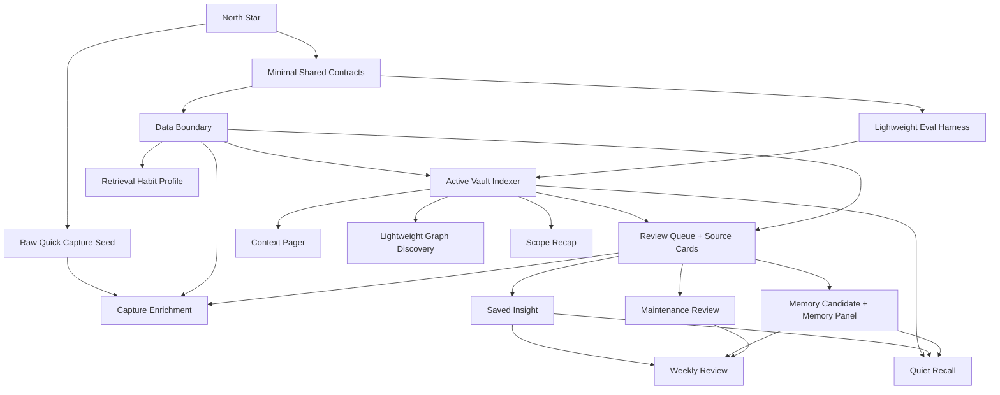

# PA Agent Product Spec Development Plan

Updated: 2026-06-29

## Status

| Field | Value |
| --- | --- |
| Document type | Development execution plan / Codex handoff |
| Source commit | `372294e docs(pa): add product research and planning specs` |
| Scope | PA North Star, Active Vault Indexer, Data Boundary, Eval Harness, Product IA, Pagelet Trust Layer, Maintenance Review, Quick Capture, Weekly Review, Quiet Recall, Saved Insight, Memory governance, M12 Later Layers |
| Audience | Codex / Claude Code / implementation agents |
| Current state | Slices 0-G, A2, and M12 are implemented and tracked; no runtime gate remains open in this product-spec plan |

This plan converts the product design documents from commit `372294e` into a
coherent implementation sequence. It is intentionally fine-grained so an agent
cannot claim "done" after adding shallow stubs or generic UI.

## 0. Non-negotiable Product Standard

Every implementation task must start by reading:

- [PA Product North Star](./pa-product-north-star.md)
- the relevant product spec(s)
- the current code around the target files
- this development plan

North Star:

> Capture should be light. Review should be natural. Connections should have
> evidence. Maintenance should be reversible. Action should be earned.

When a technical shortcut conflicts with this standard, choose the North Star
unless the user explicitly approves a different tradeoff.

## 1. Execution Protocol For Codex

### 1.1 Work In Small Branch-sized Slices

Do not ask an agent to implement this whole plan in one run. Assign one task ID
or one tightly bounded group at a time.

Recommended execution prompt:

```text
Implement TASK <ID> from docs/pa-agent-product-spec-development-plan.md.
Read the referenced specs and code first. Update the tracker section for the
task, add tests, run the required validation, and stop after the task is done.
Do not opportunistically implement later tasks.
```

If the task does not yet name concrete validation commands, first complete the
M0 code/test map entry for that task and add the exact commands to the tracker.
Do not invent fake precision before reading the current code.

### 1.2 Definition Of Done For Every Task

Each task is done only when all required items are true:

- Relevant product spec decision IDs are referenced in code comments, tests, or
  docs where useful.
- Runtime code is implemented, not only types or placeholders, unless the task
  explicitly says "types only".
- At least one focused test proves the new contract.
- The task has explicit `Acceptance`, `Validation`, and tracker evidence. If
  this document only gives high-level tests, the implementing agent must add
  exact commands to the tracker before editing runtime code.
- If UI changes are visible, the task includes DOM/component tests and an
  Obsidian smoke note in the validation log.
- User-facing copy avoids internal jargon such as VSS, RAG, GraphRAG, chunks,
  embeddings, OPFS, or backend.
- Data Boundary, sourceRefs, and no-hidden-write rules are checked when the
  task touches retrieval, memory, provider calls, or vault writes.
- `git diff --check` passes.
- The tracker records the exact commands run, their result, and any intentionally
  skipped validation with residual risk.

### 1.3 Anti-laziness Rules

An implementation is not acceptable if it:

- adds enum/type definitions without any real caller or tests
- creates a UI shell with static mock data and calls the feature complete
- stores raw note excerpts in replay/audit state
- bypasses Pagelet Review Queue with a per-feature hidden queue
- confirms Memory directly from Chat without a review path
- adds maintenance apply behavior without preview, target confinement, and undo
- introduces "project" as a required primitive
- uses provider calls in deterministic eval fixtures
- broadens scope silently when evidence is weak
- claims Obsidian validation without `make deploy` and observed app/test-vault evidence
- persists full provider output, raw note excerpts, prompt chunks, or private
  skipped-source titles in queue/replay/context state
- performs provider-backed broad/sensitive scans before showing disclosure or a
  sources-to-check plan
- expands Maintenance apply beyond the explicit action allowlist for the task

### 1.4 Validation Ladder

Use the smallest validation that proves the slice, then broaden when a slice
touches shared runtime.

| Change type | Required validation |
| --- | --- |
| Docs only | `git diff --check` |
| Pure data model / helper | focused Jest for helper + `git diff --check` |
| Pagelet UI/runtime | focused Pagelet Jest + `npm run lint` + `npm run build`; Obsidian smoke when visible |
| Memory/VSS/retrieval | focused `memory-manager`, `vss`, affected PA runtime tests + `npm run lint` + `npm run build` |
| Write/action behavior | write-action tests + affected Pagelet/Maintenance tests + Obsidian smoke |
| Broad shared behavior | `npm test -- --runInBand`, `npm run lint`, `npm run build`, `git diff --check` |

For UI/DOM tasks, include the community-source scan from `AGENTS.md`:

```bash
rg -n "createElement\\([\"']style[\"']\\)|\\.innerHTML\\s*=|\\.outerHTML\\s*=" src
```

Exit code 1 with no output is a pass for this scan.

### 1.5 SDD Phase Governance

This plan is an SDD track, not only a task list. The tracker created by M0.1 is
the execution record for status, review, validation, smoke evidence, risk
disposition, and decision amendments.

Use these status markers in the tracker:

| Mark | Meaning |
| --- | --- |
| `[ ]` | Todo |
| `[D]` | Drafting / mapping |
| `[R]` | Ready for review |
| `[A]` | Approved for implementation |
| `[~]` | Implementing |
| `[V]` | Review in progress |
| `[S]` | Obsidian smoke in progress |
| `[x]` | Done |
| `[!]` | Blocked |
| `[T]` | Triggered backlog only |

A task or slice may move to `[R]` only when all of these are true:

- relevant product specs and this plan have been checked for drift
- current implementation file references have been re-grepped or recorded in
  the M0.2 code map
- implementation boundaries, non-goals, fallback behavior, and expected
  code/test areas are listed
- acceptance covers product behavior, runtime behavior, negative assertions, and
  verification commands
- risks have an owner and closure condition

A runtime task or slice may move to `[A]` only after review records:

- reviewer, date, and result
- blocking findings and disposition
- deferred items with owner, reason, and unblock condition
- exact validation commands required for implementation

Runtime implementation must not begin while the owning task or slice is `[D]`,
`[R]`, `[V]`, or `[!]`. Docs-only M0 tasks may run before runtime approval, but
their validation and skip reasons still go into the tracker.

Every implementation slice follows this loop:

```text
spec/map -> review -> dev -> test -> review -> fix -> make deploy -> Obsidian smoke -> fix -> done
```

Loop rules:

- Use subagent review for runtime/UI/data-boundary/write phases when available.
  If skipped, record the reason and residual risk.
- Fix P2/P1/P0 review findings before marking a slice done, unless explicitly
  deferred with owner, reason, and unblock condition.
- Runtime/UI phases require automated tests, `make deploy`, and real test-vault
  smoke before completion.
- Docs-only phases may skip Obsidian smoke, but the skip and residual risk must
  be recorded.
- Status changes must update the tracker status table, phase ledger, review log,
  verification log, risk table, and open decisions together.

### 1.6 Spec Drift And Amendments

If implementation reveals that a spec, this plan, or the current codebase cannot
all be satisfied at once, stop before changing runtime semantics.

Record an amendment in the tracker when a task changes:

- product meaning or user-visible default behavior
- Data Boundary, provider disclosure, persistence, Memory, or vault-write rules
- Quick Capture destination semantics
- Pagelet Bubble/Panel/Tab ownership
- Maintenance action scope or autonomy
- external-action, telemetry, or Retrieval Habit Profile behavior

Amendments that affect product semantics, privacy, provider cost, source-note
mutation, or autonomy require explicit user approval before runtime code changes.
Small implementation-local deviations may proceed only after the tracker records
why they do not change the product contract.

## 2. Dependency Map



Implementation principle:

> Capture first, then contracts/eval as thin guardrails, then one product loop
> at a time.

The first coherent vertical slice should be:

```text
M0 SDD tracker + code/test map + feature flags + decision ledger + smoke matrix
-> M7.1-M7.3 Raw Quick Capture
-> exact-text save tests + target-path tests + no-AI-blocking test
-> tracker validation log
```

The next substrate slice should be thin and producer-driven:

```text
minimal shared contracts
-> lightweight eval runner
-> Data Boundary adapters
-> Pagelet-first Active Vault Indexer retrieval outcome
-> Review Queue as decision queue, not provider job queue
```

## 3. Milestone Overview

| Milestone | Outcome | Why it is first/next |
| --- | --- | --- |
| M0 Planning Discipline | Tracker, task gates, current code map | Prevents broad, vague implementation |
| M7 Quick Capture Seed | M7.1-M7.3 raw capture command, destination, feedback | First user-value slice; proves PA lowers capture friction before intelligence |
| M1 Shared Product Contracts | Minimal, producer-driven types for sourceRefs, retrieval outcomes, active queue items, memory lifecycle, data boundary | Prevents each feature from inventing its own model without defining unused universe |
| M2 Eval Harness V1 | Thin deterministic fixture runner and first synthetic vault | Lets later tasks prove product boundaries without building a fake benchmark platform |
| M3 Data Boundary V1 | Exclusions, generated-note policy, provider disclosure primitives, cleanup groups | Required before retrieval/memory/provider work |
| M4 Active Vault Indexer V1 | Pagelet-first Source/Semantic/Structure/Activity lanes over existing VSS and vault structure | Shared evidence substrate without rewriting VSS/Chat early |
| M5 Review Queue + Source Cards | Pagelet-owned typed review surface | Main decision buffer for PA |
| M6 Context Pager V1 | Compact used/skipped context transparency | Makes retrieval/memory decisions visible |
| M7 Quick Capture Enrichment | Optional durable AI enrichment routed to Review Queue | Adds intelligence after raw capture already works without turning lightweight suggestions into review debt |
| M8 Saved Insight + Memory Candidate V1 | Insight ledger, candidate admission, Memory lifecycle shell | Trust layer starts compounding knowledge |
| M9 Maintenance Review V1 | Manual scan, proposals, preview-only cards | Gives PA a safe "hand" inside the vault |
| M10 Weekly Review V1 | Manual weekly loop combining review/memory/maintenance | Product compounding loop |
| M11 Quiet Recall V1 | Low-frequency evidence-backed recall | Makes old thoughts return naturally |
| M12 Later Layers | Retrieval Habit Profile, graph discovery, scope recap | Valuable after substrate and review loop work |

## 4. M0 Planning Discipline

### TASK M0.1 Create Implementation Tracker

Goal: Add a living tracker for this plan.

Files:

- add `docs/pa-agent-product-spec-development-tracker.md`
- update `docs/index.md`

Steps:

- Create sections for each milestone in this plan.
- Add columns: Task ID, spec refs, status, owner/agent, branch/commit,
  validation command, smoke evidence, review disposition, risks, notes.
- Mark all tasks `Not started`.
- Add status legend using this plan's SDD markers.
- Add a "Current Status" section.
- Add a "SPEC / Slice Index" section for Slice 0 and Slices A-G.
- Add a "Phase Ledger" section with spec review, dev, test, code review,
  deploy, smoke, and fix/disposition columns.
- Add "Review Log", "Verification Log", "Risk Table", "Open Decisions",
  "Product Decision Ledger", "Deferred Items / TODO", and "Validation log"
  sections.

Acceptance:

- Tracker links back to this plan and Product North Star.
- Tracker contains every task ID and release slice from this document.
- Tracker records that runtime work cannot start until the owning task or slice
  is `[A] Approved for implementation`.
- Tracker has explicit places to record review findings, deferred items, smoke
  evidence, risk ownership, and spec amendments.
- `docs/index.md` links both plan and tracker.
- `git diff --check` passes.

### TASK M0.2 Codebase Map Before Runtime Work

Goal: Document where implementation will attach.

Files:

- update tracker only

Steps:

- Inspect `src/plugin.ts`, `src/pagelet/*`, `src/vss.ts`, `src/vss/*`,
  `src/memory-manager.ts`, `src/ai-services/context/*`,
  `src/ai-services/write-action-framework/*`, and current tests.
- Record current extension points for retrieval, Pagelet UI, Memory, settings,
  provider calls, and write actions.
- Identify exact test files and exact focused commands to extend/run for M1-M7.
- Record current paths for `getVSSFiles`, Pagelet scope filtering,
  `MemorySearchTool`, Pagelet host methods, Bubble nudge coordination, and write
  action framework support.

Acceptance:

- Tracker includes a "Codebase map" table with file/module, current role,
  planned use, and risks.
- Tracker includes a "Test command map" table with task range, likely test file,
  command, and when to broaden to lint/build/smoke.
- No runtime files changed.
- `git diff --check` passes.

### TASK M0.3 Feature Flag And Settings Policy

Goal: Decide how future PA product features stay disabled until ready.

Files:

- update tracker
- optionally update settings docs only

Steps:

- Identify existing settings patterns in `src/settings.ts` and Pagelet settings.
- Decide feature flag names for Review Queue, Context Pager, Quick Capture,
  Maintenance Review, Weekly Review, and Retrieval Habit Profile.
- Do not implement flags yet unless the task is explicitly expanded.
- Record which flags are shipped disabled by default and which are internal-only
  until the related runtime slice is ready.

Acceptance:

- Tracker records flag names, defaults, and rollout order.
- Defaults preserve current shipped behavior.
- Quick Capture raw-save may be enabled before AI enrichment; AI enrichment,
  Review Queue, Maintenance apply, Weekly prepared review, Quiet Recall Bubble
  nudges, and Retrieval Habit Profile stay disabled until their tasks complete.

### TASK M0.4 Product Decision Ledger

Goal: Preserve the product decisions from this research/design round so later
agents do not accidentally reopen or reverse them.

Files:

- update tracker only

Steps:

- Add a Product Decision Ledger table with decision id, decision, rationale,
  affected specs/tasks, and amendment rule.
- Record at least these decisions:
  - PA's north star is quieter thinking infrastructure, not a more proactive
    ChatGPT clone.
  - Do not introduce `Project` as a required primitive for Obsidian vaults.
  - Quick Capture is a PA-level capture command/service; raw text saves first,
    AI enrichment is later and visually separated.
  - Maintenance is a global vault-care capability surfaced through Pagelet
    review surfaces; manual trigger first, weekly auto scan later.
  - Evidence Cards and Memory Cards may share a card family, but item type and
    lifecycle stay explicit.
  - Bubble is only for lightweight count/nudge/route; Panel and Tab own evidence,
    decisions, and batch review.
  - Scope answers "where this applies"; action type answers "what PA may do".
    Autonomy decisions must consider both.
  - Default relevance sorting favors current context; a small far-association
    bonus is allowed but must not dominate.
  - External actions are out of scope; vault actions are review-first and earned
    through explicit allowlists.
  - User confirmation should be minimized for low-risk review actions, but
    source-note mutation, broad/sensitive provider scans, and new autonomy still
    require explicit gates.

Acceptance:

- Each decision has an affected task or stop point.
- Decisions that require future user approval point to the Stop Points section.
- No runtime files changed.

### TASK M0.5 Slice Smoke Matrix

Goal: Define what real behavior must be observed before each slice is marked
done.

Files:

- update tracker only

Steps:

- Add a Smoke Matrix with slice, user action, expected visible behavior,
  automated checks, Obsidian smoke requirement, cleanup, and skip rule.
- Cover at least:
  - Slice 0: command palette Quick Capture, exact original text saved to Daily
    Note/Inbox/current-file policy, empty input writes nothing, no AI call, no
    Pagelet auto-open, test-vault cleanup recorded.
  - Slice A: Pagelet-first retrieval outcome, excluded/generated sources denied,
    no Chat adoption claimed unless explicitly implemented.
  - Slice B: Bubble only routes/counts, Panel current-scope cards, Tab global
    filters, no raw provider output persisted.
  - Slice C: capture enrichment failure does not block raw save, durable
    suggestions go to Review Queue, lightweight title/tag/related/expansion
    previews require an explicit Keep UI before they create review work.
  - Slice E: Maintenance manual scan creates preview-only proposals; M9.6B
    applies only the one approved action family and proves undo/recovery.

Acceptance:

- Every visible runtime/UI slice has a smoke entry before implementation starts.
- Docs-only or provider-free skip reasons are explicit.
- Cleanup after test-vault writes is tracked.

### TASK M0.6 Slice 0 Runtime Approval Gate

Goal: Resolve the few Quick Capture decisions that would otherwise block
runtime work.

Files:

- update tracker only

Steps:

- Record Slice 0 runtime defaults in the Open Decisions table before M7.1 starts.
- Use these defaults unless the user explicitly changes them:
  - command name: `PA: Quick Capture`
  - raw Daily Note format: append a timestamped bullet or compact callout that
    preserves the exact original text
  - Inbox destination: append to a rolling inbox note, not one file per capture
  - current-file destination: disabled until explicitly selected in settings
  - saved feedback: short saved confirmation only; mention queued suggestions
    only when AI post-processing is enabled
  - Slice 0 writes no Markdown tasks, no frontmatter, no title/tag metadata, and
    no generated expansion
- Record the exact M7.1-M7.3 validation commands from the M0.2 test command map.
- Move Slice 0 to `[R] Ready for review`, run review, and only then mark it
  `[A] Approved for implementation`.

Acceptance:

- Tracker has a Slice 0 approval row with defaults, non-goals, validation
  commands, smoke entry, reviewer, and result.
- Any deviation from the defaults is recorded as an amendment before runtime
  code changes.
- No runtime files changed.

## 5. M1 Shared Product Contracts

Recommended location: create a shared product-contract module only after
checking existing import boundaries. Suggested path:

```text
src/pa/contracts/
```

If the repo has a better established shared location, use it, but do not scatter
canonical enums across Pagelet, Memory, and Chat.

Contract module constraints:

- pure TypeScript/zod-style validation only; no imports from `obsidian`, React,
  VSS, Pagelet runtime, or provider SDKs
- runtime modules adapt to contracts at their boundary; do not rename existing
  `ChatAgentSource`/`SourceRecord`-style types in place during M1
- VSS core must not import PA product contracts
- queue item types are split into `reservedCanonicalTypes` and
  `activeProducerTypes`; stores only accept active producer payload validators
  until a real producer exists

### TASK M1.1 Review Queue Type Contract

Spec refs:

- [Product IA](./pa-product-information-architecture-spec.md)
- [Pagelet Trust Layer](./pagelet-trust-layer-product-spec.md)

Goal: Add canonical Review Queue item types and shared fields.

Implementation:

- Define reserved canonical queue item type union:
  `evidence_insight`, `memory_candidate`, `memory_conflict`,
  `maintenance_proposal`, `capture_enrichment`, `task_suggestion`,
  `recall_suggestion`, `related_note`, `theme_chain`, `conflict_pair`,
  `index_note_candidate`, `review_summary`, `broad_scan_plan`, `action_log`.
- Define initial active producer types only for implemented producers. Before
  M7.4/M5 adoption, this may be an empty or tiny allowlist.
- Define `ReviewQueueStatus`.
- Define base item fields from Product IA.
- Add runtime validators or type guards consistent with local style.
- Export from one barrel file.

Tests:

- Reserved canonical list contains all canonical types.
- Active producer validator rejects reserved-but-not-active types.
- Reject `scope_state`, `profile_fact`, `insight_candidate`,
  `saved_insight_candidate`.
- Validate required shared fields.

Acceptance:

- No feature module defines a duplicate queue type union.
- Tests fail if a non-canonical type is accepted.
- Queue store tasks cannot persist payloads for reserved-only types.

### TASK M1.2 SourceRef And ReplayRef Contract

Spec refs:

- [Active Vault Indexer](./pa-active-vault-indexer-product-spec.md)
- [Data Boundary](./pa-data-boundary-product-spec.md)

Goal: Split UI source refs from persisted replay source refs.

Implementation:

- Define `UISourceRef` with optional `excerpt`.
- Define `ReplaySourceRef` without raw excerpt text.
- Define `PersistedSourceRef` for queue/cards/replay state; it may contain ids,
  paths, heading/block references, hashes, reason labels, and evidence strength,
  but no note excerpt or full provider output.
- Add helper `toReplaySourceRef(uiRef)` that stores hash/metadata only.
- Add helper to validate a source ref path/heading/block shape.

Tests:

- `toReplaySourceRef` drops `excerpt`.
- replay ref preserves path, heading, block id, content hash, reason, and
  evidence strength.
- replay ref cannot contain raw note text.
- persisted queue/card source refs cannot contain raw note text or full provider
  output.

Acceptance:

- No replay/audit/queue/card data model introduced in this task stores raw
  excerpt text.

### TASK M1.3 RetrievalOutcome Contract

Spec refs:

- [Active Vault Indexer](./pa-active-vault-indexer-product-spec.md)
- [Eval Harness](./pa-eval-harness-product-spec.md)

Goal: Add shared retrieval result states.

Implementation:

- Define statuses such as `evidence_found`, `partial_evidence`,
  `needs_scope`, `conflict`, `no_evidence`, `blocked_by_privacy`.
- Define `RetrievalOutcome` with source refs, skipped refs, reason labels,
  lanes, scope, and data-boundary snapshot id.
- Add helpers for no-answer/conflict checks.

Tests:

- `no_evidence` cannot include answerable source refs.
- `blocked_by_privacy` includes boundary reason.
- conflict outcome requires at least two conflicting refs or conflict metadata.

Acceptance:

- Existing VSS behavior remains unchanged until M4 adoption.

### TASK M1.4 Data Boundary Contract

Spec refs:

- [Data Boundary](./pa-data-boundary-product-spec.md)

Goal: Add shared data-boundary primitives without changing behavior yet.

Implementation:

- Define excluded folder/tag policy.
- Define generated-note policy.
- Define provider disclosure reason union.
- Define cleanup groups.
- Define `DataBoundaryDecision` with `allow`, `deny`, `ask`, and reason.

Tests:

- excluded path denies by default.
- generated path denies under default generated-note policy.
- per-run override is one-run only in the data model.
- cleanup groups separate cache, queue, replay, candidates, confirmed memory,
  and tombstones.

Acceptance:

- This task does not add provider calls or new UI.

### TASK M1.5 Memory Taxonomy And Lifecycle Contract

Spec refs:

- [Memory Type Taxonomy](./pa-memory-type-taxonomy-product-spec.md)
- [Pagelet Trust Layer](./pagelet-trust-layer-product-spec.md)

Goal: Add canonical Confirmed Memory and Memory Candidate types.

Implementation:

- Define memory types: `preference`, `decision`, `project_context`,
  `task_constraint`, `open_question`.
- Define lifecycle states: `candidate`, `active`, `archived`, `stale`,
  `forgotten_tombstone`, `exported`.
- Define sensitivity: `low`, `medium`, `high`.
- Add validators for candidate requirements.

Tests:

- `relationship`, `identity`, `goal`, `habit`, `value`, `health`, `finance`
  are not v1 default memory types.
- forgotten tombstone cannot store raw memory text.
- `task_constraint` is not auto-confirmed.

Acceptance:

- Existing Memory/VSS search is not renamed or broken.

### TASK M1.6 Context Pager Contract

Spec refs:

- [Context Pager](./pa-context-pager-product-spec.md)

Goal: Define the read-only context trace shape.

Implementation:

- Define used sources, used memories, skipped sources, dropped memories,
  skipped scopes, compression summary, and why-dropped reasons.
- Define shared ids: run id, source refs, memory refs, retrieval outcome id.
- Define `PersistedContextTrace`: ids, counts, reason labels, policy snapshot id,
  and hashes only. Do not persist prompt chunks, full compressed context, memory
  text, provider output, raw excerpts, or private skipped-source titles.
- Define a compact summary formatter.

Tests:

- formatter produces compact count summary.
- skipped/dropped reasons are constrained to allowed labels.
- trace model does not expose prompt chunks.
- persisted trace model does not expose private skipped-source names or memory
  text.

Acceptance:

- No UI yet.

### TASK M1.7 Settings Copy Inventory

Goal: Prepare product-language settings labels for future tasks.

Implementation:

- Add no runtime behavior unless necessary.
- Create or update docs/tracker table mapping internal concepts to user copy.

Acceptance:

- User copy avoids VSS/RAG/GraphRAG/embedding/chunk/OPFS in ordinary UI.

## 6. M2 Eval Harness V1

M2 starts as a thin, deterministic contract runner. Do not build Memory,
Maintenance, or provider-backed assertion packs before the matching runtime
producer exists. A small eval runner is useful; a broad benchmark platform before
product code is not.

### TASK M2.1 Eval Fixture Directory And Schema

Spec refs:

- [Eval Harness](./pa-eval-harness-product-spec.md)

Goal: Create repo-local synthetic eval fixture structure.

Files:

- `__fixtures__/pa-eval-vault/`
- `__fixtures__/pa-eval/cases/`
- `src/pa/eval/` or nearest appropriate test-support location

Implementation:

- Add small synthetic vault folders: `inbox`, `projects/pa-agent`, `private`,
  `daily`, `archive`, `pagelet-generated`.
- Add fixture README explaining no real user data.
- Add `EvalCase` schema.

Tests:

- schema accepts a minimal retrieval case.
- schema rejects missing expected assertions.

Acceptance:

- No provider credentials or network calls are required.

### TASK M2.2 Deterministic Eval Runner

Goal: Add a fast local runner for fixture assertions.

Implementation:

- Add runner that loads cases and dispatches deterministic assertion functions.
- Add package script `eval:pa:fast` only when runner exists.
- Runner exits non-zero on failed hard assertion.

Tests:

- passing fixture passes.
- failing fixture fails with readable assertion message.

Acceptance:

- `npm run eval:pa:fast` runs without provider credentials.

### TASK M2.3 SourceRef Assertion Pack

Goal: Protect source evidence contracts.

Implementation:

- Add assertions: `must_include_source`, `must_not_include_source`,
  `source_ref_exists`, `replay_ref_has_no_excerpt`.

Tests:

- private source leakage fixture fails.
- replay excerpt fixture fails.

Acceptance:

- Directly covers Eval matrix rows for Active Vault Indexer and Data Boundary.

### TASK M2.4 Review Queue Assertion Pack

Goal: Protect Product IA queue contracts.

Implementation:

- Add assertions: `queue_type_allowed`, `queue_type_rejected`,
  `queue_required_fields_present`.

Tests:

- canonical type accepted.
- `scope_state` rejected.

### TASK M2.5 Memory Lifecycle Assertion Pack

Goal: Protect Trust Layer and Memory taxonomy.

Timing:

- Defer until M8 Memory Candidate work starts, unless M1.5 already creates a
  pure contract fixture that can be checked without runtime store behavior.

Implementation:

- Add assertions: `memory_candidate_has_source_refs`,
  `candidate_not_confirmed`, `tombstone_has_no_raw_text`,
  `high_sensitivity_not_auto_candidate`.

Tests:

- candidate without sourceRefs fails.
- forgotten tombstone with raw text fails.

### TASK M2.6 Maintenance Action Assertion Pack

Goal: Protect maintenance preview/apply/undo boundaries before action work.

Timing:

- Defer until M9 preview/apply work starts. Do not create fake Maintenance
  runtime fixtures before real proposal/action objects exist.

Implementation:

- Add assertions: `preview_contains_paths`, `hard_delete_forbidden`,
  `apply_selected_only`, `rollback_restores`.

Tests:

- hard delete fixture fails.
- preview without affected path fails.

### TASK M2.7 Eval Harness Documentation And Tracker Update

Goal: Make eval usage unambiguous for future agents.

Implementation:

- Update tracker with eval command and fixture location.
- Update Eval Harness spec only if implementation deviates.

Acceptance:

- New agents can run fast eval from docs.

## 7. M3 Data Boundary V1

### TASK M3.1 Data Boundary Settings Model

Goal: Add settings fields with safe defaults.

Implementation:

- Add excluded folders/tags.
- Add generated-note inclusion policy.
- Add provider disclosure defaults.
- Add local data cleanup group model, no destructive cleanup implementation yet.

Tests:

- defaults exclude generated notes.
- default exclusions include configured private tags/folders only when set.
- migration preserves existing settings.

### TASK M3.2 Boundary Resolver

Goal: Centralize allow/deny/ask decisions.

Implementation:

- Implement resolver for paths, tags, generated-note status, and per-run
  override.
- Add reason labels for UI/eval.

Tests:

- excluded folder denies.
- excluded tag denies.
- generated note denies by default.
- one-run override allows only one evaluation context.

### TASK M3.2A Boundary Resolver Adapters

Goal: Prevent new Data Boundary logic from becoming a paper-only facade.

Implementation:

- Add adapters or call-site integration plans for:
  - `getVSSFiles` source enumeration
  - Pagelet scope filtering
  - Memory search result filtering
  - Memory extraction scheduler/provider-backed candidate paths
  - broad scan source planning
- Keep VSS storage migration out of scope. Existing local index contents may
  remain cached, but denied sources must not be returned or sent to providers.
- Record adapter ownership in the tracker.

Tests:

- excluded source is filtered from Pagelet-related retrieval.
- excluded source is filtered from Chat/Memory search result mapping once that
  path is adopted.
- excluded/generated source event does not start provider-backed extraction.

Validation:

- focused BoundaryResolver tests
- focused tests for each adopted adapter
- `npm run lint`
- `npm run build`

### TASK M3.3 Provider Disclosure Gate Model

Goal: Model when provider disclosure is required.

Implementation:

- Add function that returns disclosure reason for first-use, broad, sensitive,
  costly, Memory preparation, broad Pagelet review, weekly scan, Maintenance
  scan, and excluded override.
- No modal UI yet unless already needed by current Memory flow.

Tests:

- small authorized current-note run does not require repeated heavy disclosure.
- broad weekly scan requires disclosure.

Acceptance:

- Every later provider-backed task must state whether it uses this gate.
- For first-use, broad, sensitive, costly, Memory preparation, broad Pagelet
  review, Maintenance scan, Weekly scan, or excluded override, cancel/adjust
  must not issue a provider call or create a candidate.

### TASK M3.4 Memory Extraction Event Gate

Goal: Enforce Data Boundary before candidate/provider paths.

Implementation:

- Integrate gate into current `MemoryExtractionScheduler` / plugin vault-event
  path.
- Keep local VSS hash verification separate from provider-backed extraction.

Tests:

- excluded path event does not create candidate/provider call.
- generated Pagelet self-write does not create candidate/provider call.
- local hash verification can still occur without extraction.

### TASK M3.5 Data Cleanup UI Skeleton

Goal: Show grouped cleanup options without implementing risky delete-all.

Implementation:

- Add Data & Privacy settings section or extend existing settings carefully.
- Display groups with explanatory copy.
- Implement only safe cache clear paths already supported; disabled placeholders
  must be clearly unavailable.

Tests:

- copy says clearing local index does not delete vault notes.
- confirmed memory cleanup requires explicit confirmation when implemented.

## 8. M4 Active Vault Indexer V1

### TASK M4.0 Retrieval Adapter Map

Goal: Decide how Active Vault Indexer adopts existing retrieval without creating
an unused parallel layer.

Implementation:

- Map current callers: Pagelet host related-note/review paths, Chat
  `MemorySearchTool`, plugin VSS search helpers, and VSS operation queue.
- Define `ActiveVaultIndexerPort` as an adapter boundary, not a replacement for
  VSS public contracts.
- Choose Pagelet related-notes/Panel as the first adoption path.
- Explicitly defer Chat main retrieval adoption unless the task is expanded.

Acceptance:

- Tracker records first caller, deferred callers, and risks.
- M4.1 has a concrete caller to adopt; it is not allowed to be dead code.
- No VSS public contract, operation queue, flush/reconcile, or index storage
  migration is included in M4.0.

### TASK M4.1 AVI Facade Over Existing VSS

Goal: Create a shared retrieval substrate without forking index storage.

Implementation:

- Add an Active Vault Indexer facade/module.
- Wrap existing VSS search results into `RetrievalOutcome`.
- Include Source and Semantic lanes first.
- Adopt the facade in the Pagelet-first caller selected in M4.0.
- Do not change VSS public contracts, exclusive operation queue, flush,
  reconcile, reset, or index storage.
- Do not rewrite Chat main search path in this task.

Tests:

- existing VSS fixture result maps to source refs.
- no evidence result maps to `no_evidence` or `partial_evidence`.
- excluded source is absent when Data Boundary denies it.
- selected Pagelet caller receives `RetrievalOutcome` through the adapter.

### TASK M4.2 Activity Lane

Goal: Add current context signals.

Implementation:

- Include current note, selected notes, recent edits, changed notes, Pagelet
  scope labels.
- These are labels/rerank signals, not truth.

Tests:

- current note receives activity reason.
- activity alone cannot create evidence-found outcome.

Acceptance:

- Activity signals are allowed only as current-context reasons, rerank hints, or
  why-shown text.
- Activity signals cannot change an unsupported result into source-backed
  evidence.
- Denied or generated sources are filtered before activity metadata is attached.

Validation:

- Focused `ActiveVaultIndexer` tests cover current-note/recent-edit labels and
  prove activity-only candidates remain `partial_evidence` or `no_evidence`.
- Data Boundary coverage proves denied sources do not appear in activity
  reasons or replay metadata.

### TASK M4.3 Structure Lane

Goal: Use folder/tag/link/backlink/alias as context.

Implementation:

- Add structure metadata extraction from vault cache.
- Use as rerank/tie-breaker and why-shown, not proof.

Tests:

- folder/tag match can reorder equal-strength candidates.
- weak structure-only candidate cannot outrank strong source-backed evidence.

Acceptance:

- Structure metadata is never treated as proof by itself.
- Folder/tag/link/backlink/alias signals may break ties only when evidence
  strength is otherwise comparable.
- Why-shown copy uses product language and does not expose internal scoring
  jargon.

Validation:

- Focused `ActiveVaultIndexer` tests cover tie-breaking and prove weak
  structure-only matches cannot outrank stronger source-backed evidence.
- UI-facing tests, if a visible surface is touched, prove source cards still show
  source refs before structure reasons.

### TASK M4.4 Retrieval Outcome Statuses

Goal: Make no-answer/partial/conflict explicit.

Implementation:

- Add outcome classifier using evidence strength and conflict metadata.
- Provide statuses for UI and eval.

Tests:

- conflict fixture returns `conflict`.
- no supporting source returns `no_evidence`.
- privacy-blocked query returns `blocked_by_privacy`.

Acceptance:

- Outcome statuses are explicit enough for UI/eval to distinguish supported,
  partial, conflict, no-evidence, and privacy-blocked results.
- Unsupported, conflict, and privacy-blocked results cannot be silently shown as
  ordinary recommendations.
- Existing source refs and Data Boundary decisions remain visible to downstream
  Pagelet callers.

Validation:

- Focused eval and `ActiveVaultIndexer` tests cover supported, partial,
  conflict, no-evidence, and blocked-by-privacy fixtures.
- Pagelet tests, if a visible surface is touched, prove blocked/conflict states
  route to review copy instead of action-ready copy.

### TASK M4.5 Sources-To-Check Plan Model

Goal: Add broad retrieval plan-first object before provider calls.

Implementation:

- Create plan object with included/excluded sources and cost/provider notes.
- No broad retrieval UI yet.

Tests:

- broad scope returns plan instead of immediate provider-backed run.
- excluded scopes are shown as excluded.
- cancel/adjust of the plan performs no provider call and creates no queue item.

Acceptance:

- Broad retrieval starts with a local plan object that lists included/excluded
  source groups, provider/cost disclosure needs, and the user's cancel/adjust
  choice.
- Cancel or adjust is side-effect free: no provider call, queue item, saved
  insight, memory candidate, or replay record.
- Private skipped-source titles or raw excerpts are not persisted in the plan.

Validation:

- Focused Data Boundary and retrieval-plan tests prove cancel/adjust has no
  provider or queue side effects.
- Provider-call mocks prove no model request is made before disclosure and user
  confirmation.

### TASK M4.6 Replay Metadata Without Private Text

Goal: Add replay metadata for retrieval decisions.

Implementation:

- Persist run id, retrieval outcome id, replay source refs, reasons, policy
  snapshot id.
- Do not persist raw excerpts.

Tests:

- replay record has no raw excerpt.
- can re-resolve current excerpt from vault source when allowed.

Acceptance:

- Replay metadata stores ids, source refs, reason codes, policy snapshot ids,
  and hashes only.
- Raw excerpts, full provider output, prompt chunks, private skipped-source
  titles, and generated memory text are never persisted in replay records.
- Re-resolution reads from the current vault source only when the Data Boundary
  still allows that source.

Validation:

- Focused replay tests assert serialized records contain no raw excerpt-like
  fields and can re-resolve allowed current snippets from the vault.
- Data Boundary tests prove denied sources cannot be re-resolved from replay
  metadata.

## 9. M5 Review Queue And Source Cards

Review Queue is a decision queue, not a provider job queue and not a full result
cache. It may persist typed item metadata, status, source/replay refs,
data-boundary snapshot id, and lightweight action state. It must not persist raw
note excerpts, full provider markdown, prompt chunks, or hidden AI output.

### TASK M5.0 Pagelet Queue Integration Boundary

Goal: Add the Pagelet host/routing contract before UI work.

Implementation:

- Extend Pagelet host boundaries with queue read/update methods instead of
  storing queue state directly in `plugin.ts` or Panel internals.
- Define how Bubble routes/soft reminders, Panel focused cards, and Tab batch
  review share source identity and active-file changes.
- Keep Bubble route-only for generated suggestions; only user-kept or snoozed
  items may appear as a lightweight later reminder.
- Preserve existing Pagelet async foreground-run guard; queue producers must not
  start provider work or weaken `beginForegroundReviewRun()` semantics.

Tests:

- active-file changes update current-scope queue routing.
- Bubble route opens the exact Panel/Tab item without rendering full cards in
  Bubble.
- queue integration does not start provider work.

### TASK M5.1 Local Review Queue Store

Goal: Add one shared local queue.

Implementation:

- Store typed queue items locally per vault.
- Support create, list by filter, update status, snooze, dismiss.
- Do not write queue items to Markdown.
- Store only active producer types, metadata, status, persisted source refs,
  data-boundary snapshot id, and local lifecycle state.
- Do not store raw excerpts, full provider output, prompt chunks, or hidden
  rendered markdown.

Tests:

- item persists locally.
- filter by type/scope/status works.
- unknown type rejected.
- reserved-but-inactive type rejected until its producer is implemented.
- persisted item state has no raw note text or full provider output.

### TASK M5.2 Queue Producer API

Goal: Give features one way to create queue items.

Implementation:

- Add API for producers with validation and sourceRefs.
- Add origin surface and data-boundary snapshot fields.
- Producers may enqueue decisions after provider work, but this API does not
  itself run provider calls.
- Provider-backed producers must prove disclosure/plan gate happened before
  calling this API.

Tests:

- producer cannot create source-backed item without sourceRefs when required.
- producer records origin surface.
- cancelled provider-backed plan creates no queue item.

### TASK M5.3 Pagelet Panel Current-scope Queue

Goal: Show queue items relevant to current scope.

Implementation:

- Extend Pagelet Panel to show current-note/current-scope queue items.
- Keep Bubble lightweight; no full queue in Bubble.
- Use Pagelet's scenario-adaptive layout model; do not replace Panel with a
  static global card list.
- Define density variants: Bubble route only, Panel focused cards, Tab filters
  and batch review.

Tests:

- current-scope item appears in Panel.
- unrelated scope does not appear.
- Bubble shows only count/nudge/route, not full queue.
- active-file changes do not show stale current-scope items.

### TASK M5.4 Pagelet Tab Global Queue

Goal: Add global queue view for batch review.

Implementation:

- Add type/status/scope filters.
- Add groups: kept for later, actions to confirm, recently applied, snoozed, stale.

Tests:

- filters work.
- state transitions update visible groups.

### TASK M5.5 Source-backed Card Family

Goal: Standardize evidence cards for queue items.

Implementation:

- Add UI/card model with claim, sourceRefs, why-shown, evidence strength,
  actions.
- Support open source note.
- Rehydrate excerpts at render time through current Data Boundary. Persist only
  source refs and metadata.

Tests:

- source card renders source path/reason.
- unsupported claim displays unsupported state.
- no raw provider output is hidden in card state.
- private/excluded source excerpt is not rehydrated when current policy denies
  it.

### TASK M5.6 Existing Pagelet Suggestions Adopt Queue

Goal: Connect current Pagelet review suggestions to the shared queue.

Implementation:

- Map existing Pagelet suggestions to canonical queue item types where
  appropriate.
- Preserve existing review note save behavior.

Tests:

- current review still works.
- queue item created only for user-kept or action-bearing source-backed suggestion.
- no duplicate queue item on repeated render.

## 10. M6 Context Pager V1

### TASK M6.1 Read-only Context Pager Model Integration

Goal: Build context trace from retrieval/memory decisions.

Implementation:

- Generate compact trace for Chat/Pagelet runs where retrieval outcome exists.
- Include used sources, skipped sources, used memories if available, dropped
  memories if available.
- Persist only `PersistedContextTrace` fields: ids, counts, reason labels,
  policy snapshot id, and hashes. Do not persist raw excerpts, memory text,
  prompt chunks, full compressed context, provider output, or private skipped
  source titles.
- Expanded UI rehydrates current visible details through Data Boundary.

Tests:

- trace counts match actual retrieval outcome.
- prompt chunks are not exposed.
- private skipped content is not stored or displayed.

### TASK M6.2 Pagelet Context Pager UI

Goal: Add expandable compact context trace to Pagelet Panel.

Implementation:

- Collapsed text: "Used N sources, M memories. K skipped."
- Expanded view shows sources and reason labels.

Tests:

- collapsed and expanded states render.
- skipped reason label matches model.

### TASK M6.3 Chat Context Pager Hook

Goal: Add compact used-context trace to Chat results.

Implementation:

- Use existing chat metadata/context used patterns.
- Keep ordinary copy product-friendly.

Tests:

- chat turn metadata includes trace.
- UI does not show internal terms.

### TASK M6.4 Eval Alignment For Context Pager

Goal: Add deterministic check that UI trace matches decisions.

Tests:

- displayed used/skipped counts equal underlying trace.
- wrong count fixture fails.

## 11. M7 Quick Capture V1: Seed First, Enrichment Later

M7 is split deliberately:

- M7.1-M7.3 are the first user-value slice and may run immediately after M0.2
  and M0.3. They save the user's original text without AI.
- M7.4-M7.5 require M3 Data Boundary and M5 Review Queue. AI enrichment must
  never block raw capture.
- Quick Capture is a PA-level capture command/service, not a Pagelet
  Bubble/Panel write path. Pagelet reviews suggestions later.

### TASK M7.1 Raw Quick Capture Command

Goal: Add low-friction capture entry.

Implementation:

- Add command palette command.
- Minimal modal/input writes original user text to chosen destination.
- Default destination follows spec: Daily Note first, with Inbox/current-file
  options later if settings exist.
- Use existing vault write/action patterns for target confinement and stale
  reread when appending to existing files.
- Do not open Pagelet Bubble/Panel by default.
- Do not call an AI provider.

Tests:

- command writes exact original text.
- empty input does not write.
- destination path is correct.
- no AI/provider path is invoked.
- append target remains confined to the selected Daily Note/Inbox/current-file
  policy.

Validation:

- focused command/write tests from M0.2 test map
- `git diff --check`
- `make deploy` + Obsidian test-vault smoke before claiming command UX works

### TASK M7.2 Capture Destination Settings

Goal: Add Daily Note / Inbox / Current File destination policy.

Tests:

- daily note default.
- inbox path setting respected.
- current file appends only when explicitly selected.
- generated-note destination policy is respected.

### TASK M7.3 Capture Feedback

Goal: Show lightweight saved feedback, not a heavy chat response.

Tests:

- success notice/copy appears.
- no AI output blocks saving.
- no forced categorization, tag prompt, or queue panel opens after save.

### TASK M7.4 Async Capture Post-processing

Goal: Add optional AI enrichment after raw capture succeeds.

Prerequisite:

- M3 provider disclosure/plan gate is available.
- M5 Review Queue producer API is available.

Implementation:

- Generate Memory Candidate and task-like suggestions first; keep
  title/tag/related-note/expansion as future preview/Keep flows until a visible
  Keep UI exists.
- Route only durable or user-kept suggestions to Review Queue.
- Keep any future confirmed AI expansion visually separate as a callout.
- If enrichment needs a provider call, disclosure/plan gate must run first for
  first-use, broad, sensitive, costly, or excluded-override cases.
- Enrichment output is not written into the source note unless the user confirms
  a specific write action.

Tests:

- raw capture succeeds even if AI enrichment fails.
- memory/task suggestions are queue-only, not directly applied.
- cancel/adjust of provider disclosure creates no provider call and no queue
  item.
- AI expansion uses callout-style separation if a future preview/Keep UI renders
  or proposes it.

### TASK M7.5 Quick Capture Eval Fixtures

Goal: Add deterministic fixtures.

Tests:

- original text preserved.
- generated suggestions do not overwrite source.
- task suggestion does not create Markdown task without confirmation.

## 12. M8 Saved Insight And Memory Candidate V1

### TASK M8.1 Saved Insight Local Object

Goal: Add source-backed insight object.

Implementation:

- Local store with type, origin, sourceRefs, confidence, savedAt, lifecycle.
- User-authored insight may have empty sourceRefs and marked user-authored.

Tests:

- PA-generated insight requires sourceRefs.
- user-authored insight can be unsourced but is marked.

### TASK M8.2 Insight Ledger Pagelet View

Goal: Show Saved Insights as Pagelet Tab filter/view.

Tests:

- insight list filters by type/status/scope.
- archive/restore works locally.

### TASK M8.3 Memory Candidate Admission

Goal: Add candidate review path through Pagelet queue.

Implementation:

- Create `memory_candidate` queue items using M1 memory taxonomy.
- Confirmation routes to local Confirmed Memory store or existing memory
  governance path selected during code map.

Tests:

- candidate requires sourceRefs/type/scope/sensitivity.
- candidate is not Confirmed Memory until user confirms.

### TASK M8.4 Memory Panel Governance Shell

Goal: Add independent Memory governance surface.

Implementation:

- Show active, archived, stale, forgotten tombstones.
- Support archive/forget/export UI only when backend exists.
- Add lifecycle matrix before wiring UI actions:
  - archive keeps memory content locally but prevents automatic use
  - forget removes memory text from active/archive stores and local index/cache
    references where applicable, leaving only a text-free tombstone
  - export requires explicit vault-write confirmation and sourceRefs/generated
    note policy
- Export does not imply keep/archive/forget; user chooses lifecycle separately.

Tests:

- forget removes memory content and leaves text-free tombstone.
- archive keeps content but prevents automatic use.
- export path requires explicit confirmation and does not silently keep memory
  active.

### TASK M8.5 Context Firewall V1

Goal: Gate memory inclusion by scope, sensitivity, stale/conflict state.

Tests:

- low-risk in-scope memory auto-includes.
- stale or conflicting memory asks/drops.
- high-sensitivity memory is not auto-used.

## 13. M9 Maintenance Review V1

### TASK M9.1 Maintenance Proposal Model

Goal: Define proposals before scanning.

Implementation:

- Types: rename, move, archive, add/remove link, frontmatter/status, minor
  patch, merge, index note, delete candidate.
- Include action type, scope, sourceRefs, confidence, preview, undo metadata.

Tests:

- permanent delete forbidden.
- merge defaults to create new note, not overwrite.

### TASK M9.2 Manual Scan Shell

Goal: Add manual Pagelet Tab entry for Maintenance Review.

Implementation:

- User manually triggers scan.
- No auto-apply.
- Show categories with counts.

Tests:

- manual scan creates proposal queue items.
- weekly auto scan not enabled yet.

### TASK M9.3 First Scan Category: Inbox / Unsorted

Goal: Implement one useful scan category end-to-end.

Implementation:

- Detect notes in configured inbox/unsorted folder.
- Propose title/move/archive/link/status suggestions.

Tests:

- notes outside scope are ignored.
- proposals include source reason and affected path.

### TASK M9.4 Title Quality Scan

Goal: Add weak-title proposal generation.

Tests:

- untitled/low-quality title detected.
- rename proposal includes old/new title and undo metadata.

### TASK M9.5 Orphan / Weak Link Scan

Goal: Add link suggestion proposals.

Tests:

- orphan note detected.
- link proposal includes source and target.
- no source note modified.

M9.6 is intentionally split. Do not assign "apply selected actions" as one broad
task.

### TASK M9.6A Write Action Boundary Expansion And Security Review

Goal: Decide the exact Maintenance apply boundary before mutating source notes.

Implementation:

- Define explicit allowlist for the first executable action. Prefer one narrow
  action such as archive/move within configured folder or add/remove link only
  after review.
- Keep merge, content patch, frontmatter/status changes, delete candidate, and
  multi-file actions out of the first allowlist unless separately approved.
- Define close/cancel abort behavior, multi-file confirmation, prompt-injection
  handling, stale reread, action log, rollback, and test-vault cleanup evidence.
- Update tracker with the selected action and deferred actions.

Acceptance:

- No source-note mutation task can proceed without this boundary recorded.
- The first apply task has exactly one action family in scope.
- Security/prompt-injection notes are recorded in the tracker.

### TASK M9.6B Apply One Whitelisted Low-risk Action

Goal: Implement the single allowlisted action from M9.6A.

Prerequisite:

- M9.1-M9.5 complete.
- M9.6A action boundary expansion/security review complete.
- User has approved the first action allowlist for implementation.

Implementation:

- Apply selected only.
- Use preview, target confinement, stale reread, audit/recovery.
- Keep hard delete unavailable.
- Abort cleanly on close/cancel.
- Do not execute multi-file actions without explicit multi-file confirmation.

Tests:

- unselected action not applied.
- stale reread blocks changed target.
- undo/recovery works for supported action.
- close/cancel applies nothing.
- prompt-injection content in source note cannot expand the selected action.

Validation:

- write-action focused tests
- affected Maintenance/Pagelet tests
- `npm run lint`
- `npm run build`
- `make deploy` + Obsidian test-vault smoke before claiming app behavior works

### TASK M9.7 Maintenance Eval Fixtures

Goal: Add deterministic action fixtures.

Tests:

- preview contains affected path/diff.
- apply selected only.
- rollback restores.

## 14. M10 Weekly Review V1

### TASK M10.1 Manual Weekly Review Shell

Goal: Add Pagelet Tab mode for Weekly Review.

Implementation:

- Manual trigger.
- Default range recent 7 days.
- Show sections as placeholders/counts from queue/retrieval.

Tests:

- date range calculation stable.
- empty sections are restrained, not noisy.

### TASK M10.2 Review Sections

Goal: Populate sections from existing systems.

Sections:

- noteworthy notes
- saved insights
- memory candidates/conflicts
- maintenance proposals
- quiet recall candidates

Tests:

- section only shows source-backed items.
- unconfirmed/dismissed items excluded from summary note.

### TASK M10.3 Weekly Review Note

Goal: Write accepted-only Markdown artifact.

Implementation:

- User confirmation required.
- Include sourceRefs and generatedAt.
- Do not dump whole queue.
- Use generated-note Data Boundary policy.
- Keep the default Weekly Review Tab as a digest; render item selection only
  after the user chooses to save material from the review.
- Keep full provider output out of the note unless each section is accepted and
  source-backed.

Tests:

- accepted items included.
- dismissed/unconfirmed items omitted.
- write path respects Data Boundary and generated-note policy.
- test-vault cleanup is recorded after smoke validation.

### TASK M10.4 Weekly Prepared Review

Goal: Optional quiet weekly preparation.

Implementation:

- Manual-first remains default.
- Weekly prepared review is opt-in and creates review queue/digest only.
- No auto-apply.
- Bubble may show only a quiet hint that routes to Pagelet Tab; full weekly
  sections stay out of Bubble.
- Maintenance proposals inside Weekly Review still route through M9 safety
  preview/diff/action-log/undo rules.

Tests:

- opt-in required.
- prepared hint appears through Pagelet, not intrusive modal.
- quiet/off settings suppress prepared hints.
- weekly hint routes to Pagelet Tab and never renders full sections in Bubble.

## 15. M11 Quiet Recall V1

### TASK M11.0 Nudge Arbitration Decision

Goal: Prevent Bubble from becoming noisy when multiple PA systems are ready.

Implementation:

- Decide priority among prepared review, async ready result, weekly review,
  recall, and other Pagelet proactive hints.
- Default to max one top nudge or compact digest.
- Bubble shows at most 2-3 items with why-shown only; evidence/actions remain in
  Panel/Tab.
- Respect frequency, off, and quiet settings.

Acceptance:

- Tracker records the arbitration rule before M11.3 Bubble recall work starts.

### TASK M11.1 Passive Recall Candidate Generation

Goal: Generate low-frequency recall suggestions without Bubble nudges first.

Implementation:

- Use Active Vault Indexer and Saved Insight signals.
- Default ranking: current relevance first, limited far-association bonus.

Tests:

- weak/stale evidence does not produce recall.
- far association cannot outrank explicit current relevance.

### TASK M11.2 Pagelet Recall Panel

Goal: Show recall in Pagelet Panel/Tab before Bubble.

Tests:

- shows source, why-now, next action.
- save as insight routes to Saved Insight.

### TASK M11.3 Bubble Recall Nudge

Goal: Add restrained Bubble nudge.

Implementation:

- Frequency setting enforced.
- Nudge has View, Dismiss, Later.
- No automatic writes.
- Bubble output is route-only and follows M11.0 arbitration.
- View opens the existing Quiet Recall Panel/Tab evidence surface.
- Dismiss suppresses the same candidate; Later snoozes without creating a saved
  insight, memory candidate, or queue item.

Tests:

- frequency cap works.
- dismiss suppresses repeat.

Acceptance:

- Recall Bubble nudges remain disabled unless `quietRecall.bubbleNudgesEnabled`
  is explicitly on and Pagelet proactive hints are allowed.
- Quiet/off settings, cooldowns, and the M11.0 max-one nudge rule suppress
  recall Bubble output.
- Bubble copy contains only a short why-now/route hint. Sources, evidence,
  save/apply actions, and generated review content remain in Panel/Tab.
- View, Dismiss, and Later are reversible local UI state transitions with no
  automatic vault or Memory writes.

Validation:

- Quiet Recall and Bubble tests cover disabled default, explicit enablement,
  quiet/off suppression, frequency cap, dismiss repeat suppression, and Later
  snooze.
- Pagelet smoke is required before closing M11.3 because Bubble behavior is a
  visible UI surface.

### TASK M11.4 Recall Feedback Learning

Goal: Feed accept/dismiss/not relevant into retrieval habit profile only when
enabled.

Tests:

- disabled Retrieval Habit Profile receives no signal.
- feedback remains local.
- clear/disable stops both collection and influence.
- excluded scopes do not produce learning signals.
- stored signal is aggregate-only and contains no raw query/path/title.

Acceptance:

- Feedback learning remains off unless the user enables Retrieval Habit Profile
  or accepts a first-use notice that clearly starts local aggregate learning.
- Feedback events may use only aggregate counters/scores and source ids already
  permitted by the Data Boundary.
- Disable or clear stops new collection and removes influence from future
  ranking.
- Feedback cannot write to notes, Memory, Saved Insights, or provider telemetry.

Validation:

- Retrieval Habit Profile tests prove disabled collection receives no signal,
  opt-in collection remains local/aggregate-only, clear/disable stops both
  collection and influence, and denied scopes produce no learning signal.
- Serialization tests assert no raw query, raw path, title, excerpt, prompt, or
  provider output appears in stored profile data.

## 16. M12 Later Layers

These start only after M3-M6 and at least one product loop are stable. M12.1-M12.3
were approved on 2026-06-29 and are now implemented; future later-layer scope
must be added as a new approval gate before runtime work starts.

### TASK M12.1 Retrieval Habit Profile

Goal: Add opt-in weak local retrieval adaptation.

Acceptance:

- disabled by default until explicit opt-in or the user confirms a first-use
  notice that clearly starts local aggregate learning
- no provider calls
- no vault writes
- 90-day rolling aggregate only
- no raw query/path/title/sensitive labels
- clear/disable stops collection and influence
- weak signal cannot cross Data Boundary or evidence strength

Validation:

- `retrieval-habit-profile` tests cover disabled default, opt-in, local-only
  aggregate writes, 90-day rolling retention, clear/disable, Data Boundary
  denial, and evidence-strength ceiling.
- Data serialization tests assert no raw query, path, title, excerpt, prompt,
  provider output, or sensitive labels are stored.
- Ranking tests prove profile signal can only break near-ties and cannot
  override source-backed evidence or denied scopes.

### TASK M12.2 Lightweight Graph Discovery

Goal: Add related_note/theme_chain/conflict_pair/index_note_candidate items.

Acceptance:

- no graph visualization MVP
- sourceRefs required
- `theme_chain` does not become memory directly
- rejected edge remains local
- Graph discovery produces reviewable Pagelet items, not an always-on graph
  management UI.
- Every edge or theme claim carries source refs and an outcome status.
- Rejected or dismissed edges stay local aggregate feedback and do not modify
  notes, links, Memory, or Saved Insights.

Validation:

- Graph discovery tests cover related-note, theme-chain, conflict-pair, and
  index-note-candidate fixtures with source refs.
- Tests prove rejected/dismissed edges do not create vault writes, Memory
  writes, Saved Insight writes, or provider telemetry.
- UI smoke is required only if a visible Pagelet surface is added; a graph
  visualization remains out of scope.

### TASK M12.3 Scope Recap And Theme Summary

Goal: Add on-demand source-backed recap for selected scope.

Acceptance:

- sourceRefs for important claims
- generated recap not source by default
- Markdown write requires confirmation
- Recap is on-demand and scope-bounded; it does not run as a broad background
  scan.
- Important claims include source refs; unsourced generated prose is clearly
  marked as AI-generated helper text and is not admitted as Memory/source.
- Markdown export uses accepted-only content and Write Action Framework
  confirmation.

Validation:

- Scope recap tests cover sourceRefs for claims, excluded/generated source
  filtering, on-demand invocation, and no background scan.
- Write tests prove Markdown export requires confirmation and does not write
  unaccepted or unsourced content.
- Pagelet/Obsidian smoke is required if a visible recap surface or Markdown
  export command is added.

## 17. Suggested Release Slices

| Slice | Includes | User-visible value |
| --- | --- | --- |
| Slice 0: Raw Capture Seed | M0.1-M0.6, M7.1-M7.3 | Users can capture lightly before PA intelligence exists |
| Slice A: Thin Evidence Substrate | minimal M1, thin M2, M3, M4.0-M4.1 Pagelet-first | PA can retrieve with explicit source/privacy contracts without rewriting VSS/Chat |
| Slice B: Review Workbench | M5.0-M5.6, M6 Pagelet-first | Pagelet becomes the place to review source-backed candidates |
| Slice C: Capture Enrichment Loop | M7.4-M7.5 + M5 producers | Captures can produce optional suggestions for later review |
| Slice D: Insight/Memory Loop | M8 + M6 | Saved insights and memory candidates become governable |
| Slice E: Maintenance Hand | M9 preview-only, then M9.6A/B one allowlisted action | PA starts caring for the vault safely |
| Slice F: Weekly Compounding Loop | M10 + M11.0-M11.2 | PA helps old thoughts return and weekly knowledge compounds |
| Slice G: Recall Adaptation | M11.3-M11.4 | Bubble recall and feedback learning improve relevance after core trust exists |
| M12 Later Layers Expansion | M12.1-M12.3 | Done. Habit, graph, and recap layers improve relevance while preserving local, source-backed, confirmed-write boundaries |

## 18. Stop Points Requiring User Decision

Codex must stop and ask before implementing these:

- Any write/action that modifies existing source notes without current Write
  Action Framework coverage.
- Any runtime implementation before the owning task or slice is `[A] Approved
  for implementation`.
- Any Slice 0 runtime work before M0.6 records Quick Capture defaults,
  validation commands, smoke entry, and approval result.
- Any spec drift or amendment affecting product semantics, privacy, provider
  cost, source-note mutation, or autonomy.
- Any Maintenance apply action before M9.6A records an explicit one-action
  allowlist and security boundary.
- Any scoped autonomy beyond review-first proposal generation.
- Any hidden persistence of full provider output, raw note excerpts, prompt
  chunks, memory text, or private skipped-source titles.
- Any provider-backed scan across broad or sensitive scopes without disclosure.
- Any provider-backed task where cancel/adjust still sends a provider call or
  creates a queue candidate.
- Any Memory type outside v1 taxonomy.
- Any user-facing graph visualization.
- Any external action outside the vault.
- Any telemetry beyond local or explicit opt-in aggregate usage.
- Any future M12-adjacent scope beyond the completed M12.1-M12.3 boundary before
  it has full Acceptance, Validation, approval, and tracker evidence.

## 19. Final Handoff Checklist

Before handing a task back, Codex must report:

- task ID(s) completed
- SDD status before and after the task
- specs read
- files changed
- tests run
- validation evidence
- review findings and disposition when the task reaches a review gate
- known residual risks
- whether Obsidian app smoke was run or intentionally not run
- tracker sections updated, including phase ledger, review log, verification
  log, risk table, open decisions, and deferred items when applicable
- whether follow-up SDD/tracker items were added

Do not accept "implemented per spec" without this evidence.
