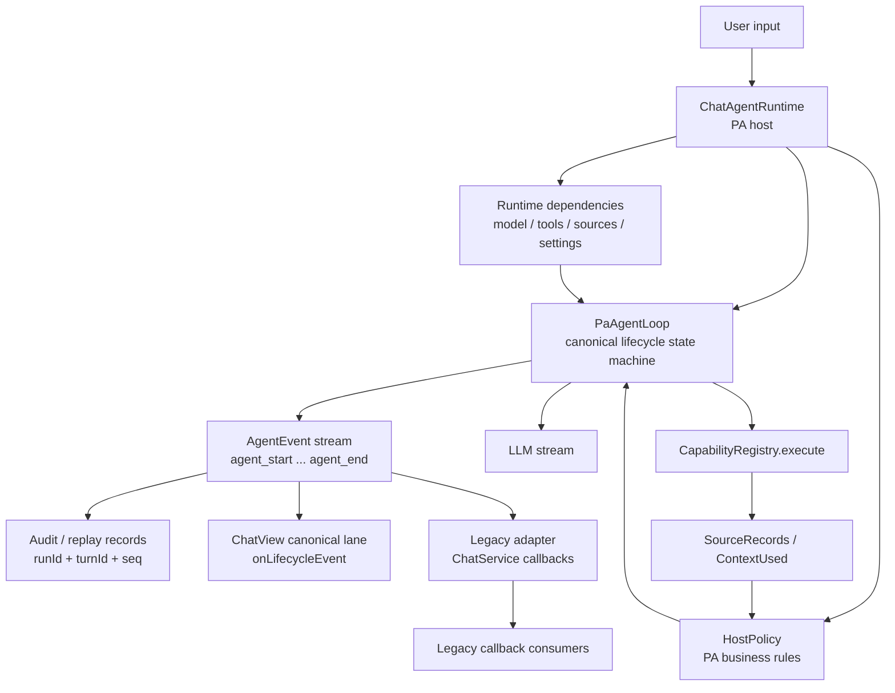
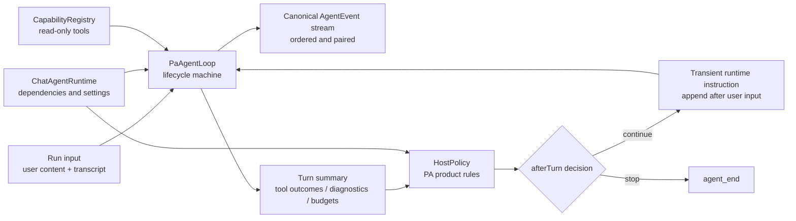
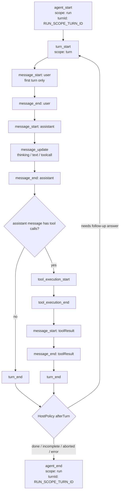
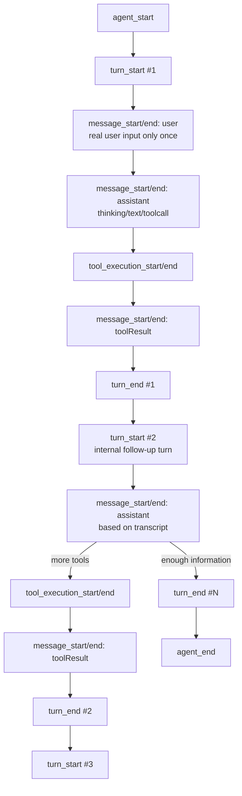
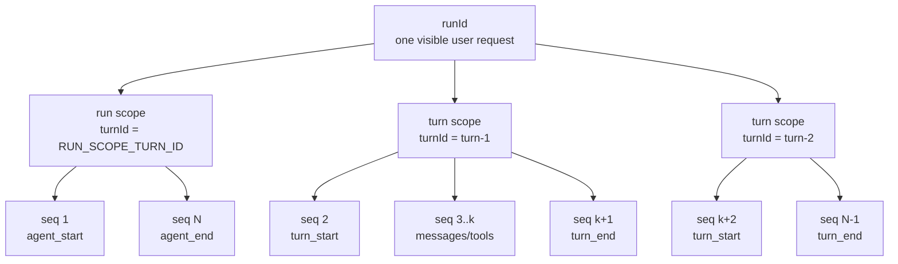
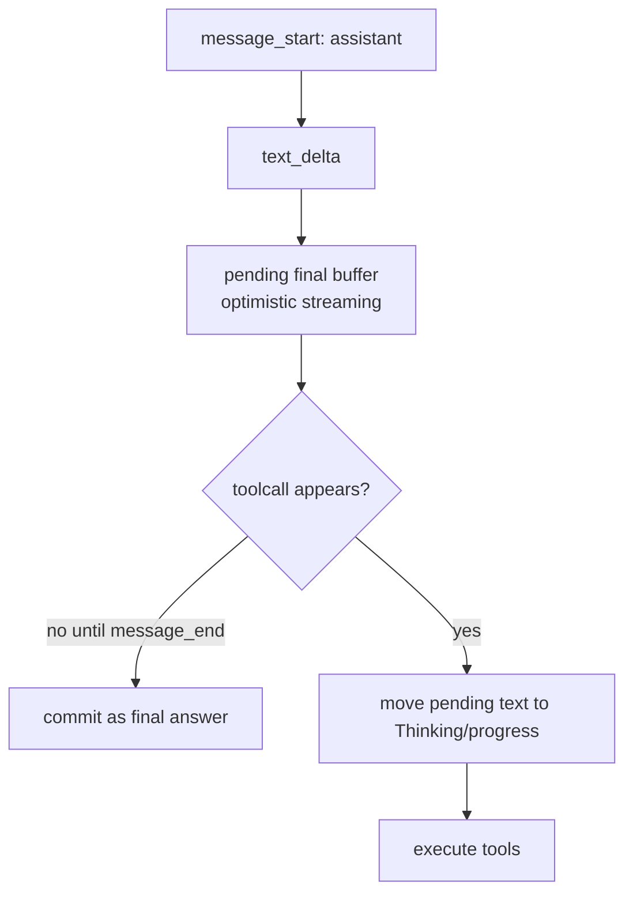
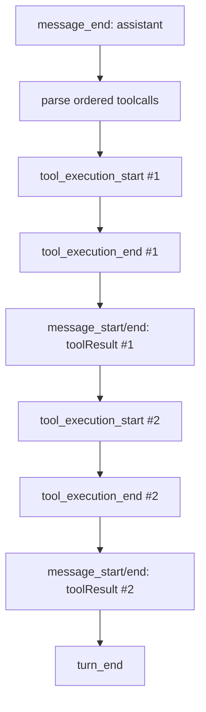

# PA Agent Runtime Lifecycle Plan

## Status And Source Of Truth

| Field | Value |
| --- | --- |
| Status | Implemented and closeout-verified canonical lifecycle refactor plan |
| Last revised | 2026-05-24 |
| Development tracker | [PA Agent Runtime Lifecycle Development Tracker](./pa-agent-runtime-lifecycle-development-tracker.md) |
| Current baseline | [PA Agent Runtime Lifecycle Baseline](./pa-agent-runtime-lifecycle-baseline.md) |
| Parent plan | [PA Agent Architecture Plan](./pa-agent-architecture-plan.md) |
| Reference implementation | [pi agent package](https://github.com/earendil-works/pi/tree/main/packages/agent) |

This document defines the PA Agent runtime lifecycle refactor. It supersedes the pre-refactor PA answer-stream loop design for runtime work. The linked tracker remains the source of truth for implementation evidence; as of 2026-05-24, SPEC-01 through SPEC-08 are complete and closeout smoke evidence is recorded.

The intent is not a minimal patch. The target runtime should use a canonical agent lifecycle event model similar to pi: agent, turn, message, tool execution, tool result, turn end, and agent end. Legacy PA events remain only as adapter output for compatibility.

## Goals

- Treat model thinking/reasoning as normal streaming progress, not as a stuck state.
- Make Memory, current-note context, and WebSearch phases observable and smoke-testable.
- Use canonical lifecycle events as the PA runtime source of truth.
- Make every canonical lifecycle event auditable through mandatory run and turn identity.
- Keep event identity uniform across run, turn, message progress, tool progress, and terminal events.
- Keep `ChatService.streamLLM(...)` usable during migration through an adapter.
- Preserve PA v1 safety boundaries: read-only vault tools, bounded network-read WebSearch, source-boundary metadata, cancellation, and no note mutation.
- Keep stable prompt prefixes cache-friendly by avoiding dynamic system prompt rewrites.

## Non-Goals

- Do not add write actions, shell execution, local MCP, or arbitrary endpoint execution.
- Do not expose provider reasoning content in final answers or citations.
- Do not require full pi feature parity such as parallel tools, steering queues, or follow-up queues in the first refactor.
- Do not remove the non-PA rollback path until automated and Obsidian smoke gates pass.
- Do not support provider built-in web search fallback. PA WebSearch uses only the builtin WebSearch tool.

## Confirmed Decisions Snapshot

These decisions are settled for this refactor and should not be reopened by implementation-local convenience:

- Use one canonical lifecycle event type: `AgentEvent`. The legacy shape is `LegacyAgentEvent`; `version: 2` is only a schema version.
- Every canonical event carries raw `runId` and `turnId` fields directly on the event record. The pair is the common audit/query id marker for all lifecycle events.
- `seq` is mandatory for locating one exact event record inside the `runId + turnId` audit scope. The unique event record key is `runId + turnId + seq`.
- There are no identity-free progress events. `message_update`, `tool_execution_update`, `turn_end`, and `agent_end` use the same identity fields as start events.
- `seq` is gapless and monotonic for the whole run. It does not reset per turn.
- A run is one visible user request. A turn is one internal model-decision loop inside that run.
- The user message is emitted once in the first turn. Follow-up turns reuse the transcript and runtime instructions without re-emitting the user message.
- Thinking, provider reasoning, assistant text that later accompanies tool calls, and toolcall deltas are progress. UI may show them in Thinking/Details; they are not committed final answer text.
- Tool execution happens only after `message_end: assistant`, and every tool outcome produces paired tool execution events plus a structured `toolResult` message.
- `HostPolicy` owns required/suggested capability decisions, runtime instructions, unavailable notes, corrective turns, warnings, and budget stop explanations. `PaAgentLoop` owns lifecycle ordering and hard cleanup.
- Dynamic runtime instructions are appended after the user input in a user-adjacent envelope. They are not injected by mutating the stable system prompt.
- Missing required capability warnings are UI metadata, not answer-body text.
- Web search is builtin-tool only. Provider built-in web search fallback is removed from runtime, settings, UI, tests, and source reconstruction.
- Canonical host-tool execution tolerates benign `search_memory` argument drift after the model explicitly selects the Memory tool. Query aliases normalize to `{ query }`; if arguments are missing or empty, the original user request may be used as the read-only Memory query.
- Run-level budgets are `maxTurns = 20`, `maxToolCalls = 30`, `maxWallClockMs = 180000`, and `maxObservationChars = 24000`.

## Architecture Shape

`PaAgentLoop` is the canonical lifecycle state machine. `ChatAgentRuntime` is the PA host that provides dependencies and policy. Host policy decides PA-specific continuation, capability requirements, budget behavior, and warnings after each turn.



`PaAgentLoop` owns lifecycle correctness. `HostPolicy` owns PA business decisions. They may live in the same module during implementation, but they must remain separate responsibilities.

PA-aware UI consumes the canonical `onLifecycleEvent` lane directly. The legacy adapter exists for callback compatibility and for consumers that have not migrated to canonical lifecycle events. During a live canonical ChatView turn, legacy callbacks are compatibility output only and must not drive duplicate rendering.

### Loop And HostPolicy Ownership

The loop and host policy stay separate even when implemented in nearby files. The split is architectural, not just organizational:



Ownership rules:

- `PaAgentLoop` emits lifecycle events, enforces event ordering, supervises idle/deadlines, pairs tool execution events, and guarantees `turn_end -> agent_end` cleanup.
- `HostPolicy` decides whether PA should continue, stop with warning metadata, append a runtime instruction, or explain budget/capability outcomes.
- `ChatAgentRuntime` wires model, tools, settings, SkillContext, source stores, and policy into the loop.
- HostPolicy does not emit canonical lifecycle events. It returns decisions that the loop turns into the next lifecycle step.
- The stable system prompt remains cache-friendly. Dynamic policy notes are appended after user input as transient runtime instructions instead of mutating the system prompt.

## Canonical Lifecycle Event Flow

The target event flow follows the pi-style lifecycle shape while keeping PA-specific host policy outside the loop. The loop emits events; HostPolicy decides whether the run needs another internal turn.



## Run And Turn Semantics

An `AgentRun` is one visible user request from input to final `agent_end`. `runId` is the durable identity for that whole visible request.

A `Turn` is one model decision loop inside a run. For each turn, the model receives the user request, the current transcript, available tool metadata, and any transient runtime instruction, then decides whether to answer or call tools. A turn may contain an assistant tool-call message, tool execution, and toolResult messages. If tool results require a follow-up model answer, the loop emits `turn_end`, then starts a new internal turn with a new `turnId`.

The real user message is emitted only once, in the first turn. Follow-up turns do not re-emit the user message; they build model input from the full transcript and host runtime instructions. This keeps the user-visible request grouped by one `runId` while making every internal model-decision loop independently auditable by `turnId`.

Thinking duration is not a turn boundary and not an error condition by itself. A long model reasoning phase remains inside the current assistant message as long as the provider is still emitting lifecycle-relevant thinking/text/toolcall deltas or has not hit the assistant idle or run wall-clock deadline.



Rules:

- `agent_end` is the final PA runtime lifecycle event.
- Every turn must emit `turn_end`.
- `message_end: assistant` is the barrier before tool preflight and execution.
- Every `tool_execution_start` must be paired with `tool_execution_end`, including skipped, errored, budget-exceeded, and aborted tools.
- Every tool execution outcome emits a `toolResult` message.
- Legacy terminal events are adapter artifacts and must not define PA runtime completion.

## Event Model And Audit Identity

The canonical runtime event type is `AgentEvent`. The current legacy event type should be renamed to `LegacyAgentEvent` during migration. `version: 2` is a schema version field, not a reason to keep a separate `AgentEventV2` name.

```ts
interface AgentEventBase {
  version: 2;
  runId: string;
  turnId: string;
  scope: "run" | "turn";
  seq: number;
  timestamp: number;
  type: AgentLifecycleEventType;
}
```

Identity constants and helper keys:

```ts
const RUN_SCOPE_TURN_ID = "__run__";

type AgentEventAuditScope = {
  runId: string;
  turnId: string;
};

type AgentEventRecordKey = AgentEventAuditScope & {
  seq: number;
};
```

Final audit identity decision:

- Every canonical `AgentEvent` is self-contained for later audit and query.
- The event id marker is the raw `runId + turnId` pair carried directly on every event record. It is a query scope marker, not a unique row id by itself.
- `seq` is mandatory, gapless, and monotonic within a run. It selects one exact event inside the `runId + turnId` audit scope and must not reset when a new turn starts.
- The exact event record key is `runId + turnId + seq`; implementation may derive an encoded helper key from those fields, but must keep the raw fields on the event.
- `turnId` is never optional. Run-scope records use the reserved `RUN_SCOPE_TURN_ID`; turn-scope records use an actual model-decision turn id.
- Transient progress events are still canonical audit records. Thinking deltas, text deltas, toolcall deltas, and tool execution updates must carry `runId`, `turnId`, `scope`, `seq`, and `timestamp` before reaching UI, history, diagnostics, or adapter layers.
- There is no standalone primary `eventId` in this refactor. Add one only if a later storage migration has a separate primary-key requirement.
- The conversation shorthand `runID + turnID` maps to implementation fields `runId + turnId`. Do not introduce separate `runID` or `turnID` persisted fields.

Concrete lifecycle identity examples:

| Event example | Scope | Required identity on event | Exact record lookup | Notes |
| --- | --- | --- | --- | --- |
| `agent_start` | `run` | `runId = run-1`, `turnId = RUN_SCOPE_TURN_ID` | `run-1 + RUN_SCOPE_TURN_ID + seq` | Run-level events are not identity exceptions. |
| `turn_start` for the first model loop | `turn` | `runId = run-1`, `turnId = turn-1` | `run-1 + turn-1 + seq` | Starts one internal model-decision loop. |
| `message_update` for thinking/text/toolcall progress | `turn` | `runId = run-1`, `turnId = turn-1` | `run-1 + turn-1 + seq` | Progress is auditable before it reaches UI. |
| `tool_execution_update` | `turn` | `runId = run-1`, `turnId = turn-1` | `run-1 + turn-1 + seq` | Tool progress uses the same identity shape as tool start/end. |
| `turn_end` for a follow-up turn | `turn` | `runId = run-1`, `turnId = turn-2` | `run-1 + turn-2 + seq` | `seq` continues from the run, not from turn 1. |
| `agent_end` | `run` | `runId = run-1`, `turnId = RUN_SCOPE_TURN_ID` | `run-1 + RUN_SCOPE_TURN_ID + seq` | The last real turn may be referenced only by metadata such as `finalTurnId`. |

Implementation consequence: no component may emit "pre-canonical" progress to UI, history, diagnostics, or legacy adapters and fill identity later. The canonical emitter must attach and validate `runId`, `turnId`, `scope`, `seq`, and `timestamp` before dispatch.

Consolidated audit/query identity layers:

| Layer | Fields | Meaning |
| --- | --- | --- |
| Run grouping | `runId` | Finds all lifecycle records for one visible user request. |
| Event id marker / audit scope | `runId + turnId` | Required on every canonical event so audit/query code can group run-level events and each internal turn with the same key shape. |
| Exact event record key | `runId + turnId + seq` | Locates one canonical event record inside the audit scope. |
| Relationship ids | `messageId`, `toolCallId`, `toolExecutionId`, `sourceId` | Link related records under the event audit scope; they never replace `runId + turnId`. |

Audit identity contract:

| Contract item | Required behavior |
| --- | --- |
| Event scope marker | Every event stores raw `runId` and `turnId`. Consumers never infer either value from stream position, parent objects, message ids, tool ids, or legacy status order. |
| Run-level events | `agent_start` and `agent_end` use `scope = "run"` and `turnId = RUN_SCOPE_TURN_ID`; they are still first-class auditable events. |
| Turn-level events | `turn_start`, message events, tool events, toolResult message events, and `turn_end` use `scope = "turn"` and the current actual turn id. |
| Exact lookup | `seq` is the run-level monotonic discriminator. Exact event lookup uses the structured key `runId + turnId + seq`. |
| Helper keys | `auditScopeKey` and `eventRecordKey` may be derived for storage/log ergonomics, but they must be delimiter-safe and must not replace the raw fields. |
| Invalid records | Missing `runId`, missing `turnId`, run-scope events without `RUN_SCOPE_TURN_ID`, or turn-scope events with `RUN_SCOPE_TURN_ID` fail before UI/history/audit dispatch. |

Required field rules:

| Field | Rule | Why |
| --- | --- | --- |
| `runId` | Required on every canonical event and stable from `agent_start` through `agent_end`. | Groups one visible user request. |
| `turnId` | Required on every canonical event. Run-scope events use `RUN_SCOPE_TURN_ID`; turn-scope events use an actual turn id. | Gives every event a common audit/query id marker with `runId`. |
| `scope` | Required as `"run"` or `"turn"` and must match `turnId`. | Prevents run-level records from being confused with real model-decision turns. |
| `seq` | Required, gapless, and increasing within the run; it does not reset per turn. | Locates one exact lifecycle record inside the `runId + turnId` audit scope. |
| `timestamp` | Required event creation time, not primary identity. | Supports diagnostics and timelines without replacing deterministic keys. |

Identity by event type:

| Event type | Scope | `turnId` value | Audit/query meaning |
| --- | --- | --- | --- |
| `agent_start` | `run` | `RUN_SCOPE_TURN_ID` | Begins the visible user request. |
| `turn_start` | `turn` | actual turn id | Begins one model-decision loop inside the run. |
| `message_start`, `message_update`, `message_end` | `turn` | current actual turn id | Records user, assistant, or toolResult message activity within that turn. |
| `tool_execution_start`, `tool_execution_update`, `tool_execution_end` | `turn` | current actual turn id | Records execution for tool calls produced by the current assistant message. |
| `turn_end` | `turn` | current actual turn id | Closes the model-decision loop and carries derived turn summaries. |
| `agent_end` | `run` | `RUN_SCOPE_TURN_ID` | Ends the visible user request and may reference the final actual turn id in metadata. |

Audit/query examples:

| Query | Filter / key shape | Expected result |
| --- | --- | --- |
| Show everything for one user request | `runId = <run>` | `agent_start`, every turn event, and `agent_end`. |
| Show run-level lifecycle records | `runId = <run>` and `turnId = RUN_SCOPE_TURN_ID` | `agent_start` and `agent_end` only. |
| Show one internal model-decision loop | `runId = <run>` and `turnId = <actual-turn>` | The turn's `turn_start`, message events, tool events, toolResult messages, and `turn_end`. |
| Show one exact event | `runId = <run>`, `turnId = <turn-or-run-scope>`, and `seq = <n>` | One canonical event record keyed by `runId + turnId + seq`. |



Future audit/query storage contract:

| Record field | Required | Contract |
| --- | --- | --- |
| `runId` | Yes | Raw visible-request id. It is filterable by itself and is never derived from another field. |
| `turnId` | Yes | Raw audit-scope id. Use `RUN_SCOPE_TURN_ID` for run-scope events and an actual turn id for turn-scope events. |
| `scope` | Yes | Must match `turnId`; `"run"` requires `RUN_SCOPE_TURN_ID`, and `"turn"` rejects it. |
| `seq` | Yes | Run-level monotonic discriminator used with `runId + turnId` for exact lookup. |
| `type` | Yes | Canonical lifecycle event type. |
| `timestamp` | Yes | Timeline metadata, not identity. |
| `payload` | Yes | Event-specific body. It must not be the only place where identity fields are stored. |
| `auditScopeKey` | Optional derived helper | Delimiter-safe encoding of `runId + turnId`; useful for storage/log ergonomics only. |
| `eventRecordKey` | Optional derived helper | Delimiter-safe encoding of `runId + turnId + seq`; useful for exact storage keys only. |

Canonical query helpers should use structured inputs:

| Helper shape | Input | Expected behavior |
| --- | --- | --- |
| `listRunEvents` | `{ runId }` | Return every event for one visible user request ordered by `seq`, including run-scope and turn-scope events. |
| `listScopeEvents` | `{ runId, turnId }` | Return the run-scope lifecycle records or one internal turn's records ordered by `seq`. |
| `getEventRecord` | `{ runId, turnId, seq }` | Return exactly one canonical event record. |
| `groupRunTimeline` | `{ runId }` | Group records by `turnId`, keeping `RUN_SCOPE_TURN_ID` as the run-level group rather than merging it into an actual turn. |

Rejected identity shapes:

- Optional `turnId` for `agent_start` or `agent_end`.
- A standalone opaque `eventId` as the only audit identity.
- Per-turn `seq` reset that would require another hidden discriminator.
- Relationship ids such as `messageId` or `toolCallId` as replacements for `runId + turnId`.
- Persisting only `auditScopeKey` / `eventRecordKey` without the raw fields.

Implementation rules:

- Generate one `runId` at `agent_start` for the visible user request and reuse it through `agent_end`.
- Generate a new actual `turnId` only when emitting `turn_start` for an internal model-decision loop.
- Increment `seq` once for every canonical event in the run, including progress/update events. Do not maintain separate per-turn canonical sequences.
- Construct run-scope events through a run-scope helper that always sets `scope = "run"` and `turnId = RUN_SCOPE_TURN_ID`.
- Construct turn-scope events through a turn-scope helper that requires an actual turn id and rejects `RUN_SCOPE_TURN_ID`.
- Validate each event before dispatch. A malformed event must fail before reaching UI, history, audit logs, or the legacy adapter.
- Do not bypass the canonical emitter for "UI-only" progress. If it can change the visible lifecycle timeline or diagnostics, it is an auditable event and needs the full identity contract.
- `agent_end.turnId` must stay `RUN_SCOPE_TURN_ID`; the final actual turn id belongs in `agent_end.metadata.finalTurnId`.
- Message ids, tool call ids, tool execution ids, and source ids are relationship ids under the event audit scope. They never replace `runId + turnId`.
- Legacy adapter events may expose run/turn metadata when available, but only canonical `AgentEvent` enforces this identity contract.
- `auditScopeKey` and `eventRecordKey` may be derived by delimiter-safe encoding of raw fields for logs or storage helpers. They must not be the only persisted identity, and raw strings must not be concatenated without delimiter-safe encoding.
- Code and docs should use the TypeScript field names `runId` and `turnId`. User-facing discussion may say run ID / turn ID, but implementation contracts must stay consistent.

Why `turnId` is not optional:

- The product requirement is that every event has an id marker for later audit/query; `runId + turnId` is that marker for all events.
- Optional `turnId` would force audit/query paths to special-case run-level events.
- Optional `turnId` would make persisted event ordering depend on event type instead of a single common key shape.
- The reserved run-scope id preserves one identity model for all events while still distinguishing run-level lifecycle records from real model-decision turns.

Lifecycle event types:

- `agent_start`
- `turn_start`
- `message_start`
- `message_update`
- `message_end`
- `tool_execution_start`
- `tool_execution_update`
- `tool_execution_end`
- `turn_end`
- `agent_end`

Assistant message update event kinds:

- `thinking_start`
- `thinking_delta`
- `thinking_end`
- `text_start`
- `text_delta`
- `text_end`
- `toolcall_start`
- `toolcall_delta`
- `toolcall_end`

## Event Emission Ownership

`PaAgentLoop` is the only component that emits canonical lifecycle events for agent, turn, message, tool execution, tool result, and terminal status. The host and tools return data to the loop; they do not independently emit competing lifecycle records.

Rules:

- Canonical events must be emitted through a centralized emitter that validates `runId`, `turnId`, `scope`, and gapless `seq` before dispatching to audit, adapters, or UI observers.
- The emitter must validate the `scope`/`turnId` relationship: `scope = "run"` requires `turnId = RUN_SCOPE_TURN_ID`, and `scope = "turn"` requires an actual turn id.
- HostPolicy returns after-turn decisions and warnings; it does not emit `turn_start`, `turn_end`, or `agent_end`.
- Tool adapters return structured outcomes; the loop emits paired `tool_execution_start` and `tool_execution_end` around them.
- `ChatService` and `ChatView` observe canonical events or adapter output. They do not create extra canonical events.
- Legacy events are adapter artifacts only and must not be used for replay or audit identity.

## Message Model

```ts
type PaAgentMessage =
  | {
      role: "user";
      id: string;
      content: UserMessageContent;
      timestamp: number;
    }
  | {
      role: "assistant";
      id: string;
      content: AssistantMessagePart[];
      stopReason?: "stop" | "tool_calls" | "error" | "aborted" | "idle_timeout";
      timestamp: number;
    }
  | {
      role: "toolResult";
      id: string;
      toolCallId: string;
      toolName: string;
      content: PaToolResultContent;
      isError: boolean;
      timestamp: number;
    };

type AssistantMessagePart =
  | { type: "thinking"; text: string }
  | { type: "text"; text: string }
  | { type: "toolCall"; id?: string; name: string; input: unknown; index?: number };

interface PaToolResultContent {
  promptText: string;
  previewText?: string;
  includeInNextPrompt: boolean;
  sourceRecords?: SourceRecord[];
  contextUsed?: ChatContextUsedItem[];
  metadata?: Record<string, unknown>;
}
```

Tool result semantics:

- `promptText` is the only observation text included in the next model prompt.
- `previewText` is for Thinking/Details UI only and must be redacted, truncated, and bounded.
- `sourceRecords` and `contextUsed` are structured metadata, not data derived from preview text.
- Aborted and abort-timeout tool results use empty or diagnostic `promptText` with `includeInNextPrompt: false`.

## Assistant Text, Toolcalls, And Final Answer Streaming

An assistant message may contain thinking, text, and toolCall parts. If a toolCall appears anywhere in the assistant message, text from that same assistant message is progress/thinking text, not final answer text.

PA uses optimistic final streaming:

1. Incoming `text_delta` may render in a pending final-answer buffer.
2. Until `message_end: assistant`, the pending text is not committed.
3. If the assistant message ends with no toolCall, pending text becomes committed final answer text.
4. If a toolCall appears, pending text is reclassified into Thinking/progress, the final answer area is cleared or returned to waiting state, and tools execute.
5. Only committed final text is eligible for successful answer history.



Thinking parts, provider reasoning, toolcall deltas, and text from toolcall messages are progress and diagnostics. They are not final answer text or citeable sources.

## Runtime Boundaries

`src/ai-services/pa-agent-loop.ts` owns:

- lifecycle event ordering;
- assistant stream consumption;
- provider idle supervision;
- assistant message partial state;
- optimistic final text commit/reclassify;
- tool-call buffering and post-`message_end` parse/validation;
- sequential tool execution orchestration;
- toolResult message injection;
- `turn_end` and `agent_end` consistency.

`ChatAgentRuntime` remains the PA host for:

- model creation;
- Memory and VSS integration;
- `CapabilityRegistry` and provider loading;
- Core tools, Builtin WebSearch, and SkillContextProvider;
- WebSearch availability policy;
- source records and Context Used metadata;
- settings and platform policy;
- creating HostPolicy and run budgets;
- routing PA answer-stream requests into `PaAgentLoop` when the consumer provides `onLifecycleEvent`;
- preserving the legacy answer-stream path for rollback or non-canonical consumers that have not opted into lifecycle events.

`HostPolicy` owns:

- run-level budget configuration, product warnings, and after-turn budget decisions;
- required/suggested capability classification;
- dynamic availability notes;
- corrective follow-up policy;
- unsupported-answer warnings;
- after-turn continue/stop decisions.

`PaAgentLoop` enforces hard run caps configured by the host, including `maxTurns`, `maxToolCalls`, `maxWallClockMs`, `maxObservationChars`, assistant idle, and tool abort grace. This keeps lifecycle termination paired and auditable even when HostPolicy, providers, or tools hang or throw. HostPolicy may decide how to explain or warn about budget stops, but it does not own the low-level timers, counters, or paired lifecycle cleanup.

`ChatService` owns:

- adapting canonical `AgentEvent` to existing public callbacks while migration is active;
- exposing the canonical lifecycle callback (`onLifecycleEvent`) to ChatView and other PA-aware consumers;
- preserving `ChatService.streamLLM(...)` as the stable entrypoint.

`ChatView` owns:

- lifecycle timeline rendering;
- pending versus committed final answer rendering;
- warning chip/banner rendering from metadata;
- stop/recovery UI state;
- hiding provider thinking content by default while exposing Thinking/Details when expanded;
- persisting canonical turn transcripts and structured runtime warnings with assistant history messages for redraw.

## Migration Gates

The canonical loop migration is phased. SPEC-06 routes PA-aware ChatView requests through canonical lifecycle events when `onLifecycleEvent` is present, and the lifecycle refactor closeout is complete after automated parity checks and Obsidian smoke gates.

Rules:

- SPEC-02 direct-answer loop introduced the standalone canonical loop and legacy adapter.
- SPEC-05 owns standalone host-tool parity for Memory, current-note context, WebSearch, source chips, and Context Used.
- SPEC-06 owns the canonical ChatView ingress and rendering path. When active, ChatView treats canonical events as the live-turn source of truth and ignores legacy callbacks for that turn.
- Consumers that do not provide `onLifecycleEvent` remain on the compatibility path until they explicitly migrate.
- The lifecycle refactor is marked complete only after automated parity tests and Obsidian smoke show direct answer, tool/context answers, source chips, Context Used, cancel/recovery, and history re-render.
- `paAgentAnswerStreamEnabled=false` and declined-provider rollback behavior stay documented as compatibility behavior, not as open closeout blockers.

## HostPolicy And After-Turn Decisions

`PaAgentLoop` does not hard-code PA continuation rules. After each `turn_end`, it asks HostPolicy whether to continue or stop.

```mermaid
sequenceDiagram
  participant Loop as PaAgentLoop
  participant Policy as HostPolicy
  participant Model as LLM
  participant Tools as Tools

  Loop->>Model: stream assistant for turnId
  Model-->>Loop: thinking/text/toolcall deltas
  Loop->>Tools: execute ordered toolcalls when needed
  Tools-->>Loop: structured tool outcomes
  Loop->>Loop: emit turn_end
  Loop->>Policy: afterTurn(summary, runState)
  Policy-->>Loop: stop or continue with runtime instruction
  Loop->>Loop: emit agent_end or next turn_start
```

```ts
type AfterTurnDecision =
  | {
      action: "continue";
      reason: "tool_results_ready" | "needs_follow_up" | "corrective_turn";
      runtimeInstruction?: RuntimeInstruction;
    }
  | {
      action: "stop";
      status: AgentEndStatus;
      reason: string;
      warnings?: ChatRuntimeWarning[];
      diagnostics?: RuntimeDiagnostic[];
    };
```

Rules:

- HostPolicy decisions happen after `turn_end`.
- The loop may directly handle hard interruptions such as user abort, wall-clock deadline, and fatal runtime exceptions, but it should still converge through `turn_end -> agent_end` when possible.
- Budget stop is a graceful post-turn stop, not a forced final model call.
- If a follow-up assistant turn ends with `assistant_empty_response` after successful tool observations were already gathered, HostPolicy may allow one additional follow-up turn with a user-adjacent runtime instruction asking for the final answer from prior observations.
- Empty-response retry is not a general direct-answer retry. It applies only after at least one successful toolResult observation with `includeInNextPrompt: true` has entered the run transcript.
- Empty-response retry is attempted at most once per run. If the retry also produces no final answer, the run stops with `incomplete` diagnostics rather than looping.
- Empty-response retry instructions are transient runtime instructions appended after user input. They are not visible chat messages, not answer body text, and not source evidence.

## Status Models

```ts
type AgentEndStatus =
  | "completed"
  | "completed_with_warning"
  | "incomplete"
  | "aborted"
  | "error";

type TurnEndStatus =
  | "completed"
  | "tool_results_ready"
  | "completed_with_warning"
  | "incomplete"
  | "aborted"
  | "error";
```

Status meanings:

- `completed`: final answer exists and no required-capability/source/budget warning applies.
- `completed_with_warning`: final or partial answer exists, but warning metadata applies.
- `tool_results_ready`: a turn produced tool results and should normally continue to a follow-up assistant turn.
- `incomplete`: no reliable final answer exists; runtime may provide structured diagnostic metadata for UI, but it must not fabricate final answer text.
- `aborted`: user stopped the run.
- `error`: provider/runtime fatal error without usable answer text.

## Runtime Warning Metadata

Warnings are structured runtime metadata, not answer text. They are rendered by UI affordances such as warning chips or details rows and may be persisted with the assistant history message.

```ts
interface ChatRuntimeWarning {
  type: string;
  message?: string;
  detail?: string;
  capability?: string;
  metadata?: Record<string, unknown>;
}

interface RuntimeDiagnostic {
  type: string;
  message?: string;
  capabilities?: string[];
  metadata?: Record<string, unknown>;
}
```

Rules:

- Warning copy must not be appended to the assistant answer body.
- Warning metadata may be emitted on `agent_end.metadata.warnings`.
- Diagnostics such as no-answer required-capability failures, budget stops, idle warnings, or provider partial errors may be emitted on `turn_end.metadata.diagnostics` or `agent_end.metadata.diagnostics`.
- Diagnostics are UI/runtime metadata. They may drive warning chips, banners, empty states, or details rows, but they are not final answer body text and must not create fake source evidence.
- ChatView renders warnings through a generic warning UI contract, not required-capability-specific hard-coded answer text.
- Completed answer history may persist `runtimeWarnings` with the assistant message so redraw can show current warning UI without storing fixed body copy.
- SPEC-07 owns the classifier and exact required-capability warning semantics; SPEC-06 owns the generic rendering and persistence contract.

## Run-Level Budgets

PA keeps run-level budgets even though the pi core delegates such limits to host callbacks. PA runs inside Obsidian and must bound latency, cost, UI running state, and tool loops.

Run-level budgets mean limits across one visible user request, not limits on a single provider chunk or on model thinking itself. Thinking is normal progress as long as the provider emits lifecycle-relevant deltas; the idle timer only fires when the runtime is waiting for the next assistant stream event and receives nothing.

```ts
interface PaAgentRunBudget {
  maxTurns: 20;
  maxToolCalls: 30;
  maxWallClockMs: 180_000;
  maxObservationChars: 24_000;
}
```

Rules:

- Budgets are per `AgentRun`.
- `maxTurns` is checked before starting a new `turn_start`.
- `maxToolCalls` is checked during tool preflight.
- `maxWallClockMs` is a hard deadline for the whole run.
- `maxObservationChars` bounds tool observation text included in future prompts.
- When budget is reached, complete the current turn as far as possible, emit `turn_end`, then `agent_end` with `incomplete` or `completed_with_warning`.
- Do not launch an extra forced final LLM call just because a budget was reached.

Budget semantics:

- `maxTurns` is a run-level stop: turn 20 is allowed; attempted turn 21 is blocked before `turn_start`.
- `maxToolCalls` is a tool preflight budget: tool call 30 is allowed; attempted tool call 31 emits a budget-skipped toolResult and no real tool invocation.
- After `maxToolCalls` is exceeded, remaining toolcalls in the same assistant message should also receive budget-skipped toolResults so lifecycle and toolcall order remain auditable.
- `budget_exceeded` toolResults may set `includeInNextPrompt: true` only if HostPolicy is still allowed to start another turn. If a run-level stop follows immediately, no next prompt is built.
- `maxObservationChars` truncates prompt observation text across toolResults, but must not remove structured `sourceRecords` or Context Used metadata.

## Timeout, Idle, Provider Error, And Abort

Timeout rules:

- Assistant stream idle timeout defaults to 60 seconds.
- `thinking_delta`, `text_delta`, and `toolcall_delta` reset assistant idle.
- Idle applies only while waiting for assistant provider stream events.
- Tool execution uses tool-specific timeout and the run wall-clock cap, not assistant idle.

Idle outcome rules:

| Buffered state at idle | Turn status | Agent status | Behavior |
| --- | --- | --- | --- |
| Thinking only, no visible text | `incomplete` | `incomplete` | Show diagnostic, no empty answer. |
| Pending final text exists | `completed_with_warning` | `completed_with_warning` | Show partial answer with warning metadata. |
| Partial toolcall JSON only | `incomplete` | `incomplete` | Do not execute incomplete toolcall. |

Provider fatal error rules:

| Buffered state at provider error | Turn status | Agent status | Behavior |
| --- | --- | --- | --- |
| No visible text | `error` | `error` | Show error/diagnostic. |
| Pending final text exists | `completed_with_warning` | `completed_with_warning` | Show partial answer with warning metadata. |
| Partial toolcall only | `error` or `incomplete` | `error` or `incomplete` | Do not execute incomplete toolcall. |

Abort rules:

- User abort keeps any already visible partial answer in the UI, but `agent_end.status` remains `aborted`.
- Abort does not enter corrective turns or follow-up turns.
- If abort occurs during tool execution, send the tool abort signal and wait up to `toolAbortGraceMs = 2_000`.
- Emit paired `tool_execution_end` and a toolResult message for abort and abort-timeout outcomes.
- Late tool results after abort timeout are discarded and must not update UI, history, or source metadata.

## Tool Execution

PA v1 uses sequential tool execution.



Rules:

- Tool execution starts only after `message_end: assistant`.
- Partial streaming toolcall JSON is buffered but not executed.
- Toolcalls are parsed and schema/policy validated after assistant message end.
- Canonical host-tool adapters may normalize benign provider schema drift before executing read-only tools when the model has explicitly selected that tool and the normalized action remains strictly inside the same tool boundary. V1 allows current-note mode aliases, Memory query aliases or empty arguments that fall back to the original user request, and builtin WebSearch query aliases or empty arguments that fall back to the original user request. These recoveries do not create hidden Memory/current-note pre-context or provider web fallback.
- Multiple toolcalls execute in assistant toolcall order.
- Recoverable tool errors, schema invalid results, policy rejects, duplicate skips, and budget skips still emit `tool_execution_end` and a toolResult message.
- Best-effort execution continues after recoverable errors, schema invalid, policy rejected, duplicate skipped, and budget skipped outcomes.
- User abort and wall-clock deadline stop remaining tools.

Tool result prompt inclusion:

| Tool outcome | Include in next prompt? |
| --- | --- |
| `success` | yes |
| `recoverable_error` | yes |
| `schema_invalid` | yes |
| `policy_rejected` | yes |
| `budget_exceeded` | yes |
| `duplicate_skipped` | no |
| `aborted` | no |
| `abort_timeout` | no |

Each outcome must define `isError`, `includeInNextPrompt`, redacted/truncated `previewText`, metadata outcome, source/context presence, and follow-up prompt inclusion in tests.

ToolResult message ownership:

- Tool execution and toolResult messages belong to the turn that produced the assistant toolcall.
- `turn_end.toolResults` preserves assistant toolcall order.
- The next turn does not re-emit toolResult messages; the model input is built from the run transcript.

## Source Records And Context Used

Source ownership:

- Full `SourceRecord[]` is canonical on `toolResult.content.sourceRecords`.
- `turn_end.metadata` and `agent_end.metadata` may carry derived summaries, not duplicate full source records.
- UI and history rebuild final source chips from transcript toolResult messages plus diagnostics.

Context Used ownership:

- Tool-produced Context Used entries live on `toolResult.content.contextUsed`.
- Non-tool diagnostics, such as required capability missing, budget stop, idle warning, or provider partial error, live in `turn_end.metadata.diagnostics`.
- `agent_end.metadata` may carry a derived final summary.
- Do not infer Context Used from final answer text.

SkillContext:

- SkillContextProvider is host pre-context, not a tool.
- It does not emit `tool_execution_*` or fake `toolResult` messages.
- Skill context may be recorded in `turn_start.metadata.hostContext` and in derived Context Used as `skill-guide`.
- SkillContext is not Memory, WebSearch, or current-note evidence.
- Persisted canonical turns may store host pre-context source records and Context Used at the turn level because those records do not belong to a toolResult message.

Memory and current note:

- Memory enters the run only through `search_memory`.
- The host adapter may normalize benign `search_memory` argument drift only after the model has explicitly selected the Memory tool. Query aliases such as `q`, `searchQuery`, `search_query`, `keywords`, `prompt`, and `question` may normalize to `{ query }`.
- If the model emits a `search_memory` call with missing or empty arguments, the adapter may use the original user request as the `query`. This is a recovery inside the same read-only Memory tool boundary, not hidden Memory pre-context.
- Current-note content enters the run only through `get_current_note_context`.
- Do not inject Memory or current-note content as hidden host pre-context.
- User-explicit pasted text, selected text, or uploaded text belongs to the user message content, not hidden host context.

## Builtin WebSearch Only And Provider Fallback Removal

All web search behavior belongs to the builtin `webSearch` tool. PA no longer supports provider built-in web search fallback.

Removal requirements:

- Provider request construction must not set provider-native web search options for PA final answer calls.
- Provider web fallback code paths should be removed, not kept as disabled branches.
- Settings and defaults must not expose provider web fallback controls.
- Settings UI must not show provider web fallback toggles, status text, or provider-search copy.
- Tests and fixtures must no longer expect provider web search fallback behavior.
- Web source records and Context Used entries may be produced only by builtin `webSearch` tool results, not by provider-side hidden search.

Builtin tool input normalization:

- The host adapter may normalize benign `webSearch` argument drift only after the model has explicitly selected the builtin `webSearch` tool.
- Query aliases such as `q`, `searchQuery`, `search_query`, `keywords`, `prompt`, and `question` may normalize to `{ query }`.
- If the model emits a builtin `webSearch` call with missing or empty arguments, the adapter may use the original user request as the `query`. This is a recovery inside the same read-only builtin tool boundary, not provider web fallback.
- Invalid or unsupported non-query fields must not create web source records by themselves. Only a successful builtin `webSearch` toolResult may produce Web source records and WebSearch Context Used.
- Placeholder or stale duplicate streamed tool calls may be skipped for auditability when a meaningful same-name tool call in the same assistant message is executed.

## Prompt And Tool Metadata Policy

PA uses native tool schemas plus a stable system tool policy.

Rules:

- Native schemas define available tool names and parameters.
- The stable system prompt describes when to use Memory, current-note context, and WebSearch with "when available" wording.
- Unavailable capability descriptions are not dynamically removed from the system prompt.
- Dynamic runtime instructions, corrective reminders, suggested hints, and availability notes are appended after the original user input in a user-adjacent runtime instruction block.
- Dynamic runtime instructions are not emitted as lifecycle user messages, not shown in UI, not saved in final answer text, and not treated as toolResult.

Provider request serialization contract:

1. Stable system prompt prefix.
2. Deterministically ordered native tool schemas.
3. Original user content unchanged.
4. Optional user-adjacent runtime envelope appended after user content.
5. Prior transcript messages and included toolResult `promptText`.

The runtime envelope must use a named boundary such as `runtime_instruction`, `runtime_hint`, or `runtime_availability_note`. It is transient model input, not visible chat content. It may be recorded only in redacted diagnostics metadata, and must not be persisted as answer body, Context Used, or source evidence.

Required instruction wording is conditional, not absolute:

```text
The user request appears to require current web information.
Use the webSearch tool if available before answering.
If it is unavailable, answer from available context and do not claim web evidence.
```

## Required Capability Policy

Required capability detection belongs to HostPolicy, not `PaAgentLoop`.

V1 required capability scope:

```ts
type RequiredCapability =
  | "search_memory"
  | "webSearch"
  | "get_current_note_context";
```

Other read-only vault tools and skill guides can still be used by the model, but they do not trigger v1 required-capability corrective/warning behavior.

Runtime behavior:

- If a required capability is available, inject the first-turn runtime instruction.
- If the model still does not use it, allow one corrective follow-up turn per run.
- Corrective turns do not repeat the user message.
- Corrective reminders are appended after the original user input as transient runtime instructions.
- Corrective instructions are not displayed in Chat UI or Thinking/Details.
- If the capability is unavailable, inject an availability note and do not corrective.
- A required capability is satisfied only by a successful `toolResult` for that capability: the toolResult role must match the capability, `isError` must be false, and `content.metadata.outcome` must be `success`.
- Assistant toolcalls alone do not satisfy required capability policy. Failed, recoverable-error, unavailable, policy-rejected, schema-invalid, budget-skipped, aborted, or provider-hidden search outcomes do not count as successful use.
- If after the corrective attempt the answer still lacks some required capabilities, show the model answer if it exists and mark warning metadata.
- If no answer exists, stop with `agent_end.status = "incomplete"` and structured diagnostic metadata. The UI may render a product-level warning or empty state, but the runtime must not append internal no-tool failure text to the assistant answer body.
- Missing required capability warnings are UI metadata, not final answer body text.
- Warning metadata is saved structurally so history re-rendering can show the current warning UI without storing a fixed warning string.
- Empty-response retry after successful tool observations is separate from required-capability corrective behavior. It does not mark a missing capability as satisfied, does not create fake sources, and does not retry indefinitely.

Required capability missing can produce `agent_end.status = "completed_with_warning"` when usable answer text exists. It must not produce fake sources or fake Context Used entries.

## Required Capability Classifier

The terminal architecture uses a lightweight policy classifier as the primary required/suggested capability detector.

Classifier rules:

- Runs in HostPolicy startup, in parallel with capability/schema preparation where possible.
- Uses a dedicated policy model setting, not necessarily the main chat model.
- Timeout is 800ms.
- Input is only the user input and user-explicit sent context, not vault note content, Memory results, WebSearch results, SkillContext body, full tool schemas, or hidden current-note content.
- It may send the user request to the configured AI provider under the same privacy boundary as chat model calls.
- No separate `allowPolicyClassification` setting is required.
- If the policy model is unavailable, times out, returns invalid JSON, or errors, fallback deterministic rules are used.
- Late classifier results after timeout are discarded for the current run.
- Settings/docs privacy copy must explain that PA may use a lightweight policy model to classify whether Memory, current-note context, or WebSearch is needed, and that this can send the user request to the configured AI provider. The classifier must not read hidden vault content.

Classifier output:

```ts
interface RequiredCapabilityClassification {
  items: Array<{
    capability: RequiredCapability;
    confidence: number;
    reason: string;
    level: "required" | "suggested" | "ignore";
  }>;
  metadata: {
    policyModelAvailable: boolean;
    classifierUsed: boolean;
    classifierTimedOut: boolean;
    fallbackUsed: boolean;
  };
}
```

Confidence levels:

- `confidence >= 0.75`: `required`
- `0.45 <= confidence < 0.75`: `suggested`
- `confidence < 0.45`: `ignore`

Suggested behavior:

- Suggested with confidence `>= 0.60` injects a transient runtime hint.
- Suggested with confidence `< 0.60` is telemetry/metadata only.
- Suggested never triggers corrective turns or warning metadata.

Deterministic fallback rules also distinguish strong and weak matches:

- strong match: `required`, confidence around `0.90`
- weak match: `suggested`, confidence around `0.65`

Example fallback signals:

| Capability | Strong signals | Weak signals |
| --- | --- | --- |
| `webSearch` | "search the web", "look online", "latest", "today", "current news", "current price", "official site" | "recent situation", "may have changed" |
| `search_memory` | "my notes", "my vault", "Memory", "in my notes" | "I wrote before", "my materials" |
| `get_current_note_context` | "current note", "this note", "opened file" | "this article", "the content here" |

## Legacy Adapter

The PA runtime should not double-emit legacy events internally. `ChatService` adapts canonical lifecycle events:

- committed final `text_delta` accumulates an answer snapshot for legacy `onChunk(snapshot)`;
- `thinking_delta` maps to legacy `onReasoningChunk(chunk)` only for compatibility;
- lifecycle phases map to legacy `ChatAgentStatus` only where old UI code still needs them;
- canonical toolResult messages are reconstructed into legacy `onTurnMetadata(metadata)` once per run for source/context compatibility;
- adapter tests, not runtime tests, own legacy callback compatibility.

Tests should no longer assert that legacy `answer-complete` is the last PA runtime event. The canonical terminal event is `agent_end`.

Legacy compatibility rule:

- PA-aware UI consumes the canonical `onLifecycleEvent` lane as its source of truth. For a live canonical turn, legacy callbacks must not also drive ChatView rendering.
- Legacy `onChunk(snapshot)` receives only committed final text and remains monotonic for existing consumers.
- Optimistic pending text and reclassification are canonical lifecycle/UI behavior, not legacy callback behavior.
- If the canonical UI displays pending text, it must clear/reclassify locally without requiring legacy callback shrink semantics.
- Legacy metadata reconstruction happens from canonical toolResult messages after `agent_end`, once per run. The adapter must not synthesize sources from answer text, provider hidden search, or status strings.

## Chat History And Source Migration

The canonical runtime introduces transcript-owned source records. Existing chat history may still contain legacy turn metadata.

Rules:

- Persisted canonical turns should carry a schema version.
- New canonical assistant history messages may carry `canonicalTurn` with `schemaVersion`, `runId`, final `turnId`, final turn status, committed final text, host pre-context source/context metadata, and the canonical message transcript.
- Canonical history reconstructs source chips and Context Used from transcript toolResult messages plus turn diagnostics.
- Canonical history also reconstructs host pre-context items such as SkillContext from `canonicalTurn.sourceRecords` and `canonicalTurn.contextUsed`; these items are not fake toolResults.
- Legacy history must be dual-read: older `ChatTurnMemoryMetadata`, `contextUsed`, and source metadata should still render source chips and Context Used.
- Runtime warnings are persisted separately as `runtimeWarnings` on the assistant history message. They are redraw metadata, not fixed answer-body copy.
- Migration must not rewrite or delete old chat history just to adopt canonical transcript storage.
- Tests must cover pre-refactor history metadata rendering after ChatView switches to canonical reconstruction.

## Chat UI Behavior

The PA path should render lifecycle phases directly:

- `agent_start` opens a run keyed by `runId`; run-level events using `turnId = RUN_SCOPE_TURN_ID` do not create fake visible turns;
- `turn_start`, message, and tool execution events group phase UI by actual `runId + turnId`;
- thinking delta: visible only in Thinking/Details by default;
- text delta with no toolcall yet: optimistic pending final answer;
- text delta later followed by toolcall: move to Thinking/progress and clear pending final answer;
- toolcall delta: Thinking/progress;
- tool execution start: `Searching Memory...`, `Reading current note...`, or `Searching the web...`;
- tool execution end: concise status plus expandable redacted/truncated preview;
- provider idle: warning metadata, not a permanent stuck "thinking" state;
- agent end: stop loader and restore composer.

Unsupported required capability warnings are UI warning chips or banners from metadata. They are not inserted into the answer body.

The old fixed status text `Qwen model is thinking...` should not be the long-lived top-level state for PA runtime turns.

## Verification Baseline

Automated tests must cover:

- canonical `AgentEvent` and `LegacyAgentEvent` type separation;
- event identity invariants: all canonical events have non-optional `runId + turnId`, run-level events use `turnId = RUN_SCOPE_TURN_ID` and `scope = "run"`, turn-level events use actual turn ids and `scope = "turn"`, emitter helpers reject `scope`/`turnId` mismatches, and exact event lookup can use `runId + turnId + seq`;
- isolated event-record audit behavior: `agent_start` and `agent_end` remain queryable through `runId + RUN_SCOPE_TURN_ID`, while `agent_end.metadata.finalTurnId` only references the final actual turn and does not replace the top-level run-scope `turnId`;
- gapless monotonic `seq`, stable `runId`, correct turn grouping, deterministic timestamp behavior, and final canonical event is `agent_end`;
- direct answer lifecycle order;
- follow-up turns do not re-emit user messages;
- text plus toolcall reclassifies pending final text as progress;
- optimistic final streaming commits only after assistant message end with no toolcall;
- thinking-only stream as progress, not stuck;
- reasoning then idle deterministic terminal;
- text then idle partial-output warning behavior;
- provider error after partial text warning behavior;
- partial tool call then idle without executing incomplete tools;
- sequential tool execution and paired start/end;
- best-effort continuation after recoverable tool failures;
- abort during tool waits up to 2s and emits paired tool end/toolResult;
- every tool outcome emits toolResult;
- table-driven toolResult contract coverage for each outcome, including `isError`, `promptText`, `previewText`, `includeInNextPrompt`, metadata outcome, source/context presence, and prompt inclusion;
- toolResult injection before follow-up answer;
- tool timeout does not trigger assistant idle, tool timeout produces the configured outcome, and wall-clock deadline overrides tool timeout;
- sourceRecords canonical ownership on toolResult content;
- Context Used aggregation from toolResult content and turn diagnostics;
- legacy history dual-read for source chips and Context Used;
- SkillContext as host pre-context, not fake toolResult;
- Memory and current-note content only through explicit tools;
- run budgets: turn 20 allowed / turn 21 blocked, tool 30 allowed / tool 31 budget-skipped, wall-clock expiry during assistant/tool/between turns, observation truncation across multiple toolResults without losing structured source metadata;
- HostPolicy after-turn continue/stop decisions;
- provider web fallback is absent from provider request serialization, settings/defaults, settings UI, tests, status records, source records, and Context Used reconstruction;
- prompt request snapshots for baseline, required, corrective, suggested, and unavailable paths proving the system prompt prefix is unchanged and runtime instructions are appended after user input but not emitted to UI/history;
- required capability classifier success, timeout, fallback, confidence levels, suggested hint, required instruction, unavailable note, one corrective turn, multi-capability combinations, partial satisfaction warnings, and warning metadata naming exactly unsatisfied capabilities;
- required capability satisfaction must count only successful toolResult outcomes, never assistant toolcalls or failed toolResults;
- required capability no-answer paths must end with `incomplete` diagnostic metadata rather than answer-body failure text;
- empty-response retry after successful tool observations: one retry is allowed through HostPolicy, no direct-answer retry without tool observations, and second empty response stops with `incomplete`;
- legacy adapter snapshot aggregation with committed-only monotonic chunks and no duplicate rendering.

Obsidian test vault smoke must cover:

- direct answer;
- current-note context through tool;
- bundled skill prompts as host pre-context;
- SPEC-05 Memory prompt;
- SPEC-05 WebSearch prompt;
- cancellation and recovery;
- no lingering `Qwen model is thinking...`;
- unsupported warning UI when requested capability is not used;
- no console errors after `make deploy` and plugin reload.

Each smoke item must be recorded as a test card with setup, exact prompt, expected visible phases, expected `agent_end.status`, expected source chips and Context Used provenance, history reload expectation where relevant, and console/screenshot evidence.
