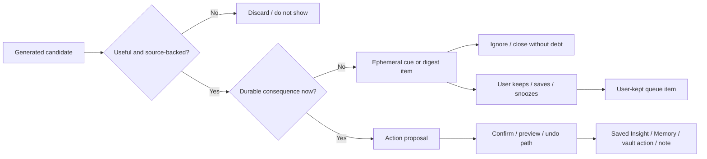

# PA Low-Burden Product Refactor Plan

Updated: 2026-06-30

## Status

| Field | Value |
| --- | --- |
| Document type | Refactor plan / product-architecture contract |
| Status | Implemented; validation and Obsidian test-vault smoke completed on 2026-06-30 |
| Scope | Pagelet, Review Queue, Weekly Review, Maintenance Review, Graph Discovery, Quiet Recall, Saved Insight, Memory Candidate, Retrieval Habit Profile, AI Memory Extraction, Vault Insights, Quick Capture enrichment |
| Product source of truth | [PA Product North Star](./pa-product-north-star.md), [Low-Burden Review Product Principles](./pa-low-burden-review-product-principles.md) |
| Execution tracker | [Low-Burden Product Refactor Tracker](./pa-low-burden-product-refactor-tracker.md) |
| Workflow | [Reusable refactor workflow](./refactor-workflow.md) |

This plan turns the low-burden review doctrine into an implementation refactor.
The goal is not to remove review, safety, or confirmation. The goal is to stop
turning every AI candidate into user work.

Product standard:

> Review should feel like recognition, not administration.

Implementation standard:

> AI artifacts are ignorable by default. Only durable consequence creates
> queue state, confirmation, or required action.

## 1. Why This Refactor Is Needed

Recent fixes corrected individual symptoms:

- Quick Capture enrichment only queues durable `memory_candidate` and
  `task_suggestion` suggestions.
- Saved Pagelet review notes no longer auto-create `evidence_insight` queue
  items.
- Bubble no longer surfaces ordinary generated `suggested` Review Queue counts.
- Weekly Review now opens as a digest and shows selection controls only after
  the user chooses to save material.

Those fixes are correct, but the larger architecture still has an older mental
model:

> generated candidate -> Review Queue item -> user decision.

That model conflicts with the current product doctrine. It makes provenance and
safety look like an inbox, even when no durable consequence exists.

## 2. Pre-Refactor Drift From Product Principles

This was the pre-refactor implementation shape that the refactor changed.

| Area | Pre-refactor shape | Product risk |
| --- | --- | --- |
| Review Queue model | `ReviewQueueStore` groups `suggested` and `failed` as `needs_decision`; active producer types include insight, related note, theme, conflict, index, maintenance. | Generated candidates look like unresolved user work. |
| Queue producer API | `createReviewQueueItem(input)` only validates type/sourceRefs; it does not require a user-intent or durable-consequence reason. | Producers can enqueue because something was generated, not because the user kept it. |
| Maintenance Review | `runMaintenanceReview()` enqueues every proposal by default unless `enqueueProposals: false` is passed. | Manual cleanup preview can silently become queue growth. |
| Graph Discovery | `runGraphDiscovery()` enqueues generated graph items by default unless `enqueueItems: false` is passed. | Lightweight discovery can become another review backlog. |
| Pagelet orchestrator | The Pagelet command path calls Maintenance/Graph with enqueue disabled, then manually enqueues every returned proposal/item. | Fixing only the host defaults would leave the real UI path queue-first. |
| Weekly Review builder | Weekly Review pulls `suggested`, `accepted`, `edited`, and `snoozed` Review Queue items into sections. | Weekly Review can amplify queue debt instead of staying digest-first. |
| Weekly direct scans | Weekly Review directly runs Maintenance Review before rendering the digest. | A quiet weekly ritual can block on a large-vault cleanup scan before the user sees value. |
| Quiet Recall | Runtime Bubble is route-only, but `quietRecallCandidateToReviewQueueInput()` still exists for related-note queue creation. | Read-only recall can regress into queue work if reused by a caller. |
| Copy / status language | Internal and some docs still use `accepted` as a general product term for save/selection. | The user experience sounds like approval processing rather than choosing what to keep. |
| Graph Discovery spec | The earlier lightweight graph spec named Pagelet Review Queue as the primary surface. | Future SDD work can reintroduce queue-first graph behavior if docs drift back. |

## 3. Target Product Contract

PA surfaces must be split by consequence, not by feature name.



Required invariants:

- **I1: Queue state represents user intent or durable consequence.** A queue
  item must have a reason such as user kept it, Memory confirmation is needed,
  a reversible vault action is pending, or a conflict cannot safely disappear.
- **I2: Read-only artifacts are disposable.** Recall, discovery, digest, and
  insight candidates may be shown without creating later work.
- **I3: First view is recognition, not administration.** Bubble, Panel, and
  Weekly Review default to route, evidence, or digest. Item processing appears
  only after an explicit user move into save/action mode.
- **I4: Durable state has source and recovery.** Saved Insight, Confirmed
  Memory, generated notes, and source-note mutations require sourceRefs and the
  appropriate confirmation/undo path.
- **I5: Broad scans are bounded and quiet.** Vault-wide or folder-wide scans
  produce summaries/digests first. They do not create queue items by default.

## 4. Proposed Architecture

Add a small policy layer before any feature can create durable review state.

### 4.1 Artifact Lifecycle Policy

Introduce a shared lifecycle classifier under `src/pa/`, for example:

```ts
type PaArtifactDisposition =
  | "discard"
  | "ephemeral_cue"
  | "digest_item"
  | "user_kept_queue_item"
  | "durable_confirmation"
  | "reversible_action";
```

The policy should answer:

- Is the candidate source-backed?
- Does it have meaningful delta, tension, recall, or action value?
- Is the consequence read-only, saved state, Memory, source-note mutation, or
  external action?
- Does producing or expanding it require broad scanning, provider work, cost, or
  a new privacy disclosure boundary?
- Did the user explicitly keep/snooze/save/select it?
- Should weak/duplicate/low-confidence material be discarded before UI?

### 4.2 Queue Admission Contract

Replace direct producer calls with an admission API:

```ts
createReviewQueueItem({
  ...input,
  admissionReason:
    | "user_kept_for_later"
    | "memory_confirmation_required"
    | "task_confirmation_required"
    | "maintenance_action_ready"
    | "conflict_resolution_required"
    | "user_initiated_action_recovery_required",
})
```

Rules:

- `suggested` is no longer enough to mean "needs decision."
- Read-only recall/discovery/digest candidates cannot enter the queue unless
  the user explicitly keeps them.
- Maintenance proposals may enter the queue only after the user keeps a
  proposal, enters apply mode, or an action needs recovery/undo visibility.
- Task suggestions may enter the queue only as task confirmation candidates for
  future Markdown task creation, never as generic AI reminders.
- Memory Candidates can enter the queue because they affect future PA behavior,
  but they must be sparse, grouped, and source-backed.
- Failure/retry queue items are allowed only for a prior user-initiated durable
  action. Failed read-only recall, discovery, digest, or provider work should
  fail quietly with local status/logging, not create user debt.

### 4.3 Surface Budget Contract

Each surface gets a responsibility and a budget.

| Surface | Default role | Allowed durable entry |
| --- | --- | --- |
| Bubble | route / soft reminder | User-kept later reminder only |
| Panel | current-context evidence and optional action entry | Explicit save / keep / apply action |
| Detail Tab | intentional deeper reading | Selection mode, apply mode, ledger views |
| Weekly Review | digest-first compounding ritual | Save selected material |
| Maintenance Review | explicit cleanup preview | Apply selected with preview/undo |
| Review Queue | user-kept and action-bearing items | No generated-candidate dumping |
| Saved Insight Ledger | things the user saved or imported | No silent PA candidate ledger |
| Memory | future-behavior context | Explicit confirmation |

### 4.4 Scan And Provider Preflight Contract

Broad scans and provider-backed discovery are not allowed to become hidden
preconditions for showing a recognition surface.

Rules:

- Weekly Review, Maintenance Review, Graph Discovery, and AI-backed discovery
  must run Data Boundary filtering before reading note content or sending text to
  a provider.
- Default scan scope is current note, current folder, recent 7 days, or selected
  notes. Whole-vault scope requires explicit confirmation.
- Source count, result count, category count, and provider calls must have
  bounded budgets before the first user-visible digest appears.
- A digest may show counts/categories from a bounded scan. Expanding a category,
  preparing detailed proposals, keeping items, or applying changes requires
  explicit user intent.
- Provider-backed discovery must share Pagelet's normal preflight: source
  disclosure, provider/cost boundary, rate-limit reservation, and cancellation
  before model invocation.
- AI Memory Extraction and Vault Insights must share the same preflight class:
  source scope disclosure, Data Boundary filtering, provider/cost boundary,
  rate-limit reservation, cancellation, cooldown/backoff, and token/cost caps
  before Type A or Type C model invocation. If the gate fails, PA must not create
  the model call and must not inject stale or unconfirmed vault-insight context.

This scan safety starts before Phase 5. Phase 5 hardens and expands the broad
scan controls; it is not the first phase that may address already-wired
Weekly/Maintenance scan paths.

## 5. Refactor Phases

### Phase 0: Source-Of-Truth Alignment

Goal: Make docs/specs/test names stop reintroducing the old queue-first model.

Deliverables:

- Align Weekly Review, Saved Insight, Maintenance, Graph Discovery, and Trust
  Layer specs with selected/saved/action terminology.
- Rewrite the Lightweight Graph Discovery spec so generated graph candidates are
  digest/preview-first and enter Review Queue only after user-kept or durable
  action intent.
- Add an explicit "Artifact Lifecycle" section to Product IA and Trust Layer.
- Add static scans for forbidden product patterns in docs and UI copy:
  `needs review`, `pending`, `accepted` as user-facing generic save language,
  and Bubble/Weekly queue-count wording.
- Add a source-of-truth contradiction scan for root specs that still say
  generated candidates should enter Review Queue by default.
- Audit `docs/pa-agent-product-spec-review-plan.md` while it remains a root doc:
  either align its Review Queue language with the lifecycle contract or mark the
  conflicting text as historical/provenance-only evidence.

Exit gate:

- Docs state one lifecycle model.
- No current root spec says generated candidates should automatically enter
  Review Queue.

### Phase 1: Lifecycle Policy Module

Goal: Create the policy layer without changing visible behavior yet.

Deliverables:

- Add `src/pa/review-artifact-lifecycle.ts` or equivalent.
- Add tests for disposition decisions:
  - low-confidence discovery -> discard
  - source-backed recall -> ephemeral cue
  - weekly theme -> digest item
  - user clicks Keep/Later -> user-kept queue item
  - Memory Candidate -> durable confirmation
  - move proposal in apply mode -> reversible action
- Add eval fixtures proving no raw provider output, note excerpts, or private
  titles are persisted by lifecycle records.

Exit gate:

- Policy tests pass.
- Existing runtime still behaves the same until Phase 2 adopts the policy.

### Phase 2: Queue Admission Refactor

Goal: Make Review Queue admission require user intent or durable consequence.
Maintenance enqueue-by-default, Graph enqueue-by-default, and Weekly consumption
of ordinary `suggested` queue items are confirmed product-contract violations,
not open product choices.

Deliverables:

- Add `admissionReason` to queue creation input and persisted queue metadata.
- Update `ReviewQueueStore.validateCreateInput()` to reject read-only/generated
  candidate types without an allowed admission reason.
- Add persisted schema/version migration before queue item validation. Existing
  pre-refactor items must be preserved with a legacy admission marker instead of
  being dropped by normalization.
- Change active producers:
  - Quick Capture remains limited to Memory and task suggestions.
  - Quiet Recall cannot enqueue related notes by default.
  - Graph Discovery returns digest/preview items by default.
  - Maintenance Review returns preview proposals by default.
  - Weekly Review consumes digest data first and only user-kept queue items
    second.
- Change Pagelet orchestrator paths that currently re-enqueue Maintenance and
  Graph results after calling host methods with enqueue disabled.
- Change Weekly Review status filters so ordinary `suggested` queue items do not
  enter the default weekly digest.
- Add the minimum scan preflight needed for already-wired Weekly/Maintenance
  paths: bounded scope, caps, and no whole-vault maintenance scan before the
  first digest unless explicitly confirmed.
- Rename or deprecate direct generated-object-to-queue helper functions so future
  callers cannot bypass the admission policy accidentally.

Exit gate:

- Focused queue tests prove generated `suggested` candidates do not create
  user debt.
- Existing user-kept/snoozed/action items still appear.

### Phase 3: Surface Refactor

Goal: Make every Pagelet surface obey the same consequence model.

Deliverables:

- Bubble:
  - remains route-only
  - shows no generated Review Queue counts
  - only reminds about user-kept later items
- Panel:
  - presents current-context evidence as readable cards
  - "Keep for later" is the explicit queue entry
  - source-backed save/action buttons name the durable result
- Detail Tab:
  - Review Queue view is renamed in UI copy toward "Kept / actions" rather
    than a generic AI inbox
  - section filters separate `Kept for later`, `Ready to apply`, `Recently
    applied`, and `Archived/dismissed`
- Weekly Review:
  - remains digest-first
  - selection controls only after user chooses save mode
  - queue carry-over includes only user-kept/later/action items
- Review Queue data injection:
  - Pagelet Panel/Tab extra builders filter by lifecycle/admission reason, not
    by raw `suggested`/`failed` status
  - legacy items remain visible only in intentional Tab views and do not power
    proactive reminders
- Maintenance Review:
  - category overview and preview first
  - no default queue growth from manual scan
  - apply/undo path remains explicit and audited

Exit gate:

- Pagelet UI tests assert default digest/recognition states before controls.
- Obsidian smoke verifies Bubble, Weekly Review, Maintenance Review, and Review
  Queue copy/interaction.

### Phase 4: Memory And Insight Trust Loop

Goal: Keep compounding value without making the user process every insight.

Deliverables:

- Saved Insight:
  - ledger receives user-saved/user-selected items only
  - PA-generated candidates remain ephemeral or digest-only until saved
- Memory:
  - Memory Candidates remain explicit confirmation items
  - low-risk candidates can be grouped, but not silently confirmed
  - rejected/ignored candidates do not become future behavior constraints
- Retrieval Habit Profile:
  - feedback learning is off by default and enabled only after explicit opt-in
  - learns only aggregate feedback when opt-in is enabled
  - view/ignore of read-only cues does not imply acceptance
  - implementation must define allowed feedback signals, retention, and reset
    before any retrieval influence ships
- AI Memory Extraction / Vault Insights:
  - included in this low-burden refactor scope
  - no background extraction, vault-insight refresh, or vault-insight prompt
    injection may run for any user without a recorded first-use confirmation,
    including legacy installs and missing or migrated settings
  - add a consent/version field and migration that defaults missing consent to
    unconfirmed/paused before scheduler, startup sync, or prompt injection can
    observe the old default-on settings
  - `syncMemoryExtractionRuntime()`, extraction scheduler startup, provider model
    creation, and vault-insight context projection must all check the same
    recorded confirmation before work starts
  - first-use confirmation must disclose note scope, Data Boundary filtering,
    provider/cost implications, future-behavior impact, and how to pause/reset
  - default experience should be manual "prepare vault insights" or explicitly
    confirmed automatic preparation, not silent vault understanding

Exit gate:

- Tests prove ignored candidates create no Saved Insight, no Confirmed Memory,
  and no high-weight retrieval influence.
- Tests prove RHP feedback writes are disabled before opt-in.
- Tests prove Memory Extraction / Vault Insights do not run or inject context
  before first-use confirmation.

### Phase 5: Broad Scan Strategy Hardening

Goal: Complete and harden Maintenance Review and Weekly Review for large vaults
without creating scan debt or queue debt. Minimum scan safety for already-wired
runtime paths starts earlier in Phase 2/3.

Deliverables:

- Manual-first broad scan controls:
  - current note / folder / recent 7 days / selected notes before whole vault
  - whole-vault scan requires explicit scope confirmation
- Progressive scan result model:
  - first return a digest/count/category summary
  - only expand a category or apply selected items after user intent
- Weekly direct inputs:
  - Maintenance Review and Quiet Recall sections obey the same bounded source
    budget as the weekly digest
  - Weekly Review does not block on a detailed maintenance proposal scan before
    showing the first digest
- Performance and privacy limits:
  - Data Boundary filters before scan
  - cap source count and result count per section
  - no provider work unless the user has seen the disclosure boundary
- Queue policy:
  - scans never enqueue all findings by default
  - queue only items the user keeps, snoozes, or starts applying

Exit gate:

- Large-vault tests and smoke prove scan summaries do not create queue items by
  default.
- Obsidian smoke records a bounded scan, category expansion, and zero queue
  growth until `Keep`/`Apply selected`.

### Phase 6: Cleanup, Migration, And Release Readiness

Goal: Remove old mental-model leftovers.

Deliverables:

- Clean up unused queue producer helpers or mark them internal/deprecated.
- Migrate user-facing copy away from generic "accepted" and "needs decision"
  where the product action is save/keep/select.
- Add release notes explaining the lower-burden review model.
- Run full checks and app smoke.

Exit gate:

- No P2/P1/P0 review findings remain.
- Tracker evidence includes focused tests, full Jest, lint, build, source scan,
  `make deploy`, and Obsidian smoke.

## 6. Validation Strategy

Focused tests by phase:

```bash
# Phase 1 lifecycle/contracts
npm test -- --runTestsByPath __tests__/review-queue-store.test.ts __tests__/pa-contracts.test.ts

# Phase 2 queue admission and producer paths
npm test -- --runTestsByPath __tests__/review-queue-store.test.ts __tests__/settings.test.ts __tests__/quick-capture-enrichment.test.ts __tests__/quiet-recall.test.ts __tests__/weekly-review.test.ts __tests__/maintenance-review.test.ts __tests__/graph-discovery.test.ts __tests__/pagelet-orchestrator.test.ts __tests__/pagelet-commands.test.ts

# Phase 3 recognition-first surfaces
npm test -- --runTestsByPath __tests__/pagelet-bubble-content.test.ts __tests__/pagelet-bubble-coordinator.test.ts __tests__/pagelet-panel-tab-view.test.ts __tests__/pagelet-orchestrator.test.ts __tests__/pagelet-commands.test.ts __tests__/maintenance-review-apply.test.ts

# Phase 4 Memory, insight, RHP, and Vault Insights trust loop
npm test -- --runTestsByPath __tests__/saved-insight-store.test.ts __tests__/memory-governance-store.test.ts __tests__/retrieval-habit-profile.test.ts __tests__/active-vault-indexer.test.ts __tests__/memory-extraction.test.ts __tests__/plugin-record-note.test.ts __tests__/pa-agent-context.test.ts __tests__/chat-service.test.ts __tests__/settings.test.ts

npx tsc -noEmit -skipLibCheck --pretty false
git diff --check
```

Product copy/spec scans by phase:

```bash
rg -n "needs review|Needs review|pending|Pending|accepted|Accepted|needs decision|Needs decision" docs src/locales src/pagelet
rg -n "Review Queue.*primary|enter Pagelet.*Review Queue|generated.*Review Queue|suggested.*Review Queue" docs
```

These scans are review aids, not blind pass/fail gates. Each hit must be either
removed, moved to internal/developer terminology, or explicitly justified as a
durable-action boundary.

Broad gates for runtime phases:

```bash
npm test -- --runInBand
npm run lint
npm run build
rg -n "createElement\\([\"']style[\"']\\)|\\.innerHTML\\s*=|\\.outerHTML\\s*=" src
make deploy
```

Required Obsidian smoke for runtime phases:

- Bubble: generated queue candidates do not surface as counts; user-kept later
  item does.
- Weekly Review: default digest has no checkbox controls; save mode creates
  selected-only note after confirmation.
- Maintenance Review: scan opens preview/category digest; queue count does not
  grow until keep/apply.
- Graph Discovery: command opens suggestions/digest without queue growth by
  default.
- Review Queue Tab: only user-kept/action-bearing items appear.

## 7. Decision Register

Open decisions need user confirmation before the relevant phase starts.
Confirmed decisions are implementation constraints.

| ID | Status | Decision | Stance |
| --- | --- | --- | --- |
| D1 | Confirmed / implemented | Should the user-facing "Review Queue" label be renamed? | Yes: use "Kept items" or "Actions to confirm" in UI, keep `ReviewQueue` internal. |
| D2 | Confirmed | Should manual Maintenance Review stop enqueueing proposals by default? | Yes: preview only; enqueue only `Keep for later`, apply-mode, or action recovery items. |
| D3 | Confirmed | Should Graph Discovery stop enqueueing by default? | Yes: digest/preview only; enqueue only user-kept edge suggestions. |
| D4 | Confirmed / implemented | How should legacy queue items without admission reason be treated? | Preserve in intentional Tab views, exclude from Bubble/weekly proactive debt, tag as legacy until touched. |
| D5 | Confirmed | Should Weekly Review include ordinary `suggested` queue items? | No: include digest sources plus user-kept/action-bearing items only. |
| D6 | Confirmed / implemented | What is the first large-vault scan scope? | Current note, same folder, and recent 7 days with caps before whole vault; whole-vault requires an explicit internal option. |
| D7 | Confirmed | What is the default for Retrieval Habit Profile feedback learning? | Default off unless explicitly opted in; define allowed aggregate signals, retention window, and clear/reset behavior before retrieval influence ships. |
| D8 | Confirmed | Is AI Memory Extraction / Vault Insights first-use confirmation in this refactor scope? | Included in this refactor; recorded first-use confirmation is a pre-runtime/release blocker for background extraction, vault-insight refresh, and vault-insight prompt injection. Legacy/missing consent defaults to unconfirmed/paused. |

## 8. Non-Goals

- Do not remove confirmation for Memory, source-note mutation, generated note
  writes, or external actions.
- Do not weaken sourceRefs, Data Boundary, write-action preview, or undo logs.
- Do not split PA into separate products.
- Do not add autonomous whole-vault maintenance.
- Do not make Chat the primary review surface.

## 9. Done Definition

The refactor is done when:

- generated candidates are ignorable by default across Pagelet surfaces
- Review Queue represents user-kept or durable-consequence items only
- pre-refactor Review Queue items are preserved through a versioned migration
- Weekly Review and Maintenance Review start as digest/preview surfaces
- broad scans do not create queue debt
- Saved Insight and Memory only become durable through explicit user intent
- Retrieval Habit Profile learning is default-off, opt-in only, and has bounded
  retention plus clear/reset behavior before it can influence retrieval
- AI Memory Extraction and Vault Insights cannot run background extraction,
  refresh vault insights, create provider calls, or inject vault-insight prompt
  context until recorded first-use confirmation exists, including legacy installs
- tests and Obsidian smoke prove the above in the real test vault
