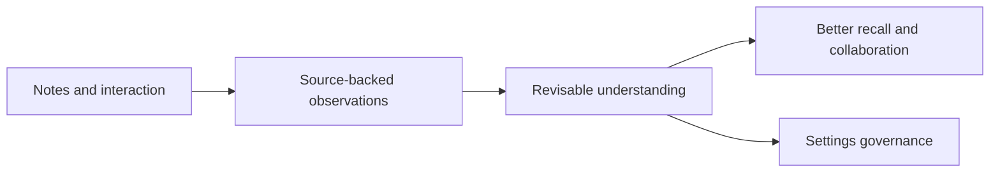

# PA Memory Control Center Product Spec

Updated: 2026-07-11

## Status

| Field | Value |
| --- | --- |
| Document type | Active product spec |
| Status | Product contract implemented and validation gates complete |
| Canonical scope | Memory control center, user understanding, lifecycle governance |
| Product entry | Settings -> Memory and personalization |
| Contextual surfaces | Chat, Pagelet, Recall, AI Insights |
| Intake source | [Memory control-center intake](./pa-memory-control-center-optimization-plan.md) |
| Runtime status | Canonical Settings surface, governed persistence/use, lifecycle actions, and contextual routing implemented |

This document is the canonical product contract for the Memory control-center
iteration. It supersedes older Memory-specific assumptions that require a
standalone Memory panel, expose the internal taxonomy as the primary UI model,
or require a blocking confirmation for every low-risk durable understanding.

It does not weaken the Write Action Framework, provider disclosure, Data
Boundary, vault-write confirmation, or external-action authorization.

Authority order for this iteration:

1. `pa-product-north-star.md` remains the top-level product principle.
2. This spec is canonical only for the Memory entry point, effect-based
   admission, lifecycle actions, and vault/device scope.
3. `pa-data-boundary-product-spec.md` retains PA-wide source eligibility,
   provider disclosure, exclusions, and cleanup authority.
4. The Write Action Framework retains every vault-write and external-action
   permission boundary.
5. `pa-memory-control-center-optimization-plan.md` is intake and decision
   provenance, not the implementation status source.

## 1. Product Outcome

PA should understand the user's notes first and use that source-backed
understanding to collaborate more coherently over time.



Understanding the user is a derived outcome of understanding their notes and
explicit interaction. It is not a separate profile product, and it must not
turn quoted material, client information, research topics, temporary rules, or
opposing arguments into global claims about the user.

The user value remains the North Star:

> 随手记下，需要时自然浮现。

The delivery constraint remains:

> 安静且可信。

Safety and control are achieved through proportionate disclosure,
inspectability, correction, pause, undo, and authorization. They are not
defined as repeated confirmation work for every low-risk update.

## 2. Product Principles

1. **Understanding follows evidence.** Important claims retain source,
   provenance, scope, time, and effect.
2. **One product entry, several natural layers.** Settings is the complete
   governance destination; contextual surfaces explain and route rather than
   duplicate the whole control center.
3. **Effect determines friction.** Confirmation and disclosure are based on
   consequence, sensitivity, scope, reversibility, and action authority, not
   solely on an internal Memory type.
4. **Control does not become a queue.** Recent changes is an on-demand audit and
   recovery surface without unread badges, pending counts, or an inbox-zero
   expectation.
5. **User corrections outrank inference.** A correction is durable within its
   declared scope and must not be silently overwritten by unchanged evidence.
6. **Memory never grants action authority.** No learned preference, profile
   claim, or Confirmed Memory authorizes note mutation, network access, or an
   external action.
7. **Source notes remain untouched.** Correct, Pause use, Undo, and Forget
   operate on PA state, not on the user's Markdown source.

## 3. Surface Contract

### 3.1 Settings

Settings is the canonical complete governance surface in the current runtime.
It uses summary cards and progressive disclosure rather than a long flat list
of toggles. The former read-only Overview milestone has been promoted: governed
use, lifecycle actions, Recent changes, recovery/finalization controls, and
exact contextual routing now exist. Actual Forget/finalization, independent
Device A/B, and real-device iOS evidence are recorded in the tracker.

```text
Settings -> Memory and personalization
├── Overview
├── PA's understanding of you
├── Collaboration style
├── Current vault agreements
├── Long-term memory
├── Recent context
├── Recent changes
└── Data and recovery (advanced)
```

The product may implement these as sections, a Settings-internal detail view,
or lightweight modals. It should not add a persistent standalone Memory tab in
the first version.

`Data and recovery` owns Memory-specific status, lifecycle recovery, local
repair, and future Memory portability. PA-wide exclusions, provider disclosure,
and unified cleanup remain owned by `Data & Privacy Boundaries`; the two
surfaces use precise deep links instead of duplicating controls or presenting
two canonical owners.

### 3.2 Chat, Pagelet, Recall, And AI Insights

Contextual surfaces may:

- show which source or understanding affected the current result;
- explain why it was used;
- provide a local correction action when the meaning is unambiguous;
- deep-link to the corresponding Settings detail.

They must not become competing complete governance destinations. Pagelet may
continue to review Memory Candidates, but durable records and user-understanding
governance belong to Settings.

### 3.3 When To Reconsider A Standalone Surface

Reconsider a dedicated Memory view only after observed use shows frequent
search, bulk editing, source comparison, or sustained governance sessions that
do not fit Settings progressive disclosure.

## 4. Hybrid Understanding Model

PA should use a hybrid model: reconstructable observations remain derived;
only state that cannot be reconstructed safely or that governs future behavior
is materialized.

| Layer | Nature | Source of truth | Default scope | User governance |
| --- | --- | --- | --- | --- |
| Markdown notes | User source | Vault | Vault | User edits notes directly |
| Note Memory / VSS | Reconstructable retrieval state | Notes + local index | Vault + device | Prepare, update, rebuild, reset |
| Vault Insights / Type-C note observations | Reconstructable derived view | Allowed notes, vault structure, and retrieval evidence | Current vault | Inspect sources; correct only a resulting durable claim |
| User-profile observations | Derived interaction evidence | Conversation evidence | Current vault by default | Inspect, correct, pause, forget |
| Durable claims / Confirmed Memory | Non-reconstructable PA state | Versioned local governance store | Explicit scope | Full lifecycle actions |
| Collaboration preferences | Explicit durable defaults | Versioned local governance store | Same device when explicitly general | Correct, pause, forget |
| Recent context | Temporary projection | Session/runtime inputs | Task or vault | Automatic expiry |
| Change events | Temporary audit state | Versioned local governance store | Same record scope | Seven-day inspection |
| Undo snapshots | Temporary recovery state | Versioned local governance store | Same record scope | Seven-day undo |
| Suppression markers | Text-free prevention state | Versioned local governance store | Source/rule bound | Clear when needed |

Internal types such as `preference`, `decision`, `project_context`,
`task_constraint`, and `open_question` remain available for validation, policy,
migration, and diagnostics. They are not primary navigation, grouping, or
ordinary UI chips.

Vault Insights remains a derived note-understanding source rather than a
durable claim or a second user profile. Its current snapshot may inform recall
and answers, but it grants no action authority, never expands beyond the
current vault, and must not be regenerated merely because the control center is
opened. A correction to a Vault Insight governs the resulting durable claim or
suppression rule; it does not rewrite the user's notes.

Many Type-C observations are vault aggregates rather than claims backed by one
note. UI must distinguish exact, representative, and aggregate-only provenance,
show the allowed-note boundary used to derive the snapshot, and hide an old
snapshot when the Data Boundary fingerprint changes. VSS readiness alone is a
status signal, not evidence that PA has formed a note-derived observation.

## 5. Effect-Based Admission And Disclosure

| Effect | Conditions | Product behavior |
| --- | --- | --- |
| Read-only recall or retrieval | No durable behavior change | May occur quietly; show sources when useful |
| Reconstructable vault-scoped observation | Source-backed, low sensitivity, no durable claim | May refresh quietly; no review queue |
| Low-risk durable understanding | Source-backed, low sensitivity, current-vault scope, reversible | May update without blocking; record in Recent changes and support correction/undo |
| Explicit collaboration default | User clearly intends a same-device general preference | Persist only after explicit intent; show scope and effect |
| Conflict, sensitive inference, or durable task constraint | Broad, sensitive, ambiguous, or constraint-like | Surface before it affects future behavior |
| Cross-vault understanding | Any synthesis of note-derived understanding | Deferred; requires a separate product decision |
| Vault mutation or external action | Writes, sends, publishes, pays, or invokes external capability | Separate preview/authorization boundary; Memory grants no permission |

The migrated 30-confirmation trust threshold is preserved only as a versioned
legacy policy. It is not the North Star or the general admission rule for new
user understanding.

## 6. User-Facing Meaning

Each inspectable item should expose only the meaning needed for trust and
correction:

- **Source:** where the understanding came from.
- **Scope:** current task, current vault, or explicit same-device default.
- **Effect:** retrieval only, future answers, or collaboration behavior.
- **Status:** active, paused, changed recently, or forgotten marker.
- **Time:** observed, updated, verified, or changed.
- **Authority:** PA inference, source observation, explicit user statement, or
  user correction.

Confidence and internal type may appear in advanced diagnostics when they help
troubleshooting, but they must not substitute for source, scope, or effect.

## 7. Lifecycle Actions

### Correct

- Creates a new user-authoritative revision within the relevant scope.
- Preserves lineage and the evidence that led to the previous understanding.
- Prevents unchanged evidence from immediately recreating the rejected value.

### Undo recent change

- Restores the state before an eligible automatic addition, replacement, or
  removal.
- An automatic removal is a reversible PA deactivation backed by a snapshot;
  it is never the same operation as user-triggered permanent Forget.
- Is available only while a detailed undo snapshot exists.
- The first implementation retains detailed snapshots for seven days.

### Pause use

- Keeps the saved content but excludes it from future use.
- Is a distinct user-facing outcome from stale or forget.
- Does not modify source notes.
- Does not require a new internal lifecycle name if the existing archive state
  can be proven to enforce the same user-visible use and restore semantics.

### Forget

- Removes saved content and source references from active PA state.
- Removes or redacts linked copies that could continue to expose or use the
  content.
- Irreversibly redacts the forgotten content from undo and migration rollback
  snapshots; Forget itself never creates a content-bearing undo snapshot.
- Leaves only a text-free, source/rule-bound suppression marker.
- Is not content-recoverable from PA Memory or governance state.
- Does not rewrite source notes or existing visible conversations. Existing
  conversation text remains ordinary chat history and may be included when that
  conversation continues; the user must explicitly delete the relevant message
  or conversation to remove that text from later chat context.
- Does not claim to prevent relearning until the candidate-admission path
  actually consumes the suppression marker.
- Does not wait forever for a linked external store. A stalled cleanup remains
  visibly pending and out of use, and startup/retry continues without restoring
  the forgotten content.

Do not use a generic `Remove` label for these different outcomes.

## 8. Recent Changes

Recent changes is an audit and recovery log, not a review queue.

- Show meaningful additions, replacements, removals, corrections, pauses, and
  restores from the previous seven days.
- Expose source, scope, effect, time, and the available action.
- Treat Forget as a special redacted history item: show only that forgetting
  completed, its time, and non-sensitive status. Do not retain or reconstruct
  forgotten content or source references for the history view.
- Do not show unread badges, pending counts, completion state, or review debt.
- Do not use `updatedAt` or recent confirmations as a substitute for a real
  change event.
- Detailed undo snapshots expire after seven days in the first implementation.
- Text-free suppression markers do not expire with the audit window; they
  remain until relevant source evidence changes materially or the user clears
  them.

Seven days is a dogfood hypothesis. Revisit it using actual inspection timing,
undo timing, storage sensitivity, and repeated-error evidence.

## 9. Scope And Device Boundary

Implemented first-version scope contract:

- note-derived understanding remains scoped to the current vault;
- task context expires and does not become a durable preference by default;
- only explicit collaboration defaults may follow the user across vaults on
  the same device;
- a collaboration default requires a direct scope action such as “apply on
  this device across all vaults”; ordinary preference wording, internal type,
  repetition, or note content is never enough to promote scope;
- no PA Memory or personalization state automatically synchronizes to another
  device;
- notes synchronizing through Obsidian does not imply that PA state syncs;
- every device prepares its own reconstructable note index.

The current runtime stores non-reconstructable governance state in one
device-local IndexedDB, partitioned by opaque vault key. A desktop probe proved
same-device collaboration over that shared DB while keeping vault claims,
policy, and migration state isolated. Legacy `data.json` slices remain behind
the compatibility/finalization boundary rather than being cleaned up
automatically.

Independent isolated-profile Device A/B first-start evidence now proves that a
device-local correction does not inherit through the synchronized legacy
payload and that one device's cutover does not automatically clear the source
needed by another. This validates the compatibility boundary; it does not add
automatic cross-device governed-Memory synchronization to the product.

## 10. Current Implementation Status And Validation

Implemented and covered by source/tests:

1. A typed hybrid read model aggregates Note Memory, loaded Type-C observations,
   Type-A profile state, governed durable claims, source errors, and boundary
   status without preparing or writing data.
2. A versioned device-local repository owns claims, revisions, links, events,
   snapshots, markers, pending operations, policy, migration state, rollback
   payloads, and deltas.
3. Governed claims have a production context consumer; scope, Data Boundary,
   sensitivity, lifecycle, suppression, and pending Forget fail closed.
4. Correct, Pause/Resume, change scope, seven-day Undo, Recent changes, Forget,
   rollback, and explicit finalization are implemented with exact lineage.
5. Type-A and Memory Candidate admission use the effect-based policy; Profile
   projection is serialized and recoverable through a durable outbox.
6. Settings is the canonical governance destination; contextual surfaces route
   to exact details rather than duplicating it.

The final verification gates are complete:

- independent-profile Device A/B non-inheritance and legacy no-auto-cleanup;
- actual desktop confirmation of Forget and compatibility finalization;
- governed Chat persistence/reopen and AI Insights pending fail-closed;
- real-device iOS reload/resume, `legacy_threshold` compatibility, layout,
  safety, and Inspector evidence;
- a final multi-lane review/fix/re-review after the full 155-suite / 2877-test gate.

Migration and first cutover preserve actual effects rather than labels. A
currently used, vault-scoped Type-A profile remains used through a governed
projection. Legacy Confirmed Memory remains `stored_not_in_use` until the new
effect-based policy admits it with the required source, scope, change-event,
and recovery guarantees. Migration never bulk-activates legacy records and
never creates a mandatory review queue.

## 11. Delivered Runtime Shape

The iteration began with a read-only hybrid Overview. That milestone is now
historical: `Memory and personalization` is present in ordinary Settings and is
the canonical control center. The read-only guarantees of its summary path
remain part of the product contract even though lifecycle and recovery actions
now appear where supported.

The delivered surface:

- show Memory preparation/readiness without triggering preparation;
- show the existence and recency of user-profile understanding;
- show an already-loaded Type-C Vault Insights snapshot and its current-vault
  boundary without running analysis;
- show active Confirmed Memory counts and source-backed details where already
  available;
- explain vault and device scope accurately;
- display source, scope, effect, status, and time rather than internal type;
- expose capability-backed Correct, Pause/Resume, scope, Forget, retry, Undo,
  rollback, finalization, and prevention-marker controls;
- render a real change-event ledger without queue/badge semantics;
- provide exact contextual deep-link targets.

It still must not:

- trigger provider calls, note writes, indexing, or maintenance;
- expose internal taxonomy as ordinary navigation;
- treat legacy compatibility data as synchronized governed state;
- generalize the isolated-profile/real-iPhone evidence into a promise of
  automatic governed-Memory synchronization.

## 12. Out Of Scope

- Automatic cross-device Memory synchronization.
- Cross-vault synthesis of note-derived understanding.
- A persistent standalone Memory tab.
- First-slice import/export or bulk governance.
- Automatic vault mutation, network access, or external action authority.
- Replacing VSS or changing Markdown as the source of truth.

Manual export/import remains an advanced follow-up after the durable schema and
lifecycle stabilize. It should export only non-reconstructable durable state,
preview imports, validate schema versions, merge by default, and treat replace
as dangerous.

## 13. Success Criteria

- A user can explain what PA understands, where it came from, where it applies,
  and how it affects future behavior.
- Ordinary use creates less management work than the current confirmation and
  fragmented-surface model.
- No user-facing action promises a stronger deletion, undo, pause, or
  suppression effect than the runtime provides.
- Internal taxonomy and storage jargon remain out of ordinary UI.
- Source notes remain unchanged by governance actions.
- Device/vault boundaries are accurately represented and tested.
- Canonical Settings preserves the proven read-only inspection journey while
  lifecycle actions remain capability-backed and progressively disclosed.
- No P0-P2 privacy, lifecycle, migration, or product-contract findings remain
  open without explicit deferral.

## 14. Decision Status

No additional top-level product decision is required to begin the iteration.
Architecture, migration, copy, and interaction details may be resolved through
the SDD, review, and smoke loops as long as they stay inside this contract.

New user decisions are required only before expanding to cross-vault
understanding, automatic synchronization, first-version import/export, a
standalone Memory tab, or broader action authority.
