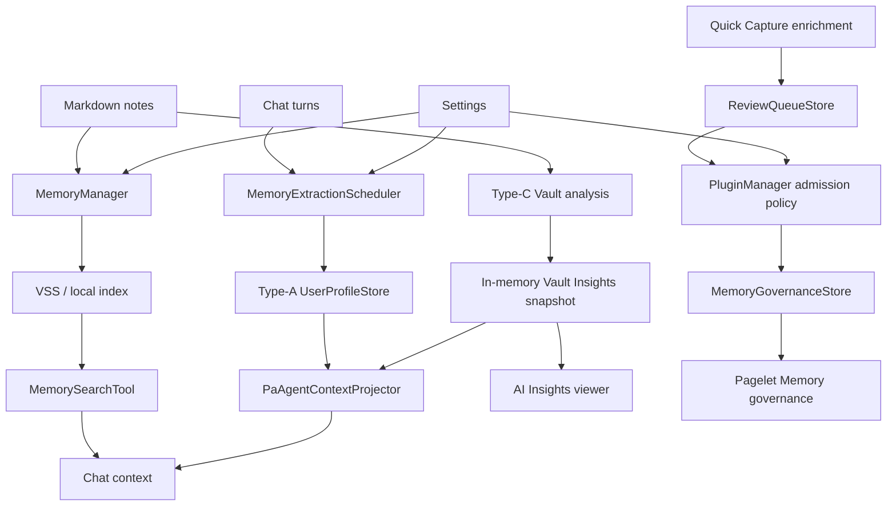
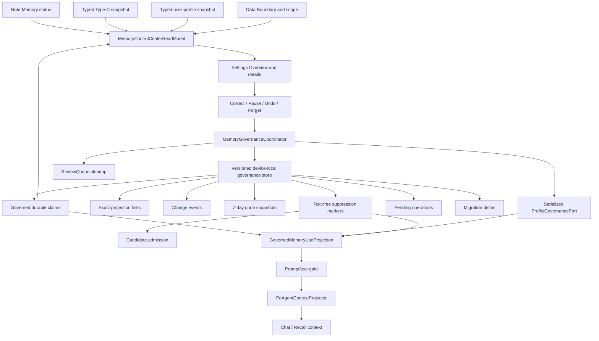

# PA Memory Control Center SDD

Updated: 2026-07-11

Product spec: [PA Memory Control Center Product Spec](./pa-memory-control-center-product-spec.md)

Development plan: [PA Memory Control Center Development Plan](./pa-memory-control-center-development-plan.md)

Tracker: [PA Memory Control Center Development Tracker](./pa-memory-control-center-development-tracker.md)

## Status

| Field | Value |
| --- | --- |
| Document type | Implementation SDD |
| Status | Architecture implemented; validation and closeout gates complete |
| First runtime slice | Read-only Settings hybrid overview completed and promoted to canonical Settings |
| Structural change | Implemented: typed aggregation, versioned local persistence, migration/rollback, lifecycle, admission/use, contextual routing |
| Current boundary | No staging/commit/push/release; runtime and validation work are complete |

The user authorized the complete iteration on top of the current worktree.
This SDD still does not authorize staging, commit, push, release, rewrite,
stash, or reset. Sections that mark symbols as `NEW` or describe a target are
retained as implementation provenance; those symbols and the target
architecture now exist unless a section explicitly says a gate remains.

## 1. Objectives

1. Aggregate Note Memory, Type-C Vault Insights, Type-A user-profile
   observations, Memory Candidates, and Confirmed Memory without pretending
   they already share one source of truth.
2. Deliver a read-only Settings Overview before adding new write semantics.
3. Move non-reconstructable governance state to a versioned, verified
   device-local store.
4. Implement Correct, Undo, Pause use, Forget, and Recent changes with truthful
   end-to-end behavior.
5. Preserve `MemoryManager` as the owner of user-facing note Memory behavior,
   `VSS` as the local-index facade, and the Markdown vault as note source of
   truth.

## 2. Pre-Iteration Architecture Baseline



Before this iteration there was no production consumer of
`MemoryGovernanceStore.listForContext()`. The implemented runtime no longer
uses that absence as its architecture: governed claims now pass through a
bounded use projection before agent context, while Type-A ProfileStore is a
recoverable projection of governed Type-A state.

## 3. Verified Existing Symbols

| Symbol | Current path | Role | Verification |
| --- | --- | --- | --- |
| `MemoryManager` | `src/memory-manager.ts` | Note Memory policy and preparation | Existing class |
| `MemoryManager.getMaintenancePlan()` | `src/memory-manager.ts` | May initialize/readiness-scan VSS; not an Overview status API | Existing method |
| `MemoryManager.getActivePreparationStatus()` | `src/memory-manager.ts` | Current preparation status | Existing method |
| `VSS.getStats()` | `src/vss/vss-core.ts` | Local-index status and counts | Existing method |
| `MemoryExtractionScheduler` | `src/ai-services/memory-extraction/extraction-scheduler.ts` | Type-A/Type-C orchestration | Existing class |
| `MemoryExtractionScheduler.getPromptContext()` | same | Prompt-facing rendered context | Existing method; not a typed governance API |
| `MemoryExtractionScheduler.getInsightsViewerContext()` | same | Viewer-facing rendered context | Existing method; not a typed governance API |
| `TypeCVaultMetacognitionAnalyzer` | `src/ai-services/memory-extraction/type-c-analyzer.ts` | Current-vault derived note analysis | Existing class |
| `VaultMetacognitionSnapshot` | same | Typed Type-C derived snapshot | Existing interface |
| `UserProfileStore.getProfile()` | `src/ai-services/memory-extraction/profile-store.ts` | Typed profile snapshot read | Existing interface method |
| `IndexedDbUserProfileStore.initialize()` | `src/ai-services/memory-extraction/profile-store.ts` | Opens/creates the profile database | Existing method; forbidden for read-only Overview |
| `MemoryGovernanceStore` | `src/pa/memory-governance-store.ts` | Confirmed Memory lifecycle | Existing class |
| `MemoryGovernanceStore.list()` | same | Clone-safe record listing | Existing method |
| `MemoryGovernanceStore.listRecentlyConfirmed()` | same | Seven-day active confirmation query | Existing method; not Recent changes |
| `MemoryGovernanceStore.confirmCandidate()` | same | Candidate-to-record transition | Existing method |
| `MemoryGovernanceStore.archive()` / `restore()` | same | Legacy callback-store lifecycle transitions | Existing compatibility methods; governed Pause/Resume is coordinator-owned |
| `MemoryGovernanceStore.forget()` | same | Legacy callback-store tombstone transition | Existing compatibility method; canonical Forget is owned by `MemoryGovernanceCoordinator` |
| `ReviewQueueStore` | `src/pa/review-queue-store.ts` | Candidate workflow and audit | Existing class |
| `PluginManager.listConfirmedMemories()` | `src/plugin.ts` | Pagelet record projection | Existing private method |
| `PluginManager.forgetConfirmedMemory()` | `src/plugin.ts` | Legacy Pagelet compatibility path | Existing private method; canonical governed actions use the lifecycle coordinator |
| `PluginManager.setMemoryAutoAcceptPaused()` | `src/plugin.ts` | Legacy Level 2 policy compatibility | Existing public method retained through migration |
| `SettingTab.renderMemorySection()` | `src/settings.ts` | Operational Memory settings renderer | Existing private method inside canonical `memory-personalization` |
| `MemoryGovernanceSection` | `src/pagelet/tab/sections/MemoryGovernanceSection.ts` | Contextual Pagelet Memory UI | Existing class; routes durable governance to Settings |

Any implementation change must rerun these symbol greps because the current
worktree is not yet a stable committed baseline.

## 4. Implemented Target Architecture



The read model is a projection, not a fourth source of truth. It must never
write, prepare Memory, refresh an index, call a provider, or infer new claims.

## 5. New Read-Model Contract

Implemented file: `src/pa/memory-control-center.ts` (originally marked `NEW`).

```ts
export type MemoryControlCenterOrigin =
    | "note_memory"
    | "vault_insights"
    | "user_profile"
    | "confirmed_memory"
    | "collaboration_preference"
    | "recent_context";

export type MemoryControlCenterAuthority =
    | "source_observation"
    | "pa_inference"
    | "explicit_user"
    | "user_correction";

export type MemoryControlCenterEffect =
    | "none"
    | "stored_not_in_use"
    | "retrieval_only"
    | "future_answers"
    | "collaboration_default";

export type MemoryControlCenterLifecycle =
    | "derived"
    | "active"
    | "archived"
    | "paused"
    | "forget_pending"
    | "stale"
    | "exported"
    | "forgotten_marker";

export type MemoryControlCenterProvenance =
    | { kind: "note"; sourceRef: PersistedSourceRef }
    | { kind: "conversation"; conversationId: string; observedAt?: string }
    | { kind: "explicit_setting"; settingKey: string }
    | {
        kind: "vault_aggregate";
        generatedAt: string;
        dataBoundaryFingerprint: string;
        includedFileCount: number;
        coverage: "exact" | "representative" | "aggregate_only";
        representativeSourceRefs: PersistedSourceRef[];
    };

export type MemoryControlCenterAction =
    | "correct"
    | "undo_recent_change"
    | "pause_use"
    | "resume_use"
    | "apply_device_wide"
    | "limit_to_current_vault"
    | "forget"
    | "retry_forget";

export interface MemoryControlCenterItem {
    id: string;
    claimId?: string;
    profileRecordId?: string;
    label: string;
    origin: MemoryControlCenterOrigin;
    authority: MemoryControlCenterAuthority;
    scopeLabel: string;
    effect: MemoryControlCenterEffect;
    lifecycle: MemoryControlCenterLifecycle;
    provenance: MemoryControlCenterProvenance[];
    observedAt?: string;
    updatedAt?: string;
    supportedActions: MemoryControlCenterAction[];
}

export interface MemoryControlCenterRecentChange {
    id: string;
    claimId: string;
    kind: "add" | "replace" | "auto_remove" | "correct" | "pause" | "resume"
        | "forget" | "undo" | "change_scope";
    occurredAt: string;
    label?: string;
    sourcePath?: string;
    scopeLabel?: string;
    effect?: MemoryControlCenterEffect;
    status?: "active" | "paused" | "restored" | "forgotten";
    redacted: boolean;
    supportedActions: MemoryControlCenterAction[];
}

export interface MemoryControlCenterSnapshot {
    generatedAt: string;
    noteMemory: {
        enabled: boolean;
        status: "disabled" | "unknown" | "unprepared" | "preparing" | "ready" | "stale" | "error";
        indexedDocumentCount?: number;
    };
    vaultInsights: {
        enabled: boolean;
        status: "disabled" | "not_loaded" | "ready" | "stale_boundary" | "error";
        generatedAt?: string;
        fileCount?: number;
    };
    profile: {
        enabled: boolean;
        status: "disabled" | "loading" | "unknown" | "blocked"
            | "unavailable" | "empty" | "ready" | "error";
        updatedAt?: string;
        itemCount: number;
    };
    durable: {
        activeCount: number;
        pausedCount: number;
        staleCount: number;
    };
    boundary: {
        vaultScoped: true;
        deviceLocalProven: boolean;
        explanationKey: string;
    };
    governanceMode?: "effect_based" | "legacy_threshold" | "unavailable";
    compatibilityFinalization?: {
        phase: "compatibility" | "finalizing";
        eligible: boolean;
        confirmationToken?: string;
        legacyRecordCount: number;
        legacyMemoryQueueCount: number;
        warningCode: "other_devices_may_still_depend_on_legacy_data";
        requiresFreshRestoreProof?: boolean;
        blockedReason?: string;
    };
    compatibilityRollback?: {
        phase: "compatibility" | "rolling_back";
        eligible: boolean;
        legacyRecordCount: number;
        legacyMemoryQueueCount: number;
        rollbackExpiresAt?: string;
        blockedReason?: string;
    };
    items: MemoryControlCenterItem[];
    recentChanges?: MemoryControlCenterRecentChange[];
    degradedSources: MemoryControlCenterSourceError[];
}

export interface MemoryControlCenterInput {
    now: Date;
    noteMemory: Readonly<MemoryControlCenterNoteMemoryInput>;
    vaultInsights: Readonly<MemoryControlCenterVaultInsightsInput>;
    profile: Readonly<MemoryControlCenterProfileInput>;
    confirmedRecords: readonly ConfirmedMemoryRecord[];
    boundary: Readonly<MemoryControlCenterBoundaryInput>;
    capabilities: Readonly<MemoryControlCenterCapabilities>;
    sourceErrors?: readonly MemoryControlCenterSourceError[];
}

export interface MemoryControlCenterNoteMemoryInput {
    enabled: boolean;
    status: MemoryControlCenterSnapshot["noteMemory"]["status"];
    indexedDocumentCount?: number;
}

export interface MemoryControlCenterVaultInsightsInput {
    enabled: boolean;
    storageState: "not_loaded" | "ready" | "stale_boundary" | "error";
    currentDataBoundaryFingerprint: string;
    snapshot: VaultInsightsReadSnapshot | null;
}

export interface VaultInsightsReadSnapshot {
    snapshot: VaultMetacognitionSnapshot;
    dataBoundaryFingerprint: string;
    representativeSourceRefs: PersistedSourceRef[];
}

export interface MemoryControlCenterProfileInput {
    featureEnabled: boolean;
    storageState: "loading" | "unknown" | "blocked" | "unavailable"
        | "empty" | "ready" | "error";
    snapshot: UserProfileSnapshot | null;
}

export interface MemoryControlCenterBoundaryInput {
    vaultScopeLabel: string;
    deviceLocalProven: boolean;
    explanationKey: string;
}

export interface MemoryControlCenterCapabilities {
    correct: boolean;
    undoRecentChange: boolean;
    pauseUse: boolean;
    resumeUse: boolean;
    forget: boolean;
}

export interface MemoryControlCenterSourceError {
    source: MemoryControlCenterOrigin;
    code: string;
}
```

This excerpt mirrors the current exported read-model contract. The TypeScript
source remains authoritative when later implementation work adds a field; the
SDD must be updated in the same change rather than leaving an earlier slice
presented as the current interface.

`PersistedSourceRef` is an existing type from
`src/pa/contracts/source-ref.ts`. The concrete implementation should clone
note source refs and represent Type-A conversation evidence without pretending
it is a vault path. It must not expose raw mutable store objects.

Implemented pure builder:

```ts
export function buildMemoryControlCenterSnapshot(
    input: MemoryControlCenterInput,
): MemoryControlCenterSnapshot;
```

Rules:

- no I/O or provider calls;
- deterministic for a supplied clock;
- no internal taxonomy in user-facing labels;
- unsupported actions omitted rather than disabled with a false promise;
- malformed individual inputs fail closed without hiding valid siblings;
- note-derived items remain derived unless a durable governed claim exists.
- Type-C is projected only from an already-loaded typed snapshot; building the
  read model never starts analysis, semantic clustering, VSS, or a provider;
- existing Confirmed Memory with no production use consumer maps to
  `stored_not_in_use`, never to an inferred future effect;
- a forgotten marker maps to `none` and carries no source, original scope, or
  content-bearing provenance in the projection;
- current `archived` and `exported` records remain representable; no lifecycle
  is silently mapped to Pause use without proving actual use-gate semantics.

Initial compatibility projection retained as implementation provenance:

| Existing lifecycle | Read-model lifecycle | First-slice effect rule |
| --- | --- | --- |
| `candidate` | Not a durable control-center claim | Remains in Pagelet candidate review |
| `active` | `active` | `stored_not_in_use` unless a real production consumer proves another effect |
| `archived` | `archived` | Never labeled Pause use without use-gate equivalence |
| `stale` | `stale` | Stored, not presented as current truth |
| governed `forget_pending` | `forget_pending` | Immediately blocked from use while exact cleanup is resumable |
| `forgotten_tombstone` | `forgotten_marker` | Redacted; no source/content reconstruction |
| `exported` | `exported` | Export is historical state, not active use |

## 6. Source Adapters

### 6.1 Note Memory Adapter

Use only cached read-only state:

- `settings.memoryEnabled`;
- `MemoryManager.getActivePreparationStatus()`;
- implemented `MemoryManager.getStatusSnapshot()`, which owns the user-facing
  note Memory status boundary;
- implemented synchronous, clone-safe `VSS.getMemoryStatusSnapshot()` used
  only behind `MemoryManager`.

The adapter must not call `prepareMemory()`, `prepareFromCommand()`,
`updateFromCommand()`, reconcile, flush, or any provider-backed operation.
The existing `VSS.getStats({ mode: "foreground" })` calls `initialize()`, and
`MemoryManager.getMaintenancePlan()` can initialize/readiness-scan VSS. Neither
is an Overview API. The narrow `VSS.getMemoryStatusSnapshot()` accessor is
wrapped by `MemoryManager.getStatusSnapshot()` so Settings does
not bypass the existing Memory policy boundary.

`VSS.getMemoryStatusSnapshot()` may read only cached lifecycle fields such as
initialization/hydration status, readiness marker, dirty state, verify-queue
state, and a redacted error code. It must not call `initialize()`, open the
index, inspect storage, call `getVSSFiles()`, or infer `unprepared` while the
cached state is not yet hydrated. That state maps to `unknown`.

### 6.2 Type-C Vault Insights Adapter

Implemented clone-safe scheduler accessors:

```ts
getVaultInsightsSnapshot(): VaultInsightsReadSnapshot | null;
getVaultInsightsStatus(): "disabled" | "not_loaded" | "ready" | "stale_boundary" | "error";
```

They return only already-loaded in-memory state. The Overview must not call
`runTypeCRefresh()`, start the refresh loop, cluster vectors, open VSS, render
Markdown and parse it back, or create the optional vault artifact. When no
snapshot is loaded, the truthful state is `not_loaded`, not an empty claim that
PA has no note-derived understanding.

The concrete accessor returns `VaultInsightsReadSnapshot`, pairing the typed
snapshot with the Data Boundary fingerprint used during analysis and bounded
representative note refs where exact sources exist. Folder/tag/habit/trend
aggregates use `vault_aggregate` provenance and explicitly describe coverage;
they are not presented as exact evidence for a user identity claim. If the
current Data Boundary fingerprint differs, status is `stale_boundary` and the
old snapshot is excluded from Overview items and prompt use until a separately
authorized refresh occurs.

### 6.3 User Profile Adapter

Do not depend solely on a running `MemoryExtractionScheduler`: disabling
extraction disposes the scheduler while the IndexedDB profile remains.

The Overview does not reuse `UserProfileStore.initialize()` because that path
may create a database and object store. The implemented
`ExistingUserProfileReader` has this non-creating contract:

```ts
export type UserProfileReadResult =
    | { state: "not_present" | "unknown" | "blocked" | "unavailable" }
    | { state: "ready"; snapshot: UserProfileSnapshot | null }
    | { state: "error"; errorCode: string };

export interface ExistingUserProfileReader {
    read(): Promise<UserProfileReadResult>;
}
```

It may use `IDBFactory.databases()` to prove the database exists, then open the
existing database without a version. If existence cannot be proven it returns
`unknown`/`unavailable`; it never falls back to creating an empty database. An
unexpected `onupgradeneeded` path must abort and return a non-ready result.
The read is one-shot: every success, error, abort, blocked, and stale-generation
path closes any opened connection in `finally`, so Settings rebuild cannot
block a later upgrade or `versionchange`.

Projection mapping is exact: proven `not_present` or `ready` with a null
snapshot becomes `empty`; `unknown`, `blocked`, and `unavailable` remain
distinct read-model states and also add a redacted `degradedSources` code;
unexpected failures become `error`. Disabling extraction changes the visible
feature state but does not relabel retained data as missing.

The scheduler also exposes a typed clone-safe accessor:

```ts
getUserProfileSnapshot(): UserProfileSnapshot | null;
```

It returns the already loaded in-memory snapshot. It must not run extraction or
parse rendered Markdown. When the scheduler is absent, the independent
read-only adapter remains able to disclose stored profile state.

### 6.4 Confirmed Memory Adapter

The initial slice used `MemoryGovernanceStore.list()`. The current aggregator
uses the governed device repository/view for user-facing
source/scope/effect/status/time and exposes only capability-backed actions.

`MemoryGovernanceStore.listRecentlyConfirmed()` must not power a section named
Recent changes.

### 6.5 Plugin Aggregator

The public read-only `PluginManager.getMemoryControlCenterSnapshot()` is
implemented.

It reads current services and governed state, then calls the pure builder. It
must not mutate settings or create services as a side effect. Compatibility
mode may read normalized legacy records without lazily creating a store.

## 7. Settings UI Design

The stable `memory-personalization` Settings group/navigation anchor and
`SettingTab.renderMemoryControlCenterOverview()` are implemented; the previous
Memory section moved out of `ai-provider`.
Reuse the existing Settings group/collapse mechanism rather than adding a
second navigation system.

First-slice behavior:

1. Render Overview before operational toggles.
2. Show status and scope summary cards.
3. Put record-level detail behind an ordinary expandable control or
   Settings-internal detail.
4. Render source, scope, effect, status, and time.
5. Explain when device-local behavior is not yet proven.
6. Keep rebuild/reset/diagnostics under Data and recovery (advanced).
7. Do not create runtime `<style>` nodes or assign `innerHTML`/`outerHTML`.
8. Guard asynchronous rendering against Settings close/rebuild and stale
   results.
9. Keep the intermediate read-only slice limited to development/test-vault
   validation until the complete user-facing control center is ready. This was
   the historical promotion gate and has now passed.

Memory Data and recovery owns Memory-specific local status, lifecycle recovery,
and repair. Global exclusions, provider disclosure, and grouped cleanup stay in
Data & Privacy Boundaries and are reached through exact Settings deep links;
controls are not duplicated.

The first slice did not show Correct, Undo, Pause use, or Forget. The current
surface adds them through `supportedActions` after end-to-end implementation.

## 8. Versioned Governance Store

Implemented persistence module:
`src/pa/memory-governance-persistence.ts`.

The versioned repository plus migration, admission, lifecycle, rollback, and
finalization coordinators are the current governed domain boundary.
`MemoryGovernanceStore` remains the callback compatibility boundary for legacy
mode; its persistence was refactored behind a repository interface before
migration semantics were added.

```ts
export interface MemoryGovernanceRepository {
    initialize(): Promise<DeviceMemoryGovernanceStateV1>;
    transact<T>(operation: MemoryGovernanceTransaction<T>): Promise<T>;
    subscribe(listener: (commitSequence: number) => void): () => void;
    dispose(): Promise<void>;
}

export type MemoryGovernanceTransaction<T> = (
    draft: DeviceMemoryGovernanceStateV1,
) => T | Promise<T>;

export type MemoryPartitionKey =
    | { kind: "vault"; key: string }
    | { kind: "device_collaboration"; key: "device" };

export type OpaqueVaultKey = string;

export interface DeviceMemoryGovernanceStateV1 {
    schemaVersion: 1;
    commitSequence: number;
    claims: GovernedMemoryClaim[];
    revisions: MemoryClaimRevision[];
    memoryQueueItems: DeviceMemoryQueueItem[];
    projectionLinks: MemoryProjectionLink[];
    changeEvents: MemoryChangeEvent[];
    undoSnapshots: MemoryUndoSnapshot[];
    suppressionMarkers: MemorySuppressionMarker[];
    pendingOperations: MemoryPendingOperation[];
    policyStates: Record<OpaqueVaultKey, MemoryAdmissionPolicyState>;
    migrationStates: Record<OpaqueVaultKey, MemoryMigrationState>;
    migrationDeltas: MemoryMigrationDelta[];
    rollbackPayloadEntries: MemoryRollbackPayloadEntry[];
}

export interface GovernedMemoryClaim {
    id: string;
    partition: MemoryPartitionKey;
    memoryType: MemoryType;
    sensitivity: MemorySensitivity;
    applicability: ReviewQueueScope;
    activeRevisionId?: string;
    effect: MemoryControlCenterEffect;
    lifecycle: "active" | "archived" | "paused" | "stale"
        | "forget_pending" | "forgotten_tombstone";
    createdAt: string;
    updatedAt: string;
}

export type PersistedMemoryProvenance =
    | { kind: "note"; sourceRef: PersistedSourceRef }
    | {
        kind: "conversation";
        conversationIds: string[];
        observedAt: string;
    }
    | { kind: "explicit_setting"; settingKey: string }
    | {
        kind: "vault_aggregate";
        generatedAt: string;
        dataBoundaryFingerprint: string;
        includedFileCount: number;
        coverage: "exact" | "representative" | "aggregate_only";
        representativeSourceRefs: PersistedSourceRef[];
    };

export interface MemoryClaimRevision {
    id: string;
    claimId: string;
    summary: string;
    provenance: PersistedMemoryProvenance[];
    authority: MemoryControlCenterAuthority;
    supersedesRevisionId?: string;
    createdAt: string;
}

export interface DeviceMemoryQueueItem extends ReviewQueueItem {
    type: "memory_candidate" | "memory_conflict";
    partition: MemoryPartitionKey;
}
```

Logical stores:

- `claims`;
- `revisions`;
- `memoryQueueItems`;
- `projectionLinks`;
- `changeEvents`;
- `undoSnapshots`;
- `suppressionMarkers`;
- `pendingOperations`;
- `policyStates`;
- `migrationStates`;
- `migrationDeltas`;
- `rollbackPayloadEntries`.

Only `memory_candidate` and `memory_conflict` items move behind device-local
composite persistence in this iteration. Other Review Queue types retain their
existing persistence and must not be described as device-local Memory.
`ReviewQueueStore` remains the domain API and routes the Memory slice to the
local repository.

A forgotten claim has no active revision. Content-bearing revisions are
deleted or irreversibly detached before completion; ordinary events and
operations never duplicate revision text.

`PersistedMemoryProvenance` is the authoritative evidence union. Any
`sourceRefs` lookup index is derived only from `note` and representative
aggregate provenance; conversation or explicit-setting evidence is never
fabricated as a vault path.

```ts
export interface MemoryAdmissionPolicyState {
    version: 1;
    mode: "legacy_threshold" | "effect_based";
    contextProjectionMode: "legacy" | "governed";
    legacyBaseline?: {
        confirmedCount: number;
        threshold: 30;
        autoAcceptPaused: boolean;
        importedFromSourceHash: string;
    };
}

export interface MemoryMigrationState {
    migrationRunId: string;
    phase: "not_started" | "source_captured" | "local_writing"
        | "local_verifying" | "cutover_ready" | "compatibility"
        | "finalizing" | "finalized" | "rolling_back"
        | "rolled_back" | "failed";
    sourceHash?: string;
    cutoverSequence?: number;
    rollbackExpiresAt?: string;
    lastAppliedDeltaSequence?: number;
    lastErrorCode?: string;
}
```

`MemoryAdmissionPolicyState` preserves the current cumulative legacy
confirmation counter and automatic-acceptance pause preference during
migration. The counter includes both explicit and current-runtime automatic
confirmations; it is not described as a manual-confirmation history and never
creates record-level events, authority, lineage, or scope. Policy state is
partitioned per opaque vault key until an explicit user scope action creates a
same-device collaboration default. Migration state and rollback cursor are also
per vault so two vaults may migrate and roll back independently.

Record, revision, link, event, snapshot/marker, pending-operation, policy, and
required migration-delta changes for one governance action must commit in one
local transaction.

### 8.1 Scope Partition

Use an explicit partition:

- vault-scoped understanding: opaque current-vault scope key;
- same-device collaboration preference: device collaboration partition;
- task context: never persisted here by default.

The implementation must verify that the chosen local store is shared across
vaults on one device before enabling the collaboration partition. It must not
use raw local vault paths as ordinary user-facing or suppression-marker data.

Every legacy record migrates fail-closed into its original vault partition.
Neither the internal `preference` type, a `whole_vault` scope, nor summary text
is evidence of explicit same-device collaboration intent.

The collaboration partition stays disabled until a two-vault runtime probe
proves that the chosen local store is shared on one device with cross-connection
transactions, monotonic `commitSequence`, invalidation/subscription, and safe
`versionchange`/`blocked` handling. Scope widening requires a user-initiated
`change_scope` transition such as “apply on this device across all vaults”; it
is never inferred from wording, repetition, migration, import, or internal
type.

### 8.2 Exact Projection Links

```ts
export type MemoryProjectionTarget =
    | { kind: "review_queue"; itemId: string }
    | { kind: "type_a_profile"; profileRecordId: string }
    | { kind: "prompt_projection"; projectionId: string };

export interface MemoryProjectionLink {
    id: string;
    claimId: string;
    target: MemoryProjectionTarget;
    relation: "origin" | "derived_copy" | "corrects" | "supersedes";
    state: "active" | "redacted";
    sourceFingerprintId?: string;
    createdAt: string;
}
```

Type-A records gain an immutable `profileRecordId`. New projections create
links at the same time as the target. Legacy migration creates only links that
are proven by an exact identifier such as `originReviewQueueItemId`; it never
uses text similarity, Memory type, source path, or semantic equivalence. An
unlinked legacy profile record remains independently governable and cannot be
claimed as a linked copy of another record.

After governed-context cutover, an admitted Type-A record is stored as a
governed claim/revision in this repository. `UserProfileStore` becomes a
derived compatibility/view projection, not an independent source of prompt
authority. The governance transaction writes the claim, revision, exact link,
change/recovery state, and a durable `profile_projection` operation first. A
worker applies that operation to the ProfileStore and marks it complete; a
crash in either write order resumes from the durable operation. Prompt use
reads the governed repository, so a stale or missing ProfileStore projection
cannot activate an unlinked observation.

### 8.3 Change Events

```ts
export interface MemoryChangeEvent {
    id: string;
    claimId: string;
    kind: "add" | "replace" | "auto_remove" | "correct" | "pause" | "resume"
        | "forget" | "undo" | "change_scope";
    scopeKey: string;
    effect: MemoryControlCenterEffect;
    occurredAt: string;
    undoSnapshotId?: string;
}
```

A user-triggered `forget` event never has `undoSnapshotId` and contains no
content or source provenance. Its Recent changes row is a redacted completion
fact only.

`auto_remove` is a reversible system deactivation with an Undo snapshot. It
does not erase claim content and must never reuse the permanent Forget path.

Events must not duplicate private claim text. UI resolves display detail from
the current claim or the protected undo snapshot while it exists.

### 8.4 Undo Snapshots

- retained for seven days by default;
- encrypted-at-rest behavior is not claimed unless implemented and verified;
- garbage collection is local, bounded, retryable, and does not delete source
  notes;
- an Undo action requires a matching event and unexpired snapshot;
- no snapshot means the action is omitted.

### 8.5 Suppression Markers

Markers contain no claim text, excerpt, raw prompt, raw provider output, or raw
source path. They retain only the minimum source/rule fingerprint needed to
reject the unchanged transition.

The exact fingerprint protocol requires a security review. The marker remains
until relevant source evidence changes materially or the user clears it; it is
not garbage-collected with seven-day snapshots.

### 8.6 Pending Operations And Migration Deltas

```ts
export type MemoryPendingOperation =
    | MemoryForgetOperation
    | MemoryProfileProjectionOperation;

export interface MemoryForgetOperation {
    id: string;
    kind: "forget";
    claimId: string;
    partition: MemoryPartitionKey;
    suppressionMarkerIds: string[];
    targets: Array<{ projectionLinkId: string; state: "pending" | "done" }>;
    phase: "blocked" | "claim_redacted" | "linked_copies_redacted"
        | "recovery_payloads_redacted" | "projections_reconciled";
    attemptCount: number;
    createdAt: string;
    updatedAt: string;
    lastErrorCode?: string;
}

export interface MemoryProfileProjectionOperation {
    id: string;
    kind: "profile_projection";
    claimId: string;
    profileRecordId: string;
    targetRevisionId: string;
    state: "pending" | "applied";
    attemptCount: number;
    createdAt: string;
    updatedAt: string;
    lastErrorCode?: string;
}

export interface MemoryMigrationDelta {
    sequence: number;
    migrationRunId: string;
    partition: MemoryPartitionKey;
    committedAt: string;
    kind: "claim_added" | "claim_changed" | "claim_forgotten"
        | "queue_changed" | "policy_changed";
    entityId: string;
    payloadEntryId?: string;
    payloadChecksum?: string;
}

export type LegacyRollbackValue =
    | { kind: "claim"; record: ConfirmedMemoryRecord }
    | { kind: "memory_queue"; item: ReviewQueueItem }
    | {
        kind: "policy";
        confirmedMemoryCount: number;
        memoryAutoAcceptPaused: boolean;
    };

export interface MemoryRollbackPayloadEntry {
    id: string;
    migrationRunId: string;
    partition: MemoryPartitionKey;
    entityId: string;
    value: LegacyRollbackValue;
    checksum: string;
    expiresAt: string;
}
```

Pending operations and deltas contain only the minimum opaque identifiers and
typed payload references necessary for recovery. A content-bearing rollback
payload entry and its delta metadata/checksum commit in the same transaction;
missing or mismatched entries fail rollback closed. Payload entries are
device-local sensitive recovery state, retained only through their rollback
window, and never contain raw prompts or provider output. Forget deletes every
matching payload entry and preserves only a text-free overlay.

## 9. Migration

Legacy inputs:

- raw `loadData()` governance slice before `mergeLoadedSettings`;
- raw Review Queue slice, from which only valid `memory_candidate` and
  `memory_conflict` items migrate;
- raw `confirmedMemoryCount` as a cumulative legacy trust baseline only;
- raw `memoryAutoAcceptPaused` as a current policy preference;
- the existing vault-scoped `UserProfileSnapshot`, adopted through a separate
  deterministic Profile migration after raw settings capture.

```ts
export interface LegacyMemoryPayload {
    memoryGovernance: unknown;
    reviewQueue: unknown;
    confirmedMemoryCount: unknown;
    memoryAutoAcceptPaused: unknown;
}

export interface LegacyMemoryParseResult {
    acceptedClaims: ConfirmedMemoryRecord[];
    acceptedMemoryQueueItems: ReviewQueueItem[];
    rejected: Array<{
        source: "governance" | "review_queue" | "policy";
        index?: number;
        errorCode: string;
    }>;
    rawCounts: { governance: number; memoryQueue: number; rejected: number };
    sourceHash: string;
}
```

Startup ordering is a hard contract:

```text
loadData raw
  -> clone LegacyMemoryPayload
  -> parse accepted/rejected
  -> establish legacy passthrough barrier
  -> mergeLoadedSettings for current runtime
  -> start migration
```

Before raw capture completes, an unrelated settings save preserves the original
legacy slices rather than overwriting them with normalized arrays. Rejected
entries retain only source, index, and redacted error code.

Review Queue compatibility is item-partitioned rather than whole-slice
replacement:

```ts
export interface LegacyReviewQueuePassthrough {
    preservedRawEntries: Array<{
        originalIndex: number;
        id?: string;
        reason: "memory_item" | "rejected" | "unknown";
        value: unknown;
    }>;
    liveNonMemoryItems: ReviewQueueItem[];
}
```

On each compatibility save, preserve raw Memory Candidate/conflict, rejected,
and unknown entry values structurally unchanged and in their original relative order; replace only
the validated non-Memory partition with the latest live non-Memory items. A
live item ID that collides with a preserved entry fails the save closed and
retains the previous payload with a redacted diagnostic. Restart reparses the
merged slice. New local Memory Candidates never re-enter `data.json`, and
  explicit finalization previews before removing the preserved legacy Memory
  partition.

Migration steps:

1. Capture the raw payload, source hash, accepted/rejected counts, and a legacy
   effect manifest without mutating `data.json`.
2. Assign deterministic IDs to claims, revisions, eligible Memory Candidate
   items, adopted Type-A records, proven projection links, and policy state.
3. Write them to the device-local repository.
4. Verify raw/accepted/rejected counts, content checksum, exact links,
   partition, source-reference readability, lifecycle, and effective behavior.
5. Persist the cumulative legacy trust baseline and pause preference in
   versioned `policyState` without inventing events.
6. Persist a cutover marker, `cutoverSequence`, and separately verifiable
   seven-day device-local rollback payload.
7. Switch readers only after full readback verification.
8. Journal every post-cutover mutation in the same transaction as its
   `MemoryMigrationDelta`.
9. Keep legacy records in their original vault scope and compatibility state
   for other devices.
10. Never automatically clear potentially synchronized legacy content after one
   device cuts over. An explicit finalization flow must preview cross-device
   impact and require a verified rollback payload first.
11. Rollback pauses new mutations, verifies the base payload, replays all
    deltas in sequence, reapplies every text-free Forget overlay, writes and
    reads back the complete legacy projection, and only then switches readers.
12. If a new lifecycle cannot be projected safely, rollback fails closed and
    the local reader remains authoritative.

Properties:

- idempotent across restart and repeated invocation;
- recoverable if interrupted before or after cutover;
- invalid records reported with redacted diagnostics rather than silently
  counted as migrated;
- raw legacy slices survive ordinary settings saves until explicit
  finalization;
- no historical confirmation events invented from `confirmedMemoryCount`;
- no heuristic linking of ambiguous legacy queue items;
- no automatic promotion of legacy records to the collaboration partition;
- no device-local completion claim while syncable legacy personal content
  remains;
- no post-cutover write is lost or revived by rollback.

Legacy effect preservation is explicit: currently injected vault-scoped Type-A
and enabled Type-C projections keep their existing switches until the new use
gate proves an equivalent cutover. Legacy Confirmed Memory remains
`stored_not_in_use`; migration alone never activates it. A later activation is
an effect transition and must pass admission, Data Boundary, change-event, and
recovery requirements.

Type-A adoption uses a pure, local, deterministic, fail-closed classifier:

```ts
export type LegacyTypeAAdoptionDecision =
    | {
        status: "adopt";
        memoryType: "preference";
        sensitivity: "low";
        applicability: ReviewQueueScope;
        authority: "explicit_user" | "user_correction";
        provenance: PersistedMemoryProvenance[];
    }
    | {
        status: "adoption_blocked";
        reason: "unsupported_kind" | "unknown_sensitivity"
            | "invalid_conversation_evidence" | "not_positive_allowlist";
    };
```

Adoption matrix:

| Legacy field | Governed mapping |
| --- | --- |
| `user_explicit` | `explicit_user`, eligible only for a positively allowlisted low-risk collaboration/workflow preference |
| `user_correction` | `user_correction`, same positive low-risk requirement |
| `inferred_behavior` / `discussed` | `adoption_blocked`; never silently materialized |
| `conversationId` / `conversationIds` / `observedAt` | One conversation provenance record preserving every valid ID and observation time |
| Vault-scoped ProfileStore DB | Opaque current-vault partition and whole-current-vault applicability; never same-device scope |
| Confidence | Preserved as migration diagnostics only; never lowers sensitivity or widens authority |

The positive low-risk allowlist is limited to collaboration mechanics such as
response language, answer structure, verbosity, evidence/citation preference,
formatting, and coding/review workflow. Health, finance, identity, relationship,
political/value claims, unsupported categories, missing conversation evidence,
and anything not positively classified remain `adoption_blocked`; absence of a
sensitive keyword is not proof of low sensitivity. Classification never calls a
provider.

Adopted records derive immutable IDs from opaque vault scope plus stable record
key/conversation identifiers, become governed claims/revisions, and schedule
ProfileStore projection operations. If any legacy record is blocked, the
persisted per-vault `contextProjectionMode` remains `legacy`; no partially
governed prompt is exposed. Cutover occurs atomically only after every record,
link, recovery dependency, and prompt projection passes equivalence. Failed
cutover remains on the legacy path without a prompt gap or duplicate injection.

## 10. Lifecycle Coordinator

Implemented domain coordinator: `MemoryGovernanceCoordinator` in
`src/pa/memory-governance-coordinator.ts`.

Type-A lifecycle mutations use a scheduler-owned `ProfileGovernancePort`
rather than calling `UserProfileStore.getProfile()/setProfile()` from
the coordinator. Extraction, Correct, Pause, and Forget share one serialized
mutation queue. After persistence succeeds, the port rebuilds rendered
Markdown, replaces the scheduler cache, and invalidates the prompt projection
in order. An in-flight extraction cannot write an older snapshot back over a
newer lifecycle result.

### 10.1 Correct

1. Validate scope and Data Boundary.
2. Create a user-authoritative revision.
3. Write a change event and undo snapshot transactionally.
4. Update use/admission projections.
5. Keep previous lineage without exposing it as active truth.

### 10.2 Pause Use

Pause use requires a real use-gate effect. First verify whether the existing
`archived` state can safely provide exactly that exclusion and restore
semantics. Reuse it if equivalent; introduce a distinct `paused` internal state
only if archive has an independent historical/organizational meaning.

Use gates must exclude claims with an active Pause use outcome before the UI
reports success.

### 10.3 Undo Recent Change

1. Verify event and snapshot are within the retention window.
2. Restore the exact prior version transactionally.
3. Add an `undo` event without deleting audit history.
4. Preserve suppression against an unchanged rejected transition when
   applicable.

### 10.4 Forget

Forget is an idempotent coordinated operation:

1. In one transaction, write authoritative suppression markers, set the claim
   to `forget_pending`, and persist a `MemoryPendingOperation` containing exact
   opaque projection-link targets.
2. Admission and use gates immediately reject the pending claim.
3. Redact the governed claim revision and its source references.
4. Redact or delete only exactly linked Review Queue and Type-A targets; never
   use text or semantic-equivalence matching.
5. Irreversibly redact every undo snapshot, migration delta, and rollback payload that
   contains the claim; record a text-free forget overlay that every rollback
   reapplies.
6. Atomically refresh the profile cache and prompt/use projections.
7. Persist every target/phase transition so startup or resume can retry.
8. Write a redacted completion event and tombstone, then remove the pending
   operation only after every target and recovery payload is clean.

Because these stores may not share one transaction, startup/resume recovery
must retry pending cleanup. The UI must not report complete Forget while linked
content remains active. Diagnostics contain identifiers and states, not private
text.

Every external projection or compatibility-store operation is bounded to ten
seconds. A timeout is handled as a retryable external-cleanup failure: the
claim stays fail-closed in `forget_pending`, content-bearing authoritative
state remains redacted, and startup continues with the durable retry marker
instead of waiting forever. The underlying operation is not assumed cancelled;
its exact CAS/idempotency guard must still make a late completion safe.

Candidate admission and prompt-use gates must both consult suppression markers.
Without both consumers, the product must not claim prevention of relearning.

Forget governs PA Memory state and its exact projection links. It does not
rewrite source notes or existing visible conversation messages. A restored
conversation may still provide its visible text as ordinary chat history; the
confirmation copy points users to the existing message/conversation deletion
actions when they also want that text removed from later chat context. Chat
trace metadata linked to a governed claim remains content-free and must not
persist exact source paths.

## 11. Admission Policy

Implemented policy module:
`src/pa/memory-admission-policy.ts`.

```ts
export type MemoryAdmissionDecision =
    | "ephemeral_only"
    | "silent_durable"
    | "require_prior_review"
    | "reject";

export function decideMemoryAdmission(
    input: MemoryAdmissionPolicyInput,
): MemoryAdmissionDecision;
```

Inputs include provenance, source backing, sensitivity, scope, effect,
reversibility, conflict/constraint state, Data Boundary, suppression matches,
and whether change-event plus recovery support is available.

Rules:

- `silent_durable` requires every condition below: source-backed provenance,
  low sensitivity, current-vault scope, reversibility, Data Boundary approval,
  no conflict, no durable task constraint, no write/network/external-action
  authority, no matching suppression marker, and the claim/change-event plus
  required recovery state can commit consistently;
- a missing, unknown, or unproven condition fails closed to
  `require_prior_review` or `reject`;
- conflict, sensitive inference, durable task constraints, cross-vault/global
  effects, and missing provenance require prior review or rejection;
- internal Memory type may strengthen a safety rule but cannot by itself grant
  silent admission;
- the current 30-confirmation rule is preserved only as versioned legacy policy
  during migration and is not the target general decision function;
- while the new event/recovery substrate is unavailable, do not expand the old
  automatic path. Before cutover, either wrap it in the new guarantees or gate
  affected candidates back to prior review.

Type-A is not exempt merely because its store calls records observations or
marks them `confirmed`. Any new Type-A update that changes future prompt
behavior passes the same effect-based decision, writes required change and
recovery state, and is consumed through the prompt-use gate. Reconstructable,
low-risk observations may remain quiet only under these rules.

### 11.1 Governed Use Projection

Implemented module: `src/pa/memory-use-projection.ts`.

```ts
export interface GovernedMemoryUseInput {
    vaultScopeKey: string;
    currentScope: {
        notePath?: string;
        folderPath?: string;
        tags: string[];
    };
    claims: readonly GovernedMemoryClaim[];
    revisions: readonly MemoryClaimRevision[];
    suppressionMarkers: readonly MemorySuppressionMarker[];
    vaultInsights: VaultInsightsReadSnapshot | null;
    currentDataBoundaryFingerprint: string;
    dataBoundaryAllowed: (revision: MemoryClaimRevision) => boolean;
}

export interface GovernedMemoryUseResult {
    boundedContext: string;
    usedClaimIds: string[];
}

export interface MemoryContextCompatibilityPort {
    getMode(vaultScopeKey: string): "legacy" | "governed";
    readLegacyContext(): { userProfile?: string; vaultInsights?: string };
    readGovernedContext(input: GovernedMemoryUseInput): GovernedMemoryUseResult;
}
```

Claim selection requires an active lifecycle, an allowed memory type and
sensitivity, exact note/folder/tag applicability to the current request, a
supported `future_answers` or
`collaboration_default` effect, matching vault scope or proven explicit
same-device scope, Data Boundary approval, permitted sensitivity, no pending
operation, and no matching suppression marker. The bounded result passes
through `PaAgentContextManager`/`PaAgentContextProjector`; it is context only
and never grants tool, write, network, or external-action authority. Positive
tests prove eligible claims affect the projected prompt. Negative tests prove
Pause, Forget, scope mismatch, exclusion, and suppression remove them.

Type-C is a derived compatibility input rather than a durable claim. It is
included only while its feature switch is enabled and its stored Data Boundary
fingerprint matches the current boundary. `MemoryContextCompatibilityPort`
performs the atomic legacy/governed mode switch: it never concatenates both
paths. Cutover tests compare Type-A/Type-C inclusion, ordering, bounds, and
sanitization so migration causes neither an interruption nor duplicate prompt
content.

## 12. Data Boundary And Permissions

- Recheck Data Boundary at source observation, candidate admission, and actual
  use.
- A later exclusion change can invalidate a previously eligible claim.
- Read-only Overview never sends note/profile text to a provider.
- Preparing or updating note Memory retains existing provider disclosure and
  cost confirmation behavior.
- No Memory record can grant write, network, or external-action authority.
- Source notes are never edited or deleted by lifecycle actions.
- Export/import is outside the first implementation and requires its own
  version/security review.

## 13. Concurrency And Failure Handling

- All mutations for one repository use an exclusive transaction or serialized
  queue.
- Cross-vault collaboration uses IndexedDB transaction semantics across
  connections, monotonic `commitSequence`, compare-and-swap/retry where needed,
  and repository subscription/invalidation; an in-memory queue in one plugin
  instance is insufficient.
- Handle `versionchange`, `blocked`, close/unload, stale connection, and
  concurrent two-vault writes without lost updates or indefinitely stale
  collaboration defaults.
- Commit in-memory state only after persistence succeeds.
- Read-model snapshots are clone-safe and immutable to callers.
- Settings async reads use a generation token or mounted-container check so a
  stale result cannot render into a rebuilt tab.
- Migration and Forget are resumable state machines, not best-effort sequences.
- Background failures retain dirty/pending state and back off without repeated
  intrusive notices.
- No failure path logs claim text, source excerpt, prompt, or provider output.

## 14. Implementation Phases

### A. Pure Read Model

Status: complete.

Implemented artifacts:

- `src/pa/memory-control-center.ts`;
- focused pure tests.

Exit: pure projections and malformed-input behavior pass.

### B. Read-Only Adapters And Settings Overview

Status: complete; the Overview is now part of canonical Settings rather than a
Debug-gated transitional destination.

Implemented changes:

- `MemoryManager` and `VSS` side-effect-free status snapshots;
- non-creating existing-profile reader;
- `MemoryExtractionScheduler` clone-safe Type-A and Type-C typed
  getters;
- `PluginManager` read-only aggregator;
- `memory-personalization` Settings group, moved Memory section, and Overview
  renderer;
- locale keys and Settings tests.

Exit: focused tests, type check, community scan, `make deploy`, dedicated
Settings-window smoke.

### C. Persistence Refactor

Status: complete with callback/device repository compatibility coverage.

The implementation first refactored `MemoryGovernanceStore` persistence behind
the repository interface with behavior-equivalence tests, before migration and
deletion semantics were added.

Exit: current behavior unchanged and all existing governance tests pass.

### D. Versioned Store And Migration

Status: complete for repository, migration, rollback, finalization,
same-device multi-vault, cross-connection behavior, isolated-profile
non-inheritance, and Device A/B legacy first-start compatibility.

Implemented raw legacy capture/passthrough, the complete local schema,
composite Memory Candidate persistence, deterministic exact links, policy
migration, migration state machine, delta journal, replay-safe rollback,
cross-connection revision and invalidation, and cutover tests.

Exit: crash matrix, repeated migration, two-vault/device boundary, and rollback
tests pass before default cutover.

### E. Lifecycle Actions

Status: complete. Automated coverage and post-timeout actual desktop
confirmation for Forget and finalization pass.

The implementation added the governed-use projection and serialized Profile
governance port before Correct, Pause use, Undo, change-scope, and Forget.
Each action gets its own failure-injection and UI slice. Pause and Forget cannot
ship before positive use and negative exclusion tests pass. Forget additionally
requires exact-link, pending-operation, cache-invalidation, recovery-payload,
and suppression tests.

### F. Effect-Based Admission

Status: implemented for Type-A and Memory Candidate paths with four decisions
and fail-closed prerequisite coverage.

Type-A plus Memory Candidate creation now use the admission policy after change
events, recovery, Data Boundary, use, and suppression consumers became ready.
The old numeric path is retained only as migration compatibility and is not the
new product model.

### G. Contextual Integration

Status: complete with desktop routing/boundary evidence, governed Chat reopen,
AI Insights fail-closed, real-device iOS Mirroring/Inspector, and final P5
review/smoke.

Generic Pagelet removal language was replaced, exact Settings deep links were
added, and Chat/Recall/AI Insights traces were verified without duplicating
governance UI.

## 15. Test Matrix

### Read Model

- empty/disabled/unknown/unprepared/preparing/ready/stale/error;
- profile only, Type-C only, Confirmed Memory only, and mixed sources;
- malformed record with valid siblings;
- internal taxonomy absent from ordinary output;
- supported actions match real capabilities;
- no source object mutation;
- deterministic clock and ordering;
- stored-but-unused Confirmed Memory and existing archived/exported lifecycle;
- profile persisted while extraction is disabled;
- profile disabled-with-retained-data, loading, empty, and read-error states;
- missing Profile DB does not call a creating/upgrade path; unsupported DB
  enumeration returns `unknown`;
- VSS cold/unhydrated state is `unknown` and never calls initialize, index open,
  storage, provider, or file enumeration;
- Type-C adapter returns only a clone of the loaded snapshot and never runs
  analysis or semantic clustering;
- Type-C exact/representative/aggregate provenance and Data Boundary fingerprint
  mismatch hide stale items and prompt context;
- degraded source errors remain distinguishable from empty state;
- note, conversation, and explicit-setting provenance.

### Persistence And Migration

The matrix below is covered by automated or recorded runtime evidence.

- new schema initialization;
- every version upgrade path;
- duplicate and interrupted migration;
- valid and malformed raw governance/Memory Candidate entries in one payload,
  with ordinary settings save before migration capture;
- post-cutover non-Memory queue create/update/dismiss plus compatibility save,
  restart, preserved raw Memory/rejected entries, and ID-collision failure;
- failure before write, before verification, before cutover, and after cutover;
- rollback within seven days after post-cutover add, correct, pause, resume,
  Forget, counter, and policy changes;
- failure and restart at every migration-delta replay boundary;
- rollback payload/delta atomicity in both failure orders, missing entry, and
  checksum mismatch;
- invalid legacy records and redacted reporting;
- two-vault isolation and the same-device collaboration partition;
- independent-profile Device B does not inherit Device A's local correction or
  migration delta;
- no raw personal text in events or suppression markers;
- legacy trust/pause policy survives migration and restart;
- Device A cutover followed by an unchanged synchronized legacy payload and
  Device B first start;
- no automatic legacy cleanup after one-device cutover;
- explicit finalization, cleanup failure, restore-before-reader-switch, and
  repository-unavailable rollback paths;
- legacy records never auto-promote to same-device collaboration scope.
- legacy Confirmed Memory stays `stored_not_in_use`; Type-A and enabled Type-C
  preserve current effective behavior until equivalent use-gate cutover;
- Memory Candidate/conflict items migrate locally while non-Memory queue types
  remain untouched;
- two repository instances concurrently mutate and observe the collaboration
  partition without lost updates or stale cache;
- two vaults migrate and roll back concurrently with independent policy,
  migration run, delta sequence, count, and pause state.

### Lifecycle

- full transition matrix;
- Correct authority and unchanged-evidence rejection;
- reversible `auto_remove` with a snapshot, distinct from permanent Forget;
- pause excludes actual prompt/use paths and resume restores them;
- eligible governed claims positively affect bounded prompt context;
- note/folder/tag scope, medium/high sensitivity, task constraint, and current
  task/path mismatch fail closed in use projection;
- seven-day inclusive/exclusive boundaries and snapshot GC;
- Forget removes/redacts governance, queue, profile, projection, and UI copies;
- admission and use both consume suppression;
- source edit/delete/rename invalidates or retains suppression as specified;
- concurrent Type-A extraction, lifecycle action, retry, restart, cache
  invalidation, and stale UI behavior;
- deterministic legacy Type-A adoption, profile-projection operation failure in
  both write orders, resume, no unlinked prompt activation, and atomic
  legacy/governed Type-A/Type-C cutover without gaps or duplicates;
- Type-A field/provenance fidelity, explicit/correction allowlist adoption,
  inferred/discussed blocking, health/finance/identity/value examples,
  classification failure, restart determinism, and no governed prompt while
  any record remains `adoption_blocked`;
- Forget has no content-bearing undo snapshot and redacts all ordinary and
  migration rollback/delta payloads before success;
- suppression plus pending Forget state commits atomically; each exact target
  phase survives failure and resume, and unlinked legacy data is never fuzzy
  deleted;
- effect policy returns all four decisions and refuses silent durability before
  event/recovery readiness;
- each `silent_durable` prerequisite has an independent negative test, including
  missing/unknown input fields.

### UI And Integration

Desktop and real-device coverage are complete.

- dedicated Settings window;
- stable `memory-personalization` navigation order, collapse state, scroll
  target, and close/reopen behavior;
- progressive detail and keyboard navigation;
- narrow width and mobile-sensitive layout;
- no badge/pending semantics for Recent changes;
- exact deep-link target from Pagelet/Chat/Recall;
- close/reopen/reload cleanup;
- one-shot Profile reads close connections on success/error/abort/blocked and
  do not block later upgrade/versionchange;
- no dynamic style or HTML injection;
- repeated actual Forget/finalization confirmation in the desktop app after
  the external-operation timeout repair;
- real-device iOS routing, layout, reload/resume, 44px controls, compatibility
  mode, synthetic-state absence, and Console-error smoke.

## 16. Rollback

- Phase A/B: remove the read-only projection and overview; no data rollback.
- Phase C: restore the callback persistence adapter as one coherent revert.
- Phase D before explicit finalization: pause new mutations, verify the
  compatible legacy base, replay every post-cutover delta, reapply every
  text-free Forget overlay, write/readback the resulting legacy projection,
  and only then switch readers. If any delta cannot be represented safely,
  keep the local reader active. Never delete both recoverable representations
  before rollback eligibility ends.
- Phase E: disable individual actions through capability flags while preserving
  stored state and recovery jobs.
- Phase F: remove deep links/contextual controls without changing governed
  records.

No rollback step modifies user notes.

## 17. Resolved Hypotheses And Remaining Validation

Implementation evidence resolved the original architecture hypotheses:

1. Obsidian desktop permits one device-local governance IndexedDB across vaults
   while opaque keys isolate vault claims and keyed policy/migration state.
2. Suppression uses text-free source/rule fingerprints consumed by both
   admission and governed use.
3. Exact Settings detail/deep-link routing works on desktop and keeps Settings
   canonical.
4. Pause/Resume uses governed lifecycle semantics distinct from legacy archive
   labels and is proven against the actual use projection.

No validation gate remains. The 155-suite / 2877-test gate, post-timeout
desktop Forget/finalization, isolated-profile Device A/B first-start,
governed Chat/AI Insights runtime checks, iCloud restore checks, and real-device
iOS Mirroring/Inspector evidence all pass. The Device A/B test validates
non-inheritance and compatibility preservation; it must not be generalized
into automatic cross-device governed-Memory synchronization.
