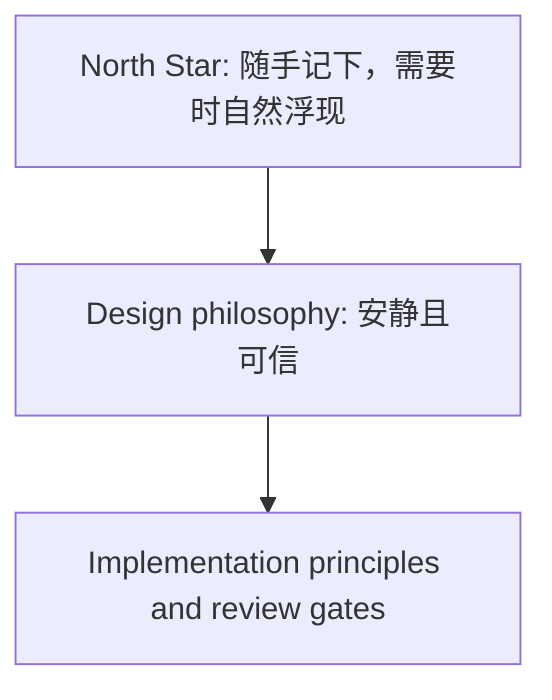

# PA Product North Star

Updated: 2026-07-02

## Status

| Field | Value |
| --- | --- |
| Document type | Product philosophy / design principle |
| Scope | PA Agent, Pagelet, Memory, Capture, Review, Maintenance, Action |
| Role | North Star for product design, SDD decisions, and implementation tradeoffs |
| Source decision | [PA product discussion 2026-07-02](./pa-product-discussion-2026-07-02.md) |
| Related research | [PA Agent AI insight research report](./pa-agent-ai-insight-research-report.md) |
| Related product doctrine | [Low-Burden Review Product Principles](./pa-low-burden-review-product-principles.md) |

This document records PA's product philosophy. It should stay shorter and more
stable than feature specs. Use it when a design decision is ambiguous.

## North Star

> 随手记下，需要时自然浮现。

English working form:

> Capture lightly. Let the right notes return when they matter.

PA's value is not making AI think for the user. PA's value is lowering the cost
of leaving real thoughts behind, then helping useful old notes return at the
right moment with evidence.

Expanded form:

> PA lets you capture thoughts with minimal friction, then lets worthwhile old
> notes naturally appear when they are useful - while keeping the vault orderly,
> reversible, and easier to reuse over time.

The default PA artifact is ignorable. The user should be able to read, close,
ignore, or dismiss a recall cue, digest, or insight candidate without creating
future debt. Explicit confirmation is required when PA will create durable
state, change future PA behavior, mutate the vault, or act outside the vault.

## Design Philosophy

> 安静且可信。

This is a design constraint, not the product's user-facing value proposition.
It describes how PA should deliver the North Star:

Quiet and trustworthy means PA should appear at natural breaks, show source
evidence, preserve the user's original thinking, and earn permission before
durable action.

## Research-Backed Principles

These principles summarize the 2026-07-02 product discussion and should guide
feature tradeoffs:

1. Organization is often the surface request; reuse at the right moment is the
   deeper user need.
2. Knowledge value comes from being reused, not merely being stored neatly.
3. AI should help users remember and reconnect their own thoughts before it
   tries to think for them.
4. "Knowledge compounding" is a metaphor, not a product promise; prefer reuse
   and return as concrete language.
5. Not every note deserves to be rescued. Low-value notes may naturally fade.
6. The most valuable recall is contextual and queryless.
7. Users welcome proactive help but resist autonomous control.

## Design Constraints

- Less management, more capture.
- Less generation, more return.
- Less interruption, more right-time presence.
- Less black-box insight, more source-backed evidence.
- Less full automation, more earned trust.
- Less tool jargon, more long-term companionship.

Review should feel like recognition, not administration.

> 回顾应该像“想起来了”，不是“又多了一组待处理”。

## Decay Principle

Do not use hard decay as the primary ranking mechanism. Use multi-signal
ranking instead.

| Signal | Role |
| --- | --- |
| Semantic relevance | Primary signal: decides whether something should appear. |
| Time freshness | Tie-breaker: favors newer notes when relevance is similar. |
| Connection density | Quality signal: linked or referenced notes may matter more. |
| Note richness | Quality signal: distinguishes deep notes from short temporary captures. |
| User feedback | Learning signal: repeated dismissal lowers priority. |

Hard time decay fails when many older same-topic notes are all highly
semantically related. PA should instead combine signals so old notes can still
return when they are truly useful, while noisy candidates quietly rank lower.

## Product Review Questions

Before adding or implementing a PA feature, ask:

- Does this lower the friction of capturing or revisiting real thoughts?
- Does this make the user's own notes more likely to return at the right time?
- Does this protect the user's original thinking?
- Does this connect ideas with evidence instead of producing black-box insight?
- Does this maintain the vault gently, with preview, recovery, or undo?
- Does this keep advanced AI capability behind a quiet product surface?
- Does this earn trust gradually instead of assuming broad permission?
- Can the user ignore this without future penalty?
- Is confirmation tied to a durable consequence rather than an AI sentence?
- Does this reduce more review burden than it creates?

If a feature does not pass these questions, it may still belong in an
engineering substrate, but it should not become a prominent product surface yet.

## What PA Should Avoid

- Do not become "ChatGPT inside Obsidian."
- Do not force users to become knowledge managers.
- Do not let AI content drown out the user's original notes.
- Do not interrupt often just to appear intelligent.
- Do not pursue fully automatic organization before trust exists.
- Do not turn human-in-the-loop safety into human-as-clickworker chores.
- Do not create queues, badges, or unresolved states for every AI candidate.
- Do not expose RAG, GraphRAG, VSS, agent, or memory jargon as product concepts.

## Final Principle

Capture should be light. Review should be natural. Connections should have
evidence. AI artifacts should be ignorable. Maintenance should be reversible.
Action should be earned. The right old notes should appear when they matter.
