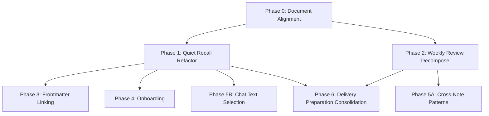

# PA Product Redesign Development Tracker

Updated: 2026-07-02
Plan: [pa-product-redesign-development-plan.md](./pa-product-redesign-development-plan.md)
Decisions: [pa-product-discussion-2026-07-02.md](./pa-product-discussion-2026-07-02.md)

## Status Legend

| Mark | Meaning |
|------|---------|
| `[ ]` | Todo |
| `[D]` | Drafting / mapping |
| `[R]` | Ready for review |
| `[A]` | Approved for implementation |
| `[~]` | Implementing |
| `[V]` | Review in progress |
| `[S]` | Obsidian smoke in progress |
| `[x]` | Done |
| `[!]` | Blocked |
| `[T]` | Triggered backlog only |

## Governance Rules

- A task may not move to `[~]` while its owning Phase has unapproved spec drift.
- Runtime implementation must not begin on `[D]`, `[R]`, `[V]`, or `[!]` tasks.
- If implementation reveals a spec conflict, **stop and record an amendment**
  before changing runtime semantics.
- Amendments that affect product semantics, privacy, provider cost, source-note
  mutation, or autonomy require explicit user approval.

---

## Dependency Map

Phase 0 is a prerequisite for all runtime work.
Phase 2 is independent of Phase 1 (can run in parallel).
Phase 3 and 4 require Phase 1 completion.
Phase 5A requires Phase 2 (pattern detection is a Weekly Review kernel).
Phase 5B can start after Phase 1.
Phase 6 depends on the shipped Quiet Recall/Weekly Review decomposition shape.
Periodic Summary's terminal migration into Recap time-range mode is approved;
runtime command/removal work was completed by the Phase 6 migration SDD.

---

## SPEC / Slice Index

| Slice | Tasks | User-Visible Value | Status | Gate |
|-------|-------|-------------------|--------|------|
| Phase 0: Document Alignment | P0.1-P0.3 | None (internal alignment) | `[x]` | Spec text review |
| Phase 1: Quiet Recall Refactor | P1.1-P1.6 | Vault-wide contextual recall with multi-signal ranking | `[x]` | Phase 0 done |
| Phase 2: Weekly Review Decompose | P2.1-P2.3 | Memory batch confirmation always available; weekly command retired | `[x]` | Phase 0 done |
| Phase 3: Frontmatter Linking | P3.1-P3.3 | One-click `pa-related` link in frontmatter from Recall | `[x]` | Phase 1 done |
| Phase 4: Onboarding | P4.1-P4.3 | Three one-time bridge nudges for new users | `[x]` | Phase 1 done |
| Phase 5: Chat + Patterns | P5.1-P5.2 | Chat text selection ops; cross-note pattern nudge | `[x]` | Phase 1+2 done |
| Phase 6: Delivery Preparation Consolidation | P6.0-P6.5 | Unified delivery candidate model for Bubble/Panel/Tab | `[x]` | Product amendment review + runtime smoke passed |

---

## Task Definitions

### Phase 0: Document Alignment

#### P0.1 — Update North Star document

- **Spec refs**: `pa-product-discussion-2026-07-02.md` § I
- **Status**: `[x]`
- **File**: `docs/pa-product-north-star.md`
- **Scope**:
  - Replace North Star statement with "随手记下，需要时自然浮现"
  - Replace the old English short form with the new Chinese + English pair
  - Demote "安静且可信" from North Star to Design Philosophy section
  - Preserve 6 "Less X, more Y" principles under Design Constraints
  - Add 7 research-backed design principles from discussion § III
  - Add decay principle (multi-signal ranking, no hard decay)
- **Non-goals**: No code changes. No runtime behavior changes.
- **Acceptance**:
  - The old English short form no longer appears in `docs/pa-product-north-star.md`
  - "安静且可信" appears under "Design Philosophy" not under "North Star"
  - New North Star appears at the top of the document
- **Validation**: `git diff --check`

#### P0.2 — Update AGENTS.md and CLAUDE.md

- **Spec refs**: `pa-product-discussion-2026-07-02.md` § I, § II
- **Status**: `[x]`
- **Files**: `AGENTS.md`, `CLAUDE.md`
- **Scope**:
  - Update Product North Star section to reference new North Star
  - Move "安静且可信" to a Design Philosophy sub-section
  - Replace the old English short form
- **Non-goals**: No changes to dev commands, architecture rules, or release rules.
- **Acceptance**:
  - The old English short form no longer appears in `AGENTS.md` or `CLAUDE.md`
  - AGENTS.md § Product North Star matches `pa-product-north-star.md`
- **Validation**: `git diff --check`

#### P0.3 — Add spec drift callouts to affected specs

- **Spec refs**: `pa-product-discussion-2026-07-02.md` § "文档关系"
- **Status**: `[x]`
- **Files**: `docs/pa-quiet-recall-insight-timing-product-spec.md`,
  `docs/pa-weekly-review-product-spec.md`,
  `docs/pagelet-product-design.md`
- **Scope**:
  - Add a `> [!warning]` callout at the top of each file referencing
    the 2026-07-02 discussion decisions
  - Quiet Recall spec: note candidate pool expansion, trigger model change
  - Weekly Review spec: note decomposition decision
  - Pagelet product design: note onboarding bridge nudge design (Discussion § VI)
- **Non-goals**: Do not rewrite the specs. Callout only.
- **Acceptance**: Each file has a callout in the first 5 lines
- **Validation**: `git diff --check`

---

### Phase 1: Quiet Recall Refactor

#### P1.1 — Extend candidate pool data model

- **Spec refs**: Discussion § V.1 "候选池扩展"
- **Status**: `[x]`
- **File**: `src/pa/quiet-recall.ts`
- **Scope**:
  - Define `QuietRecallVaultNote` interface (path, title, content,
    tags, links, backlinks, modifiedAt, createdAt)
  - Add `vaultNotes?: readonly QuietRecallVaultNote[]` to
    `QuietRecallBuildInput`
  - Keep `savedInsights` field — both candidate sources coexist
  - **CRITICAL**: Make `sourceInsightId` on `QuietRecallCandidate`
    optional (`sourceInsightId?: string`). Vault-note candidates
    have no source insight. Also update `QuietRecallBubbleNudge`
    to make `sourceInsightId` optional. Callers of these fields
    must handle `undefined` (check `quietRecallCandidateToSavedInsightInput`,
    `quietRecallCandidateToReviewQueueInput`, and
    `coerceQuietRecallSaveResult`).
- **Non-goals**: No scoring changes yet. No plugin.ts wiring yet.
- **Acceptance**:
  - `QuietRecallBuildInput` type accepts both `savedInsights` and
    `vaultNotes`
  - `QuietRecallCandidate` can be constructed without `sourceInsightId`
  - Existing tests pass unchanged (vaultNotes is optional)
- **Tests**: Type compilation test; existing quiet-recall tests green;
  new test: vault-note candidate has no sourceInsightId
- **Validation**: `npm run build && npm test -- quiet-recall`

#### P1.2 — Implement multi-signal scoring model

- **Spec refs**: Discussion § III "衰减原则", § V.1
- **Status**: `[x]`
- **Prerequisite**: P1.1
- **File**: `src/pa/quiet-recall.ts`
- **Scope**:
  - Define `RecallScoreSignals` interface (semanticRelevance,
    timeFreshness, connectionDensity, noteRichness, userFeedback)
  - Implement `computeRecallScore(signals): number` with weighted sum
  - Replace fixed `CURRENT_RELEVANCE_BASE`/`RELATED_RELEVANCE_BASE`/
    `FAR_ASSOCIATION_CAP` with signal-based scoring for vault note
    candidates
  - **Keep existing scoring for SavedInsight candidates unchanged** as
    a baseline until vault-note scoring is validated
  - Semantic relevance is the primary signal; others are tie-breakers
- **Non-goals**: No VSS integration yet. No metadataCache fallback yet.
  Score computation is pure — inputs come from caller.
- **Acceptance**:
  - vault note with high semantic + low time gets higher score than
    vault note with low semantic + high time
  - Saved Insight scoring path unchanged
- **Tests**:
  - `computeRecallScore` unit tests for signal weight ordering
  - Score comparison: semantic dominates; time breaks ties
  - Edge cases: all signals zero, all signals max
- **Validation**: `npm test -- quiet-recall`

#### P1.3 — Implement VSS + metadataCache hybrid retrieval

- **Spec refs**: Discussion § V.1 "混合：VSS 可用时用 embedding"
- **Status**: `[x]`
- **Prerequisite**: P1.1, P1.2
- **File**: `src/plugin.ts` (method `runQuietRecall`)
- **Scope**:
  - New method `collectQuietRecallVaultNotes()` — pattern follows
    existing `collectGraphDiscoveryNotes()`
  - Check VSS readiness via `isMemoryReadyForPageletDiscovery()`
    (uses `this.vss.getStats()` internally):
    - **VSS ready**: use `findRelatedNotes` (existing VSS hybrid search)
      to get semantically related notes, map to `QuietRecallVaultNote[]`
    - **VSS not ready**: use `metadataCache` to find structurally
      related notes (shared tags, links, backlinks, same folder)
  - Pass collected notes as `vaultNotes` to `buildQuietRecallCandidates`
  - Cap at 40 candidate notes (same as Graph Discovery)
  - Apply Data Boundary: exclude `isDataBoundaryAllowedFile` failures
- **Non-goals**: No UI changes. No trigger changes.
- **Acceptance**:
  - With VSS ready: vault notes appear in Quiet Recall candidates
  - With VSS not ready: structurally related notes appear instead
  - Excluded-folder notes never appear
- **Tests**:
  - Mock VSS ready → verify embedding-based candidates
  - Mock VSS not ready → verify metadataCache fallback
  - Data Boundary exclusion test
- **Validation**: `npm test -- quiet-recall && npm run build`

#### P1.4 — Add "open note" and "save after" triggers

- **Spec refs**: Discussion § V.1 "触发模型"
- **Status**: `[x]`
- **Prerequisite**: P1.3
- **File**: `src/pagelet/orchestrator.ts`
- **Scope**:
  - **Open/switch note trigger**: In `handleLeafChange()` (line 781),
    after Pet remount, add a call to `prepareQuietRecallBubbleNudge()`
    if conditions allow. Note: `canPrepareQuietRecallBubbleNudge()`
    and `prepareQuietRecallBubbleNudge()` already exist (lines 1206
    and 1228) — this task adds a NEW call site, not new methods.
  - **Save-after trigger**: The orchestrator already listens for
    `vault.on("modify")` at line 293, which calls `handleNoteActivity()`
    → `prepareQuietRecallBubbleNudge()` at line 1109. Verify this path
    works with the expanded vault-wide candidate pool from P1.3.
    If the existing modify listener is sufficient, document it;
    if not, adjust the debounce or add explicit save detection.
  - Add debounce for open-note: use existing `quietRecallNudgeRunId`
    token pattern to cancel stale runs on rapid note switching
  - Respect Focus Mode (`if (this.host.settings.focusMode) return`)
- **Non-goals**: No keyboard shortcut yet.
- **Acceptance**:
  - Switching to a note triggers Quiet Recall preparation
  - Saving a note (Cmd+S / autosave) triggers Quiet Recall preparation
  - Rapid switching (3 notes in 1 second) only triggers for the final note
  - Focus Mode suppresses both triggers
- **Tests**:
  - Mock leaf change → verify prepareQuietRecallBubbleNudge called
  - Mock vault modify event → verify recall preparation fires
  - Mock rapid changes → verify only last one proceeds
  - Mock focusMode = true → verify no call
- **Validation**: `npm test -- pagelet-orchestrator`

#### P1.5 — Add keyboard shortcut trigger

- **Spec refs**: Discussion § V.1 "快捷键（如双击 Ctrl）"
- **Status**: `[x]`
- **Prerequisite**: P1.3
- **File**: `src/pagelet/orchestrator.ts`, `src/plugin.ts`
- **Scope**:
  - Existing command `pa-pagelet:quiet-recall` already registered
  - Add double-key detection: listen for Ctrl keydown, if two Ctrl
    presses within 300ms, trigger `runQuietRecall()` via the
    orchestrator command callback
  - Platform consideration: detect `ctrlKey` on Windows/Linux,
    consider making the double-tap key configurable in settings
  - Register keyboard listener in orchestrator constructor, remove
    in destroy
- **Non-goals**: No macOS Cmd double-tap (defer to user setting Obsidian
  hotkey). No settings UI for key configuration yet.
- **Acceptance**:
  - Double-tap Ctrl within 300ms triggers Quiet Recall
  - Single Ctrl press does not trigger
  - Listener cleaned up on destroy
- **Tests**:
  - Simulate two keydown events within 300ms → verify trigger
  - Simulate single keydown → verify no trigger
  - Simulate keydown after destroy → verify no trigger
- **Validation**: `npm test -- pagelet-orchestrator && make deploy`

#### P1.6 — Quiet Recall test suite update

- **Spec refs**: All P1 tasks
- **Status**: `[x]`
- **Prerequisite**: P1.2, P1.3
- **File**: `__tests__/quiet-recall.test.ts`
- **Scope**:
  - New test cases for vault note candidates:
    - Vault notes scored by multi-signal model
    - Vault notes coexist with Saved Insight candidates
    - Vault notes filtered by isPathAllowed
    - Empty vault + non-empty insights = insights-only candidates
    - Non-empty vault + empty insights = vault-only candidates
  - Scoring model edge cases:
    - Short note (< 50 chars) gets lower noteRichness
    - Note with 5+ backlinks gets higher connectionDensity
    - Note dismissed 3 times gets lower userFeedback score
- **Non-goals**: No integration tests (those require Obsidian runtime).
- **Acceptance**: All new + existing tests green
- **Validation**: `npm test -- --runInBand quiet-recall`

---

### Phase 2: Weekly Review Decompose

#### P2.1 — Extract Memory batch confirmation to Pagelet Tab

- **Spec refs**: Discussion § V.2 "Memory 候选批量确认"
- **Status**: `[x]`
- **Prerequisite**: Phase 0 done
- **Files**: `src/pagelet/tab/TabView.ts`, `src/pagelet/orchestrator.ts`,
  `src/plugin.ts`
- **Scope**:
  - Add a "Memory Candidates" section to the existing Memory Governance
    tab in TabView — shows `memory_candidate` / `memory_conflict` items
    from Review Queue
  - Section is always visible (not weekly-bound)
  - Reuse `memoryQueueItems()` filter logic from `weekly-review.ts`
    (extract to a shared function or inline)
  - Provide batch confirm/dismiss actions per item
  - Orchestrator wires data from `listReviewQueueItems({ types: ["memory_candidate", "memory_conflict"] })`
- **Non-goals**: No cross-note pattern detection. No Weekly Review command changes yet.
- **Acceptance**:
  - Pagelet Tab shows pending Memory Candidates without running Weekly Review
  - User can confirm/dismiss individual candidates
  - Empty state: "No memory candidates pending" message
- **Tests**:
  - TabView renders memory candidates from queue
  - Confirm action calls `confirmCandidate` → record appears in governance store
  - Empty queue shows empty state
- **Validation**: `npm test -- pagelet-panel-tab-view && make deploy`

#### P2.2 — Implement cross-note pattern detection

- **Spec refs**: Discussion § V.2 "跨笔记模式检测", Plan Phase 5.2
- **Status**: `[x]`
- **Prerequisite**: Phase 0 done
- **File**: New `src/pa/pattern-detection.ts`
- **Scope**:
  - `detectCrossNotePatterns(notes: PatternDetectionInput[]): PatternDetectionResult`
  - Input: recently active notes (7-14 days, provided by caller)
  - Detection dimensions (structure-based, no LLM required):
    - Recurring tags: >= 3 notes sharing the same tag
    - Repeated questions: >= 2 notes with `?` sentence patterns
    - Orphan clusters: notes with no links to/from each other but
      similar tags/folders
  - Each pattern carries `sourceRefs`, `whyShown`, and `patternType`
  - Trigger logic: caller checks `lastPatternDetection` timestamp,
    runs if >= 3 days since last run AND >= 5 active notes
  - Output only — triggering and nudge display are handled by P2.3
- **Non-goals**: No LLM-based tension/conflict detection (future
  enhancement after structure-based detection is validated). No
  dedicated UI — results shown in Pagelet Tab detail view. No
  trigger/nudge wiring (that's P2.3).
- **Acceptance**:
  - 5 notes with 3 sharing tag `#project-x` → pattern detected
  - < 5 active notes → no detection triggered
  - Detection result includes sourceRefs pointing to actual notes
- **Tests**:
  - Recurring tag detection
  - Question pattern detection
  - Below-threshold input → empty result
  - sourceRefs validity
- **Validation**: `npm test -- pattern-detection`

#### P2.3 — Retire Weekly Review command, wire pattern detection nudge

- **Spec refs**: Discussion § V.2 "结论：Weekly Review 作为独立功能拆解"
- **Status**: `[x]`
- **Prerequisite**: P2.1, P2.2
- **Files**: `src/pagelet/orchestrator.ts`, `src/pagelet/commands.ts`,
  `src/plugin.ts`, `src/pagelet/PageletHost.ts`, `src/pa/weekly-review.ts`,
  `src/settings.ts`
- **Scope**:
  - **Weekly Review retirement**:
    - Remove `runWeeklyReview()` from orchestrator
    - Remove `PAGELET_WEEKLY_REVIEW_COMMAND_ID` from commands.ts registration
    - Remove `runWeeklyReview()` and `saveWeeklyReviewNote()` from plugin.ts
    - Remove `runWeeklyReview` and `saveWeeklyReviewNote` from PageletHost
    - Mark `buildWeeklyReview`, `buildWeeklyReviewMarkdown`,
      `buildWeeklyReviewGeneratedNote` as `@deprecated` in weekly-review.ts
    - Mark `weeklyReview` settings block as `@deprecated` but preserve
      for data compatibility
  - **Pattern detection nudge wiring**:
    - In `plugin.ts` `onIdle()` (line 694), after pagelet runtime sync:
      check trigger conditions (>= 5 active notes in 14 days AND
      >= 3 days since last detection)
    - Call `detectCrossNotePatterns()` from `pattern-detection.ts`
      with recently modified vault files
    - If patterns found, notify orchestrator to show Bubble nudge
    - User clicks nudge → open Pagelet Tab detail view with pattern list
    - Add `detectCrossNotePatterns` to PageletHost interface
    - Track `lastPatternDetectionAt` timestamp in settings
  - Update i18n: remove weekly review command labels, add pattern
    detection nudge labels
- **Non-goals**: Do not delete weekly-review.ts or test file. No
  LLM-based detection.
- **Acceptance**:
  - `pa-pagelet:weekly-review` command no longer exists in palette
  - Memory batch confirmation works from Pagelet Tab (P2.1)
  - Pattern detection nudge appears when 5+ notes with shared tags
    in 14 days and >= 3 days since last detection
  - All existing tests pass
- **Validation**: `npm test -- --runInBand && npm run build && npm run lint`

---

### Phase 3: Frontmatter Linking

#### P3.1 — Implement frontmatter write utility

- **Spec refs**: Discussion § V.4 "通过 Frontmatter"
- **Status**: `[x]`
- **Prerequisite**: Phase 1 done
- **File**: New `src/pa/frontmatter-link.ts`
- **Scope**:
  - `addPaRelatedLink(app, sourcePath, targetPath, options?)`:
    - Uses `app.fileManager.processFrontMatter()`
    - Reads `fm['pa-related']` (expects array or creates one)
    - Adds `[[targetPath]]` string (deduplicates)
    - Optional `bidirectional: true` → also adds reverse link
    - Returns `{ ok: boolean; reason?: string }`
  - `removePaRelatedLink(app, sourcePath, targetPath)`:
    - Removes a specific link from `pa-related` array
    - Returns `{ ok: boolean }`
  - Error handling: file not found, frontmatter parse failure,
    pa-related is not an array (coerce to array)
- **Non-goals**: No UI. No orchestrator wiring.
- **Acceptance**:
  - After `addPaRelatedLink`, the target file's frontmatter contains
    `pa-related: ["[[sourcePath]]"]`
  - Duplicate adds are idempotent
  - Bidirectional creates entries in both files
- **Tests**:
  - Add to note with no frontmatter
  - Add to note with existing frontmatter (no pa-related)
  - Add to note with existing pa-related (dedup)
  - Bidirectional link
  - Remove link
  - File not found error
- **Validation**: `npm test -- frontmatter-link`

#### P3.2 — Add "Link" action to Quiet Recall UI

- **Spec refs**: Discussion § V.4
- **Status**: `[x]`
- **Prerequisite**: P3.1, Phase 1 done
- **Files**: `src/pagelet/tab/TabView.ts`,
  `src/pagelet/bubble/BubbleContent.ts`,
  `src/pagelet/orchestrator.ts`, `src/pagelet/PageletHost.ts`
- **Scope**:
  - Add "Link to current note" button on Quiet Recall candidate cards
    (both Bubble and Tab views)
  - Button calls orchestrator → host → `addPaRelatedLink()`
  - On success: button changes to "Linked" (disabled state)
  - On failure: show error via PA notification style
  - Add `linkRecallCandidate(candidatePath)` to PageletHost interface
  - Orchestrator gets the active file path from workspace
- **Non-goals**: No batch linking. No removal UI (user can manually
  edit frontmatter).
- **Acceptance**:
  - User clicks "Link" on a recall candidate → frontmatter updated
  - Graph View shows the new link
  - Button state changes to "Linked"
  - Data Boundary is checked before linking (don't link to excluded files)
- **Tests**:
  - Mock link action → verify addPaRelatedLink called with correct paths
  - Mock success → verify button state change
  - Mock failure → verify error display
- **Validation**: `npm test -- pagelet-panel-tab-view && make deploy`

#### P3.3 — Frontmatter linking integration test

- **Spec refs**: Discussion § V.4 "已验证：Obsidian v1.4+"
- **Status**: `[x]`
- **Prerequisite**: P3.2
- **File**: `__tests__/frontmatter-link.test.ts`
- **Scope**:
  - End-to-end test: create note → add pa-related → verify YAML output
  - Verify `[[wikilink]]` format in the array
  - Verify bidirectional creates symmetric entries
- **Acceptance**: All tests green
- **Validation**: `npm test -- --runInBand frontmatter-link`

---

### Phase 4: Onboarding

#### P4.1 — Extend onboarding state model

- **Spec refs**: Discussion § VI
- **Status**: `[x]`
- **Prerequisite**: Phase 1 done
- **Files**: `src/settings/pagelet/index.ts`, `src/settings.ts`
- **Scope**:
  - Extend settings with three new boolean flags:
    - `maintenanceScanSuggested: boolean` (default false)
    - `quickCaptureExplained: boolean` (default false)
    - `quietRecallExplained: boolean` (default false)
  - Backward compatible: existing `onboardingShown` stays as-is
    within `settings.pagelet` namespace (no rename needed)
  - Add merge functions for new fields
- **Non-goals**: No UI changes. No trigger logic.
- **Acceptance**:
  - Settings load/save correctly with new fields
  - Old settings without new fields default to false
- **Tests**: Settings merge test for new fields
- **Validation**: `npm test -- settings`

#### P4.2 — Implement three onboarding triggers

- **Spec refs**: Discussion § VI "一次性桥梁引导"
- **Status**: `[x]`
- **Prerequisite**: P4.1
- **Files**: `src/pagelet/orchestrator.ts`, `src/plugin.ts`,
  `src/quick-capture.ts`
- **Scope**:
  - **Maintenance scan trigger**: In `plugin.ts` `onIdle()` (line 694),
    check `!maintenanceScanSuggested && vault.getMarkdownFiles().length > 50`
    → show Bubble nudge → set flag true
  - **Quick Capture trigger**: After `QuickCaptureService.captureText()`
    succeeds, check `!quickCaptureExplained` → show Bubble nudge
    via a callback to orchestrator → set flag true
  - **Quiet Recall trigger**: In `prepareQuietRecallBubbleNudge()`,
    on first successful candidate surfacing, check
    `!quietRecallExplained` → append explanation text to nudge
    → set flag true
  - All nudges use BubbleContent builders (PA unified style),
    NOT `new Notice()`
- **Non-goals**: No settings UI for toggling onboarding.
- **Acceptance**:
  - Each trigger fires exactly once
  - After setting flag, trigger never fires again
  - All use Bubble/Pet notification, not Obsidian Notice
- **Tests**:
  - Mock vault > 50 files → verify maintenance nudge fires once
  - Mock capture success → verify capture nudge fires once
  - Mock recall candidate → verify recall nudge fires once
  - Mock flag already set → verify no nudge
- **Validation**: `npm test -- pagelet-orchestrator && make deploy`

#### P4.3 — Onboarding i18n

- **Spec refs**: Discussion § VI
- **Status**: `[x]`
- **Prerequisite**: P4.2
- **Files**: `src/locales/pagelet/en.json`, `src/locales/pagelet/zh.json`
- **Scope**: Add i18n keys for three onboarding messages (en + zh)
- **Acceptance**: en/zh key parity maintained
- **Validation**: `npm run build`

---

### Phase 5: Chat Text Selection + Cross-Note Patterns

#### P5.1 — Chat text selection operations

- **Spec refs**: Discussion § V.6, § IV "Chat — 基础能力"
- **Status**: `[x]`
- **Prerequisite**: Phase 0 done (no dependency on Phase 1)
- **Files**: `src/ai-services/chat-tool-factories.ts`,
  `src/chat/chat-view.ts`
- **Scope**:
  - Enhance existing `get_current_note_context` tool (defined at
    `src/ai-services/chat-tool-factories.ts` line 325 via
    `createCurrentNoteContextTool()`): selection reading already
    partially implemented at line 399 (`editor.getSelection()`).
  - New tool `replace_selection`: replaces editor selection with
    AI-generated text
    - Gated by `operationsAgentEnabled` — if false, tool not registered
    - Uses `editor.replaceSelection()` Obsidian API
  - In Chat UI: detect when editor has selection, show contextual
    hint "You have text selected — try asking to summarize, translate,
    or explain it"
  - i18n for hint text
- **Non-goals**: No Quick Command menu (Copilot-style popup). No
  floating toolbar. Chat-based interaction only.
- **Acceptance**:
  - User selects text, opens Chat, asks "summarize this" → AI sees
    selected text and responds
  - User asks "rewrite this in simpler language" with
    `operationsAgentEnabled=true` → selection replaced
  - `operationsAgentEnabled=false` → replace_selection tool not
    available; AI responds in chat only
- **Tests**:
  - Mock editor with selection → verify tool reads selection
  - Mock replace_selection call → verify editor.replaceSelection called
  - Mock operationsAgentEnabled=false → verify tool not registered
- **Validation**: `npm test -- ai-service && make deploy`

#### P5.2 — Pattern detection Tab detail view

- **Spec refs**: Discussion § V.2
- **Status**: `[x]`
- **Prerequisite**: P2.3 (nudge wiring done)
- **Files**: `src/pagelet/tab/TabView.ts`, `src/pagelet/orchestrator.ts`
- **Scope**:
  - Implement the Tab detail view that opens when user clicks the
    pattern detection Bubble nudge (wired in P2.3)
  - Render pattern list: recurring tags, repeated questions,
    orphan clusters — each with sourceRefs and whyShown
  - Provide actions: dismiss pattern, link related notes
    (via frontmatter `pa-related` from P3)
- **Non-goals**: No LLM-based detection. No pattern editing.
- **Acceptance**:
  - Clicking pattern nudge opens a detail view with pattern cards
  - Each card shows sourceRefs pointing to actual notes
  - Dismiss action removes the pattern from the current view
- **Tests**:
  - TabView renders pattern cards from detection result
  - sourceRefs are clickable
  - Dismiss action works
- **Validation**: `npm test -- pagelet-panel-tab-view && make deploy`

---

### Phase 6: Delivery Preparation Consolidation

#### P6.0 — Inventory overlapping Pagelet preparation capabilities

- **Spec refs**:
  [pagelet-delivery-preparation-consolidation-product-note.md](./pagelet-delivery-preparation-consolidation-product-note.md)
- **Status**: `[D]`
- **Scope**:
  - Map Periodic Summary, Scope Recap, Background Preparation / Preload,
    Quiet Recall, and Pattern Detection entrypoints.
  - Record trigger type, source scope, output object, cache/persistence,
    Panel/Tab route, Bubble visibility, and durable actions.
  - Separate redundant product capabilities from merely confusing names or
    triggers.
- **Non-goals**: No runtime deletion. No command removal.
- **Acceptance**: Inventory table exists in the consolidation product note or a
  follow-up SDD.
- **Decision gate**: Product direction is resolved. Runtime migration details
  move to P6.5.

#### P6.1 — Define DeliveryCandidate contract

- **Spec refs**:
  [pagelet-bubble-readiness-and-recall-sdd.md](./pagelet-bubble-readiness-and-recall-sdd.md)
  § 1.1
- **Status**: `[D]`
- **Scope**:
  - Define a shared delivery candidate contract for `recall`, `recap`,
    `pattern`, and `review`.
  - Include sourceRefs, why-now, preparedAt, staleStatus, route, and active-card
    actions.
  - Ensure Bubble can consume delivery candidates without exposing old feature
    boundaries.
- **Non-goals**: No persistence decision beyond in-memory candidate delivery.
- **Acceptance**: SDD includes candidate contract and adapters required for the
  first runtime slice.

#### P6.2 — Implement Bubble single-visible-card stack

- **Spec refs**:
  [pagelet-bubble-readiness-and-recall-product-spec.md](./pagelet-bubble-readiness-and-recall-product-spec.md)
  § 3.3
- **Status**: `[D]`
- **Scope**:
  - Default to one visible card.
  - Support up to three high-quality distinct cards.
  - Desktop: restrained arrows/dots.
  - Mobile/tablet: horizontal swipe.
  - Every action binds to the active card only.
  - Respect reduced motion.
- **Non-goals**: No external Bootstrap/template dependency; no runtime
  `innerHTML` or style injection.
- **Acceptance**: Unit tests cover active-card action routing; Obsidian desktop
  and mobile-sized smoke verify switching.

#### P6.3 — Adapt Quiet Recall to DeliveryCandidate

- **Status**: `[D]`
- **Scope**:
  - Adapt existing `QuietRecallCandidate` / `QuietRecallBubbleNudge` into
    delivery cards.
  - Preserve existing dismiss/later/feedback/link behavior.
  - Bubble actions are `Open`, `Link to current`, `Later`.
  - `Save as insight` remains Panel/Tab only.
- **Non-goals**: Do not create an incompatible parallel `RecallResult` runtime
  model unless a later SDD proves it is needed.
- **Acceptance**: Existing Quiet Recall tests remain green; new Bubble tests
  verify active-card action routing and active-note snapshot validation.

#### P6.4 — Define prepared Recap Delivery runtime

- **Status**: `[D]`
- **Scope**:
  - Promote Scope Recap as the Recap Delivery substrate.
  - Use local derived cache for prepared recap artifacts. The artifact must
    contain enough structured detail for Panel/Tab, including recap items,
    sourceRefs, source coverage, stale status, preparedAt, scope/range, and
    skipped-source metadata where relevant.
  - Do not auto-write Markdown recap notes and do not store full raw provider
    output.
  - Default recap scope is current-context + time-range, not daily/weekly
    whole-vault summary.
  - Allowed preparation signals: Pagelet open, current note save, and
    low-frequency idle preparation with budget limits.
  - Define how a fresh prepared recap artifact is created, cached, invalidated,
    and routed to Panel/Tab.
  - Ensure Bubble never shows a recap card when no prepared recap exists.
  - Ensure Bubble never uses "PA can build a recap" as a delivery substitute.
- **Non-goals**: No foreground Generate Summary CTA in Bubble. No automatic
  Markdown recap writes. No whole-vault weekly summary default.
- **Acceptance**: SDD defines prepared recap lifecycle, stale policy, source
  coverage, Data Boundary behavior, cache schema, budget limits, and
  no-prepared-artifact empty behavior.

#### P6.5 — Migrate Periodic Summary to Time-range Recap

- **Status**: `[D]`
- **Scope**:
  - Treat Periodic Summary as a removed legacy surface whose value moves to the
    Recap time-range mode.
  - Directly remove old `Generate summary` / Periodic Summary entrypoints after
    command usage and locale strings are audited. Do not keep alias or redirect.
  - Retire the standalone Periodic Summary product concept from user-facing
    copy, docs, and long-term architecture.
  - Add tests that old Bubble/command entrypoints are absent and replacement
    Recap routes are present.
- **Non-goals**:
  - No Bubble foreground `Generate summary` CTA.
  - No hidden automatic weekly summary write.
  - No default Markdown write without explicit user confirmation.
- **Acceptance**: Phase 6 migration SDD records command/Panel/Tab replacement
  paths, locale cleanup, tests, release-note language, absence of alias/redirect,
  and Obsidian smoke gates.

---

## Phase Ledger

| Phase | Spec Review | Dev | Test | Code Review | Deploy | Smoke | Status |
|-------|-------------|-----|------|-------------|--------|-------|--------|
| 0 | `[x]` | `[x]` | N/A | N/A | N/A | N/A | `[x]` |
| 1 | `[x]` | `[x]` | `[x]` | `[x]` | `[x]` | `[x]` | `[x]` |
| 2 | `[x]` | `[x]` | `[x]` | `[x]` | `[x]` | `[x]` | `[x]` |
| 3 | `[x]` | `[x]` | `[x]` | `[x]` | `[x]` | `[x]` | `[x]` |
| 4 | `[x]` | `[x]` | `[x]` | `[x]` | `[x]` | `[x]` | `[x]` |
| 5 | `[x]` | `[x]` | `[x]` | `[x]` | `[x]` | `[x]` | `[x]` |
| 6 | `[x]` | `[x]` | `[x]` | `[x]` | `[x]` | `[x]` | `[x]` |

---

## Task Status Table

| Task | Spec Refs | Status | Owner | Branch/Commit | Validation | Smoke | Notes |
|------|-----------|--------|-------|---------------|------------|-------|-------|
| P0.1 | Discussion §I | `[x]` | Codex | — | Old English short-form grep returned no output; `git diff --check` passed | N/A | North Star rewritten to new baseline |
| P0.2 | Discussion §I,II | `[x]` | Codex | — | Old English short-form grep returned no output; `git diff --check` passed | N/A | AGENTS/CLAUDE product standard synced |
| P0.3 | Discussion §文档关系 | `[x]` | Codex | — | Callouts added in first 5 lines; `git diff --check` passed | N/A | Quiet Recall, Weekly Review, Pagelet specs marked drifted |
| P1.1 | Discussion §V.1 | `[x]` | Codex | — | `npm test -- --runInBand quiet-recall`; `make deploy` | Pagelet runner PASS | Vault-note candidate data model added |
| P1.2 | Discussion §III,V.1 | `[x]` | Codex | — | `npm test -- --runInBand quiet-recall`; `make deploy` | Pagelet runner PASS | Multi-signal scoring keeps SavedInsight path separate |
| P1.3 | Discussion §V.1 | `[x]` | Codex | — | `npm test -- --runInBand quiet-recall pagelet-orchestrator`; `make deploy` | Pagelet runner PASS | VSS-ready and metadata fallback paths covered |
| P1.4 | Discussion §V.1 | `[x]` | Codex | — | `npm test -- --runInBand pagelet-orchestrator`; `make deploy` | Pagelet runner PASS | Open-note and save-after triggers covered; follow-up serialized Bubble nudge preparation |
| P1.5 | Discussion §V.1 | `[x]` | Codex | — | `npm test -- --runInBand pagelet-orchestrator`; `make deploy` | Pagelet runner PASS | Double-Ctrl trigger and teardown covered |
| P1.6 | All P1 | `[x]` | Codex | — | `npm test -- --runInBand quiet-recall`; full Jest | Pagelet runner PASS | Quiet Recall suite expanded |
| P2.1 | Discussion §V.2 | `[x]` | Codex | — | `npm test -- --runInBand pagelet-panel-tab-view pagelet-orchestrator`; `make deploy` | Pagelet panel screenshot | Memory candidates render from Review Queue |
| P2.2 | Discussion §V.2 | `[x]` | Codex | — | `npm test -- --runInBand pattern-detection`; full Jest | Pagelet runner PASS | Structure-only pattern detector added |
| P2.3 | Discussion §V.2 | `[x]` | Codex | — | `npm test -- --runInBand pagelet-commands pagelet-orchestrator`; `make deploy` | Runner confirms retired command absent | Weekly command retired; pattern nudge wired |
| P3.1 | Discussion §V.4 | `[x]` | Codex | — | `npm test -- --runInBand frontmatter-link`; full Jest | Disposable Obsidian link smoke PASS | `pa-related` utility added; follow-up added target preflight and source rollback |
| P3.2 | Discussion §V.4 | `[x]` | Codex | — | `npm test -- --runInBand pagelet-panel-tab-view pagelet-bubble-content pagelet-bubble-coordinator`; `make deploy` | Disposable Obsidian link smoke PASS | Recall Link action wired through host; follow-up carries stable source path |
| P3.3 | Discussion §V.4 | `[x]` | Codex | — | `npm test -- --runInBand frontmatter-link`; full Jest | Disposable Obsidian link smoke PASS | Bidirectional wikilink output verified with failure rollback coverage |
| P4.1 | Discussion §VI | `[x]` | Codex | — | `npm test -- --runInBand pagelet-settings`; full Jest | Pagelet runner PASS | One-time onboarding flags merge/save |
| P4.2 | Discussion §VI | `[x]` | Codex | — | `npm test -- --runInBand pagelet-orchestrator quick-capture pagelet-bubble-content`; `make deploy` | Pagelet panel/console smoke PASS | Bubble/Pet nudge paths only; one-time flags persist only after a nudge is surfaced |
| P4.3 | Discussion §VI | `[x]` | Codex | — | `npm run build`; full Jest | Pagelet runner PASS | en/zh onboarding copy added |
| P5.1 | Discussion §V.6 | `[x]` | Codex | — | `npm test -- --runInBand selection-tool-provider chat-view`; full Jest | Chat selection hint DOM + screenshot PASS | `replace_selection` direct execution is disabled until Write Action Framework wiring exists |
| P5.2 | Discussion §V.2 | `[x]` | Codex | — | `npm test -- --runInBand pagelet-panel-tab-view pattern-detection`; full Jest | Pagelet runner PASS | Pattern detail cards and dismiss/source refs covered |
| P6.0 | Delivery Preparation note | `[x]` | Codex | — | Docs inventory updated | N/A | Capability inventory and consolidation direction drafted |
| P6.1 | Bubble SDD §1.1 | `[x]` | Codex | — | `npx tsc -noEmit -skipLibCheck`; focused Bubble tests; full gate via `make deploy` | Obsidian Force Reload + Bubble smoke PASS | DeliveryCandidate contract and Recall/Recap adapters implemented |
| P6.2 | Bubble spec §3.3 | `[x]` | Codex | — | `npm test -- --runInBand pagelet-bubble-view pagelet-bubble-content pagelet-bubble-coordinator`; full gate via `make deploy` | Obsidian Bubble smoke PASS | Single-visible-card stack implemented; active-card action routing covered |
| P6.3 | Quiet Recall adapter | `[x]` | Codex | — | `npm test -- --runInBand pagelet-bubble-content pagelet-bubble-coordinator quiet-recall`; full gate via `make deploy` | Obsidian Bubble regression smoke PASS | Existing `QuietRecallCandidate` path feeds delivery cards; Discover click uses source-bound Bubble Recall |
| P6.4 | Recap Delivery | `[x]` | Codex | — | `npm test -- --runInBand pagelet-orchestrator scope-recap pagelet-bubble-coordinator`; full gate via `make deploy` | Obsidian prepared Recap Delivery smoke PASS | Scope Recap writes a local derived prepared artifact/cache; Bubble only shows fresh prepared candidates |
| P6.5 | Periodic Summary terminal migration | `[x]` | Codex/Product | — | `npx tsc -noEmit -skipLibCheck`; focused Pagelet tests; full gate via `make deploy`; legacy grep audit | Obsidian Bubble smoke confirms no Generate Summary CTA | Runtime command/generator/settings/locale entrypoints removed; no alias/redirect |

---

## Smoke Matrix

| Phase | User Action | Expected Behavior | Auto Check | Obsidian Smoke |
|-------|-------------|-------------------|------------|----------------|
| 1 | Open a note with 100+ notes in vault | Bubble shows 1-3 related old notes with whyNow | `npm test` | Deploy → open note → verify Recall nudge |
| 1 | Save a note (Cmd+S) | Recall nudge appears if relevant notes found | `npm test` | Deploy → edit → save → verify nudge |
| 1 | Double-tap Ctrl | Recall detail opens in Tab | `npm test` | Deploy → double-tap → verify Tab opens |
| 2 | Open Pagelet Tab | Memory Candidates section visible (if any pending) | `npm test` | Deploy → check Tab sections |
| 2 | Run old weekly-review command | Command not found in palette | Manual | Cmd+P → search "weekly" → not found |
| 3 | Click "Link" on Recall candidate | Frontmatter `pa-related` added, Graph View shows link | `npm test` | Deploy → Recall → Link → check frontmatter + graph |
| 4 | First install on vault > 50 notes | Maintenance scan suggestion nudge appears once | `npm test` | Deploy → clear onboarding flags → verify nudge |
| 5 | Select text in editor → open Chat | Chat hint about selection appears | `npm test` | Deploy → select → open Chat → verify hint |
| 6 | Multiple high-quality delivery candidates exist | Bubble shows one active card and supports card switching; actions apply to active card only | `npm test` | Deploy → desktop + mobile viewport smoke |
| 6 | Prepared recap exists | Bubble may show Recap Delivery and route to Panel/Tab detail | `npm test` | Deploy → prepared recap fixture smoke |
| 6 | No prepared recap exists | Bubble does not show recap CTA or foreground generation prompt | `npm test` | Deploy → open Bubble with no recap cache |

---

## Risk Table

| Risk | Owner | Status | Closure Condition |
|------|-------|--------|-------------------|
| Quiet Recall vault-level retrieval causes jank on large vaults | Dev | Mitigated / dogfood | Candidate cap and tests in place; benchmark on 1000+ note test vault for p95 < 500ms |
| Weekly Review removal causes regression if users depend on it | Product | Mitigated | Feature not yet in stable release; command absent in live smoke; call out in release notes |
| Frontmatter write causes sync conflicts on multi-device | Dev | Open | Local writes now preflight both files and roll back source additions on reverse-write failure; still test Obsidian Sync merge behavior |
| Double-tap Ctrl conflicts with system shortcuts | Dev | Open | Test on macOS/Windows/Linux; document known conflicts |
| Pattern detection false positives | Dev | Mitigated / dogfood | Structure-only detector shipped; validate precision before any LLM-based extension |
| Chat replace_selection bypasses write safety | Dev | Fixed / draft-only | Direct `execute()` no longer mutates the editor; enable real replacement only after Write Action Framework `executeWrite` wiring and preview/stale-reread tests |
| Delivery Preparation scope creep | Product/Dev | Mitigated | Phase 6 remains scoped to Bubble delivery/readiness, prepared Recap cache, Discover Recall adapter, and Periodic Summary removal |
| Recap Delivery degenerates into Generate Summary CTA | Product | Mitigated | Bubble smoke confirms Recap appears only from a fresh prepared local artifact; no "can build recap" copy or foreground Generate Summary entrypoint |
| Multi-card Bubble becomes a queue/list | UX | Mitigated | Single-visible-card stack, max 3 cards, active-card-only actions, no autoplay, no unresolved count; card-stack behavior covered by focused tests |

---

## Verification Log

| Date | Phase/Task | Command / Evidence | Result | Residual Risk |
|------|------------|-------------------|--------|---------------|
| 2026-07-02 | Phase 0 / P0.1-P0.3 | Old English short-form grep; `git diff --check` | Pass: old literal no longer appears; whitespace check clean | No runtime validation required for docs-only phase |
| 2026-07-02 | Phase 1 / P1.1-P1.6 | `npm test -- --runInBand quiet-recall pagelet-orchestrator`; full Jest via `make deploy` | Pass: vault-note candidates, scoring, trigger paths, and keyboard shortcut covered | Large-vault performance still needs dogfooding beyond test fixtures |
| 2026-07-02 | Phase 2 / P2.1-P2.3 | `npm test -- --runInBand pagelet-commands pagelet-orchestrator pagelet-panel-tab-view pattern-detection weekly-review`; full Jest via `make deploy` | Pass: Memory candidates shown independently; weekly command absent; pattern nudge/detail covered | Weekly review helper code remains deprecated for compatibility |
| 2026-07-02 | Phase 3 / P3.1-P3.3 | `npm test -- --runInBand frontmatter-link pagelet-panel-tab-view pagelet-bubble-content pagelet-bubble-coordinator pagelet-orchestrator`; disposable Obsidian link smoke | Pass: bidirectional `pa-related` write verified in deployed app | Multi-device sync conflict behavior remains a dogfooding risk |
| 2026-07-02 | Phase 4 / P4.1-P4.3 | `npm test -- --runInBand pagelet-settings quick-capture pagelet-bubble-content pagelet-bubble-coordinator pagelet-orchestrator`; full Jest via `make deploy` | Pass: one-time onboarding flags, triggers, and i18n covered | Real first-install experience depends on vault size/settings state |
| 2026-07-02 | Phase 5 / P5.1-P5.2 | `npm test -- --runInBand selection-tool-provider chat-view pagelet-panel-tab-view pattern-detection`; Chat selection DOM smoke | Pass: selection hint visible; `replace_selection` available only when Operations Agent runtime is mocked on and setting enabled | Production write-back remains hidden while `OPERATIONS_AGENT_RUNTIME_ENABLED=false` |
| 2026-07-02 | Full gate | `npm test -- --runInBand`; `npm run lint`; `npm run build`; `npx tsc -noEmit -skipLibCheck`; `git diff --check`; source scan for runtime style/HTML injection | Pass: 134 suites / 2267 tests; lint/build/type/whitespace clean; no source-scan matches | None for automated gate |
| 2026-07-03 | Review follow-up / P1-P5 fixes | `npm test -- --runInBand selection-tool-provider frontmatter-link pagelet-orchestrator pagelet-panel-tab-view review-queue-store`; `npx tsc -noEmit -skipLibCheck`; `npm run lint` | Pass: 5 suites / 89 tests; typecheck and lint clean | Obsidian app smoke not rerun in this follow-up pass |

---

## Validation Log

| Date | Phase/Task | Acceptance Evidence | Validation Evidence | Smoke Evidence | Notes |
|------|------------|--------------------|--------------------|----------------|-------|
| 2026-07-02 | Phase 0 / P0.1-P0.3 | New North Star in `docs/pa-product-north-star.md`, `AGENTS.md`, and `CLAUDE.md`; affected specs have top callouts | Old English short-form grep returned no output; `git diff --check` passed | N/A | Runtime work remains gated until subsequent phase prerequisites are met |
| 2026-07-02 | Phase 1 / Quiet Recall | Vault-note candidates coexist with saved insights; multi-signal ranking added; open/save/double-Ctrl triggers wired | Focused tests and full Jest via `make deploy` passed | Pagelet runner PASS after deploy/reload | Smoke did not force a provider-backed Quiet Recall run |
| 2026-07-02 | Phase 2 / Weekly Review decompose | `pa-pagelet:weekly-review` absent; Memory candidates available in Tab; pattern detector+nudge wired | Focused tests and full Jest via `make deploy` passed | `pagelet-smoke-runner.js` PASS; command list confirms weekly-review absent | Deprecated weekly-review helpers retained as compatibility guard |
| 2026-07-02 | Phase 3 / Frontmatter linking | `linkRecallCandidate()` writes bidirectional `pa-related` wikilinks and cleans up disposable fixture | Focused tests and full Jest via `make deploy` passed | Obsidian eval smoke returned `{ ok: true, message: "Linked" }`, `sourceHas=true`, `targetHas=true` | Temporary smoke folders cleaned; no persistent test-vault artifact |
| 2026-07-02 | Phase 4 / Onboarding | Maintenance scan, Quick Capture, and Quiet Recall first-use nudge paths implemented with BubbleContent builders | Focused tests and full Jest via `make deploy` passed | Pagelet panel runner and console smoke PASS; no captured errors | No `new Notice()` onboarding path introduced |
| 2026-07-02 | Phase 5 / Chat + Patterns | Chat selection hint appears with selected editor text; pattern detail cards render source refs and dismiss | Focused tests and full Jest via `make deploy` passed | Chat DOM: `.pa-chat-selection-hint` visible with expected text; screenshot `/private/tmp/pa-redesign-chat-selection.png`; Pagelet screenshot `/private/tmp/pa-redesign-pagelet-panel.png` | No Chat prompt/provider call was sent for selection-hint smoke |
| 2026-07-03 | Review follow-up fixes | Confirmed review findings addressed: draft-only `replace_selection`, atomic-ish `pa-related` linking, stable Recall Link source path, surfaced-only onboarding flags, queue-first Memory confirmation, Pet smoke assertion | Focused Jest, typecheck, and lint passed | Not run | Follow-up did not claim new Obsidian UI validation |
| 2026-07-05 | Phase 6 implementation pass | DeliveryCandidate adapters, Bubble B-type readiness resolver, single-card stack, Bubble Discover Recall, prepared Recap local cache, and Periodic Summary runtime removal are implemented in code | `npm test -- --runInBand pagelet-bubble-content pagelet-bubble-coordinator pagelet-bubble-view pagelet-orchestrator pagelet-settings pagelet-pet-state-machine pagelet-panel-tab-view e2e-pagelet-write scope-recap quiet-recall pagelet-commands`; `npm test -- --runInBand --detectOpenHandles pagelet-orchestrator pagelet-bubble-coordinator`; `npm test -- --runInBand`; `npm run lint`; `npm run build`; `npx tsc -noEmit -skipLibCheck`; `git diff --check`; community source scan; `make deploy` passed | PASS: Obsidian 1.13.1 test vault, Force Reload, pet click opens new Bubble; prepared Recap Delivery shows coverage, no `Generate summary` CTA, `View recap` opens Pagelet Detail View, `Later` closes Bubble | `obsidian` CLI unavailable in PATH; smoke used real visible Obsidian window via Computer Use |

---

## Review Log

| Date | Scope | Reviewer | Result | Findings | Disposition |
|------|-------|----------|--------|----------|-------------|
| 2026-07-02 | PA redesign full diff | Codex local review | Pass | No P0/P1/P2 correctness findings after focused tests, full gate, source scan, and Obsidian smoke | Fixed lint issue in `pattern-detection.ts`, stale smoke-runner weekly command expectation, and active-leaf startup preference |
| 2026-07-03 | PA redesign review follow-up | Codex agent-team review | Follow-up required | P1 `replace_selection` write-safety bypass; P2 frontmatter partial write; P2 stale Recall Link source; P2 one-time nudge flags; P2 Memory confirm queue ordering; P2 smoke runner false green | Runtime/tests/docs patched; double-Ctrl shortcut scope remains a product decision |

---

## Open Decisions

| Decision | Current Default | Approval Required | Affected Tasks |
|----------|----------------|-------------------|----------------|
| Double-tap Ctrl vs configurable hotkey | Implement double-tap with fallback to Obsidian hotkey setting | No — documented as P1 enhancement | P1.5 |
| LLM-based tension detection in patterns | Defer — structure-only first | Yes — requires product decision on LLM cost | P2.2, P5.2 |
| Bidirectional frontmatter links by default | Yes (bidirectional) | No | P3.1, P3.2 |
| `replace_selection` write-back | Disabled until Write Action Framework wiring exists | No — safe draft default; enabling write-back requires WAF preview/stale-reread implementation | P5.1 |

---

## Deferred Items

| Item | Reason | Unblock Condition |
|------|--------|-------------------|
| Quiet Recall real-time editing trigger | Violates "no intelligence during writing"; Smart Connections occupies this space | Validate open+save triggers first; reconsider if user feedback demands it |
| LLM-based tension/conflict detection | Structure-based detection must be validated first | Structure patterns achieve > 60% user acceptance rate |
| Chat Quick Command popup menu | Copilot-style floating menu on selection | Chat text selection via tool proves useful in dogfooding |
| Weekly Review complete removal | Code marked @deprecated, not deleted | 1 version after decomposed kernels are validated |
| Obsidian hotkey API for default binding | Obsidian API does not support plugin-set default hotkeys | Obsidian adds API or community workaround found |
| Double-Ctrl shortcut scope hardening | Current SDD keeps double-Ctrl; shortcut conflict remains product/device dogfooding risk | Decide whether to constrain to Markdown editor focus or replace with configurable command-only entry |

---

## Anti-Laziness Rules (Redesign-Specific)

1. Do not implement Quiet Recall vault candidates as a stub that returns
   empty arrays. The first runtime version must return real vault notes
   scored by the multi-signal model.
2. Do not implement pattern detection with LLM calls before structure-based
   detection is validated. Start with tag/link/folder analysis only.
3. Do not show onboarding nudges via `new Notice()`. All PA notifications
   must use BubbleContent / Pet state change.
4. Do not remove weekly-review.ts test file when retiring the command.
   Tests serve as regression guard during the deprecation period.
5. Do not implement executable `replace_selection` without Write Action
   Framework preview, confirmation, stale-reread, and `executeWrite` wiring.
   A settings/kill-switch gate alone is not sufficient for editor writes.
6. Do not add `pa-related` links without Data Boundary checks. Excluded
   files must not appear in frontmatter links.
7. Do not conflate SavedInsight scoring and vault note scoring. Keep both
   paths until vault-note scoring is validated in dogfooding.
8. Do not create a UI shell with static mock data and call the feature
   complete. P2.1 Memory batch confirmation must show real queue items.
9. Do not claim Obsidian validation without `make deploy` and observed
   app/test-vault evidence for all UI tasks (P2.1, P3.2, P4.2, P5.1, P5.2).
10. Do not bypass the shared Review Queue with a per-feature hidden queue.
    P2.1 Memory candidates come from the existing ReviewQueueStore.
11. Do not show Recap Delivery in Bubble unless a prepared recap artifact
    already exists. A foreground "Generate summary" prompt is not delivery.
12. Do not keep Periodic Summary as an independent long-term product concept.
    Migrate it toward Recap time-range mode and remove old entrypoints directly;
    do not add a legacy alias or redirect.
13. Do not implement multi-card Bubble as a visible list. It must stay a
    single-visible-card stack with active-card actions.
14. Do not turn `DeliveryCandidate` into a durable inbox of PA suggestions.
    Candidate persistence is source-specific; only prepared Recap gets a local
    derived cache by default.

## Execution Protocol

Each task should be picked up individually. Do not implement multiple tasks
in one agent run unless they are explicitly marked as parallelizable.

**Before starting a task**:
1. Read the task definition in this tracker
2. Read the referenced spec sections
3. Read the target source files
4. Verify prerequisites are `[x]` Done

**During implementation**:
1. Follow the SDD loop: `dev → test → review → fix → make deploy → smoke`
2. Record validation evidence in the Verification Log
3. If spec drift is discovered, stop and record an amendment

**After completing a task**:
1. Update task status to `[x]` in the Task Status Table
2. Record branch/commit, validation command, and smoke evidence
3. Check if the Phase Ledger can be updated

**Commit convention**: Use `git commit -s` (signed). Do not add Co-Authored-By.
Follow Conventional Commits format per AGENTS.md.
