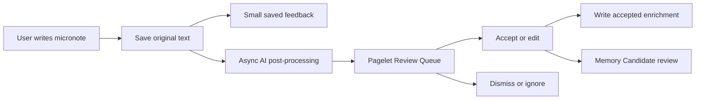

# PA Quick Capture And Micronote Product Spec

Updated: 2026-06-28

## Status

| Field | Value |
| --- | --- |
| Document type | Product spec / future implementation input |
| Status | Confirmed decision spec; implementation not started |
| Feature family | Quick Capture / Micronote / AI post-processing |
| Primary surfaces | Quick Capture command, Pagelet Review Queue, Daily Note, Memory panel |
| Related research | [PA Agent AI insight research report](./pa-agent-ai-insight-research-report.md) |
| Related specs | [PA Product Information Architecture spec](./pa-product-information-architecture-spec.md), [Quiet Recall and Insight Timing spec](./pa-quiet-recall-insight-timing-product-spec.md), [Saved Insight and Insight Ledger spec](./pa-saved-insight-ledger-product-spec.md), [Memory Type Taxonomy spec](./pa-memory-type-taxonomy-product-spec.md), [Weekly Review spec](./pa-weekly-review-product-spec.md), [PA Active Vault Indexer spec](./pa-active-vault-indexer-product-spec.md), [Pagelet Trust Layer spec](./pagelet-trust-layer-product-spec.md), [PA Data Boundary spec](./pa-data-boundary-product-spec.md), [PA Eval Harness spec](./pa-eval-harness-product-spec.md) |
| Related Pagelet docs | [Pagelet product design](./pagelet-product-design.md), [Pagelet Trust Layer spec](./pagelet-trust-layer-product-spec.md) |

This spec defines how PA should participate in the first moment of personal
knowledge capture. It is not current shipped behavior.

Quick Capture is the missing front door between Obsidian's raw note-taking and
PA's later review, memory, retrieval, and maintenance capabilities.

The product goal:

> Let users save an original thought with almost no friction, then let PA
> quietly propose useful structure without taking ownership of the thought.

This spec reflects the one-question-at-a-time product decisions confirmed on
2026-06-28.

## Confirmed Decisions

| ID | Decision | Product consequence |
| --- | --- | --- |
| CAP-D1 | Use B+: lightweight Quick Capture now, preserve part of AI inbox as background capability. | v1 saves immutable micronotes first; AI post-processing appears as reviewable suggestions, not as a foreground inbox product. |
| CAP-D2 | Original capture destination is configurable, defaulting to Daily Note. | Users get low-friction default behavior while Obsidian power users can choose Inbox folder or current file. |
| CAP-D3 | Capture feedback uses lightweight mixed feedback. | After saving, show a small "saved" signal and route full suggestions to Pagelet Review Queue. |
| CAP-D4 | v1 AI post-processing has medium scope. | Include title, tag, related-note, Memory Candidate, and task-like suggestions; exclude archive/move/rewrite/replacement/project flow. |
| CAP-D5 | Task-like detection creates a task suggestion in Review Queue. | PA can identify potential tasks, but user confirmation is required before writing Markdown tasks. |
| CAP-D6 | AI expansion is suggestion-only and visually separated by callout. | PA never rewrites the original micronote; accepted expansion content uses an Obsidian callout to distinguish AI text. |
| CAP-D7 | Accepted expansion uses a mixed save strategy. | Short expansions append as callouts near the original; long or structured expansions become companion/review notes with links. |
| CAP-D8 | Design for voice/mobile later, but v1 implements desktop text only. | The data model keeps input source and provenance fields without expanding v1 implementation scope. |
| CAP-D9 | Quick Capture does not directly create Confirmed Memory. | PA may create Memory Candidates from captures; only user-confirmed candidates become Confirmed Memory. |

## 1. Product Decision

Quick Capture should not become a full AI inbox in v1.

The selected shape is B+:

> Quick Capture is the source-of-truth input. AI inbox behavior is a background
> capability, not a foreground product.

This means:

- the user's original text is saved immediately
- AI post-processing is asynchronous
- AI suggestions are reviewable and dismissible
- the original capture remains inspectable even if the user ignores suggestions
- future autonomy can grow from repeated user trust, not from first-use
  takeover

## 2. Why This Matters

The research report's flomo-inspired lesson is that personal knowledge products
win when they reduce capture friction without stealing the user's thinking.

Quick Capture lowers the cost of:

- recording a half-formed idea
- saving a meeting fragment
- preserving a sentence from a reading session
- capturing a preference or decision
- jotting a possible task without immediately managing a task system

But AI introduces a new friction: trust.

If PA rewrites, relocates, or taskifies a capture too early, users will wonder:

- Did PA change what I meant?
- Where did my thought go?
- Why did this become a task?
- Was this stored as long-term memory?
- Can I still find the original context?

Therefore v1 should optimize for:

- original text first
- visible provenance
- reviewable enrichment
- delayed structure
- no silent memory admission

## 3. Core Flow

Suggested v1 flow:

1. User triggers Quick Capture.
2. User types a short raw micronote.
3. PA immediately saves the original text to the configured destination.
4. PA shows a small saved confirmation.
5. PA optionally starts asynchronous post-processing.
6. Post-processing produces reviewable suggestions.
7. Suggestions enter Pagelet Review Queue.
8. User can review, accept, edit, dismiss, or ignore suggestions later.



## 4. Capture Destination

Original captures should be saved to a user-configurable destination.

Default:

- Daily Note

Configurable options:

- Daily Note
- fixed Inbox folder
- current file

### 4.1 Daily Note Default

Daily Note is the default because it has the lowest first-use friction:

- users do not need to create a new system
- capture follows time and lived context
- ignored captures still remain findable
- Pagelet can later review a time range

Risk:

- Daily Note can become noisy if AI-generated content is appended too often

Mitigation:

- original micronote is short
- AI expansion is only saved after user acceptance
- long expansion becomes a companion/review note instead of bloating Daily Note

### 4.2 Inbox Folder Option

Inbox folder supports users who prefer explicit processing.

Use it when the user wants:

- a clean capture pipeline
- batch review
- a folder they can archive or clean
- separation from Daily Notes

Risk:

- it can become a second inbox that users feel guilty about

Mitigation:

- do not require inbox review for captures to remain useful
- use Pagelet Review Queue as the review surface, not the folder itself

### 4.3 Current File Option

Current file supports users who capture while working inside an active note.

Use it when:

- capture is part of a live writing session
- the current note already provides strong context
- the user wants minimal navigation

Risk:

- accidental pollution of focused notes

Mitigation:

- make current-file capture an explicit destination setting or command variant
- preserve obvious capture formatting

## 5. Feedback Model

Quick Capture should avoid interrupting the user's capture flow.

After saving:

- show a small "saved" confirmation
- optionally mention suggestions will be available later
- do not open a review panel by default
- do not show the AI expansion immediately unless the user asks

Examples of acceptable feedback:

- `Saved`
- `Saved to Daily Note`
- `Saved. Suggestions will appear in Pagelet.`
- `Saved. 2 suggestions queued.`

Avoid:

- modal confirmation
- immediate multi-card AI analysis
- "I found 7 insights!" style excitement
- forcing the user to classify before continuing

## 6. AI Post-processing Scope

v1 should include medium-scope AI enrichment.

Included:

| Suggestion | Purpose | Review behavior |
| --- | --- | --- |
| Title suggestion | Helps future retrieval and skimming | User may accept/edit; never renames source automatically |
| Tag suggestion | Adds lightweight structure | User may accept/edit/dismiss |
| Related notes | Connects capture to existing vault context | User may open, link, or dismiss |
| Memory Candidate | Identifies durable preference, decision, project context, task constraint, or open question | Must go through Trust Layer confirmation |
| Task-like suggestion | Identifies possible action item | Must be confirmed before Markdown task write |
| AI expansion | Turns fragment into richer reflection | Must be accepted and visually separated |

Excluded from v1:

- automatic archive
- automatic move
- automatic source-note rename
- automatic rewrite of original text
- automatic replacement of original capture
- automatic project flow
- full AI capture inbox

These exclusions are product choices, not technical limitations. They keep the
capture moment quiet and trustworthy.

## 7. Review Queue Items

Quick Capture should emit typed Review Queue items rather than creating a new
AI inbox surface.

Initial item types:

| Queue item type | Examples | Primary surface |
| --- | --- | --- |
| `capture_enrichment` | title, tag, expansion, related-note suggestions | Pagelet Panel or Tab |
| `task_suggestion` | "This may be a task" | Pagelet Panel or Tab |
| `memory_candidate` | "This preference may be worth remembering" | Pagelet Panel, then Memory panel after confirmation |
| `related_note` | older note that may connect to the capture | Pagelet Panel |

Queue item fields should include:

- source capture id
- original note path
- original text excerpt
- sourceRefs
- why-shown reason
- data boundary snapshot
- AI provider used, when applicable
- suggested write target, when applicable

## 8. Task-like Detection

Task-like detection should be useful but restrained.

Examples:

- "Need to reply to Alex about pricing."
- "Remember to check the release checklist tomorrow."
- "Follow up on the meeting note."

PA should create a `task_suggestion`, not a task.

The user can:

- accept as Markdown task
- edit task wording
- choose task target
- dismiss
- mark as not a task

Accepted task writes should use the Write Action Framework. The source capture
should remain unchanged unless the user explicitly chooses to append the task
near it.

Risk:

- thoughts can be over-taskified

Mitigation:

- use conservative detection
- keep suggestions reviewable
- let users mark false positives
- do not auto-convert in v1

## 9. AI Expansion

AI expansion should help users turn fragments into richer thinking without
pretending the AI text is the user's original note.

Rules:

- never replace the original capture
- never silently merge AI text into the original paragraph
- preserve the source capture link
- use an Obsidian callout when saved inline
- allow edit before save
- allow dismiss without penalty

Suggested inline format:

```md
Original capture:
PA should feel more like reliable thinking infrastructure than a louder chatbot.

> [!note] PA expansion
> This capture points to a product principle: PA should help users preserve,
> verify, and act on personal knowledge without making every workflow feel like
> a chat session.
```

### 9.1 Short Expansion

Short expansions should default to appending near the original capture as a
callout.

Good for:

- one short interpretation
- one product principle
- one clarification
- one source-backed note

### 9.2 Long Or Structured Expansion

Long or structured expansions should become a companion/review note.

Good for:

- multi-section reflection
- meeting synthesis
- research note draft
- decision write-up
- project-like expansion

The companion note should link back to the original capture, and the original
capture can receive a backlink only after user confirmation.

## 10. Memory Relationship

Quick Capture is not memory.

Capture can contain memory-worthy content, but it should enter the Trust Layer
as a Memory Candidate.

Examples:

| Capture | Candidate type |
| --- | --- |
| "I hate morning meetings." | preference |
| "Use Pagelet for maintenance review, not a new tab." | decision |
| "My default vault inbox is Daily Note." | preference |
| "Project Alpha is paused until July." | project/context fact |

Memory flow:

1. PA detects memory-worthy content.
2. PA creates Memory Candidate with sourceRefs.
3. Candidate enters Pagelet Review Queue.
4. User accepts, edits, scopes, or dismisses.
5. Accepted candidate becomes Confirmed Memory.
6. Confirmed Memory is governed in Memory panel.

This avoids the common AI product mistake of treating every utterance as a
durable personal truth.

## 11. Data Boundary And Privacy

Quick Capture must obey the shared Data Boundary System.

Required behavior:

- first-use disclosure before sending capture text to an AI provider
- visible setting to disable AI post-processing for captures
- no provider call required for raw capture save
- excluded folders/tags respected when reading related context
- generated notes excluded from retrieval by default unless user allows them
- local queue and local cache cleanup available through Data Cleanup

Important distinction:

| Operation | Requires provider call? | Requires user confirmation? |
| --- | --- | --- |
| Save raw capture | No | User already initiated it |
| Generate suggestions | Yes, if AI-backed | First-use/provider disclosure; per-run if broad/sensitive |
| Save accepted title/tag/expansion/task | No or maybe, depending on edit path | Yes |
| Create Memory Candidate | Yes, if AI-backed | Candidate creation can be automatic; confirmation required for memory admission |

## 12. Data Model Notes

Suggested capture record fields:

| Field | Meaning |
| --- | --- |
| `captureId` | Stable id for the raw capture |
| `createdAt` | Capture timestamp |
| `inputSource` | desktop text, future mobile text, future voice, future share sheet |
| `originalText` | User's raw input text |
| `targetPath` | Note path where original capture was saved |
| `targetBlockRef` | Optional block/section reference |
| `destinationMode` | Daily Note, Inbox folder, current file |
| `postprocessStatus` | none, queued, running, completed, failed, disabled |
| `dataBoundarySnapshot` | Policy used for AI post-processing |
| `queueItemIds` | Review Queue items created from this capture |

Suggested post-processing result fields:

| Field | Meaning |
| --- | --- |
| `resultId` | Stable id |
| `captureId` | Source capture id |
| `suggestionType` | title, tag, related_note, memory_candidate, task_suggestion, expansion |
| `suggestedText` | Proposed text |
| `sourceRefs` | Evidence or source references |
| `confidence` | Optional coarse confidence |
| `whyShown` | Human-readable reason |
| `status` | suggested, accepted, edited, dismissed, snoozed, failed |

## 13. Voice And Mobile Future-proofing

v1 should implement desktop text capture only.

However, the product contract should not assume desktop keyboard forever.

Future input sources:

- mobile quick action
- mobile share sheet
- voice dictation
- clipboard capture
- browser/web clipper style capture

Future constraints:

- preserve original transcript
- distinguish transcript from AI cleanup
- show whether audio was stored, discarded, or never captured
- avoid sending audio to providers without explicit disclosure
- keep post-processing reviewable

Do not implement these in v1 unless a later SDD explicitly scopes them.

## 14. Evaluation

Eval Harness should cover Quick Capture with small synthetic fixtures.

Suggested eval cases:

| Case | Expected behavior |
| --- | --- |
| Simple thought | Raw capture saved; no forced classification |
| Preference capture | Memory Candidate created; no Confirmed Memory without user action |
| Task-like sentence | Task suggestion created; no Markdown task written automatically |
| Ambiguous sentence | Conservative suggestions; false positives measurable |
| Sensitive capture | Provider disclosure/boundary respected |
| Related-note capture | Related note suggested with source reason |
| Expansion accepted | AI callout saved; original text unchanged |
| Long expansion accepted | Companion note created with backlink |

Deterministic checks:

- original capture text remains unchanged
- queue items include source capture id
- generated content is visually distinguished
- no memory admission without confirmation
- no task write without confirmation

## 15. Roadmap

### Phase 0: Product Contract

- Link this spec from Product IA, Trust Layer, Active Vault Indexer, Data
  Boundary, and Eval Harness specs.
- Align Review Queue item types.
- Keep v1 scoped to desktop text.

### Phase 1: Raw Quick Capture

- Add command-driven text capture.
- Save to configurable destination.
- Default to Daily Note.
- Show small saved feedback.
- Do not invoke AI by default until provider disclosure and settings are ready.

### Phase 2: Async Post-processing

- Generate title, tag, related-note, Memory Candidate, task-like, and expansion
  suggestions.
- Route suggestions to Pagelet Review Queue.
- Preserve sourceRefs and why-shown.

### Phase 3: Review And Accept

- Add Pagelet views for capture enrichment.
- Support accept/edit/dismiss/snooze.
- Save accepted short expansion as callout.
- Save accepted long expansion as companion/review note.

### Phase 4: Memory And Task Integration

- Route Memory Candidates through Trust Layer.
- Route accepted memory to Memory panel governance.
- Route accepted task suggestions through Write Action Framework.
- Ensure original capture remains unchanged.

### Phase 5: Future Input Sources

- Add mobile text capture when feasible.
- Add voice capture only with explicit privacy design.
- Add share-sheet or clipboard capture after data boundary rules are stable.

## 16. Open Questions

- What exact command name should v1 use: `PA: Quick Capture`,
  `Pagelet: Quick Capture`, or both?
- What Markdown format should raw captures use inside Daily Note?
- Should Inbox folder captures create one file per capture or append to a
  rolling inbox note?
- What threshold separates short expansion from long expansion?
- Where should accepted Markdown tasks be written by default?
- Should title/tag suggestions modify frontmatter, inline tags, or remain
  suggested metadata until a later maintenance flow?
- Should the small saved feedback mention queued suggestions only when
  post-processing is enabled?

## 17. Summary

Quick Capture gives PA a low-friction front door without making PA own the
user's thinking.

The durable contract:

- original micronote first
- configurable destination, default Daily Note
- tiny saved feedback
- AI suggestions later
- Pagelet Review Queue for enrichment
- callout separation for AI expansion
- task and memory require confirmation
- mobile and voice are future-ready, not v1 scope

This gives PA a way to help at the moment of capture while preserving the trust
needed for a long-term personal knowledge system.
