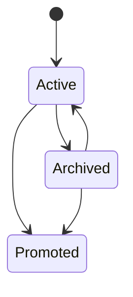

# PA Saved Insight And Insight Ledger Product Spec

Updated: 2026-06-29

## Status

| Field | Value |
| --- | --- |
| Document type | Product spec / future implementation input |
| Status | Confirmed decision spec; implementation not started |
| Feature family | Saved Insight / Insight Ledger |
| Primary surfaces | Pagelet Tab, Pagelet Panel, Weekly Review note, review notes |
| Related research | [PA Agent AI insight research report](./pa-agent-ai-insight-research-report.md) |
| Related specs | [PA Product Information Architecture spec](./pa-product-information-architecture-spec.md), [Quiet Recall and Insight Timing spec](./pa-quiet-recall-insight-timing-product-spec.md), [Weekly Review spec](./pa-weekly-review-product-spec.md), [Scope Recap and Theme Summary spec](./pa-scope-recap-theme-summary-product-spec.md), [Memory Type Taxonomy spec](./pa-memory-type-taxonomy-product-spec.md), [Pagelet Trust Layer spec](./pagelet-trust-layer-product-spec.md), [Quick Capture and Micronote spec](./pa-quick-capture-micronote-product-spec.md), [PA Active Vault Indexer spec](./pa-active-vault-indexer-product-spec.md), [PA Data Boundary spec](./pa-data-boundary-product-spec.md), [PA Eval Harness spec](./pa-eval-harness-product-spec.md) |
| Related Pagelet docs | [Pagelet product design](./pagelet-product-design.md), [Pagelet Maintenance Review spec](./pagelet-maintenance-review-product-spec.md) |
| Product doctrine | [Low-Burden Review Product Principles](./pa-low-burden-review-product-principles.md) |

This spec defines Saved Insight as PA's durable but lightweight thought object.
It is not current shipped behavior.

Saved Insight exists because PA often discovers something valuable that should
not disappear into a chat transcript, but also should not immediately become
Confirmed Memory or a vault edit.

The product definition:

> Insight is a user knowledge asset. Memory is a PA behavior constraint.

This document records the one-question-at-a-time product decisions confirmed on
2026-06-28.

## Confirmed Decisions

| ID | Decision | Product consequence |
| --- | --- | --- |
| INS-D1 | Saved Insight uses a mixed shape. | It starts as a local source-backed object and can later be explicitly written to Weekly Review note, review note, or independent Markdown. |
| INS-D2 | The key distinction from Memory Candidate is whether it affects PA future behavior. | Insight is a reviewable thought asset; Memory Candidate may become future behavioral context after confirmation. |
| INS-D3 | v1 insight types use a medium taxonomy. | `observation`, `theme`, `tension`, `question`, `decision`, and `opportunity` cover most review cases without over-classification. |
| INS-D4 | Insight candidates are ignorable until the user chooses durability. | User-saved insights go directly to Insight Ledger; PA-discovered candidates stay ephemeral unless the user saves, keeps for later, promotes, or PA proposes a durable action. |
| INS-D5 | Markdown write target follows triggering context, with independent note as an option. | Weekly Review insights default to Weekly Review note; Pagelet review insights may be explicitly added to a review note; important insights can become independent notes. |
| INS-D6 | Saved Insight has weak influence on future retrieval/recommendation. | It can affect recall and ranking, but cannot act as a fact, preference, or behavioral constraint. |
| INS-D7 | Saved Insight has lightweight lifecycle state. | `active`, `archived`, and `promoted` are enough for v1. |
| INS-D8 | Insight Ledger is a lightweight Pagelet Tab filter/view. | Users can review insights without creating a new top-level product entry. |
| INS-D9 | AI-generated or PA-recommended insights must have sourceRefs; user-authored insights may be unsourced but must be marked. | Evidence-first applies to PA claims while preserving user-owned thinking. |

## 1. Product Decision

Saved Insight should be a product middle layer.

It sits between:

- temporary recall cues
- raw source notes
- Memory Candidates
- Maintenance Proposals
- review notes
- Weekly Review notes

Selected shape:

> Saved Insight is a source-aware, editable, lightweight thought card. It can be
> searched, reviewed, archived, promoted, and optionally written to Markdown.

This avoids two product failures:

- treating every useful insight as Confirmed Memory; and
- letting insights disappear inside Chat, Bubble, or transient review sessions.

It must also avoid a third failure:

- turning every PA-generated insight candidate into a new item the user must
  review.

The product boundary:

> Insight candidates are ignorable. Saved Insight begins when the user chooses
> to save, keep, or promote.

## 2. Saved Insight Versus Memory Candidate

The difference is not simply wording. The difference is authority.

| Object | What it represents | Future PA behavior |
| --- | --- | --- |
| Saved Insight | A thought, pattern, tension, question, or opportunity the user may want to revisit | Weak influence only: recall candidate, theme signal, ranking hint |
| Memory Candidate | A possible durable fact, preference, decision, or constraint | May become Confirmed Memory after user confirmation |
| Confirmed Memory | User-approved durable context | Can influence PA answers, retrieval, recommendations, and actions |

Product rule:

> Insight may help PA remember that a theme exists. Memory may tell PA how to
> behave. Do not blur them.

## 3. Insight Types

v1 should use a medium-size taxonomy.

| Type | Meaning | Example |
| --- | --- | --- |
| `observation` | A source-backed pattern or notable finding | "Several notes frame PA as infrastructure, not chatbot." |
| `theme` | A recurring topic across notes | "Quiet automation and user trust keep recurring together." |
| `tension` | A contradiction, tradeoff, or counterexample | "PA needs hands, but source-note mutation threatens trust." |
| `question` | A question worth revisiting | "When should scoped autonomy replace review?" |
| `decision` | A product or personal decision worth preserving | "Weekly Review lives in Pagelet Tab." |
| `opportunity` | A possible next move or product opportunity | "Turn repeated accepted maintenance into scoped autonomy." |

Avoid over-classifying v1 with many subtle categories. Types should help users
scan and filter, not create a knowledge-management chore.

## 4. Origin And Review Queue Policy

Saved Insight behavior depends on how it is created.

| Origin | Default behavior | Reason |
| --- | --- | --- |
| User manually saves an insight | Save directly to Insight Ledger | The save action is already confirmation |
| PA discovers an insight automatically | Show ephemerally or discard if low confidence | AI-generated candidates should not become user assets or queue debt without intent |
| User chooses `Later` / `Keep` on a PA-discovered insight | Create a Review Queue item or lightweight saved draft | The user has expressed intent to return |
| PA proposes durable save, Memory promotion, or maintenance action from an insight | Create the appropriate confirmed flow | Durable consequence needs confirmation before it affects the vault or future PA behavior |
| Weekly Review section | User selects, saves, or edits, then save | Weekly Review is an intentional review session |
| Quiet Recall Panel | User saves from evidence view, then save | The user has inspected or chosen the cue |
| Chat | Chat can create a save action, but structured review routes to Pagelet when evidence is complex | Chat should invoke, not become the ledger |

PA-discovered insights should not silently fill the ledger.
They should also not silently fill Review Queue. The queue is for user intent or
durable consequence, not for every generated candidate.

### 4.1 Burden Boundary

Saved Insight must preserve optionality:

- Reading an insight preview does not create ledger state.
- Ignoring an insight preview does not create queue state.
- Dismissing an insight preview does not require a reason.
- Saving an insight is confirmation for ledger storage only.
- Promoting an insight to Memory requires separate Memory confirmation.
- Turning an insight into maintenance requires preview/diff and action
  confirmation.

## 5. Insight Ledger

Insight Ledger should be a Pagelet Tab filter/view, not a top-level product.

Ledger supports:

- browse saved insights
- filter by type
- filter by scope
- filter by source
- search text
- archive
- promote
- open source notes
- write to Markdown

Ledger does not need to be:

- a new side panel
- a full database app
- a second task manager
- a social feed
- a graph browser

Product rule:

> Insight Ledger is a shelf inside Pagelet, not a new room in the house.

## 6. Markdown Write Policy

Saved Insight is local-first by default, but user-confirmed insights can be
written to Markdown.

Default target follows triggering context:

| Triggering context | Default Markdown target |
| --- | --- |
| Weekly Review | Weekly Review note |
| Pagelet review | Current review note only after an explicit insight-save/export action |
| Quick Capture post-processing | Review note or source-linked companion note |
| Quiet Recall | Review note or Weekly Review note if inside weekly session |
| User explicitly promotes | Independent Insight note |

User can choose an independent Insight note when an insight deserves long-term
standalone treatment, such as:

- product principle
- important decision
- reusable thinking frame
- long-lived research conclusion
- cross-project pattern

### 6.1 Markdown Content

When written to Markdown, an insight should include:

- insight text
- type
- sourceRefs when present
- why-shown when generated by PA
- created date
- optional scope
- link back to originating review or source

Do not write:

- internal model scores
- raw retrieval debug data
- unconfirmed PA-generated claims without sourceRefs
- hidden profile assumptions

## 7. Influence On Future Retrieval

Saved Insight can weakly influence future recall and retrieval.

Allowed influence:

- recall candidate
- theme signal
- rerank hint
- related-note bridge
- Pagelet/Weekly Review resurfacing

Not allowed:

- acting as a confirmed user preference
- acting as a durable personal fact
- constraining PA behavior
- replacing source evidence
- overriding Confirmed Memory

Example:

- Allowed: "This current note may relate to a saved insight about quiet
  assistants."
- Not allowed: "You prefer all assistants to be quiet because you saved this
  insight."

If an insight should affect PA behavior, it must be promoted into a Memory
Candidate and confirmed through the Trust Layer.

## 8. Lifecycle

Saved Insight uses a lightweight lifecycle.

| State | Meaning |
| --- | --- |
| `active` | Available for recall, review, filtering, and weak retrieval influence |
| `archived` | Preserved but not proactively recalled by default |
| `promoted` | Upgraded into another durable artifact such as Memory Candidate, review note, Weekly Review note, independent Markdown note, product principle, or Maintenance Proposal |

State transitions:

Do not add heavy lifecycle states such as stale, contradicted, deprecated, or
needs-verification in v1. Those belong to Memory or source-backed conflict
workflows, not lightweight insight management.

## 9. Evidence Requirements

AI-generated or PA-recommended insights must include evidence.

Required for PA-generated insights:

- sourceRefs
- why-shown
- generatedAt
- originating surface
- source excerpts or links available in Panel

User-authored insights may have no sourceRefs, but must be marked:

- `origin = user-authored`
- `sourceRefs = []`

This keeps evidence-first discipline for PA claims while allowing users to save
their own thoughts.

If PA cannot provide evidence, it should not auto-create an insight. It can ask
the user to save a user-authored note instead.

## 10. Data Model Notes

Suggested fields:

| Field | Meaning |
| --- | --- |
| `id` | Stable insight id |
| `type` | observation, theme, tension, question, decision, opportunity |
| `text` | User-visible insight text |
| `origin` | user-authored, pa-generated, pa-recommended, imported |
| `sourceRefs` | Source-backed evidence refs when applicable |
| `whyShown` | Why PA surfaced this insight |
| `scope` | current note, folder, tag, selected notes, weekly range, custom scope |
| `status` | active, archived, promoted |
| `influencePolicy` | weak-only |
| `createdAt` | Creation timestamp |
| `updatedAt` | Last edit timestamp |
| `promotedTo` | Optional target artifact id/path |
| `dataBoundarySnapshot` | Policy used for source retrieval |
| `replayRef` | Optional replay trace |

## 11. Data Boundary And Privacy

Saved Insight must obey Data Boundary.

Rules:

- PA-generated insights cannot reference excluded scopes.
- User-authored unsourced insights stay local unless the user writes them to
  Markdown.
- Ledger data must be clearable.
- Markdown write is explicit user action.
- Generated notes policy applies if insights are saved to Markdown.
- Provider disclosure applies if PA generates or rewrites insight text using
  note content.

Sensitive user-model claims should not be stored as insight to bypass Memory
confirmation. If the content is about user identity, health, finance,
relationship, broad goals, or deep preference inference, route to Trust Layer
rules and require stricter review or avoid saving.

## 12. Relationship To Weekly Review

Weekly Review is the main compounding surface for Saved Insights.

Weekly Review can:

- show candidate insights
- let users select/save/edit/dismiss or simply skip sections
- save selected insights to Ledger
- write selected insights into Weekly Review note
- promote selected insights to Memory Candidate or Maintenance Proposal

Weekly Review note should include only selected/saved insights, never raw
candidate insight spam.
Skipped or ignored candidates should not become queue debt unless the user
explicitly keeps or snoozes them.

## 13. Relationship To Quiet Recall

Quiet Recall can surface insights, but does not automatically save them.

Flow:

1. Quiet Recall shows a line and why-shown in Bubble.
2. User opens Panel.
3. Panel shows evidence.
4. User chooses `Save insight`.
5. Insight enters Ledger directly if user saves from Panel.

If PA wants to suggest a generated insight without user action, it should create
an ephemeral recall or digest candidate first. It should create a Review Queue
item only when the user chooses `Later` / `Keep`, or when the insight is being
promoted into a durable Memory, Markdown, or maintenance/action flow.

## 14. Relationship To Trust Layer

Trust Layer supplies evidence and promotion boundaries.

Saved Insight may be promoted to:

- Memory Candidate
- Memory Conflict item
- Maintenance Proposal
- review note
- Weekly Review note
- independent Markdown note

Promotion to Memory Candidate is special because it may influence future PA
behavior after confirmation. The insight itself remains weak-influence only.

## 15. Evaluation

Eval Harness should cover Saved Insight with focused fixtures.

Suggested cases:

| Case | Expected behavior |
| --- | --- |
| PA-generated insight with sources | Can be saved after review; sourceRefs retained |
| PA-generated insight without sources | Cannot be silently saved as PA insight |
| PA-generated insight ignored by user | Does not create Ledger or Review Queue state |
| User-authored insight | Can be saved without sourceRefs and marked user-authored |
| Saved insight retrieval | Weakly influences recall but not behavior constraint |
| Insight promoted to Memory Candidate | Requires Trust Layer confirmation |
| Weekly Review note | Includes selected insights only |
| Archived insight | Does not proactively recall by default |

Deterministic checks:

- PA-generated insight has sourceRefs
- user-authored unsourced insight has correct origin
- saved insight does not become Confirmed Memory
- weak influence does not override source evidence
- ignored candidates do not create Review Queue debt
- Markdown write requires user action

## 16. Roadmap

### Phase 0: Product Contract

- Link this spec from Product IA, Weekly Review, Quiet Recall, Trust Layer,
  Data Boundary, and Eval Harness.
- Use Product IA canonical Review Queue terminology only for durable or
  user-kept proposals: `evidence_insight` means a user-kept or durable
  source-backed insight proposal, not every PA-discovered candidate.

### Phase 1: Local Saved Insight Object

- Define data model.
- Save user-authored or user-saved insights locally.
- Preserve sourceRefs and origin.

### Phase 2: Pagelet Ledger View

- Add Insight Ledger as Pagelet Tab filter/view.
- Support browse, filter, search, archive, promote.

### Phase 3: Weekly Review Integration

- Save user-selected Weekly Review insights to Ledger.
- Write user-selected insights to optional Weekly Review note.

### Phase 4: Quiet Recall Integration

- Save recall findings as insights after source evidence view.
- Use Saved Insight as weak recall/rerank signal.

### Phase 5: Promotion Workflows

- Promote insight to Memory Candidate, Maintenance Proposal, review note, or
  independent Markdown note.
- Keep promotion actions explicit and source-backed.

## 17. Open Questions

- Resolved: PA-discovered insight proposals use Product IA canonical
  `evidence_insight`; user-saved insights are Saved Insight objects, not queue
  item types.
- Resolved: saving a Pagelet review note is not an insight-save action and does
  not create `evidence_insight` Review Queue items by itself.
- What exact UI label should users see: `Insight`, `Saved thought`,
  `Observation`, or Pagelet-native wording?
- Where should independent Insight notes be saved by default?
- Should Ledger search include archived insights by default?
- Should insight promotion preserve original insight as `promoted`, or clone
  into the target artifact and keep the insight active?
- Should user-authored insights be allowed to influence recall at all, or only
  PA-generated source-backed ones?

## 18. Summary

Saved Insight protects a subtle but important middle ground.

The durable contract:

- local source-backed object first
- Markdown only after user action
- Pagelet Tab Ledger, not a new product center
- AI-generated insights require sourceRefs
- user-authored insights can be unsourced but marked
- weak future influence only
- Memory Candidate remains separate because it can affect PA behavior
- active / archived / promoted lifecycle

This lets PA preserve useful thinking without turning every insight into memory,
every memory into behavior, or every AI finding into vault clutter.
