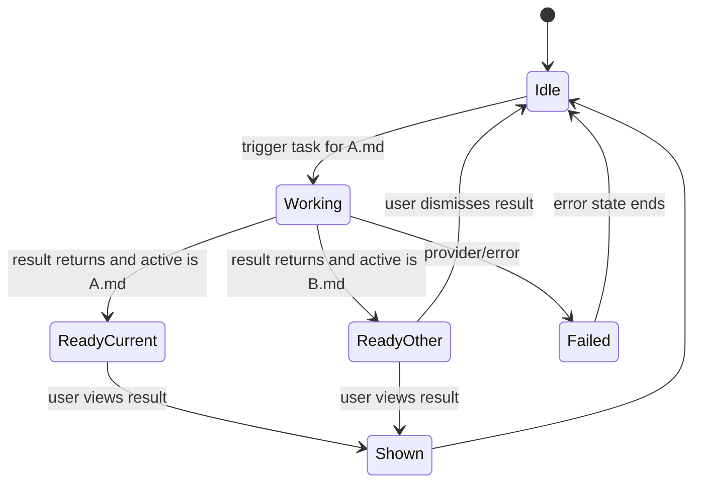

# Pagelet Async Result Plan

## Status

| Field | Value |
| --- | --- |
| Track | Pagelet source-bound foreground tasks |
| Status | Draft product plan |
| Created | 2026-06-20 |
| Related docs | [Pagelet product design](./pagelet-product-design.md), [Pagelet SDD guide](./pagelet-sdd-guide.md), [Pagelet smoke checklist](./pagelet-smoke-checklist.md) |

This plan defines the product behavior for Pagelet foreground runs when the user changes the active Markdown note while an AI call is still in flight.

## Problem

Current current-note review behavior is anchored to the active Markdown leaf at trigger time. If the user starts reviewing `A.md`, then switches to `B.md` before the provider returns, the runtime discards the `A.md` result to avoid showing it as if it belonged to `B.md`.

That stale-result guard protects correctness, but the product behavior is incomplete:

- The provider call may already have spent time, tokens, and API credits.
- Discarding a completed `A.md` result wastes that work.
- The Pet UI has no way to say "the result for A.md is ready" while the user is now reading `B.md`.
- Future quick access for review, discovery, and summary needs a shared task/result model instead of active-file-only assumptions.

## Product Goal

Pagelet foreground tasks should be bound to their source note or source scope, not to the note that happens to be active when the result returns.

The intended behavior:

- Never show `A.md` analysis as current `B.md` analysis.
- Do not throw away a completed AI result only because the active file changed.
- Make task source visible in Pet/Bubble/Panel/Tab UI.
- Keep the first implementation lightweight: foreground task state can be in-memory only.
- Preserve the current single foreground-run guard until a separate queue design is approved.

## Product Definitions And Persistence Boundaries

Pagelet exists to support deep review, insight, and knowledge connection across
the user's Obsidian vault. That requires persistent history, but not every AI
output is a durable insight.

Use these product layers:

| Layer | Product meaning | Persistence rule |
| --- | --- | --- |
| Transient UI/session state | In-flight or recently completed provider result used to render Bubble, Panel, or Tab UI. | Do not persist full Markdown/provider output in Obsidian view state or workspace state. Reload should treat it as expired unless a lightweight runtime pointer can still be validated. |
| Markdown history artifact | User-confirmed review or summary note used as traceable history. | Persist the full Markdown in the vault after explicit user action. It must be visible, searchable, deletable, and auditable like other notes. |
| Insight/Memory layer | High-value understanding extracted from review/summary history and vault context. | Persist only curated signals such as claims, connections, evidence, confidence, source paths, and time range. Do not store raw provider output as Insight/Memory. |

The key boundary is visibility and intent. Full review/summary Markdown is
allowed when the user saves it as a vault artifact. Full provider output is not
allowed as hidden UI state, and it is not itself an Insight/Memory object.

For the first async-result implementation:

- Native detail view state should persist only lightweight display metadata.
- Unsaved review/summary output should be session-only.
- After Obsidian reload, a restored detail tab should show an expired or
  regenerate state instead of reconstructing full output from view state.
- Periodic summary can save full Markdown as a traceable history note.
- Future Insight/Memory ingestion should derive structured candidates from
  saved review/summary history or the generation pipeline, then keep only
  genuinely valuable understanding and knowledge connections.

## Recommended Product Contract

When a user triggers a Pagelet task, create a source-bound task:

| Field | Meaning |
| --- | --- |
| `jobId` | Unique foreground task id |
| `taskKind` | `review`, `connection`, `summary`, or future task kind |
| `sourcePaths` | Source note(s) or scope paths captured at trigger time |
| `primarySourcePath` | Main source shown in UI, usually the active note at trigger time |
| `range` | Current note, selected scope, recent period, or summary scope |
| `startedAt` / `completedAt` | Task timing for UI and stale cleanup |
| `status` | `working`, `ready`, `shown`, `failed`, `cancelled`, `superseded` |
| `result` | Panel findings, raw findings, summary markdown, or discovery payload |
| `activePathAtCompletion` | Active note when the result returns; used only for display policy |

Result display policy:

| Completion state | Product behavior |
| --- | --- |
| Active file is still the source note | Show the result through the existing Bubble/Panel path. |
| Active file changed | Cache the result as ready, reset Pet from working, and show a source-labeled ready state. |
| User clicks Pet while result is ready | Bubble shows "Review ready for A.md" with `View result`, `Open A.md`, and `Dismiss`. |
| User returns to source note while result is ready | Bubble can show the ready result as source-matched; no automatic modal/panel should interrupt the user. |
| Source note was deleted or unavailable | Show a non-blocking stale-result state and allow dismiss; do not save against a missing source path. |
| Provider fails | Keep current error behavior: Pet exits working, flashes error, and logs the failure. |

## UX States

Pet/Bubble should treat foreground work as a small state machine:

Suggested Bubble behavior:

- `Working`: show task kind, source note, and a disabled/progress row; avoid starting a conflicting foreground task from the same quick-access panel.
- `ReadyCurrent`: show the existing result-first view.
- `ReadyOther`: show a compact source card, e.g. `Review ready for A.md`, with actions.
- `Idle`: show quick access for review, discover connections, and periodic summary.

## Implementation Plan

### Phase 0: Bug fix

Status: implemented.

- When `analyzeFiles()` returns `null`, orchestrator must still call `transitionPet("analysis-done")`.
- This fixes the stuck working animation without changing result retention semantics.

### Phase 0.5: Prepared-result identity guard

Status: implemented as an interim fix.

- Cached/background-prepared Bubble `View details` uses an internal prepared route.
- The Panel opens with `layoutType="review"`, not `layoutType="current"`.
- The Panel displays the prepared findings from cache while preserving their `sourceFile` fields.
- The Panel does not attach current-note scope metadata to this prepared route.
- This avoids labeling background-prepared findings as current-note analysis before the full async result model exists.

### Phase 1: Make discarded results explicit

- Replace ambiguous `null` with a typed outcome from `AnalysisSessionManager`, for example:
  - `{ status: "ok", result }`
  - `{ status: "stale-active-path", result, expectedActivePath, activePath }`
  - `{ status: "superseded" }`
  - `{ status: "destroyed" }`
  - `{ status: "empty" }`
- For `stale-active-path`, keep the completed result instead of clearing it.
- Preserve existing discard behavior for `destroyed` and true superseded runs.

### Phase 2: Add in-memory foreground result store

- Add a small Pagelet foreground task/result store owned by orchestrator or `AnalysisSessionManager`.
- Store only the latest few completed foreground results.
- Recommended default: latest 3 in memory, cleared on plugin reload.
- Include task kind, source paths, result payload, timestamps, and display status.

### Phase 3: Pet/Bubble ready-state UX

- When a source-bound result completes while active note differs, Pet exits working and enters a ready/nudge state.
- Bubble shows the source-labeled ready card before normal quick access.
- `View result` opens Bubble/Panel/Tab with the original source context.
- `Open A.md` opens the source note without forcing result display.
- `Dismiss` marks the ready result as dismissed.

### Phase 4: Align review, discovery, and summary

- Review current note, discovery connection, and periodic summary should all publish the same task metadata.
- Pet task animation and Bubble copy should come from `taskKind`.
- Save flow should use the task/source identity instead of inferring from the active file.
- Replace the Phase 0.5 prepared-route workaround with this shared result identity model.

### Phase 5: Verification

- Unit tests:
  - active path changes after provider returns still preserves result as ready
  - result shown from ready state keeps `sourcePath=A.md`
  - save flow targets the original source identity
  - dismissed ready result does not reappear
  - destroyed/superseded outcomes do not show stale UI
- UI smoke:
  - trigger review on `A.md`, switch to `B.md`, wait for completion, verify Pet ready state
  - click Pet on `B.md`, verify Bubble labels result as `A.md`
  - view result and save review note, verify source metadata is `A.md`
  - repeat on desktop and mobile widths

## Open Product Decisions

Recommended defaults are marked as such.

| Decision | Recommended default | Alternatives |
| --- | --- | --- |
| Auto-open result when active file changed? | No. Show Pet ready state only. | Auto-open a source-labeled Bubble, but this can interrupt reading `B.md`. |
| How many completed foreground results to retain? | Latest 3 in memory. | Latest 1 only; larger session history; persisted history. |
| Persist ready results across plugin reload? | No for full output. Restore only lightweight metadata and show expired/regenerate UI. | Persist redacted metadata only; persist full result payload is not allowed as hidden view/workspace state. |
| Allow multiple concurrent foreground jobs? | No. Keep current single-run guard. | Add a queue; allow parallel jobs by task kind. |
| If user triggers a new review while old result is ready? | Keep ready result and start new run only after explicit action. | Auto-dismiss old result; ask user; overwrite by source path. |
| Should source note switch automatically when viewing ready result? | No. `View result` shows result; `Open source` is separate. | Open source first, then show result. |

## Non-Goals

- No autonomous background changes.
- No silent writes to source notes.
- No hidden persistence of full provider output in view state, workspace state,
  settings, or other non-user-visible caches.
- No treating full provider output as Insight/Memory. Insight/Memory stores
  curated understanding, evidence, and connections.
- User-confirmed review and summary Markdown notes are allowed and expected as
  traceable history artifacts.
- No multi-job queue in the first implementation pass.
- No change to the Write Action Framework confirmation contract.
