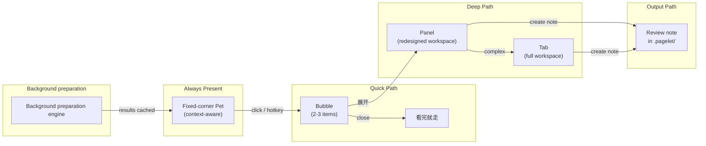
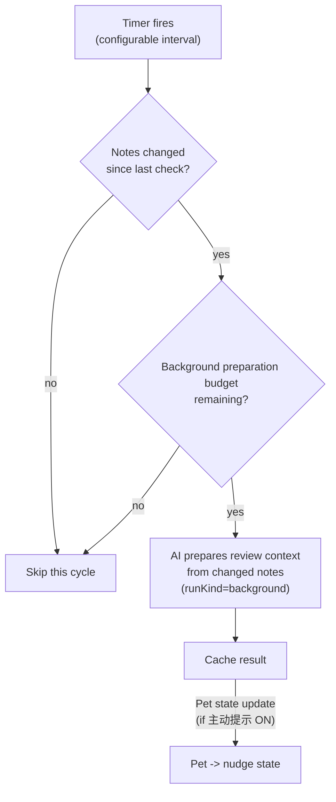

# Pagelet Product Design

## Status

| Field | Value |
| --- | --- |
| Feature name | `Pagelet` (中文：`拾页`) |
| Internal codename | Review Assistant |
| Document type | Pagelet Product Design |
| Status | Core beta implementation complete — full blueprint gaps tracked as future work |
| Last revised | 2026-06-11 |
| Primary surface | Fixed-corner floating Pet entry + progressive disclosure (Bubble / Panel / Tab) |
| Runtime relationship | Pagelet shares PA's unified Agent Runtime via RunKindAdapter (D024), extended with `runKind="background"` background preparation (D032) |
| Write boundary | Review note creation and periodic summary save both run through the **Write Action Framework**; Pagelet creates independent review notes only |
| Background preparation engine | Optional timed polling with rate-limited background review preparation (D032); disabled by default and enabled explicitly by the user |
| Historical reference | [review-assistant-product-design.md](./review-assistant-product-design.md) |
| Decisions record | See [review-assistant-decisions.md](./review-assistant-decisions.md) (D001-D031 active; D032+ proposed in this document) |
| Technical design | See [pagelet-sdd-guide.md](./pagelet-sdd-guide.md); [review-assistant-sdd.md](./review-assistant-sdd.md) is preserved as historical implementation context |

This document defines the current **Pagelet** product and UX contract. Historical Review Assistant/Pagelet drafts are preserved only as reference. Sections marked as future work describe the intended direction, not current shipped behavior.

---

## Product Promise — [PRESERVED, EXPANDED]

> **Pagelet — your note's quiet reviewer.**
>
> 拾页 —— 笔记写完后的安静审视者。

The core promise is preserved from historical design. Pagelet expands the delivery surface:

Pagelet helps users revisit recent notes, discover connections, receive instant review insights, and optionally turn findings into review notes.

The promise stays intentionally narrow:

- It reviews recent notes, not the whole vault by default. **[PRESERVED]**
- It produces evidence-backed findings, not free-form inspiration. **[PRESERVED]**
- The user decides when to view, when to go deeper, and when to produce output. **[CHANGED — replaces "the user selects what matters, not the model"]**
- It creates review notes only after explicit confirmation. **[PRESERVED]**
- The Pet is a memorable, always-present entry and context-aware companion, not the product's core value. **[CHANGED — from "mascot is a memorable entry"]**
- Background review preparation ensures insights are ready the instant the user asks — a performance optimization, not a behavior change. **[NEW]**

---

## Positioning — [PRESERVED, EXPANDED]

Pagelet is a **note-review workflow with a context-aware floating Pet and progressive disclosure UI**. It is not a screen pet with growth mechanics, task manager, general write agent, or autonomous executor.

The product value is a multi-path review loop:



The memorable UI line (updated for Pagelet):

> A recognizable little paper companion sits quietly in the corner of the workspace. Background review preparation ensures insights are ready instantly when the user asks. When summoned — by click or hotkey — it opens a speech bubble with quick findings. If the user has opted into proactive hints, the Pet can also gently signal when something noteworthy is ready. The user can go deeper into a panel, explore connections, or turn selected findings into a review note.

**[CHANGED from historical design]**: historical design described a linear pipeline (open -> select range -> analyze -> findings -> collect -> confirm -> note). Pagelet replaces this with progressive disclosure across four layers (Pet -> Bubble -> Panel -> Tab) and four usage scenarios.

---

## Differentiation — [PRESERVED]

Pagelet differentiates against same-category AI plugins (Smart Connections, Copilot for Obsidian, Text Generator, Notion AI) through three axes (D006):

| Axis | Statement |
| --- | --- |
| **Review-first** (primary) | Others help you write; Pagelet helps you review what you wrote. |
| **Non-intrusive** (secondary) | Every suggestion is dismissible. Pagelet never modifies your notes silently. |
| **Vault-aware** (moat) | Pagelet draws on your own past notes, tags, and links as context. |

Differentiation touchpoints unchanged from historical design. Pagelet does NOT name competitors in user-facing copy.

---

## Target Users — [PRESERVED, EXPANDED]

Primary (preserved from historical design):

- Users who keep daily notes, work logs, research notes, project journals, or meeting notes in Obsidian.
- Users who already write enough material that periodic review can surface patterns, missing follow-ups, research gaps, and idea threads.
- Users who treat Obsidian as a thinking system or personal knowledge base.
- Users already comfortable with PA Agent / Memory reading their notes after explicit action.

Secondary (expanded in Pagelet):

- Users who prepare weekly reviews, project retrospectives, newsletters, research summaries, or planning notes.
- Users who need a low-friction way to transform scattered recent notes into a working draft.
- **[NEW]** Users who want subtle, non-intrusive writing assistance — gentle hints while writing, not autocomplete or inline suggestions.
- **[NEW]** Users who want to discover unexpected connections between notes without manually searching.

Non-target for Pagelet:

- Users who rarely write notes.
- Users who expect a task manager with completion tracking and due dates.
- Users who want a highly playful pet (growth, emotion, feeding, decoration).
- **[CHANGED]** ~~Users who want an autonomous assistant that monitors notes in the background.~~ — Pagelet uses background review preparation as a performance optimization, with opt-in proactive hints. Users who want **uncontrollable** autonomous assistants remain non-target.

---

## Problems To Solve — [PRESERVED, EXPANDED]

Preserved from historical design:

- **Review cost is high.** Manually scanning yesterday, the last three days, or the last week is tedious.
- **Ideas and follow-ups get buried.** Notes contain "look this up later", "maybe turn this into...", TODOs, partial insights, unresolved questions that never become next steps.
- **Blank-prompt friction is real.** A structured review starts from recent notes rather than a blank chat box.
- **Insight-to-note handoff is weak.** A good AI answer is not enough if the user must manually copy, edit, cite, and organize it.
- **Trust depends on provenance.** Users need to know which notes were read, which were skipped, and why a recommendation was made.

New in Pagelet:

- **[NEW] Review initiation friction.** historical design requires opening a panel, selecting a time range, and clicking Run. This is too many steps for a quick check. Users need a zero-step path (prepared insights + Pet bubble) and a one-step path (hotkey -> bubble).
- **[NEW] Writing-time blindness.** While writing a note, users cannot see connections to their past notes without stopping to search. Prepared insights can surface these connections when they are most useful.
- **[NEW] Knowledge silos within the vault.** Notes on related topics written days or weeks apart remain disconnected. Prepared analysis can bridge these silos.
- **[NEW] Periodic review ceremony is too heavy.** historical design's periodic review requires scope selection, manual include/exclude, draft collection, editing, and confirmation. For a "weekly summary," this is too much friction.

Pagelet does NOT try to solve (preserved from historical design):

- Habit formation for users who do not record notes.
- Full task management.
- Automatic rewriting of source notes.
- Whole-vault intelligence by default.
- ~~Autonomous long-running agent work.~~ **[REVISED]** Pagelet supports bounded background review preparation, but not unbounded autonomous agent work.

---

## Product Principles — [REVISED]

1. **Review first, Pet second.** The Pet exists to make the entry recognizable, the state legible, and context accessible. It must not pull scope toward decoration. **[PRESERVED — "mascot" renamed to "Pet"]**

2. **安静审阅者，即时响应。** 后台审阅准备确保洞察在用户询问时即时就绪。后台准备是性能优化，不是行为变化——审阅者保持安静，直到被召唤。 **[CHANGED — supersedes historical design "User-triggered by default. Pagelet does not analyze notes in the background."]**
   - English: "The quiet reviewer, instant response. Background review preparation ensures insights are ready when the user asks. The reviewer stays quiet until called — background preparation is a performance optimization, not a behavior change."
   - Proposed decision: **D032**

3. **Evidence over fluency.** Every suggestion must point back to source evidence. Suggestions without sources should be discarded, downgraded, or shown as "needs review". **[PRESERVED]**

4. **Output is optional, and when chosen, minimal-friction.** For quick review and writing assistance, no output artifact is created. For periodic summary, one-click generation replaces the collect-then-write pipeline. For knowledge discovery, the Panel presents findings the user may optionally save. **[CHANGED — supersedes historical design "Collect, then write." Proposed decision: D035]**

5. **Fewer better findings.** Pagelet may output only a few findings or none. It should not pad all categories for completeness. **[PRESERVED]**

6. **Vault-local and transparent.** Settings, pending review drafts, and feedback state are scoped to the current vault. Included and skipped notes should be inspectable. **[PRESERVED]**

7. **Narrow write boundary.** Pagelet creates only independent review notes after explicit confirmation, under the **Write Action Framework** contract (D025, D030). It must not modify source notes, append to daily notes, change tasks, or update frontmatter. Broader action orchestration belongs to the future **Operations Agent mode**. **[PRESERVED]**

8. **Quiet and non-intrusive.** Pagelet's voice and presence prioritise calm. No urgency, no interruption, no claim of being indispensable. The Pet never pops up a modal, plays a sound, or demands attention. **[PRESERVED]**

---

## Naming — [PRESERVED]

| Aspect | Value |
| --- | --- |
| Formal feature name | `Pagelet` |
| Chinese name | `拾页` |
| Pet / Mascot (same entity) | `Pagelet` / `拾页` |
| Internal codename | `Review Assistant` (legacy; kept in code identifiers where renaming is too costly) |

Rationale and alternatives see decisions D001.

User-facing copy across all surfaces (UI, settings, README, community description) uses `Pagelet` / `拾页`.

---

## Pet Design — [NEW MAJOR SECTION — replaces historical design "Mascot UX"]

### Role

The Pet is Pagelet's always-present, context-aware companion:

- It makes Pagelet visible and memorable. **[PRESERVED from historical design mascot]**
- It communicates current state (resting, idle, working, nudge). **[CHANGED — 4 states replace historical design's 4, refined]**
- It opens progressive disclosure layers (Bubble -> Panel -> Tab). **[NEW]**
- It is fixed to a configurable corner of the active markdown leaf (default bottom-right). **[NEW]**
- It auto-senses the current note context. **[NEW]**

It is NOT a full pet-care product, complex notification system, or autonomous agent surface.

### Visual Direction — [PRESERVED from D004, D005]

The Pet follows visual direction **A - 极简线稿** (D004) and is anchored on **④ - Tldraw-like 手绘人文** (D005):

- A folded paper sheet (折角纸张) with minimal hand-drawn lines for facial expression.
- 1.6px strokes with slight jitter for handcraft feel.
- Rounded line caps and joins, no sharp corners.
- Neutral gray base (`#e8e8e8`), with state-driven accent colors.
- Slight float idle animation (2.4s ease-in-out) and occasional blink — only when motion is permitted.

Visual spec: `docs/pagelet-visual-spec.html` (D004 + D005 merged execution reference).

Avoid (preserved from historical design):

- Animal-pet or generic-robot iconography.
- Feeding, mood, level, clothing, collectible, or pet-care loops.
- Strong animations that compete with editing.
- Cute or clingy language ("主人，我发现啦！" etc.).

### States — [CHANGED — 4 states, refined from historical design's 4]

| State | Stroke / Fill | Animation | Meaning | historical design mapping |
| --- | --- | --- | --- | --- |
| `resting` | `#d0d0d0` gray, low opacity | Eyes closed, no float | Long idle, no note activity | NEW (merges historical design concept of deep idle) |
| `idle` | `#e8e8e8` neutral gray | Slight float + occasional blink | Standby, awake | = historical design `idle` |
| `working` | `#7c9eff` blue | Pulsing dots in mouth area | AI background preparation or user-triggered analysis in progress | = historical design `thinking` (merges background + foreground analysis) |
| `nudge` | `#5dd39e` green, notification dot | Gentle bounce + small dot indicator | Insights ready; only visible when proactive hints are enabled | NEW |

State not preserved from historical design:

- historical design `done` (`#5dd39e` success green) — in Pagelet, review completion is signaled by the Bubble/Panel closing, not by a Pet state. The Pet returns to `idle` after the user finishes interacting.
- historical design `error` (`#ff6b6b` error red) — in Pagelet, errors are shown as a brief `error` flash on the Pet (1.5s) then the Pet returns to `idle` with a small error badge. The error details appear in the Bubble if the user clicks.

States removed from earlier Pagelet draft:

- `sleeping` — merged into `resting`.
- `watching` — removed. "Eyes following cursor" felt uncomfortable ("staring at you").
- `reading` — merged into `working`. Background review preparation uses the same visual state as foreground analysis.
- `thinking` — renamed to `working` to cover both background preparation and user-triggered analysis.

Proposed decision: **D033** — Pet states: 4 states (resting, idle, working, nudge).

`prefers-reduced-motion` users keep color state changes but lose float/jitter/animation (D007/4).

> **State transitions are automatic.** Pet states are driven by system events (note activity detection, background preparation scheduling, analysis results). Users do not manually control Pet state. The only user-controlled mode is the **proactive hints (主动提示) toggle**, which controls whether the Pet enters `nudge` state when insights are ready. State cycling is NOT exposed as a setting.

### Corner Position — [NEW]

- The Pet is fixed to a configurable corner of the active markdown leaf. No drag, no pin, no double-click.
- Position is one of four corners: `bottom-right` (default), `bottom-left`, `top-right`, `top-left`.
- Switchable via Settings (dropdown) or Command Palette (`Pagelet: Move Pet to corner`).
- Position is persisted per vault in `settings.pagelet.petCorner`.
- The Pet avoids overlapping scrollbars, the status bar, and Obsidian workspace chrome.

Proposed decision: **D034** — Pet fixed corner position (replaces drag/pin/position memory).

### Proactive Hints (主动提示) — [NEW]

Proactive hints control whether the Pet signals when prepared insights are ready. This is an opt-in feature, **OFF by default**, respecting the "quiet reviewer" positioning. User-facing language uses "主动提示" (proactive hints), not "Nudge mode".

| Setting | Behavior |
| --- | --- |
| 主动提示 ON | When background preparation discovers insights, Pet transitions to `nudge` state (green notification dot). User clicks to see the Bubble. |
| 主动提示 OFF (default) | Pet stays quiet. If background preparation has been explicitly enabled, it may still cache results without surfacing a nudge. User-triggered review remains available from the Pet, Panel, or command palette. |

### Proactive Hints Control Placement — [NEW]

Proactive hints (主动提示) are controlled from three surfaces. No right-click menu, no long-press context menu on the Pet.

| Control Point | Action | Notes |
| --- | --- | --- |
| Settings → Pagelet | Full configuration: enable/disable, cooldown interval, quiet hours | Primary configuration surface |
| Panel header | Quick toggle: "主动提示 开/关" | Visible when Panel is open, convenient in-context toggle |
| Command Palette | `Pagelet: Toggle proactive hints` | Accessible from anywhere |
| Keyboard shortcut | Toggle proactive hints (e.g., `Ctrl+Alt+N` / `Ctrl+Alt+Shift+N`) | Follows Obsidian command convention — registered but no default binding |

Proposed decision: **D039** — Proactive hints control placement: Settings (full config) + Panel header (quick toggle) + Command Palette + keyboard shortcut. No right-click menu, no long-press context menu.

Proactive hints behavior constraints:

- Proactive hints never open a modal or dialog.
- Proactive hints never play a sound.
- Proactive hints never move focus away from the editor.
- Visual change is subtle (green notification dot + gentle bounce, respects `prefers-reduced-motion`).
- After the user views the Bubble, the hint clears. It does not re-signal for the same insight set.
- Cooldown: at most once per configurable interval (default 30 minutes).

### Mounting Rules — [PRESERVED from D029/R1]

The Pet DOM element MUST only be mounted on markdown views (`view.getViewType() === 'markdown'`). It must NOT be mounted on Excalidraw canvases, Kanban boards, Canvas leaves, or any custom view, to avoid intercepting clicks or breaking drag zones.

---

## Interaction Model — [NEW MAJOR SECTION]

### Progressive Disclosure

Pagelet introduces a four-layer progressive disclosure model. Each layer is a self-contained interaction surface; the user can stop at any layer.

```
Pet (always present, minimal footprint)
  |
  | click / hotkey
  v
Bubble (speech bubble, 2-3 items + quick actions, ~5s interaction)
  |
  | "展开" / deeper action needed
  v
Panel (side panel, completely redesigned -- NOT the historical design card system)
  |
  | complex scenario
  v
Tab (main window tab, full-size workspace)
```

| Layer | Size | Lifespan | Output | Entry |
| --- | --- | --- | --- | --- |
| Pet | ~48x48px | Always present | None | — |
| Bubble | ~280px wide, 3-5 items | Persistent until dismissed (degrades on click-outside) | None | Click Pet / hotkey |
| Panel | Side panel (~360px) | Session-persistent | Optional (review note) | "展开" from Bubble / command palette |
| Tab | Full editor tab | Session-persistent | Optional (review note) | "在新标签页打开" from Panel / command palette |

**Bubble dismiss behavior**: Click outside the Bubble does NOT close it — instead the Bubble degrades to a semi-transparent/minimized state. Click the Pet again to restore it. Press Escape or click the X button to fully close the Bubble. This prevents accidental loss of context.

**Note on proactive hints**: When proactive hints (主动提示) are enabled and the Pet enters `nudge` state, clicking the Pet opens the Bubble as usual. Proactive hints are opt-in (OFF by default), so the default entry path is always user-initiated click or hotkey.

### Four Usage Scenarios

**Delivery order**: Scenario 1 (Quick Review, beta milestone 1) -> Scenario 4 (Periodic Summary, beta milestone 1) -> Scenario 2 (Writing Assistance, beta milestone 2+) -> Scenario 3 (Knowledge Discovery, beta milestone 3+).

#### Scenario 1: Quick Review (快速回顾) — [NEW]

**Intent**: "I just want to see if there's anything interesting in my recent notes."

**Flow**:
1. User clicks Pet or presses hotkey.
2. Bubble appears with 2-3 AI-generated summary items from cached background preparation results.
3. User reads items. Clicks "dismiss" or clicks away.
4. Bubble closes. No output artifact.

**Key property**: "看完就走." Zero output, zero friction, under 10 seconds.

**AI source**: Cached background preparation result. If no cached result exists, Bubble shows "还没有新发现" with an option to trigger immediate analysis.

#### Scenario 2: Writing Assistance (写作辅助) — [NEW]

**Intent**: "I'm writing a note and want relevant connections or suggestions."

**Flow (user-initiated)**:
1. User is editing a note. Clicks Pet or presses hotkey.
2. Bubble shows suggestions relevant to the current note's content (e.g., "this paragraph could cite your note from 3 days ago", "you discussed a similar topic in [[meeting-2026-06-05]]").
3. User can click a suggestion to open the referenced note, or dismiss.

**Flow (proactive-hint-initiated, requires 主动提示 ON)**:
1. User is editing a note. Background preparation engine detects a signal (e.g., current note mentions a topic that appears in recent vault notes).
2. Pet transitions to `nudge` state (green notification dot).
3. User notices and clicks Pet.
4. Bubble shows the AI-generated suggestion.
5. User reads and dismisses, or clicks "展开" for more detail in the Panel.

**Key property**: Both user-initiated and proactive-hint paths converge on the same Bubble surface.

#### Scenario 3: Knowledge Discovery (知识发现) — [NEW]

**Intent**: "I want to explore connections between this note and the rest of my vault."

**Current beta flow**:
1. User uses command palette `Pagelet: Discover connections`.
2. Pagelet runs the current-note review path and opens the discovery Panel layout with those findings.
3. User can optionally save findings as a review note.

**Future direction**:
- Show a Bubble preview such as "Found 5 related notes and 2 potential themes."
- Build a dedicated related-note discovery pipeline with relevance explanations, cross-note themes, and potential research gaps.

**Key property**: Results shown in Panel (not just Bubble). This is the deep-analysis path.

#### Scenario 4: Periodic Summary (周期性整理) — [CHANGED from historical design]

**Intent**: "I want a summary of what I wrote this week."

| Aspect | historical design | Pagelet |
| --- | --- | --- |
| Trigger | Open panel -> select range -> adjust notes -> run | One-click from command palette or Panel header |
| Scope selection | Manual time range + include/exclude | Auto (configurable default range, e.g., "last 7 days") |
| Draft collection | User selects findings -> collects into draft -> edits -> previews -> confirms | Removed. AI generates complete draft directly. |
| Output | Review note in `.pagelet/` after preview + confirm | Review note in `.pagelet/` after preview + confirm (same output, fewer steps) |

**Flow**:
1. User uses command palette `Pagelet: Generate periodic summary` or triggers from Panel header.
2. AI analyzes recent notes (default: last 7 days, configurable).
3. Preview of the generated review note appears.
4. User confirms -> review note created in `.pagelet/`.

**Key property**: One-click trigger to output. The draft-collection step is removed. The user still previews and confirms before the note is written. Write boundary (Principle #7, D025/D030) preserved.

Proposed decision: **D035** — Periodic summary simplified flow (supersedes historical design Principle #4 "Collect, then write" for this scenario).

---

## Background Preparation Engine — [NEW MAJOR SECTION — replaces historical design "no background analysis"]

### Design Principle

historical design prohibited all background analysis. Pagelet introduces a **background preparation engine** — a performance optimization that makes review responses instant rather than requiring the user to wait for AI analysis after each click.

> Background review preparation ensures insights are ready the instant the user asks. The reviewer stays quiet until called — background preparation is a performance optimization, not a behavior change. Proactive hints (主动提示) are an independent opt-in feature that piggybacks on background preparation results.

**Critical constraint**: There is NO local preprocessing, no regex-based TODO detection, no rule-based scanning in the background path. **AI does ALL intelligence.** The background preparation system is a simple timer + change detector + AI call + cache.

**Security constraint**: Background review preparation uses `runKind="background"` with hardcoded `allowWrite=false`. The background path can NEVER trigger write operations. Token budget is lower (4K+1K) vs foreground (8K+2K).

Proposed decision: **D032** — Background preparation engine introduction (supersedes historical design Product Principle #2).

### Trigger Mechanism



- **Polling interval**: configurable, default every 30 minutes. Range: 5 minutes to 4 hours.
- **Change detection**: compare vault's file modification timestamps against last-analyzed timestamps. Only notes that changed since the last background preparation run are candidates.
- **Scope**: same exclusion rules as foreground analysis (`.trash`, hidden folders, excluded tags, etc.).
- **Result**: cached in memory (not persisted to disk in Pagelet). Cache invalidated when new changes are detected and a new background preparation run completes.
- **runKind**: `"background"` with hardcoded `allowWrite=false`. Lower token budget than foreground.

### Cost Control — [CHANGED from historical design D018-D023]

Pagelet introduces separate rate limits for background preparation (background) vs foreground AI calls.

| Dimension | Background preparation (background) | Foreground (user-triggered) | historical design comparison |
| --- | --- | --- | --- |
| Per-call token budget | 4K input + 1K output (smaller) | 8K input + 2K output (default, same as historical design) | historical design: 8K+2K unified |
| Hard ceiling | 8K input + 2K output per background preparation call | 36K total (same as historical design) | historical design: 36K unified |
| Per-hour cap | 2 background preparation calls | 10 foreground calls | historical design: 10 unified |
| Per-day cap | 20 background preparation calls | 100 foreground calls | historical design: 100 unified |
| On ceiling hit | Silently skip cycle | Show a foreground limit notice; user can adjust settings and retry | historical design: reject + override |

**Key rule**: Foreground user-triggered calls are NOT constrained by background preparation quota. The two pools are independent.

Decisions D018-D023 are **preserved** for the foreground pool. Background preparation pool limits are proposed as **D036** — Background preparation engine cost control.

### Result Caching

- Background preparation results are cached in memory per vault.
- When the user summons the Pet (click or hotkey), cached insights are displayed instantly in the Bubble — no wait. This is the core value of background preparation.
- If no cached result exists (first launch, cache cleared, all notes unchanged), the Bubble shows a brief "还没有新发现" message with an option to trigger immediate foreground analysis.
- Cache is cleared when:
  - A new background preparation run completes (replaces old cache).
  - The user closes and reopens the vault.
  - The plugin is reloaded or the vault is closed and reopened. A manual Settings clear action is future work.

---

## Note Selection — [CHANGED — auto-scope replaces manual scope]

### Foreground Scope

For user-triggered analysis (Scenario 1-3), Pagelet auto-scopes to the **current note** by default. The user can expand scope via the Panel:

- Current note (default for click/hotkey).
- Yesterday.
- Last 3 days.
- Last 7 days.

Custom range/date-picker scope is future work.

**[CHANGED from historical design]**: historical design required manual scope selection before every run. Pagelet defaults to current note for quick interactions and auto-selects for periodic summary.

### Background preparation Scope

For background review preparation, scope is determined by change detection:

- Recent notes in the 7-day scope that changed since the last background preparation cycle.
- Subject to the same exclusion rules as foreground (`.trash`, hidden folders, excluded tags, `#no-ai`, `#no-review`).
- Background preparation does NOT read the entire vault — only changed notes.

### Periodic Summary Scope

For Scenario 4 (periodic summary), scope is auto-selected:

- Default: last 7 days (configurable in settings).
- No manual include/exclude step. The AI decides what to include based on the time range.
- The generated preview shows which notes were included, allowing the user to verify before confirming.

### Exclusion Rules — [PRESERVED from historical design]

Default exclusions (unchanged):

- `.trash`.
- Hidden/system folders (including `.pagelet/` itself).
- Templates folder, if identifiable.
- Plugin-generated directories.
- Empty files.
- Non-Markdown files.
- Files marked `pagelet: true` in frontmatter (D029).
- Extremely large files beyond the review budget.

Configurable exclusions (unchanged):

- Excluded folders.
- Excluded tags: `#private`, `#no-ai`, `#no-review`.
- Excluded filename/path patterns.

### Candidate Limits — [PRESERVED]

The assistant must use bounded, transparent reading:

- Show candidate count and estimated scale before running (in Panel/Tab).
- Select a limited included set by recency, relevance, daily-note status, and size constraints.
- Prefer fewer, more reliable notes over slow, expensive, vague all-in review.

---

## Bubble Design — [NEW SECTION]

### Role

The Bubble is a lightweight, ephemeral speech bubble that appears near the Pet. It is the first response surface for all four scenarios.

### Appearance

- Speech bubble shape with a tail pointing to the Pet.
- Width: ~280px. Height: dynamic, up to ~320px.
- Background: follows Obsidian theme (light/dark aware).
- Border: 1px hand-drawn style stroke (consistent with Pet visual direction, D005).
- Degrades to semi-transparent/minimized on: click outside. Fully dismisses on: Escape key or explicit X close button. Click Pet again to restore from degraded state.

### Content Structure

```
+--------------------------------+
| [Summary line]                 |
|                                |
| - Finding 1 (with source link) |
| - Finding 2 (with source link) |
| - Finding 3 (with source link) |
|                                |
| [展开]  [Dismiss]              |
+--------------------------------+
```

- Maximum 3 items in the Bubble. If more findings exist, "展开" opens the Panel.
- Each item is 1-2 lines with an optional source link.
- Quick actions: "展开" (open Panel), "Dismiss" (close Bubble).
- No editing, no draft collection, no note creation from the Bubble.

### Interaction

- Click a finding's source link -> opens the source note in the editor.
- Click "展开" -> opens Panel with full findings.
- Click outside -> Bubble degrades to semi-transparent/minimized state (not closed). Click Pet again to restore.
- Press Escape or click X button -> Bubble fully closes.
- Bubble does not steal focus from the editor. It is a passive overlay.

---

## Panel Design — [CHANGED — direction only]

### Design Direction

The Pagelet Panel is **completely redesigned** from the historical design suggestion card system. The specific Panel design is a **future milestone** — this section establishes direction, not detailed specification.

**[CHANGED from historical design]**: historical design's Panel was a structured workbench with fixed suggestion categories (Insights, Action suggestions, Research gaps, Related old notes), individual suggestion cards with confidence labels, and a draft collection area. Pagelet's Panel is a more flexible workspace.

### Direction Principles

1. **Scenario-adaptive**: the Panel layout changes based on which scenario opened it (writing assistance vs knowledge discovery vs periodic summary).
2. **Not a static card list**: historical design's four fixed categories are replaced with a dynamic, AI-organized layout.
3. **Draft is optional**: unlike historical design where draft collection was the primary output path, Pagelet's Panel can be used purely for reading/exploration.
4. **Source transparency preserved**: every finding still links to source notes (Principle #3).
5. **Write path preserved**: when the user does want to create a review note, the Panel invokes the same Write Action Framework (D025, D030) with preview and confirmation.

### historical design Panel Features — Mapping

| historical design Panel Feature | Pagelet Status |
| --- | --- |
| Time range selector | Moved to Panel header; auto-scope by default |
| Included/skipped note summary | Preserved (collapsible in Panel header) |
| Four fixed suggestion categories | Replaced by AI-organized dynamic layout |
| Suggestion cards with confidence labels | Direction TBD; confidence signals preserved in some form |
| Draft collection area | Removed from default flow; available as opt-in action |
| Draft block editing | Deferred to Panel Pagelet design |
| Preview/create controls | Preserved (for scenarios that produce output) |

---

## Mobile Design — [NEW SECTION]

### Pet on Mobile

- Fixed to configurable corner (default bottom-right), NOT draggable. Same corner position model as desktop.
- Slightly smaller than desktop (~80% scale).
- Minimum touch target: 44x44px (iOS HIG / WCAG 2.5.5).
- Tap = show Bubble. Single gesture only — no long-press context menu.
- No hover interactions (mobile has no hover).
- States and animations same as desktop (4 states) but may use reduced-motion by default on low-power mode.

### Bubble on Mobile

- Full-width bottom sheet (slides up from bottom edge), NOT positioned relative to Pet (unlike desktop's speech bubble).
- Larger text and touch targets for readability.
- Swipe down to dismiss (or tap outside).
- Quick action buttons displayed as full-width rows (not inline).

### Panel on Mobile

- Full-screen overlay (slides up from bottom), NOT a side panel (no room on mobile).
- Close button at top-right (X) or swipe down to dismiss.
- Stepped layout from historical design design preserved: 1) Review findings, 2) Edit draft, 3) Preview and create note.
- No "展开为标签页" option — Panel IS the full view on mobile.

### Tab on Mobile

- Tab concept does not apply on mobile — Panel already takes full screen.
- If the user opens a review note, it opens as a regular Obsidian note tab.

### Mobile Design Principles

- Same feature parity as desktop (all 4 scenarios work).
- Adapted interaction patterns (tap instead of click; no long-press context menu, no right-click).
- Bottom-anchored surfaces (Bubble and Panel slide up from bottom edge).
- Larger touch targets and text.
- Respect system-level `prefers-reduced-motion` and low-power mode.

---

## Review Note Output — [CHANGED — simplified from historical design "Draft And Note Creation"]

### Output Scenarios

| Scenario | Produces a note? | Flow |
| --- | --- | --- |
| Quick Review | No | — |
| Writing Assistance | No | — |
| Knowledge Discovery | Optional | User explicitly requests from Panel |
| Periodic Summary | Yes | One-click generate -> preview -> confirm |

### Periodic Summary Output

For Scenario 4, the AI generates a complete review note directly. The historical design draft-collection step is removed.

**[CHANGED from historical design]**: historical design required: generate findings -> user selects cards -> collect into draft -> edit draft blocks -> preview Markdown -> confirm creation. Pagelet: AI generates complete review note -> user previews -> user confirms. Proposed decision: **D035**.

### File Naming and Location — [PRESERVED from D008, D009, D010]

Default file naming:

```
{原笔记名}-pagelet-review-{YYYY-MM-DD}.md
```

For periodic summary (multi-note):

```
pagelet-weekly-review-{YYYY-MM-DD}.md
```

Default target folder: `.pagelet/` (D008). Configurable in advanced settings (D010). On collision, auto-suffix to `.pagelet-reviews/`.

### Frontmatter — [PRESERVED from D009, D029]

```yaml
---
pagelet: true
range: "YYYY-MM-DD to YYYY-MM-DD"
generated_at: "YYYY-MM-DDTHH:mm:ssZ"
sources: ["[[note-1]]", "[[note-2]]"]
pagelet_cost_usd: 0.003
---
```

### Default Note Structure — [PRESERVED]

```markdown
---
pagelet: true
range: "YYYY-MM-DD to YYYY-MM-DD"
generated_at: "YYYY-MM-DDTHH:mm:ssZ"
sources: ["[[note-1]]", "[[note-2]]"]
---

# Review of "{源笔记名}" -- YYYY-MM-DD

## Summary

...

## Insights

- ...
  Sources: [[...]]

## Possible next actions

- ...
  Sources: [[...]]

## Research gaps

- ...
  Sources: [[...]]

## Related notes

- [[...]] - ...

## Sources

- [[...]]
```

### Write Boundary — [PRESERVED from D025, D030, Principle #7]

Pagelet's write operations go through the **Write Action Framework** (D025, D030): preview / confirmation / target confinement / stale re-read / audit.

The only Pagelet write action:

- Create one independent review note in `.pagelet/` after preview and explicit confirmation.

Not allowed in Pagelet (same as historical design):

- Modify source notes.
- Append to daily notes by default.
- Update frontmatter on source notes.
- Create or update tasks.
- Move or rename files.
- Apply suggestions back into old notes.
- Automatically write WebSearch results into notes.

Conflict handling (preserved):

- If a note already exists, offer cancel, rename, or append a suffix.
- Do NOT overwrite without explicit user choice.

---

## Persistence — [PRESERVED, EXTENDED]

Pagelet persists the same data as historical design, plus background preparation cache:

Persist locally per vault:

- Pending review result. **[PRESERVED]**
- Selected draft blocks (for Panel interactions that use draft). **[PRESERVED]**
- User edits to pending draft. **[PRESERVED]**
- Basic state needed to restore the Panel. **[PRESERVED]**
- Pet corner position preference. **[NEW]**
- 主动提示 (proactive hints) on/off preference. **[NEW]**
- Background preparation cache (in-memory only, not persisted to disk). **[NEW]**

Clear:

- Pending draft after successful note creation or explicit discard. **[PRESERVED]**
- Background preparation cache on vault close. **[NEW]**

Do NOT:

- Automatically create review history notes. **[PRESERVED]**
- Persist every full AI intermediate result as long-term product history. **[PRESERVED]**
- Store pending review state across vaults as a product feature. **[PRESERVED]**
- Persist background preparation results to disk (privacy consideration). **[NEW]**

---

## Settings — [CHANGED — extended for Pet, Proactive Hints, Background preparation]

Top-level Pagelet settings group inside PA settings:

**General** — [PRESERVED, renamed]
- Enable Pagelet. (replaces "Enable Pagelet mascot entry")
- Hide Pet temporarily. (replaces "Hide mascot temporarily")
- Disable Pagelet entirely. **[PRESERVED]**

**Pet** — [NEW]
- Pet visibility: show / hide (hide recoverable from command palette or this setting).
- Pet corner position: `bottom-right` (default) / `bottom-left` / `top-right` / `top-left`.
- 主动提示 (proactive hints): `on` / `off` (default: `off`). Also togglable from Panel header, Command Palette, and keyboard shortcut (D039).
- 主动提示 cooldown: `15 min` / `30 min` / `1 hour` / `2 hours` (default: `30 min`).
- 主动提示 quiet hours: start time / end time (default: off). When active, proactive hints are suppressed during the specified window.

> **Not a setting:** Pet state (resting, idle, working, nudge) is system-driven. Users do not manually cycle states. See the "State transitions are automatic" note in Pet Design.

**Background preparation** — [NEW]
- Enable background review preparation: `on` / `off` (default: `off`). This is an explicit opt-in performance optimization — it pre-computes insights so they are ready instantly.
- Polling interval: `5 min` / `15 min` / `30 min` / `1 hour` / `2 hours` / `4 hours` (default: `30 min`).
- Background preparation per-hour cap (default 2, configurable).
- Background preparation per-day cap (default 20, configurable).

**Storage** — [PRESERVED]
- Review notes folder (default `.pagelet/`; configurable in advanced).

**Reviews** — [PRESERVED, simplified]
- Default scope for periodic summary: `Last 3 days` / `Last 7 days` / `Last 14 days` (default: `Last 7 days`).
- Excluded folders.
- Excluded tags.
- Excluded path/name patterns.

**Language** — [PRESERVED]
- UI language (follows PA i18n).
- Review response language: `Follow source note` (default) / `Always English` / `Always Chinese`.

**Cost** — [PRESERVED for foreground; NEW for background preparation]
- Foreground per-call token budget (default 8K + 2K, max 32K + 4K).
- Foreground per-hour cap (default 10).
- Foreground per-day cap (default 100).
- Background preparation per-call token budget (default 4K + 1K, max 8K + 2K).
- Background preparation per-hour cap (default 2).
- Background preparation per-day cap (default 20).

**Beta** — [PRESERVED]
- Settings shows a Beta callout.
- Feedback is currently routed through GitHub Issues and user-reported dogfood notes.
- Usage metrics are not collected by the plugin.

Defaults:

- Feature on (in `-beta.N`). **[PRESERVED]**
- Pet visible (can be hidden). **[PRESERVED — "mascot" -> "Pet"]**
- Background review preparation off by default; users explicitly opt in from settings. **[CHANGED from historical design "no background analysis"]**
- 主动提示 (proactive hints) off. **[NEW — opt-in, respects "quiet reviewer" positioning]**
- WebSearch off until clicked. **[PRESERVED]**
- Conservative exclusions on. **[PRESERVED]**

---

## Privacy and Trust — [CHANGED — updated for background preparation engine]

Trust requirements:

- ~~No background analysis.~~ **[REMOVED — background review preparation is now a performance feature]**
- Background review preparation reads only changed notes, subject to the same exclusion rules as foreground. **[NEW]**
- Background review preparation results are cached in memory only, not persisted to disk. **[NEW]**
- Background review preparation can be disabled entirely in settings. **[NEW]**
- Background review preparation uses `runKind="background"` with `allowWrite=false` — it can NEVER trigger write operations. **[NEW]**
- No hidden note reads before user action — **revised**: background preparation is transparent via the Pet state (`working` state visible when background preparation runs). **[CHANGED]**
- No sending skipped note bodies to the model. **[PRESERVED]**
- Clear included/skipped details (visible in Panel). **[PRESERVED]**
- Source-backed suggestions. **[PRESERVED]**
- Preview before write. **[PRESERVED]**
- User-confirmed note creation. **[PRESERVED]**
- No telemetry or analytics are collected by the plugin. Any future metrics must remain content-free. **[UPDATED]**

Per-run scope indicator (for foreground analysis):

- Selected time range.
- Candidate count.
- Included count.
- Skipped count.
- Whether related old notes may be searched.
- Whether WebSearch has not yet been triggered.

Background preparation transparency:

- Pet shows `working` state when background preparation is running.
- User can trigger `Pagelet: Show background preparation status` command to see details.
- A Settings status block with last preparation time and analyzed-note count is future work.

---

## Entry Points — [CHANGED]

| Entry | historical design | Pagelet |
| --- | --- | --- |
| Pet click | Mascot click opens side panel | Pet click opens Bubble (single gesture only) |
| Hotkey | User-configurable, opens panel | User-configurable, opens Bubble |
| Command palette | `Pagelet: Review current note`, `Pagelet: Open Pagelet`, `Pagelet: Toggle mascot visibility` | Current commands are preserved where registered + new commands (see below) |
| Proactive hints | N/A | Pet enters `nudge` state when opt-in hints are enabled; click to see Bubble |

New Pagelet commands (command palette, registered with `Pagelet:` prefix per D029):

- `Pagelet: Quick review` — opens existing prepared findings in the Bubble without triggering a provider call; falls back to Panel when the Pet/Bubble anchor is unavailable.
- `Pagelet: Discover connections` — current beta runs current-note analysis and opens the discovery Panel layout; dedicated cross-note discovery is future work.
- `Pagelet: Generate periodic summary` — triggers Scenario 4.
- `Pagelet: Toggle proactive hints` — toggles 主动提示 on/off.
- `Pagelet: Show background preparation status` — shows background preparation engine diagnostics.
- `Pagelet: Move Pet to corner` — switches Pet corner position.
- `Pagelet: Toggle Pet visibility` — replaces `Toggle mascot visibility`.

Preserved historical design commands:

- `Pagelet: Review current note` — preserved, runs current note analysis and opens Bubble or Panel with results.
- `Pagelet: Open Pagelet` — preserved, opens Panel without triggering analysis; the empty panel offers `Review current note` as the explicit provider-backed action.

---

## Enablement — [PRESERVED]

Pagelet is delivered as a feature inside PA `2.(x+1).0-beta.N` and is **on by default** for beta installs (D013).

Default behavior unchanged from historical design. **No formal onboarding flow.** Current Beta and product context is conveyed through:

1. Community plugins description.
2. README header callout.
3. Settings top callout.

Feedback buttons and first-use inline tips are future work unless explicitly added before release.

---

## Feedback and Metrics — [PRESERVED, EXTENDED]

Product success is measured by adoption of useful findings, not Pet interaction volume.

Primary success signal:

- Users engage with Pagelet findings (view in Bubble, explore in Panel, or create review notes).

The plugin does not currently collect telemetry or analytics. The metrics below are future product-analysis candidates only; they must not be presented as current behavior.

Future allowed metrics (historical design preserved + new):

- All historical design metrics preserved (review triggered, time range type, candidate/included/skipped counts, findings count, draft interactions, note creation, WebSearch usage, runtime duration, failure category, cost metrics).
- **[NEW]** Background preparation cycle count.
- **[NEW]** Background preparation findings count.
- **[NEW]** Proactive hint shown count.
- **[NEW]** Proactive hint clicked count (user opened Bubble from hint).
- **[NEW]** Proactive hint dismissed count (user ignored hint).
- **[NEW]** Bubble open count.
- **[NEW]** Bubble-to-Panel escalation count.
- **[NEW]** Pet corner preference (which corner, not coordinates).

Disallowed metrics (unchanged from historical design):

- Prompt text, note text, note titles/paths, suggestion body, user follow-up text, WebSearch query text, created review note content.

---

## Copy and Tone — [PRESERVED]

The assistant's voice is unchanged from historical design:

- Warm, specific, careful, research-assistant-like.
- Lightly personable only through subtle Pet cues, never exaggerated language (D002).

Prefer (preserved):

- "These notes all mention X, so it may be worth collecting into a theme."
- "This looks like a research gap: you mention Y but do not cite a source."
- "Evidence is thin, so this is marked as a possible thread."
- "Let me take a look..." (Pet thinking)
- "Looks good." (Pet done)

Avoid (preserved):

- "主人，我发现啦！"
- "You must do this."
- "This is a major breakthrough."
- "I already handled it for you."

New Pagelet copy for Pet states:

- `resting`: (no text)
- `idle`: (no text, visual state only)
- `working`: "正在准备..." / "Preparing..."
- `nudge`: (no text; gentle visual cue only — green notification dot)

---

## Plugin Compatibility — [PRESERVED from D029]

Pagelet is engineered to coexist with mainstream Obsidian plugins. Full risk matrix and mitigations in the SDD. Product-level highlights (D029):

| Plugin | Coexistence note |
| --- | --- |
| Copilot for Obsidian | `.pagelet/` vs `.copilot/` are distinct; no overlap |
| Smart Connections | Pagelet's Pet color uses neutral gray to avoid SC's purple |
| Templater | Pagelet review files include `pagelet: true` frontmatter so Templater rules can skip them |
| Linter | Pagelet writes via `vault.adapter.write` (bypass `modify`); README recommends Linter exclude `.pagelet/` |
| Dataview | Pagelet's `file-open` listener uses 300ms debounce |
| Excalidraw / Kanban / Canvas | Pet only mounts on markdown views |
| Calendar / Periodic Notes | `.pagelet/` is dotfolder, PN ignores it by default |
| Tasks | Pagelet's action suggestions use Tasks-compatible emoji syntax (`- [ ] 📅`) |

---

## Release Posture — [PRESERVED from D013]

Pagelet ships as a feature inside PA `2.(x+1).0-beta.N`:

- PA stays on its existing `2.x.y` SemVer.
- Beta versions tagged `2.(x+1).0-beta.N` for Pagelet.
- Pagelet is **on by default** in beta.
- BRAT users opt into beta releases; non-BRAT community-plugins users stay on stable.
- CHANGELOG follows PA convention; Pagelet Beta features called out in a separate sub-section.

**Graduate to stable** (D013): unchanged from historical design.

---

## Success Criteria — [CHANGED — updated for Pagelet scenarios]

Pagelet considered successful if:

**Pet and Bubble (new)**:
- Pet correctly reflects all 4 states (resting, idle, working, nudge).
- Pet is fixed to a configurable corner and persists corner choice across sessions.
- Bubble opens in under 200ms when cached results exist.
- Bubble degrades (semi-transparent) on click-outside; X/Escape fully closes.
- Proactive hints correctly toggle and respect cooldown.
- Bubble shows 2-3 relevant findings from prepared analysis.

**Background Preparation Engine (new)**:
- Background preparation runs at the configured interval.
- Background preparation respects all exclusion rules.
- Background preparation stays within configured cost limits.
- Background preparation uses `runKind="background"` with `allowWrite=false`.
- Background preparation can be fully disabled.
- Pet shows `working` state during background preparation.

**Foreground Analysis (preserved from historical design)**:
- A review can be run for the current note, yesterday, last 3 days, and last 7 days.
- The Panel clearly shows what was read.
- Output includes findings with source links.
- Findings without valid sources are not shown as strong suggestions.

**Periodic Summary (changed)**:
- One-click trigger generates a complete review note.
- Preview is shown before write confirmation.
- Created note is plain Markdown in `.pagelet/`.

**Core Invariants (preserved from historical design)**:
- Creating a note never modifies source notes.
- WebSearch only runs from explicit user action.
- Cost ceiling enforced; foreground limit hits show a notice and can be adjusted in settings.
- No plugin telemetry/analytics are collected today; future metrics must be content-free.
- Coexists with the 10 mainstream plugins in D029 without HIGH-severity conflicts.
- Pending drafts survive Panel close/reopen until created or discarded.

**Product validation target**:
- In at least one real weekly test window, the user:
  - Uses Quick Review (Bubble) at least 3 times.
  - Uses Periodic Summary at least once and keeps the generated note.
  - (If proactive hints enabled) Receives at least one useful hint from prepared analysis.

---

## Migration from historical design — [NEW SECTION]

### Feature Mapping

| historical design Feature | Pagelet Equivalent | Migration Notes |
| --- | --- | --- |
| Mascot (4 states) | Pet (4 states, refined) | States refined (resting/idle/working/nudge); visual style preserved |
| Mascot click -> Panel | Pet click -> Bubble -> Panel | Progressive disclosure replaces direct panel open |
| Manual scope selection | Auto-scope (current note default) | Panel still allows manual scope adjustment |
| Four fixed suggestion categories | AI-organized dynamic layout | Structured output schema may evolve |
| Draft collection flow | Removed for periodic summary; optional for Panel | Periodic summary generates complete note directly |
| Included/skipped note adjustment | Preserved in Panel | Simplified; auto-scope removes most manual adjustment |
| Reminders (local activity threshold) | Proactive hints (AI-driven, opt-in) | Replaces rule-based reminders with AI-driven signals; OFF by default |
| No background analysis | Background preparation engine | Performance optimization; configurable; can be disabled |

### Breaking Changes

- **Bubble is new**: historical design users who click the mascot expect the Panel to open. Pagelet opens the Bubble instead. The Panel is one click deeper ("展开"). Pet click still opens the review surface (Bubble, not Panel), and historical design users can adjust.
- **Draft collection removed**: historical design users who relied on selecting individual findings into a draft need to adapt to the periodic summary's direct-generation flow.
- **Pet states**: historical design's `done` and `error` states are replaced. Users familiar with the green "done" state will see the Pet return to `idle` instead. The 4 states are resting/idle/working/nudge.
- **No right-click or long-press menu**: historical design had no context menu, and Pagelet also has none. Pet has a single gesture only (click).

### Migration Path

- Pagelet ships as a feature update within PA's beta channel. No manual migration required.
- historical design review notes in `.pagelet/` are fully compatible with Pagelet — the output format is unchanged.
- historical design settings are preserved where applicable; new settings (Pet corner position, Proactive hints, Background preparation) use defaults.
- A one-time inline tip for the new Pet interaction model is future work.

---

## Decisions Reference — [UPDATED]

### Preserved Decisions (unchanged, still active)

| Decision | Topic | Pagelet Status |
| --- | --- | --- |
| D001 | Brand naming (Pagelet / 拾页) | Preserved |
| D002 | Copy tone (允许少量人设) | Preserved |
| D003 | No LLM-free fallback | Preserved |
| D004 | Mascot/Pet visual direction (极简线稿) | Preserved |
| D005 | Visual anchor (Tldraw-like 手绘) | Preserved |
| D006 | Differentiation positioning | Preserved |
| D007 | a11y + keyboard interaction | Preserved |
| D008 | Review output folder (`.pagelet/`) | Preserved |
| D009 | Review output file naming | Preserved |
| D010 | User-configurable path | Preserved |
| D011 | Beta indicators | Preserved |
| D012 | Feedback channels | Preserved |
| D013 | Release channel strategy | Preserved |
| D014 | UI i18n strategy | Preserved |
| D015 | Review generation language strategy | Preserved |
| D016 | System prompt language | Preserved |
| D017 | Mascot/Pet copy language | Preserved |
| D026 | Structured output implementation | Preserved |
| D027 | Decision record format | Preserved |
| D028 | SDD file location | Preserved |
| D029 | Plugin compatibility mitigations | Preserved |
| D031 | Write Action Framework implementation | Preserved |

### Preserved with Adjustment

| Decision | Topic | Pagelet Adjustment |
| --- | --- | --- |
| D018 | Per-call token budget | Preserved for foreground; new smaller budget for background preparation (D036) |
| D019 | LLM calls per review | Preserved for foreground; background preparation uses single-call only |
| D020 | Daily/hourly caps | Preserved for foreground; separate background preparation caps (D036) |
| D021 | Ceiling-hit behavior | Preserved for foreground; background preparation silently skips |
| D022 | Cost display | Preserved; extended to show background preparation cost in settings |
| D023 | Exception circuit breakers | Still deferred (OQ003); background preparation adds new failure modes |

### Decisions Needing Revision

| Decision | Topic | Pagelet Change | New Decision |
| --- | --- | --- | --- |
| D024 | Runtime (RunKindAdapter) | Needs to support `runKind="background"` background preparation with `allowWrite=false`, not just on-demand | D032 |
| D025 | Write path strategy | Periodic summary bypasses draft-collection, goes direct to preview+write | D035 |
| D030 | Write path infrastructure | Periodic summary's direct-generation flow is a new caller pattern for the framework | D035 |

### Proposed New Decisions (D032+)

| ID | Topic | Summary |
| --- | --- | --- |
| **D032** | Background preparation engine | Introduce timed polling + change detection + AI background preparation + result caching. Uses `runKind="background"` with `allowWrite=false`. Supersedes historical design Principle #2 ("no background analysis"). Background preparation is a performance optimization, not proactive analysis. |
| **D033** | Pet states (4 states) | 4 states: resting (#d0d0d0 gray), idle (#e8e8e8 gray), working (#7c9eff blue), nudge (#5dd39e green). Replaces earlier 6-state proposal. |
| **D034** | Pet fixed corner position | Pet is fixed to a configurable corner (default bottom-right). Switchable via Settings or Command Palette. No drag, no pin, no double-click. |
| **D035** | Periodic summary simplified flow | One-click generate replaces collect-then-write pipeline for periodic summary. Supersedes historical design Principle #4 for this scenario. |
| **D036** | Background preparation engine cost control | Separate rate limits and token budgets for background preparation vs foreground AI calls. When enabled, background preparation defaults to 4K+1K tokens, 2/hour, 20/day. |
| **D037** | Progressive disclosure layers | Four-layer interaction model: Pet -> Bubble -> Panel -> Tab. Each layer is self-contained. Bubble degrades on click-outside (does not close). |
| **D038** | Proactive hints (主动提示) design | Opt-in feature, OFF by default. When ON, Pet enters `nudge` state when prepared insights are ready. Cooldown, no sound, no modal, no focus steal. Respects "quiet reviewer" positioning. |
| **D039** | Proactive hints control placement | Settings (full config) + Panel header (quick toggle) + Command Palette + keyboard shortcut. No right-click menu, no long-press context menu. |

These decisions should be formally recorded in `review-assistant-decisions.md` when implementation begins.

---

## Future Phases

### Phase 2 candidates (Pagelet scope — this document):

- Pet fixed corner position. (D034)
- 4-state Pet with transitions and animations.
- Bubble design and implementation (including degrade-on-click-outside behavior).
- Background preparation engine. (D032)
- Proactive hints (主动提示, opt-in). (D038)
- Quick Review scenario (Scenario 1).
- Periodic Summary scenario (Scenario 4, D035).
- Writing Assistance scenario (Scenario 2).
- Knowledge Discovery scenario (Scenario 3).
- Separate background preparation/foreground cost controls (D036).
- Panel redesign (direction established, design TBD).

### Phase 3 candidates:

- Panel Pagelet detailed design and implementation.
- Tab workspace.
- Custom follow-up free-text input on findings (cut from historical design).
- Streaming structured output rendering (D026e).
- Refined circuit breakers (D023 / OQ003).
- Advanced exception handling for background preparation engine.
- Cross-note theme detection.
- Smarter background preparation scheduling (adaptive interval based on user activity patterns).

### Out Of Pagelet Scope / Future Operations Agent Candidates

- Append to daily/periodic notes after preview.
- Apply a selected suggestion back to a source note with diff preview.
- Convert selected suggestions into tasks.
- Deeper Web research workflows.
- More durable personalization after a separate privacy and product review.
- Multi-vault awareness.

These are not Pagelet behaviors. Do NOT promote any future write or automation behavior into Pagelet without a separate product definition, updated Write Action Framework boundary (D025, D030), and an explicit decision record.

---

## Interaction Paradigm Comparison (historical design vs Pagelet)

| Dimension | historical design | Pagelet |
| --- | --- | --- |
| Primary entry | Side panel (manually opened) | Fixed-corner Pet (always-present + hotkey summon) |
| Trigger model | Pure user-triggered, zero background | Background preparation engine (performance optimization) + on-demand deep analysis |
| Context awareness | Manual scope selection | Pet auto-senses current note context |
| Output form | Single: independent review note | Multi-level (Bubble -> Panel -> optional note) |
| Interaction depth | Linear pipeline | Progressive: Pet -> Bubble -> Panel -> Tab |
| Pet gesture | Click opens panel | Click only — opens Bubble. No right-click, no long-press |
| Mascot/Pet states | 4 (idle, thinking, done, error) | 4 (resting, idle, working, nudge) |
| Pet position | N/A | Fixed corner (configurable), no drag |
| Proactive hints | Rule-based reminders (badge only) | AI-driven proactive hints (opt-in, OFF by default) |
| Bubble dismiss | N/A | Click-outside degrades; X/Escape closes |
| Periodic summary | Select range -> adjust -> run -> collect -> edit -> preview -> confirm | One-click -> preview -> confirm |
| Background review preparation | Explicitly prohibited | Performance optimization (configurable, rate-limited, `allowWrite=false`) |
| Cost control | Unified pool | Separate background preparation and foreground pools |

---

> Document ends. Subsequent revisions must synchronize with `review-assistant-decisions.md` (new decisions recorded with corresponding D### IDs) and `review-assistant-sdd.md` (implementation-level changes).
