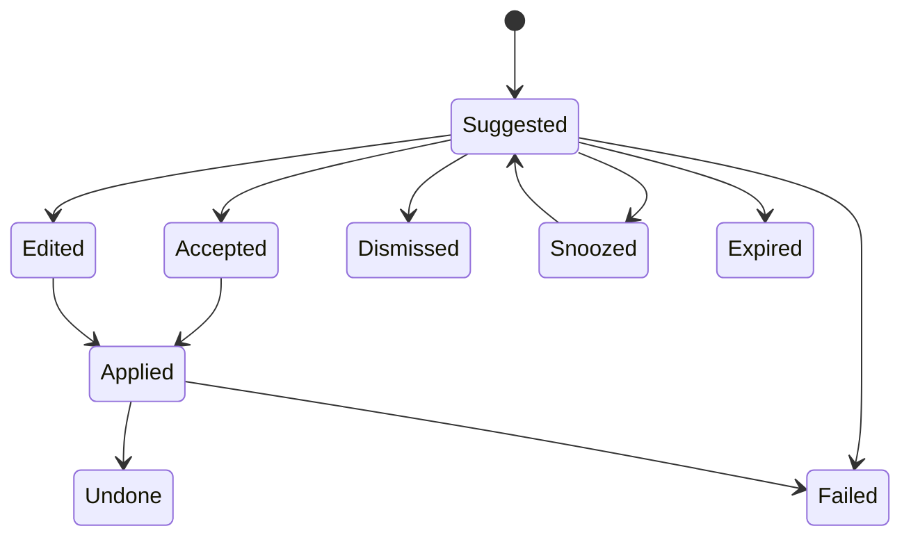

# PA Product Information Architecture Spec

Updated: 2026-07-21

## Status

| Field | Value |
| --- | --- |
| Document type | Product spec / current durable contract |
| Status | Core v1 information architecture implemented; explicitly future sections remain proposals |
| Feature family | Product Information Architecture |
| Primary surfaces | Chat, Pagelet, Memory panel, Review Queue |
| Related research | [PA Agent AI insight research report](../archive/pa-agent-ai-insight-research-report.md) |
| Related specs | [Quick Capture and Micronote spec](./specs/pa-quick-capture-micronote-product-spec.md), [Quiet Recall and Insight Timing spec](./specs/pa-quiet-recall-insight-timing-product-spec.md), [Saved Insight and Insight Ledger spec](./specs/pa-saved-insight-ledger-product-spec.md), [Scope Recap and Theme Summary spec](./specs/pa-scope-recap-theme-summary-product-spec.md), [Memory Type Taxonomy spec](./specs/pa-memory-type-taxonomy-product-spec.md), [Retrieval Habit Profile spec](./specs/pa-retrieval-habit-profile-product-spec.md), [Context Pager spec](./specs/pa-context-pager-product-spec.md), [PA Active Vault Indexer spec](./specs/pa-active-vault-indexer-product-spec.md), [Pagelet Trust Layer spec](../archive/pagelet-trust-layer-product-spec.md), [Pagelet Maintenance Review spec](../archive/pagelet-maintenance-review-product-spec.md), [Lightweight Graph Discovery spec](./specs/pa-lightweight-graph-discovery-product-spec.md), [PA Data Boundary spec](./specs/pa-data-boundary-product-spec.md), [PA Eval Harness spec](./specs/pa-eval-harness-product-spec.md) |
| Related Pagelet docs | [Pagelet product design](./pagelet-product-design.md), [Pagelet async result plan](../archive/pagelet-async-result-plan.md), [Pagelet user guide](../guides/pagelet-user-guide.md) |
| Product doctrine | [Low-Burden Review Product Principles](./pa-low-burden-review-product-principles.md) |

This spec defines the product information architecture for PA's AI-native
knowledge workflows. Its core surface split is implemented; sections explicitly
marked future or out of scope remain proposals.

The goal is to keep PA from collapsing into either:

- a more powerful ChatGPT window where every workflow becomes chat; or
- a swollen Pagelet Bubble that tries to show every review, memory, and
  maintenance decision in the smallest possible surface.

PA needs several surfaces with clear roles:

- Chat invokes capabilities.
- Pagelet reviews candidates and decisions.
- Bubble previews only the most timely nudges.
- Memory panel governs confirmed long-term memory.
- Review Queue carries user-kept items and typed action/confirmation items
  across surfaces when there is user intent or durable consequence.

This document records the one-question-at-a-time product decisions confirmed on
2026-06-28. It should guide future SDD work before runtime implementation.

Memory-specific supersession: the active
[Memory Control Center spec](./specs/pa-memory-control-center-product-spec.md)
supersedes IA-D1 and later standalone Memory-panel assumptions. Settings ->
Memory and personalization is the canonical complete governance destination;
Pagelet retains Memory Candidate review, while Chat/Recall/AI Insights keep
contextual explanation and exact deep links. All non-Memory surface decisions
in this document remain active.

## Confirmed Decisions

| ID | Decision | Product consequence |
| --- | --- | --- |
| IA-D1 | Memory needs an independent panel, but Memory Candidate discovery and confirmation stay in Pagelet. | Pagelet handles candidate review; Memory panel manages confirmed memories after they become durable user-facing state. |
| IA-D2 | Chat is an invocation surface, not the main management surface. | Chat can trigger PA capabilities, but complex review, confirmation, source inspection, maintenance, and memory governance route to Pagelet or Memory panel. |
| IA-D3 | Pagelet owns the unified Review Queue at Panel/Tab level; Bubble only previews high-signal nudges. | Pagelet can be the review surface without making the Bubble complex. |
| IA-D4 | Review Queue is logically global, with context-filtered UI. | One queue model can serve Pagelet, Memory, Maintenance, Graph Discovery, and Chat-triggered flows while each surface shows only the relevant slice. |
| IA-D5 | Product Information Architecture needs its own spec. | The surface contract is cross-cutting and should not be hidden inside Memory, Maintenance, or Pagelet implementation specs. |
| IA-D6 | Preview is not queue debt. | Read-only cues, digests, and generated candidates become queue items only after user-kept intent or durable proposed change. |

## 1. Product Decision

PA should use a surface architecture, not a single center.

The durable product shape:

> PA is a knowledge operator with separate surfaces for invocation, review,
> memory governance, and quiet status.

This matters because the research report repeatedly points to the same product
risk: advanced AI systems become untrustworthy when they hide evidence,
silently mutate state, or push too many decisions into a chat transcript.

The architecture should therefore separate four jobs:

| Job | Product surface | Why this surface |
| --- | --- | --- |
| Ask, delegate, command, or explore | Chat | Natural for open-ended intent and follow-up |
| Review candidates, evidence, conflicts, and proposed actions | Pagelet Panel/Tab | Natural for scoped review, source evidence, and explicit decisions |
| Notice quiet status or one timely nudge | Pet/Bubble | Natural for low-friction awareness |
| Govern confirmed durable personal memory | Memory panel | Natural for long-lived identity, scope, stale state, and forgetting |

## 2. Surface Responsibilities

### 2.1 Chat

Chat is the invocation surface.

Chat can:

- answer questions using vault evidence
- trigger current-note review
- trigger broad review or maintenance scan
- create a Memory Candidate from a user request such as "remember this"
- explain which sources were used
- link the user into Pagelet, Memory panel, or a source note

Chat should not:

- become the primary queue UI
- hide a complex review flow inside a transcript
- confirm durable memories without a review surface
- apply multi-note maintenance actions without a review artifact
- become the only place to inspect source evidence

Product rule:

> Chat can start work, but review-heavy work should finish in the right surface.

### 2.2 Pet

The Pet is the quiet presence layer.

It can show:

- idle / preparing / available / needs attention / error state
- small badges or subtle state changes
- one click into the Bubble

It should not show:

- task lists
- review queues
- memory conflicts
- maintenance diffs
- evidence chains
- local graph neighborhoods

Product rule:

> The Pet tells the user that PA is available; it does not ask the user to
> manage PA.

### 2.3 Bubble

The Bubble is a preview and nudge layer.

It can show:

- 1 to 3 high-signal items
- short status summaries
- `View`, `Dismiss`, and `Later` style actions
- a route to Pagelet Panel or Tab

It should not show:

- full maintenance proposal lists
- Memory Conflict diff views
- full Review Queue filters
- local graph exploration
- source microscope views
- rollback details
- grouped processing controls that bypass explicit review

Product rule:

> The Bubble is not the queue. The Bubble is the doorway.

### 2.4 Pagelet Panel

The Pagelet Panel is the current-scope review surface.

It can show:

- current note review items
- current folder or selected-scope review items
- included/skipped sources
- why-shown labels
- Memory Candidates born from the current review
- lightweight graph-aware discovery items
- maintenance proposals for the active scope
- evidence cards and source-backed cards

The Panel should optimize for:

- scoped attention
- readable evidence
- quick accept/edit/dismiss decisions
- direct navigation to source notes

Product rule:

> The Panel answers: "What should I review for this current context?"

### 2.5 Pagelet Tab

The Pagelet Tab is the global review and source-backed exploration surface.

It can show:

- global Review Queue
- maintenance scan results
- filters by type, scope, and priority
- review history
- broad scan progress
- postponed items
- stale or failed items that need user attention

The Tab should optimize for:

- global vault maintenance
- explicit per-item or approved grouped resolution
- calm triage

Product rule:

> The Tab answers: "What needs my attention across the vault?"

### 2.6 Memory Panel

The Memory panel is the confirmed memory governance surface.

It can show:

- Confirmed Memories
- memory type, source, scope, confidence, and lifecycle state
- stale memories
- forgotten memories when recoverable
- conflicts involving confirmed memories
- export options
- local store versus vault-artifact visibility

It can let the user:

- edit memory wording
- limit memory scope
- mark memory stale
- forget memory
- inspect source evidence
- export or save selected memories as vault artifacts

It should not become:

- the primary candidate review queue
- the global maintenance workbench
- the broad retrieval debugger

Product rule:

> Pagelet decides what may become memory. Memory panel governs what already is
> memory.

## 3. Review Queue Contract

The Review Queue should be logically global and physically shared, while each
surface presents a context-filtered view.

The Review Queue should stay small and consequential. It is not the storage
place for every AI-generated candidate, recall cue, weak graph relation, or
digest line. Use it when there is user intent (`Keep`, `Later`, `Save`) or a
durable proposed consequence such as Memory, Markdown, maintenance, or external
action.

Product IA is the canonical owner for Review Queue item types. Other specs may
describe the subset they emit or consume, but they should not introduce new
queue type strings unless this table is updated first.

### 3.1 Queue Item Types

Canonical v1 item types:

| Type | Origin | Primary review surface |
| --- | --- | --- |
| `evidence_insight` | Trust Layer / Pagelet review, only after user-kept or durable proposal | Pagelet Panel |
| `memory_candidate` | Trust Layer / Chat / Pagelet | Pagelet Panel or Tab |
| `memory_conflict` | Trust Layer | Pagelet Panel or Memory panel handoff |
| `maintenance_proposal` | Maintenance Review | Pagelet Panel or Tab |
| `capture_enrichment` | Quick Capture, only for durable or user-kept enrichment | Pagelet Panel or Tab |
| `task_suggestion` | Quick Capture / Maintenance Review | Pagelet Panel or Tab |
| `recall_suggestion` | Quiet Recall, only for user-chosen later/save/promote handoff | Pagelet Bubble, then Panel |
| `related_note` | Graph Discovery, only after user-kept or explicit review context | Pagelet Panel |
| `theme_chain` | Graph Discovery, only after user-kept or explicit review context | Pagelet Panel or Tab |
| `conflict_pair` | Graph Discovery / Trust Layer | Pagelet Panel or Tab |
| `index_note_candidate` | Graph Discovery / Maintenance Review | Pagelet Tab |
| `review_summary` | Pagelet review / Scope Recap / periodic summary | Pagelet Tab |
| `broad_scan_plan` | Active Vault Indexer | Pagelet Tab |
| `action_log` | Maintenance Review / Write actions | Pagelet Tab |

Future item types should be added only when they need different lifecycle,
permission, or display behavior. Do not create new item types just for copy
variation.

Terminology rules:

- User-saved insights are `Saved Insight` objects, not queue items.
- PA-discovered insight candidates do not enter the queue by default. A
  user-kept or durable PA-discovered insight proposal enters the queue as
  `evidence_insight`.
- `theme_chain` may create a Saved Insight, an index note candidate, or a
  `memory_candidate`; it is not itself Confirmed Memory.
- Memory Candidate types come from
  [Memory Type Taxonomy](./specs/pa-memory-type-taxonomy-product-spec.md):
  `preference`, `decision`, `project_context`, `task_constraint`, and
  `open_question`.
- Do not use `scope_state`, `profile_fact`, `saved_insight_candidate`, or
  `insight_candidate` as v1 canonical type strings.

### 3.2 Shared Fields

Every queue item should have:

| Field | Meaning |
| --- | --- |
| `id` | Stable queue item id |
| `type` | One of the typed review item categories |
| `scope` | Current note, folder, tag, selected notes, whole vault, or custom scope |
| `sourceRefs` | Source-backed references from Active Vault Indexer |
| `originSurface` | Chat, Pagelet, weekly scan, Memory, or system background job |
| `priority` | Low, normal, high, or urgent; urgent should be rare |
| `status` | Suggested, accepted, edited, applied, dismissed, snoozed, expired, failed, or undone |
| `createdAt` | When the item was created |
| `updatedAt` | When user or system last changed it |
| `whyShown` | Human-readable reason the item appears |
| `dataBoundarySnapshot` | Policy snapshot used when the item was generated |
| `replayRef` | Optional reference to eval/replay trace for debugging and audits |

### 3.3 Status Rules

Suggested status flow:

Not every item supports every transition. For example:

- `memory_candidate` can become Confirmed Memory after the user confirms or edits it.
- `maintenance_proposal` can become applied, failed, or undone.
- `related_note` can be saved, dismissed, or converted into a stronger link
  proposal later.
- `broad_scan_plan` can be approved to run, edited, or dismissed.

## 4. Surface Routing Rules

### 4.1 Chat Routes Out

When Chat produces a workflow that needs structured review, it should return a
compact result and route the user out.

Examples:

| Chat intent | Chat output | Destination |
| --- | --- | --- |
| "Review this note" | Short confirmation plus one top finding | Pagelet Panel |
| "Organize my vault" | Scope preview and plan | Pagelet Tab |
| "Remember this preference" | Candidate created | Pagelet Panel or Memory candidate review |
| "Find notes about X" | Answer with sources | Source-backed cards; Pagelet Panel if exploration continues |
| "Clean up old project notes" | Plan and affected scope | Pagelet Maintenance Review |

### 4.2 Bubble Routes Deeper

Bubble actions should be small and follow the owning delivery contract. For
Quiet Recall:

- `View` opens or expands the current candidate in Recall Detail Tab and adds
  zero provider reruns.
- `Later` closes the Bubble and creates one item in the existing Review Queue as
  explicit return intent. It is not a fixed snooze and does not create a
  parallel queue model.
- `Dismiss` closes only the exact candidate. Only an enabled Retrieval Habit
  Profile may record a weak candidate-specific signal; when it is off,
  collection, writes, and ranking influence are all zero.
- Passive close or ignore is neutral. `Link` / `Save` remain in Recall Detail
  Tab.

Other queue item types may retain a generic `Snoozed` transition when their own
contract explicitly allows it; that transition does not redefine Quiet Recall
`Later`.

The Bubble should avoid destructive or durable actions. It may support low-risk
acknowledgements only when the underlying queue item remains inspectable later.

### 4.3 Pagelet Routes To Memory

When a Memory Candidate is confirmed:

1. Pagelet records the user's selected wording and sourceRefs.
2. Trust Layer creates or updates Confirmed Memory.
3. Memory panel becomes the long-term place to inspect, edit, stale, forget, or
   export that memory.

Pagelet can still show a compact success state, but it should not become the
long-term memory cabinet.

### 4.4 Pagelet Routes To Source Notes

Every source-backed card should let the user open:

- the source note
- the relevant section or excerpt when possible
- the source card's evidence details
- the Review Queue item that used it

This keeps PA verifiable without turning every surface into a source debugger.

## 5. Pagelet Layer Contract

The Pagelet progressive disclosure stack should keep distinct responsibilities.

| Layer | Role | Maximum complexity |
| --- | --- | --- |
| Pet | Status and availability | Single state plus small badge |
| Bubble | Timely preview | 1 to 3 items, lightweight actions only |
| Panel | Current-scope review | Focused cards, source-backed evidence, scoped queue |
| Tab | Global review | Filters, Scope Recap, maintenance, explicit actions |

### Bubble Allowed Content

Allowed:

- "2 kept or action-ready items"
- "1 possible memory to confirm"
- "Weekly maintenance scan is ready"
- "This note may connect to 3 older notes"
- "Open Pagelet" or `View`

Not allowed:

- full maintenance lists
- multi-file diff previews
- memory merge conflict details
- graph visualization
- queue filters
- rollback or undo history
- source evidence microscope

### Panel Allowed Content

Allowed:

- focused queue items
- evidence cards
- current note and nearby scope
- source-backed Memory Candidates
- action previews for active scope
- small graph-aware local context

### Tab Allowed Content

Allowed:

- full global queue
- periodic scan
- explicit per-item review
- deferred items
- review history
- broad source plans
- maintenance history and action logs

## 6. Memory UI Contract

Memory has three stages and three surface responsibilities.

| Stage | Meaning | Primary surface |
| --- | --- | --- |
| Memory Candidate | PA thinks this may be worth remembering | Pagelet |
| Confirmed Memory | User has confirmed or edited it into durable memory | Memory panel |
| Used Memory | PA selected it for a current run | Chat/Pagelet compact trace |

### Candidate Review

Pagelet should show:

- proposed memory text
- type
- sourceRefs
- why it was proposed
- suggested scope
- possible conflicts
- accept/edit/dismiss/snooze

### Confirmed Memory Governance

Memory panel should show:

- all Confirmed Memories
- type filters
- source filters
- scope filters
- stale/conflict indicators
- edit/stale/forget/export actions

### Memory Usage Trace

Chat and Pagelet should show:

- which memories were used
- why they were used
- whether any matching memories were dropped by Context Firewall
- source-backed links when available

This trace should be compact. It should not expose the whole memory management
UI inside Chat.

## 7. Product Principles

### Principle 1: Invocation Is Not Governance

Chat is good at intent. It is weak at durable state governance. Long-lived
memory, maintenance, and review decisions need stable surfaces.

### Principle 2: Preview Is Not Queue

Bubble is good at gentle awareness. It is weak at list management. Keep review
queues in Panel/Tab.

Preview, recall, and digest candidates should be disposable. A queue item means
the user chose to keep it or PA is proposing a durable consequence.

### Principle 3: Candidate Is Not Confirmed Memory

AI can propose personal memory, but confirmed memory needs user-visible
acceptance, editing, or later governance.

### Principle 4: Global Model, Local View

Review Queue should be global in data model and local in presentation. Users
should feel the queue is relevant to their current context, not like a second
inbox that demands constant management.

### Principle 5: Evidence Should Travel Across Surfaces

The same source-backed card model should appear in Chat, Pagelet, Memory, and
Maintenance, with surface-appropriate density.

## 8. Non-goals

MVP should not include:

- a standalone top-level "AI Dashboard"
- a standalone Active Vault Indexer destination
- a full-vault graph browser
- a Bubble-based queue manager
- Memory Candidate review inside Memory panel as the primary flow
- Maintenance Review hidden inside Chat transcripts
- one modal for every action
- automatic source-note mutation without a review artifact

## 9. Roadmap

### Phase 0: Product Contract

- Keep this spec linked from every cross-surface PA planning spec.
- Align terminology: Chat, Pet, Bubble, Pagelet Panel, Pagelet Tab, Memory
  panel, Review Queue.
- Ensure future SDDs state which surface owns each workflow.

### Phase 1: Shared Review Queue Data Model

- Define queue item schema.
- Map Trust Layer, Maintenance Review, Graph Discovery, and broad retrieval
  plans into typed queue items.
- Add sourceRefs, data boundary snapshot, status, and replayRef.
- Keep storage local-first.

### Phase 2: Pagelet Panel Current-scope Queue

- Show current note and selected scope items.
- Render evidence cards and why-shown labels.
- Support accept/edit/dismiss/snooze.
- Route confirmed Memory Candidates to Trust Layer and Memory panel.

### Phase 3: Pagelet Tab Global Queue

- Add global filters.
- Add periodic scan view.
- Add grouped processing only for low-risk actions with an explicit product spec
  and user approval boundary.
- Add review history and applied action logs.

### Phase 4: Bubble Digest

- Show only top 1 to 3 nudges.
- For Quiet Recall, use `View`, `Later`, and `Dismiss` with the exact semantics
  in section 4.2; do not add `Link` / `Save` to Bubble.
- Route deeper review to Panel/Tab.
- Avoid durable or destructive actions from Bubble.

### Phase 5: Memory Panel Governance

- Show Confirmed Memories.
- Support edit, scope limit, stale, forget, and export.
- Show sourceRefs and conflict indicators.
- Keep candidate review in Pagelet.

### Phase 6: Chat Invocation Routes

- Add structured routes from Chat intents to Pagelet, Memory panel, and source
  cards.
- Keep Chat answers compact when deeper review is needed.
- Add "open in Pagelet" handoff for complex review.

## 10. Open Questions

- Should Pagelet Tab be implemented as a full Obsidian ItemView, a mode inside
  the existing Pagelet panel, or both?
- What exact filters should the first global Review Queue expose?
- Should `action_log` live only in Pagelet Tab, or also have a compact history
  entry in Settings or Memory?
- What prioritization rule decides the Bubble's top 1 to 3 nudges?
- Should Memory panel be a sidebar view, a command-opened modal, or a tabbed
  section inside the existing PA view?
- How much queue state should be persisted to Markdown artifacts versus local
  store only?

## 11. Summary

Product IA prevents PA from turning into a single overburdened surface.

The durable contract:

- Chat invokes.
- Pet signals.
- Bubble previews.
- Pagelet reviews.
- Memory panel governs confirmed memory.
- Review Queue connects them with typed, source-backed decisions.

This gives PA hands without sacrificing trust, and gives PA memory without
turning every personal decision into a chat transcript.
