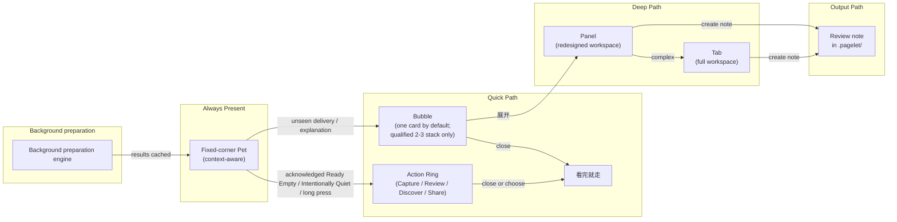
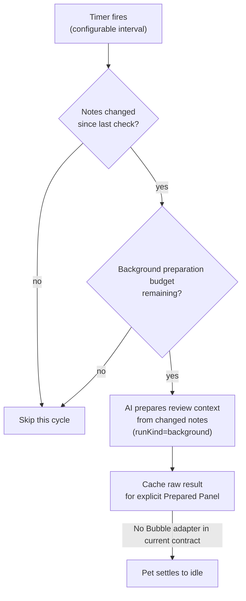

# Pagelet Product Design

> [!note] Current authority is this design together with the
> [PA Product North Star](./pa-product-north-star.md), [DEC-017](./decisions/dec-017-default-background-recap-preparation.md)
> through [DEC-027](./decisions/dec-027-bounded-retrieval-recovery.md),
> the [B-108 owning Scope Recap spec](./specs/pa-scope-recap-theme-summary-product-spec.md),
> and the [B-121 Attention-Aware Delivery spec](./specs/pagelet-attention-aware-delivery-product-spec.md).
> [DEC-035](./decisions/dec-035-bounded-cleanup-and-pagelet-scope-retirement.md) and the
> [B-136 cleanup spec](./specs/pa-bounded-code-cleanup-product-spec.md) narrowly supersede
> the old Panel scope-selection promise and its unreachable generic preparation
> chain; they do not retire global source boundaries. The current command section
> below governs legacy aliases: Quick review/review/recall/recap invoke explicit
> active-note Deep Discover. Earlier Bubble-hotkey scenarios are historical for
> those aliases. Under [DEC-052](./decisions/dec-052-prepared-review-deep-discover-route.md),
> `Open prepared review` is also an explicit Deep Discover compatibility entry
> that may invoke the provider. `Open Pagelet` remains provider-free; no generic
> raw-preload producer or Prepared Panel remains.
> Archive discussions are provenance only, never the current baseline.

> 2026-10-06 reconciliation: Owner explicitly accepted the existing
> [callback route](../../src/pagelet/orchestrator.ts) through DEC-052 after the
> zero-call wording/code mismatch was reported. This dated choice supersedes that
> promise; it does not backdate approval or expand historical verification.

> [DEC-051](./decisions/dec-051-proportionate-confirmation-and-contract-alignment.md)
> now owns necessary confirmation and manual/automatic budgets: source count is
> not a risk gate; explicit requests do not consume automatic quota; automatic
> Deep Discover defaults to 12/hour and 36/day started runs. These are adjustable
> defaults, with no new settings UI. The old Quiet Recall 10/50 provider-call
> bucket is historical and is not merged with this run counter. Runtime alignment
> and verification belong to [B-161 最终验证](../archive/2026/b161-contract-alignment-validation.md).

## Status

| Field | Value |
| --- | --- |
| Feature name | `Pagelet` (中文：`拾页`) |
| Internal codename | Review Assistant |
| Document type | Pagelet Product Design |
| Status | Core beta and B-108/DEC-017/DEC-018/DEC-019/DEC-020 runtime shipped through BRAT `2.9.0-beta.2`; prior deploy/desktop/iPhone BRAT smoke and user-operated long-press/Review/Discover/Scope Recap evidence remain provenance. B-118 DEC-023/DEC-024 actual-call admission, Review/preload classification, Quiet Recall pure-semantic retrieval、live-source/Saved Insight and owner-aware nudge boundaries pass full automated、adversarial review and deployment-identity gates. B-121 three-action Ring evidence covers automated、review、local/iCloud deployment、desktop and iPhone portrait gates；its physical landscape waiver remains historical only. B-121 core runtime is included in BRAT `2.9.0-beta.5`. The 2026-08-06 DEC-025/DEC-026 amendment adds Share as the fourth Ring action；the 2026-08-07 owner amendment accepts the current `master` compact layout fallback. B-124 is closed, with current behavior in DEC-026, its Product Spec, Architecture, tests and the smoke checklist. DEC-027/B-125 defines the current implemented 0–2 insight and single-recovery contract；its validation and per-flag rollout dispositions are closed in [B-125 compact evidence](../archive/2026/b-125-retrieval-optimization-closeout.md). |
| Last revised | 2026-10-06 |
| Primary surface | Fixed-corner floating Pet entry + progressive disclosure (Bubble / Panel / Tab) |
| Runtime relationship | Current Deep Discover uses `PaAgentLoop` with `CapabilityRegistry` / `PolicyEngine`, `runKind="review"` and `allowWrite=false`; the D024 adapter and D032 generic background route are historical |
| Write boundary | Background Deep Discover stays read-only. Current explicit Operations requests follow DEC-051 with source/permission checks and real receipts; optional preview remains non-executing. There is no standalone Periodic Summary save contract. |
| Background preparation engine | Current automatic Deep Discover uses note-trigger scheduling and source admission. DEC-035 retires the unreachable generic timer/change-detector/preload chain; persisted settings remain compatible. |
| Prepared Scope Recap history | DEC-017/018/019 describe the predecessor behavior. The current Scope Recap command aliases explicit active-note Deep Discover; this row does not revive its old preparation pipeline or controls. Shared first-use disclosure and current source boundaries still apply. |
| Historical reference | [review-assistant-product-design.md](../archive/review-assistant-product-design.md) |
| Current decisions | D001-D041 as reconciled in this document, with DEC-017 through DEC-027 and the owning Scope Recap/Quiet Recall/B-121/B-124/B-125 contracts taking precedence for their scopes; DEC-035, DEC-051 and DEC-052 supersede the retired routes, confirmation/budgets and Open prepared review zero-call promise in their stated scopes |
| Historical decisions provenance | [review-assistant-decisions.md](../archive/review-assistant-decisions.md) (non-authoritative) |
| Technical design | See [pagelet-sdd-guide.md](../development/workflows/pagelet-sdd-guide.md); [review-assistant-sdd.md](../archive/review-assistant-sdd.md) is preserved as historical implementation context |
| Product doctrine | [Low-Burden Review Product Principles](./pa-low-burden-review-product-principles.md) |

This document defines the current **Pagelet** product and UX contract. Historical Review Assistant/Pagelet drafts are preserved only as reference. Sections marked as future work describe the intended direction, not current shipped behavior.

---

## Product Promise — [PRESERVED, EXPANDED]

> **Pagelet — your note's quiet reviewer.**
>
> 拾页 —— 笔记写完后的安静审视者。

The core promise is preserved from historical design. Pagelet expands the delivery surface:

Pagelet helps users revisit recent notes, discover connections, receive instant review insights, and optionally turn findings into review notes.

Pagelet's deeper value is that the user's own thoughts can return at the right
moment without creating another thing to manage. A Pagelet hint is allowed to be
read and ignored. A review session is allowed to end without saved output.
Durable output or vault changes happen only when the user chooses them.

The promise stays intentionally narrow:

- It reviews recent notes, not the whole vault by default. **[PRESERVED]**
- It produces evidence-backed findings, not free-form inspiration. **[PRESERVED]**
- The user decides when to view, when to go deeper, and when to produce output. **[CHANGED — replaces "the user selects what matters, not the model"]**
- It creates review notes only after explicit confirmation. **[PRESERVED]**
- It treats read-only findings as ignorable by default; only durable saves,
  Memory updates, or vault changes require confirmation. **[NEW]**
- The Pet is a memorable, always-present entry and context-aware companion, not the product's core value. **[CHANGED — from "mascot is a memorable entry"]**
- Background review preparation makes valid insights ready the instant the user asks; when no reliable insight exists, explicit Recap open returns immediate honest scope orientation instead of waiting or pretending. **[DEC-017/DEC-019]**

---

## Positioning — [PRESERVED, EXPANDED]

Pagelet is a **note-review workflow with a context-aware floating Pet and progressive disclosure UI**. It is not a screen pet with growth mechanics, task manager, general write agent, or autonomous executor.

The product value is a multi-path review loop:



The memorable UI line (updated for Pagelet):

> A recognizable little paper companion sits quietly in the corner of the workspace. Background review preparation makes valid insights ready instantly when the user asks; when it cannot, an explicit Recap open immediately gives an honest scope/source orientation. A Pet short click opens Bubble for an unseen delivery or required explanation, and opens the Capture / Review / Discover / Share Action Ring after Ready Empty or Intentionally Quiet has been explained; the Quick Review hotkey remains an explicit Bubble entry. Only when every candidate independently clears the quality gate may the user switch through a restrained 2-to-3-card stack. Generic and Quiet Recall proactive hints remain off until enabled; high-value Scope Recap uses the separate DEC-018 default. The user can go deeper into a panel or explore connections.

**[CHANGED from historical design]**: historical design described a linear pipeline (open -> select range -> analyze -> findings -> collect -> confirm -> note). Pagelet replaces this with progressive disclosure across four layers (Pet -> Bubble -> Panel -> Tab) and four usage scenarios.

---

## Differentiation — [PRESERVED]

Pagelet differentiates against same-category AI plugins and writing assistants through three axes (D006):

| Axis | Statement |
| --- | --- |
| **Review-first** (primary) | Others help you write; Pagelet helps you review what you wrote. |
| **Non-intrusive** (secondary) | Every suggestion is dismissible. Pagelet never modifies your notes silently. |
| **Vault-aware** (moat) | Pagelet draws on your own past notes, tags, and links as context. |

Differentiation touchpoints unchanged from historical design. Pagelet does NOT name competitors in user-facing copy.

---

## Target Users — [PRESERVED, EXPANDED]

Primary (preserved from historical design):

- Users who keep daily notes, work logs, research notes, project journals, or meeting notes in Obsidian.
- Users who already write enough material that periodic review can surface patterns, missing follow-ups, research gaps, and idea threads.
- Users who treat Obsidian as a thinking system or personal knowledge base.
- Users already comfortable with PA Agent / Memory reading their notes after explicit action.

Secondary (expanded in Pagelet):

- Users who prepare weekly reviews, project retrospectives, newsletters, research summaries, or planning notes.
- Users who need a low-friction way to transform scattered recent notes into a working draft.
- **[NEW]** Users who want subtle, non-intrusive writing assistance — gentle hints while writing, not autocomplete or inline suggestions.
- **[NEW]** Users who want to discover unexpected connections between notes without manually searching.

Non-target for Pagelet:

- Users who rarely write notes.
- Users who expect a task manager with completion tracking and due dates.
- Users who want a highly playful pet (growth, emotion, feeding, decoration).
- **[CHANGED]** ~~Users who want an autonomous assistant that monitors notes in the background.~~ — Pagelet uses background review preparation as a performance optimization, with opt-in proactive hints. Users who want **uncontrollable** autonomous assistants remain non-target.

---

## Problems To Solve — [PRESERVED, EXPANDED]

Preserved from historical design:

- **Review cost is high.** Manually scanning yesterday, the last three days, or the last week is tedious.
- **Review itself can become burden.** If Pagelet turns every AI finding into a
  pending item, it recreates the knowledge-management work it is supposed to
  reduce.
- **Ideas and follow-ups get buried.** Notes contain "look this up later", "maybe turn this into...", TODOs, partial insights, unresolved questions that never become next steps.
- **Blank-prompt friction is real.** A structured review starts from recent notes rather than a blank chat box.
- **Insight-to-note handoff is weak.** A good AI answer is not enough if the user must manually copy, edit, cite, and organize it.
- **Trust depends on provenance.** Users need to know which notes were read, which were skipped, and why a recommendation was made.

New in Pagelet:

- **[NEW] Review initiation friction.** historical design requires opening a panel, selecting a time range, and clicking Run. This is too many steps for a quick check. Users need a zero-step path (prepared insights + Pet bubble) and a one-step path (hotkey -> valid insight or honest local orientation).
- **[NEW] Writing-time blindness.** While writing a note, users cannot see connections to their past notes without stopping to search. Prepared insights can surface these connections when they are most useful.
- **[NEW] Knowledge silos within the vault.** Notes on related topics written days or weeks apart remain disconnected. Prepared analysis can bridge these silos.
- **[NEW] Periodic review ceremony is too heavy.** historical design's periodic review requires scope selection, manual include/exclude, draft collection, editing, and confirmation. For a "weekly summary," this is too much friction.

Pagelet does NOT try to solve (preserved from historical design):

- Habit formation for users who do not record notes.
- Full task management.
- Automatic rewriting of source notes.
- Whole-vault intelligence by default.
- ~~Autonomous long-running agent work.~~ **[REVISED]** Pagelet supports bounded background review preparation, but not unbounded autonomous agent work.

---

## Product Principles — [REVISED]

1. **Review first, Pet second.** The Pet exists to make the entry recognizable, the state legible, and context accessible. It must not pull scope toward decoration. **[PRESERVED — "mascot" renamed to "Pet"]**

2. **安静审阅者，诚实响应。** 优先呈现仍然有效、可核对来源的发现；显式发现需要服务商时，应展示实际进度或结果，不承诺即时洞察。自动发现采用当前笔记活动触发机制，旧 D032 通用定时准备不是当前运行契约。 **[CHANGED — DEC-035 / DEC-052]**
   - English: "The quiet reviewer, honest response. Show valid source-backed findings when available; otherwise make the actual discovery state clear."

3. **Evidence over fluency.** Every suggestion must point back to source evidence. Suggestions without sources should be discarded, downgraded, or shown as "needs confirmation". **[PRESERVED]**

4. **Output is optional, and when chosen, minimal-friction.** Deep Discover
   creates no note automatically. The Panel's save action creates a separate
   review note through the existing preview/confirmation flow.
   Broader time-range Recap needs separate current authority; standalone
   Periodic Summary is not a current success contract. **[CHANGED]**

5. **Review should feel like recognition, not administration.** A user can read
   a Bubble, close it, and owe Pagelet nothing. Findings do not become queue
   items merely because PA generated them. Pagelet review-note saves and
   association actions retain their own preview/confirmation; Chat may execute
   a clear current modification request under DEC-051 without a second approval.
   Domain-specific permission and confirmation boundaries still apply. **[NEW]**

6. **Fewer better findings.** Pagelet returns `0–2` independently validated
   insights per Deep Discover run. Two is a ceiling, not a target; it may return
   one or stay quiet, and it never pads categories for completeness. **[DEC-027]**

7. **Vault-local and transparent.** Settings and feedback state are scoped to the current vault. Findings expose their actual sources; retained source/context views describe their own boundaries without reviving the retired scope controls. **[CHANGED]**

8. **Narrow write boundary.** Pagelet keeps Deep Discover read-only. Basic Operations follow the [essential-capabilities contract](./specs/pa-agent-essential-capabilities-product-spec.md), without the retired opt-in gate. A user-opened, source-backed insight may prepare its bounded association action for preview/confirmation; the separate Panel save action also requires preview/confirmation. Multi-file, judgment-heavy, or uncertain work moves to Chat with visible context. DEC-051 permits current explicit modification requests in Chat to execute without a second confirmation; merely opening or staging a proposal never authorizes execution. No background writes. **[CHANGED — DEC-037 / DEC-051]**

9. **Quiet and non-intrusive.** Pagelet's voice and presence prioritise calm. No urgency, no interruption, no claim of being indispensable. The Pet never pops up a modal, plays a sound, or demands attention. **[PRESERVED]**

---

## Naming — [PRESERVED]

| Aspect | Value |
| --- | --- |
| Formal feature name | `Pagelet` |
| Chinese name | `拾页` |
| Pet / Mascot (same entity) | `Pagelet` / `拾页` |
| Internal codename | `Review Assistant` (legacy; kept in code identifiers where renaming is too costly) |

Rationale and alternatives see decisions D001.

User-facing copy across all surfaces (UI, settings, README, community description) uses `Pagelet` / `拾页`.

---

## Pet Design — [NEW MAJOR SECTION — replaces historical design "Mascot UX"]

### Role

The Pet is Pagelet's always-present, context-aware companion:

- It makes Pagelet visible and memorable. **[PRESERVED from historical design mascot]**
- It communicates current state (resting, idle, working, nudge). **[CHANGED — 4 states replace historical design's 4, refined]**
- It opens progressive disclosure layers (Bubble -> Panel -> Tab). **[NEW]**
- On desktop and iPad, it is fixed to a configurable corner of the active markdown leaf; on iPhone, it follows the active note toolbar. **[UPDATED]**
- It auto-senses the current note context. **[NEW]**

It is NOT a full pet-care product, complex notification system, or autonomous agent surface.

### Visual Direction — [PRESERVED from D004, D005]

The Pet follows visual direction **A - 极简线稿** (D004) and is anchored on **④ - Tldraw-like 手绘人文** (D005):

- A folded paper sheet (折角纸张) with minimal hand-drawn lines for facial expression.
- 1.6px strokes with slight jitter for handcraft feel.
- Rounded line caps and joins, no sharp corners.
- Neutral gray base (`#e8e8e8`), with state-driven accent colors.
- Slight float idle animation (2.4s ease-in-out) and occasional blink — only when motion is permitted.

Visual spec: `docs/archive/assets/pagelet-visual-spec.html` (D004 + D005 merged execution reference).

Avoid (preserved from historical design):

- Animal-pet or generic-robot iconography.
- Feeding, mood, level, clothing, collectible, or pet-care loops.
- Strong animations that compete with editing.
- Cute or clingy language ("主人，我发现啦！" etc.).

### States — [CHANGED — 4 states, refined from historical design's 4]

| State | Stroke / Fill | Animation | Meaning | historical design mapping |
| --- | --- | --- | --- | --- |
| `resting` | `#d0d0d0` gray, low opacity | Eyes closed, no float | Long idle, no note activity | NEW (merges historical design concept of deep idle) |
| `idle` | `#e8e8e8` neutral gray | Slight float + occasional blink | Standby, awake | = historical design `idle` |
| `working` | `#7c9eff` blue | Pulsing dots in mouth area | AI background preparation or user-triggered analysis in progress | = historical design `thinking` (merges background + foreground analysis) |
| `nudge` | `#5dd39e` green, notification dot | Gentle bounce + small dot indicator | A quality-gated hint is ready: generic/Quiet Recall only when explicitly enabled, or the separate DEC-018 Recap exception | NEW |

State not preserved from historical design:

- historical design `done` (`#5dd39e` success green) — in Pagelet, review completion is signaled by the Bubble/Panel closing, not by a Pet state. The Pet returns to `idle` after the user finishes interacting.
- historical design `error` (`#ff6b6b` error red) — in Pagelet, errors are shown as a brief `error` flash on the Pet (1.5s) then the Pet returns to `idle` with a small error badge. The error details appear in the Bubble if the user clicks.

States removed from earlier Pagelet draft:

- `sleeping` — merged into `resting`.
- `watching` — removed. "Eyes following cursor" felt uncomfortable ("staring at you").
- `reading` — merged into `working`. Background review preparation uses the same visual state as foreground analysis.
- `thinking` — renamed to `working` to cover both background preparation and user-triggered analysis.

Decision: **D033** — Pet states: 4 states (resting, idle, working, nudge).

`prefers-reduced-motion` users keep color state changes but lose float/jitter/animation (D007/4).

> **State transitions are automatic.** Pet states are driven by system events
> (note activity detection, background preparation scheduling, analysis
> results). Users do not manually control Pet state. Generic/Quiet Recall
> proactive hints default off and can be enabled by the user; high-value Scope
> Recap has its separate DEC-018 control. State cycling is NOT exposed as a
> setting.

### Desktop and iPad Corner Position — [UPDATED]

- The Pet is fixed to a configurable corner of the active markdown leaf. No drag, no pin, no double-click.
- Position is one of four corners: `bottom-right` (default), `bottom-left`, `top-right`, `top-left`.
- Switchable via Settings (dropdown) or Command Palette (`Pagelet: Move Pet to corner`).
- Position is persisted per vault in `settings.pagelet.petCorner`.
- The Pet avoids overlapping scrollbars, the status bar, and Obsidian workspace chrome.
- On iPhone, the Pet ignores the visual corner while it is rendered beside the
  active note's left toolbar controls. The saved corner remains the preference
  used on desktop and iPad.

Decision: **D034** — Desktop/iPad corner preference with an iPhone active-note-toolbar exception (replaces drag/pin/position memory).

### Proactive Hints (主动提示) — [NEW]

Generic proactive hints for Quiet Recall, Pattern, and review remain opt-in and
**OFF by default**. [DEC-018](./decisions/dec-018-quality-gated-scope-recap-hints.md)
adds one scoped exception: on an eligible bounded Recap path, “高价值回顾提醒” is
on by default and may signal only when a new prepared Scope Recap passes its strict
cross-note quality gate. User-facing language uses “主动提示” or “高价值回顾提醒”,
not “Nudge mode”.

| Setting | Behavior |
| --- | --- |
| 高价值回顾提醒 ON (default for an eligible bounded Recap path) | Only a new, fresh, specific Recap insight backed by at least two notes may transition Pet to `nudge`; click immediately shows the strongest observation. |
| 高价值回顾提醒 OFF | Prepared Scope Recap stays silent and cached; click remains instant when a fresh artifact exists. |
| 其他主动提示 ON | Pattern and onboarding hints use their existing generic gates and the shared Pet nudge treatment; a future qualified Review adapter may join only after its own eligibility gate. Quiet Recall keeps its separate Off/On control. |
| 其他主动提示 OFF (default) | Pattern/onboarding admissions remain quiet; this does not disable high-value Recap, Quiet Recall, or background preparation. |

### Proactive Hints Control Placement — [NEW]

Proactive hints (主动提示) are controlled through the access points below. The
Pet has no right-click control for proactive hints; its 520 ms long-press Action Ring
is reserved for Capture / Review / Discover / Share and does not toggle hint settings.

| Control Point | Action | Notes |
| --- | --- | --- |
| Settings → Pagelet | Full configuration: enable/disable, cooldown interval, quiet hours | Primary configuration surface |
| Panel header | Quick toggle: "主动提示 开/关" | Visible when Panel is open, convenient in-context toggle |
| Command Palette | `Pagelet: Toggle proactive hints` | Accessible from anywhere |
| Keyboard shortcut | Toggle proactive hints (e.g., `Ctrl+Alt+N` / `Ctrl+Alt+Shift+N`) | Follows Obsidian command convention — registered but no default binding |

Decision: **D039** — Proactive hints control placement: Settings (full config) +
Panel header (quick toggle) + Command Palette + keyboard shortcut. The Pet
Action Ring remains a separate Capture / Review / Discover / Share command surface.

### Action Ring Share — [UPDATED 2026-09-18]

The Ring logical and focus order is `Capture / Review / Discover / Share`. Every action retains a
full current-locale label: EN `Capture / Review / Discover / Share as card`; ZH `随手记下 / 审阅 /
发现关联 / 分享为卡片`. The first three actions keep
their current callbacks, routes and provider/data/write boundaries. Share resolves one snapshot at click:

- a trim-nonempty active-editor selection wins, while its original whitespace、line endings and Markdown
  are preserved and no filename/Vault path is shown;
- otherwise the current active Markdown note is used under DEC-026/B-124: strip only a parser-valid leading
  YAML frontmatter, keep the remaining body, and show basename without directory or `.md`;
- no active Markdown note or empty projected body opens no Share Card Modal and yields a local recoverable
  notice. Ring Share itself makes no provider call、upload or automatic Vault write.

Desktop/iPad prefer a compact inward arc toward content. On a non-phone-toolbar surface with a fine
hover pointer, the buttons show icons by default and reveal the complete label on hover and keyboard
focus; no-hover touch surfaces keep visible labels. If the complete button targets cannot fit without
overlap, the whole group falls back to a compact row or column. iPhone uses one horizontal row when all four complete
labels fit the available safe width, otherwise the whole group becomes one vertical column with no partial
wrap. All actions remain at least `44×44px`, inside safe-area/visual viewport bounds;
visual direction never changes the logical, keyboard or callback order.

Decision: **D040** — Add Share as the fourth Action Ring command with selection-first/current-note
resolution and the above device geometry. [DEC-026](./decisions/dec-026-local-share-card.md), the
[B-124 Product Spec](./specs/pa-share-card-product-spec.md), [Share Card Architecture](../architecture/share-card-architecture.md)
and the [smoke checklist](../development/validation/pagelet-smoke-checklist.md) own the resulting current
contract and validation evidence.

Proactive hints behavior constraints:

- Proactive hints never open a modal or dialog.
- Proactive hints never play a sound.
- Proactive hints never move focus away from the editor.
- Visual change is subtle (green notification dot + gentle bounce, respects `prefers-reduced-motion`).
- Admission and presentation are separate: only a Bubble that actually becomes
  visible acknowledges the exact owning ticket; show failure consumes nothing.
  Passive close adds no feedback/dismiss/queue side effect, but the same ticket
  does not re-signal after its successful presentation.
- Prepared Recap、Pattern and onboarding share the configurable presentation
  cooldown (default 30 minutes). Quiet Recall keeps its independent per-candidate
  once gate and shares only quiet hours. Turning generic hints off clears only
  Pattern/onboarding admissions, never a Recap or Quiet Recall ticket.
- Prepared Scope Recap additionally requires a concrete structured insight,
  at least two distinct source notes, current/fresh scope, and a new artifact
  fingerprint. Summary/coverage-only candidates never nudge.

### Mounting Rules — [PRESERVED from D029/R1]

The Pet DOM element MUST only be mounted on markdown views (`view.getViewType() === 'markdown'`). It must NOT be mounted on Excalidraw canvases, Kanban boards, Canvas leaves, or any custom view, to avoid intercepting clicks or breaking drag zones.

---

## Interaction Model — [NEW MAJOR SECTION]

### Progressive Disclosure

Pagelet introduces a four-layer progressive disclosure model. Each content
layer is self-contained; the user can stop at any layer. DEC-025 adds an
Action Ring beside this content chain as a transient command surface, not a
fifth content layer.

```
Pet (always present, minimal footprint)
  |-- unseen delivery or explanation --> Bubble
  |-- acknowledged Ready Empty / Intentionally Quiet / long press --> Action Ring

Bubble (one card by default; qualified 2-3 stack + quick actions)
  |
  | "展开" / deeper action needed
  v
Panel (side panel, completely redesigned -- NOT the historical design card system)
  |
  | complex scenario
  v
Tab (main window tab, full-size workspace)
```

| Layer | Size | Lifespan | Output | Entry |
| --- | --- | --- | --- | --- |
| Pet | ~48x48px | Always present | None | — |
| Bubble | ~280px wide, one visible card by default; optional qualified 2-3-card stack | Persistent until dismissed | None | Unseen delivery or required explanation via Pet short click; explicit Quick Review / hotkey |
| Panel | Side panel (~360px) | Session-persistent | Optional (review note) | "展开" from Bubble / command palette |
| Tab | Full editor tab | Session-persistent | Optional (review note) | "在新标签页打开" from Panel / command palette |

**Bubble dismiss behavior**: Click outside the Bubble closes it, matching Escape
and the X button. A later Pet short click re-runs DEC-025 routing: unseen delivery
or a required explanation opens Bubble; an acknowledged Ready Empty or
Intentionally Quiet state opens Action Ring.

**Note on proactive hints**: Generic hints remain opt-in (OFF by default).
High-value Scope Recap hints are the DEC-018 exception: for an eligible bounded
Recap path they are on by default, but only a quality-gated result may enter
`nudge`. Clicking a nudge-state Pet opens the Bubble as usual. A seen delivery
cannot reclaim nudge; when no unseen delivery or required explanation remains,
the acknowledged Ready Empty / Intentionally Quiet short-click path opens
Action Ring.

### Current And Broader Usage Scenarios

**Current contract**: Quick Review plus prepared Scope Recap and Quiet Recall
delivery. Writing Assistance and Knowledge Discovery may reuse the same
surfaces. Time-range Recap is broader/future; standalone Periodic Summary is not
a current Pagelet success contract.

#### Scenario 1: Quick Review (快速回顾) — [NEW]

**Intent**: "I just want to see if there's anything interesting in my recent notes."

**Flow**:
1. User invokes Quick Review/hotkey, or short-clicks Pet while DEC-025 resolves
   the current state to Bubble.
2. Bubble shows the highest-quality prepared item. A 2-to-3-card stack is
   available only when every candidate independently passes its quality gate and
   remains distinct and source-backed.
3. User reads items. Clicks "dismiss" or clicks away.
4. Bubble closes. No output artifact.

**Key property**: "看完就走." Zero output, zero friction, under 10 seconds.

**Historical AI source before the current alias route**: Already-valid Recall、Recap or Pattern delivery candidates. Raw
generic background `PreloadFinding[]` remains available through the explicit
`Open prepared review` command → read-only Prepared Panel route. It cannot be
saved, expanded to Tab, or treated as current analysis, and never enters Bubble
or triggers `nudge` without a
separately approved Review-candidate adapter. If no Bubble candidate exists,
the first applicable readiness explanation shows one honest next action. After
Ready Empty or Intentionally Quiet is acknowledged, later Pet short clicks open
the Capture / Review / Discover / Share Action Ring; explicit Quick Review/hotkey still
opens Bubble with a terse, non-teaching empty result.

#### Scenario 2: Writing Assistance (写作辅助) — [NEW]

**Intent**: "I'm writing a note and want relevant connections or suggestions."

**Flow (user-initiated)**:
1. User is editing a note. They invoke the explicit hotkey, or short-click Pet
   while the current state resolves to Bubble.
2. Bubble shows suggestions relevant to the current note's content (e.g., "this paragraph could cite your note from 3 days ago", "you discussed a similar topic in [[meeting-2026-06-05]]").
3. User can click a suggestion to open the referenced note, or dismiss.

**Flow (proactive-hint-initiated, requires 主动提示 ON)**:
1. User is editing a note. An owning Recall、Recap、Pattern or qualified Review
   path produces a renderable, current, source-backed signal and receives its own
   admission ticket. Raw generic preload cache completion is not a signal.
2. Pet transitions to `nudge` state (green notification dot).
3. User notices and clicks Pet.
4. Bubble shows the source-backed suggestion; only successful visible
   presentation acknowledges that exact owner and its applicable once/cooldown.
5. User reads and dismisses, or clicks "展开" for more detail in the Panel.

**Key property**: Both user-initiated and proactive-hint paths converge on the same Bubble surface.

#### Scenario 3: Knowledge Discovery (知识发现) — [NEW]

**Intent**: "I want to explore connections between this note and the rest of my vault."

**Current beta flow — B-123 delivered baseline**:
1. User invokes `Pagelet: Discover connections` or the Pet Discover action；the
   same Deep Discover path may also start from its approved Pagelet triggers.
2. Pagelet freezes the target Markdown note and runs its read-only Agent with
   the configured Chat model and bounded vault tools. The Agent may follow leads
   across notes, while every source remains subject to Data Boundary.
3. A source/currentness/novelty gate either accepts one verified insight or
   returns quiet. Accepted output enters the existing Review delivery path and
   opens through Bubble → read-only Panel with source links.
4. This production path does not use the retired single-shot provider flow and
   does not write a review note.

Pagelet does not use a static model-name list to admit Deep Discover. If an
explicit run cannot complete without tool calls, Pagelet queries the configured
DashScope model through the model catalog on the same origin. A catalog
response that explicitly lacks
`function-calling` can explain that failure; a missing or failed catalog
response does not prove the model is
unsupported or block discovery. A verified source-backed insight remains the
delivery requirement.

If the current Deep Discover provider path is unavailable or fails, the run is
quiet or reports failure through its existing control path；production does not
route back to the retired single-shot `Local related clue` implementation.

**Approved B-125 successor contract**:
- Allow one run to surface at most two independently valuable, source-backed
  insights and own one bounded retrieval retry；Bubble/Panel may summarize the
  supporting notes without presenting a note count as an insight quota.
- Continue improving relevance explanations, cross-note themes, and potential research gaps.

Implementation、validation and rollout disposition are closed；the compact historical
evidence is retained in
[B-125 closeout evidence](../archive/2026/b-125-retrieval-optimization-closeout.md),
while this product design remains the current behavior authority.

**Key property**: Results shown in Panel (not just Bubble). This is the deep-analysis path.

#### Broader/Future: Time-range Recap (supersedes standalone Periodic Summary)

**Intent**: "I want to revisit what changed in a chosen time range."

The independent Periodic Summary / Generate Summary flow is retired as a
current Pagelet concept. Its useful intent belongs to a future Recap time-range
mode, which must remain source-backed and derived; any Markdown export requires
explicit preview and confirmation. This broader direction is not part of B-108
completion and has no current success criterion or command contract here.

---

## Generic Background Preparation — Historical Constraints

The timer/change-detector/cache implementation described in this section is
retired by DEC-035. These D032–D036 constraints explain the prior design; they do
not claim a currently running producer or an available raw Prepared Panel. Current
automatic discovery follows the note-trigger scheduler described under
“Background preparation Scope”. Shared service and permission contracts remain.

### Design Principle

historical design prohibited all background analysis. Pagelet introduces a **background preparation engine** — a performance optimization that makes valid review insight instant when available and lets DEC-019 return honest local orientation when it is not, rather than forcing an AI wait after every explicit open.

> Background review preparation makes bounded observations ready in the explicit
> Prepared Panel when the user asks. When no reliable Scope Recap insight exists,
> explicit open immediately returns honest local scope/source orientation instead.
> The reviewer stays quiet until called — background preparation is a performance
> optimization, not a behavior change. Generic proactive hints need their own
> qualified Review `DeliveryCandidate`; raw preload completion cannot piggyback
> into Pet/Bubble. DEC-018 separately governs high-value Scope Recap insights.

**Critical constraint**: There is NO local preprocessing, no regex-based TODO detection, no rule-based scanning in the background insight path. **AI does ALL intelligence.** DEC-019 permits only a locally derived scope/source orientation as an explanation state; it is not an insight fallback. The background preparation system is a simple timer + change detector + AI call + cache.

**Security constraint**: Background review preparation uses `runKind="background"` with hardcoded `allowWrite=false`. The background path can NEVER trigger write operations. Token budget is lower (4K+1K) vs foreground (8K+2K).

Decision: **D032** — Background preparation engine introduction
(supersedes historical design Product Principle #2). Generic review preload
remains opt-in; [DEC-017](./decisions/dec-017-default-background-recap-preparation.md)
separately makes prepared Scope Recap default-on after provider setup when the
capability is enabled and sources are allowed. [DEC-023](./decisions/dec-023-shared-pagelet-provider-first-use.md)
governs the shared first-use notice and high-risk blocking boundary. When the
first actual call is itself high risk, an affirmative blocking disclosure that
contains the full first-use transparency content also completes the shared
notice at the provider seam; PA does not stack a second non-blocking notice.
For generic review preload, standard bounded additionally means explicit opt-in,
changed-only sources from the recent 7 days, actual provider input `<=4K`, no
more than 1K requested output, no more than 2 actual calls per rolling hour and 20 per local day,
`allowWrite=false`, every actual source passing the user's explicit shared Data
Boundary rules, and no whole-vault or excluded-scope override. “No sensitive
source” is derived from those folder/tag/generated-source decisions; runtime
does not infer content sensitivity or trust a caller-provided `false` flag.
Any single breach silently skips the cycle without a blocking prompt or quota/
cost reservation. “Broad/weekly scan” does not include this narrow envelope.

### Trigger Mechanism



- **Polling interval**: configurable, default every 30 minutes. Range: 5 minutes to 4 hours.
- **Change detection**: compare vault file modification timestamps against
  vault-scoped, per-path last-analyzed watermarks. The watermarks contain only
  paths and mtimes, persist across plugin reload and Pagelet off/on, and advance
  only for the exact source snapshots accepted after a successful provider run.
  A no-call/fail-closed result does not mark files analyzed or replace the last
  valid cache. Missing storage access or malformed persisted state fails closed;
  an absent key on a fresh opt-in is a valid empty baseline.
- **No source expansion**: generic preload sends only the eligible changed batch;
  it does not use whole-index semantic lookup to append unchanged related notes.
- **Scope**: same exclusion rules as foreground analysis (`.trash`, hidden folders, excluded tags, etc.).
- **Admission envelope**: generic preload requires explicit opt-in and only the
  changed notes from the recent 7 days; after filtering, actual provider input
  must be `<=4K`, requested output must be `<=1K`, budget must remain under
  2/hour and 20/day, write must stay
  disabled, every actual source must pass the configured shared Data Boundary
  without override, and whole-vault/excluded override must be absent. Unmarked
  allowed notes are ordinary sources; no keyword/AI sensitivity inference runs.
  Immediately before each provider invocation, runtime re-reads the exact
  Markdown body and rechecks explicit body tags/frontmatter plus path policy;
  stale or unavailable MetadataCache cannot make a newly excluded source
  eligible, and an unparseable leading frontmatter block fails closed.
  The 2/hour and 20/local-day counters are vault-scoped and persist across
  plugin reload or Pagelet off/on; unavailable/malformed counter storage skips
  the cycle. No note content is stored in this counter state.
  Otherwise this cycle silently skips and never opens confirmation UI.
- **Result**: cached in memory (not persisted to disk in Pagelet). Generic cache may be replaced after a successful new preparation run. Scope Recap follows the DEC-019 last-valid/attempt-status split below.
- **Grounding**: every accepted finding must cite an exact path from the actual
  allowed provider input. Missing, unknown, or hallucinated source paths are
  discarded rather than attached to a nearby note.
- **runKind**: `"background"` with hardcoded `allowWrite=false`. Lower token budget than foreground.

Prepared Scope Recap adds a DEC-019 quality branch after analysis: unavailable,
failed, empty, malformed, or quality-rejected output creates no ready candidate
or nudge. The last valid artifact is retained separately from last attempt
status and remains usable only while its scope/source snapshot, Data Boundary,
TTL, and freshness still match. Background retry is silent and budgeted.

### Cost Control — Historical D018–D036 Pools

The following table records retired generic preparation and old foreground
limits; it does not define current discovery admission. B-106 removed these
ordinary settings controls. DEC-051 removes accumulated-count limits from
explicit tasks, including the still-reachable local Maintenance/Graph commands.
Current automatic Deep Discover uses its separate adjustable 12/hour, 36/day
started-run defaults. Its old mixed manual/automatic timestamps expire naturally;
new manual runs do not consume that pool or depend on its storage availability.

| Dimension | Background preparation (background) | Foreground (user-triggered) | historical design comparison |
| --- | --- | --- | --- |
| Per-call token budget | 4K input + 1K output (smaller) | 8K input + 2K output (default, same as historical design) | historical design: 8K+2K unified |
| Hard ceiling | Current generic preparation: 4K input + 1K output; users may configure lower values only | 36K total (same as historical design) | historical design: 36K unified |
| Per-hour cap | 2 actual background provider calls | 10 foreground calls | historical design: 10 unified |
| Per-day cap | 20 actual background provider calls | 100 foreground calls | historical design: 100 unified |
| On ceiling hit | Historical silent skip | Historical foreground notice; no current UI to adjust these fields | historical design: reject + override |

**Key rule**: Foreground user-triggered calls are NOT constrained by background preparation quota. The two pools are independent.

The historical 8K + 2K background ceiling is not exposed for generic preload.
Actual generic preload input over 4K or requested output over 1K must skip. A
future broader background analysis mode requires a new explicit contract; it
cannot obtain authority through a legacy setting or a blocking dialog from a
timer.

D018–D036 explain the predecessor pools only. They must not restore foreground
10/100 limits, generic preload, or removed settings controls.

### Result Caching

The generic review / Prepared Panel cache description below is historical.
DEC-035 retired its producer/panel; [DEC-052](./decisions/dec-052-prepared-review-deep-discover-route.md)
now accepts `Open prepared review` as explicit Deep Discover, with possible provider
calls and current discovery caching/admission. It does not expose this old raw cache.

- Background preparation results are cached in memory per vault.
- When the user summons the Pet (click or hotkey), cached artifacts that already
  satisfy a current Bubble `DeliveryCandidate` contract are displayed instantly
  — no wait. Raw generic `PreloadFinding[]` is transport/cache for the explicit
  Prepared Panel only and cannot create a Pet nudge.
- For generic review, the normal Bubble uses its readiness explanation and an
  honest foreground action; `Pagelet: Open prepared review` explicitly opens the
  read-only Prepared Panel with accepted cached raw findings and no new provider
  call. Save and expand-to-Tab are unavailable, and the cache is not promoted to
  current analysis.
  Explicit Scope Recap open follows
  DEC-019 instead: last valid artifact first, otherwise immediate local scope
  explanation plus Retry/View sources.
- Generic review cache is cleared when:
  - A new successful background preparation run completes (replaces old cache).
  - The user closes and reopens the vault.
  - The plugin is reloaded or the vault is closed and reopened. A manual Settings clear action is future work.
- Prepared Scope Recap follows DEC-019 instead: a failed/empty/rejected attempt
  never replaces a still-valid artifact. Explicit Recap open without one renders
  an immediate local scope explanation plus Retry/View sources; only Retry starts
  a foreground call.

---

## Note Selection — [CHANGED — auto-scope replaces manual scope]

### Foreground Scope

**2026-09-13 owner-approved amendment — DEC-035**: current explicit Deep Discover
starts from the active Markdown note as its anchor and may explore other notes
allowed by Data Boundary. The anchor is not an only-this-file source restriction.
Old command IDs, names and their existing alias routing remain; `open-panel`
continues to open the Panel without starting an additional provider call.

The old Panel current/yesterday/last3/last7 presets, per-note include/exclude,
and Review selected semantics and their exclusive state are retired. Those
controls did not constrain Deep Discover. The completed implementation and its
validation boundaries are recorded in the
[B-136 validation evidence](../archive/2026/b136-bounded-cleanup-validation.md).

Global source exclusions, source inspection, ContextPager, Review Queue context,
and other valid scope consumers remain. Future hand-selected or time-range Recap
requires separate authority; this amendment does not retire every Scope Recap or
Quiet Recall contract.

### Background preparation Scope

Current automatic Deep Discover uses the existing note-trigger scheduler and
controller with source-boundary admission. The old generic recent-seven-day
`PreloadEngine`/`ChangeDetector` producer is retired under DEC-035; its settings
compatibility does not imply that this timer still runs. Shared Quiet Recall,
Scope Recap, ScopeResolver and foreground budget contracts remain intact.

### Future Time-range Recap Scope

A future time-range Recap may offer bounded date presets and an inspectable
included/skipped source preview. These are broader product directions, not
current B-108 behavior or an independent Periodic Summary contract.

### Exclusion Rules — [PRESERVED from historical design]

Default exclusions (unchanged):

- `.trash`.
- Hidden/system folders (including `.pagelet/` itself).
- Templates folder, if identifiable.
- Plugin-generated directories.
- Empty files.
- Non-Markdown files.
- Files marked `pagelet: true` in frontmatter (D029).
- Extremely large files beyond the review budget.

Configurable exclusions (unchanged):

- Excluded folders.
- Excluded tags: `#private`, `#no-ai`, `#no-review`.
- Excluded filename/path patterns.

### Candidate Limits — [PRESERVED]

The assistant must use bounded, transparent reading:

- Show candidate count and estimated scale before running (in Panel/Tab).
- Select a limited included set by recency, relevance, daily-note status, and size constraints.
- Prefer fewer, more reliable notes over slow, expensive, vague all-in review.

---

## Bubble Design — [NEW SECTION]

### Role

The Bubble is a lightweight, ephemeral speech bubble that appears near the Pet.
It is the first response surface for current quick delivery; broader scenarios
may route directly to Panel/Tab.

### Appearance

- Speech bubble shape with a tail pointing to the Pet.
- Width: ~280px. Height: dynamic, up to ~320px.
- Background: follows Obsidian theme (light/dark aware).
- Border: 1px hand-drawn style stroke (consistent with Pet visual direction, D005).
- Closes on: click outside, Escape key, explicit X, or Pet short click. A later
  Pet short click is resolved again under DEC-025 and does not necessarily
  reopen Bubble.

### Content Structure

```
+--------------------------------+
| [Highest-quality finding]      |
| [Source / why-now when AI-     |
|  evaluated]                    |
|                                |
| [Open] [Later / Dismiss]       |
+--------------------------------+
```

- One card is the default. A single-visible 2-to-3-card stack is available only
  when every candidate independently passes its quality gate and remains
  distinct and source-backed. Larger sets route to Panel/Tab.
- Each card stays compact, with an optional source link and surface-appropriate
  actions.
- No editing, no draft collection, no note creation from the Bubble.

### Interaction

- Click a finding's source link -> opens the source note in the editor.
- Click "展开" -> opens Panel with full findings.
- Click outside -> Bubble closes.
- Press Escape or click X button -> Bubble closes.
- Bubble does not steal focus from the editor. It is a passive overlay.

---

## Panel Design — [CHANGED — direction only]

### Design Direction

The Pagelet Panel is **completely redesigned** from the historical design suggestion card system. The specific Panel design is a **future milestone** — this section establishes direction, not detailed specification.

**[CHANGED from historical design]**: historical design's Panel was a structured workbench with fixed suggestion categories (Insights, Action suggestions, Research gaps, Related old notes), individual suggestion cards with confidence labels, and a draft collection area. Pagelet's Panel is a more flexible workspace.

### Direction Principles

1. **Scenario-adaptive**: the Panel layout changes based on which current
   scenario opened it (for example, writing assistance vs knowledge discovery);
   future time-range Recap is not implied.
2. **Not a static card list**: historical design's four fixed categories are replaced with a dynamic, AI-organized layout.
3. **Draft is optional**: unlike historical design where draft collection was the primary output path, Pagelet's Panel can be used purely for reading/exploration.
4. **Source transparency preserved**: every finding still links to source notes (Principle #3).
5. **Write path preserved**: when the user does want to create a review note, the Panel invokes the same Write Action Framework (D025, D030) with preview and confirmation.

### historical design Panel Features — Mapping

| historical design Panel Feature | Pagelet Status |
| --- | --- |
| Time range selector | Moved to Panel header; auto-scope by default |
| Included/skipped note summary | Preserved (collapsible in Panel header) |
| Four fixed suggestion categories | Replaced by AI-organized dynamic layout |
| Suggestion cards with confidence labels | Direction TBD; confidence signals preserved in some form |
| Draft collection area | Removed from default flow; available as opt-in action |
| Draft block editing | Deferred to Panel Pagelet design |
| Preview/create controls | Preserved (for scenarios that produce output) |

---

## Mobile Design — [NEW SECTION]

### Pet on Mobile

- On iPhone, mounted beside the active note's left toolbar controls so it
  follows the note leaf when Obsidian opens or closes a workspace drawer.
- On iPad, retains the configurable-corner model used on desktop.
- Slightly smaller than desktop (~80% scale).
- Minimum touch target: 44x44px (iOS HIG / WCAG 2.5.5).
- Tap follows DEC-025 state routing: unseen delivery or required explanation
  opens Bubble; an acknowledged Ready Empty or Intentionally Quiet state opens the same Capture /
  Review / Discover / Share Action Ring as a 520 ms long press. The four actions form a horizontal row
  when their complete labels fit the available safe width, otherwise the whole group becomes a vertical
  column. The Ring expands into
  the safe area and pauses auto-dismiss while focus/touch interaction is active.
- No hover interactions (mobile has no hover).
- States and animations same as desktop (4 states) but may use reduced-motion by default on low-power mode.

### Bubble on Mobile

- Portrait and compact-width layouts use a near-full-width bottom sheet that slides up from the bottom edge; it is NOT positioned relative to Pet like the desktop speech bubble.
- On shallow iPhone landscape viewports (`orientation: landscape` and height ≤500px), the bottom sheet is centered, respects both horizontal safe areas, and is capped at 480px so the L2 surface stays visually lighter than Panel.
- Larger text and touch targets for readability.
- Swipe down to dismiss (or tap outside).
- Quick action buttons displayed as full-width rows (not inline).

### Panel on Mobile

- Full-screen overlay (slides up from bottom), NOT a side panel (no room on mobile).
- Close button at top-right (X) or swipe down to dismiss.
- Stepped layout from historical design design preserved: 1) Review findings, 2) Edit draft, 3) Preview and create note.
- No "展开为标签页" option — Panel IS the full view on mobile.

### Tab on Mobile

- Tab concept does not apply on mobile — Panel already takes full screen.
- If the user opens a review note, it opens as a regular Obsidian note tab.

### Mobile Design Principles

- Same current Pagelet feature parity as desktop; future time-range Recap is not
  implied.
- Adapted interaction patterns (state-resolved tap; 520 ms long press for the
  Capture / Review / Discover / Share Action Ring; no right-click).
- Bottom-anchored surfaces (Bubble and Panel slide up from bottom edge).
- Larger touch targets and text.
- Respect system-level `prefers-reduced-motion` and low-power mode.

---

## Review Note Output — [CHANGED — simplified from historical design "Draft And Note Creation"]

### Output Scenarios

| Scenario | Produces a note? | Flow |
| --- | --- | --- |
| Quick Review | No | — |
| Writing Assistance | No | — |
| Knowledge Discovery | Optional | User explicitly requests from Panel |
| Future time-range Recap export | Not current | Requires separate authority; if approved, preview -> explicit confirm |

### Future Time-range Recap Output

Standalone Periodic Summary is not a current output or success contract. A
future time-range Recap may support user-confirmed Markdown export, but it needs
separate product/implementation authority and must preserve sourceRefs,
included/skipped scope, preview, and explicit confirmation.

### File Naming and Location — [PRESERVED from D008, D009, D010]

Default file naming:

```
{原笔记名}-pagelet-review-{YYYY-MM-DD}.md
```

Historical multi-note naming example (non-authoritative):

```
pagelet-weekly-review-{YYYY-MM-DD}.md
```

Default target folder: `.pagelet/` (D008). Configurable in advanced settings (D010). On collision, auto-suffix to `.pagelet-reviews/`.

### Frontmatter — [PRESERVED from D009, D029]

```yaml
---
pagelet: true
range: "YYYY-MM-DD to YYYY-MM-DD"
generated_at: "YYYY-MM-DDTHH:mm:ssZ"
sources: ["[[note-1]]", "[[note-2]]"]
pagelet_cost_usd: 0.003
---
```

### Default Note Structure — [PRESERVED]

```markdown
---
pagelet: true
range: "YYYY-MM-DD to YYYY-MM-DD"
generated_at: "YYYY-MM-DDTHH:mm:ssZ"
sources: ["[[note-1]]", "[[note-2]]"]
---

# Review of "{源笔记名}" -- YYYY-MM-DD

## Summary

...

## Insights

- ...
  Sources: [[...]]

## Possible next actions

- ...
  Sources: [[...]]

## Research gaps

- ...
  Sources: [[...]]

## Related notes

- [[...]] - ...

## Sources

- [[...]]
```

### Write Boundary — [PRESERVED from D025, D030, Principle #7]

Pagelet's write operations go through the **Write Action Framework** (D025, D030): preview / confirmation / target confinement / stale re-read / audit.

The only Pagelet write action:

- Create one independent review note in `.pagelet/` after preview and explicit confirmation.

Not allowed in Pagelet (same as historical design):

- Modify source notes.
- Append to daily notes by default.
- Update frontmatter on source notes.
- Create or update tasks.
- Move or rename files.
- Apply suggestions back into old notes.
- Automatically write WebSearch results into notes.

Conflict handling (preserved):

- If a note already exists, offer cancel, rename, or append a suffix.
- Do NOT overwrite without explicit user choice.

---

## Persistence — [PRESERVED, EXTENDED]

Pagelet persists the same data as historical design, plus background preparation cache:

Persist locally per vault:

- Pending review result metadata and source identity. **[CHANGED]**
- Selected draft blocks that the user explicitly keeps in the Panel. **[CHANGED]**
- User edits to a visible pending draft. **[PRESERVED]**
- Basic state needed to restore the Panel. **[PRESERVED]**
- Pet corner position preference. **[NEW]**
- 主动提示 (proactive hints) on/off preference. **[NEW]**
- Background preparation cache (in-memory only, not persisted to disk). **[NEW]**

Persistence boundary:

- Full provider output is session-only unless the user saves it as a visible
  Markdown artifact.
- Hidden persistence of full review/summary output is not allowed.
- A pending draft may persist only when it is visible as a user-editable draft,
  source-labeled, discardable, and scoped to the same vault/source identity.
- Restored draft views must show their source and provide discard/regenerate
  controls.
- Dismiss/delete of a pending draft clears its local draft payload and metadata.

Clear:

- Pending draft after successful note creation or explicit discard. **[PRESERVED]**
- Background preparation cache on vault close. **[NEW]**

Do NOT:

- Automatically create review history notes. **[PRESERVED]**
- Persist every full AI intermediate result as long-term product history. **[PRESERVED]**
- Store pending review state across vaults as a product feature. **[PRESERVED]**
- Persist background preparation results to disk (privacy consideration). **[NEW]**

---

## Settings — [CHANGED — extended for Pet, Proactive Hints, Background preparation]

Top-level Pagelet settings group inside PA settings:

**General** — [PRESERVED, renamed]
- Enable Pagelet. (replaces "Enable Pagelet mascot entry")
- Hide Pet temporarily. (replaces "Hide mascot temporarily")
- Disable Pagelet entirely. **[PRESERVED]**

**Pet** — [NEW]
- Pet visibility: show / hide (hide recoverable from command palette or this setting).
- Pet corner position: `bottom-right` (default) / `bottom-left` / `top-right` / `top-left`.
- 主动提示 (proactive hints): `on` / `off` (default: `off`). Also togglable from Panel header, Command Palette, and keyboard shortcut (D039).
- The retained high-value Recap hint preference is exposed separately; it does
  not control provider preparation or restore the retired Scope Recap pipeline.
- 主动提示 cooldown remains a stored preference (default: `30 min`); the
  current Settings renderer does not expose the old interval selector.
- 主动提示 quiet hours: start time / end time (default: off). When active, proactive hints are suppressed during the specified window.

> **Not a setting:** Pet state (resting, idle, working, nudge) is system-driven. Users do not manually cycle states. See the "State transitions are automatic" note in Pet Design.

**Background preparation** — [NEW]
- Current Settings exposes background discovery and Deep Discover usage through
  the existing scheduler/controller. Their admission, cancellation and cost
  boundaries are unchanged by DEC-035.
- The old generic preparation timer, cache and selected-range controls are
  retired. Remaining legacy settings are read for compatibility; they do not
  provide a current generic polling/preparation feature.
- Shared Quiet Recall/Scope Recap services remain available internally; their
  historical producer contracts are not current command routes. Retiring old UI
  is not permission to broaden sources, send excluded notes or bypass source admission.

**Storage** — [PRESERVED]
- Review notes folder (default `.pagelet/`; configurable in advanced).

**Reviews** — [PRESERVED, simplified]
- DEC-035 retires the old Panel range/include controls. Explicit Deep Discover
  starts from the active Markdown anchor; allowed cross-note evidence remains.
  Future time-range Recap presets require separate authority; there is no current
  Periodic Summary default.
- Excluded folders.
- Excluded tags.
- Excluded path/name patterns.

**Language** — [PRESERVED]
- UI language (follows PA i18n).
- Review response language: `Follow source note` (default) / `Always English` / `Always Chinese`.

**Cost** — current Deep Discover
- The current production entry uses an automatic-run pool of 12 per rolling
  hour and 36 per local day. Settings displays usage; it has no quota adjustment
  control. These are current implementation values, not a new permanent product limit.
- Explicit manual discovery may use API credits, but does not read, reserve or
  consume the automatic-run pool. Provider availability and source admission still apply.
- Old foreground budgets, generic preload, Scope Recap and Quiet Recall pools
  are historical route details, not limits for the current Deep Discover entry.
  See [historical D018–D036 decisions](../archive/review-assistant-decisions.md) and
  [DEC-051](./decisions/dec-051-proportionate-confirmation-and-contract-alignment.md).

**Beta** — [PRESERVED]
- Settings shows a Beta callout.
- Feedback is currently routed through GitHub Issues and user-reported dogfood notes.
- Pagelet Deep Discover disables capability telemetry. The plugin's separate
  default-off Chat capability usage hook can log content-free events locally;
  it is not a Pagelet product analytics collector.

Defaults:

- Pagelet enabled by default in the current settings; installed/released version
  is established by its manifest, not this historical beta label.
- Pet visible (can be hidden). **[PRESERVED — "mascot" -> "Pet"]**
- Automatic background Deep Discover enabled by default and independently
  disableable. Generic timer/preload and Scope Recap preparation settings are
  retained compatibility state, not evidence of a reachable producer.
- Generic proactive hints off; the retained high-value Recap preference defaults
  on. Current Agent Insight presentation has its own admission and attention gates.
- WebSearch disabled by default in shared settings. If enabled and available,
  Deep Discover may use it after vault evidence reaches the model; a separate
  per-search click is not required.
- Conservative exclusions on. **[PRESERVED]**

---

## Privacy and Trust — current implementation

Current Deep Discover boundaries, reviewed against source on 2026-10-06:

- Both manual and automatic discovery can send allowed note evidence to the
  configured Chat provider and use API credits. Discovery starts from a Markdown
  anchor and may read allowed cross-note evidence; it is not changed-note-only.
- Automatic discovery follows note activity and can be disabled independently
  in Settings. Opening `Pagelet: Open Pagelet` only opens the Panel;
  `Pagelet: Open prepared review` follows the explicit discovery route and may
  invoke the provider under [DEC-052](./decisions/dec-052-prepared-review-deep-discover-route.md).
- The current runtime uses `PaAgentLoop` with `runKind="review"` and
  `allowWrite=false`. Its discovery capability registry contains read tools and
  eligible WebSearch capabilities, not vault-write Operations.
- Sources must pass the shared Data Boundary and Pagelet exclusions.
  This is source permission, not a requirement that Memory already be prepared.
  The host captures current Markdown with file snapshots, checks the exact
  body against exclusions, and revalidates evidence before provider use and
  accepting a finding. Provider first-use disclosure does not expand source or
  write permission; source count alone is not a confirmation trigger.
- Standard provider admission uses the shared non-blocking first-use notice.
  Current explicit runs bypass the automatic-run pool; automatic runs remain
  bounded by that pool and current cancellation/policy checks. Old fixed scope,
  per-source confirmation and generic preload envelopes are historical; see
  [DEC-023](./decisions/dec-023-shared-pagelet-provider-first-use.md),
  [DEC-035](./decisions/dec-035-bounded-cleanup-and-pagelet-scope-retirement.md)
  and [DEC-051](./decisions/dec-051-proportionate-confirmation-and-contract-alignment.md)
  for their provenance and supersession.
- Optional WebSearch is available only when enabled and supported by the
  configured provider. It unlocks after a vault observation reaches the model;
  it does not require a separate click for each search. Queries leave the vault
  through that provider's search service.
- Deep Discover caches candidate results in memory; separate attention/usage
  state and explicitly saved notes have their own persistence. Discovery does
  not automatically create, modify or delete vault notes.
- Panel saving remains available: it creates a separate note in the configured
  review folder through the Write Action Framework's preview/confirmation,
  choosing a non-colliding path. Pagelet's bounded association action also
  stages a preview and requires its own confirmation before writing.
- Chat handoff opens a fresh conversation with visible context and a suggested
  question, without sending it. Busy Chat or an existing draft blocks handoff.
  A clear current modification request in Chat may execute under DEC-051;
  a preview-only request or merely opening a proposal does not authorize a write.
- Findings retain actual source links. The retired Panel range selector is not
  a source-permission control; current source and ContextPager views explain
  their own evidence without inventing old selected-range counts.
- Pagelet's discovery registry disables capability telemetry. The separate
  Chat usage hook is off by default and can log content-free capability events
  locally; the current hook has no upload path. Pagelet product analytics below
  remain future candidates.

Implementation sources: [Deep Discover integration](../../src/pagelet/plugin-deep-discover.ts),
[runtime and read-only registry](../../src/pagelet/agent/pagelet-agent-runtime.ts),
[source acceptance](../../src/pagelet/agent/pagelet-deep-discover-controller.ts),
[provider admission](../../src/pagelet/provider-call-admission.ts),
[Pagelet action/handoff routing](../../src/pagelet/orchestrator.ts),
[review-note save flow](../../src/pagelet/ReviewNoteSaveFlow.ts),
[write action integration](../../src/pagelet/plugin-pagelet-actions.ts),
[review-note capability](../../src/pagelet/pa-review-tool-provider.ts),
[Chat Operations guidance](../../src/ai-services/operations/operations-tool-provider.ts),
[Chat handoff](../../src/chat/chat-view.ts) and
[Chat usage hook](../../src/ai-services/pa-agent-runtime.ts).

---

## Entry Points — [CHANGED]

| Entry | historical design | Pagelet |
| --- | --- | --- |
| Pet click / tap | Mascot click opens side panel | Unseen delivery or required explanation opens Bubble; acknowledged Ready Empty or Intentionally Quiet opens Capture / Review / Discover / Share Action Ring |
| Pet long press | N/A | A 520 ms hold opens the same Capture / Review / Discover / Share Action Ring without consuming a pending nudge |
| Hotkey | User-configurable, opens panel | User-configurable, opens Bubble |
| Command palette | `Pagelet: Review current note`, `Pagelet: Open Pagelet`, `Pagelet: Toggle mascot visibility` | Current commands are preserved where registered + new commands (see below) |
| Proactive hints | N/A | Generic/Quiet Recall hints default off and can enter `nudge` only after opt-in; DEC-018 separately governs high-value Recap hints |

New Pagelet commands (command palette, registered with `Pagelet:` prefix per D029):

- `Pagelet: Quick review` — preserved alias for the current explicit Deep Discover
  route, using the active Markdown anchor and existing admission/cache behavior.
- `Pagelet: Open prepared review` — explicit Deep Discover compatibility entry under DEC-052; may invoke the provider and use API credits.
  It reuses an eligible insight when available, otherwise follows current discovery
  admission and displays the actual result; it does not open the retired raw cache.
- `Pagelet: Discover connections` — uses the same explicit Deep Discover route;
  allowed cross-note evidence is part of the current behavior.
- `Pagelet: Toggle proactive hints` — toggles 主动提示 on/off.
- `Pagelet: Show background preparation status` — shows background preparation engine diagnostics.
- `Pagelet: Move Pet to corner` — switches Pet corner position.
- `Pagelet: Toggle Pet visibility` — replaces `Toggle mascot visibility`.

Preserved historical design commands:

- `Pagelet: Review current note` — preserved alias for the current explicit Deep Discover route.
- `Pagelet: Open Pagelet` — preserved, opens Panel without triggering analysis; the empty panel offers `Review current note` as the explicit provider-backed action.

---

## Enablement — [PRESERVED]

Pagelet is delivered as a feature inside PA `2.(x+1).0-beta.N` and is **on by default** for beta installs (D013).

Default behavior unchanged from historical design. **No formal onboarding flow.** Current Beta and product context is conveyed through:

1. Community plugins description.
2. README header callout.
3. Settings top callout.

Feedback buttons and general first-use inline tips are future work unless
explicitly added before release. B-121's one-time Ready Empty / Intentionally
Quiet explanation is the narrow exception and is governed by DEC-025.

---

## Feedback and Metrics — [PRESERVED, EXTENDED]

Product success is measured by adoption of useful findings, not Pet interaction volume.

Primary success signal:

- Users engage with Pagelet findings (view in Bubble, explore in Panel, or create review notes).

Pagelet Deep Discover disables capability telemetry. PA separately retains a
default-off, content-free Chat capability event hook for local diagnostic logging.
That hook does not establish collection of the product metrics below; these are
future product-analysis candidates, not current behavior or validation evidence.

Future allowed metrics (historical design preserved + new):

- All historical design metrics preserved (review triggered, time range type, candidate/included/skipped counts, findings count, draft interactions, note creation, WebSearch usage, runtime duration, failure category, cost metrics).
- **[NEW]** Background preparation cycle count.
- **[NEW]** Background preparation findings count.
- **[NEW]** Proactive hint shown count.
- **[NEW]** Proactive hint clicked count (user opened Bubble from hint).
- **[NEW]** Proactive hint dismissed count (user ignored hint).
- **[NEW]** Bubble open count.
- **[NEW]** Bubble-to-Panel escalation count.
- **[NEW]** Pet corner preference (which corner, not coordinates).

Disallowed metrics (unchanged from historical design):

- Prompt text, note text, note titles/paths, suggestion body, user follow-up text, WebSearch query text, created review note content.

---

## Copy and Tone — [PRESERVED]

The assistant's voice is unchanged from historical design:

- Warm, specific, careful, research-assistant-like.
- Lightly personable only through subtle Pet cues, never exaggerated language (D002).

Prefer (preserved):

- "These notes all mention X, so it may be worth collecting into a theme."
- "This looks like a research gap: you mention Y but do not cite a source."
- "Evidence is thin, so this is marked as a possible thread."
- "Let me take a look..." (Pet thinking)
- "Looks good." (Pet done)

Avoid (preserved):

- "主人，我发现啦！"
- "You must do this."
- "This is a major breakthrough."
- "I already handled it for you."

New Pagelet copy for Pet states:

- `resting`: (no text)
- `idle`: (no text, visual state only)
- `working`: "正在准备..." / "Preparing..."
- `nudge`: (no text; gentle visual cue only — green notification dot)

---

## Plugin Compatibility — [PRESERVED from D029]

Pagelet is engineered to coexist with mainstream Obsidian plugins. Full risk matrix and mitigations in the SDD. Product-level highlights (D029):

| Plugin | Coexistence note |
| --- | --- |
| External AI assistant plugins | `.pagelet/` is distinct from third-party plugin folders; no overlap |
| Other AI assistant plugins | Pagelet's Pet color uses neutral gray to avoid visual overlap |
| Templater | Pagelet review files include `pagelet: true` frontmatter so Templater rules can skip them |
| Linter | Pagelet writes via `vault.adapter.write` (bypass `modify`); README recommends Linter exclude `.pagelet/` |
| Dataview | Pagelet's `file-open` listener uses 300ms debounce |
| Excalidraw / Kanban / Canvas | Pet only mounts on markdown views |
| Calendar / Periodic Notes | `.pagelet/` is dotfolder, PN ignores it by default |
| Tasks | Pagelet's action suggestions use Tasks-compatible emoji syntax (`- [ ] 📅`) |

---

## Release Posture — [PRESERVED from D013]

Pagelet ships as a feature inside PA `2.(x+1).0-beta.N`:

- PA stays on its existing `2.x.y` SemVer.
- Beta versions tagged `2.(x+1).0-beta.N` for Pagelet.
- Pagelet is **on by default** in beta.
- BRAT users opt into beta releases; non-BRAT community-plugins users stay on stable.
- CHANGELOG follows PA convention; Pagelet Beta features called out in a separate sub-section.

**Graduate to stable** (D013): unchanged from historical design.

---

## Success Criteria — current acceptance targets

These criteria describe the current behavior to assess. They do not assert that
app/device validation or performance measurement has passed; original historical
evidence retains its own scope.

**Current discovery and entry contracts**:
- Quick Review, Review Current Note, Discover, Quiet Recall and Scope Recap
  compatibility commands use explicit active-note Deep Discover. Open prepared
  review uses that same route under DEC-052; Open Pagelet only opens the Panel.
- Automatic discovery follows eligible note activity and respects its independent
  enable/disable setting. The current entry uses the 12/hour, 36/local-day
  automatic-run pool; explicit manual discovery does not consume that pool.
- Both paths enforce current source permissions and cancellation/policy checks.
  Discovery remains read-only through `runKind="review"`, `allowWrite=false`.
- Each run delivers `0–2` validated insights, with inspectable actual sources.
  Missing, excluded or changed evidence cannot support an accepted finding.
  No reliable finding is a valid outcome; fixed yesterday/3-day/7-day presets
  and source-count confirmation are not current acceptance requirements.
- Enabled, supported WebSearch may run after vault evidence reaches the model.
  UI explains actual source/provider boundaries without promising a per-search click.

**Explicit actions and handoff**:
- Saving Panel findings creates a separate review note in the configured folder,
  with a non-colliding path and the existing preview/confirmation flow; discovery
  itself never saves notes automatically.
- A Pagelet association action previews its current bounded proposal and requires
  confirmation; execution reports the actual result and available Undo.
- Chat handoff exposes context and a suggested question without sending them,
  and preserves a busy conversation or existing composer draft by declining handoff.
- Clear current modification requests in Chat can execute under DEC-051.
  Preview-only, analysis and source text do not themselves authorize execution.

**Pet and Bubble interaction targets**:
- Pet communicates its four states and respects visibility and platform placement.
- Bubble closes through its outside, close-button and Escape paths.
- Current Agent Insight presentation uses its own admission/attention gates;
  generic Pattern/onboarding hints respect their opt-in, cooldown and quiet hours.
- The historical target of opening cached Bubble content within 200ms remains
  a performance target requiring measurement, not a fact inferred from the code.

**Product validation targets**:
- In a real usage window, assess whether findings are useful and sources can be
  verified, whether optional save/association actions match the visible proposal,
  and whether handoff leaves the user in control of sending and modification.
- Assess enabled automatic discovery and its disabled state without treating
  retired generic preload or prepared Scope Recap production as required passes.

---

## Migration from historical design — [NEW SECTION]

### Feature Mapping

| historical design Feature | Pagelet Equivalent | Migration Notes |
| --- | --- | --- |
| Mascot (4 states) | Pet (4 states, refined) | States refined (resting/idle/working/nudge); visual style preserved |
| Mascot click -> Panel | Pet short click -> Bubble or Action Ring; Bubble -> Panel | State-resolved delivery/command split replaces direct panel open |
| Manual scope selection | Active-note-anchored Deep Discover | DEC-035 retires the old Panel time presets; permitted cross-note exploration remains |
| Four fixed suggestion categories | AI-organized dynamic layout | Structured output schema may evolve |
| Draft collection flow | Historical Periodic Summary design retired | No independent current contract; future time-range Recap needs separate authority |
| Included/skipped note adjustment | Old per-run selection retired by DEC-035 | Global exclusions and source/context inspection remain; implementation evidence belongs to B-136 |
| Reminders (local activity threshold) | Generic proactive hints (AI-driven, opt-in) | Replaces rule-based reminders with AI-driven signals; OFF by default. DEC-018 separately governs the high-value Scope Recap exception. |
| No background analysis | Background preparation engine | Performance optimization; configurable; can be disabled |

### Breaking Changes

- **Bubble is new**: historical design users who click the mascot expect the
  Panel to open. Pagelet routes unseen delivery and required explanations into
  Bubble; after Ready Empty or Intentionally Quiet is acknowledged, short click
  opens the Action Ring. Panel remains one deliberate action deeper.
- **Standalone Periodic Summary retired**: it is no longer a current Pagelet
  success/command contract; future time-range Recap is a separate direction.
- **Pet states**: historical design's `done` and `error` states are replaced. Users familiar with the green "done" state will see the Pet return to `idle` instead. The 4 states are resting/idle/working/nudge.
- **Pet Action Ring is new**: Pagelet adds a 520 ms long-press Ring for Capture /
  Review / Discover / Share; DEC-025 also reuses it for an acknowledged Ready Empty /
  Intentionally Quiet short click. It is not a proactive-hints settings surface,
  and no right-click menu is added.

### Migration Path

- Pagelet ships as a feature update within PA's beta channel. No manual migration required.
- historical design review notes in `.pagelet/` are fully compatible with Pagelet — the output format is unchanged.
- historical design settings are preserved where applicable; new settings (Pet corner position, Proactive hints, Background preparation) use defaults.
- B-121 owns the one-time empty-state explanation for the new short-click
  behavior; no separate persistent Pet interaction tip is added.

---

## Decisions Reference — [UPDATED]

### Preserved Decisions (unchanged, still active)

| Decision | Topic | Pagelet Status |
| --- | --- | --- |
| D001 | Brand naming (Pagelet / 拾页) | Preserved |
| D002 | Copy tone (允许少量人设) | Preserved |
| D003 | No LLM-free insight fallback | Preserved; DEC-019 local scope orientation is B-type explanation only and must never become Recap Delivery or nudge |
| D004 | Mascot/Pet visual direction (极简线稿) | Preserved |
| D005 | Visual anchor (Tldraw-like 手绘) | Preserved |
| D006 | Differentiation positioning | Preserved |
| D007 | a11y + keyboard interaction | Preserved |
| D008 | Review output folder (`.pagelet/`) | Preserved |
| D009 | Review output file naming | Preserved |
| D010 | User-configurable path | Preserved |
| D011 | Beta indicators | Preserved |
| D012 | Feedback channels | Preserved |
| D013 | Release channel strategy | Preserved |
| D014 | UI i18n strategy | Preserved |
| D015 | Review generation language strategy | Preserved |
| D016 | System prompt language | Preserved |
| D017 | Mascot/Pet copy language | Preserved |
| D026 | Structured output implementation | Preserved |
| D027 | Decision record format | Preserved |
| D028 | SDD file location | Preserved |
| D029 | Plugin compatibility mitigations | Preserved |
| D031 | Write Action Framework implementation | Preserved |

### Historical Cost Decisions and Current Successors

| Decision | Topic | Pagelet Adjustment |
| --- | --- | --- |
| D018 | Per-call token budget | Historical review/preload budgets; retained settings do not establish current Deep Discover limits |
| D019 | LLM calls per review | Historical route contract; current Deep Discover runs `PaAgentLoop`, not a generic single-call preload |
| D020 | Daily/hourly caps | Historical pools; current automatic Deep Discover admission follows the Cost section and DEC-051 |
| D021 | Ceiling-hit behavior | Historical route behavior; current automatic admission may decline a run without blocking explicit manual discovery |
| D022 | Cost display | Current Settings exposes Deep Discover usage, not the retired preload controls |
| D023 | Exception circuit breakers | Historical deferred proposal (OQ003), not a current runtime guarantee |

Original decisions remain in [the historical decision record](../archive/review-assistant-decisions.md).

### Reconciled Decisions

| Decision | Topic | Pagelet Change | New Decision |
| --- | --- | --- | --- |
| D024 | Runtime (RunKindAdapter) | Historical adapter plan; current Deep Discover uses `PaAgentLoop` plus read-only `CapabilityRegistry` / `PolicyEngine` with `runKind="review"` | DEC-035 current route retirement |
| D025 | Write path strategy | Discovery is read-only; Panel review-note saving and Pagelet association actions retain preview/confirmation, while current explicit Chat Operations follow DEC-051 | DEC-035 / DEC-051 |
| D030 | Write path infrastructure | No current standalone Periodic Summary caller; future export must use the Write Action Framework | D035 superseded |

### Pagelet Decisions (D032+) — Current and Historical Scope

| ID | Topic | Summary |
| --- | --- | --- |
| **D032** | Historical background preparation engine | Timed generic polling/change detection/preload is retired by [DEC-035](./decisions/dec-035-bounded-cleanup-and-pagelet-scope-retirement.md). Current automatic discovery uses note-triggered Deep Discover; see Runtime, Cost and Privacy above. Original D032 remains historical provenance. |
| **D033** | Pet states (4 states) | 4 states: resting (#d0d0d0 gray), idle (#e8e8e8 gray), working (#7c9eff blue), nudge (#5dd39e green). Replaces earlier 6-state proposal. |
| **D034** | Pet position | Desktop/iPad use a configurable corner (default bottom-right); iPhone follows the active note toolbar. The corner remains switchable via Settings or Command Palette. No drag, no pin, no double-click. |
| **D035** | Historical Periodic Summary simplification | Superseded as a current contract. The broader product direction is a separately authorized Recap time-range mode, not an independent Periodic Summary flow. |
| **D036** | Historical background preparation cost control | The generic preload envelope is retired with its producer; original limits remain in the historical decision record. Current manual/automatic admission follows [DEC-051](./decisions/dec-051-proportionate-confirmation-and-contract-alignment.md) and the source-backed Cost section above. |
| **D037** | Progressive disclosure layers | Four-layer content model: Pet -> Bubble -> Panel -> Tab. DEC-025's Action Ring is a peer command surface, not a fifth content layer. Bubble and Ring are mutually exclusive and close on their documented outside/Escape/Pet paths. |
| **D038** | Generic proactive hints (主动提示) design | Generic hints remain opt-in and OFF by default. Historical Quiet Recall/Recap producer defaults do not define current Deep Discover; Agent Insight presentation has its own admission/attention gates. Retain quiet hours and non-intrusive presentation. |
| **D039** | Proactive hints control placement | Settings (full config) + Panel header (quick toggle) + Command Palette + keyboard shortcut. The separate Pet Action Ring is reserved for Capture / Review / Discover / Share. |
| **D040** | Action Ring Share and geometry | Fourth action Share uses exact nonblank selection first, otherwise current Markdown note under DEC-026/B-124. On fine-hover non-phone-toolbar surfaces, four icons reveal complete localized labels on hover/focus; no-hover touch surfaces show labels directly. Desktop/iPad prefer a compact inward arc and use a whole-group compact row/column fallback when targets cannot fit without overlap; iPhone uses a complete four-label row when it fits and a whole-column fallback when it does not. The first three actions and all 44px/logical/focus boundaries remain unchanged. |
| **D041** | Bounded retrieval recovery and Pagelet insight depth | Under DEC-027/B-125, one Pagelet run returns 0–2 independently validated insights and owns at most one relaxed retrieval retry. Zero may retry for the first insight; one may retry for a second only with a concrete unresolved lead. Explicit time constraints remain binding; without one, discovery may cross time. B-123's single-result implementation evidence does not validate this successor behavior. |

[DEC-018](./decisions/dec-018-quality-gated-scope-recap-hints.md) and
[DEC-019](./decisions/dec-019-honest-layered-recap-fallback.md) retain the predecessor
Scope Recap hint/fallback decisions. They do not restore the retired producer or
replace the current explicit Deep Discover route.

This document and the owning current decisions govern their stated scopes;
DEC-035, DEC-051 and DEC-052 supersede the retired routes, confirmation/budget
rules and Open prepared review promise respectively.
`docs/archive/review-assistant-decisions.md` is provenance only and must not be
used to override current behavior.

---

## Future Phases — historical roadmap

The lists below preserve earlier planning, not current delivery status or new
authorization. Retired D032/D036 generic preparation and cost controls are not
current Phase 2 acceptance work; their original decisions remain historical.

### Phase 2 candidates (Pagelet scope — this document):

- Pet position: configurable desktop/iPad corner and iPhone active-note toolbar. (D034)
- 4-state Pet with transitions and animations.
- Bubble design and implementation (including click-outside close behavior).
- Background preparation engine. (D032)
- Generic proactive hints (主动提示, opt-in). (D038); high-value Scope Recap
  hints follow the accepted DEC-018 exception.
- Quick Review scenario (Scenario 1).
- Future Recap time-range mode; no standalone Periodic Summary contract.
- Writing Assistance scenario (Scenario 2).
- Knowledge Discovery scenario (Scenario 3).
- Separate background preparation/foreground cost controls (D036).
- Panel redesign (direction established, design TBD).

### Phase 3 candidates:

- Panel Pagelet detailed design and implementation.
- Tab workspace.
- Custom follow-up free-text input on findings (cut from historical design).
- Streaming structured output rendering (D026e).
- Refined circuit breakers (D023 / OQ003).
- Advanced exception handling for background preparation engine.
- Cross-note theme detection.
- Smarter background preparation scheduling (adaptive interval based on user activity patterns).

### Out Of Pagelet Scope / Operations Boundaries

- Background append to daily/periodic notes.
- Arbitrary suggestion-to-source-note edits outside the bounded Step 3 action.
- Convert selected suggestions into tasks.
- Deeper Web research workflows.
- More durable personalization after a separate privacy and product review.
- Multi-vault awareness.

These are not current Pagelet behaviors. B-101 Step 3 authorizes only the focused [Pagelet Operations SDD](../development/proposals/operations-agent/operations-agent-step3-sdd.md): one deterministic, single-file action after inline confirmation, or a complete-context handoff to Chat. Do NOT promote any other write or automation behavior without explicit owner authority and an updated current contract.

Future product definition: [Pagelet Maintenance Review Product Spec](../archive/pagelet-maintenance-review-product-spec.md) defines the proposed Pagelet-owned maintenance review surface. It does not change current shipped behavior until the write boundary and implementation SDD are explicitly updated.

---

## Interaction Paradigm Comparison (historical design vs Pagelet)

| Dimension | historical design | Pagelet |
| --- | --- | --- |
| Primary entry | Side panel (manually opened) | Fixed-corner Pet (always-present + hotkey summon) |
| Trigger model | Pure user-triggered, zero background | Background preparation engine (performance optimization) + on-demand deep analysis |
| Context awareness | Manual scope selection | Pet auto-senses current note context |
| Output form | Single: independent review note | Multi-level (Bubble -> Panel -> optional note) |
| Interaction depth | Linear pipeline | Progressive: Pet -> Bubble -> Panel -> Tab |
| Pet gesture | Click opens panel | Short click/tap is state-resolved between Bubble and Action Ring; 520 ms long press always opens Capture / Review / Discover / Share Ring; no right-click menu |
| Mascot/Pet states | 4 (idle, thinking, done, error) | 4 (resting, idle, working, nudge) |
| Pet position | N/A | Fixed corner (configurable), no drag |
| Generic proactive hints | Rule-based reminders (badge only) | AI-driven hints remain opt-in and OFF by default; DEC-018 separately makes only quality-gated Scope Recap hints default on for an eligible bounded Recap path. |
| Bubble dismiss | N/A | Click-outside, X, and Escape close |
| Periodic summary | Select range -> adjust -> run -> collect -> edit -> preview -> confirm | Retired as an independent current contract; future time-range Recap needs separate authority |
| Background review preparation | Explicitly prohibited | Performance optimization (configurable, rate-limited, `allowWrite=false`) |
| Cost control | Unified pool | Separate background preparation and foreground pools |

---

> Document ends. Subsequent revisions must synchronize with the current North
> Star, DEC-017 through DEC-027, the owning Product Spec, and the current Pagelet
> technical guide. Archive discussions and decision drafts remain provenance
> only.
