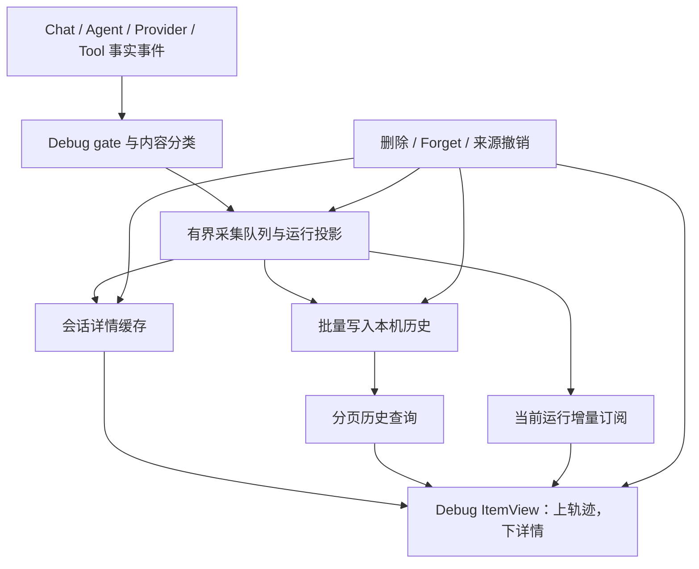

# PA Agent Debug View 与本机历史设计

Document status: Approved
Updated: 2026-09-23
Work item: B-145
Decision: [DEC-041](../decisions/dec-041-agent-debug-view-and-local-history.md)
Authority: Owner 已确认的可视化调试与历史数据边界。B-145 已实现并通过本地验证；Approved 指持续有效的产品合同，不把模拟器结果当作 iOS 真机或发布安装证据。

## Problem And Product Outcome

- User problem: 对话历史能看到最终回答，但不能清晰解释 Agent 经过哪些轮次、
  使用了什么输入、为何等待或恢复、工具实际结果和模型成本；控制台日志难以关联。
- Product outcome: 从 Chat 打开一个 Obsidian tab，先看到运行轨迹，再查看节点细节；
  重启后能诊断仍在保留范围内的历史，当前会话额外显示临时详细数据。
- North Star fit: 为“安静且可信”提供可核查依据；普通 Chat 不增加管理负担，
  不为解释运行过程额外生成模型内容，不把调试缺失变成普通用户的待处理任务。

### 实现依据与边界

设计阶段的源码核查促成以下接入点；现行行为以源码、[架构](../../architecture/pa-agent-debug-view.md)与回归测试为准。

| 接入事实 | 实现边界 | 源码 |
| --- | --- | --- |
| 生命周期已有 runId、turnId、seq、message/tool 事件；观察回调同步调用 | 复用标识和事实源；同步采集开销会进入 Agent 链路 | [chat-types](../../../src/ai-services/chat-types.ts)、[事件发射器](../../../src/ai-services/agent-runtime-primitives.ts) |
| 原有 Debug 是内容无关日志，流式更新只记录各类型首次出现 | 新的专用观察器不把 console 日志当完整轨迹数据库，也不扩展原日志为正文出口 | [pa-agent-debug](../../../src/ai-services/pa-agent-debug.ts)、[observation](../../../src/ai-services/agent-debug-observation.ts) |
| Chat 历史保存消息、状态和摘要；重载的 canonical turn 使用空 messages | 不从旧对话伪造完整历史，不改变原历史 reader 的含义 | [chat-history-manager](../../../src/chat/chat-history-manager.ts) |
| Chat 与 Debug 各自有本机 IndexedDB 存储 | 跨库删除通过 Chat outbox 和 Debug 幂等清理衔接，不合并原 Chat 历史语义 | [chat-history-store](../../../src/chat/chat-history-store.ts)、[Debug store](../../../src/agent-debug/store.ts) |
| Runtime 存在上下文摘要、流式到 invoke 回退、实际请求诊断与 usage 归一化 | Turn、逻辑调用与实际请求尝试必须分层；usage 覆盖和口径需验证 | [pa-agent-runtime](../../../src/ai-services/pa-agent-runtime.ts) |
| 发送路径的诊断会解析请求体 | 增加快照不能重复遍历/序列化大输入后再宣称“异步无影响” | [obsidian-fetch](../../../src/ai-services/obsidian-fetch.ts) |

## Scope

### In Scope

- **B-145/REQ-01 入口与视图**：Debug 开启时，Chat 发送按钮旁提供 Debug 按钮；
  打开/复用本 vault 的 Obsidian 调试 tab，上方轨迹、下方所选节点详情。
- **B-145/REQ-02 阶段模型**：按 Run、Turn、阶段、逻辑调用、实际请求尝试与工具
  展示输入、状态、结果及因果关系，区分等待、执行、恢复与交付。
- **B-145/REQ-03 真实细节**：展示实际可获得的参数、正文/Prompt、token、耗时、
  错误和规划证据；区分未知、未采集、过滤、丢弃与已清理。
- **B-145/REQ-04 采集范围与开关**：复用 Debug 开关作为详细采集/本机查看授权，
  覆盖 Chat Agent 及其关联调用；关闭后不采集新内容，但可查看仍保留的历史。
- **B-145/REQ-05 两层数据**：过滤后的正文/Prompt 和结构化历史本机持久保存；
  reasoning 与未入模的完整工具/底层响应细节仅当前插件会话可用。
- **B-145/REQ-06 有界历史**：最多 30 天，同时受容量限制；满后淘汰最旧记录以
  持续记录最新运行，支持手动清除，不写入 vault 或同步目录。
- **B-145/REQ-07 删除联动**：删除对话、Forget 和明确来源撤销同步处理关联 Debug
  数据，清理数据库、待写队列、会话缓存和可见内容，防止迟到写入恢复。
- **B-145/REQ-08 媒体引用**：仅保留附件引用、类型与内容指纹；入模提取文本随
  Prompt 保存，不额外复制二进制媒体，不改变原附件的生命周期。
- **B-145/REQ-09 运行隔离**：Debug 不增加模型请求、外发目的地或工具副作用；
  采集/存储/渲染失败不改变 Agent 结果、权限、调度、取消或恢复语义。
- **B-145/REQ-10 性能与完整性**：有界采集、批量持久化、按需渲染、可见丢失标记；
  用相同输入比较 Debug 关闭、后台采集、实时查看三种运行状态。

### Non-goals

- NG-01: 全局遥测平台、独立 Pagelet/Memory 后台任务的自动全量记录、远程日志服务。
- NG-02: 自动任务重放、确定性模型复现、从 Debug 重新执行工具或跨重启自动续跑。
- NG-03: 跨设备同步、调试历史导出/上传、永久归档或附件副本仓库。
- NG-04: 为解释轨迹新增总结/规划模型调用，推断或补写未观察到的模型内部思考。
- NG-05: 更改正常 Chat 历史、provider 权限、工具确认或来源排除规则。

## User Flow And States

### 入口与布局

Debug 按钮与发送按钮相邻，在生成过程中仍可操作；打开视图不发送草稿、不取消
Agent，也不更改当前会话。已有调试 tab 时复用并定位当前 Chat 的正在运行 Run；
没有正在运行项则定位最近记录，完全没有记录时解释如何开启采集。

页面从上到下为：

1. **运行选择与概览**：当前会话/历史运行、时间、结果、耗时、模型、已知 token
   与采集完整性；历史按时间分页，可按会话及结果筛选。显示保留期限和容量占用。
2. **可视化轨迹**：按 Turn 分组的有序轨迹；阶段和重试可展开，工具并行用并列
   子节点表示。每个节点有状态文字、耗时和图标，不能仅靠颜色区分。
3. **所选节点详情**：概览、输入/参数、输出/结果、上下文/Prompt、usage、错误
   和实际规划证据。仅显示该节点相关区域，大文本按需展开。

上方轨迹负责定位，下方详情负责解释。stopReason、providerCompletion /
finish_reason、diagnostics 是对应节点可展开的原始证据，按实际可获得情况展示，
不作为强制固定顶层区块，也不覆盖 PA 最终交付状态。

新事件默认跟随当前运行；用户选择历史或旧节点后保持选择，提供“回到最新”。
关闭/重开调试 tab 不清除数据、不影响任务；Debug 关闭后保留一个命令入口查看
已存历史。窄窗口/移动端仍为上下布局，可折叠轨迹与详情，保证键盘和触摸可用。

### 运行阶段及详情

| 阶段 | 轨迹表达 | 节点详情 |
| --- | --- | --- |
| 接收与排队 | 已接收、等待资源、开始 | 触发消息、会话、任务身份、等待原因、资源类型与排队耗时 |
| 上下文准备 | 读取、筛选、裁剪、压缩、完成或拒绝 | 实际允许使用的材料和版本、预算、来源、排除/压缩原因；不暴露禁止记录的来源身份 |
| LLM 调用 | 准备、发送、首个响应、流式接收、完成或失败 | 调用用途、模型/provider、有效参数、过滤后的实际输入、输出、usage、完成证据 |
| 工具批次 | 校验、等待、执行、返回；显示并行子节点 | 工具输入、权限/校验结果、输出、耗时、错误、结果复用、关联操作/产物状态 |
| 恢复与下一轮 | 退避、重试、换策略、继续或等待用户 | 导致恢复的事件、恢复动作、是否有新证据、后续结果；可见的计划与 reasoning 分开 |
| 交付与结束 | 验证、实际交付、终态 | 最终正文、真实产物/保存结果、未完成事项、取消或中断事实；等待确认不等于执行成功 |

这里是视图分组，不要求每个 Run 都经过所有阶段；不为缺省阶段创建虚假的成功节点。
一次失败后成功恢复，Run 可完成而过程仍保留失败节点及恢复关系。

### 状态分离

| 维度 | 语义 |
| --- | --- |
| Agent 状态 | 准备/排队/执行/退避/等待用户，以及已完成、部分完成、取消、失败、中断；从对应 runtime 事实映射 |
| 调用或工具状态 | 单次尝试的开始/结果、可恢复失败、未知副作用；不能直接等同整个 Run 成败 |
| 采集状态 | 采集中、完整结束、中途开启、主动停止、发生缺口、存储不可用 |
| 详情可用性 | 已记录、provider 未提供、仅会话可用、已过滤、容量限制丢弃、用户清理、过期/淘汰 |

`未知 token` 不是零；历史中缺少 reasoning 不是模型没有思考；空结果不是未采集。
运行中打开 Debug 只记录后续事件，标注起点，不扫描旧内存补写完整运行历史。
关闭 Debug 标记采集截止点并清除临时详情，不取消 Agent，不把“采集停止”显示为
“任务停止”。重载时，无终态且未主动停止采集的记录标注运行中断及最后已记录节点；
已停止采集的记录显示结果未观察到，不推断真实终态。

Chat 接收、启动排队及早期拒绝可能发生在 runtime Run 创建之前；这些阶段也必须
有稳定关联身份，并允许出现无 Turn 的失败/取消记录。对话尚未持久化时使用预留
身份，不因历史库暂时找不到对话就推断它已被用户删除。

中途开启后的完整 `message_end` 不能补录开启前内容。随后新请求真正使用的历史
消息可以作为该次新请求的输入快照，但不反向生成早先的事件。原请求在开启前
已发出时，输入与开始时间标注未采集。HTTP 响应、首个模型内容、首个可见正文、
provider 完成和传输消费结束分别表达；buffered 路径不伪称实时首 Token 时间。
Chat 实际提交首段正文和模型返回首段文字分别计时；前者仍不等同于像素已绘制，
需要真实界面证据。无正文或不可见场景明确标记不适用/未观察到，不算零延迟。

## Trust, Data And Authority

### 数据保留矩阵

| 内容 | 本机持久历史 | 当前会话 |
| --- | --- | --- |
| Run/Turn/阶段、状态、耗时、调用关联、已知 usage、过滤后的错误 | 是，遵循 30 天/容量/删除规则 | 可实时查看 |
| 用户消息、Agent 正文/显式计划、实际使用的笔记正文与上下文 | 是；只保存本次已获准且实际使用的内容 | 可实时查看 |
| 实际模型调用的消息、工具定义、非秘密参数 | 过滤后的 Prompt 快照 | 可查看允许的详细字段 |
| 已进入实际请求的工具参数、工具结果、附件提取文本 | 随 Prompt 快照保存 | 可查看关联工具详情 |
| 未进入实际请求的完整工具参数、原始结果 | 不单独持久化；只保留允许的状态/诊断摘要 | 有界临时保留 |
| Provider reasoning 专用字段/原文 | 排除，快照标记字段过滤 | Debug 开启时有界保留实际返回内容 |
| 底层响应细节及额外异常信息 | 不保存整份原始响应；结构化错误需过滤 | 仅允许经过秘密字段过滤的临时细节 |
| API Key、认证头、Cookie、凭据配置 | 不采集 | 不采集 |
| 图片、附件、内联媒体载荷 | 引用、类型、指纹；无二进制/base64 副本 | 不额外建立 Debug 媒体副本 |

“完整 Prompt”在本设计中落实为**有过滤说明的实际调用输入快照**，包含实际使用
的正文和入模工具信息；不承诺字节级原始 HTTP 请求。保留字段的顺序、角色和关联，
将 reasoning/凭据/媒体载荷的省略原因与位置显式呈现。这个快照仅用于查看，不再
注入 Agent 上下文，不生成或修改业务请求。

来源使用实际调用时的版本，不能打开历史时用最新笔记正文冒充原始输入。Debug 不
额外读取未获准内容、扩大来源或恢复 opaque bridge 的身份。记录 source/claim
关联用于治理；非公开来源身份、凭据和正文不得进入普通 console/遥测兜底路径。

Debug 开关说明应直接告知本机正文/Prompt 保留期限和容量淘汰，以及 reasoning
仅当前会话可用。沿用这个开关，不增加逐 Run 确认。关闭时停止新采集，原有持久
记录继续受查看、到期和清理规则约束。

### 30 天、容量与故障

- 已结束 Run 以结束时间计算 30 天；异常中断记录使用最后可信活动时间作为回收
  基准，不能因缺少结束事件永久保留。读取历史不能刷新保留期限。
- 在启动、恢复、历史读取和有界后台维护中处理过期记录。过期内容不再展示；应用
  关闭时无法执行删除，下次可运行时完成物理清理，不承诺关机期间准点删除。
- 总容量包含索引、事件、正文块及其他 Debug 自有持久对象；按最旧已结束 Run
  整体淘汰，再回收无引用内容。共享内容不能被提前删除，也不能成为清理遗漏。
- 运行中周期性保存边界和增量，不等全部完成才首次落盘；异常退出可能损失尚未
  提交的尾部。持久事件序号/提交水位用于定位缺口，不宣称零丢失。
- 活跃 Run 不因淘汰而取消；它自身的事件、正文及临时详情也必须有界。若已无可
  淘汰历史而单次输入或活跃数据超过上限，优先保证 Agent 继续，并留下内容未记录
  或轨迹缺口标记；不能静默声称“最新运行完整保存”。
- 存储不可用、配额不足或版本不支持时不回退为 vault 文件/console 正文存储；
  可以使用有界会话记录，并在 Debug 内说明无法跨重启保留。

容量数值及事件/正文/临时详情的各级预算由工程验证确定，不能以“30 天”替代容量限制。
已存数据按当前 vault 和设备隔离，不建立同步；本机保存不等于额外加密，也不承诺
能清除操作系统/用户另行创建的备份。本次不增加调试导出功能。
设备内可使用一个专用 Debug 数据库并以可靠的本机 vault 身份强制分区；普通查询
和视图只读当前分区。身份不可用时仅会话采集，不使用共享默认正文库。

### 删除联动

| 用户动作 | 必须处理的内容 |
| --- | --- |
| 删除对话 | 对应 Run、正文、Prompt、会话详情及 Debug 自有引用/索引一并删除 |
| Forget / 明确撤销来源 | 清除关联正文、Prompt 和派生快照；保留不含相关正文、路径、标题或可识别来源信息的运行统计 |
| 清除全部 Debug 历史 | 清除自有持久数据、临时详情及当前可见内容，不删除原笔记/附件、不取消 Agent |
| 关闭 Debug | 停止采集并清除临时详情；已持久历史按正常期限保留 |
| 关闭 Debug tab | 释放视图资源；不停止插件级采集或删除数据 |

删除需要覆盖待写数据、迟到 provider 回调、查询缓存、内容去重引用和已打开详情。
先建立删除/来源撤销的写入屏障，再异步清理持久内容；未确认清理成功不得显示
“已彻底清除”。删除期间隐藏相关内容，失败则在 Debug 内如实反馈并有界重试。
无法可靠拆分的混合 Prompt/派生摘要整体清除，不用不完整来源链保留相关内容。

普通笔记编辑不等于撤销历史快照；明确撤销继续按现有 Data Boundary / Memory
治理含义处理。清除全部历史后，若 Debug 仍开着，之后产生的事件可形成新的部分
记录，但不能重灌清除前的历史内容；删除对话后更不能由迟到事件重建其记录。

删除联动覆盖整段对话删除、单轮删除、截断后重试及现有 Chat 自动 prune；用稳定
Run/消息身份关联，不使用会复用的 turnIndex 单独定位。删除需要持久清理意图和
启动恢复，不能只依赖 settings/event 通知。现有 Chat 自动淘汰也可能使 Debug
历史提前清理，不改变原 Chat 保留规则。

设备级 Memory claim 的 Forget 覆盖本设备各 vault 分区中的关联 Debug 副本；
普通 UI 仍不能跨 vault 查询。先持久屏蔽再清理，清理未完成如实表示待恢复，不
将当前分区清完冒充全设备完成。来源关联包含笔记、claim、会话及派生内容；来源
集合未知时采用保守失效策略。规则变更或 `#no-ai` 等来源授权变化都触发重验。

删除协议覆盖现行与 legacy 两种 Memory 模式。未知来源要有可查询的治理域，
不能因缺少精确 claim link 就漏删。撤销后再次允许不恢复旧副本；来源权限保存
携带无正文的撤销代际，Debug 数据仍全部留在本机库。该代际属于既有权限治理，
不含 Debug 事件、内容、运行/设备 ID 或索引，也不构成历史同步功能。
异常退出导致文件来源权限连续性无法验证时，恢复先隔离相关正文并说明原因；
有撤销证据才物理删除，仍不确定则保持隐藏并按原期限/容量回收，不能仅因崩溃
删除全部历史，也不能用最新允许规则抹掉中间撤销。正常重启保留历史。
隔离只作用于无法验证来源的旧 owner 内容；当前新 Run 仍可采集，不能因此让
整个 Debug 历史库长期停录。

## 技术设计方向

本节规定后续实现应满足的边界和推荐分工，名称为概念名称，不表示已有类或锁定
新框架。实施时以当前源码复核接入点，并在对应 SDD 固定存储布局和预算。

### 身份与最小记录

| 层级 | 必要关联与事实 |
| --- | --- |
| Run | vault/session/conversation/run 身份、触发消息、开始/结束、业务结果、采集完整性、版本与存储大小 |
| Turn | 既有 turnId、轮次、上下文准备、输入/输出关联、本轮结果、继续/收束依据 |
| Phase | 阶段类型、父节点、开始/结束、等待原因、来源/上下文变化、错误关联 |
| LLM Call | 稳定逻辑调用 ID、用途、provider/model、有效参数、输入快照、调用结果与 usage 证据 |
| Request Attempt | 调用关联、尝试 ID、顺序、发送/首个响应/结束、传输模式、回退/重试原因 |
| Tool Call | 原 toolCallId、批次/父节点、校验、输入/结果引用、复用关系、真实操作/产物状态 |
| Content Snapshot | 类型、过滤规则版本、内容或引用列表、来源/claim 关联、缺失/过滤原因、保留范围 |

复用 runtime 标识，不从名称或时间猜测父子关系。区分全局采集序号与来源事件序号，
处理并行、迟到和重复投递。排序用明确序号；持续时间优先用单调时钟，墙上时间
用于显示与保留期。一个逻辑调用的多次实际请求不能合并成一次成功记录。

Prompt 在有效输入已确定的调用边界采集；准备失败、准入拒绝、实际发送要区分。
每次重试引用对应快照；只有实际输入相同才复用。不得为 Debug 克隆或消费响应流，
不得改动实际请求以方便记录。正文以不可变内容块及有序引用保存，避免每个 Turn
重写全部会话；去重、过滤与删除要共享明确所有权。

### Token、错误与规划

- 关联 Chat 主调用、上下文摘要及运行内辅助模型调用；未关联独立后台工作不加入
  本 Run 总量。重复上报的累计 usage 使用更新语义，不将每个快照相加。
- 输入/输出/总量保留 provider 证据；cache/reasoning 细分仅在可获得且语义明确时
  展示，子集不能重复加到总量。只有部分用量时标注“已知消耗/统计不完整”。
- 失败或取消且缺 usage 的尝试为未知，不作零成本；估算若存在必须与实际值分开。
  未固定价格和计费口径时，不由 token 直接声称准确金额。
- usage 保留原始证据口径：仅有输入或输出时推导出的和不是完整 total。辅助模型
  response 转文本前采集 usage；不为尾部 usage 延长消费或改变 native writing
  退出。自然到达的迟到统计只有通过当前采集/删除屏障才可更新，不改变业务终态。
- 错误包含阶段、类型、过滤后的说明、是否恢复、关联尝试及剩余影响；可以保留
  过滤后的堆栈定位，但不能把整份异常对象直接序列化。
- 显式计划、provider 实际返回的 reasoning、宿主调度/恢复决定分别标记来源。
  模型未提供或会话缓存已清除时展示缺失原因，不生成推测的“完整思考过程”。

### 存储与生命周期

采集服务由插件运行期拥有，视图仅订阅；关闭 tab 时释放订阅、React root、定时器
和渲染缓存。插件卸载时停止新采集并释放服务；有界收尾可尽力提交合规待写数据，
不依赖无限等待或成功 flush 才保证下次可读。会话临时详情不写入 workspace 状态。

技术方案使用独立于 Chat/Memory 的 IndexedDB，设备内各 vault 强制分区，复用
现有平台接入经验；具体 schema/迁移见 SDD。Debug 不占 Memory/VSS 的写队列，不把旧对话升级成
伪造轨迹，不要求等待调试库初始化才允许 Chat。新旧 schema 不兼容时提示不可读，
不能为了降级而自动重置全部历史或修改 Chat 历史库。

视图按既有 ItemView/React 和 `pa-` 样式约定接入；scope 内 CSS 使用静态样式源。
Prompt、参数和错误默认以安全文本呈现，不执行其中的 HTML、脚本或资源请求。
先使用有序树/时间线表达循环与并行，不预设重型图编辑库。

## 性能要求与验证设计

目标是可测、受限的附加开销；不声称开启 Debug 后绝对零成本。`try/catch` 只隔离
异常，`async` 也不能消除序列化、数据复制和渲染的主线程成本。

| 路径 | 必须满足的约束 |
| --- | --- |
| Debug 关闭 | 详细数据构造前判断开关；无新增正文复制、快照序列化、会话缓存或实时渲染；必要历史过期清理与 Agent 链路分离 |
| 同步采集 | 仅做必要身份/分类与有界入队；不 await 数据库/界面，不在每个事件上深拷贝整个 transcript |
| 流式输出 | 按内容块合并 delta；不按 token 写数据库、重建全量 Run 或重复格式化长 JSON |
| 持久化 | 增量批量写入；大内容过滤/序列化/去重分片调度，不能把大同步工作藏进 Promise；需要 worker 时再验证其传输成本 |
| 实时查看 | 仅订阅所选 Run 的增量；长列表分页/窗口化，大文本按需加载；隐藏 tab 停止渲染但采集继续 |
| 到期与容量清理 | 有界批次，索引定位；不能在首个回答前扫描全部历史，不阻塞 Memory/VSS 或读取全部正文 |
| 过载和失败 | 队列/内存/单 Run 大小有界，合并高频更新；预留终态和缺口信息空间，不无限积压或密集重试 |

实时刷新可从 100–200 ms 合并窗口开始测试，终态及时刷新。这只是候选工程参数，
不属于已测结果或固定验收阈值。总容量、单 Run/块预算、队列大小、临时详情上限、
flush 周期、清理批量和耗时阈值需要在实施 SDD 中给出数值及依据，不再逐项要求
产品确认；若这些数值实际改变保留或媒体等已确认行为，则按 material deviation 处理。

### 轻量对照与通过条件

在同设备、同构建、同输入及相同 provider 行为下比较：

1. Debug 关闭；另与接入前基线比较关闭路径，避免三态共有开销被漏掉。
2. Debug 开启但调试 tab 未打开。
3. Debug 开启并实时查看。

确定性模型流用于隔离本地开销，真实 Obsidian 用于验证可见响应与存储行为；真实
网络总耗时不能单独证明 Debug 开销小。DevTools/console 状态保持一致，避免
日志保留干扰比较。覆盖长 Prompt、高频流式、多轮/多工具、并行运行、重试、取消、
历史分页及大量到期/容量淘汰；只对实际支持并验证的平台报告结论。

必要时记录首个输出、取消响应、渲染、队列和存储的可观察变化。数值预算是工程
诊断参考，不是本轮交付阻塞条件；有明显 Agent 或界面回归时再做定向测量。
不为当前用途额外建设统计认证平台，也不从少量样本声称 p95 或全平台性能。

行为等价是硬条件：Debug 不新增模型调用、工具副作用或业务 token；同一确定性
输入的工具执行、最终结果和取消语义一致。故障注入时业务继续，Debug 缺失可见；
长跑后资源保持在定义上限内，关闭视图/卸载后的监听器及临时内存可释放。

## Acceptance Criteria

以下为功能验收合同；已执行结果及证据边界见 [B-145 验证记录](../../archive/2026/b145-agent-debug-validation.md)。

| ID | 对应需求 | 最低充分证据与通过条件 |
| --- | --- | --- |
| B-145/AC-01 | B-145/REQ-01 | 真实 Obsidian 点击发送按钮旁 Debug；打开/复用正确 tab，上轨迹下详情，生成不受影响；窄布局与键盘/触摸可操作 |
| B-145/AC-02 | B-145/REQ-02 | 多轮、工具并行、排队、恢复和交付夹具正确关联；逻辑调用与物理尝试可区分，等待确认/未知副作用不误报成功 |
| B-145/AC-03 | B-145/REQ-03 | 摘要/重试 usage、重复累计上报、缺失 usage、恢复错误和 reasoning 缺失夹具；总量无重复、未知不为零、无伪造规划 |
| B-145/AC-04 | B-145/REQ-04 | Debug 关闭无新详细采集；中途开启显示部分记录；关闭后清临时详情且可看历史；关 tab 不停止采集，独立后台任务不被自动纳入 |
| B-145/AC-05 | B-145/REQ-05 | 持久层/缓存/日志内容检查覆盖 Prompt 中嵌入工具、reasoning、凭据字段及异常对象；重启后正文/过滤快照可读，临时数据不可恢复 |
| B-145/AC-06 | B-145/REQ-06 | 可控时钟与容量夹具验证到期、最旧完整 Run 淘汰、内容引用回收、异常未闭合 Run、离线后启动清理；实际保留不足 30 天如实表达 |
| B-145/AC-07 | B-145/REQ-07 | 删除/Forget/撤销与待写、迟到回调、去重块、已打开详情并发；相关内容不可找回、不被恢复，失败不误报清理成功 |
| B-145/AC-08 | B-145/REQ-08 | 持久层无附件字节/base64 副本；提取文本仍按 Prompt 规则保存；原文件变化/不可用有标记，清理 Debug 不修改原件 |
| B-145/AC-09 | B-145/REQ-09 | 观察器异常、配额满、数据库不可用/版本不兼容、取消/卸载及流式回退故障注入；Agent 行为不改变、无新增网络或模型请求 |
| B-145/AC-10 | B-145/REQ-10 | 关闭、后台采集、实时查看三态下 Agent 主要功能正常，未引入额外业务请求；队列和内存有界，详情缺口可定位；实际 Obsidian 交互证据。延迟/CPU 数值仅供诊断 |

实施期间这些 REQ/AC 已映射到当时的 Tracker；完整过程保留在 Git 历史提交 `44b59318`。
源码/adapter 测试不能替代真实界面交互；受影响的平台按仓库门禁验证，模拟的
buffered 路径不能称为 iOS 真机性能证据。

## Open Decisions

无待 Owner 选择的产品问题。30 天加容量滚动淘汰、删除联动和媒体引用边界均已
明确。实际存储布局、接入点和工程预算见 [当前架构](../../architecture/pa-agent-debug-view.md)；
轻量三态观察不能推导出跨设备延迟分布或 iOS 真机性能。

## Delivery And Evidence

- Design entry: 本文为用户要求的完整设计入口；长期取舍见 [DEC-041](../decisions/dec-041-agent-debug-view-and-local-history.md)。
- Current implementation: [架构](../../architecture/pa-agent-debug-view.md) 与源码/回归测试承担运行合同；已完成过程包可由 Git 提交 `44b59318` 恢复。
- Validation: [B-145 本地验收](../../archive/2026/b145-agent-debug-validation.md)；桌面真实 Obsidian 与 Obsidian CLI mobile simulator 已测，iOS 真机未测。
- Existing contracts: [Recoverable Agent Execution](./pa-recoverable-agent-execution-product-spec.md)、[Data Boundary](./pa-data-boundary-product-spec.md)、[Memory governance](./pa-memory-control-center-product-spec.md)。
- Release / rollout boundary: 本地实现与测试通过不等于 beta 已发布或 BRAT 安装成功；发布和安装须独立核验。
