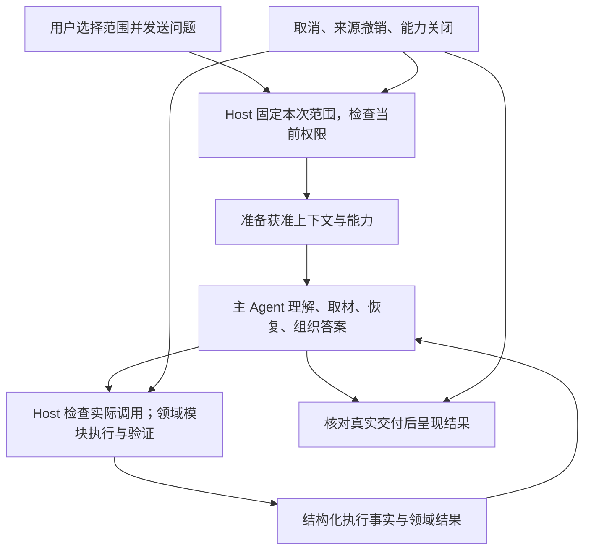

# PA Agent 产品设计：问答范围与 Runtime 演进

Document status: Approved
Updated: 2026-09-24
Work item: B-149
Decision: [DEC-043](../decisions/dec-043-agent-runtime-evolution-and-source-scope.md)
Authority: Owner 已确认的五项架构演进方向、三种问答范围及上下文取舍；本文定义目标产品行为与验收标准。

> **本文是已批准的目标设计，不是已实现行为。**设计基于 `master@6fce3824` 的评审与随后产品讨论；现行实现仍见 [PA Agent Architecture](../../architecture/pa-agent-architecture-plan.md)。技术设计和开发测试计划由 [B-149 Feature Home](../../development/active/pa-agent-runtime-evolution/README.md) 接续，执行状态只见其 Tracker；建立计划不等于启动 runtime 改动、部署或发布。

默认从我的笔记寻找依据；需要时，用户选择网络资料或综合模式。用户决定可用资料的边界，PA 负责在边界内理解问题、寻找证据、恢复可修正的错误，并交付与实际执行一致的结果。

## 1. 问题与产品目标

当前 Agent 已具备自主取材、工具执行、恢复和领域交付能力，但仍有三个需要共同解决的问题：

- **范围的可预期性**：自由语言可以表达“不要联网”，但不能作为 Host 独立执行的确定性权限依据。只限制新工具调用，也无法阻止旧回答、摘要或个人背景继续参与生成。
- **执行的可靠性**：执行成功与用户目标完成容易混淆；当前轮动作历史的表达、无进展恢复、准备阶段取消和已读版本身份，需要更清晰的职责与事实边界。
- **复杂度的方向**：继续增加通用循环中的领域特判和纠正提示，会提高维护成本；删减又不能损失现有授权、可恢复性和真实交付保护。

[产品北极星](../pa-product-north-star.md)是“随手记下，需要时自然浮现”。本设计把“我的笔记”作为新会话默认入口，用一个轻量范围选择替代反复管理；保留有来源的回答、可忽略的结果与显式持久动作。网络能力用于补充任务所需的信息，不改变 PA 以个人笔记复用为核心的定位。

成功表现为：用户知道本次回答可以使用哪些资料；正常任务少被无效恢复和确认打断；范围收紧确实生效；来源、版本和完成状态可以核对。增加输出数量、工具调用次数或运行时长本身不算成功。

## 2. 三种问答范围

### 2.1 选项与含义

| 范围 | 可主动取用的资料 | 不会自动取用的资料 | 图标语义 |
| --- | --- | --- | --- |
| **我的笔记** | 当前 vault 中通过既有权限检查的笔记、笔记相关 Memory 与个人背景 | 网络搜索及其他用于补充问答资料的联网取材 | 书本 |
| **网络资料** | 已启用的网络检索能力返回的资料 | vault 笔记、笔记检索、Personal/Memory 背景、自动附带的当前笔记或 Pagelet 材料 | 地球 |
| **综合模式** | 上述两类资料，由 Agent 按任务需要选择一种或组合使用 | 任何被 Data Boundary 排除或被独立能力开关关闭的资料 | 组合/叠层 |

三种范围都允许本次由用户明确输入、粘贴或通过现有合法附件入口提供的材料。提供材料本身不扩展所选范围；读取其余笔记、展开链接或取用旧作品背景，仍按本次范围与既有权限执行。仅在 Obsidian 打开某篇笔记，不等于明确把它提供给本次请求；既有附件准入与 Data Boundary 仍有效。

“综合模式”不代表每次必须同时检索笔记和网络，也不赋予模型修改范围的权力。用户在问题中提出更细的取材要求时，Agent 仍应遵循；任意自然语言限制不会被关键词或模型自报重新解释成 Host 已证明的硬权限。

问答范围限制的是 PA 主动取用的资料及其上下文使用，不是模型预训练知识的开关，也不是“本地离线模式”。“我的笔记”仍使用已配置 AI provider；没有找到笔记依据时，应说明没有找到，不能把常识或猜测包装为用户笔记中的事实。

### 2.2 默认与记忆

- **新会话默认“我的笔记”**，不继承另一个会话最后一次选择。
- 同一会话记住已选范围，重新打开后恢复；范围只影响这个会话的后续请求。
- 旧会话按第 4.3 节迁移，保留可证明的原有有效权限，不一律改成新会话默认，也不静默扩权。
- 切换范围不修改全局 WebSearch、Memory、Data Boundary 或独立后台任务设置。某项能力关闭时，选择包含它的范围不能打开该能力。

### 2.3 输入区体验

输入区使用**图标为主的紧凑按钮**。展开菜单后显示完整名称、简短解释和当前选择；不常驻显示三段文字或工程术语。桌面悬停、移动端长按说明与屏幕阅读器名称能够识别当前范围，键盘可打开并选择，不能只依靠颜色区分状态。

菜单建议文案：

| 选项 | 解释 |
| --- | --- |
| 我的笔记 | 从我的笔记中寻找依据 |
| 网络资料 | 使用网络资料，不自动读取我的笔记 |
| 综合模式 | 按需结合我的笔记与网络资料 |

普通使用不新增确认弹窗。范围变化的信息只在相关时简短出现；没有足够材料时，回答说明缺少什么，不反复建议扩大权限。切换本身不执行检索、生成摘要或产生一次额外模型请求。

## 3. 请求与硬约束

### 3.1 生效时机

发送时固定**本次请求范围**。运行中切换只改变下一次新请求，不自动取消、重跑或扩大当前任务，也不产生隐藏重试成本。此时简短提示“下条消息使用：网络资料”等；当前任务的范围记录继续反映发送时选择，不能随输入区图标一起变更。

用户需要立刻停止当前范围的工作时，使用现有取消操作，再按新范围发送。固定请求范围不冻结权限：Data Boundary 撤销、Forget、关闭相关能力等仍按现行契约及时生效，后续物理请求与结果交付必须重新检查。

重载后未完成任务仍显示中断，由用户选择继续。继续属于新请求，使用当下选择的范围重新准备合法上下文；旧 run 的范围或恢复记录不能覆盖用户现在的选择，也不能自动重放结果未知的动作。

### 3.2 确定性执行边界

Host 依据用户实际选择与当前设置确定可用资料，不能接受模型声明来扩权。最终可用资料是**本次所选范围、当前来源授权及能力开关的交集**；用户明确提供的材料按其实际提供内容和既有准入单独处理。

硬约束同时覆盖：

1. **取材入口**：工具是否可用，以及执行时是否能读取目标或发出网络请求。
2. **实际模型输入**：历史消息、工具结果、当前笔记、Personal/Memory 背景、Pagelet 交接、作品续写背景与恢复材料。
3. **派生材料**：助手回答、历史摘要、工具结果摘要、改写文本、缓存产物，以及后续外部请求中的材料。
4. **辅助路径**：用于准备、压缩、摘要的模型请求，SDK 重试和复用的提供方会话状态，不能绕过同一边界。

只隐藏工具、不处理上下文不算实现硬约束；提示模型“忘记之前内容”也不算。如果已有提供方会话状态无法被可靠过滤，下一次请求应使用新的干净模型上下文，聊天记录仍保留展示。

### 3.3 如何判断历史能否复用

判断依据是 Host 已知的**生成时可用来源**及实际来源记录，不是最终答案列出了哪些引用，也不是让模型判断某段文字是否“敏感”或“已经脱敏”。

- 可靠归属且全部符合新范围的材料可以复用。
- 同时使用过笔记和网络的回答/摘要，按混合来源处理；即使只引用了一篇网页，也不能据此当成纯网络内容。
- 混合或无法证明相容的材料整体不进入新范围的模型输入。只有已有可靠独立来源的片段才能分别保留，不依赖模型重新总结来“洗净”来源。
- 旧摘要、缓存和恢复产物不能被重新标记为无来源材料。标题、路径或任务参数若来自受限材料，也不能作为无害状态自动保留。
- 与受限资料无关、能够独立证明的用户指令或任务状态可以保留；依赖被移除材料才能理解的要求，不能靠猜测补回。

这需要足以执行范围检查的来源标识与派生关系，不要求逐词语义污点分析，也不建立新的内容敏感性分级系统。

## 4. 范围切换与对话连续性

### 4.1 切换规则

| 从 → 到 | 下一次请求的上下文处理 |
| --- | --- |
| 我的笔记 → 综合模式 | 保留仍获准的笔记上下文，按需加入网络资料 |
| 网络资料 → 综合模式 | 保留仍获准的网络上下文，按需加入笔记资料 |
| 综合模式 → 我的笔记 | 保留可证明仅来自获准笔记的材料；移除网络、混合及来源不明材料 |
| 综合模式 → 网络资料 | 保留可证明仅来自网络的材料；移除笔记、个人背景、混合及来源不明材料 |
| 我的笔记 ↔ 网络资料 | 移除上一种范围的材料及派生内容，只保留独立相容的输入与状态 |
| 范围不变 | 继续复用合法上下文；真实撤销、来源准入及正常压缩仍生效 |

以上保留都以当前授权继续有效为前提。用户本次明确提供的材料按第 2.1 节处理；不能把旧材料自动伪装成本次手动提供的内容。

**聊天历史不会被删除或隐藏。**变化的是发给模型的上下文；旧答案的可见性不表示新请求仍可使用它，也不允许从 Debug、缓存或旧作品重新导入已排除材料。

收紧或跨范围切换时，提供一次简短说明，例如：“已切换为网络资料，之前的笔记内容不会用于后续回答。”若无法安全拆分，则从新的可用上下文继续，不需要先经过强制确认。

### 4.2 “部分追问失去上下文”的具体含义

用户在综合模式下，用私有笔记中的预算、客户情况和网络市场数据比较了 A 方案。随后切到网络资料，问“那 B 方案呢？”

PA 不能把先前包含预算与客户信息的混合分析发给下一次模型，即使删除笔记引用也不可以。它可以继续使用独立获准的网络材料；如果回答必须知道预算或比较条件，应简短请用户在本次明确提供这些条件，而不是偷偷恢复旧笔记。

这项取舍是**硬边界优先于无缝追问**。只有必要条件确实缺失时才澄清；能依据剩余材料回答就继续。不切换或扩大范围通常保留连续性，不能借此让所有追问都重新开始。

### 4.3 旧会话与旧产物

- 有可信范围或权限记录时，映射为对应选项；没有范围字段但能依据既有配置和兼容规则确定原有效范围时，按该范围初始化。例如原来允许笔记与已开启搜索的会话映射为综合模式，再受当前设置约束。
- 无法证明原有效范围时，使用“我的笔记”的保守初始选择，并简短说明可重新选择；不因旧回答出现过链接、写作关键词或某种引用就推断权限。
- 范围迁移与历史内容准入分别处理。即使旧会话显示综合模式，也不能自动把缺失来源的旧摘要认定为合法；只有可以确认符合当前范围和授权的部分才复用。
- 旧历史、Writing 版本和结果记录保持可查看；继续使用时重新检查范围与权限，不补造旧内容的来源和版本身份，不通过后台模型调用批量“修复”历史。
- “我的笔记”也不能绕过当前关闭的 Memory 或来源排除；没有可用自动资料时，仍可围绕用户明确提供的材料回答。

## 5. Agent 与 Host 的职责

| 职责 | 负责方 | 必须避免的混淆 |
| --- | --- | --- |
| 允许哪些资料、哪些动作；是否继续等待 | 用户选择及 Host 权限/生命周期 | 模型计划不是授权，范围选择不是保存许可 |
| 理解问题，决定先读什么、如何补查与解释 | 主 Agent | Host 不用关键词裁决自然语言目标或事实真假 |
| 来源身份、动作执行、真实回执与目标版本 | Host 与对应领域模块 | 自然语言声称成功不等于动作发生 |
| Writing 作品、Saved Insight、Operations 的交付语义 | 各自领域模块 | 通用循环不解析每种作品格式来猜测完成 |
| 取消、运行名额、尝试期限、资源与进展记录 | Host | 等待与心跳不冒充进展，也不误杀健康长操作 |
| 回答是否有用、主张是否由来源支持 | 任务评测与实际使用证据 | 权限检查、引用存在和工具成功不能替代质量判断 |

### 5.1 方向一：分开执行事实与任务结果

统一可观察的结果表达，保留领域对结果的解释权：

| 事实 | 合理的后续行为 |
| --- | --- |
| 检索执行成功但没有匹配 | 返回“没有找到”；Agent 可改查或如实回答，不把空结果自动当成工具故障或整个任务失败 |
| provider 暂时失败或参数可修正 | 作为可恢复观察反馈，允许在原授权内调整 |
| Writing 作品已生成并验证 | 可以显示作品已生成，不能声称已保存到笔记 |
| 操作预览已就绪、等待用户确认 | 显示等待确认，不能记为操作执行成功 |
| 写入/付费操作结果未知 | 先核实，再决定恢复；不能盲目重放 |
| 只交付了部分必需目标 | 说明已完成部分与尚缺事项，不能凭一次成功工具调用判定全部完成 |

领域模块提供作品有效、已保存、等待确认、失败或结果未知等事实；主 Agent 判断这些结果是否覆盖用户目标；Host 拦住缺失真实回执、授权或必要产物等可确定的不一致。Host 不靠自然语言关键词替 Agent 判断答案是否全面。例如“总结并保存”中，总结可以已经生成，保存仍等待确认，两个事实须分别呈现。

正常零命中还须结合任务解释：

| 情况 | 回答与任务状态 |
| --- | --- |
| 用户询问“我有没有记过 X”，本次检索正常结束但无匹配 | 可以完成这次查找，说明“本次没有检索到相关笔记”；不声称整个库绝对不存在 |
| 用户要求“根据项目笔记总结决定”，没有找到必要材料 | 说明缺少依据，总结目标尚未完成；不能把查找结束当作总结完成 |
| 检索能力暂时不可用 | 属于查找未成功，可尝试其他获准路径；不能报告成“没有相关笔记” |

对于明确要求基于笔记的任务，缺少依据时默认不自动附送通用答案。用户明确要求通用解释时可以回答，并区分它与笔记证据；已有部分依据时交付能够支持的部分，具体说明缺口。继续检索由任务缺口和新线索决定，不规定零命中后必须再查固定次数，也不因此扩大来源范围。

不新增按词语猜测失败的 Host 判断；保留现有结构化未完成报告。Agent 遗漏报告造成的语义误判仍属于评测风险，不能以此承诺零错误。普通 Chat 继续与显式 `@Writing` 或明确续写分开。

### 5.2 方向二：保留可供下一步使用的动作历史

主 Agent 在当前运行中应能知道：自己发起了什么调用、传了什么参数、哪份结果对应哪个调用。助手动作、工具调用和工具结果保持明确关联，避免仅提供平铺观察文本后再靠额外提示弥补遗失的过程。

保持现有模型兼容范围，按 provider 适配能力使用结构化消息表达。支持原生工具消息时使用原生关系；兼容投影也须保全调用与结果的关联，不能静默丢失。Host 私有权限依据、执行凭据及秘密不因此全部暴露给模型。

压缩须保住当前任务目标与限制、关键证据及来源、已经尝试的查询与必要参数、未完成操作及副作用状态。较旧的大段返回、重复内容和已闭合的中间过程可以压缩，不要求所有原始返回永久留在模型上下文中。范围准入先于复用，不能为保持连续性带回范围外材料。

容量不足时，先处理可确定的重复与状态噪声，再按需压缩较旧过程；如果仍无法保住必要信息，应明确暴露限制并恢复处理，不能静默丢掉关键约束后假装任务上下文完整。消息格式、压缩触发参数与适配方式由技术设计确定，不能借重构缩小既有模型支持范围。

结构更清晰是设计目标，回答质量、时延与成本是否改善必须由实际运行对照证明，不把消息格式改变本身当作质量提升。

### 5.3 方向三：恢复跟随进展，取消能够结束等待

“连续同因无进展”按恢复片段判断。获得有用新证据、完成子目标等真实进展后，重置相应连续失败判断；仍单独累计整个任务已经消耗的资源。不能让早先已恢复的几次错误使后续有进展的任务过早结束。

重复读取相同结果、心跳和反复解释不算进展；暂时失败后的合法同参数只读重试也不能被误当成副作用重放。不自动更换 provider/model，不扩大任务范围来制造进展。

取消须覆盖请求准备、来源复核、摘要、排队、provider 及恢复等待。即使底层只读准备操作不响应取消，主任务的结束和不再需要的运行名额释放也不应等它自然返回；迟到结果不得触发发送、恢复交付或改变已结束任务。取消无法撤回已发送数据，也不能抹去可能已提交的副作用；此类操作保留结果未知与核实责任。

已读快照必须绑定**读取时实际观察的版本**。后续文件变化可以保留旧快照用于普通回答，但不能用新文件的状态给旧正文补盖“当前版本”身份。无法识别时如实记为未知；要求最新时重读，写入前另行核对目标，权限撤销另行生效。

### 5.4 方向四：预算服务于任务与真实资源

沿用 [DEC-040](../decisions/dec-040-recoverable-agent-execution.md)：模型及普通同步远程操作单次尝试默认 30 分钟；不恢复通用 60 秒静默或 180 秒任务总时限；后台身份本身不构成更小预算的理由。保留至少一个 Chat 和一个后台 Agent 的推进机会，等待释放不必要名额，冲突写入与 VSS 队列仍按既有规则协调。

上下文准备应考虑当前模型可用窗口、输出预留、实际使用量和必要任务材料。字符数估计可以作为粗略后备，不能假装等于各模型真实可用预算。当前轮次/工具硬上限继续作为保护，不能仅为“简化”改成任意较小值。

历史压缩、工具结果摘要等辅助调用应能解释其成本和收益，避免无必要地串行挡住首个有用输出。降级仍须保住用户限制、来源和动作事实，不能靠静默丢失关键上下文让请求勉强通过。本设计不批准新的默认总费用/token 截断值；若真实数据表明需要改变产品限制，再单独决定。

采用一套围绕任务目标与真实进展工作的投入策略，不新增“快答/深度”开关，也不增加按任务类别决定强制额度的意图分类器。日常找回在取得足够依据、完成必要核对后交付；用户明确要求多方案比较、完整梳理或深入核实，就需要完成更多子目标。三种资料范围不充当思考深度或费用档位，必要核实不能为追求速度省略。

可选摘要采用独立的辅助投入边界：

- 仅在需要腾出上下文空间，或能够减少后续重复输入时执行，不要求每份结果都经过模型摘要。
- 同一份未变化材料不反复生成多个摘要版本；复用仍须通过当前来源准入。
- 辅助调用单独计入次数、token 和等待成本。具体额度依据基线测量确定，不在缺乏数据时预设任意值。
- 达到辅助预算后停止可选优化，不自动终止仍能合法推进的主任务；该额度不是新的整任务费用或时长截止线。
- 如果缺少必要压缩就无法继续，按上下文不足处理并如实说明，不能丢失关键条件后声称完成。必要准备仍受来源、取消、尝试期限与恢复规则约束。

### 5.5 方向五：删减失效策略，用真实任务验证演进

优先清理已无生产消费者的分类、必需能力推断和退役分支；Writing、Saved Insight、Operations 的专属解释回到领域模块。保留能力注册、真实授权检查、来源撤销、确认、未知副作用防重放以及兼容 reader。

不以“统一”为由新建通用策略引擎、更多 Agent 角色或持久任务平台。普通读快照的有效性、写入目标的新鲜度和授权撤销必须能分别表达，不再用一个模糊的“当前有效”概念承担三种责任。

复用现有测试、Debug 与评测入口，建立小而真实的任务基线。输入应实际驱动 Agent runtime；预填 `actual` 与 `expected` 的静态断言可以保留，但不能独自证明 Agent 完成了任务。既验证硬边界，也观察来源支持、任务完成、恢复表现、等待体验及实际调用成本。

## 6. 信任、数据与既有能力

- 范围选择授予取材边界，不授予保存、修改、删除、配置变更或付费操作。原有预览、确认、目标版本、Undo 和结果未知保护继续有效。
- 在综合模式且网络能力启用时，获准笔记可按任务需要进入模型和搜索参数；不另设“Chat 可读但搜索前再确认”的敏感外发层。只发送完成任务所需内容；用户需要禁止网络取材时选择我的笔记，需要排除来源时使用 Data Boundary。
- 来源标识用于执行用户明确选择，不进行模型敏感性分类，也不引入逐条读取/搜索确认。Data Boundary 排除的本次例外仍属于独立 [B-147](../../backlog.md)，范围控件不能充当该例外。
- 会话选项与必要来源标识沿用现有存储/删除边界；不复制整库、不新增原始请求日志仓库。Debug 继续遵守 [DEC-041](../decisions/dec-041-agent-debug-view-and-local-history.md) 的显式启用、本机保留与删除规则，其记录不能成为绕过当前范围的模型输入。
- Chat 范围不改变 Pagelet 的独立触发、frozen anchor、来源权限、质量门或 quiet no-insight，也不启停独立 Memory 提取和索引维护。Pagelet 内容进入 Chat 时，按 Chat 本次范围重新准入。

## 7. 非目标

- NG-01：恢复 `declare_source_scope` 等模型自报授权协议，或用分类模型、关键词推断用户选了哪个硬范围。
- NG-02：全新敏感性标签、逐词派生内容分析、每次网络搜索确认、绕过既有排除的临时例外。
- NG-03：自动跨重载/跨设备续跑、通用调度平台、新 MCP/shell 能力、多 Agent 产品模式。
- NG-04：按自由文本隐式触发 Writing，或者把取材授权扩展成持久动作和额外付费授权。
- NG-05：更改独立 Memory/Pagelet 产品范围、压低后台默认预算，或承诺零幻觉、离线生成、未经评测的性能提升。
- NG-06：附带实现 [B-148](../../backlog.md) 的更宽事实核实能力。本设计会评测来源是否支持主张，但不凭一次引用存在就声称已解决该项，也不引入每次联网固定加查的规则。

## 8. 稳定需求与验收

以下是后续实现必须满足的合同，不表示当前已通过。每项 AC 与同号 REQ 对应；技术拆分不能遗漏适用的既有权限、回归与实际应用验证。

| Requirement | 用户行为或系统责任 | Acceptance |
| --- | --- | --- |
| **B-149/REQ-01** | 三种范围、默认与轻量 UI，按第 2 节 | **B-149/AC-01**：新会话默认我的笔记；同会话重开恢复，其他会话不继承；图标、菜单、键盘、移动触控与无障碍名称均可准确识别和选择范围 |
| **B-149/REQ-02** | 请求范围固定，切换与真实撤销分开 | **B-149/AC-02**：运行中切换不取消或重发当前请求，下一次新请求使用新选择；当前范围记录真实；取消可用；新权限撤销仍约束后续物理请求与交付；重载后继续不恢复旧授权 |
| **B-149/REQ-03** | 硬约束覆盖取材、入模与所有派生路径 | **B-149/AC-03**：捕获实际模型/工具请求，证明我的笔记无网络取材，网络资料无自动笔记/个人背景；辅助摘要、重试、缓存、Pagelet 交接及提供方会话复用无旁路；关闭能力和排除来源不能被模式选择放开 |
| **B-149/REQ-04** | 来源可证明的历史复用与保守迁移 | **B-149/AC-04**：覆盖第 4.1 节全部转换及有/无可信来源的旧会话；混合、未知摘要不被模型“洗净”；历史仍可见，只有实际缺失必要条件才澄清；兼容映射不静默扩权 |
| **B-149/REQ-05** | 明确提供材料与持久动作分别授权 | **B-149/AC-05**：本次合法粘贴/附件可用，但不能因此越过所选范围读取其余 vault、链接或旧作品；排除来源无隐式例外；普通 Chat 不进入 Writing，范围选择不跳过保存、改配置、删除或付费动作原有保护 |
| **B-149/REQ-06** | 执行事实、领域结果与任务完成分离 | **B-149/AC-06**：无匹配、暂时失败、作品生成、等待确认、部分完成、结果未知分别按第 5.1 节交付；查找是否存在、缺材料的总结、检索不可用具有不同结果；笔记任务缺依据不自动附送通用答案；成功工具不伪造任务完成或保存；已恢复故障不留下最终泛化警告 |
| **B-149/REQ-07** | 可关联的助手动作、调用参数与结果 | **B-149/AC-07**：以相同工具结果、不同前序调用构造任务，验证实际入模轨迹仍可区分动作及参数；原生与兼容路径保留关系和既有模型支持；压缩后必要约束、未闭合调用和来源关系仍可用，容量不足不静默丢失关键条件，Host 私有凭据不泄漏 |
| **B-149/REQ-08** | 恢复片段与全程资源累计分离 | **B-149/AC-08**：暂时错误与有效新证据交替时任务可以继续；同因持续无进展能够收束；重复文本/心跳不重置计数，真实进展会重置相应连续失败判断；总消耗仍可核对 |
| **B-149/REQ-09** | 取消贯穿准备、调用与等待 | **B-149/AC-09**：挂起且不响应取消的只读准备夹具中，取消后主任务结束、无用名额释放，不等底层返回；迟到结果不再发送或交付；真实应用取消反馈可见，未知副作用状态未被清除 |
| **B-149/REQ-10** | 已读版本、写入新鲜度与撤销分别处理 | **B-149/AC-10**：读取 A 版本后文件变为 B，普通回答仍可用 A，来源身份不能标成 B；要求最新取得 B，写入核对真实目标，撤销阻止后续使用；缺失版本身份如实未知 |
| **B-149/REQ-11** | 基于真实资源的上下文准备并保留既有预算 | **B-149/AC-11**：不同上下文窗口和输出预留下可解释材料保留/压缩；辅助摘要按需执行且同材料不反复生成，达到辅助额度仅停止可选优化；统计辅助调用与实际使用量；日常/深入目标不引入新模式或分类额度；未授权来源不为压缩而外发；DEC-040 的长操作、前后台机会、取消和恢复约束继续通过，不新增默认总费用截断 |
| **B-149/REQ-12** | 清理退役策略，领域结果回归领域所有权 | **B-149/AC-12**：以生产调用关系、类型消费者及行为回归证明删除安全；通用循环不依赖具体作品格式判断交付；能力、权限、旧 reader、确认与未知副作用保护保留，不以删除行数或 bundle 下降替代证明 |
| **B-149/REQ-13** | 用真实 runtime 任务证明演进价值 | **B-149/AC-13**：改动前后使用可重复输入实际运行，覆盖笔记召回、网络/综合、无证据、冲突、跨范围追问、恢复、取消和显式写作；样例预先标注必要证据、目标及允许差异；按第 9 节比较质量与包含摘要/重试的完整任务成本、首个有用结果和完整交付时间，保留模型/配置与证据边界；静态 fixture 或模型评分不能独自替代验收 |

## 9. 验证与交付边界

后续实现先建立当前行为基线，再围绕责任分离与确定性事实修复拆分。范围 UI、实际请求准入、历史/派生材料处理及旧会话迁移必须一起达到产品承诺，不能先展示“硬范围”而留下上下文旁路。结构化动作历史、领域简化和预算调整逐项对照基线，避免同时变化后无法归因。

| 证据层 | 要回答的问题 | 通过条件 |
| --- | --- | --- |
| 确定性回归与请求捕获 | 范围、权限、版本、取消和动作事实是否可信 | REQ-02–12 的对应场景满足 AC；任何越界、虚假版本/成功、重复未知副作用都不能被平均质量分掩盖 |
| 实际 runtime 任务对照 | Agent 是否完成目标，来源是否支持结论 | 检查真实输出与运行轨迹；已标注关键任务不丢失必要条件/来源，质量差异经过逐项评审；成本未知时标为未知，不把消息结构改变当作收益 |
| 部署后的 Obsidian 交互 | 用户是否能理解、切换、取消和继续 | 桌面与受影响移动界面的范围入口、运行中切换、历史保留及澄清可实际操作；明确区分模拟适配器与真实设备证据 |

实际任务评测采用小型固定样例集，覆盖上述核心场景。每个样例在运行前标明必要证据、必须满足的任务目标与允许的答案差异；评判关键结论是否得到来源支持，不要求输出逐字相同。模型评分只辅助评审，不能单独裁决验收。

效率比较使用相同模型、配置和可重复材料，统计整次任务的调用量、token、首个有用结果时间与完整交付时间，包含辅助摘要和失败重试。Thinking、心跳或状态提示不充当首个有用结果；小样本保留逐例结果和重复运行的波动，不直接宣称普遍提速。无法可靠取得的 usage 或费用标为未知。

确定性底线先通过：已定义场景中的越界、虚假保存、错误版本身份、取消失效与未知副作用重放不能用其他任务得分抵消。在底线通过后，同等质量优先更快、更省；经对照证明显著提高任务正确性时，允许有证据支持的成本增加，明显增加时提交具体收益与代价再由 Owner 权衡。该原则不授权无限增加费用或等待，也不允许用更低成本换取已知的权限或真实交付缺陷。

沿用仓库适用的 focused/full 检查和实际应用门禁；具体命令、输入身份与验证结果进入未来实施 Tracker，不重复写进本文。真实 provider 的资料发送与成本沿用适用授权；本文及历史评审不代替新的运行证据。评测复用 [Eval Harness](./pa-eval-harness-product-spec.md) 与现有 Debug，不建设独立平台或默认采集用户正文。

## 10. 决策与后续接续

**无阻塞本设计的待决产品问题。**范围名称、默认/记忆、图标优先、硬约束覆盖、连续性取舍及运行中切换方式均已确认。Owner 后续已接受五项细化，包括缺少笔记依据时不自动补通用答案，以及底线通过后允许有证据支持的质量/成本权衡。

具体来源记录格式、消息适配、模块拆分、压缩参数、辅助额度和评测样例由技术设计与基线测量解决，不能改变本文产品承诺。只有证据表明需要缩小既有模型兼容范围、放宽来源/连续性取舍、增加新的用户可见限制，或接受明显成本/等待增加等实质变化时，才重新提交对应产品决定；不把普通实现细节变成重复确认。

- 产品决定：[DEC-043](../decisions/dec-043-agent-runtime-evolution-and-source-scope.md)。
- 开发入口：[B-149 Feature Home](../../development/active/pa-agent-runtime-evolution/README.md)，包含 SDD、开发测试计划与唯一状态 Tracker；不把设计完成记为功能交付。
- 当前实现：[PA Agent Architecture](../../architecture/pa-agent-architecture-plan.md)、[Runtime lifecycle](../../architecture/pa-agent-runtime-lifecycle-plan.md)、[B-146 Spec](./pa-agent-task-source-boundary-product-spec.md)。交付时才据实际行为更新 Architecture。
- 继承契约：[DEC-040](../decisions/dec-040-recoverable-agent-execution.md) 的可恢复执行；[DEC-042](../decisions/dec-042-agent-task-source-boundary.md) 的自由语言职责、显式 Writing 与独立动作保护。
- 实施按 Feature Home 中的技术设计和验证计划接续，覆盖跨模块来源、历史迁移及回退；实际启动、Git 集成与发布分别处理。
