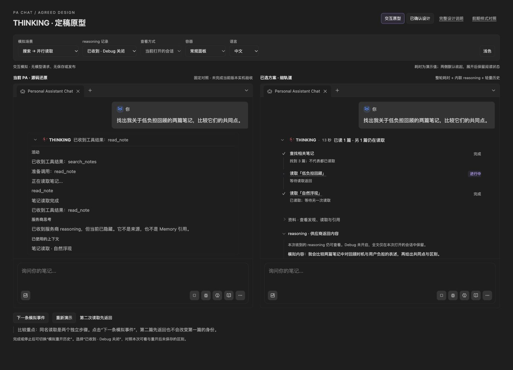

# Chat THINKING Process Product Spec

Document status: Current
Updated: 2026-10-10
Work item: B-168
Decision: [DEC-058](../decisions/dec-058-chat-thinking-process.md)
Authority: 本 feature 的当前用户行为、范围、非目标与验收标准；Owner 已选择推荐设计组合，并于 2026-10-10 明确授权完成验收后的 closeout 和本地 master 提交。历史验证不作为发布或日常 vault 部署证据。

## Problem And Product Outcome

- User problem: 用户难以在 Chat 判断正在做什么、哪些资料已被读取、过程如何结束，以及等待了多久；实际 reasoning 只能转到 Debug 查看。
- Product outcome: 回答与领域产物保持主体；用户按需展开 THINKING，即可理解已有执行事实，并按真实身份进入 Debug。
- North Star fit: [安静且可信](../pa-product-north-star.md)；默认可忽略、不增加管理负担、不用推测填补可解释性。

## Scope

### In Scope

- B-168/REQ-01: 在现有 Chat 状态区使用细轨道；保留原粒子和原有视觉体系。外层 THINKING 与内层 Reasoning 默认折叠，手动选择不被流式更新、计时或终态重置。
- B-168/REQ-02: 按真实运行/轮次/调用身份组织步骤，表达状态、简短结果、来源与领域效果；同名调用不误合并，必要用户动作留在折叠区外。
- B-168/REQ-03: 显示覆盖准备、工具、模型等待及生成的本次执行耗时，每秒更新，可信 Chat 终态冻结并保留；历史缺时间则不显示。
- B-168/REQ-04: 当前 Chat 无论 Debug 开关均可折叠查看实际收到的 reasoning；完成后当前视图继续可读。全文历史沿用 Debug，不在 Chat 新增第二份持久化。
- B-168/REQ-05: 既有 Chat 历史仅补充结构化过程所需的新增事实与可信耗时，复用已有来源、动作及清理关联，兼容旧记录；删除/Forget、异步失效及后续 Prompt 投影保持正确。
- B-168/REQ-06: 新记录通过已保存的真实 Debug 引用定位并按需读取详情；旧记录或缺引用记录提示无法精确定位，仍可打开已知目标运行或会话，不新增历史搜索兜底。未采集、部分记录、已清理及读取失败均作诚实提示。
- B-168/REQ-07: 中英文跟随 Obsidian 界面语言；深浅主题、窄面板、键盘、焦点和用户滚动均保持可用；资源随视图生命周期清理。
- B-168/REQ-08: 展示不改变 Agent 决策、权限、调用、写入、取消或恢复。保留 committed answer 和 Writing 等领域 bridge，不增加解释性模型请求。

### Non-goals

- NG-01: 重做 Chat 导航/输入/回答、引入 UI 框架或套用旧 HTML 视觉外壳。
- NG-02: 第二套事件总线/执行引擎/全文日志库、跨 Run 搜索、全文导出或外部遥测。
- NG-03: 进度百分比、预计剩余时间、默认全展开、强制逐步确认、自动重试未知外部效果。
- NG-04: 全插件语言迁移、原文自动翻译、新语言设置、模型质量评测矩阵或独立性能工程。

## User Flow And States

### 原位布局与交互

此图来自本轮独立交互原型，内容、计时和历史均为模拟；用于说明选定视觉，不证明真实 PA 已实现。实现以本规格和当前 PA 主题变量为准，不复制原型外壳。

- 收起行按“原粒子 · THINKING · 一句当前状态 · 耗时 · 展开箭头”呈现；终态停止粒子，保留结果和耗时。失败/停止/未知同时使用文字与图形，不仅靠颜色。
- 展开后以细竖线、对齐的小图标、动作标题与次级结果组织步骤。轨道仅表达记录顺序，不暗示串行依赖；不增加每行卡片或重复粗边框。
- 同一调用开始、更新、结束更新同一节点；并行与重试只按已有身份/关系展示。复用结果明确标为复用；零匹配不是失败，未知不写成成功。
- reasoning 和来源按需展开；供应商原文保持原文，不能当作工具回执或来源证明。长内容在当前布局内阅读，不抢用户上滚位置或自动追到 reasoning 尾部。
- 新消息和历史重开默认折叠；同一视图中手动选择优先，更新不抢焦点。确认、澄清、冲突、Writing/图片/发布结果及必要下一步继续由领域入口承接。

### 时间与终态

| 情况 | 显示及边界 |
| --- | --- |
| 本次执行进行中 | 从 Chat 实际承接执行的统一时刻计时，含 runtime 前准备；每秒仅更新文字 |
| 正常完成/失败/停止/本轮转交用户处理 | 以对应 Chat 终态冻结；供应商完成或单个工具返回不能提前结束总计时 |
| 外部任务已接受但仍在处理 | 外部状态沿用领域卡片；不延长已经结束的 Chat 计时 |
| 后续继续 | 使用新一次真实执行身份与起点，不把用户思考时间算入旧轮 |
| 旧历史或不可靠时点 | 不补造时间、不用 0 秒冒充已知、不累加并行子步骤 |

中文时间为 `12 秒`、`1 分 05 秒`，英文为 `12s`、`1m 05s`；使用次级颜色和等宽数字，不显示毫秒或额外计时动画。这里的“耗时”不是模型内部思考时长。

### reasoning 与历史可用性

| 事实 | 用户可理解的状态 |
| --- | --- |
| 运行中尚未收到 | 尚未收到可显示内容，不提前断言没有提供 |
| 当前视图已经收到 | 展示实际片段；Debug 关闭仍可读，完成后本视图继续保留 |
| 本轮完成且未返回 | 供应商此次没有返回可显示的 reasoning |
| 重开历史且当时未采集 | 轻量步骤/耗时可读，全文未记录；不临时请求模型补齐 |
| 部分记录、旧记录、已清理或容量淘汰 | 只显示剩余事实，说明缺口；不能伪装成供应商未提供 |
| 未加载/读取失败 | 按需加载或提示读取失败，不改变业务结果；仅可重试读取 |

Debug 中途开启只覆盖实际采集范围。按 2026-10-10 使用反馈修订，过程界面跟随 Obsidian 的界面语言，复用插件既有语言检测与英文回退，不再优先读取系统/平台的 navigator 语言。Obsidian 为 English、平台为中文时，状态、步骤、耗时和无障碍文案仍为英文；中文 Obsidian 使用中文。`THINKING`、`Reasoning` 固定名称不翻译，供应商 reasoning 原文保持原样。

## Trust, Data And Authority

- Source evidence: 区分发现、读取、进入请求、答案引用；进入请求不证明模型内部依赖。历史来源只代表当时记录，不承诺文件仍存在或最新。没有读取证据就不展示虚构摘录。
- Effects: Agent/工具生命周期证明执行状态；领域 owner、action state 和操作回执证明已保存、已生效、已接受、部分完成或未知。停止不撤销既有效果，未知效果不新增重新提交入口。
- Data stored: 摘要仅新增版本、必要步骤身份与顺序、动作、已知结果、可信耗时及原记录没有的逐步骤事实。来源/操作只保留必要 ID 关联；名称、动作状态与清理关联复用已有记录，不复制成第二套快照。摘要不含完整 Prompt、reasoning、工具参数或结果正文，沿用 Chat 当前存储位置及容量机制，不新增同步通道。
- Full text: Debug 全文继续遵守 [DEC-055](../decisions/dec-055-agent-snapshot-execution-and-debug-history.md) 的本地记录、容量、期限、凭据过滤及媒体仅引用；Chat 只按需读取，不复制存储。
- Cleanup: 删除对话、Forget 与 Debug 清理按各自现有 owner 的范围处理摘要、引用和当前缓存；迟到读写不得复活已明确清理内容。普通来源编辑/排除不等价于明确历史删除，继续沿用快照规则。
- Projection: 新展示字段不自动进入后续 Prompt、Memory、分享、导出或同步；不扩大既有字段的数据边界。界面查看不触发模型、工具、业务写入或逐秒历史保存。

## Acceptance Criteria

- B-168/AC-01: 新消息和重开默认折叠；手动展开后持续更新及完成不重置、不抢焦点/滚动；运行中原粒子可见，终态停止。
- B-168/AC-02: 同名并行、跨轮调用及乱序结束更新正确节点；复用/失败/零匹配/未知与业务效果准确区分，来源阶段有事实依据，必要动作不藏入折叠区。
- B-168/AC-03: 准备等待计入总耗时；完成、失败、停止后冻结；并行重叠与用户等待不重复计时；重开保留可靠值，旧记录无假时间。
- B-168/AC-04: Debug 关闭时当前实际 reasoning 可展开，完成后仍可读；重开不承诺全文。不会把 reasoning 自动写入 Chat 全文历史或补造未返回内容。
- B-168/AC-05: 成功、失败、停止记录的轻量摘要均可往返，已有来源/动作/清理事实不重复保存，旧历史可读；明确清理后迟到结果不复活，新增展示字段不进入后续 provider 请求或其他非目标投影。
- B-168/AC-06: 有真实引用的当前/历史详情直接定位到对应 Debug 节点；缺引用或目标不可用时诚实提示，并允许打开已知目标运行或会话，不自动搜索历史恢复关联、不选最近调用冒充；仅读取失败不改变 Agent 结果。
- B-168/AC-07: 中英文随 Obsidian 界面语言且时间/状态/无障碍文案完整，与平台语言不同时仍遵循 Obsidian；当前与历史入口统一为 `Reasoning`，供应商原文不翻译。深浅主题及窄面板无关键内容溢出，键盘可操作，关闭视图不遗留动画计时器或监听。
- B-168/AC-08: 过程展开/查看/计时不增加业务调用；最终回答与领域卡片沿用原语义，取消、未知效果和 committed answer 的既有边界保持。

## Open Decisions

无阻止设计落地的产品待决项；Owner 已选择推荐组合。后续若必须改变全文持久化、语言默认、执行权限或引入框架，应先说明证据与偏差，再取得新的决定；例行接线选择由实施负责人解决。

## Implementation And Validation

- Technical contract: [Chat THINKING 接线](../../architecture/pa-agent-debug-view.md#chat-thinking-投影与持久化)；保持 [Command Architecture Contract](../../architecture/pa-agent-architecture-plan.md#command-architecture-contract) 的责任边界。
- Historical acceptance: [B-168 最终验证](../../archive/2026/b168-chat-thinking-process-validation.md)。当前/历史呈现、计时、引用及清理的回归由源码与现有 focused tests 承接，完成的活动过程包在吸收后删除。
- Design provenance: 本轮参考 [AI Elements 步骤层级](https://elements.ai-sdk.dev/components/chain-of-thought)、[Chainlit Step](https://github.com/Chainlit/chainlit/blob/main/frontend/src/components/chat/Messages/Message/Step.tsx)、[LibreChat Rail](https://github.com/LibreChat-AI/LibreChat/blob/main/client/src/components/Chat/Messages/Content/rail.tsx) 与 [CopilotKit Reasoning](https://github.com/CopilotKit/CopilotKit/blob/main/packages/react-core/src/v2/components/chat/CopilotChatReasoningMessage.tsx) 的轻量组织方式。仅作视觉输入，不引入其框架或将外部默认行为当成 PA 契约。
- Release boundary: 本轮授权实现、测试、repo-local test vault 验收、closeout 和本地 master 提交；推送与发布仍需独立授权。
