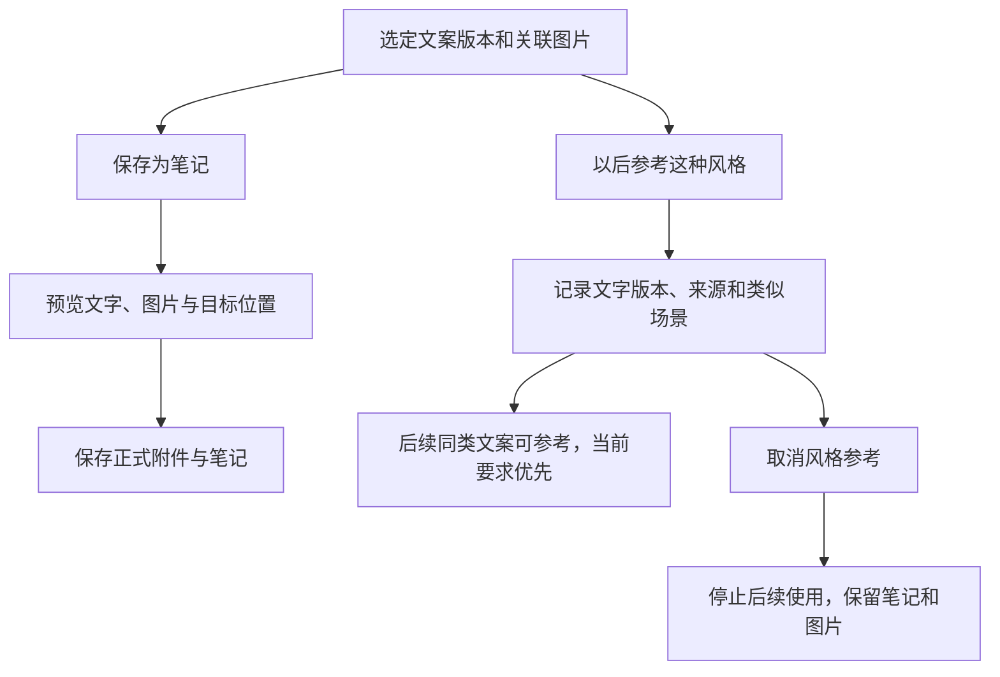

# PA Multimodal Chat Product Spec

Document status: Current
Updated: 2026-09-07
Work item: B-129
Decision: [DEC-030](../decisions/dec-030-multimodal-chat-image-copywriting.md)
Authority: B-129 用户已确认的图片理解、个性化文案、显式保存与风格参考产品契约。

本契约承接 DEC-030 中用户确认的产品选择，包括全部图片保留、同步提示、
写入边界及有限格式兼容。当前技术实现见 [Architecture](../../architecture/multimodal-chat-architecture.md)，
构建绑定的测试、生产服务与真实 UI 证据见 [首版限定验证](../../archive/2026/b129-multimodal-chat-validation.md)，
后续紧凑图片输入与保存表单的独有证据见 [图片体验验证](../../archive/2026/chat-image-experience-validation.md)。
验收证据的覆盖范围不能扩大为所有模型、设备和交互均已验证，也不自行授予发布权限。

## Problem And Product Outcome

- User problem: 用户有旅行照片、日常记录或想分享的图片，却难以迅速表达自己的
  感受；通用文案容易缺少个人背景，也可能把 AI 的措辞误当成用户的长期偏好。
- Product outcome: 在现有 Chat 中加入图片、理解内容并生成可继续修改的文字；
  用户选择后将图文保存为可追溯的笔记，并独立决定是否以后参考这类表达风格。
- North Star fit: 遵循[产品北极星](../pa-product-north-star.md)“随手记下，需要时
  自然浮现”。降低从生活素材到真实记录的摩擦，让有来源的旧笔记适时参与表达，
  保留原始材料，不用自动保存和自动偏好学习制造管理负担。

## Scope

### In Scope

- **B-129/REQ-01 — 首版范围与入口。** 在现有 Chat 提供图片理解、个性化文案和
  保存为笔记。支持通过适合设备的粘贴、拖入或选择文件入口添加外部图片，也可
  使用已有 vault 图片。桌面端和移动端分别可用；允许仅发送图片，不强制附文字
  或进入文案生成流程。
- **B-129/REQ-02 — 沿用当前 Chat 模型。** 不另设自动切换的视觉模型。能力已知
  不支持图片时，在添加入口说明原因并引导用户切换，保留文字；能力未知时允许
  添加和尝试发送，实际不支持的响应应保留草稿并引导切换。附图后切到不支持的
  模型，保留图片与文字，发送前要求切换模型或移除图片。剪贴板、文件读取或
  网络失败必须与模型不支持区分，不按 provider 名称猜测图片能力。
- **B-129/REQ-03 — 多图与同设备续聊。** 保留图片身份、顺序及本次使用关系，
  支持“只用第二张”等指令。同设备重开会话可以追问先前图片；当前附图、明确
  指向的旧图以及重试、工具调用中仍需要的图片不能静默丢失。图片缺失或超过
  处理、请求预算时说明实际原因并保留草稿，不能假装已经看过图片。
- **B-129/REQ-04 — 原图保留与追溯。** 外部图片原文件保存在 Obsidian 配置的
  附件目录下的 PA 子目录，例如 `pa-images`；原图不因生成处理副本而被覆盖。
  已有 vault 图片优先记录引用，避免重复导入。引用应可追溯到原文件及内容版本；
  重命名、移动、删除或内容替换需正确识别，不能把路径相同的新内容当作旧图。
  系统选图先转码时，不得将收到的副本冒称相册原文件或据此降格原图保留要求。
- **B-129/REQ-05 — 本地副本与清理。** 聊天显示轻量副本，处理缓存有总容量
  上限，可清理并从原图重建。删除聊天或清理缓存不删除原图或正式笔记附件。
  原图清理由用户主动发起，提供空间占用与已知引用信息；引用信息的覆盖范围
  必须真实，不能将“未找到引用”等同于“绝对无人使用”。
  2026-09-06 用户确认首版 iOS 由 PA 列出并打开原图，再由用户在 Obsidian
  文件管理中删除；Desktop 保留 PA 核对路径/hash 后移入回收站。两端均可
  清理处理缓存，不因 iOS 缺少路径证明而降低 Desktop 删除检查。
- **B-129/REQ-06 — 三类同步边界。** 原图子目录默认目标是排除 Obsidian Sync、
  Git 和 iCloud 同步。能够安全、可靠地自动配置时自动处理；无法自动完成时，
  通过首次导入提示和可再次访问的使用指南告知用户操作。分别反映各同步方式
  已完成、待用户配置或无法确认的情况，关闭提示不等于已排除。目录改变时重新
  说明适用配置；不能把 PA 的内容排除设置当作这些同步工具的设置。手动排除前
  无法确认是否已经上传时，按既有方案提示可能同步并提供指南，继续导入；不以
  完成手动配置或验证未上传为前置条件，也不增加额外确认门禁。
- **B-129/REQ-07 — 图片发送与隐私。** 仅处理用户加入当前聊天的图片，不扫描
  相册或附件文件夹。Provider 仅接收经过处理、移除 EXIF/GPS、拍摄时间和设备
  等敏感元数据的副本；原文件保持不变。首次使用清楚说明图片可见内容会发送给
  当前配置的 provider，后续普通使用不逐图打断。处理失败不自动改发原图。
- **B-129/REQ-08 — 文案事实与参考来源。** 当前要求决定写作目的和本次约束；
  图片提供可见信息；相关旧笔记仅提供有来源的背景；获授权的风格样例仅提供
  表达参考。不得将旧笔记中的人物、地点、时间和经历套到当前照片，也不能将
  样例中的经历当作当前事实。没有可用 Memory 时仍可基于本次图文回答。
- **B-129/REQ-09 — 正文与参考材料分离。** 可直接使用的文案正文与参考材料
  信息分开。复制文案只复制正文；背景材料和风格样例在按需展开的详情中区分。
  “本次参考材料”说明实际提供给模型的材料，不声称模型逐项采用，也不凭空
  生成引用或把图片推断标为用户已确认的事实。
  2026-09-06 用户确认完整回复仅为单个 JSON 代码块时可自动识别文案；仍须
  核对完整内容、本次请求及正常结束，混杂文字、格式错误或中断不自动生成版本。
- **B-129/REQ-10 — 显式保存固定版本。** 生成本身不创建笔记。用户点击“保存
  为笔记”后，预览并保存其选中的文字版本，包括最后的用户修改；保存及重试
  不经 LLM 再次改写。默认包含这版文案关联的全部图片，不区分“参考图”或
  “目标主题图”，不因用途自动筛除；只有用户明确调整才改变图片集合。回选旧版
  文案时恢复该版本对应的完整图片集合。保留写入预览、目标路径核对与结果反馈，
  写入能力的控制方式随 PA 能力契约承接，不固化为某个现有开关。
- **B-129/REQ-11 — 正式图文附件。** 图文保存按目标笔记的位置使用 Obsidian
  的附件目录及链接规则，以原图创建或安全复用正式附件。HEIC 采用用户于
  2026-09-06 确认的窄例外：正式保存 JPEG，原 HEIC 保留在 pa-images（既有
  vault 图片不移动），不额外复制正式 HEIC；笔记保留 JPEG 与原件的来源关联。
  其他设备可显示正常同步的 JPEG，但原件未同步时不能承诺取得 HEIC。
  正式附件独立于可清理
  的聊天缓存和排除同步的聊天原图目录，遵循用户正常的同步设置；若正常设置也
  排除了它们，应如实说明。2026-09-06 用户确认先登记保存记录、创建选定正文，
  再补齐图片与嵌入链接，以正确利用宿主附件规则。笔记保存与图片写入可能部分失败，必须明确已完成
  什么，保留草稿并支持核对后重试；不能遗失原图、制造重复附件或虚报全部成功。
- **B-129/REQ-12 — 保存不等于风格授权。** 可区分 AI 生成后被采纳的文字与
  用户修改稿，并追溯所选版本。保存、修改、“这次短一点”等本次要求均不创建
  长期风格偏好。自动 Memory/画像提取和最终写入准入也必须识别这条边界，不能
  通过助手回复、保存笔记或局部修改绕过独立的风格授权。
- **B-129/REQ-13 — 显式风格参考。** “以后参考这种风格”是独立于保存笔记的
  用户操作，只把所选文字版本用于类似场景的文案，当次要求优先。保留版本、
  来源、适用场景和授权依据，允许查看与取消；取消后停止后续使用，原笔记和
  图片仍保留。不得推导身份、性格或价值观，不默认影响其他场景或跨 vault。
  2026-09-06 用户确认旧兼容模式提供主动“检查并升级”入口；只在全部旧资料、
  来源和撤销状态可核对时切换，失败保持原状并解释原因。该操作不清库、不发送
  资料给 AI、不重建 Memory，也不自动开启提取；不能通过回退复活已忘记内容。
- **B-129/REQ-14 — Memory 与全局边界兼容。** 首版不自动索引图片或进行全库
  视觉检索。保存笔记的文字按既有来源资格与生成内容策略参与 Memory，不能
  因保存或用户改写就自动绕过该策略。图片、派生副本、旧笔记和风格样例的实际
  使用均遵守共享 Data Boundary；显式附图或风格操作不等于解除全局排除。
- **B-129/REQ-15 — 跨设备处理质量与失败恢复。** 输入格式、照片方向、小字
  截图、多图内存及存储配额都需按桌面和移动平台验证。显示、处理或导入失败
  要有可恢复状态，保留已有文字与可用图片。不能为简化实现默默排除尚未验证的
  格式、将动画静默取第一帧，或把不完整处理宣称为完整图片理解。
  用户于 2026-09-06 明确确认首版的动画 GIF/APNG/WebP、依赖外部资源 SVG
  保留原件并提示提供静态 PNG/JPEG，不自动抽帧或联网补齐。静态且可独立
  渲染的 SVG 仍可本地处理；完整动画理解和外部资源 SVG 渲染留到后续。

### Non-goals

- NG-01: 首版不包含图片生成、音频或视频理解，也不创建独立社交文案应用。
- NG-02: 不提供跨设备聊天历史同步或“手机发图后在电脑继续同一段聊天”的承诺。
- NG-03: 不自动扫描图片库，不建立图片 Memory，不把每次生成、保存或修改自动
  转为长期风格偏好。
- NG-04: 不自动发布到社交平台，不自动清理历史远程副本或改变已跟踪 Git 文件
  的跟踪状态；原图目录同步配置的范围见 REQ-06。
- NG-05: 不在本文选定新的图片解码库、原生桥接方案、固定压缩参数或 `.nosync`
  目录策略；这些不能由候选技术方案反向改变原图和媒体范围要求。
- NG-06: 首版不交付完整动画理解或依赖外部资源的 SVG 渲染；原文件保留及
  提供静态图的恢复入口仍属本版要求。

## User Flow And States

### 添加图片与生成

1. 用户在现有 Chat 添加图片；已知模型能力不支持时给出切换入口并保留文字。
2. 首次导入前说明原图保存位置、三类同步排除的适用情况与操作指引；首次图片
   使用说明 provider 会接收处理后的图片可见内容。手动排除或上传状态无法确认
   时告知可能同步并继续导入，不等待用户完成配置。普通后续使用不逐图重复提示。
3. 原图可追溯地保留后生成预览与发送副本；逐项展示处理中、可发送或失败状态。
   未发送图片在输入框内以单项缩略图呈现，直接可移除；点击查看大图、文件信息
   与原图操作。正常态不重复排列文件名、来源说明和导入按钮，失败恢复仍可发现。
   只发图片也是有效输入，可先简短回应可见内容再确认意图，不强制生成文案。
4. 用户可通过自然语言选择图片、补充事实或修改本次文案。先前图片仍可读取且
   符合边界时，用于同会话追问；无法使用时明确说明，不能仅凭摘要冒充重新看图。

### 保存与风格参考

两条操作互不代替；保存固定选中的内容，风格操作不隐式保存聊天中的所有草稿。
保存表单分开输入笔记标题与文件夹，默认位置仍为笔记库根目录；位置持续可见，
可展开更改。预览核对标题、位置、正文和图片数量，完整 Markdown 与附件文件名
保留在保存详情中；不要求用户先管理原图目录或理解内部附件命名。
保存结果需区分完成、部分完成和失败，并保留可继续处理的原始选择。保存预览
中的文字改动应更新本次待保存版本，不改变其他回答或原始图片。
图片用途不影响保留：例如用文案截图 B 辅助旅行照 A 写作，保存该版本时默认
同时包含 A 和 B；不增加主体图/参考图分类或自动筛选步骤。

### 空态与失败状态

| 状态 | 用户可见结果与下一步 |
| --- | --- |
| 没有 Memory 或相关笔记 | 直接根据图片与当前要求回答，不要求先准备 Memory |
| 模型已知不支持 / 实际响应不支持 | 如实区分原因，保留草稿并引导切换 |
| 原图缺失、内容被替换或读取受限 | 指出不能使用的图片，允许重新提供或调整选择 |
| 格式处理失败、图片过大或请求预算不足 | 指明受影响图片和恢复动作，不静默移除必需图片 |
| 本地存储不足或持久化不可用 | 如实说明未成功保留的内容；不能宣称重开后一定可用 |
| 笔记或附件部分保存失败 | 显示已完成部分，保留固定文字版本与图片选择供重试 |
| 同步排除无法自动完成或验证 | 提示可能同步并提供指引，继续导入；不宣称该目录已仅保留本地 |

## Trust, Data And Authority

### 数据分层

| 数据 | 位置与用途 | 清理与同步边界 |
| --- | --- | --- |
| 外部原图 / 已有 vault 图片 | 附件目录 PA 子目录中的原文件，或既有文件引用 | 原图手动清理；PA 原图子目录目标为排除三类同步，既有文件的同步设置不自动改变 |
| 预览与发送副本 | 本设备有容量上限的可重建缓存 | 可清理；去除敏感元数据的副本才可发给 provider |
| 聊天中的图片引用 | 随本设备聊天历史追溯图片身份、版本和顺序 | 不携带原图二进制；不由 vault 图片存在推导跨设备续聊 |
| 正式笔记和附件 | 用户明确保存的文字版本及附件；HEIC 使用 JPEG 并记录原件关联，其余格式沿原件规则 | 遵循笔记与正常附件同步配置，聊天清理不删除；HEIC 原件未同步时，其他设备仅有 JPEG |
| 风格参考 | 用户明确指定的文字版本、来源、场景和授权 | 可查看、取消；不随保存自动产生，不扩大既有 Memory 权限 |

原图可能保留拍摄位置等元数据；保存笔记中的原图附件也可能保留这些信息。
HEIC 导出的正式 JPEG 与 provider 输入副本均清除源敏感元数据；这不代表
已编辑原文件，也不代表遮住
图片可见内容。首次说明与使用指南应准确表达该区别。

### 与当前契约的关系

- [Data Boundary](./pa-data-boundary-product-spec.md)仍管理来源资格、排除范围、
  provider 输入和生成内容策略。PA 排除目录控制内容使用，Obsidian Sync、Git、
  iCloud 排除目录控制外部同步，两者不能相互替代。若用户另将原图目录排除于
  PA，读取仍需遵守已有明确的单次授权规则，不能因图片入口自动绕过。
- [Memory 类型与画像边界](./pa-memory-type-taxonomy-product-spec.md)以及
  [Memory Control Center](./pa-memory-control-center-product-spec.md)继续管理
  长期信息的适用范围、使用和恢复。风格操作只增加明确样例授权，不提供普通
  保存、模型推断、全局范围或敏感画像的新准入路径。
- [Write Action Framework](../../architecture/write-action-framework-sdd.md)
  提供现有写入设计依据。图文保存通过固定版本预览、目标核对和部分失败恢复实现，
  不能将现有文本创建能力解释为已经具备多文件事务或二进制回滚能力。用户在
  2026-09-06 的评审处置中明确：现有写入权限控制后续将随 PA 能力调整取消，
  当前方案不构成权限绕过。因此不将 Operations 开关关闭/预览后关闭场景新增为
  B-129 的独立验收门禁；权限迁移由后续 PA 能力工作承接。本次仅记录该边界，
  不表示运行时控制已经取消，也不改变用户显式保存及写入目标核对的要求。

## Acceptance Criteria

以下为稳定验收标准，每组与同号 REQ 对应；实际覆盖与限制见限定验证证据，
不把服务回执等同于全部 UI 交互或真实 provider 效果。

- **B-129/AC-01:** 桌面和移动端各能添加图片并发送图片独立消息；理解、文案
  修改和显式保存走现有 Chat，不强制新建独立写作流程。
- **B-129/AC-02:** 已知不支持、能力未知、发送后报不支持和附图后切换模型四条
  路径均符合 REQ-02；原有文字与已成功加入的图片不因错误或切换丢失。
- **B-129/AC-03:** 多图指代、同设备重开追问、重试和工具续轮均使用正确的必需
  图片；预算不足或原图不可用时明确失败，不通过纯文本降级伪称完成。
- **B-129/AC-04:** 外部原文件按配置存放且内容不被压缩覆盖，已有 vault 图可
  复用；重命名、移动、删除和同路径替换均不造成错误关联。移动导入须证明取得
  所需原文件，系统转码副本不能通过重新命名被标成原图。
- **B-129/AC-05:** 缓存容量受控、清理后可从可用原图重建；删除聊天不删原图
  或正式附件。手动清理提供真实空间与已知引用信息，并限定删除目标。
- **B-129/AC-06:** Obsidian Sync、Git、iCloud 分别具有可信的处理结果或操作
  指引；关闭首次提示、目录改名、已有远程副本或已跟踪 Git 文件均不会被误报为
  已完成排除。手动排除前无法确认上传状态时，提示可能同步并继续导入，不要求
  先完成配置或证明未上传。PA 内容排除设置不被误用为同步设置。
- **B-129/AC-07:** 实际 provider 请求只包含去除敏感元数据的处理副本和允许的
  参考内容；处理失败不发送原图，不发生后台相册扫描，首次说明可再次查看。
- **B-129/AC-08:** 旧旅行笔记和风格样例中的地点、人物或经历不会冒充本次
  图片事实；无 Memory 时仍完成基于当前输入的回答。
- **B-129/AC-09:** 复制文案不混入参考说明，展开详情可区分真实提供的背景
  材料和风格样例，不将“提供给模型”表述为模型已逐项采纳。
  裸 JSON 和单个完整 JSON 代码块通过同一内容/请求/完成校验；额外说明、
  多块、错误或中断保留人工恢复，文案字符和图片关联不因外层格式改变。
- **B-129/AC-10:** 保存结果与用户最后选定的文字版本一致，默认包含该版本的
  全部关联图片，不因参考/主题用途自动筛除；旅行照 A 加文案截图 B 的改写及
  回选旧版路径均保留相应完整图片集合，只有用户明确调整才改变集合。保存和
  重试不触发文案重新生成，不因生成本身写入笔记。
- **B-129/AC-11:** 分别覆盖 Obsidian 根目录、指定目录、笔记同目录、笔记相对
  子目录的附件规则；目标笔记不在当前活动笔记位置时仍生成正确附件与链接。
  任一步失败真实返回部分结果，重试复用已核对的结果，不删除原图或既有附件。
  HEIC 保存生成可独立显示的正式 JPEG，保留原件路径/内容版本关联，不另存正式
  HEIC；清聊天缓存后 JPEG 仍可读，另一设备缺少原件时不误称可打开原件。
- **B-129/AC-12:** AI 采纳稿与用户改稿可区分；仅生成、保存、编辑或提出本次
  修改要求均不产生长期风格记录，包括自动提取和最终 Memory 准入路径。
- **B-129/AC-13:** 只有明确的风格操作建立对应版本和来源的参考；旅行类文案
  不自动影响工作邮件，当次要求可覆盖风格。取消后后续生成不再使用，原笔记和
  图片仍在，未扩展跨 vault 或画像权限。
  旧兼容态升级成功后通过相同风格闭环；预检不完整、来源变化、未完成撤销或
  提交失败时，旧资料与投影保持原状且原因可见，后续恢复不复活已忘记内容。
- **B-129/AC-14:** 无自动图片索引或全库视觉检索；生成笔记及派生内容仍通过
  当前共享边界，排除状态改变后旧引用、缓存与风格来源不能绕过实际输入检查。
- **B-129/AC-15:** 下述格式矩阵和移动资源边界具有与支持声明一致的验证证据；
  不能以未经批准的媒体范围缩减通过验收。失败、取消、配额不足均可恢复草稿，
  未静默改发原图、截取动画首帧或丢弃当前必需图片。
  动画和外部资源 SVG 明确提示本版处理边界并保留原件，待用户调整输入，不
  把拒绝处理或新提供的静态图冒充原媒体已完整理解。

## Engineering Validation Boundary

已确认的产品范围不重新提问。技术契约见
[Architecture](../../architecture/multimodal-chat-architecture.md)。
以下矩阵是平台证据边界；验证结果若需要改变原图、格式、存储或隐私要求，
须回到产品决策，不能自行降低要求，也不能以计划任务代替支持证据。

### 格式与平台验收矩阵

本表定义持续保持的格式契约，不把原型可行性等同于任意输入的支持承诺。
原型与生产集成证据分别记录于 [限定验证](../../archive/2026/b129-multimodal-chat-validation.md)。

| 输入 | 桌面与移动端验证维度 | 处理失败或未证实时的边界 |
| --- | --- | --- |
| JPEG | 原文件取得、EXIF 方向、元数据清除、照片压缩与小字质量 | 不覆盖原图，不把方向错误或元数据残留视为可发送 |
| PNG | 透明度、截图小字、较大像素尺寸的内存、元数据清除 | 不以无提示降质掩盖无法辨认的内容 |
| WebP | 两端实际解码、静态与动画识别、透明度及导出 | 静态按平台验证；动画保留原件并提示提供静态图，不静默转为单帧 |
| HEIC/HEIF | 系统相册是否给出原文件、设备已有解码/转换能力、方向与色彩 | 用户于 2026-09-06 确认按设备能力本地转 JPEG；无法转换时保留已取得原件和当前草稿，提示提供 JPEG。不内置/自动安装解码器、不远程转码、不保证所有设备自动处理，不把副本标为原件 |
| GIF/APNG/动画 WebP | 静态/动画识别及原文件保留；动画恢复提示 | 动画按用户确认延期完整理解，提示提供静态 PNG/JPEG；静态 GIF 仍按静态解码验证，不能仅凭扩展名误判动画 |
| SVG | 静态自包含识别、安全本地栅格化、原文件保留 | 依赖外部资源时保留并提示静态图，不联网补齐或宣称完整渲染；自包含也不得执行脚本或注入 DOM |

## Current Implementation And Limits

- 原图、用途不同的处理副本、历史引用和正式附件分别管理；固定会话锚点与
  Obsidian 公共附件规则决定实际路径。清理聊天不删除原件或正式文件。
- B-128 上下文链路承接图片身份、最终请求准入、工具续轮和重试；文本摘要不
  代替图像，图片字节不进入历史文字、摘要或普通日志。
- 文案通过严格完整终态协议形成固定版本，异常可人工恢复；保存与重试核对
  确切正文、全部选定素材与已写 hash，不重新调用模型，不宣称跨文件原子事务。
- 显式风格按确切版本、四维场景与可撤销治理使用，独立于自动提取开关；仍受
  Memory 总开关、来源边界和共享预算约束。生成及保存不自动成为长期偏好。
- 真实 Desktop/iOS 主路径与服务证据已经保留；自动 V1 使用本地 SDK，风格
  remember/pause 为生产服务调用，不能据此声称全部治理 UI 或远程文案质量通过。
- 旧兼容态安全升级的成功与拒绝分支有源码回归；实测两端旧库因证据不足安全
  拒绝，资料与旧模式保留，未证明这些旧库成功升级。最低 1.11.4 为官方/源码
  依据，未安装旧版实测；各输入手势与任意图片质量不作穷举保证。
- 后续完整动画/外部资源 SVG、图片生成、跨设备续聊分别由
  [B-132/B-133/B-134](../../backlog.md#已延期的产品与工程工作) 承接，未定优先级、
  二期组合或工期。未来扩展须先明确产品、资源、数据与网络边界。
- 运行时技术契约见 [Architecture](../../architecture/multimodal-chat-architecture.md)，
  操作见 [使用指南](../../guides/multimodal-chat-user-guide.md)，原始回执和限定验收见
  [历史验证](../../archive/2026/b129-multimodal-chat-validation.md)。是否已发布以发布
  元数据为准，开发完成或本地整合均不等于 Shipped。
