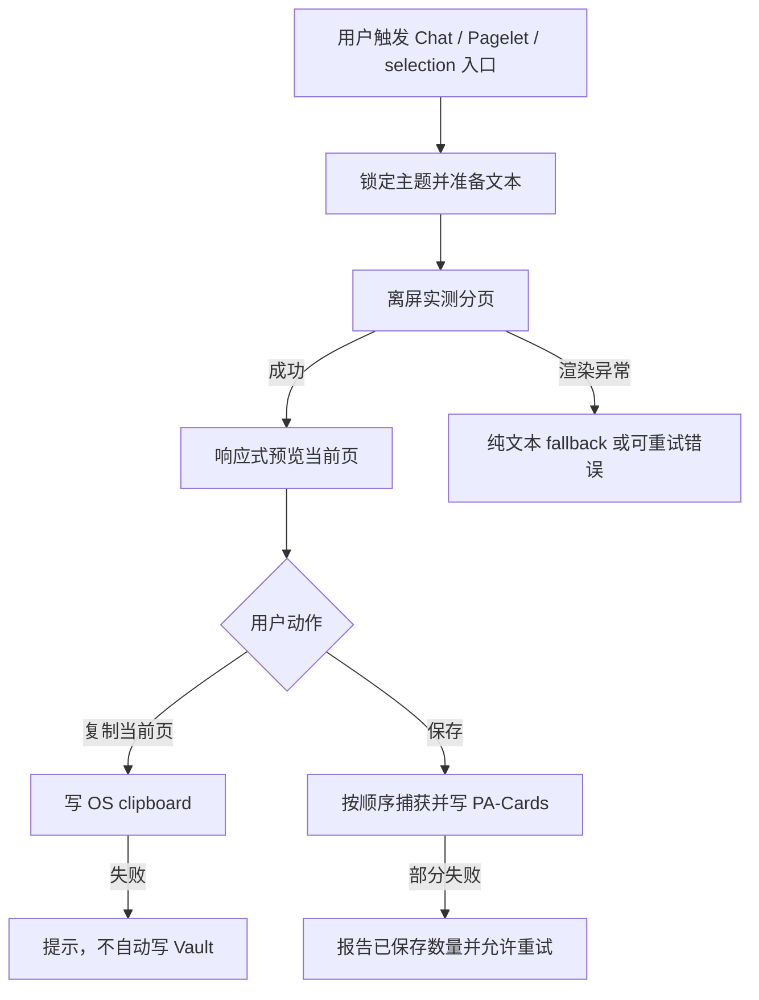

# PA Share Card Product Spec

Document status: Approved
Updated: 2026-08-04
Work item: B-124
Decision: [DEC-026 — Share Card 采用本地、显式导出的文本卡片](../decisions/dec-026-local-share-card.md)
Authority: Share Card 的入口、可分享内容、视觉、分页、导出、失败、数据与兼容性边界。

## Problem And Product Outcome

- User problem: 用户想复用一段 PA 回复或洞察时，需要手工排版或截取带 UI chrome 的
  屏幕内容，难以得到安静、清晰且一致的分享图片。
- Product outcome: 用户从当前内容自然地打开一张可预览、可分页、可复制或保存的
  本地品牌卡片，不引入发布流程或新的管理负担。
- North Star fit: 让已返回的有价值内容更容易被用户带走和复用；入口由用户主动触发、
  无队列、无 provider 调用、无意外写入，保持“安静且可信”。

## Scope

### In Scope

- B-124/REQ-01: 三个入口使用同一 `ShareCardData` 契约。Chat 仅为已完成、非空的
  assistant 回复显示低优先级 action；Pagelet 仅提交当前 visible findings，Prepared
  read-only Panel 不可分享；编辑器命令仅在 selection trim 后非空时可执行，但 payload
  保留原始 selection 的空白、缩进与 Markdown。用户 Chat 消息、生成中内容、dismissed
  finding、隐藏缓存与空内容不进入卡片。
  `completed_with_warning` 只有在 warning 不代表 provider error、assistant idle timeout
  或 wall-clock interruption 时才属于已完成；带部分文本的上述中断必须 fail closed。
- B-124/REQ-02: Chat/Pagelet 卡片可显示稳定产品来源标签，selection 默认不显示文件名
  或 Vault path。Pagelet findings 只组合当前可见的 title、description、insight text；
  重复字段只输出一次，不加入隐藏 diagnostics、action、provider metadata 或来源路径。
- B-124/REQ-03: v1 卡片固定为 `540×720` CSS px、DPR 2 PNG（`1080×1440`），提供 warm
  light 与 warm dark 两个由 Modal 打开时当前主题选定的样式。每页有一致内容区、细
  divider、低调品牌和必要页码；预览响应 modal/viewport，导出尺寸不受预览缩放影响。
- B-124/REQ-04: 文本型 Markdown 支持 headings、paragraphs、emphasis、lists、quotes、
  links、inline/fenced code。分页必须使用最终 card CSS 的实际 rendered height，优先语义
  块边界；超高单块可继续拆分但不得丢字、重排页序或产生空页。原始内容不得因
  frontmatter-like 开头或 thematic break 被静默删除。v1 最多处理 50,000 characters / 24
  pages；超限明确提示缩短内容，不产生截断卡片。
- B-124/REQ-05: 远程图片、Vault embeds、iframes、audio/video、canvas、运行型 diagram
  与其他非文本资源不发起抓取；它们以可理解的文本替代或从 card DOM 移除。链接可
  保留文字但不在预览/导出时导航或请求资源。
- B-124/REQ-06: `Copy current page` 只写 OS clipboard；API 不可用、permission/gesture
  失败或 capture 失败时显示本地化错误，并保持 Modal 可重试，不自动保存。`Save image`
  单页保存当前页；`Save all pages` 按页捕获并按顺序写入 `PA-Cards/`，最终只汇总一次。
- B-124/REQ-07: 保存使用 timestamp batch name 和确定性 page suffix，整批避让 Vault
  已有 path，不覆盖旧文件。完整成功提示数量和目录；部分失败提示已保存数量，不把
  partial success 冒充完整成功，也不删除已经成功创建的本轮文件。
- B-124/REQ-08: preview loading、render fallback、pagination/export failure 与 busy state
  都有可读状态。前后页按钮具备本地化 accessible name、disabled state 和页码；action
  在导出期间 exactly once，关闭 Modal 后不得继续写 UI。
- B-124/REQ-09: Share Card 只处理调用方已经持有的文本，不调用 AI provider、不上传、
  不使用 CORS proxy、不扩大 Vault read、不新增设置/ledger。只有用户点击 Save 才产生
  Vault PNG；失败后重试仍由用户决定。
- B-124/REQ-10: Desktop、iOS 与 Android 共享核心逻辑；clipboard capability 按当前
  Modal window 运行时检测。Modal lifecycle 使用 Obsidian `Component` owner 和 owner
  document/window；plugin unload/Modal close 清理 render owner、离屏 DOM 与 pending token。

### Non-goals

- NG-01: 不做通用笔记/页面截图、整段 Chat transcript、Bubble/Pet 或 Obsidian UI 捕获。
- NG-02: 不提供模板编辑器、比例/字体/品牌/保存目录设置、无品牌导出或历史卡片库。
- NG-03: 不把图片上传到社媒、云盘或外部服务，不接入 account/system share flow。
- NG-04: 不承诺 v1 渲染远程媒体、Vault transclusion、Mermaid/Canvas/SVG 图表或交互组件。
- NG-05: 不修改原始 Markdown、Chat history、Pagelet finding、Memory 或 Review Queue。
- NG-06: 不分享 Prepared read-only raw background cache；若该内容未来需要导出，必须以
  独立 `shareable` capability 重新批准，不能复用 read-only 推断写权限。

## User Flow And States

| State | Visible behavior | Allowed action |
| --- | --- | --- |
| Preparing | 显示本地化准备状态；export disabled | Close |
| Ready, single page | 预览 + Copy current page + Save image | Copy / Save / Close |
| Ready, multiple pages | 预览 + page nav + Copy current page + Save all pages | Navigate / Copy / Save all / Close |
| Exporting | 当前动作 busy，其余 export/navigation disabled | Close；异步结果不得回写已关闭 UI |
| Clipboard unavailable/failed | 保留预览并给出可恢复提示 | 用户可显式 Save 或 retry |
| Capture/save failed | 保留预览；报告完整或 partial failure | Retry / Close |

## Trust, Data And Authority

- Source evidence: 只使用当前 assistant response、Pagelet 当前可见投影或原始 editor
  selection；不重新读取整篇笔记，也不把隐藏 metadata 当作分享内容。
- Data sent / stored: 预览与 PNG capture 全部本地；Copy 写 OS clipboard，Save 写
  `PA-Cards/*.png`。不发送 provider/network request。
- User disclosure / confirmation: 打开 Modal 无 durable effect；Copy/Save 按钮就是当前
  低后果动作的明确授权，不增加阻断确认。Copy 失败不升级为 Save 权限。
- Reversibility / recovery: 保存的 PNG 是普通 Vault 文件，可由用户通过 Obsidian 管理；
  原始内容不变，现有文件不覆盖。失败可在同一 Modal 重试。

## Acceptance Criteria

- B-124/AC-01: 历史和新完成的 assistant 回复出现可访问的 Share Card action；用户消息、
  生成中空回复和 terminal error 不出现该 action，点击使用最新 `copyContent/sourcePath`。
- B-124/AC-02: Pagelet 只导出当前 visible findings；dismissed/hidden finding、Prepared
  read-only content、diagnostics/action/source path 不进入 payload，空 payload 不执行分享。
- B-124/AC-03: editor selection command 只在 trim 后非空时可执行，payload 保留原始
  Markdown/空白且不自动暴露文件名。
- B-124/AC-04: light/dark 预览和 PNG 均为固定设计；窄桌面/移动 viewport 可完整查看预览
  与 44px actions，导出 blob 的像素尺寸为 `1080×1440`。
- B-124/AC-05: 覆盖中英文、列表、引用、代码块、长段落与 50+ 行内容的测试证明顺序
  保持、无丢字/空页；运行时测量 smoke 证明每页 body 无 vertical overflow。
- B-124/AC-06: media/embed 输入不会触发 proxy/network 或出现在 capture DOM；文本内容仍
  可理解，Markdown render 抛错时使用 plain-text fallback。
- B-124/AC-07: clipboard success 只复制当前页；clipboard API 缺失/拒绝/capture 失败不
  创建 Vault 文件，错误后可继续显式保存或重试。
- B-124/AC-08: 单页与多页保存数量、顺序、suffix、unique batch 与 partial failure 有
  focused tests；同名文件永不覆盖，成功/失败 notice 与真实结果一致。
- B-124/AC-09: 快速切页、重复点击、导出中 close 与 Modal reopen 不产生并发写、stale
  preview、遗漏 cleanup 或 unhandled rejection。
- B-124/AC-10: focused Jest、typecheck、docs/community scan、lint/build/bundle audit 通过，
  并在已部署 Obsidian test vault 观察三个入口、两种主题、分页、clipboard/save 与 preview/PNG 一致性。

## Open Decisions

无阻断决定。v1 已按 DEC-026 固定比例、品牌、入口、Prepared read-only、明确保存和
text-first 边界；模板自定义、媒体捕获、系统分享和外部发布只能由 revisit trigger 另开 work item。

## Delivery Handoff

- Active Package: [Share Card Development Track](../../development/active/share-card/README.md)
- Architecture contracts: [Approved Share Card SDD](../../development/active/share-card/sdd.md)
- Release / rollout boundary: 本工作项只完成 validated implementation；commit、closeout、
  beta/stable packaging、push 与 release 均需独立授权。
